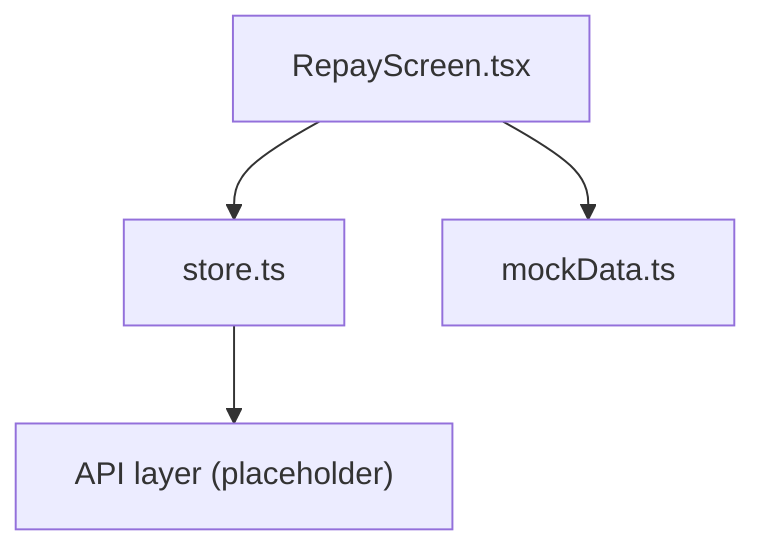
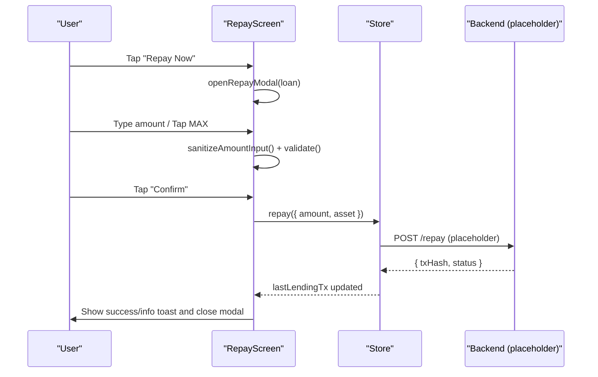
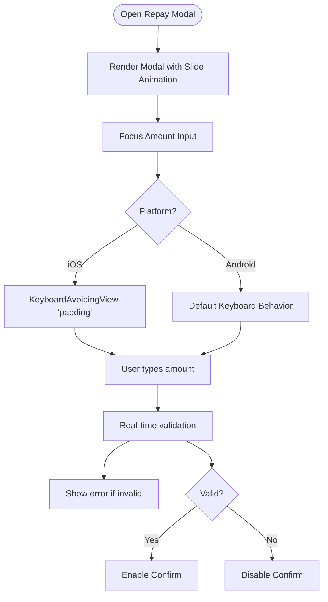
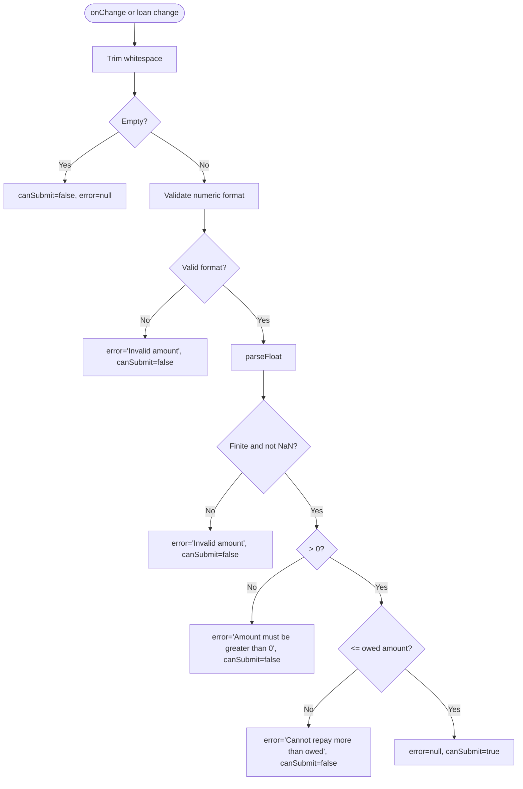
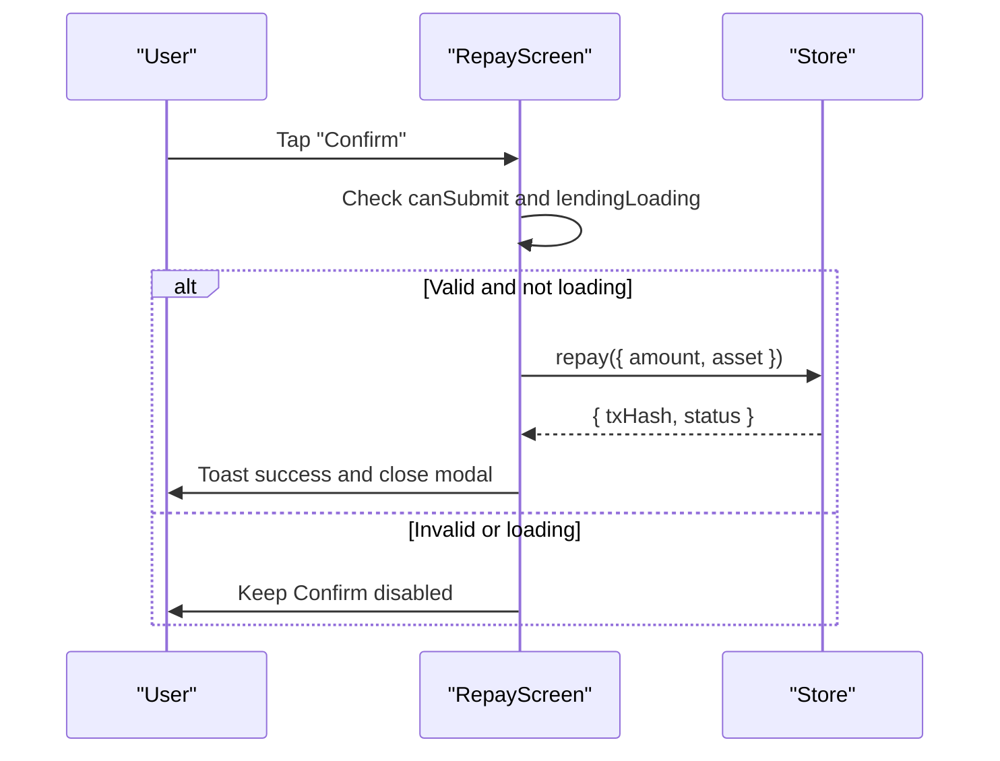
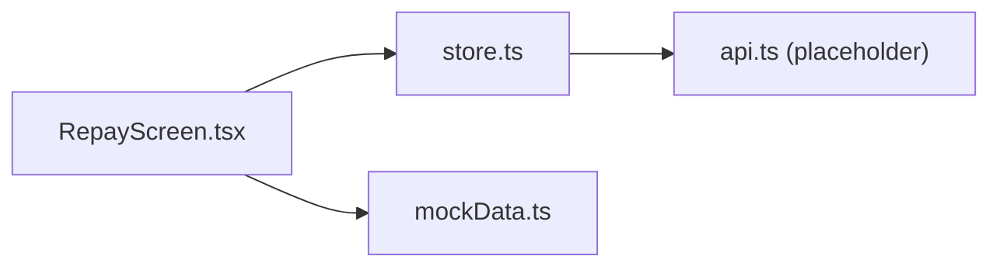

# Repayment Modal & Input Handling

<cite>
**Referenced Files in This Document**
- [RepayScreen.tsx](file://veilend-mobile/src/screens/RepayScreen.tsx)
- [store.ts](file://veilend-mobile/src/store/store.ts)
- [mockData.ts](file://veilend-mobile/src/data/mockData.ts)
</cite>

## Table of Contents
1. [Introduction](#introduction)
2. [Project Structure](#project-structure)
3. [Core Components](#core-components)
4. [Architecture Overview](#architecture-overview)
5. [Detailed Component Analysis](#detailed-component-analysis)
6. [Dependency Analysis](#dependency-analysis)
7. [Performance Considerations](#performance-considerations)
8. [Troubleshooting Guide](#troubleshooting-guide)
9. [Conclusion](#conclusion)

## Introduction
This document explains the repayment modal implementation in the mobile application, focusing on how user input is presented and validated during loan repayments. It covers:
- Modal presentation with slide animation
- Keyboard avoidance behavior across iOS and Android
- Amount input sanitization to prevent invalid characters and multiple decimal points
- MAX button functionality for full repayment
- Real-time validation rules including positive number checks and amount limits
- User feedback mechanisms for errors and submission states

## Project Structure
The repayment flow lives primarily in the mobile screens and store:
- RepayScreen.tsx implements the UI, modal, keyboard handling, input sanitization, validation, and confirmation logic
- store.ts provides the lending actions (including repay), loading state, and mock transaction handling
- mockData.ts supplies sample loan positions used by the screen

**Diagram sources**
- [RepayScreen.tsx:1-200](file://veilend-mobile/src/screens/RepayScreen.tsx#L1-L200)
- [store.ts:254-308](file://veilend-mobile/src/store/store.ts#L254-L308)
- [mockData.ts:72-91](file://veilend-mobile/src/data/mockData.ts#L72-L91)

**Section sources**
- [RepayScreen.tsx:1-200](file://veilend-mobile/src/screens/RepayScreen.tsx#L1-L200)
- [store.ts:254-308](file://veilend-mobile/src/store/store.ts#L254-L308)
- [mockData.ts:72-91](file://veilend-mobile/src/data/mockData.ts#L72-L91)

## Core Components
- RepayScreen: Renders active loans and a bottom sheet-style modal for repaying a selected loan. It handles:
  - Sanitizing user input via sanitizeAmountInput
  - Real-time validation using useMemo to compute error and canSubmit
  - KeyboardAvoidingView for platform-specific keyboard avoidance
  - MAX button to set the amount to the owed value
  - Confirmation flow that calls store.repay and shows toast feedback
- Store (Zustand): Provides lendingLoading flag and repay function; currently returns mock transactions and updates lastLendingTx
- Mock data: Supplies borrowed positions that drive the list and modal context

Key responsibilities:
- Input sanitization prevents non-numeric characters and multiple decimals
- Validation enforces positive amounts and does not allow exceeding the owed amount
- UX feedback includes inline error text and disabled confirm while invalid or loading

**Section sources**
- [RepayScreen.tsx:9-16](file://veilend-mobile/src/screens/RepayScreen.tsx#L9-L16)
- [RepayScreen.tsx:32-66](file://veilend-mobile/src/screens/RepayScreen.tsx#L32-L66)
- [RepayScreen.tsx:148-199](file://veilend-mobile/src/screens/RepayScreen.tsx#L148-L199)
- [store.ts:296-308](file://veilend-mobile/src/store/store.ts#L296-L308)
- [mockData.ts:72-91](file://veilend-mobile/src/data/mockData.ts#L72-L91)

## Architecture Overview
The repayment modal follows a clear sequence from user interaction to submission:

**Diagram sources**
- [RepayScreen.tsx:26-30](file://veilend-mobile/src/screens/RepayScreen.tsx#L26-L30)
- [RepayScreen.tsx:32-66](file://veilend-mobile/src/screens/RepayScreen.tsx#L32-L66)
- [RepayScreen.tsx:68-80](file://veilend-mobile/src/screens/RepayScreen.tsx#L68-L80)
- [store.ts:296-308](file://veilend-mobile/src/store/store.ts#L296-L308)

## Detailed Component Analysis

### Modal Presentation and Keyboard Avoidance
- The modal uses a transparent overlay with slide animation to present the repayment form from the bottom
- KeyboardAvoidingView applies platform-aware behavior:
  - iOS: padding mode to avoid keyboard overlap
  - Android: default behavior without explicit mode
- The modal contains:
  - Title indicating the asset being repaid
  - TextInput for amount with decimal-pad keyboard
  - MAX button to fill the owed amount
  - Inline error message when validation fails
  - Cancel and Confirm buttons; Confirm is disabled while invalid or loading

**Diagram sources**
- [RepayScreen.tsx:148-199](file://veilend-mobile/src/screens/RepayScreen.tsx#L148-L199)

**Section sources**
- [RepayScreen.tsx:148-199](file://veilend-mobile/src/screens/RepayScreen.tsx#L148-L199)

### Amount Input Sanitization: sanitizeAmountInput
Purpose:
- Restrict input to digits and at most one decimal point
- Remove any non-numeric characters
- Prevent multiple decimal points by keeping only the first dot and stripping subsequent ones

Behavior:
- Strips all characters except digits and periods
- Finds the first period index
- If found, keeps everything up to and including the first period, then removes any additional periods after it
- Returns the cleaned string for display and validation

Examples:
- Input "12a3.45.b" → "123.45"
- Input ".789" → ".789"
- Input "100.." → "100."
- Input "-10.5" → "10.5"

Edge cases handled:
- Multiple dots are collapsed to a single dot
- Negative signs and other symbols are removed
- Leading/trailing spaces are not trimmed here; trimming occurs in validation

**Section sources**
- [RepayScreen.tsx:9-16](file://veilend-mobile/src/screens/RepayScreen.tsx#L9-L16)

### Validation Rules and Real-Time Error Feedback
Validation runs whenever the amount changes or the selected loan changes. It computes an error message and whether the Confirm button should be enabled.

Rules:
- Empty input: no error but cannot submit
- Format check: must match a valid numeric pattern with optional decimal
- Numeric parse: must be a finite number
- Positive check: amount must be greater than zero
- Limit check: cannot exceed the owed amount for the selected loan

Feedback:
- Inline error text displayed below the input when invalid
- Confirm button disabled when invalid or when lendingLoading is true
- On successful submission, a success toast is shown; on failure, an info toast indicates offline/mock behavior

**Diagram sources**
- [RepayScreen.tsx:42-66](file://veilend-mobile/src/screens/RepayScreen.tsx#L42-L66)

**Section sources**
- [RepayScreen.tsx:42-66](file://veilend-mobile/src/screens/RepayScreen.tsx#L42-L66)

### MAX Button Functionality
- When tapped, sets the amount to the owed amount of the selected loan
- Only activates if a loan is selected and has an amount property
- After setting, validation re-runs and enables Confirm if the value is valid

Use case:
- Quickly repay the entire outstanding balance without manual typing

**Section sources**
- [RepayScreen.tsx:36-40](file://veilend-mobile/src/screens/RepayScreen.tsx#L36-L40)

### Submission Flow and User Feedback
- Confirm triggers repay from the store with the sanitized amount and selected asset
- While submitting, lendingLoading disables the Confirm button and shows an activity indicator
- Success path:
  - Store returns a mock transaction and updates lastLendingTx
  - Screen shows a success toast and closes the modal
- Failure path:
  - Catches error, logs a mock transaction, shows an info toast indicating offline mode, and closes the modal

**Diagram sources**
- [RepayScreen.tsx:68-80](file://veilend-mobile/src/screens/RepayScreen.tsx#L68-L80)
- [store.ts:296-308](file://veilend-mobile/src/store/store.ts#L296-L308)

**Section sources**
- [RepayScreen.tsx:68-80](file://veilend-mobile/src/screens/RepayScreen.tsx#L68-L80)
- [store.ts:296-308](file://veilend-mobile/src/store/store.ts#L296-L308)

## Dependency Analysis
- RepayScreen depends on:
  - Zustand store for lendingLoading and repay action
  - Mock data for active loans
  - React Native primitives for modal, keyboard avoidance, and input
- Store depends on:
  - Placeholder API layer for future integration
  - Secure storage utilities for auth persistence (not directly used by repayment flow)

**Diagram sources**
- [RepayScreen.tsx:1-8](file://veilend-mobile/src/screens/RepayScreen.tsx#L1-L8)
- [store.ts:1-5](file://veilend-mobile/src/store/store.ts#L1-L5)
- [mockData.ts:72-91](file://veilend-mobile/src/data/mockData.ts#L72-L91)

**Section sources**
- [RepayScreen.tsx:1-8](file://veilend-mobile/src/screens/RepayScreen.tsx#L1-L8)
- [store.ts:1-5](file://veilend-mobile/src/store/store.ts#L1-L5)
- [mockData.ts:72-91](file://veilend-mobile/src/data/mockData.ts#L72-L91)

## Performance Considerations
- Input sanitization runs on every keystroke; ensure it remains lightweight (current regex-based approach is efficient)
- Validation uses useMemo to avoid unnecessary recalculations unless dependencies change
- Debouncing could be considered if validation becomes expensive in future enhancements
- Avoid heavy operations inside onChangeText; keep only sanitization and state updates there

[No sources needed since this section provides general guidance]

## Troubleshooting Guide
Common issues and resolutions:
- Invalid characters appear in input:
  - Ensure sanitizeAmountInput is applied before updating state
  - Verify onChangeText calls sanitizeAmountInput
- Multiple decimal points accepted:
  - Confirm sanitizeAmountInput strips extra dots beyond the first
- Confirm button stays disabled:
  - Check validation rules: empty, format, finite, positive, and limit checks
  - Ensure lendingLoading is false
- Keyboard overlaps input on iOS:
  - Verify KeyboardAvoidingView behavior is set to 'padding' on iOS
- MAX button does nothing:
  - Confirm a loan is selected and has an amount property
- Submission not closing modal:
  - Ensure confirmRepay sets modalVisible to false in both success and error paths

**Section sources**
- [RepayScreen.tsx:32-66](file://veilend-mobile/src/screens/RepayScreen.tsx#L32-L66)
- [RepayScreen.tsx:68-80](file://veilend-mobile/src/screens/RepayScreen.tsx#L68-L80)
- [RepayScreen.tsx:148-199](file://veilend-mobile/src/screens/RepayScreen.tsx#L148-L199)

## Conclusion
The repayment modal provides a robust, user-friendly experience for entering and validating loan repayment amounts. It combines strict input sanitization, real-time validation, and platform-aware keyboard handling to ensure accurate submissions. The MAX button streamlines full repayment, while clear error messages and loading states guide users through the process. Future enhancements can integrate live backend calls and richer validation contexts (e.g., available balances) while preserving the current clean separation between UI and state management.