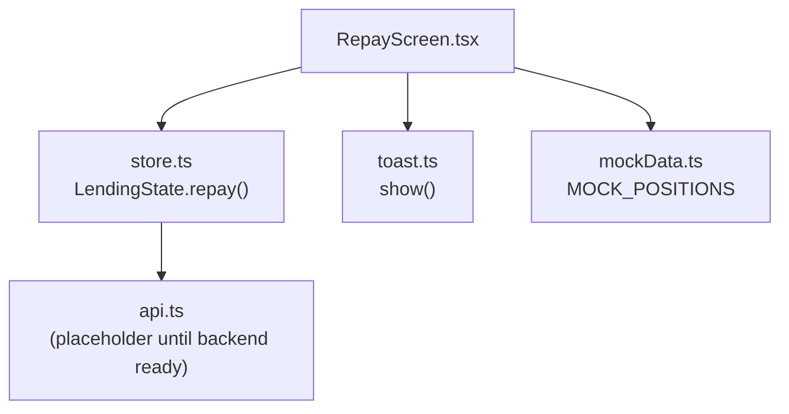
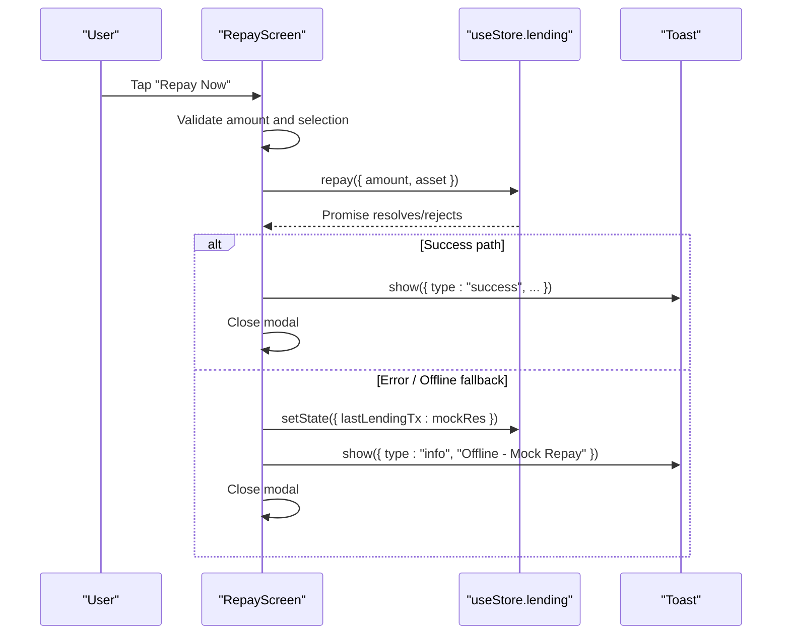
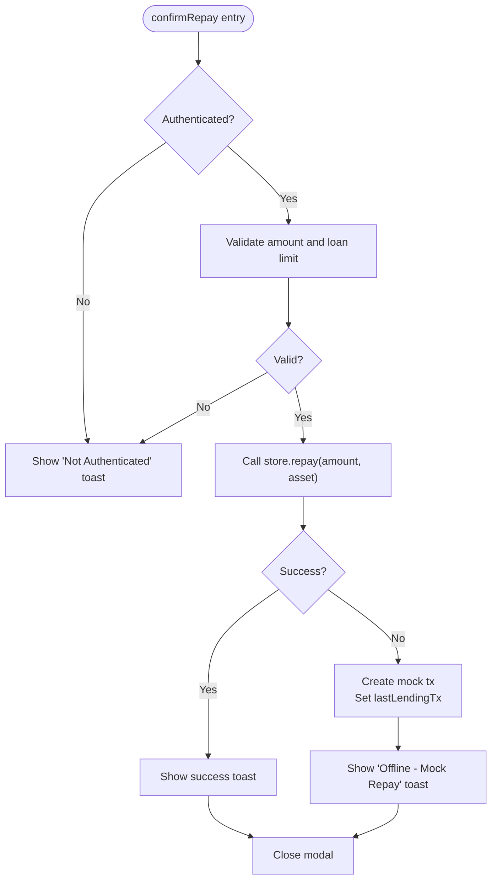
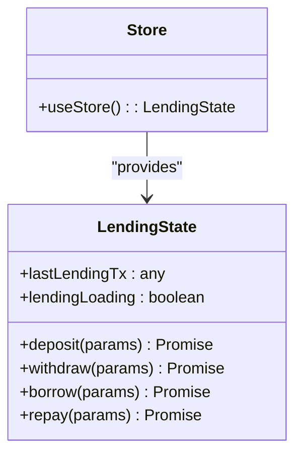
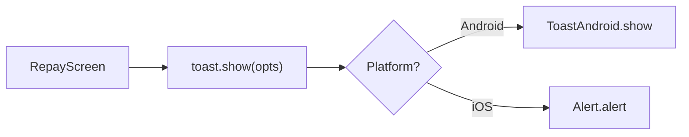
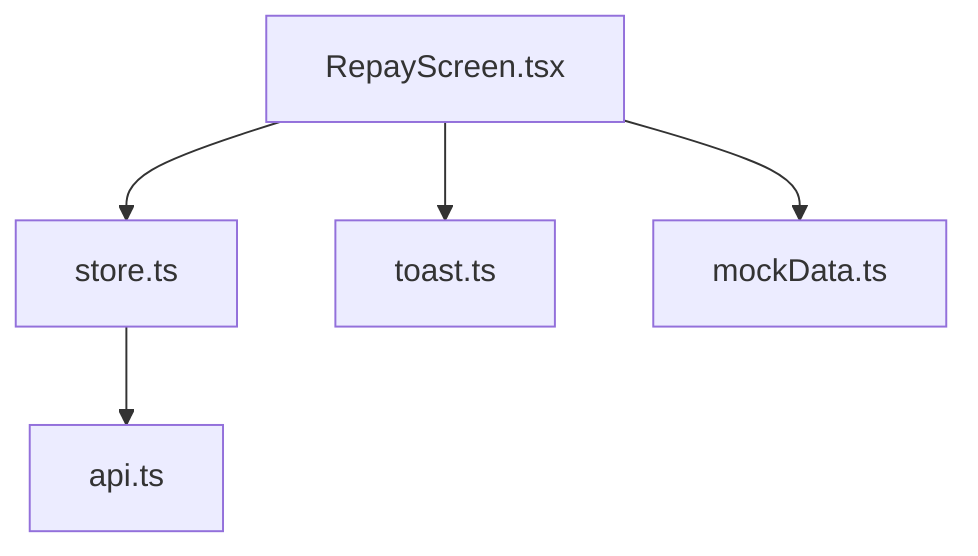

# Transaction Processing & State Management

<cite>
**Referenced Files in This Document**
- [RepayScreen.tsx](file://veilend-mobile/src/screens/RepayScreen.tsx)
- [store.ts](file://veilend-mobile/src/store/store.ts)
- [toast.ts](file://veilend-mobile/src/utils/toast.ts)
- [mockData.ts](file://veilend-mobile/src/data/mockData.ts)
</cite>

## Table of Contents
1. [Introduction](#introduction)
2. [Project Structure](#project-structure)
3. [Core Components](#core-components)
4. [Architecture Overview](#architecture-overview)
5. [Detailed Component Analysis](#detailed-component-analysis)
6. [Dependency Analysis](#dependency-analysis)
7. [Performance Considerations](#performance-considerations)
8. [Troubleshooting Guide](#troubleshooting-guide)
9. [Conclusion](#conclusion)

## Introduction
This document explains the end-to-end transaction processing workflow for loan repayments in the mobile application. It focuses on how user input is validated, how the store’s lending operations are invoked, how loading and error states are managed, and how the UI updates after a successful or offline-replicated repayment. It also covers the toast notification system used to inform users about the outcome of their actions.

## Project Structure
The repayment flow spans three primary areas:
- UI layer: Repay screen handles input validation, modal interactions, and triggers the repayment action.
- State layer: A Zustand store provides lending methods (including repay), loading flags, and last transaction tracking.
- Feedback layer: A lightweight toast utility surfaces success, info, and error messages across platforms.

**Diagram sources**
- [RepayScreen.tsx:18-80](file://veilend-mobile/src/screens/RepayScreen.tsx#L18-L80)
- [store.ts:63-70](file://veilend-mobile/src/store/store.ts#L63-L70)
- [store.ts:254-308](file://veilend-mobile/src/store/store.ts#L254-L308)
- [toast.ts:5-19](file://veilend-mobile/src/utils/toast.ts#L5-L19)
- [mockData.ts:72-91](file://veilend-mobile/src/data/mockData.ts#L72-L91)

**Section sources**
- [RepayScreen.tsx:18-80](file://veilend-mobile/src/screens/RepayScreen.tsx#L18-L80)
- [store.ts:63-70](file://veilend-mobile/src/store/store.ts#L63-L70)
- [store.ts:254-308](file://veilend-mobile/src/store/store.ts#L254-L308)
- [toast.ts:5-19](file://veilend-mobile/src/utils/toast.ts#L5-L19)
- [mockData.ts:72-91](file://veilend-mobile/src/data/mockData.ts#L72-L91)

## Core Components
- RepayScreen: Validates amount, opens a confirmation modal, calls the store’s repay method, shows toast feedback, and closes the modal.
- Store (Zustand): Provides lendingLoading flag and asynchronous repay method that currently returns a mock transaction; persists lastLendingTx for reference.
- Toast: Cross-platform notifications with success/info/error variants.
- Mock Data: Supplies sample positions for the UI to render active loans.

Key responsibilities:
- Input sanitization and validation before submission.
- Guarding against concurrent submissions via lendingLoading.
- Handling both successful and offline scenarios with appropriate user feedback.
- Resetting UI state by closing the modal after submission.

**Section sources**
- [RepayScreen.tsx:9-80](file://veilend-mobile/src/screens/RepayScreen.tsx#L9-L80)
- [store.ts:63-70](file://veilend-mobile/src/store/store.ts#L63-L70)
- [store.ts:254-308](file://veilend-mobile/src/store/store.ts#L254-L308)
- [toast.ts:5-19](file://veilend-mobile/src/utils/toast.ts#L5-L19)
- [mockData.ts:72-91](file://veilend-mobile/src/data/mockData.ts#L72-L91)

## Architecture Overview
The repayment workflow follows a clear sequence from user interaction to state update and feedback.

**Diagram sources**
- [RepayScreen.tsx:68-80](file://veilend-mobile/src/screens/RepayScreen.tsx#L68-L80)
- [store.ts:296-308](file://veilend-mobile/src/store/store.ts#L296-L308)
- [toast.ts:5-19](file://veilend-mobile/src/utils/toast.ts#L5-L19)

## Detailed Component Analysis

### RepayScreen: confirmRepay and Validation
- Input validation:
  - Sanitizes numeric input to prevent invalid characters and multiple decimals.
  - Ensures amount is positive and not greater than the selected loan’s owed amount.
  - Disables submit while loading or when validation fails.
- Confirmation flow:
  - Checks authentication before opening the modal.
  - Calls useStore.getState().repay(...) with amount and asset.
  - On success: shows a success toast and closes the modal.
  - On error/offline: creates a mock transaction, stores it in lastLendingTx, shows an info toast indicating offline mode, and closes the modal.

**Diagram sources**
- [RepayScreen.tsx:26-80](file://veilend-mobile/src/screens/RepayScreen.tsx#L26-L80)

**Section sources**
- [RepayScreen.tsx:9-80](file://veilend-mobile/src/screens/RepayScreen.tsx#L9-L80)

### Store: Lending Operations and Loading State
- LendingState includes deposit, withdraw, borrow, and repay methods.
- repay method:
  - Guards against concurrent executions using lendingLoading.
  - Sets lendingLoading to true, simulates async work, then sets lastLendingTx to a mock transaction and resets lendingLoading.
  - Returns the mock transaction object.
- Portfolio and transactions fetching methods exist but are not part of this flow.

**Diagram sources**
- [store.ts:63-70](file://veilend-mobile/src/store/store.ts#L63-L70)
- [store.ts:254-308](file://veilend-mobile/src/store/store.ts#L254-L308)

**Section sources**
- [store.ts:63-70](file://veilend-mobile/src/store/store.ts#L63-L70)
- [store.ts:254-308](file://veilend-mobile/src/store/store.ts#L254-L308)

### Toast Notification System
- Provides a unified show function that renders native toasts on Android and alerts on iOS.
- Exposes convenience helpers for success, error, and info messages.
- Used by RepayScreen to communicate outcomes to the user.

**Diagram sources**
- [toast.ts:5-19](file://veilend-mobile/src/utils/toast.ts#L5-L19)
- [RepayScreen.tsx:72-78](file://veilend-mobile/src/screens/RepayScreen.tsx#L72-L78)

**Section sources**
- [toast.ts:5-19](file://veilend-mobile/src/utils/toast.ts#L5-L19)
- [RepayScreen.tsx:72-78](file://veilend-mobile/src/screens/RepayScreen.tsx#L72-L78)

### Mock Data and Active Loans
- MOCK_POSITIONS supplies sample borrowed assets for the Repay screen to display.
- The screen filters for Borrowed positions to present actionable items to the user.

**Section sources**
- [mockData.ts:72-91](file://veilend-mobile/src/data/mockData.ts#L72-L91)
- [RepayScreen.tsx:19-20](file://veilend-mobile/src/screens/RepayScreen.tsx#L19-L20)

## Dependency Analysis
- RepayScreen depends on:
  - useStore for lendingLoading and repay.
  - Toast for user feedback.
  - MOCK_POSITIONS for rendering active loans.
- Store depends on:
  - api module (currently placeholder for network calls).
  - SecureStore for persistence of auth/UI state (not directly used in repay flow).
- Toast depends on React Native platform APIs.

**Diagram sources**
- [RepayScreen.tsx:1-80](file://veilend-mobile/src/screens/RepayScreen.tsx#L1-L80)
- [store.ts:254-308](file://veilend-mobile/src/store/store.ts#L254-L308)
- [toast.ts:5-19](file://veilend-mobile/src/utils/toast.ts#L5-L19)
- [mockData.ts:72-91](file://veilend-mobile/src/data/mockData.ts#L72-L91)

**Section sources**
- [RepayScreen.tsx:1-80](file://veilend-mobile/src/screens/RepayScreen.tsx#L1-L80)
- [store.ts:254-308](file://veilend-mobile/src/store/store.ts#L254-L308)
- [toast.ts:5-19](file://veilend-mobile/src/utils/toast.ts#L5-L19)
- [mockData.ts:72-91](file://veilend-mobile/src/data/mockData.ts#L72-L91)

## Performance Considerations
- Prevent duplicate submissions:
  - lendingLoading guard avoids overlapping repay calls.
- Minimal re-renders:
  - Use memoized validation to avoid unnecessary recalculations.
- Lightweight feedback:
  - Toast uses native components for efficient user notifications.

[No sources needed since this section provides general guidance]

## Troubleshooting Guide
Common issues and resolutions:
- Submit disabled:
  - Ensure amount is valid and less than or equal to the owed amount.
  - Confirm authentication token exists before attempting repayment.
- No feedback shown:
  - Verify toast utility is imported and called with correct parameters.
- Unexpected offline behavior:
  - When repay throws or fails, the screen falls back to a mock transaction and informs the user via an info toast. Check lastLendingTx in the store for details.

**Section sources**
- [RepayScreen.tsx:42-80](file://veilend-mobile/src/screens/RepayScreen.tsx#L42-L80)
- [store.ts:296-308](file://veilend-mobile/src/store/store.ts#L296-L308)
- [toast.ts:5-19](file://veilend-mobile/src/utils/toast.ts#L5-L19)

## Conclusion
The repayment workflow integrates a robust validation layer, a state-managed store with loading guards, and cross-platform toast notifications. While the current implementation uses mock transactions, it establishes a clear pattern for future integration with real blockchain or backend services. Successful repayments close the modal and provide immediate user feedback, while offline or error paths ensure transparency through informative toasts and stored mock results.