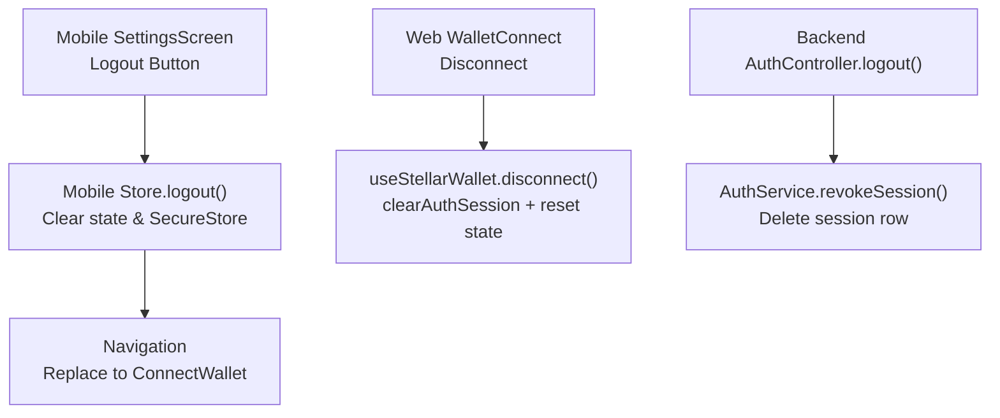
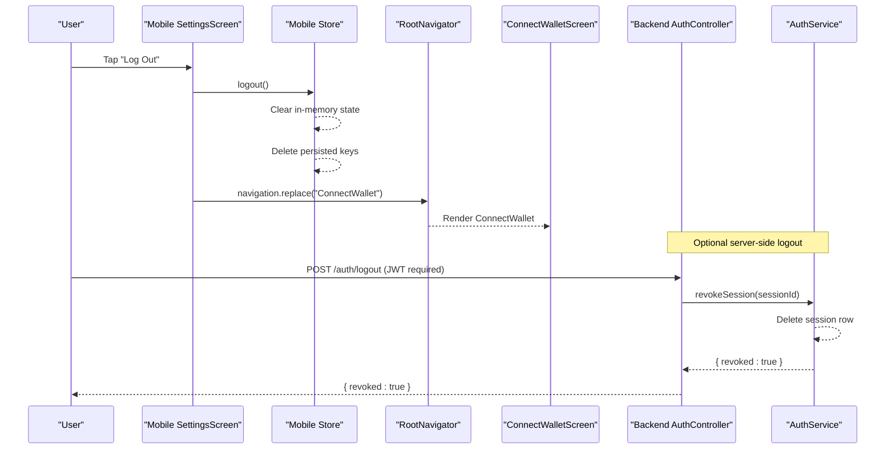
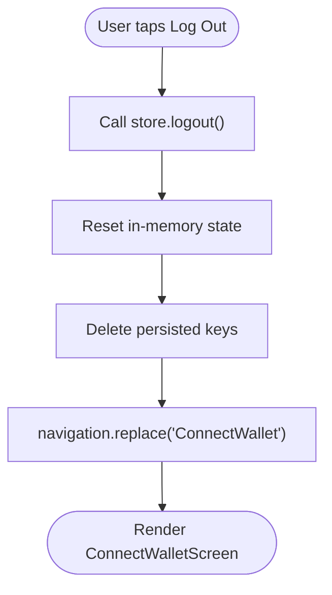
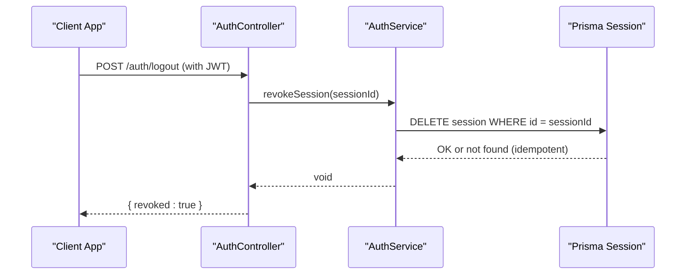
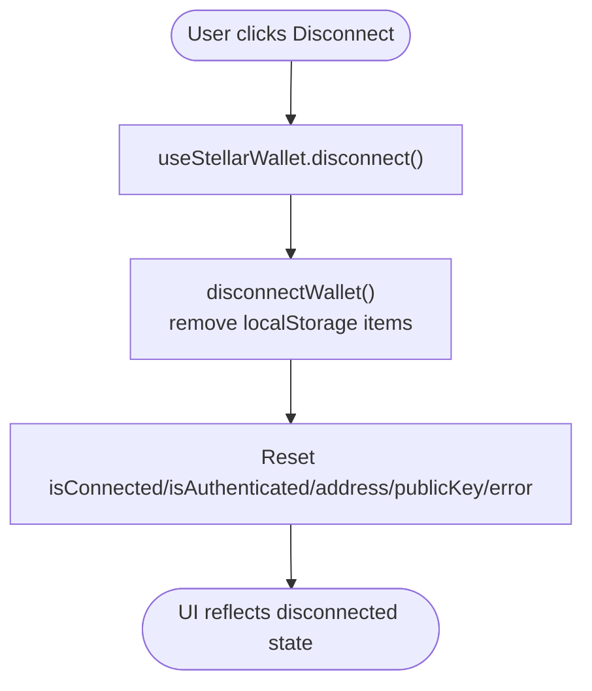
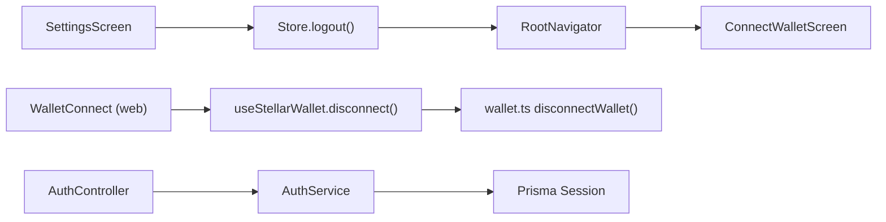

# Account Management

<cite>
**Referenced Files in This Document**
- [SettingsScreen.tsx](file://veilend-mobile/src/screens/SettingsScreen.tsx)
- [store.ts](file://veilend-mobile/src/store/store.ts)
- [index.tsx](file://veilend-mobile/src/navigation/index.tsx)
- [ConnectWalletScreen.tsx](file://veilend-mobile/src/screens/ConnectWalletScreen.tsx)
- [auth.controller.ts](file://veilend-backend/src/auth/auth.controller.ts)
- [auth.service.ts](file://veilend-backend/src/auth/auth.service.ts)
- [useStellarWallet.ts](file://veilend-web/src/hooks/useStellarWallet.ts)
- [WalletConnect.tsx](file://veilend-web/src/components/WalletConnect.tsx)
- [wallet.ts](file://veilend-web/src/lib/stellar/wallet.ts)
</cite>

## Table of Contents
1. [Introduction](#introduction)
2. [Project Structure](#project-structure)
3. [Core Components](#core-components)
4. [Architecture Overview](#architecture-overview)
5. [Detailed Component Analysis](#detailed-component-analysis)
6. [Dependency Analysis](#dependency-analysis)
7. [Performance Considerations](#performance-considerations)
8. [Troubleshooting Guide](#troubleshooting-guide)
9. [Conclusion](#conclusion)

## Introduction
This document explains the account management features for logout, session termination, and navigation back to wallet connection across the mobile and web clients, as well as the backend session revocation flow. It covers:
- Logout button implementation and visual styling on mobile
- Navigation flow after logout to ConnectWallet screen
- Cleanup operations during logout (local state and persisted storage)
- Backend session revocation endpoint behavior
- Web client disconnect behavior and state cleanup
- User experience considerations around confirmation patterns and safe transitions

## Project Structure
The account management flow spans multiple layers:
- Mobile UI triggers logout from Settings and navigates to ConnectWallet
- Mobile store clears in-memory and persisted state
- Backend provides a logout endpoint that revokes sessions
- Web client supports disconnect with local state cleanup

**Diagram sources**
- [SettingsScreen.tsx:70-73](file://veilend-mobile/src/screens/SettingsScreen.tsx#L70-L73)
- [store.ts:124-149](file://veilend-mobile/src/store/store.ts#L124-L149)
- [index.tsx:73-86](file://veilend-mobile/src/navigation/index.tsx#L73-L86)
- [WalletConnect.tsx:84-92](file://veilend-web/src/components/WalletConnect.tsx#L84-L92)
- [useStellarWallet.ts:90-110](file://veilend-web/src/hooks/useStellarWallet.ts#L90-L110)
- [auth.controller.ts:48-57](file://veilend-backend/src/auth/auth.controller.ts#L48-L57)
- [auth.service.ts:184-201](file://veilend-backend/src/auth/auth.service.ts#L184-L201)

**Section sources**
- [SettingsScreen.tsx:70-73](file://veilend-mobile/src/screens/SettingsScreen.tsx#L70-L73)
- [store.ts:124-149](file://veilend-mobile/src/store/store.ts#L124-L149)
- [index.tsx:73-86](file://veilend-mobile/src/navigation/index.tsx#L73-L86)
- [WalletConnect.tsx:84-92](file://veilend-web/src/components/WalletConnect.tsx#L84-L92)
- [useStellarWallet.ts:90-110](file://veilend-web/src/hooks/useStellarWallet.ts#L90-L110)
- [auth.controller.ts:48-57](file://veilend-backend/src/auth/auth.controller.ts#L48-L57)
- [auth.service.ts:184-201](file://veilend-backend/src/auth/auth.service.ts#L184-L201)

## Core Components
- Mobile logout trigger and styling:
  - The Settings screen exposes a styled “Log Out” action that calls the store’s logout method and then replaces the navigation stack to ConnectWallet.
- Mobile state cleanup:
  - The store’s logout resets all user-related state and deletes persisted keys from secure storage to ensure no stale data remains.
- Navigation routing:
  - The root navigator renders ConnectWallet when there is no auth token; otherwise it shows the main tabs and settings.
- Backend logout:
  - The authenticated POST /auth/logout endpoint revokes the current session by deleting the session record.
- Web disconnect:
  - The web WalletConnect component provides a Disconnect action that clears local auth/session and resets wallet state.

**Section sources**
- [SettingsScreen.tsx:70-73](file://veilend-mobile/src/screens/SettingsScreen.tsx#L70-L73)
- [store.ts:124-149](file://veilend-mobile/src/store/store.ts#L124-L149)
- [index.tsx:73-86](file://veilend-mobile/src/navigation/index.tsx#L73-L86)
- [auth.controller.ts:48-57](file://veilend-backend/src/auth/auth.controller.ts#L48-L57)
- [WalletConnect.tsx:84-92](file://veilend-web/src/components/WalletConnect.tsx#L84-L92)
- [useStellarWallet.ts:90-110](file://veilend-web/src/hooks/useStellarWallet.ts#L90-L110)

## Architecture Overview
The end-to-end logout architecture involves both client-side state cleanup and server-side session revocation. On mobile, logout is immediate and navigates to ConnectWallet. On web, disconnect clears local state and can be paired with a backend logout call if needed.

**Diagram sources**
- [SettingsScreen.tsx:70-73](file://veilend-mobile/src/screens/SettingsScreen.tsx#L70-L73)
- [store.ts:124-149](file://veilend-mobile/src/store/store.ts#L124-L149)
- [index.tsx:73-86](file://veilend-mobile/src/navigation/index.tsx#L73-L86)
- [auth.controller.ts:48-57](file://veilend-backend/src/auth/auth.controller.ts#L48-L57)
- [auth.service.ts:184-201](file://veilend-backend/src/auth/auth.service.ts#L184-L201)

## Detailed Component Analysis

### Mobile Logout Flow
- Visual styling and UX:
  - The logout button uses a red-tinted background and text to signal a destructive action, with an icon for clarity.
- Handler implementation:
  - The handler invokes the store’s logout function and then replaces the navigation stack to the ConnectWallet screen.
- State cleanup:
  - The store’s logout resets address, tokens, privacy mode, profile fields, currency, notifications, and sets session restoration flag appropriately. It also deletes all relevant persisted keys to prevent stale data on next launch.
- Navigation:
  - Root navigator checks for authToken; when absent, it renders ConnectWallet.

**Diagram sources**
- [SettingsScreen.tsx:70-73](file://veilend-mobile/src/screens/SettingsScreen.tsx#L70-L73)
- [store.ts:124-149](file://veilend-mobile/src/store/store.ts#L124-L149)
- [index.tsx:73-86](file://veilend-mobile/src/navigation/index.tsx#L73-L86)

**Section sources**
- [SettingsScreen.tsx:70-73](file://veilend-mobile/src/screens/SettingsScreen.tsx#L70-L73)
- [store.ts:124-149](file://veilend-mobile/src/store/store.ts#L124-L149)
- [index.tsx:73-86](file://veilend-mobile/src/navigation/index.tsx#L73-L86)

### Backend Session Revocation
- Endpoint:
  - An authenticated POST /auth/logout endpoint revokes the current session by calling the service layer.
- Service behavior:
  - The service deletes the session record by ID. Deletion is idempotent; missing rows are tolerated to avoid errors on repeated logout calls.
- Response:
  - Returns a simple confirmation object indicating revocation success.

**Diagram sources**
- [auth.controller.ts:48-57](file://veilend-backend/src/auth/auth.controller.ts#L48-L57)
- [auth.service.ts:184-201](file://veilend-backend/src/auth/auth.service.ts#L184-L201)

**Section sources**
- [auth.controller.ts:48-57](file://veilend-backend/src/auth/auth.controller.ts#L48-L57)
- [auth.service.ts:184-201](file://veilend-backend/src/auth/auth.service.ts#L184-L201)

### Web Disconnect and State Cleanup
- Disconnect UI:
  - The WalletConnect component exposes a Disconnect action in connected states (compact/full/default variants).
- State cleanup:
  - The underlying hook disconnects the wallet, clears any stored auth session, and resets wallet state flags such as address, public key, connection, and authentication status.
- Local storage:
  - The utility function removes local storage entries related to wallet address and auth.

**Diagram sources**
- [WalletConnect.tsx:84-92](file://veilend-web/src/components/WalletConnect.tsx#L84-L92)
- [useStellarWallet.ts:90-110](file://veilend-web/src/hooks/useStellarWallet.ts#L90-L110)
- [wallet.ts:213-218](file://veilend-web/src/lib/stellar/wallet.ts#L213-L218)

**Section sources**
- [WalletConnect.tsx:84-92](file://veilend-web/src/components/WalletConnect.tsx#L84-L92)
- [useStellarWallet.ts:90-110](file://veilend-web/src/hooks/useStellarWallet.ts#L90-L110)
- [wallet.ts:213-218](file://veilend-web/src/lib/stellar/wallet.ts#L213-L218)

### ConnectWallet Screen Behavior
- Purpose:
  - Provides entry points to generate or import a Stellar wallet and proceed to authenticated flows.
- UX:
  - Offers clear actions and feedback, including loading states and error messages.
- Integration:
  - After logout, the app routes here due to absence of an auth token in the store.

**Section sources**
- [ConnectWalletScreen.tsx:32-66](file://veilend-mobile/src/screens/ConnectWalletScreen.tsx#L32-L66)
- [index.tsx:73-86](file://veilend-mobile/src/navigation/index.tsx#L73-L86)

## Dependency Analysis
- Mobile:
  - SettingsScreen depends on store.logout and navigation API.
  - Store manages state and persistence; logout clears both.
  - RootNavigator reads store.authToken to decide which screens to render.
- Backend:
  - AuthController delegates to AuthService for session revocation.
  - AuthService interacts with Prisma to delete session records.
- Web:
  - WalletConnect uses useStellarWallet context, which encapsulates disconnect logic and local storage cleanup.

**Diagram sources**
- [SettingsScreen.tsx:70-73](file://veilend-mobile/src/screens/SettingsScreen.tsx#L70-L73)
- [store.ts:124-149](file://veilend-mobile/src/store/store.ts#L124-L149)
- [index.tsx:73-86](file://veilend-mobile/src/navigation/index.tsx#L73-L86)
- [WalletConnect.tsx:84-92](file://veilend-web/src/components/WalletConnect.tsx#L84-L92)
- [useStellarWallet.ts:90-110](file://veilend-web/src/hooks/useStellarWallet.ts#L90-L110)
- [wallet.ts:213-218](file://veilend-web/src/lib/stellar/wallet.ts#L213-L218)
- [auth.controller.ts:48-57](file://veilend-backend/src/auth/auth.controller.ts#L48-L57)
- [auth.service.ts:184-201](file://veilend-backend/src/auth/auth.service.ts#L184-L201)

**Section sources**
- [SettingsScreen.tsx:70-73](file://veilend-mobile/src/screens/SettingsScreen.tsx#L70-L73)
- [store.ts:124-149](file://veilend-mobile/src/store/store.ts#L124-L149)
- [index.tsx:73-86](file://veilend-mobile/src/navigation/index.tsx#L73-L86)
- [WalletConnect.tsx:84-92](file://veilend-web/src/components/WalletConnect.tsx#L84-L92)
- [useStellarWallet.ts:90-110](file://veilend-web/src/hooks/useStellarWallet.ts#L90-L110)
- [wallet.ts:213-218](file://veilend-web/src/lib/stellar/wallet.ts#L213-L218)
- [auth.controller.ts:48-57](file://veilend-backend/src/auth/auth.controller.ts#L48-L57)
- [auth.service.ts:184-201](file://veilend-backend/src/auth/auth.service.ts#L184-L201)

## Performance Considerations
- Mobile logout is synchronous and fast; it avoids network calls and immediately clears state and persistent storage.
- Backend logout is idempotent and performs a single database delete, minimizing overhead.
- Web disconnect updates local state instantly without blocking on network calls.

[No sources needed since this section provides general guidance]

## Troubleshooting Guide
- If logout does not navigate to ConnectWallet:
  - Verify that the store’s logout clears the auth token and that the root navigator conditionally renders ConnectWallet based on the token.
- If stale data persists after logout:
  - Ensure all persisted keys are deleted during logout; check the store’s logout implementation for completeness.
- If backend logout fails:
  - Confirm the request includes a valid JWT and that the session exists; the service handles missing sessions gracefully.
- If web disconnect does not reflect in UI:
  - Check that the disconnect function resets all relevant state flags and clears local storage entries.

**Section sources**
- [index.tsx:73-86](file://veilend-mobile/src/navigation/index.tsx#L73-L86)
- [store.ts:124-149](file://veilend-mobile/src/store/store.ts#L124-L149)
- [auth.service.ts:184-201](file://veilend-backend/src/auth/auth.service.ts#L184-L201)
- [useStellarWallet.ts:90-110](file://veilend-web/src/hooks/useStellarWallet.ts#L90-L110)
- [wallet.ts:213-218](file://veilend-web/src/lib/stellar/wallet.ts#L213-L218)

## Conclusion
The account management logout flow ensures a clean, secure exit by combining immediate client-side state cleanup with optional server-side session revocation. On mobile, users are guided back to ConnectWallet after logout, while on web, disconnect clears local state and prepares the UI for reconnection. The backend logout endpoint is robust and idempotent, ensuring reliable session termination.

[No sources needed since this section summarizes without analyzing specific files]