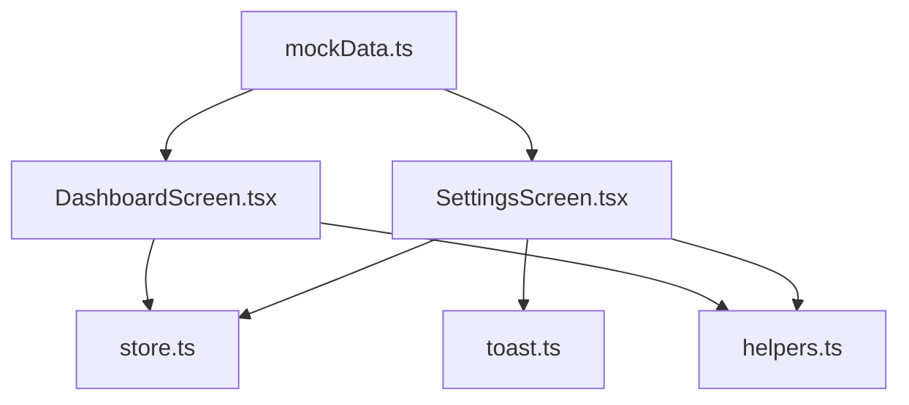
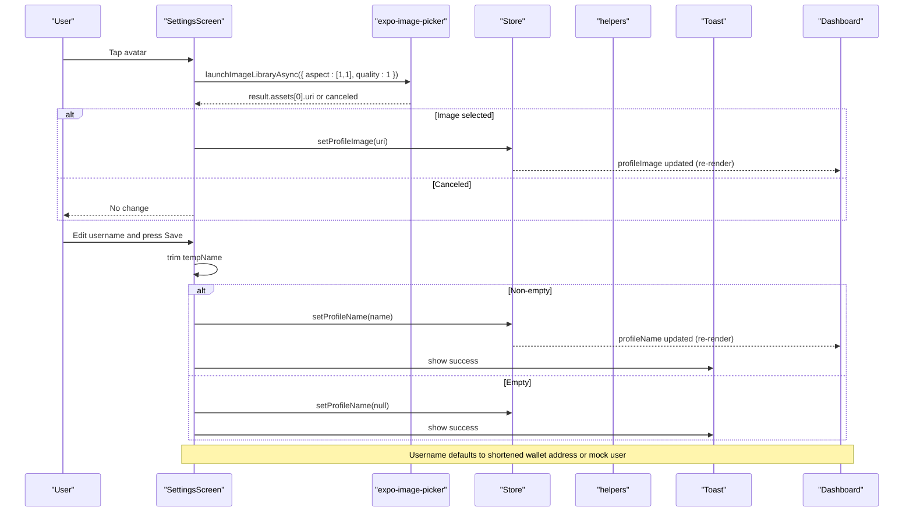
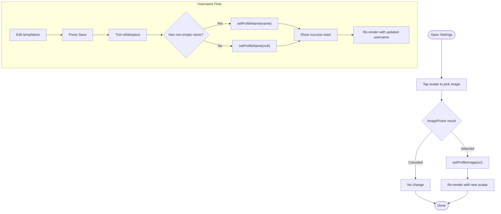
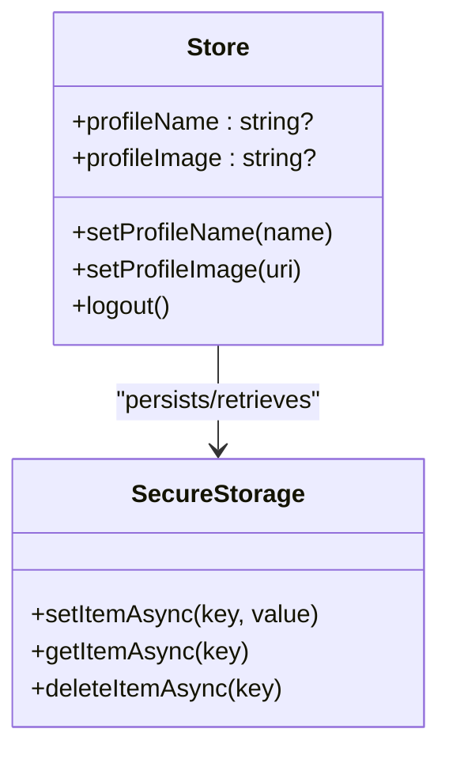
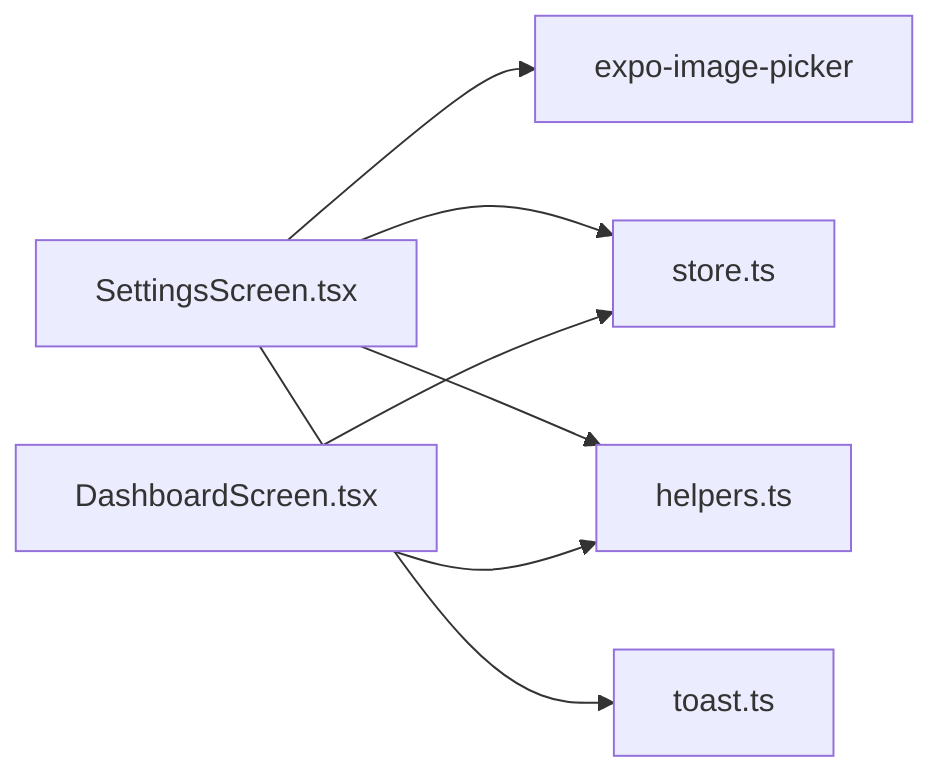

# Profile Management

<cite>
**Referenced Files in This Document**
- [SettingsScreen.tsx](file://veilend-mobile/src/screens/SettingsScreen.tsx)
- [store.ts](file://veilend-mobile/src/store/store.ts)
- [helpers.ts](file://veilend-mobile/src/utils/helpers.ts)
- [toast.ts](file://veilend-mobile/src/utils/toast.ts)
- [DashboardScreen.tsx](file://veilend-mobile/src/screens/DashboardScreen.tsx)
- [mockData.ts](file://veilend-mobile/src/data/mockData.ts)
</cite>

## Table of Contents
1. Introduction
2. Project Structure
3. Core Components
4. Architecture Overview
5. Detailed Component Analysis
6. Dependency Analysis
7. Performance Considerations
8. Troubleshooting Guide
9. Conclusion

## Introduction
This document explains the profile management functionality on the Settings screen, covering avatar upload and editing with expo-image-picker, username customization with validation and persistence, wallet address display using shortening utilities, and profile data synchronization across the app via a centralized store. It also documents temporary state for username edits before saving, default username generation from wallet addresses, image picker configuration (aspect ratio and quality), error handling for image selection failures, and accessibility considerations for profile editing.

## Project Structure
Profile-related code is primarily implemented in:
- Settings screen: user interactions for avatar and username changes
- Store: persistent profile state (name and image) and session hydration
- Helpers: wallet address shortening utility
- Toast: user feedback for success and warnings
- Dashboard: consumption of profile data to reflect changes across the app
- Mock data: fallback username when no wallet is connected

**Diagram sources**
- [SettingsScreen.tsx:25-68](file://veilend-mobile/src/screens/SettingsScreen.tsx#L25-L68)
- [store.ts:155-172](file://veilend-mobile/src/store/store.ts#L155-L172)
- [helpers.ts:1-4](file://veilend-mobile/src/utils/helpers.ts#L1-L4)
- [toast.ts:5-15](file://veilend-mobile/src/utils/toast.ts#L5-L15)
- [DashboardScreen.tsx:76-78](file://veilend-mobile/src/screens/DashboardScreen.tsx#LL76-L78)
- [mockData.ts:1-7](file://veilend-mobile/src/data/mockData.ts#L1-L7)

**Section sources**
- [SettingsScreen.tsx:25-68](file://veilend-mobile/src/screens/SettingsScreen.tsx#L25-L68)
- [store.ts:155-172](file://veilend-mobile/src/store/store.ts#L155-L172)
- [helpers.ts:1-4](file://veilend-mobile/src/utils/helpers.ts#L1-L4)
- [toast.ts:5-15](file://veilend-mobile/src/utils/toast.ts#L5-L15)
- [DashboardScreen.tsx:76-78](file://veilend-mobile/src/screens/DashboardScreen.tsx#L76-L78)
- [mockData.ts:1-7](file://veilend-mobile/src/data/mockData.ts#L1-L7)

## Core Components
- Settings screen: provides UI for avatar selection, username editing, and displays shortened wallet address; uses expo-image-picker with aspect ratio and quality settings; shows toast feedback on save.
- Store: persists profile name and image to secure storage; hydrates these values at app launch; exposes setters used by screens.
- Helpers: shortenAddress utility formats long wallet addresses for display.
- Toast: cross-platform notifications for success and warnings.
- Dashboard: reads profile name and image from the store to reflect updates globally.

Key behaviors:
- Avatar upload: launches image library with square aspect and full quality; updates store if not canceled.
- Username editing: local temporary input; saves only when changed; trims whitespace; clears empty names to fall back to default.
- Default username: derived from shortened wallet address or mock user when no address is present.
- Persistence: profile name and image are stored securely and restored on startup.

**Section sources**
- [SettingsScreen.tsx:50-68](file://veilend-mobile/src/screens/SettingsScreen.tsx#L50-L68)
- [store.ts:155-172](file://veilend-mobile/src/store/store.ts#L155-L172)
- [store.ts:369-391](file://veilend-mobile/src/store/store.ts#L369-L391)
- [helpers.ts:1-4](file://veilend-mobile/src/utils/helpers.ts#L1-L4)
- [DashboardScreen.tsx:76-78](file://veilend-mobile/src/screens/DashboardScreen.tsx#L76-L78)

## Architecture Overview
The profile flow integrates UI, state, and utilities:

**Diagram sources**
- [SettingsScreen.tsx:50-68](file://veilend-mobile/src/screens/SettingsScreen.tsx#L50-L68)
- [store.ts:155-172](file://veilend-mobile/src/store/store.ts#L155-L172)
- [helpers.ts:1-4](file://veilend-mobile/src/utils/helpers.ts#L1-L4)
- [DashboardScreen.tsx:76-78](file://veilend-mobile/src/screens/DashboardScreen.tsx#L76-L78)

## Detailed Component Analysis

### Settings Screen: Avatar Upload and Editing
- Image picker integration:
  - Launches the device image library with media type images, editing enabled, square aspect ratio [1,1], and quality set to maximum.
  - On successful selection, updates the profile image in the store; otherwise, no change occurs.
- Username editing:
  - Uses a local temporary input bound to tempName.
  - On Save, trims whitespace; if non-empty, persists the new name; if empty, clears the persisted name so the default applies.
  - Shows a success toast after saving.
- Wallet address display:
  - Displays a shortened version of the connected wallet address below the username field.
- Default username:
  - If a wallet address exists, the default username is the shortened address; otherwise, falls back to a mock user name.

**Diagram sources**
- [SettingsScreen.tsx:50-68](file://veilend-mobile/src/screens/SettingsScreen.tsx#L50-L68)
- [store.ts:155-172](file://veilend-mobile/src/store/store.ts#L155-L172)

**Section sources**
- [SettingsScreen.tsx:50-68](file://veilend-mobile/src/screens/SettingsScreen.tsx#L50-L68)
- [SettingsScreen.tsx:112-130](file://veilend-mobile/src/screens/SettingsScreen.tsx#L112-L130)

### Store: Profile State and Persistence
- Profile fields:
  - profileName and profileImage are part of the UI state slice.
  - Setters persist values to secure storage and clear them when null.
- Session restoration:
  - On app start, the store reads persisted keys and restores profileName, profileImage, and other preferences into memory.
- Logout behavior:
  - Clears all persisted profile-related keys to ensure clean state on next login.

**Diagram sources**
- [store.ts:155-172](file://veilend-mobile/src/store/store.ts#L155-L172)
- [store.ts:369-391](file://veilend-mobile/src/store/store.ts#L369-L391)

**Section sources**
- [store.ts:155-172](file://veilend-mobile/src/store/store.ts#L155-L172)
- [store.ts:369-391](file://veilend-mobile/src/store/store.ts#L369-L391)
- [store.ts:124-149](file://veilend-mobile/src/store/store.ts#L124-L149)

### Helpers: Wallet Address Shortening
- shortenAddress formats long addresses by showing a prefix and suffix separated by ellipsis, improving readability in UI elements like usernames and address labels.

**Section sources**
- [helpers.ts:1-4](file://veilend-mobile/src/utils/helpers.ts#L1-L4)

### Toast: User Feedback
- Provides platform-aware notifications for success and warnings.
- Used to confirm profile updates and guide users about backup requirements.

**Section sources**
- [toast.ts:5-15](file://veilend-mobile/src/utils/toast.ts#L5-L15)

### Dashboard: Cross-App Profile Display
- Reads profileName and profileImage from the store to display the current user’s name and avatar in the header.
- Falls back to default username logic similar to Settings.

**Section sources**
- [DashboardScreen.tsx:76-78](file://veilend-mobile/src/screens/DashboardScreen.tsx#L76-L78)

## Dependency Analysis
- SettingsScreen depends on:
  - expo-image-picker for avatar selection
  - store for profile state and persistence
  - helpers for address shortening
  - toast for user feedback
- Dashboard depends on:
  - store for reading profile data
  - helpers for address shortening
- Store depends on:
  - secure storage for persistence
  - API for other features (not directly profile-related here)

**Diagram sources**
- [SettingsScreen.tsx:14-18](file://veilend-mobile/src/screens/SettingsScreen.tsx#L14-L18)
- [store.ts:155-172](file://veilend-mobile/src/store/store.ts#L155-L172)
- [helpers.ts:1-4](file://veilend-mobile/src/utils/helpers.ts#L1-L4)
- [toast.ts:5-15](file://veilend-mobile/src/utils/toast.ts#L5-L15)
- [DashboardScreen.tsx:76-78](file://veilend-mobile/src/screens/DashboardScreen.tsx#L76-L78)

**Section sources**
- [SettingsScreen.tsx:14-18](file://veilend-mobile/src/screens/SettingsScreen.tsx#L14-L18)
- [store.ts:155-172](file://veilend-mobile/src/store/store.ts#L155-L172)
- [helpers.ts:1-4](file://veilend-mobile/src/utils/helpers.ts#L1-L4)
- [toast.ts:5-15](file://veilend-mobile/src/utils/toast.ts#L5-L15)
- [DashboardScreen.tsx:76-78](file://veilend-mobile/src/screens/DashboardScreen.tsx#L76-L78)

## Performance Considerations
- Image picker quality is set to maximum; consider reducing quality for large images to improve performance and reduce storage usage.
- Avatar URI is stored in secure storage; ensure URIs remain valid across sessions (e.g., avoid transient file paths).
- Temporary username state avoids unnecessary re-renders until Save is pressed.
- Store setters batch updates and persist asynchronously; errors are caught and ignored to prevent blocking UI.

[No sources needed since this section provides general guidance]

## Troubleshooting Guide
Common issues and resolutions:
- Image selection canceled:
  - Behavior: No change to avatar; ensure permissions are granted and the device supports image picking.
  - Reference: [SettingsScreen.tsx:50-61](file://veilend-mobile/src/screens/SettingsScreen.tsx#L50-L61)
- Username not saving:
  - Ensure the Save button is enabled (input differs from current saved name); trimming handles leading/trailing spaces.
  - Reference: [SettingsScreen.tsx:63-68](file://veilend-mobile/src/screens/SettingsScreen.tsx#L63-L68)
- Default username not showing:
  - Verify wallet address presence; if absent, fallback to mock user name.
  - References: [SettingsScreen.tsx:44-46](file://veilend-mobile/src/screens/SettingsScreen.tsx#L44-L46), [mockData.ts:1-7](file://veilend-mobile/src/data/mockData.ts#L1-L7)
- Profile not reflected elsewhere:
  - Confirm store setters are called and that other screens subscribe to store state.
  - References: [store.ts:155-172](file://veilend-mobile/src/store/store.ts#L155-L172), [DashboardScreen.tsx:76-78](file://veilend-mobile/src/screens/DashboardScreen.tsx#L76-L78)
- Toast not visible:
  - Platform-specific behavior: Android uses native toast; iOS uses alert-style notification.
  - Reference: [toast.ts:5-15](file://veilend-mobile/src/utils/toast.ts#L5-L15)

**Section sources**
- [SettingsScreen.tsx:50-68](file://veilend-mobile/src/screens/SettingsScreen.tsx#L50-L68)
- [mockData.ts:1-7](file://veilend-mobile/src/data/mockData.ts#L1-L7)
- [store.ts:155-172](file://veilend-mobile/src/store/store.ts#L155-L172)
- [DashboardScreen.tsx:76-78](file://veilend-mobile/src/screens/DashboardScreen.tsx#L76-L78)
- [toast.ts:5-15](file://veilend-mobile/src/utils/toast.ts#L5-L15)

## Conclusion
The profile management feature provides a cohesive experience for updating avatars and usernames, with robust persistence and cross-screen synchronization. The implementation leverages expo-image-picker for controlled image selection, a temporary input for safe username edits, and a centralized store for reliable state management. Address shortening improves readability, while toast notifications offer clear user feedback. Future enhancements may include image compression, richer validation, and enhanced accessibility for screen readers and keyboard navigation.

[No sources needed since this section summarizes without analyzing specific files]