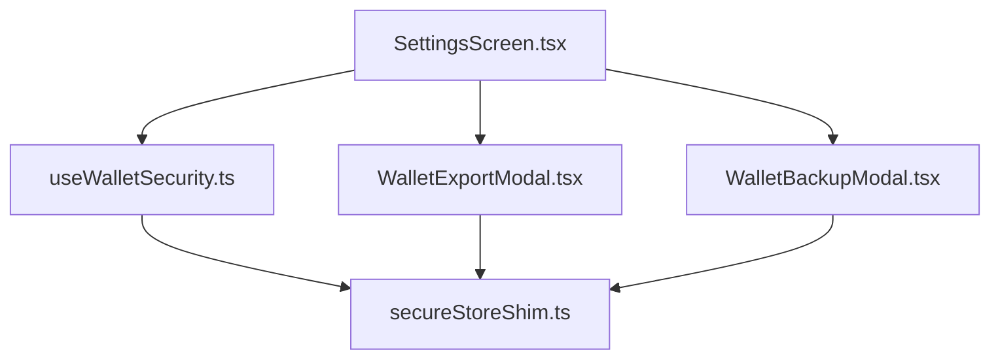
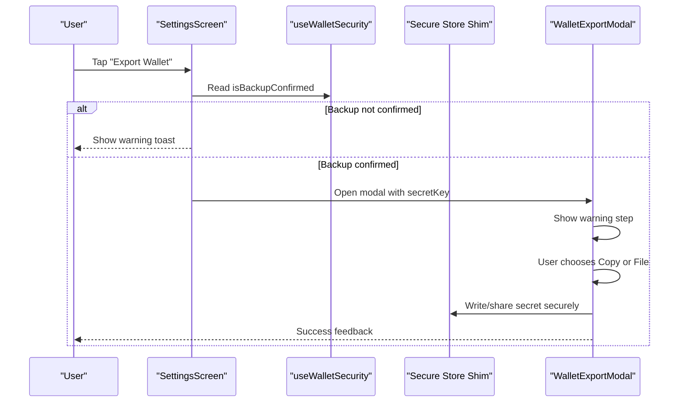
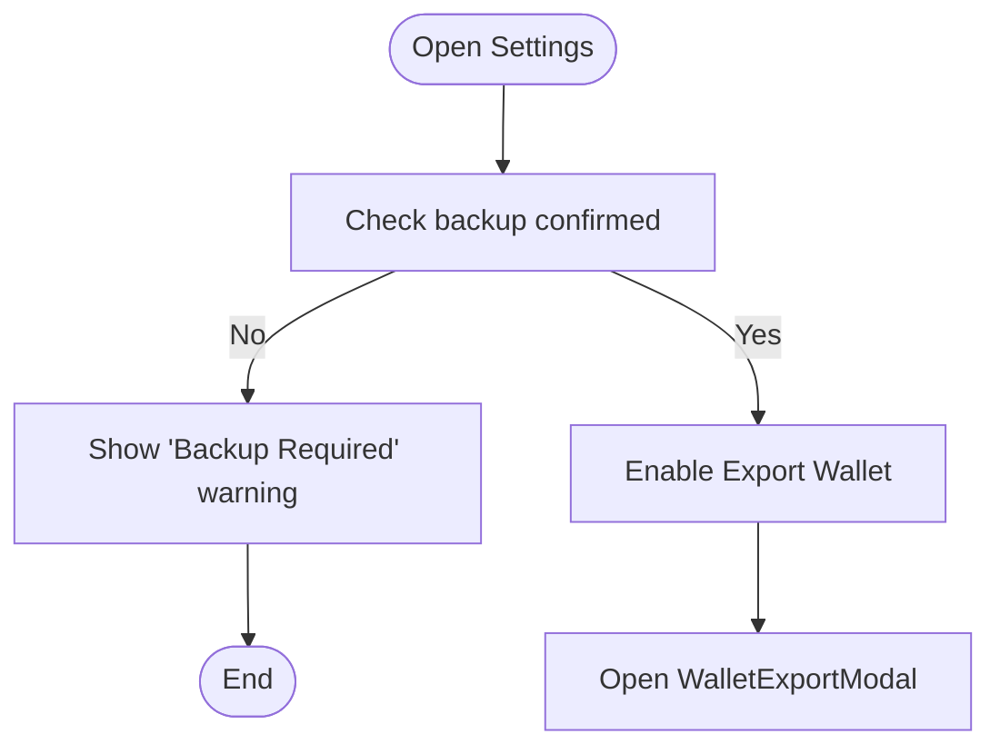
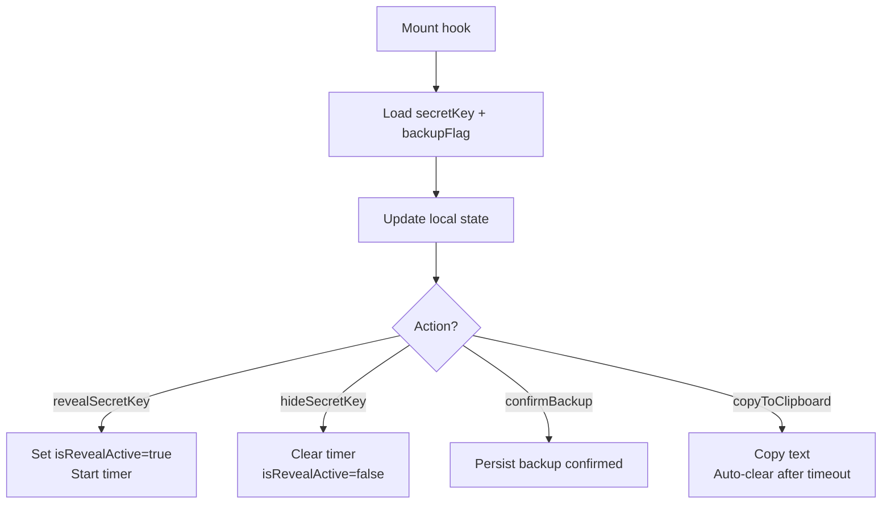
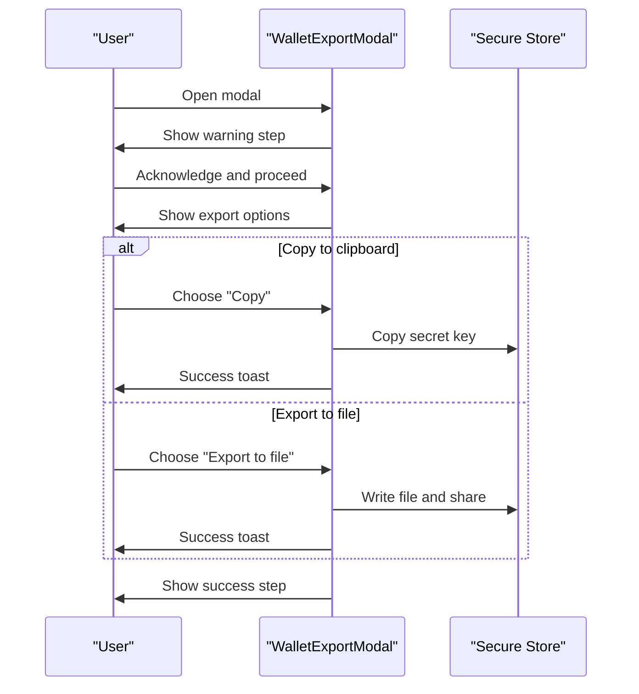
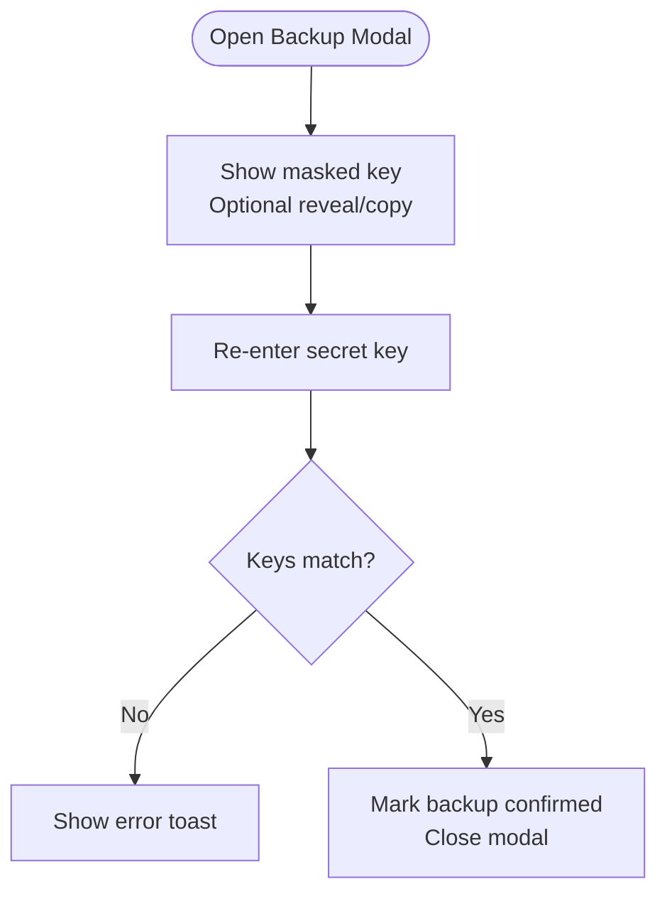
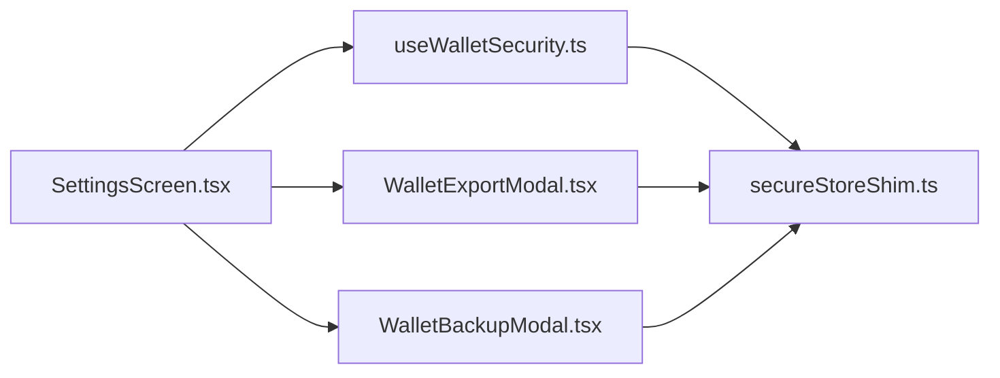

# Security Settings

<cite>
**Referenced Files in This Document**
- [SettingsScreen.tsx](file://veilend-mobile/src/screens/SettingsScreen.tsx)
- [useWalletSecurity.ts](file://veilend-mobile/src/hooks/useWalletSecurity.ts)
- [WalletExportModal.tsx](file://veilend-mobile/src/components/WalletExportModal.tsx)
- [WalletBackupModal.tsx](file://veilend-mobile/src/components/WalletBackupModal.tsx)
- [secureStoreShim.ts](file://veilend-mobile/src/utils/secureStoreShim.ts)
</cite>

## Table of Contents
1. [Introduction](#introduction)
2. [Project Structure](#project-structure)
3. [Core Components](#core-components)
4. [Architecture Overview](#architecture-overview)
5. [Detailed Component Analysis](#detailed-component-analysis)
6. [Dependency Analysis](#dependency-analysis)
7. [Performance Considerations](#performance-considerations)
8. [Troubleshooting Guide](#troubleshooting-guide)
9. [Conclusion](#conclusion)

## Introduction
This document explains the security-related features implemented in the mobile app’s Settings screen. It focuses on:
- Wallet backup status monitoring via a dedicated hook
- Secure wallet export with explicit confirmation and warnings
- Secret key reveal protection with temporary visibility and clipboard auto-clear
- Backup verification workflow to enable sensitive actions
- Integration between the Settings screen, the security hook, and modals for secure key export and backup confirmation

The goal is to help developers and product teams understand how the interface enforces security best practices and guides users through safe backup and export workflows.

## Project Structure
The security flow spans a few focused files:
- Settings screen orchestrates user interactions and renders security controls
- A custom hook manages secret key retrieval, backup confirmation state, and secure reveal timers
- Export modal provides a guided, multi-step export experience with warnings and options
- Backup modal implements a verification workflow that requires re-entering the secret key to confirm backup
- A secure storage shim abstracts persistence for development while deferring to native secure storage in production

**Diagram sources**
- [SettingsScreen.tsx:20-42](file://veilend-mobile/src/screens/SettingsScreen.tsx#L20-L42)
- [useWalletSecurity.ts:1-166](file://veilend-mobile/src/hooks/useWalletSecurity.ts#L1-L166)
- [WalletExportModal.tsx:1-431](file://veilend-mobile/src/components/WalletExportModal.tsx#L1-L431)
- [WalletBackupModal.tsx:1-497](file://veilend-mobile/src/components/WalletBackupModal.tsx#L1-L497)
- [secureStoreShim.ts:1-63](file://veilend-mobile/src/utils/secureStoreShim.ts#L1-L63)

**Section sources**
- [SettingsScreen.tsx:20-42](file://veilend-mobile/src/screens/SettingsScreen.tsx#L20-L42)
- [useWalletSecurity.ts:1-166](file://veilend-mobile/src/hooks/useWalletSecurity.ts#L1-L166)
- [WalletExportModal.tsx:1-431](file://veilend-mobile/src/components/WalletExportModal.tsx#L1-L431)
- [WalletBackupModal.tsx:1-497](file://veilend-mobile/src/components/WalletBackupModal.tsx#L1-L497)
- [secureStoreShim.ts:1-63](file://veilend-mobile/src/utils/secureStoreShim.ts#L1-L63)

## Core Components
- Settings screen
  - Displays wallet backup status using the security hook
  - Disables export when backup is not confirmed
  - Guides users away from direct secret key exposure by pointing to backup/export flows
- useWalletSecurity hook
  - Loads secret key and backup confirmation flag from secure storage on mount
  - Provides methods to reveal/hide secret key temporarily, confirm backup, check if backup is required, copy to clipboard with auto-clear
- WalletExportModal
  - Multi-step modal: warning → export options → success
  - Supports copying to clipboard (with auto-clear) or exporting to file and sharing
  - Enforces explicit acknowledgment before proceeding
- WalletBackupModal
  - Step-by-step backup confirmation: reveal masked key → copy/save → re-enter key to confirm
  - On successful confirmation, triggers callback to mark backup as confirmed
- Secure store shim
  - Development-time abstraction over secure storage; production uses native secure store

Key responsibilities and boundaries are intentionally separated so that UI logic stays thin and security-sensitive operations are centralized in the hook and modals.

**Section sources**
- [SettingsScreen.tsx:75-85](file://veilend-mobile/src/screens/SettingsScreen.tsx#L75-L85)
- [useWalletSecurity.ts:25-166](file://veilend-mobile/src/hooks/useWalletSecurity.ts#L25-L166)
- [WalletExportModal.tsx:28-258](file://veilend-mobile/src/components/WalletExportModal.tsx#L28-L258)
- [WalletBackupModal.tsx:28-263](file://veilend-mobile/src/components/WalletBackupModal.tsx#L28-L263)
- [secureStoreShim.ts:22-47](file://veilend-mobile/src/utils/secureStoreShim.ts#L22-L47)

## Architecture Overview
The security architecture centers around a small set of components that collaborate to enforce safe handling of secrets:

**Diagram sources**
- [SettingsScreen.tsx:75-85](file://veilend-mobile/src/screens/SettingsScreen.tsx#L75-L85)
- [useWalletSecurity.ts:33-53](file://veilend-mobile/src/hooks/useWalletSecurity.ts#L33-L53)
- [WalletExportModal.tsx:37-104](file://veilend-mobile/src/components/WalletExportModal.tsx#L37-L104)

## Detailed Component Analysis

### Settings Screen Security Controls
- Backup status display
  - Shows a visual indicator and message based on backup confirmation
- Export gating
  - Prevents opening the export modal unless backup is confirmed
  - Provides a clear warning toast guiding users to back up first
- Secret key reveal guidance
  - The “Reveal Secret Key” action directs users to use the backup/export flow rather than exposing keys directly in settings

**Diagram sources**
- [SettingsScreen.tsx:75-85](file://veilend-mobile/src/screens/SettingsScreen.tsx#L75-L85)
- [SettingsScreen.tsx:135-185](file://veilend-mobile/src/screens/SettingsScreen.tsx#L135-L185)

**Section sources**
- [SettingsScreen.tsx:75-85](file://veilend-mobile/src/screens/SettingsScreen.tsx#L75-L85)
- [SettingsScreen.tsx:135-185](file://veilend-mobile/src/screens/SettingsScreen.tsx#L135-L185)

### useWalletSecurity Hook
Responsibilities:
- Load secret key and backup flag from secure storage on mount
- Temporarily reveal secret key with an automatic timeout to hide it again
- Confirm backup by persisting a flag
- Provide clipboard copy with automatic clearing after a short duration
- Expose helpers to check if backup is required

**Diagram sources**
- [useWalletSecurity.ts:33-53](file://veilend-mobile/src/hooks/useWalletSecurity.ts#L33-L53)
- [useWalletSecurity.ts:74-105](file://veilend-mobile/src/hooks/useWalletSecurity.ts#L74-L105)
- [useWalletSecurity.ts:107-123](file://veilend-mobile/src/hooks/useWalletSecurity.ts#L107-L123)
- [useWalletSecurity.ts:136-152](file://veilend-mobile/src/hooks/useWalletSecurity.ts#L136-L152)

**Section sources**
- [useWalletSecurity.ts:25-166](file://veilend-mobile/src/hooks/useWalletSecurity.ts#L25-L166)

### WalletExportModal
Workflow:
- Warning step: educates about risks and requires explicit acknowledgment
- Export step: offers copy-to-clipboard or export-to-file with share
- Success step: confirms completion and advises secure storage

Security measures:
- Requires user acknowledgment before proceeding
- Clipboard content auto-cleared after a short period
- File export includes a prominent warning header and timestamp

**Diagram sources**
- [WalletExportModal.tsx:37-104](file://veilend-mobile/src/components/WalletExportModal.tsx#L37-L104)
- [WalletExportModal.tsx:106-258](file://veilend-mobile/src/components/WalletExportModal.tsx#L106-L258)

**Section sources**
- [WalletExportModal.tsx:28-258](file://veilend-mobile/src/components/WalletExportModal.tsx#L28-L258)

### WalletBackupModal
Workflow:
- Reveal step: shows masked key with optional reveal and copy
- Confirm step: requires re-entering the secret key to verify backup
- Success step: confirms completion and provides safety tips

Security measures:
- Masked key display by default
- Explicit re-entry validation before marking backup as confirmed
- Clear guidance and warnings throughout

**Diagram sources**
- [WalletBackupModal.tsx:49-80](file://veilend-mobile/src/components/WalletBackupModal.tsx#L49-L80)
- [WalletBackupModal.tsx:89-203](file://veilend-mobile/src/components/WalletBackupModal.tsx#L89-L203)

**Section sources**
- [WalletBackupModal.tsx:28-263](file://veilend-mobile/src/components/WalletBackupModal.tsx#L28-L263)

### Secure Storage Abstraction
- Provides async get/set/delete operations
- In development, uses an in-memory store; production integrates with native secure storage
- Used by the hook to persist secret key and backup confirmation flag

**Section sources**
- [secureStoreShim.ts:22-47](file://veilend-mobile/src/utils/secureStoreShim.ts#L22-L47)

## Dependency Analysis
- SettingsScreen depends on:
  - useWalletSecurity for state and actions
  - WalletExportModal for secure export flow
  - Toast utilities for user feedback
- useWalletSecurity depends on:
  - Secure store shim for persistence
  - Clipboard API for secure copy behavior
- WalletExportModal depends on:
  - FileSystem and Share for file export
  - Clipboard for copy option
- WalletBackupModal depends on:
  - Clipboard and Toast for user feedback
  - Parent-provided callback to mark backup confirmed

**Diagram sources**
- [SettingsScreen.tsx:20-42](file://veilend-mobile/src/screens/SettingsScreen.tsx#L20-L42)
- [useWalletSecurity.ts:1-166](file://veilend-mobile/src/hooks/useWalletSecurity.ts#L1-L166)
- [WalletExportModal.tsx:1-431](file://veilend-mobile/src/components/WalletExportModal.tsx#L1-L431)
- [WalletBackupModal.tsx:1-497](file://veilend-mobile/src/components/WalletBackupModal.tsx#L1-L497)
- [secureStoreShim.ts:1-63](file://veilend-mobile/src/utils/secureStoreShim.ts#L1-L63)

**Section sources**
- [SettingsScreen.tsx:20-42](file://veilend-mobile/src/screens/SettingsScreen.tsx#L20-L42)
- [useWalletSecurity.ts:1-166](file://veilend-mobile/src/hooks/useWalletSecurity.ts#L1-L166)
- [WalletExportModal.tsx:1-431](file://veilend-mobile/src/components/WalletExportModal.tsx#L1-L431)
- [WalletBackupModal.tsx:1-497](file://veilend-mobile/src/components/WalletBackupModal.tsx#L1-L497)
- [secureStoreShim.ts:1-63](file://veilend-mobile/src/utils/secureStoreShim.ts#L1-L63)

## Performance Considerations
- Minimal state updates: The hook loads data once on mount and updates only when necessary
- Timers are cleaned up on unmount to avoid memory leaks
- Clipboard auto-clear prevents long-lived sensitive data in system clipboard
- Export modal avoids heavy operations until user explicitly proceeds

[No sources needed since this section provides general guidance]

## Troubleshooting Guide
Common issues and resolutions:
- Export button disabled
  - Cause: Backup not confirmed
  - Resolution: Complete the backup confirmation flow to enable export
- Secret key not visible
  - Cause: Temporary reveal mode expired or never activated
  - Resolution: Use the backup modal to reveal and copy the key; ensure you acknowledge warnings
- Clipboard not cleared
  - Cause: Platform limitations or background processes
  - Resolution: Manually clear clipboard; rely on built-in auto-clear where supported
- Export to file fails
  - Cause: Permissions or platform restrictions
  - Resolution: Ensure storage permissions; fallback to copy-to-clipboard option

**Section sources**
- [SettingsScreen.tsx:75-85](file://veilend-mobile/src/screens/SettingsScreen.tsx#L75-L85)
- [useWalletSecurity.ts:74-105](file://veilend-mobile/src/hooks/useWalletSecurity.ts#L74-L105)
- [WalletExportModal.tsx:52-104](file://veilend-mobile/src/components/WalletExportModal.tsx#L52-L104)

## Conclusion
The Settings screen implements a robust security model that:
- Monitors and displays wallet backup status
- Gates sensitive actions behind explicit backup confirmation
- Protects secret key exposure with temporary reveal and auto-clear behaviors
- Guides users through secure export and backup workflows with clear warnings and confirmations

These patterns enforce security best practices at the interface level, reducing risk and improving user awareness around sensitive operations.

[No sources needed since this section summarizes without analyzing specific files]