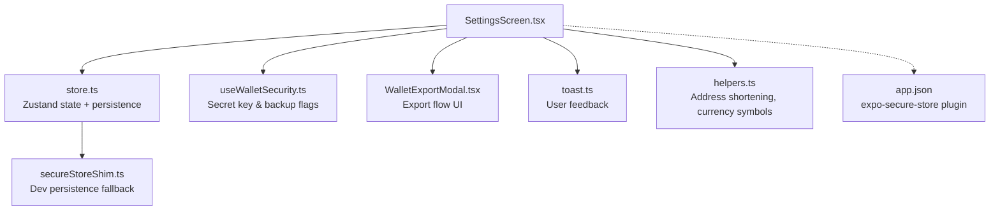
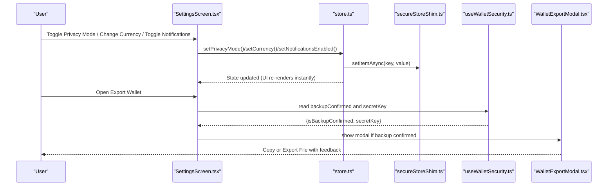
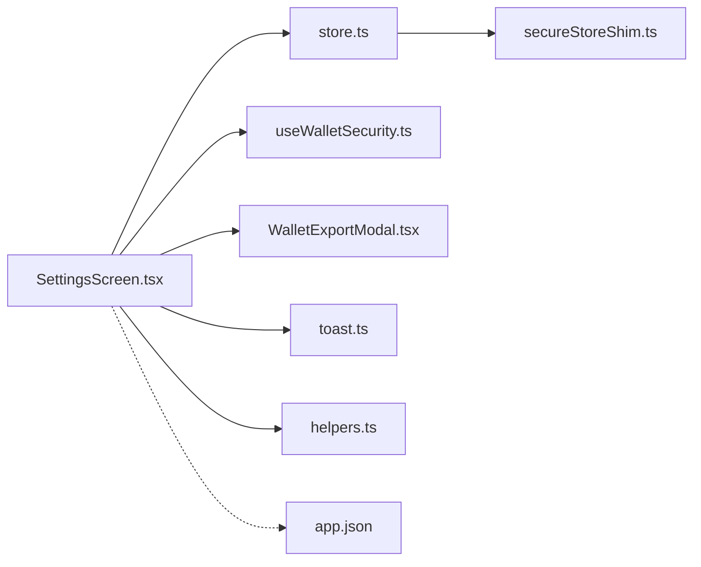
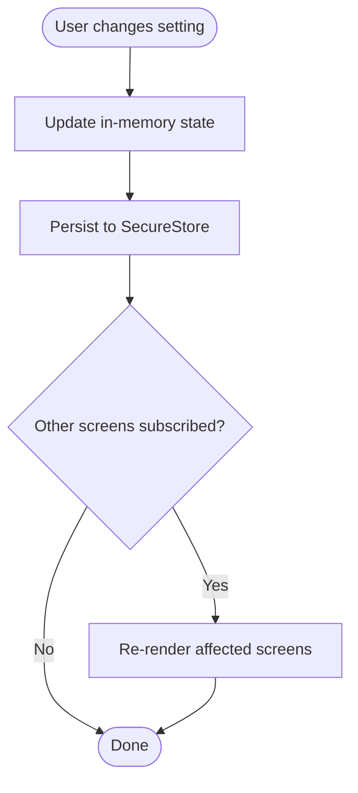

# Settings Screen

<cite>
**Referenced Files in This Document**
- [SettingsScreen.tsx](file://veilend-mobile/src/screens/SettingsScreen.tsx)
- [store.ts](file://veilend-mobile/src/store/store.ts)
- [useWalletSecurity.ts](file://veilend-mobile/src/hooks/useWalletSecurity.ts)
- [WalletExportModal.tsx](file://veilend-mobile/src/components/WalletExportModal.tsx)
- [toast.ts](file://veilend-mobile/src/utils/toast.ts)
- [helpers.ts](file://veilend-mobile/src/utils/helpers.ts)
- [secureStoreShim.ts](file://veilend-mobile/src/utils/secureStoreShim.ts)
- [app.json](file://veilend-mobile/app.json)
</cite>

## Table of Contents
1. Introduction
2. Project Structure
3. Core Components
4. Architecture Overview
5. Detailed Component Analysis
6. Dependency Analysis
7. Performance Considerations
8. Troubleshooting Guide
9. Conclusion
10. Appendices

## Introduction
This document explains the mobile app’s Settings screen, which centralizes user configuration and protocol preferences. It covers privacy mode, currency selection and formatting, notification preferences, account management, persistent storage, real-time updates across the app, reset behavior, device settings integration, theme customization options, data export capabilities, preference validation, default value handling, user feedback, accessibility considerations, and internationalization support.

## Project Structure
The Settings screen is implemented as a React Native component that reads and writes application state via a global store. Preferences are persisted securely using SecureStore (with a development shim). Security-sensitive operations like wallet export are handled by dedicated hooks and modals.

**Diagram sources**
- [SettingsScreen.tsx:25-258](file://veilend-mobile/src/screens/SettingsScreen.tsx#L25-L258)
- [store.ts:18-206](file://veilend-mobile/src/store/store.ts#L18-L206)
- [useWalletSecurity.ts:25-166](file://veilend-mobile/src/hooks/useWalletSecurity.ts#L25-L166)
- [WalletExportModal.tsx:28-257](file://veilend-mobile/src/components/WalletExportModal.tsx#L28-L257)
- [toast.ts:5-15](file://veilend-mobile/src/utils/toast.ts#L5-L15)
- [helpers.ts:1-11](file://veilend-mobile/src/utils/helpers.ts#L1-L11)
- [secureStoreShim.ts:22-53](file://veilend-mobile/src/utils/secureStoreShim.ts#L22-L53)
- [app.json:31-33](file://veilend-mobile/app.json#L31-L33)

**Section sources**
- [SettingsScreen.tsx:25-258](file://veilend-mobile/src/screens/SettingsScreen.tsx#L25-L258)
- [store.ts:18-206](file://veilend-mobile/src/store/store.ts#L18-L206)
- [app.json:31-33](file://veilend-mobile/app.json#L31-L33)

## Core Components
- Settings screen UI: profile editing, security status, preferences (currency, notifications, privacy mode), and account actions (logout).
- Global store: centralized state for preferences with secure persistence and session restore on app launch.
- Wallet security hook: manages secret key retrieval, temporary reveal timer, and backup confirmation flag.
- Export modal: guided, multi-step export flow with copy-to-clipboard and file export.
- Toast utility: cross-platform user feedback for setting changes and errors.
- Helpers: address shortening and currency symbol mapping.

Key responsibilities:
- Persist and hydrate preferences (privacy mode, currency, notifications, profile info).
- Provide immediate UI updates when preferences change.
- Enforce safety checks before exporting sensitive data.
- Offer clear user feedback for all user actions.

**Section sources**
- [SettingsScreen.tsx:25-258](file://veilend-mobile/src/screens/SettingsScreen.tsx#L25-L258)
- [store.ts:99-206](file://veilend-mobile/src/store/store.ts#L99-L206)
- [useWalletSecurity.ts:25-166](file://veilend-mobile/src/hooks/useWalletSecurity.ts#L25-L166)
- [WalletExportModal.tsx:28-257](file://veilend-mobile/src/components/WalletExportModal.tsx#L28-L257)
- [toast.ts:5-15](file://veilend-mobile/src/utils/toast.ts#L5-L15)
- [helpers.ts:1-11](file://veilend-mobile/src/utils/helpers.ts#L1-L11)

## Architecture Overview
The Settings screen composes UI components with state from the global store and security utilities. Preference changes update both in-memory state and persistent storage. On app start, the store restores previously saved preferences to ensure continuity.

**Diagram sources**
- [SettingsScreen.tsx:25-258](file://veilend-mobile/src/screens/SettingsScreen.tsx#L25-L258)
- [store.ts:173-206](file://veilend-mobile/src/store/store.ts#L173-L206)
- [useWalletSecurity.ts:33-53](file://veilend-mobile/src/hooks/useWalletSecurity.ts#L33-L53)
- [WalletExportModal.tsx:37-104](file://veilend-mobile/src/components/WalletExportModal.tsx#L37-L104)
- [secureStoreShim.ts:22-53](file://veilend-mobile/src/utils/secureStoreShim.ts#L22-L53)

## Detailed Component Analysis

### Settings Screen (UI and Actions)
- Profile section: edit username, pick avatar image, display shortened wallet address.
- Security section: shows backup status; enables export only after backup confirmation; “Reveal Secret Key” guides users to use the export flow.
- Preferences section:
  - Currency chips: select USD/EUR/GBP; selection persists immediately.
  - Notifications toggle: switches notifications preference and persists it.
  - Privacy mode toggle: hides balances across the app; toggling persists and affects other screens consuming the same store.
- Account section: logout clears in-memory state and all persisted keys.

Validation and defaults:
- Username save trims input; empty values reset to null (defaulting to shortened address elsewhere).
- Currency defaults to USD if not set.
- Notifications default to enabled.
- Privacy mode defaults to disabled.

User feedback:
- Success toast on profile update.
- Warning toast if attempting export without backup confirmation.
- Info toast guiding secret key reveal to the export flow.

Accessibility considerations:
- Use semantic labels for toggles and buttons.
- Ensure sufficient color contrast for text and controls.
- Provide accessible hints for avatar upload and save actions.

Internationalization considerations:
- Currency codes are localized via symbols helper; consider adding i18n strings for labels and messages.

Reset functionality:
- Logout resets all preferences to defaults and clears persistent storage.

**Section sources**
- [SettingsScreen.tsx:48-85](file://veilend-mobile/src/screens/SettingsScreen.tsx#L48-L85)
- [SettingsScreen.tsx:97-248](file://veilend-mobile/src/screens/SettingsScreen.tsx#L97-L248)
- [store.ts:124-149](file://veilend-mobile/src/store/store.ts#L124-L149)
- [helpers.ts:1-11](file://veilend-mobile/src/utils/helpers.ts#L1-L11)
- [toast.ts:5-15](file://veilend-mobile/src/utils/toast.ts#L5-L15)

### Store and Persistent Storage
- Centralized Zustand store holds auth, UI preferences, and portfolio-related state.
- Persistence keys include privacy mode, profile name/image, currency, notifications, and wallet backup confirmation.
- Each setter updates in-memory state and writes to SecureStore (or shim) asynchronously.
- On app launch, the store hydrates from SecureStore and applies defaults where keys are missing.

Real-time updates:
- Because the store is reactive, any change made in Settings instantly propagates to other screens that consume the same state (e.g., privacy mode affecting balance visibility).

Default values:
- Currency defaults to USD.
- Notifications default to true.
- Privacy mode defaults to false.

Reset behavior:
- Logout clears all persisted keys and resets in-memory state to defaults.

Error handling:
- Persistence calls are wrapped in try/catch to ignore transient errors while still updating UI.

**Section sources**
- [store.ts:18-206](file://veilend-mobile/src/store/store.ts#L18-L206)
- [store.ts:369-396](file://veilend-mobile/src/store/store.ts#L369-L396)
- [secureStoreShim.ts:22-53](file://veilend-mobile/src/utils/secureStoreShim.ts#L22-L53)

### Wallet Security Hook
- Loads secret key and backup confirmation flag from secure storage on mount.
- Provides methods to temporarily reveal the secret key with an auto-expiring timer.
- Confirms backup by persisting a flag that gates export actions.
- Clears clipboard content after a short period to reduce exposure risk.

Integration with Settings:
- Settings uses this hook to enforce backup confirmation before allowing export.
- The “Reveal Secret Key” action informs users to use the export flow instead of direct reveal.

**Section sources**
- [useWalletSecurity.ts:25-166](file://veilend-mobile/src/hooks/useWalletSecurity.ts#L25-L166)

### Wallet Export Modal
- Multi-step flow: warning, export options, success confirmation.
- Options:
  - Copy to clipboard with automatic clearing after a timeout.
  - Export to file and optionally share via system share sheet.
- User feedback via toast for success, info, and error states.

Safety:
- Requires backup confirmation to proceed.
- Warns about risks and advises secure storage.

**Section sources**
- [WalletExportModal.tsx:28-257](file://veilend-mobile/src/components/WalletExportModal.tsx#L28-L257)
- [WalletExportModal.tsx:37-104](file://veilend-mobile/src/components/WalletExportModal.tsx#L37-L104)

### Toast Utility
- Cross-platform notifications: Android uses native toast; iOS uses alert-style fallback.
- Exposes convenience helpers for success, error, and info messages used throughout Settings.

**Section sources**
- [toast.ts:5-15](file://veilend-mobile/src/utils/toast.ts#L5-L15)

### Helpers
- Shortens wallet addresses for display.
- Maps currency codes to symbols for consistent formatting.

**Section sources**
- [helpers.ts:1-11](file://veilend-mobile/src/utils/helpers.ts#L1-L11)

## Dependency Analysis

**Diagram sources**
- [SettingsScreen.tsx:25-258](file://veilend-mobile/src/screens/SettingsScreen.tsx#L25-L258)
- [store.ts:18-206](file://veilend-mobile/src/store/store.ts#L18-L206)
- [useWalletSecurity.ts:25-166](file://veilend-mobile/src/hooks/useWalletSecurity.ts#L25-L166)
- [WalletExportModal.tsx:28-257](file://veilend-mobile/src/components/WalletExportModal.tsx#L28-L257)
- [toast.ts:5-15](file://veilend-mobile/src/utils/toast.ts#L5-L15)
- [helpers.ts:1-11](file://veilend-mobile/src/utils/helpers.ts#L1-L11)
- [secureStoreShim.ts:22-53](file://veilend-mobile/src/utils/secureStoreShim.ts#L22-L53)
- [app.json:31-33](file://veilend-mobile/app.json#L31-L33)

**Section sources**
- [SettingsScreen.tsx:25-258](file://veilend-mobile/src/screens/SettingsScreen.tsx#L25-L258)
- [store.ts:18-206](file://veilend-mobile/src/store/store.ts#L18-L206)

## Performance Considerations
- Preference setters perform asynchronous persistence; UI updates are synchronous and immediate, avoiding perceived lag.
- Batched hydration on app launch minimizes initial render jank.
- Export modal avoids heavy work until user confirms; file write occurs only on explicit action.
- Clipboard clearing uses timers to limit exposure window without blocking UI.

[No sources needed since this section provides general guidance]

## Troubleshooting Guide
Common issues and resolutions:
- Export disabled: ensure wallet backup is confirmed via the security flow before enabling export.
- Preferences not persisting: verify SecureStore availability and permissions; check that setters are invoked and no exceptions are thrown during persistence.
- Notifications toggle has no effect: confirm platform notification permissions are granted at the OS level; integrate with device notification settings APIs as needed.
- Theme not applying: ensure app-level theme provider consumes the correct style mode; current app config sets light UI style.

**Section sources**
- [useWalletSecurity.ts:107-119](file://veilend-mobile/src/hooks/useWalletSecurity.ts#L107-L119)
- [store.ts:124-149](file://veilend-mobile/src/store/store.ts#L124-L149)
- [app.json:8-8](file://veilend-mobile/app.json#L8-L8)

## Conclusion
The Settings screen provides a cohesive interface for managing privacy, currency, notifications, and account actions. Preferences are persisted securely and restored on launch, ensuring consistency across sessions. Real-time updates propagate through the global store, and safety guards prevent accidental exposure of sensitive data. With thoughtful UX feedback, accessibility awareness, and extensibility for internationalization and theme customization, the Settings screen forms a robust foundation for user configuration.

[No sources needed since this section summarizes without analyzing specific files]

## Appendices

### Data Flow: Preference Update Sequence

**Diagram sources**
- [store.ts:173-206](file://veilend-mobile/src/store/store.ts#L173-L206)
- [store.ts:369-396](file://veilend-mobile/src/store/store.ts#L369-L396)

### Device Settings Integration Notes
- Notifications: integrate with platform notification permission APIs to honor the user’s preference and guide them to device settings if denied.
- Theme: leverage app-level theme context; ensure settings can switch between light/dark modes and persist the choice.

[No sources needed since this section provides general guidance]