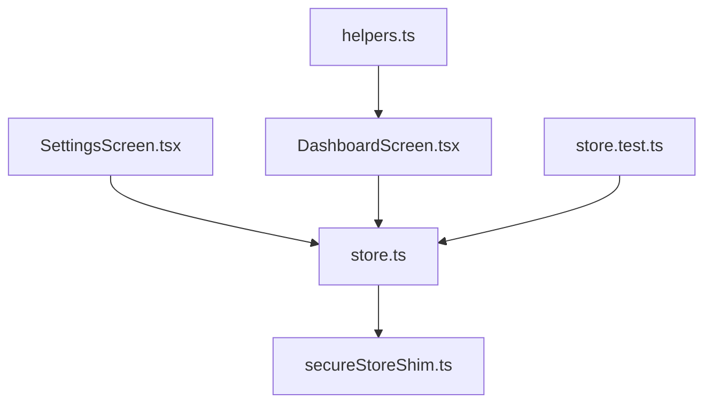
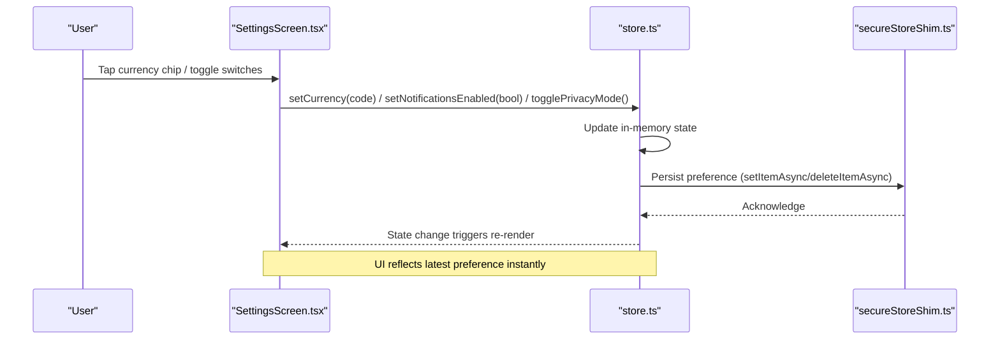
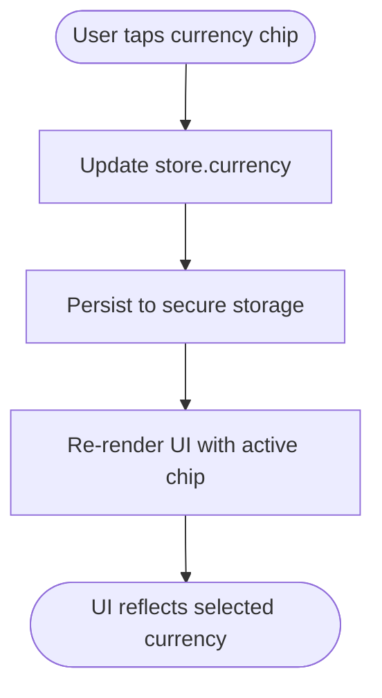
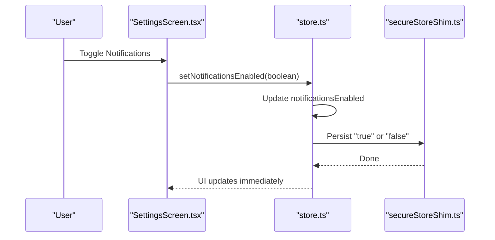
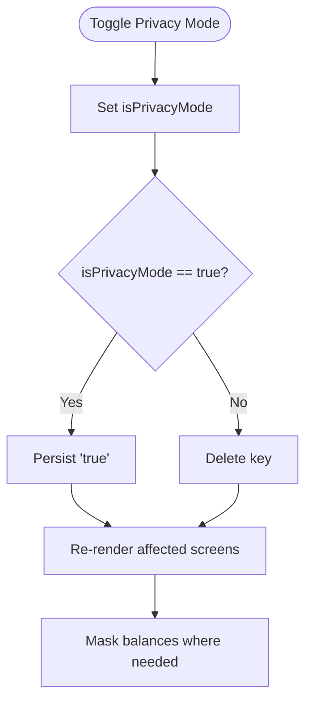
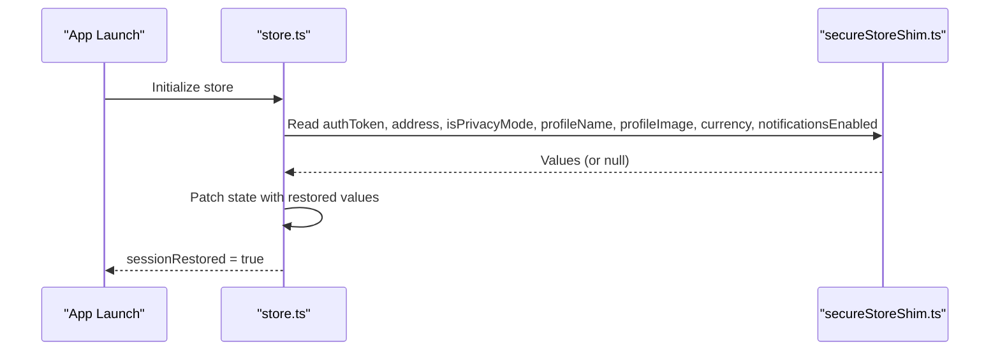
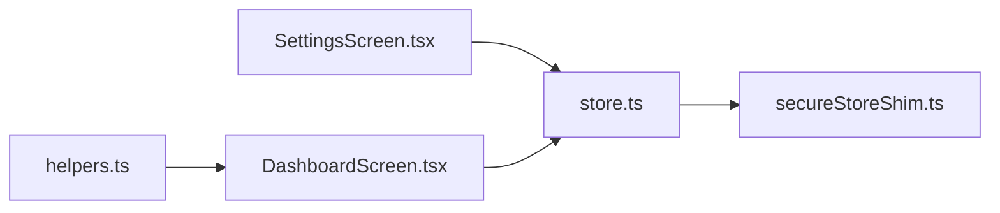

# User Preferences

<cite>
**Referenced Files in This Document**
- [SettingsScreen.tsx](file://veilend-mobile/src/screens/SettingsScreen.tsx)
- [store.ts](file://veilend-mobile/src/store/store.ts)
- [secureStoreShim.ts](file://veilend-mobile/src/utils/secureStoreShim.ts)
- [helpers.ts](file://veilend-mobile/src/utils/helpers.ts)
- [DashboardScreen.tsx](file://veilend-mobile/src/screens/DashboardScreen.tsx)
- [store.test.ts](file://veilend-mobile/src/store/store.test.ts)
</cite>

## Table of Contents
1. Introduction
2. Project Structure
3. Core Components
4. Architecture Overview
5. Detailed Component Analysis
6. Dependency Analysis
7. Performance Considerations
8. Troubleshooting Guide
9. Conclusion

## Introduction
This document explains how user preferences are managed in the mobile application, focusing on:
- Currency selection with a chip-based UI (USD, EUR, GBP) and visual feedback for the selected currency
- Notifications toggle that integrates with system-level notifications
- Privacy mode that hides sensitive information across the app
- Preference persistence and synchronization across the application using secure storage and Zustand state

It also covers preference state management patterns, real-time UI updates, and validation rules applied to preferences.

## Project Structure
The preference system spans a few key areas:
- Settings screen provides the user interface for selecting currency, toggling notifications, and enabling privacy mode
- Global store manages preference state and persists changes to secure storage
- Utilities provide currency symbol mapping and a secure storage shim for development/testing
- Dashboard demonstrates how privacy mode affects balance display

**Diagram sources**
- [SettingsScreen.tsx:25-39](file://veilend-mobile/src/screens/SettingsScreen.tsx#L25-L39)
- [store.ts:18-29](file://veilend-mobile/src/store/store.ts#L18-L29)
- [secureStoreShim.ts:22-35](file://veilend-mobile/src/utils/secureStoreShim.ts#L22-L35)
- [DashboardScreen.tsx:147-152](file://veilend-mobile/src/screens/DashboardScreen.tsx#L147-L152)
- [helpers.ts:6-10](file://veilend-mobile/src/utils/helpers.ts#L6-L10)
- [store.test.ts:136-173](file://veilend-mobile/src/store/store.test.ts#L136-L173)

**Section sources**
- [SettingsScreen.tsx:25-39](file://veilend-mobile/src/screens/SettingsScreen.tsx#L25-L39)
- [store.ts:18-29](file://veilend-mobile/src/store/store.ts#L18-L29)
- [secureStoreShim.ts:22-35](file://veilend-mobile/src/utils/secureStoreShim.ts#L22-L35)
- [helpers.ts:6-10](file://veilend-mobile/src/utils/helpers.ts#L6-L10)
- [DashboardScreen.tsx:147-152](file://veilend-mobile/src/screens/DashboardScreen.tsx#L147-L152)
- [store.test.ts:136-173](file://veilend-mobile/src/store/store.test.ts#L136-L173)

## Core Components
- Currency chips: A horizontal list of selectable chips for USD, EUR, GBP. The active chip is visually highlighted.
- Notifications switch: A toggle that enables or disables notifications; persisted as a boolean string.
- Privacy mode switch: A toggle that hides balances and sensitive data across screens; persisted as a boolean flag.
- Secure storage: Preferences are stored using a secure storage abstraction that falls back to a memory-backed shim during development.
- Store hydration: On app launch, the store hydrates from secure storage so preferences persist across sessions.

Key behaviors:
- Default values: currency defaults to USD, notificationsEnabled defaults to true, privacy mode starts disabled.
- Real-time UI updates: Changes in the store immediately update the UI via React re-renders.
- Persistence: All preference changes are written to secure storage asynchronously.
- Session restore: On startup, the store reads persisted keys and restores previous preferences.

**Section sources**
- [SettingsScreen.tsx:187-238](file://veilend-mobile/src/screens/SettingsScreen.tsx#L187-L238)
- [store.ts:186-206](file://veilend-mobile/src/store/store.ts#L186-L206)
- [store.ts:369-396](file://veilend-mobile/src/store/store.ts#L369-L396)
- [secureStoreShim.ts:22-35](file://veilend-mobile/src/utils/secureStoreShim.ts#L22-L35)

## Architecture Overview
The preference flow connects UI interactions to global state and persistent storage.

**Diagram sources**
- [SettingsScreen.tsx:191-238](file://veilend-mobile/src/screens/SettingsScreen.tsx#L191-L238)
- [store.ts:186-206](file://veilend-mobile/src/store/store.ts#L186-L206)
- [secureStoreShim.ts:22-35](file://veilend-mobile/src/utils/secureStoreShim.ts#L22-L35)

## Detailed Component Analysis

### Currency Selection (Chip-Based UI)
- Options: USD, EUR, GBP defined in the settings screen.
- Visual feedback: The selected chip receives an active style; text color and border highlight indicate selection.
- State management: The current currency is stored in the global store and updated via setCurrency.
- Persistence: The selected currency is saved to secure storage whenever changed.
- Display usage: Other screens use a helper to map currency codes to symbols for formatting amounts.

**Diagram sources**
- [SettingsScreen.tsx:191-208](file://veilend-mobile/src/screens/SettingsScreen.tsx#L191-L208)
- [store.ts:186-195](file://veilend-mobile/src/store/store.ts#L186-L195)
- [helpers.ts:6-10](file://veilend-mobile/src/utils/helpers.ts#L6-L10)

**Section sources**
- [SettingsScreen.tsx:22-23](file://veilend-mobile/src/screens/SettingsScreen.tsx#L22-L23)
- [SettingsScreen.tsx:191-208](file://veilend-mobile/src/screens/SettingsScreen.tsx#L191-L208)
- [store.ts:186-195](file://veilend-mobile/src/store/store.ts#L186-L195)
- [helpers.ts:6-10](file://veilend-mobile/src/utils/helpers.ts#L6-L10)

### Notifications Toggle
- UI: A switch labeled “Notifications” with descriptive subtext.
- Behavior: Toggling updates notificationsEnabled in the store and persists the value as a string ("true"/"false").
- Defaults: Enabled by default; reset to enabled on logout.
- System integration note: The current implementation persists the preference; actual system notification registration is not shown in the referenced files.

**Diagram sources**
- [SettingsScreen.tsx:212-223](file://veilend-mobile/src/screens/SettingsScreen.tsx#L212-L223)
- [store.ts:196-206](file://veilend-mobile/src/store/store.ts#L196-L206)
- [secureStoreShim.ts:22-35](file://veilend-mobile/src/utils/secureStoreShim.ts#L22-L35)

**Section sources**
- [SettingsScreen.tsx:212-223](file://veilend-mobile/src/screens/SettingsScreen.tsx#L212-L223)
- [store.ts:196-206](file://veilend-mobile/src/store/store.ts#L196-L206)
- [store.test.ts:151-158](file://veilend-mobile/src/store/store.test.ts#L151-L158)

### Privacy Mode
- Purpose: Hide balances and sensitive information across the app when enabled.
- UI: A switch labeled “Privacy Mode” with descriptive subtext.
- Behavior: Toggles isPrivacyMode in the store; when true, stores "true"; when false, deletes the key.
- Cross-screen effect: Screens like the dashboard read isPrivacyMode to mask or reveal values and icons.

**Diagram sources**
- [store.ts:173-185](file://veilend-mobile/src/store/store.ts#L173-L185)
- [DashboardScreen.tsx:147-152](file://veilend-mobile/src/screens/DashboardScreen.tsx#L147-L152)

**Section sources**
- [SettingsScreen.tsx:227-238](file://veilend-mobile/src/screens/SettingsScreen.tsx#L227-L238)
- [store.ts:173-185](file://veilend-mobile/src/store/store.ts#L173-L185)
- [DashboardScreen.tsx:147-152](file://veilend-mobile/src/screens/DashboardScreen.tsx#L147-L152)
- [store.test.ts:116-134](file://veilend-mobile/src/store/store.test.ts#L116-L134)

### Preference Persistence and Session Restore
- Keys: Preferences are stored under dedicated keys for currency, notificationsEnabled, and isPrivacyMode.
- Hydration: On app start, the store reads these keys and restores previous values into memory.
- Logout behavior: Logging out resets preferences to defaults and clears all persisted keys.

**Diagram sources**
- [store.ts:369-396](file://veilend-mobile/src/store/store.ts#L369-L396)
- [secureStoreShim.ts:22-35](file://veilend-mobile/src/utils/secureStoreShim.ts#L22-L35)

**Section sources**
- [store.ts:18-29](file://veilend-mobile/src/store/store.ts#L18-L29)
- [store.ts:369-396](file://veilend-mobile/src/store/store.ts#L369-L396)
- [store.test.ts:160-173](file://veilend-mobile/src/store/store.test.ts#L160-L173)

### Example: Preference State Management and Real-Time UI Updates
- Selecting a currency updates the store and immediately highlights the corresponding chip.
- Toggling notifications or privacy mode updates the store and causes dependent components to re-render with new visuals.
- Tests verify defaults, persistence, and logout behavior for these preferences.

**Section sources**
- [SettingsScreen.tsx:191-238](file://veilend-mobile/src/screens/SettingsScreen.tsx#L191-L238)
- [store.test.ts:136-173](file://veilend-mobile/src/store/store.test.ts#L136-L173)

## Dependency Analysis
- SettingsScreen depends on the global store for reading/writing preferences and on helpers for displaying currency symbols.
- Store depends on secure storage for persistence and exposes actions that encapsulate both state updates and persistence.
- Dashboard uses store state to conditionally render masked values based on privacy mode.

**Diagram sources**
- [SettingsScreen.tsx:25-39](file://veilend-mobile/src/screens/SettingsScreen.tsx#L25-L39)
- [store.ts:186-206](file://veilend-mobile/src/store/store.ts#L186-L206)
- [secureStoreShim.ts:22-35](file://veilend-mobile/src/utils/secureStoreShim.ts#L22-L35)
- [DashboardScreen.tsx:147-152](file://veilend-mobile/src/screens/DashboardScreen.tsx#L147-L152)
- [helpers.ts:6-10](file://veilend-mobile/src/utils/helpers.ts#L6-L10)

**Section sources**
- [SettingsScreen.tsx:25-39](file://veilend-mobile/src/screens/SettingsScreen.tsx#L25-L39)
- [store.ts:186-206](file://veilend-mobile/src/store/store.ts#L186-L206)
- [secureStoreShim.ts:22-35](file://veilend-mobile/src/utils/secureStoreShim.ts#L22-L35)
- [DashboardScreen.tsx:147-152](file://veilend-mobile/src/screens/DashboardScreen.tsx#L147-L152)
- [helpers.ts:6-10](file://veilend-mobile/src/utils/helpers.ts#L6-L10)

## Performance Considerations
- Asynchronous persistence: All writes to secure storage are non-blocking; errors are ignored to avoid blocking UI updates.
- Minimal re-renders: Zustand updates trigger targeted re-renders only for components consuming changed preferences.
- Startup hydration: Reading multiple keys concurrently reduces initial load time.

[No sources needed since this section provides general guidance]

## Troubleshooting Guide
Common issues and resolutions:
- Currency not persisting: Ensure setCurrency is called and that secure storage write completes; tests assert persistence after a microtask flush.
- Notifications not remembered: Verify setNotificationsEnabled is invoked and that the correct key is stored; logout clears preferences by design.
- Privacy mode not affecting other screens: Confirm that screens read isPrivacyMode and conditionally mask values; check dashboard logic for masking.
- Session restore not applying: Check that hydration runs and sets sessionRestored; if hydration fails, the store still marks session as restored to prevent UI hangs.

Validation rules observed:
- Currency must be one of the supported codes (USD, EUR, GBP) as defined in the settings screen.
- NotificationsEnabled is a boolean persisted as a string; defaults to true.
- PrivacyMode is a boolean; storing "true" when enabled and deleting the key when disabled.

**Section sources**
- [store.test.ts:136-173](file://veilend-mobile/src/store/store.test.ts#L136-L173)
- [store.ts:173-206](file://veilend-mobile/src/store/store.ts#L173-L206)
- [store.ts:369-396](file://veilend-mobile/src/store/store.ts#L369-L396)

## Conclusion
The preference system provides a clean separation between UI, state, and persistence:
- Users can select a currency via chips with clear visual feedback
- Notifications can be toggled and remembered across sessions
- Privacy mode masks sensitive information consistently across screens
- Preferences are reliably persisted and restored on app launch
- Tests validate defaults, persistence, and logout behavior

This architecture ensures predictable, testable, and maintainable preference management suitable for future enhancements such as additional currencies, advanced notification integrations, or expanded privacy controls.