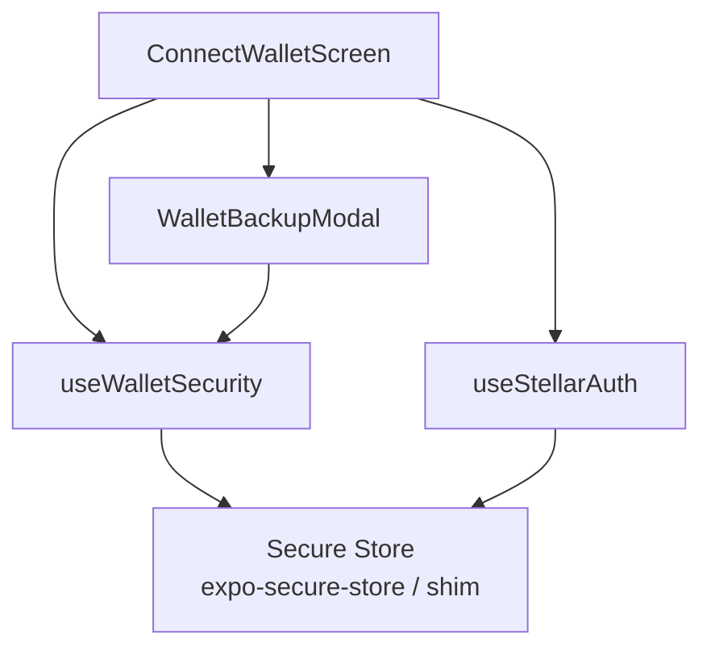
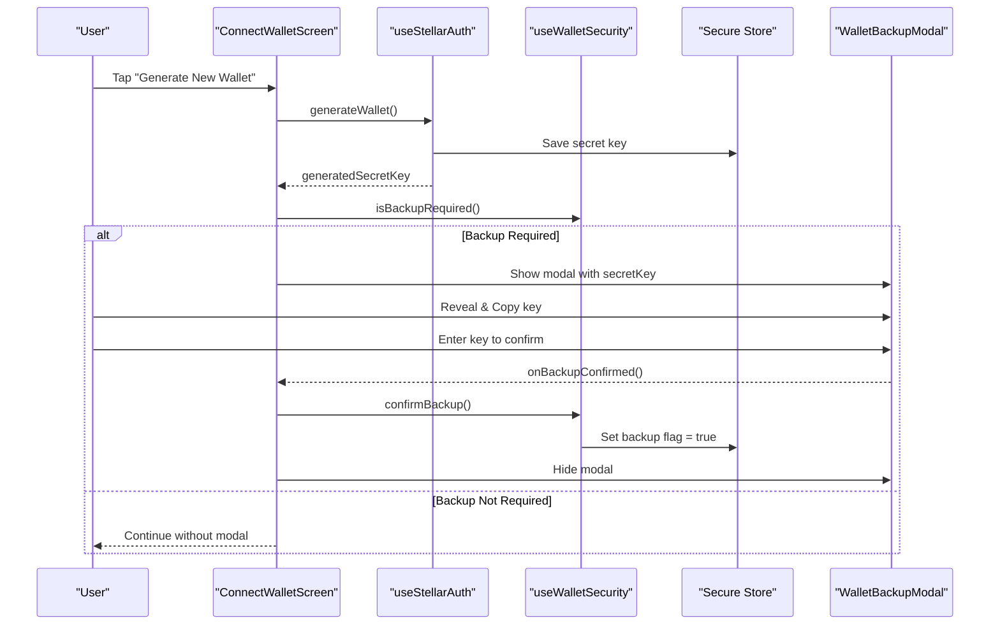
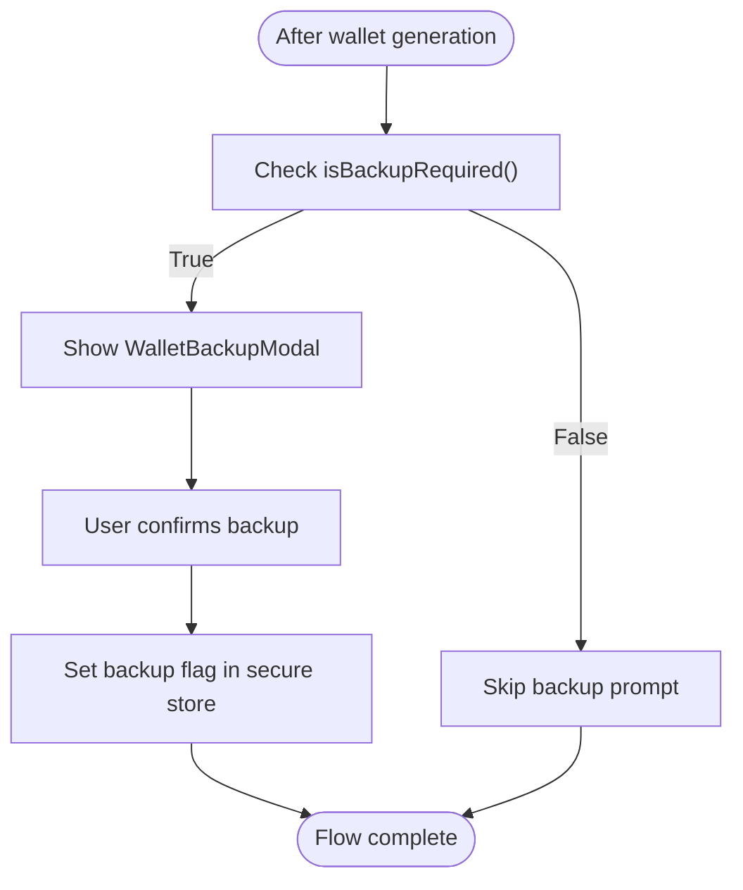
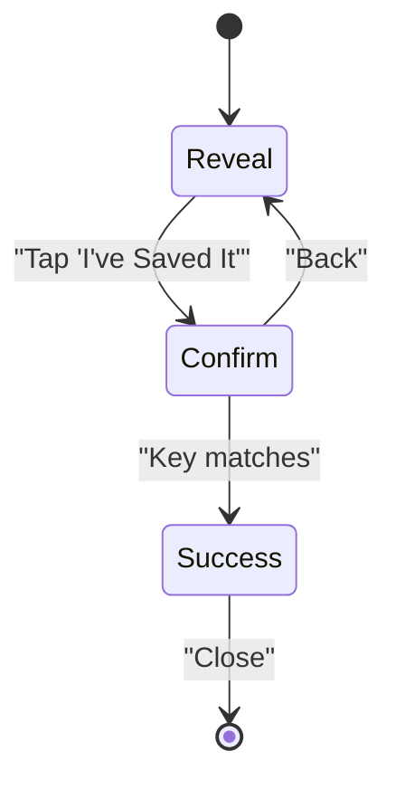
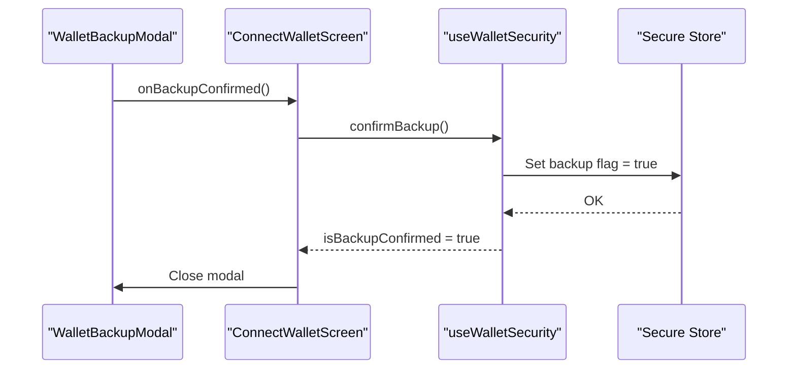
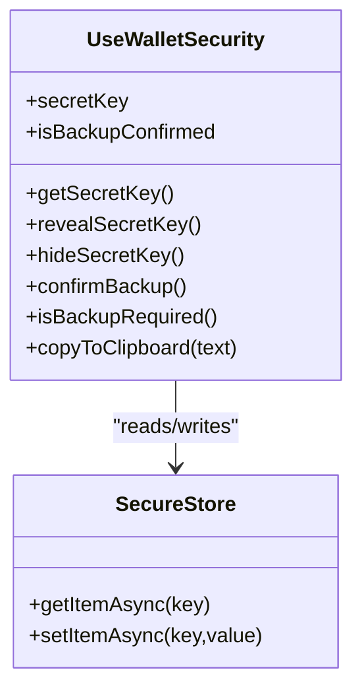
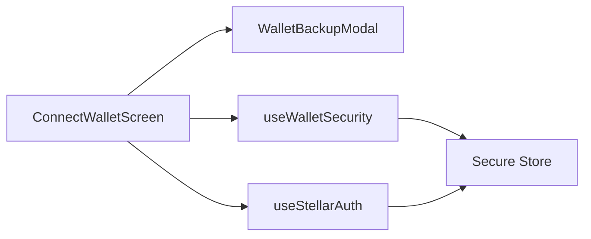

# Backup Workflow

<cite>
**Referenced Files in This Document**
- [ConnectWalletScreen.tsx](file://veilend-mobile/src/screens/ConnectWalletScreen.tsx)
- [WalletBackupModal.tsx](file://veilend-mobile/src/components/WalletBackupModal.tsx)
- [useWalletSecurity.ts](file://veilend-mobile/src/hooks/useWalletSecurity.ts)
- [secureStoreShim.ts](file://veilend-mobile/src/utils/secureStoreShim.ts)
- [useStellarAuth.ts](file://veilend-mobile/src/hooks/useStellarAuth.ts)
</cite>

## Table of Contents
1. [Introduction](#introduction)
2. [Project Structure](#project-structure)
3. [Core Components](#core-components)
4. [Architecture Overview](#architecture-overview)
5. [Detailed Component Analysis](#detailed-component-analysis)
6. [Dependency Analysis](#dependency-analysis)
7. [Performance Considerations](#performance-considerations)
8. [Troubleshooting Guide](#troubleshooting-guide)
9. [Conclusion](#conclusion)

## Introduction
This document explains the wallet backup workflow that ensures users securely back up their generated wallets. It covers:
- How the app checks whether a backup is required
- The WalletBackupModal component implementation and user flow
- Integration with the useWalletSecurity hook for tracking backup status
- Handling of generatedSecretKey and the confirmBackup function
- Modal state management, user interaction patterns, and fallbacks when backup is skipped
- Security considerations for temporary key storage and educating users about backup importance

## Project Structure
The backup workflow spans a small set of focused modules:
- Screen orchestration: ConnectWalletScreen triggers backup prompts after wallet generation
- UI modal: WalletBackupModal guides users through revealing, copying, confirming, and completing backup
- Security hook: useWalletSecurity manages secret key retrieval, reveal timers, backup confirmation flag, clipboard safety, and backup requirement checks
- Storage abstraction: secureStoreShim provides a consistent API to persist secret keys and backup flags (replaced by expo-secure-store in production)
- Wallet creation: useStellarAuth generates or imports wallets and stores the secret key

**Diagram sources**
- [ConnectWalletScreen.tsx:55-66](file://veilend-mobile/src/screens/ConnectWalletScreen.tsx#L55-L66)
- [WalletBackupModal.tsx:28-87](file://veilend-mobile/src/components/WalletBackupModal.tsx#L28-L87)
- [useWalletSecurity.ts:25-123](file://veilend-mobile/src/hooks/useWalletSecurity.ts#L25-L123)
- [useStellarAuth.ts:38-42](file://veilend-mobile/src/hooks/useStellarAuth.ts#L38-L42)
- [secureStoreShim.ts:22-30](file://veilend-mobile/src/utils/secureStoreShim.ts#L22-L30)

**Section sources**
- [ConnectWalletScreen.tsx:24-37](file://veilend-mobile/src/screens/ConnectWalletScreen.tsx#L24-L37)
- [WalletBackupModal.tsx:19-37](file://veilend-mobile/src/components/WalletBackupModal.tsx#L19-L37)
- [useWalletSecurity.ts:14-23](file://veilend-mobile/src/hooks/useWalletSecurity.ts#L14-L23)
- [secureStoreShim.ts:1-12](file://veilend-mobile/src/utils/secureStoreShim.ts#L1-L12)
- [useStellarAuth.ts:38-42](file://veilend-mobile/src/hooks/useStellarAuth.ts#L38-L42)

## Core Components
- ConnectWalletScreen: Orchestrates wallet generation and shows the backup modal when needed. It uses useStellarAuth to generate a wallet and useWalletSecurity to determine if backup is required and to mark backup as confirmed.
- WalletBackupModal: Presents a three-step flow: reveal secret key, confirm by re-entering it, and success screen with tips. It handles copy-to-clipboard and validation feedback via toast notifications.
- useWalletSecurity: Manages persistent backup state and secret key access. Provides:
  - getSecretKey/revealSecretKey/hideSecretKey for secure display
  - confirmBackup to persist backup confirmation
  - isBackupRequired to gate backup prompts
  - copyToClipboard with automatic clearing for platform security
- secureStoreShim: Abstraction over secure storage used during development; in production, expo-secure-store is used transparently.

**Section sources**
- [ConnectWalletScreen.tsx:55-66](file://veilend-mobile/src/screens/ConnectWalletScreen.tsx#L55-L66)
- [WalletBackupModal.tsx:28-87](file://veilend-mobile/src/components/WalletBackupModal.tsx#L28-L87)
- [useWalletSecurity.ts:64-123](file://veilend-mobile/src/hooks/useWalletSecurity.ts#L64-L123)
- [secureStoreShim.ts:22-30](file://veilend-mobile/src/utils/secureStoreShim.ts#L22-L30)

## Architecture Overview
The backup workflow integrates UI, state, and storage into a cohesive flow:

**Diagram sources**
- [ConnectWalletScreen.tsx:55-66](file://veilend-mobile/src/screens/ConnectWalletScreen.tsx#L55-L66)
- [useStellarAuth.ts:38-42](file://veilend-mobile/src/hooks/useStellarAuth.ts#L38-L42)
- [useWalletSecurity.ts:107-123](file://veilend-mobile/src/hooks/useWalletSecurity.ts#L107-L123)
- [WalletBackupModal.tsx:64-87](file://veilend-mobile/src/components/WalletBackupModal.tsx#L64-L87)

## Detailed Component Analysis

### Backup Requirement Checking Mechanism
- The screen calls isBackupRequired after generating a wallet. If true, it opens the backup modal.
- isBackupRequired returns true when a secret key exists but the backup has not been confirmed yet.
- On app startup, useWalletSecurity loads both the stored secret key and backup flag from secure storage to initialize state.

**Diagram sources**
- [ConnectWalletScreen.tsx:55-66](file://veilend-mobile/src/screens/ConnectWalletScreen.tsx#L55-L66)
- [useWalletSecurity.ts:121-123](file://veilend-mobile/src/hooks/useWalletSecurity.ts#L121-L123)
- [useWalletSecurity.ts:34-53](file://veilend-mobile/src/hooks/useWalletSecurity.ts#L34-L53)

**Section sources**
- [ConnectWalletScreen.tsx:55-66](file://veilend-mobile/src/screens/ConnectWalletScreen.tsx#L55-L66)
- [useWalletSecurity.ts:34-53](file://veilend-mobile/src/hooks/useWalletSecurity.ts#L34-L53)
- [useWalletSecurity.ts:121-123](file://veilend-mobile/src/hooks/useWalletSecurity.ts#L121-L123)

### WalletBackupModal Implementation
- Three-step state machine: reveal -> confirm -> success
- Reveal step:
  - Displays masked key by default; user can reveal full key
  - Offers copy-to-clipboard with toast feedback
  - Disables next until key is revealed
- Confirm step:
  - Requires exact re-entry of the secret key
  - Validates input and provides error toast on mismatch
  - Moves to success step on match
- Success step:
  - Shows completion message and best-practice tips
  - Closes modal and resets internal state

**Diagram sources**
- [WalletBackupModal.tsx:34-87](file://veilend-mobile/src/components/WalletBackupModal.tsx#L34-L87)
- [WalletBackupModal.tsx:89-237](file://veilend-mobile/src/components/WalletBackupModal.tsx#L89-L237)

**Section sources**
- [WalletBackupModal.tsx:28-87](file://veilend-mobile/src/components/WalletBackupModal.tsx#L28-L87)
- [WalletBackupModal.tsx:89-237](file://veilend-mobile/src/components/WalletBackupModal.tsx#L89-L237)

### Confirmation Flow and State Management
- When the modal confirms backup, it calls onBackupConfirmed which triggers confirmBackup in the parent screen.
- confirmBackup persists the backup flag and updates local state so future sessions skip the backup prompt.
- Modal state resets on close to ensure clean UX on subsequent backups.

**Diagram sources**
- [WalletBackupModal.tsx:64-87](file://veilend-mobile/src/components/WalletBackupModal.tsx#L64-L87)
- [ConnectWalletScreen.tsx:63-66](file://veilend-mobile/src/screens/ConnectWalletScreen.tsx#L63-L66)
- [useWalletSecurity.ts:107-119](file://veilend-mobile/src/hooks/useWalletSecurity.ts#L107-L119)

**Section sources**
- [WalletBackupModal.tsx:64-87](file://veilend-mobile/src/components/WalletBackupModal.tsx#L64-L87)
- [ConnectWalletScreen.tsx:63-66](file://veilend-mobile/src/screens/ConnectWalletScreen.tsx#L63-L66)
- [useWalletSecurity.ts:107-119](file://veilend-mobile/src/hooks/useWalletSecurity.ts#L107-L119)

### Integration with useWalletSecurity Hook
- Secret key lifecycle:
  - Generated/imported via useStellarAuth and saved to secure storage
  - Retrieved via getSecretKey or revealed temporarily via revealSecretKey with a timed auto-hide
- Backup tracking:
  - Loads backup flag on mount
  - Updates flag via confirmBackup
  - Determines need for backup via isBackupRequired
- Clipboard safety:
  - copyToClipboard sets a timer to clear clipboard content after a short duration to reduce exposure risk

**Diagram sources**
- [useWalletSecurity.ts:25-166](file://veilend-mobile/src/hooks/useWalletSecurity.ts#L25-L166)
- [secureStoreShim.ts:22-30](file://veilend-mobile/src/utils/secureStoreShim.ts#L22-L30)

**Section sources**
- [useWalletSecurity.ts:25-166](file://veilend-mobile/src/hooks/useWalletSecurity.ts#L25-L166)
- [secureStoreShim.ts:22-30](file://veilend-mobile/src/utils/secureStoreShim.ts#L22-L30)

### generatedSecretKey Handling
- After wallet generation, useStellarAuth saves the secret key to secure storage and exposes generatedSecretKey to the screen.
- The screen passes this key to WalletBackupModal for display and confirmation.
- This ensures the modal operates on the freshly generated key rather than any previously stored key.

**Section sources**
- [useStellarAuth.ts:38-42](file://veilend-mobile/src/hooks/useStellarAuth.ts#L38-L42)
- [ConnectWalletScreen.tsx:55-66](file://veilend-mobile/src/screens/ConnectWalletScreen.tsx#L55-L66)
- [WalletBackupModal.tsx:28-47](file://veilend-mobile/src/components/WalletBackupModal.tsx#L28-L47)

### Modal State Management and User Interaction Patterns
- Local modal state:
  - step controls current view (reveal/confirm/success)
  - isSecretRevealed toggles visibility of the full key
  - confirmInput captures user re-entry for validation
- User interactions:
  - Reveal key to enable copy and next actions
  - Copy key to clipboard with immediate feedback
  - Re-enter key to confirm backup; errors shown via toast
  - Success screen provides educational tips and closes modal

**Section sources**
- [WalletBackupModal.tsx:34-87](file://veilend-mobile/src/components/WalletBackupModal.tsx#L34-L87)
- [WalletBackupModal.tsx:89-237](file://veilend-mobile/src/components/WalletBackupModal.tsx#L89-L237)

### Fallback Mechanisms if Backup Is Skipped
- Current behavior:
  - If backup is not required (e.g., already confirmed), the modal is not shown and the user proceeds
  - If the user closes the modal without confirming, the screen does not force confirmation; however, the next session will prompt again because the backup flag remains unset
- Recommendations:
  - Consider blocking navigation until backup is confirmed for first-time users
  - Provide an explicit “Skip” option only after warning and logging
  - Persist a “skipped once” flag to avoid repeated prompts while still encouraging backup later

[No sources needed since this section proposes enhancements beyond current code]

## Dependency Analysis
- ConnectWalletScreen depends on:
  - useStellarAuth for wallet generation and secret key availability
  - useWalletSecurity for backup requirement checks and confirmation
  - WalletBackupModal for UI and user confirmation
- useWalletSecurity depends on:
  - Secure storage abstraction (expo-secure-store in production, shim in dev)
  - Clipboard API for safe temporary storage
- secureStoreShim provides a consistent interface regardless of environment

**Diagram sources**
- [ConnectWalletScreen.tsx:24-37](file://veilend-mobile/src/screens/ConnectWalletScreen.tsx#L24-L37)
- [useWalletSecurity.ts:6-12](file://veilend-mobile/src/hooks/useWalletSecurity.ts#L6-L12)
- [useStellarAuth.ts:38-42](file://veilend-mobile/src/hooks/useStellarAuth.ts#L38-L42)
- [secureStoreShim.ts:1-12](file://veilend-mobile/src/utils/secureStoreShim.ts#L1-L12)

**Section sources**
- [ConnectWalletScreen.tsx:24-37](file://veilend-mobile/src/screens/ConnectWalletScreen.tsx#L24-L37)
- [useWalletSecurity.ts:6-12](file://veilend-mobile/src/hooks/useWalletSecurity.ts#L6-L12)
- [useStellarAuth.ts:38-42](file://veilend-mobile/src/hooks/useStellarAuth.ts#L38-L42)
- [secureStoreShim.ts:1-12](file://veilend-mobile/src/utils/secureStoreShim.ts#L1-L12)

## Performance Considerations
- Minimal re-renders: Modal uses local state for steps and inputs; parent state changes only when necessary
- Timed reveal: Auto-hiding secret key reduces exposure window and avoids long-lived sensitive data in memory
- Clipboard cleanup: Automatic clearing mitigates accidental persistence of secrets in system clipboard
- Storage reads/writes: Batched on app start; single writes on confirmBackup

[No sources needed since this section provides general guidance]

## Troubleshooting Guide
- Backup modal does not appear:
  - Verify isBackupRequired returns true after wallet generation
  - Ensure secret key was saved to secure storage by useStellarAuth
  - Check that backup flag is not already set to true
- Confirmation fails:
  - Ensure the re-entered key exactly matches the original key
  - Check for whitespace or case differences; input disables auto-correct and uses character mode
- Secret key not visible:
  - Confirm the user tapped reveal before attempting to copy or proceed
  - Validate that secretKey prop is non-null in the modal
- Backup flag not persisting:
  - Confirm Secure Store write succeeds in confirmBackup
  - In development, verify the shim is being used; in production, ensure expo-secure-store is configured

**Section sources**
- [ConnectWalletScreen.tsx:55-66](file://veilend-mobile/src/screens/ConnectWalletScreen.tsx#L55-L66)
- [WalletBackupModal.tsx:64-87](file://veilend-mobile/src/components/WalletBackupModal.tsx#L64-L87)
- [useWalletSecurity.ts:107-119](file://veilend-mobile/src/hooks/useWalletSecurity.ts#L107-L119)
- [useStellarAuth.ts:38-42](file://veilend-mobile/src/hooks/useStellarAuth.ts#L38-L42)

## Conclusion
The backup workflow combines a clear multi-step modal, robust state management, and secure storage to ensure users back up their wallets. The integration between ConnectWalletScreen, WalletBackupModal, and useWalletSecurity creates a reliable flow that:
- Enforces backup confirmation before proceeding
- Protects sensitive data with masked displays and timed reveals
- Persists backup status across sessions
- Educates users on secure handling of secret keys

For enhanced security and compliance, consider enforcing mandatory backup on first launch and providing guided export options with additional safeguards.

[No sources needed since this section summarizes without analyzing specific files]