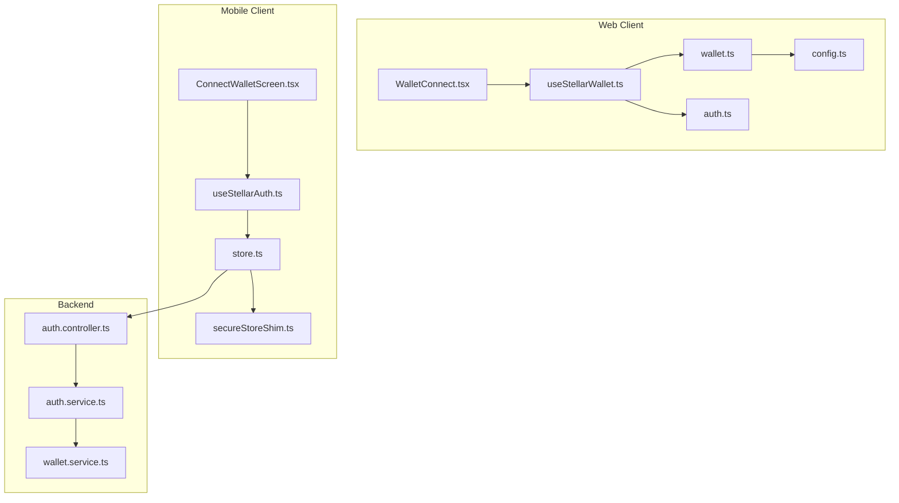
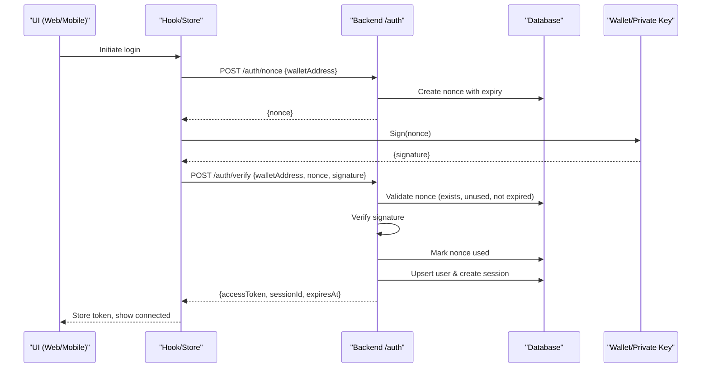
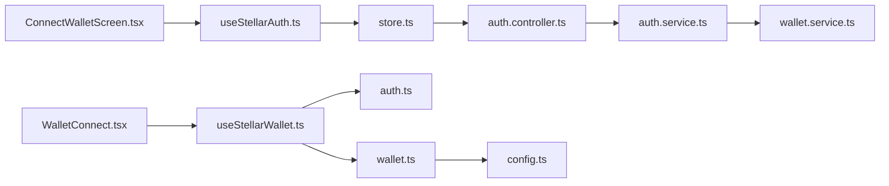

# Wallet Connection Screen

<cite>
**Referenced Files in This Document**
- [WalletConnect.tsx](file://veilend-web/src/components/WalletConnect.tsx)
- [useStellarWallet.ts](file://veilend-web/src/hooks/useStellarWallet.ts)
- [wallet.ts](file://veilend-web/src/lib/stellar/wallet.ts)
- [auth.ts](file://veilend-web/src/lib/stellar/auth.ts)
- [config.ts](file://veilend-web/src/lib/stellar/config.ts)
- [WalletContext.tsx](file://veilend-web/src/context/WalletContext.tsx)
- [ConnectWalletScreen.tsx](file://veilend-mobile/src/screens/ConnectWalletScreen.tsx)
- [useStellarAuth.ts](file://veilend-mobile/src/hooks/useStellarAuth.ts)
- [store.ts](file://veilend-mobile/src/store/store.ts)
- [secureStoreShim.ts](file://veilend-mobile/src/utils/secureStoreShim.ts)
- [auth.controller.ts](file://veilend-backend/src/auth/auth.controller.ts)
- [auth.service.ts](file://veilend-backend/src/auth/auth.service.ts)
- [wallet.service.ts](file://veilend-backend/src/wallet/wallet.service.ts)
</cite>

## Table of Contents
1. [Introduction](#introduction)
2. [Project Structure](#project-structure)
3. [Core Components](#core-components)
4. [Architecture Overview](#architecture-overview)
5. [Detailed Component Analysis](#detailed-component-analysis)
6. [Dependency Analysis](#dependency-analysis)
7. [Performance Considerations](#performance-considerations)
8. [Troubleshooting Guide](#troubleshooting-guide)
9. [Conclusion](#conclusion)
10. [Appendices](#appendices)

## Introduction
This document explains the Wallet Connection screen that integrates Stellar wallets for authentication and session management across web and mobile clients. It covers wallet detection, connection flows, supported providers (Freighter), cryptographic signature verification, nonce-based authentication, backend session establishment, error handling, permission prompts, connection status indicators, fallback mechanisms, and security considerations for private key handling and sessions.

## Project Structure
The wallet integration spans three layers:
- Web client UI and hooks for Freighter wallet detection, connection, and local session state
- Mobile client for generating/importing keys and authenticating via nonce/signature
- Backend API providing nonce generation, signature verification, JWT issuance, and session management

**Diagram sources**
- [WalletConnect.tsx:1-378](file://veilend-web/src/components/WalletConnect.tsx#L1-L378)
- [useStellarWallet.ts:1-122](file://veilend-web/src/hooks/useStellarWallet.ts#L1-L122)
- [wallet.ts:1-218](file://veilend-web/src/lib/stellar/wallet.ts#L1-L218)
- [auth.ts:1-110](file://veilend-web/src/lib/stellar/auth.ts#L1-L110)
- [config.ts:1-22](file://veilend-web/src/lib/stellar/config.ts#L1-L22)
- [ConnectWalletScreen.tsx:1-377](file://veilend-mobile/src/screens/ConnectWalletScreen.tsx#L1-L377)
- [useStellarAuth.ts:1-72](file://veilend-mobile/src/hooks/useStellarAuth.ts#L1-L72)
- [store.ts:1-397](file://veilend-mobile/src/store/store.ts#L1-L397)
- [secureStoreShim.ts:1-63](file://veilend-mobile/src/utils/secureStoreShim.ts#L1-L63)
- [auth.controller.ts:1-59](file://veilend-backend/src/auth/auth.controller.ts#L1-L59)
- [auth.service.ts:1-203](file://veilend-backend/src/auth/auth.service.ts#L1-L203)
- [wallet.service.ts:1-17](file://veilend-backend/src/wallet/wallet.service.ts#L1-L17)

**Section sources**
- [WalletConnect.tsx:1-378](file://veilend-web/src/components/WalletConnect.tsx#L1-L378)
- [useStellarWallet.ts:1-122](file://veilend-web/src/hooks/useStellarWallet.ts#L1-L122)
- [wallet.ts:1-218](file://veilend-web/src/lib/stellar/wallet.ts#L1-L218)
- [auth.ts:1-110](file://veilend-web/src/lib/stellar/auth.ts#L1-L110)
- [config.ts:1-22](file://veilend-web/src/lib/stellar/config.ts#L1-L22)
- [ConnectWalletScreen.tsx:1-377](file://veilend-mobile/src/screens/ConnectWalletScreen.tsx#L1-L377)
- [useStellarAuth.ts:1-72](file://veilend-mobile/src/hooks/useStellarAuth.ts#L1-L72)
- [store.ts:1-397](file://veilend-mobile/src/store/store.ts#L1-L397)
- [secureStoreShim.ts:1-63](file://veilend-mobile/src/utils/secureStoreShim.ts#L1-L63)
- [auth.controller.ts:1-59](file://veilend-backend/src/auth/auth.controller.ts#L1-L59)
- [auth.service.ts:1-203](file://veilend-backend/src/auth/auth.service.ts#L1-L203)
- [wallet.service.ts:1-17](file://veilend-backend/src/wallet/wallet.service.ts#L1-L17)

## Core Components
- Web WalletConnect component: Provides UI variants (default, compact, full) to connect/disconnect a Stellar wallet, shows installation prompts, errors, and connection status.
- Web useStellarWallet hook: Manages connection lifecycle, detects Freighter installation, creates local auth session, and exposes connect/disconnect/clearError actions.
- Web wallet utilities: Detects Freighter, connects to it, signs messages, verifies signatures, and handles network configuration.
- Web auth utilities: Generates challenges, persists and validates local auth sessions with expiration, and validates address formats.
- Mobile ConnectWalletScreen: Allows generating or importing a Stellar secret key, then authenticates via nonce/signature flow.
- Mobile useStellarAuth and store: Handles keypair creation/import, nonce request, signing, verification, and token persistence using SecureStore/shim.
- Backend auth controller/service: Issues nonces, verifies signatures, issues JWTs, manages sessions, and supports logout/revoke.
- Backend wallet service: Verifies Stellar signatures against provided public keys.

**Section sources**
- [WalletConnect.tsx:1-378](file://veilend-web/src/components/WalletConnect.tsx#L1-L378)
- [useStellarWallet.ts:1-122](file://veilend-web/src/hooks/useStellarWallet.ts#L1-L122)
- [wallet.ts:1-218](file://veilend-web/src/lib/stellar/wallet.ts#L1-L218)
- [auth.ts:1-110](file://veilend-web/src/lib/stellar/auth.ts#L1-L110)
- [ConnectWalletScreen.tsx:1-377](file://veilend-mobile/src/screens/ConnectWalletScreen.tsx#L1-L377)
- [useStellarAuth.ts:1-72](file://veilend-mobile/src/hooks/useStellarAuth.ts#L1-L72)
- [store.ts:1-397](file://veilend-mobile/src/store/store.ts#L1-L397)
- [auth.controller.ts:1-59](file://veilend-backend/src/auth/auth.controller.ts#L1-L59)
- [auth.service.ts:1-203](file://veilend-backend/src/auth/auth.service.ts#L1-L203)
- [wallet.service.ts:1-17](file://veilend-backend/src/wallet/wallet.service.ts#L1-L17)

## Architecture Overview
The system implements a nonce-and-signature authentication flow:
- The client requests a nonce from the backend for a given wallet address.
- The client signs the nonce with the user’s private key (via wallet or locally on mobile).
- The signed nonce is sent back to the backend for verification.
- On success, the backend issues a JWT and creates a session record; the client stores the token and proceeds.

**Diagram sources**
- [store.ts:233-252](file://veilend-mobile/src/store/store.ts#L233-L252)
- [useStellarAuth.ts:22-31](file://veilend-mobile/src/hooks/useStellarAuth.ts#L22-L31)
- [auth.controller.ts:20-36](file://veilend-backend/src/auth/auth.controller.ts#L20-L36)
- [auth.service.ts:36-149](file://veilend-backend/src/auth/auth.service.ts#L36-L149)
- [wallet.service.ts:6-15](file://veilend-backend/src/wallet/wallet.service.ts#L6-L15)

## Detailed Component Analysis

### Web: WalletConnect Component
- Presents multiple UI variants to connect/disconnect a Stellar wallet.
- Detects Freighter installation and guides users to install if missing.
- Displays contextual error messages and retry options based on detected conditions.
- Integrates with useStellarWallet to perform connection and manage local session state.

Key behaviors:
- Opens a dialog to initiate connection.
- Shows loading states and disables actions during operations.
- Renders truncated address when authenticated and provides disconnect action.
- Uses helper to generate friendly messages for install/unlock scenarios.

**Section sources**
- [WalletConnect.tsx:1-378](file://veilend-web/src/components/WalletConnect.tsx#L1-L378)
- [wallet.ts:23-56](file://veilend-web/src/lib/stellar/wallet.ts#L23-L56)

### Web: useStellarWallet Hook
- Initializes state by checking Freighter installation and existing local auth session.
- connect() calls Freighter to get address/publicKey, then creates a local auth session with expiration.
- disconnect() clears local state and removes persisted auth data.
- Exposes clearError() to reset UI error state.

State includes:
- address, publicKey, isConnected, isAuthenticated, isInstalled, isLoading, error.

**Section sources**
- [useStellarWallet.ts:1-122](file://veilend-web/src/hooks/useStellarWallet.ts#L1-L122)
- [auth.ts:73-88](file://veilend-web/src/lib/stellar/auth.ts#L73-L88)
- [wallet.ts:69-98](file://veilend-web/src/lib/stellar/wallet.ts#L69-L98)

### Web: Wallet Utilities (Freighter Integration)
- isFreighterInstalled(): Checks for Freighter extension presence.
- connectFreighter(): Validates connection and retrieves address/publicKey.
- signMessage(): Builds a transaction XDR and uses Freighter to sign it; returns signed XDR or fallback string.
- verifySignedMessage(): Basic validation helper using Keypair.
- disconnectWallet(): Clears local storage keys related to wallet state.

Network configuration:
- Horizon URL and network passphrase are read from environment config.

**Section sources**
- [wallet.ts:58-218](file://veilend-web/src/lib/stellar/wallet.ts#L58-L218)
- [config.ts:5-22](file://veilend-web/src/lib/stellar/config.ts#L5-L22)

### Web: Auth Utilities (Local Session)
- generateChallenge(): Creates a challenge string including address, nonce, and timestamp.
- isWalletAuthenticated(): Validates local session existence and expiration.
- getAuthenticatedWallet(): Retrieves stored wallet address.
- createAuthSession(): Persists session with expiration and generates session ID.
- clearAuthSession(): Removes local auth data.
- isValidStellarAddress(): Validates address format using Keypair.

**Section sources**
- [auth.ts:19-110](file://veilend-web/src/lib/stellar/auth.ts#L19-L110)

### Mobile: ConnectWalletScreen and Authentication Flow
- Offers two modes: generate new wallet or import existing secret key.
- After keypair creation/import, requests a nonce from backend, signs it, and verifies to obtain a JWT.
- Stores token and address securely using SecureStore or shim.

User interactions:
- Generate New Wallet button triggers secure key generation and immediate authentication.
- Import Secret Key allows entering an existing key and connecting.
- Error messages are displayed inline for invalid inputs or failures.

**Section sources**
- [ConnectWalletScreen.tsx:32-215](file://veilend-mobile/src/screens/ConnectWalletScreen.tsx#L32-L215)
- [useStellarAuth.ts:22-63](file://veilend-mobile/src/hooks/useStellarAuth.ts#L22-L63)
- [store.ts:233-252](file://veilend-mobile/src/store/store.ts#L233-L252)

### Mobile: Secure Storage Shim
- Provides AsyncStorage-like interface for storing tokens and addresses.
- In production, replaced by expo-secure-store; in development/testing, uses in-memory store.

Security note:
- The shim does not provide hardware-backed security; production builds should ensure proper secure storage usage.

**Section sources**
- [secureStoreShim.ts:1-63](file://veilend-mobile/src/utils/secureStoreShim.ts#L1-L63)

### Backend: Authentication Controller and Service
- POST /auth/nonce: Generates a cryptographically random nonce, invalidates prior unused nonces for the wallet, persists with TTL, and returns it.
- POST /auth/verify: Validates nonce existence, one-time-use, expiry, and signature; marks nonce used; upserts user; creates session; returns JWT and session info.
- GET /auth/session: Returns current session details for authenticated requests.
- POST /auth/logout: Revokes session idempotently.

Replay protection:
- Nonce must exist, be unused, and not expired.
- Signature verified against wallet public key.
- Nonce marked used atomically after successful verification.

**Section sources**
- [auth.controller.ts:14-59](file://veilend-backend/src/auth/auth.controller.ts#L14-L59)
- [auth.service.ts:16-149](file://veilend-backend/src/auth/auth.service.ts#L16-L149)

### Backend: Wallet Signature Verification
- Uses Stellar Keypair to verify the signature over the nonce message against the provided wallet address.

**Section sources**
- [wallet.service.ts:1-17](file://veilend-backend/src/wallet/wallet.service.ts#L1-L17)

## Dependency Analysis
- Web UI depends on useStellarWallet, which depends on wallet utilities and local auth utilities.
- Mobile UI depends on useStellarAuth and store, which call backend endpoints for nonce and verification.
- Backend relies on Prisma for nonce/session/user persistence and JWT service for token issuance.
- Network configuration is centralized in web config to ensure consistent Horizon URLs and passphrases.

**Diagram sources**
- [WalletConnect.tsx:1-378](file://veilend-web/src/components/WalletConnect.tsx#L1-L378)
- [useStellarWallet.ts:1-122](file://veilend-web/src/hooks/useStellarWallet.ts#L1-L122)
- [wallet.ts:1-218](file://veilend-web/src/lib/stellar/wallet.ts#L1-L218)
- [auth.ts:1-110](file://veilend-web/src/lib/stellar/auth.ts#L1-L110)
- [ConnectWalletScreen.tsx:1-377](file://veilend-mobile/src/screens/ConnectWalletScreen.tsx#L1-L377)
- [useStellarAuth.ts:1-72](file://veilend-mobile/src/hooks/useStellarAuth.ts#L1-L72)
- [store.ts:1-397](file://veilend-mobile/src/store/store.ts#L1-L397)
- [auth.controller.ts:1-59](file://veilend-backend/src/auth/auth.controller.ts#L1-L59)
- [auth.service.ts:1-203](file://veilend-backend/src/auth/auth.service.ts#L1-L203)
- [wallet.service.ts:1-17](file://veilend-backend/src/wallet/wallet.service.ts#L1-L17)
- [config.ts:1-22](file://veilend-web/src/lib/stellar/config.ts#L1-L22)

**Section sources**
- [useStellarWallet.ts:1-122](file://veilend-web/src/hooks/useStellarWallet.ts#L1-L122)
- [wallet.ts:1-218](file://veilend-web/src/lib/stellar/wallet.ts#L1-L218)
- [auth.ts:1-110](file://veilend-web/src/lib/stellar/auth.ts#L1-L110)
- [store.ts:1-397](file://veilend-mobile/src/store/store.ts#L1-L397)
- [auth.controller.ts:1-59](file://veilend-backend/src/auth/auth.controller.ts#L1-L59)
- [auth.service.ts:1-203](file://veilend-backend/src/auth/auth.service.ts#L1-L203)
- [wallet.service.ts:1-17](file://veilend-backend/src/wallet/wallet.service.ts#L1-L17)
- [config.ts:1-22](file://veilend-web/src/lib/stellar/config.ts#L1-L22)

## Performance Considerations
- Avoid redundant connection attempts: The web hook guards against concurrent connects via isLoading state.
- Minimize network calls: Local auth session checks prevent unnecessary backend calls on app start.
- Efficient nonce handling: Backend invalidates prior unused nonces to reduce replay risk and database clutter.
- Use environment-configured Horizon URLs to avoid misconfiguration overhead.

[No sources needed since this section provides general guidance]

## Troubleshooting Guide
Common issues and resolutions:
- Freighter not installed: UI displays install guidance; user installs extension and retries.
- Wallet locked or disconnected: UI prompts to unlock Freighter and approve connection; retry available.
- Invalid signature: Backend rejects with unauthorized; user must re-request nonce and re-sign.
- Expired nonce: Backend indicates expiration; user must request a fresh nonce.
- Network issues: Horizon connectivity failures during signing may occur; ensure correct network settings and retry.
- Mobile secret key import errors: Invalid key format leads to error display; correct input and retry.

Error handling highlights:
- Web UI surfaces friendly messages and retry options based on error content.
- Mobile UI shows inline errors for import and authentication failures.
- Backend throws specific exceptions for unknown, used, or expired nonces and invalid signatures.

**Section sources**
- [wallet.ts:23-56](file://veilend-web/src/lib/stellar/wallet.ts#L23-L56)
- [wallet.ts:69-98](file://veilend-web/src/lib/stellar/wallet.ts#L69-L98)
- [wallet.ts:129-192](file://veilend-web/src/lib/stellar/wallet.ts#L129-L192)
- [ConnectWalletScreen.tsx:174-193](file://veilend-mobile/src/screens/ConnectWalletScreen.tsx#L174-L193)
- [useStellarAuth.ts:50-63](file://veilend-mobile/src/hooks/useStellarAuth.ts#L50-L63)
- [auth.service.ts:70-149](file://veilend-backend/src/auth/auth.service.ts#L70-L149)

## Conclusion
The Wallet Connection screen integrates Stellar wallets through a robust nonce-and-signature authentication flow. The web client focuses on Freighter detection and local session management, while the mobile client handles key generation/import and direct authentication via backend APIs. The backend enforces strict nonce policies, signature verification, and session lifecycle management. Proper error handling, user-friendly prompts, and secure storage practices ensure a resilient and secure user experience.

[No sources needed since this section summarizes without analyzing specific files]

## Appendices

### Supported Wallet Providers
- Freighter: Primary supported provider on web via browser extension integration.
- Mobile: Direct key management using Keypair and secure storage; no external wallet extension required.

**Section sources**
- [wallet.ts:58-98](file://veilend-web/src/lib/stellar/wallet.ts#L58-L98)
- [ConnectWalletScreen.tsx:55-63](file://veilend-mobile/src/screens/ConnectWalletScreen.tsx#L55-L63)
- [useStellarAuth.ts:33-63](file://veilend-mobile/src/hooks/useStellarAuth.ts#L33-L63)

### Security Considerations
- Private keys: On mobile, secret keys are stored using SecureStore or shim; ensure production builds use secure storage. On web, private keys remain within the wallet extension; the app never accesses them directly.
- Sessions: Backend issues JWTs with expiration and tracks sessions; clients store tokens securely and handle logout to revoke sessions.
- Nonce policy: One-time use with short TTL prevents replay attacks; prior unused nonces are invalidated upon new request.
- Signature verification: Backend verifies signatures using Stellar Keypair against the provided wallet address.

**Section sources**
- [auth.service.ts:36-149](file://veilend-backend/src/auth/auth.service.ts#L36-L149)
- [wallet.service.ts:6-15](file://veilend-backend/src/wallet/wallet.service.ts#L6-L15)
- [secureStoreShim.ts:1-63](file://veilend-mobile/src/utils/secureStoreShim.ts#L1-L63)
- [store.ts:115-149](file://veilend-mobile/src/store/store.ts#L115-L149)