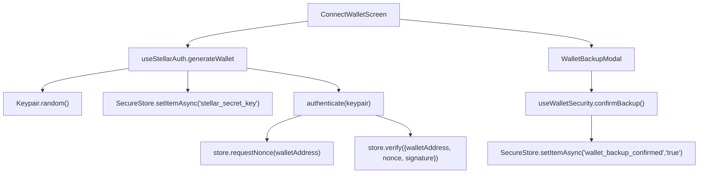
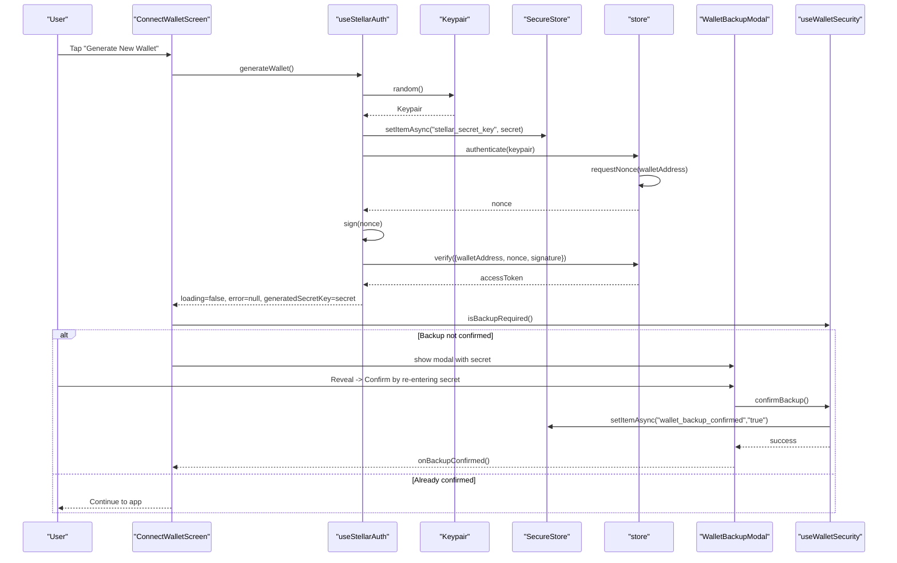
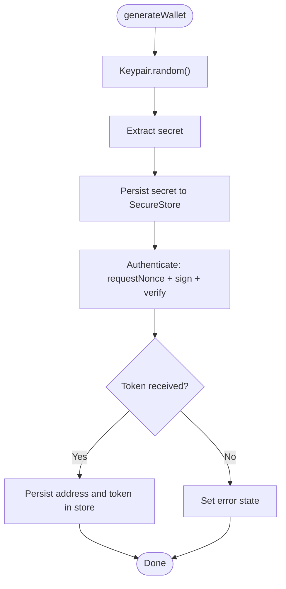
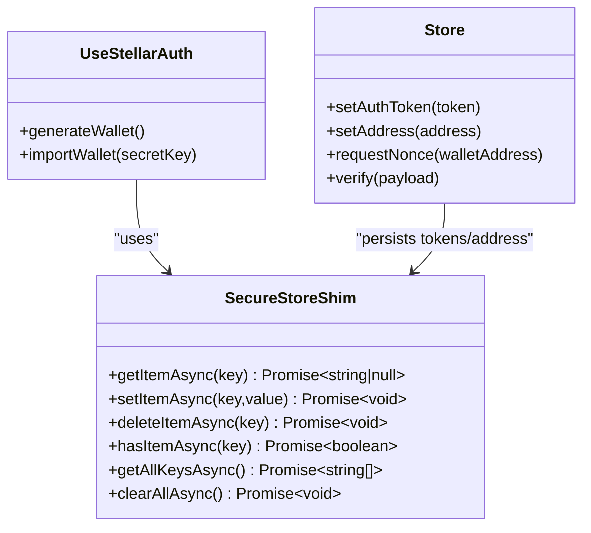
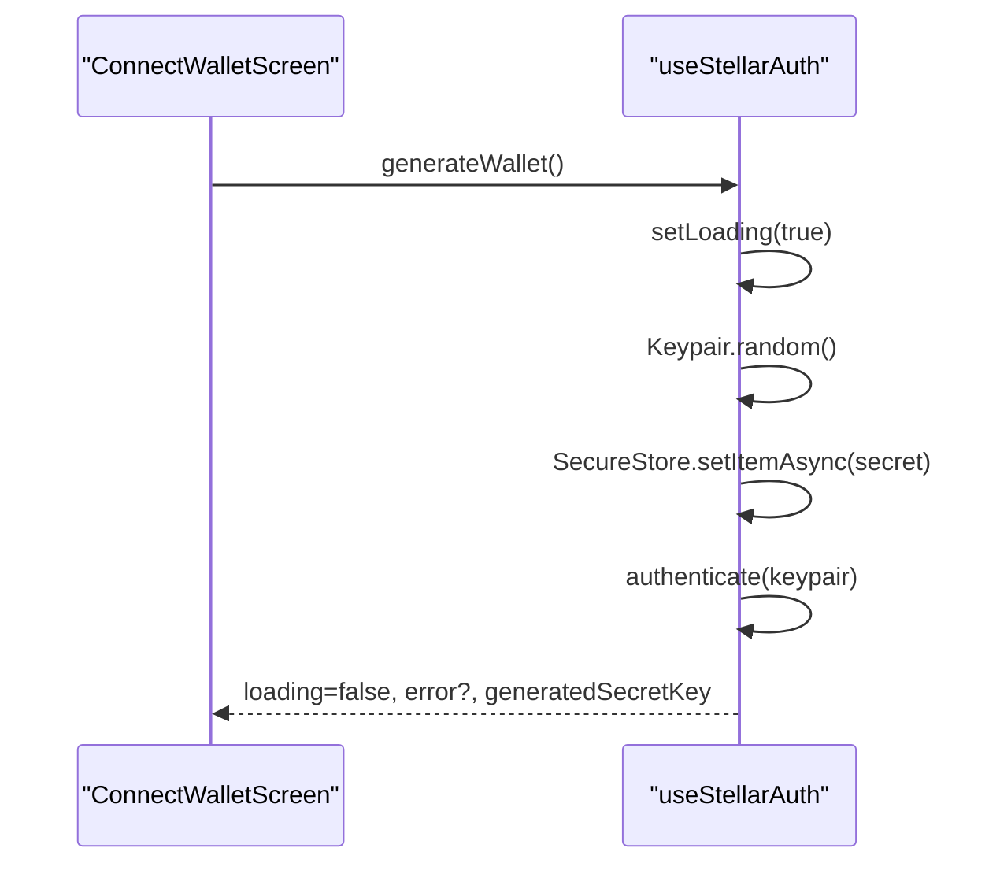
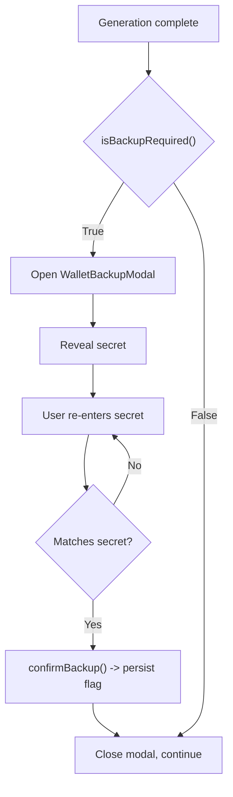
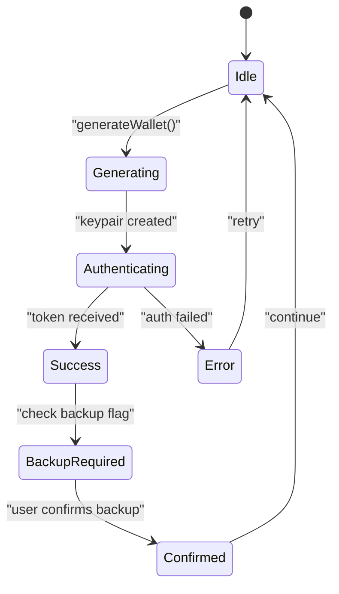
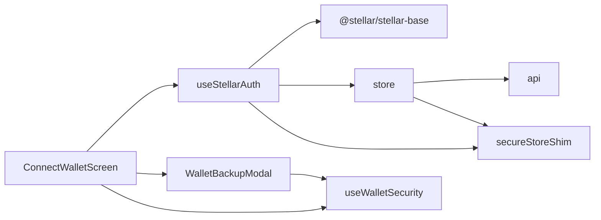

# Wallet Generation

<cite>
**Referenced Files in This Document**
- [useStellarAuth.ts](file://veilend-mobile/src/hooks/useStellarAuth.ts)
- [ConnectWalletScreen.tsx](file://veilend-mobile/src/screens/ConnectWalletScreen.tsx)
- [WalletBackupModal.tsx](file://veilend-mobile/src/components/WalletBackupModal.tsx)
- [WalletExportModal.tsx](file://veilend-mobile/src/components/WalletExportModal.tsx)
- [useWalletSecurity.ts](file://veilend-mobile/src/hooks/useWalletSecurity.ts)
- [store.ts](file://veilend-mobile/src/store/store.ts)
- [secureStoreShim.ts](file://veilend-mobile/src/utils/secureStoreShim.ts)
</cite>

## Table of Contents
1. [Introduction](#introduction)
2. [Project Structure](#project-structure)
3. [Core Components](#core-components)
4. [Architecture Overview](#architecture-overview)
5. [Detailed Component Analysis](#detailed-component-analysis)
6. [Dependency Analysis](#dependency-analysis)
7. [Performance Considerations](#performance-considerations)
8. [Troubleshooting Guide](#troubleshooting-guide)
9. [Conclusion](#conclusion)
10. [Appendices](#appendices)

## Introduction
This document explains the wallet generation functionality for new Stellar wallets in the mobile application. It covers cryptographic key generation, secure storage, integration with the useStellarAuth hook, error handling, and the mandatory backup confirmation workflow. It also documents user feedback mechanisms, loading states during generation, and security considerations for private key handling.

## Project Structure
The wallet generation flow spans several modules:
- Hook that orchestrates key generation and authentication: useStellarAuth
- Screen that triggers generation and manages UI state: ConnectWalletScreen
- Modal that enforces a multi-step backup confirmation: WalletBackupModal
- Optional export modal for exporting credentials: WalletExportModal
- Security hook managing backup status and secret visibility: useWalletSecurity
- Global store for auth state and persistence: store
- Secure storage abstraction (production vs development): secureStoreShim

**Diagram sources**
- [useStellarAuth.ts:22-48](file://veilend-mobile/src/hooks/useStellarAuth.ts#L22-L48)
- [ConnectWalletScreen.tsx:55-66](file://veilend-mobile/src/screens/ConnectWalletScreen.tsx#L55-L66)
- [WalletBackupModal.tsx:64-80](file://veilend-mobile/src/components/WalletBackupModal.tsx#L64-L80)
- [useWalletSecurity.ts:107-123](file://veilend-mobile/src/hooks/useWalletSecurity.ts#L107-L123)
- [store.ts:233-252](file://veilend-mobile/src/store/store.ts#L233-L252)

**Section sources**
- [useStellarAuth.ts:1-72](file://veilend-mobile/src/hooks/useStellarAuth.ts#L1-L72)
- [ConnectWalletScreen.tsx:1-217](file://veilend-mobile/src/screens/ConnectWalletScreen.tsx#L1-L217)
- [WalletBackupModal.tsx:1-264](file://veilend-mobile/src/components/WalletBackupModal.tsx#L1-L264)
- [useWalletSecurity.ts:1-166](file://veilend-mobile/src/hooks/useWalletSecurity.ts#L1-L166)
- [store.ts:1-397](file://veilend-mobile/src/store/store.ts#L1-L397)
- [secureStoreShim.ts:1-63](file://veilend-mobile/src/utils/secureStoreShim.ts#L1-L63)

## Core Components
- useStellarAuth: Generates a new Stellar Keypair, persists the secret to secure storage, authenticates via nonce/signature, and exposes loading/error states and the generated secret for immediate backup.
- ConnectWalletScreen: Orchestrates the user journey from generating a wallet to enforcing backup confirmation; displays loading and errors.
- WalletBackupModal: Enforces a three-step backup flow: reveal, confirm by re-entering the secret, success. Provides copy-to-clipboard and warnings.
- useWalletSecurity: Tracks whether backup has been confirmed, controls temporary secret visibility, and persists the backup flag.
- store: Handles auth flows (nonce request, verification), persists address and token, and provides session restoration.
- secureStoreShim: Abstraction over expo-secure-store; in production uses native secure storage; in dev/testing falls back to an in-memory shim.

**Section sources**
- [useStellarAuth.ts:16-72](file://veilend-mobile/src/hooks/useStellarAuth.ts#L16-L72)
- [ConnectWalletScreen.tsx:32-66](file://veilend-mobile/src/screens/ConnectWalletScreen.tsx#L32-L66)
- [WalletBackupModal.tsx:19-87](file://veilend-mobile/src/components/WalletBackupModal.tsx#L19-L87)
- [useWalletSecurity.ts:25-123](file://veilend-mobile/src/hooks/useWalletSecurity.ts#L25-L123)
- [store.ts:100-149](file://veilend-mobile/src/store/store.ts#L100-L149)
- [secureStoreShim.ts:22-35](file://veilend-mobile/src/utils/secureStoreShim.ts#L22-L35)

## Architecture Overview
The wallet generation architecture integrates client-side cryptography with server-side authentication and enforces a mandatory backup confirmation before allowing further app usage.

**Diagram sources**
- [useStellarAuth.ts:22-48](file://veilend-mobile/src/hooks/useStellarAuth.ts#L22-L48)
- [ConnectWalletScreen.tsx:55-66](file://veilend-mobile/src/screens/ConnectWalletScreen.tsx#L55-L66)
- [WalletBackupModal.tsx:64-80](file://veilend-mobile/src/components/WalletBackupModal.tsx#L64-L80)
- [useWalletSecurity.ts:107-123](file://veilend-mobile/src/hooks/useWalletSecurity.ts#L107-L123)
- [store.ts:233-252](file://veilend-mobile/src/store/store.ts#L233-L252)

## Detailed Component Analysis

### Cryptographic Key Generation and Authentication Flow
- Key generation: The hook creates a new Stellar Keypair using a cryptographically secure random generator provided by the Stellar SDK.
- Secret persistence: The secret is immediately stored using the secure storage abstraction under a dedicated key.
- Authentication: The hook requests a nonce from the backend for the wallet address, signs the nonce with the private key, and verifies it to obtain an access token. On success, the address and token are persisted in the store.

**Diagram sources**
- [useStellarAuth.ts:33-48](file://veilend-mobile/src/hooks/useStellarAuth.ts#L33-L48)
- [store.ts:233-252](file://veilend-mobile/src/store/store.ts#L233-L252)

**Section sources**
- [useStellarAuth.ts:22-48](file://veilend-mobile/src/hooks/useStellarAuth.ts#L22-L48)
- [store.ts:233-252](file://veilend-mobile/src/store/store.ts#L233-L252)

### Secure Storage Mechanisms
- Production storage: Uses expo-secure-store when available, providing OS-backed secure storage.
- Development fallback: Falls back to an in-memory shim that mimics the API surface for testing and development.
- Keys used:
  - stellar_secret_key: Stores the wallet secret after generation or import.
  - wallet_backup_confirmed: Marks that the user has completed the backup confirmation flow.
  - Additional keys for auth token and address are managed by the store.

**Diagram sources**
- [secureStoreShim.ts:22-53](file://veilend-mobile/src/utils/secureStoreShim.ts#L22-L53)
- [store.ts:100-149](file://veilend-mobile/src/store/store.ts#L100-L149)
- [useStellarAuth.ts:33-63](file://veilend-mobile/src/hooks/useStellarAuth.ts#L33-L63)

**Section sources**
- [secureStoreShim.ts:1-63](file://veilend-mobile/src/utils/secureStoreShim.ts#L1-L63)
- [store.ts:17-29](file://veilend-mobile/src/store/store.ts#L17-L29)
- [store.ts:100-149](file://veilend-mobile/src/store/store.ts#L100-L149)

### Integration with useStellarAuth Hook
- Loading state: The hook sets loading=true at start and clears it in finally, enabling UI to show progress indicators.
- Error handling: Errors during generation or authentication are captured and exposed via error state.
- Generated secret exposure: The hook exposes generatedSecretKey so the screen can trigger the backup modal immediately after successful generation.

**Diagram sources**
- [useStellarAuth.ts:16-48](file://veilend-mobile/src/hooks/useStellarAuth.ts#L16-L48)
- [ConnectWalletScreen.tsx:55-66](file://veilend-mobile/src/screens/ConnectWalletScreen.tsx#L55-L66)

**Section sources**
- [useStellarAuth.ts:16-72](file://veilend-mobile/src/hooks/useStellarAuth.ts#L16-L72)
- [ConnectWalletScreen.tsx:55-66](file://veilend-mobile/src/screens/ConnectWalletScreen.tsx#L55-L66)

### Backup Requirement Workflow
- Trigger: After successful wallet generation, the screen checks if backup is required using the security hook.
- Steps:
  - Reveal step: User reveals the secret key and optionally copies it to clipboard.
  - Confirm step: User must re-enter the exact secret to prove they have saved it.
  - Success step: Confirmation persists the backup flag and closes the modal.
- Persistence: The backup confirmation flag is stored securely and checked on subsequent sessions.

**Diagram sources**
- [ConnectWalletScreen.tsx:55-66](file://veilend-mobile/src/screens/ConnectWalletScreen.tsx#L55-L66)
- [WalletBackupModal.tsx:64-80](file://veilend-mobile/src/components/WalletBackupModal.tsx#L64-L80)
- [useWalletSecurity.ts:107-123](file://veilend-mobile/src/hooks/useWalletSecurity.ts#L107-L123)

**Section sources**
- [WalletBackupModal.tsx:19-237](file://veilend-mobile/src/components/WalletBackupModal.tsx#L19-L237)
- [useWalletSecurity.ts:107-123](file://veilend-mobile/src/hooks/useWalletSecurity.ts#L107-L123)
- [ConnectWalletScreen.tsx:55-66](file://veilend-mobile/src/screens/ConnectWalletScreen.tsx#L55-L66)

### Wallet State Management and Loading States
- Loading: The hook’s loading state drives button disabled states and text changes in the screen.
- Error: Any failure during generation or authentication is surfaced to the UI for user feedback.
- Session restoration: On app launch, the store restores persisted address and token to resume authenticated sessions without requiring re-authentication.

**Diagram sources**
- [useStellarAuth.ts:33-48](file://veilend-mobile/src/hooks/useStellarAuth.ts#L33-L48)
- [store.ts:369-396](file://veilend-mobile/src/store/store.ts#L369-L396)
- [ConnectWalletScreen.tsx:55-66](file://veilend-mobile/src/screens/ConnectWalletScreen.tsx#L55-L66)

**Section sources**
- [store.ts:369-396](file://veilend-mobile/src/store/store.ts#L369-L396)
- [useStellarAuth.ts:16-48](file://veilend-mobile/src/hooks/useStellarAuth.ts#L16-L48)
- [ConnectWalletScreen.tsx:125-157](file://veilend-mobile/src/screens/ConnectWalletScreen.tsx#L125-L157)

### User Feedback Mechanisms
- Toast notifications: Used in backup and export modals to inform users about actions like copying secrets or successful backups.
- Visual cues: Buttons disable during loading; error messages display inline for invalid inputs or failures.
- Step-by-step guidance: The backup modal guides users through reveal, confirm, and success steps with clear instructions and warnings.

**Section sources**
- [WalletBackupModal.tsx:53-80](file://veilend-mobile/src/components/WalletBackupModal.tsx#L53-L80)
- [WalletExportModal.tsx:41-104](file://veilend-mobile/src/components/WalletExportModal.tsx#L41-L104)
- [ConnectWalletScreen.tsx:174-176](file://veilend-mobile/src/screens/ConnectWalletScreen.tsx#L174-L176)

### Security Considerations for Private Key Handling
- Secure storage: Secrets are stored using a secure storage abstraction that leverages platform-native secure storage in production builds.
- Temporary visibility: Secret reveal is time-limited via a timer to reduce exposure risk.
- Clipboard hygiene: When copying secrets, the implementation clears the clipboard after a short duration to mitigate accidental retention.
- Mandatory backup confirmation: Users cannot proceed without confirming they have saved the secret, enforced by a persistent flag.
- Export caution: Export modal warns users about risks and encourages secure storage and deletion after safekeeping.

**Section sources**
- [useWalletSecurity.ts:74-94](file://veilend-mobile/src/hooks/useWalletSecurity.ts#L74-L94)
- [useWalletSecurity.ts:136-152](file://veilend-mobile/src/hooks/useWalletSecurity.ts#L136-L152)
- [WalletExportModal.tsx:106-152](file://veilend-mobile/src/components/WalletExportModal.tsx#L106-L152)
- [secureStoreShim.ts:1-63](file://veilend-mobile/src/utils/secureStoreShim.ts#L1-L63)

## Dependency Analysis
- useStellarAuth depends on:
  - @stellar/stellar-base for Keypair operations
  - store for nonce request and verification
  - secure storage abstraction for secret persistence
- ConnectWalletScreen depends on:
  - useStellarAuth for generation and import
  - WalletBackupModal for backup enforcement
  - useWalletSecurity for backup status and confirmation
- WalletBackupModal depends on:
  - React Native primitives and toast utilities
  - useWalletSecurity for confirmation and clipboard management
- store depends on:
  - api for network calls
  - secure storage abstraction for persistence

**Diagram sources**
- [useStellarAuth.ts:1-72](file://veilend-mobile/src/hooks/useStellarAuth.ts#L1-L72)
- [ConnectWalletScreen.tsx:24-37](file://veilend-mobile/src/screens/ConnectWalletScreen.tsx#L24-L37)
- [WalletBackupModal.tsx:1-24](file://veilend-mobile/src/components/WalletBackupModal.tsx#L1-L24)
- [useWalletSecurity.ts:1-16](file://veilend-mobile/src/hooks/useWalletSecurity.ts#L1-L16)
- [store.ts:1-13](file://veilend-mobile/src/store/store.ts#L1-L13)

**Section sources**
- [useStellarAuth.ts:1-72](file://veilend-mobile/src/hooks/useStellarAuth.ts#L1-L72)
- [ConnectWalletScreen.tsx:24-37](file://veilend-mobile/src/screens/ConnectWalletScreen.tsx#L24-L37)
- [WalletBackupModal.tsx:1-24](file://veilend-mobile/src/components/WalletBackupModal.tsx#L1-L24)
- [useWalletSecurity.ts:1-16](file://veilend-mobile/src/hooks/useWalletSecurity.ts#L1-L16)
- [store.ts:1-13](file://veilend-mobile/src/store/store.ts#L1-L13)

## Performance Considerations
- Keypair generation is lightweight and runs synchronously in memory; ensure UI remains responsive by keeping loading states minimal.
- Network calls for nonce and verification should be cached or retried appropriately to avoid redundant requests.
- Avoid unnecessary re-renders by memoizing components that consume store state or hook outputs.
- Secure storage operations are asynchronous; batch updates where possible to minimize I/O overhead.

[No sources needed since this section provides general guidance]

## Troubleshooting Guide
- Failed generation: Check error state exposed by the hook; common causes include invalid environment configuration or storage write failures.
- Authentication errors: Verify network connectivity and backend endpoints; ensure nonce and signature are correctly computed.
- Backup confirmation issues: Ensure the backup flag is persisted and read correctly; validate that the user re-enters the exact secret.
- Clipboard clearing: If clipboard does not clear, check platform-specific limitations and ensure timers execute properly.

**Section sources**
- [useStellarAuth.ts:43-47](file://veilend-mobile/src/hooks/useStellarAuth.ts#L43-L47)
- [store.ts:237-252](file://veilend-mobile/src/store/store.ts#L237-L252)
- [useWalletSecurity.ts:107-123](file://veilend-mobile/src/hooks/useWalletSecurity.ts#L107-L123)
- [useWalletSecurity.ts:136-152](file://veilend-mobile/src/hooks/useWalletSecurity.ts#L136-L152)

## Conclusion
The wallet generation system combines secure cryptographic key creation, robust storage abstractions, and a mandatory backup confirmation workflow to protect user assets. The useStellarAuth hook centralizes generation and authentication logic, while the UI ensures clear feedback and guided workflows. Security measures such as secure storage, temporary secret visibility, and clipboard hygiene help mitigate risks associated with private key handling.

[No sources needed since this section summarizes without analyzing specific files]

## Appendices

### Example: Wallet State Management During Generation
- Before generation: loading=false, error=null, generatedSecretKey=null
- During generation: loading=true, error=null, generatedSecretKey=null
- After success: loading=false, error=null, generatedSecretKey=secret (for immediate backup)
- After backup confirmation: wallet ready for use; backup flag persisted

**Section sources**
- [useStellarAuth.ts:16-48](file://veilend-mobile/src/hooks/useStellarAuth.ts#L16-L48)
- [ConnectWalletScreen.tsx:55-66](file://veilend-mobile/src/screens/ConnectWalletScreen.tsx#L55-L66)

### Example: Exporting Wallet Credentials
- Users can export their secret via clipboard or file with explicit warnings and safety tips.
- Exported files include metadata such as timestamp and security warnings.

**Section sources**
- [WalletExportModal.tsx:52-104](file://veilend-mobile/src/components/WalletExportModal.tsx#L52-L104)
- [WalletExportModal.tsx:106-152](file://veilend-mobile/src/components/WalletExportModal.tsx#L106-L152)