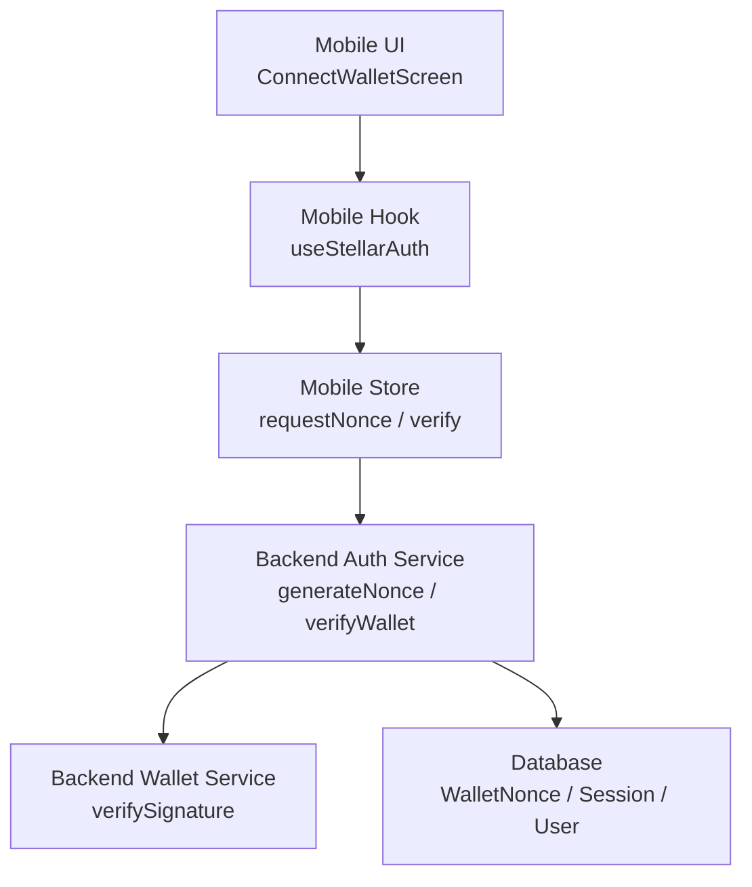
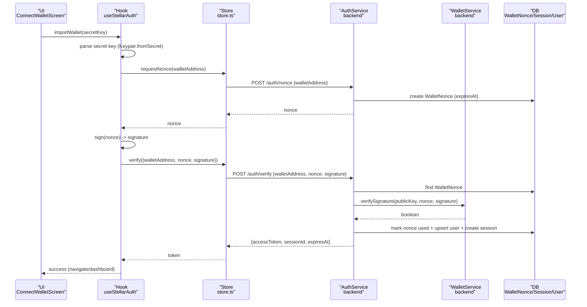
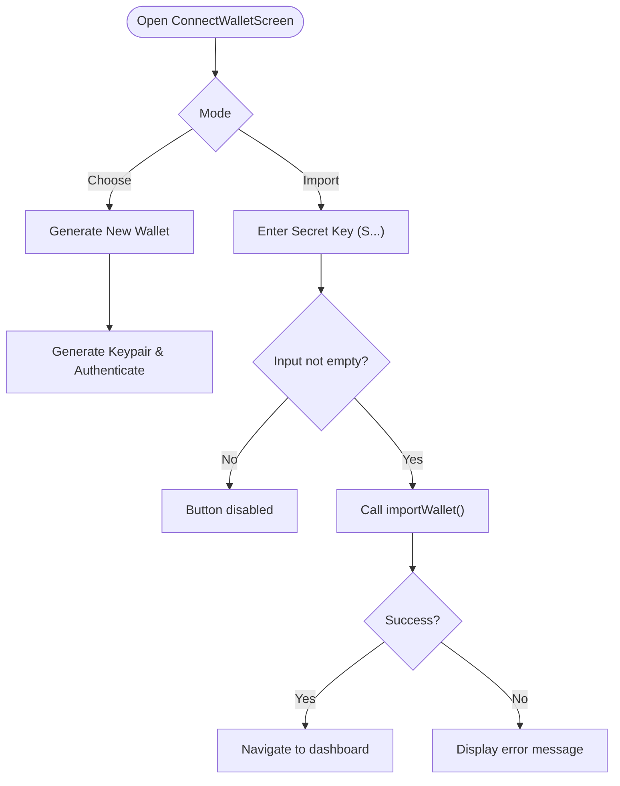
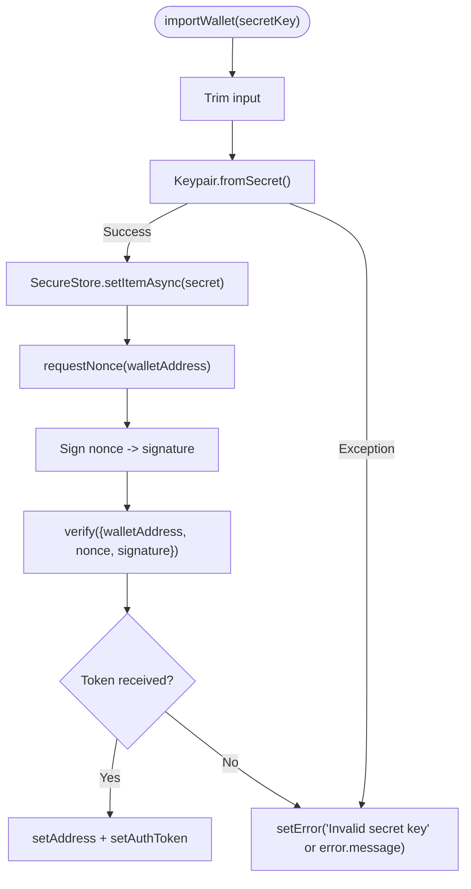
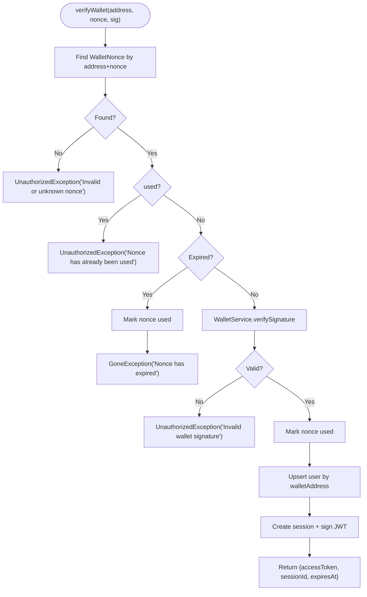
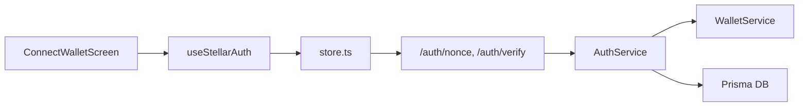

# Wallet Import

<cite>
**Referenced Files in This Document**
- [ConnectWalletScreen.tsx](file://veilend-mobile/src/screens/ConnectWalletScreen.tsx)
- [useStellarAuth.ts](file://veilend-mobile/src/hooks/useStellarAuth.ts)
- [store.ts](file://veilend-mobile/src/store/store.ts)
- [auth.service.ts](file://veilend-backend/src/auth/auth.service.ts)
- [wallet.service.ts](file://veilend-backend/src/wallet/wallet.service.ts)
- [auth.ts](file://veilend-web/src/lib/stellar/auth.ts)
- [redact.util.ts](file://veilend-backend/src/common/logging/redact.util.ts)
- [errorReporting.ts](file://veilend-mobile/src/utils/errorReporting.ts)
</cite>

## Table of Contents
1. [Introduction](#introduction)
2. [Project Structure](#project-structure)
3. [Core Components](#core-components)
4. [Architecture Overview](#architecture-overview)
5. [Detailed Component Analysis](#detailed-component-analysis)
6. [Dependency Analysis](#dependency-analysis)
7. [Performance Considerations](#performance-considerations)
8. [Troubleshooting Guide](#troubleshooting-guide)
9. [Conclusion](#conclusion)

## Introduction
This document explains the wallet import functionality that allows users to import an existing Stellar wallet using a secret key. It covers:
- Secret key validation and parsing on the client
- Format expectations for Stellar secret keys (S-prefix)
- Error handling for invalid or malformed keys
- The import flow from UI through authentication to session issuance
- Security best practices for handling sensitive key data and preventing exposure in logs or memory

## Project Structure
The wallet import feature spans mobile UI, mobile state management, and backend authentication services:
- Mobile UI: ConnectWalletScreen provides the import mode with a secret key input field and navigation between choose/import modes.
- Mobile hook: useStellarAuth parses the secret key, stores it securely, and performs authentication via nonce/signature.
- Mobile store: Persisted auth tokens and addresses; also exposes requestNonce and verify endpoints.
- Backend: AuthService issues nonces, verifies signatures, and issues JWT sessions; WalletService validates Ed25519 signatures.
- Web utilities: Address validation helpers used elsewhere in the web app.
- Logging redaction: Sensitive fields are redacted in server logs.
- Error reporting: Client-side scrubbing patterns prevent secrets leaking into error reports.

**Diagram sources**
- [ConnectWalletScreen.tsx:125-203](file://veilend-mobile/src/screens/ConnectWalletScreen.tsx#L125-L203)
- [useStellarAuth.ts:22-63](file://veilend-mobile/src/hooks/useStellarAuth.ts#L22-L63)
- [store.ts:233-252](file://veilend-mobile/src/store/store.ts#L233-L252)
- [auth.service.ts:36-149](file://veilend-backend/src/auth/auth.service.ts#L36-L149)
- [wallet.service.ts:6-15](file://veilend-backend/src/wallet/wallet.service.ts#L6-L15)

**Section sources**
- [ConnectWalletScreen.tsx:125-203](file://veilend-mobile/src/screens/ConnectWalletScreen.tsx#L125-L203)
- [useStellarAuth.ts:22-63](file://veilend-mobile/src/hooks/useStellarAuth.ts#L22-L63)
- [store.ts:233-252](file://veilend-mobile/src/store/store.ts#L233-L252)
- [auth.service.ts:36-149](file://veilend-backend/src/auth/auth.service.ts#L36-L149)
- [wallet.service.ts:6-15](file://veilend-backend/src/wallet/wallet.service.ts#L6-L15)

## Core Components
- Mobile UI (ConnectWalletScreen): Provides two modes:
  - Choose mode: Generate new wallet or switch to import mode.
  - Import mode: Secret key input field, connect button, back navigation, and error display.
- Mobile Hook (useStellarAuth): Parses secret key, stores it securely, requests a nonce, signs it, and verifies to obtain a token.
- Mobile Store (store.ts): Exposes requestNonce and verify methods that call backend endpoints and persist tokens/address.
- Backend Auth (auth.service.ts): Generates nonces with TTL, verifies signatures, prevents replay/expired usage, creates sessions, and issues JWTs.
- Backend Wallet (wallet.service.ts): Verifies Ed25519 signature over the nonce using the provided public key.
- Web Utilities (auth.ts): Validates Stellar address format using SDK.
- Logging Redaction (redact.util.ts): Redacts sensitive keys in server logs.
- Error Reporting (errorReporting.ts): Scrubs secrets from client-side error reports.

**Section sources**
- [ConnectWalletScreen.tsx:125-203](file://veilend-mobile/src/screens/ConnectWalletScreen.tsx#L125-L203)
- [useStellarAuth.ts:22-63](file://veilend-mobile/src/hooks/useStellarAuth.ts#L22-L63)
- [store.ts:233-252](file://veilend-mobile/src/store/store.ts#L233-L252)
- [auth.service.ts:36-149](file://veilend-backend/src/auth/auth.service.ts#L36-L149)
- [wallet.service.ts:6-15](file://veilend-backend/src/wallet/wallet.service.ts#L6-L15)
- [auth.ts:103-110](file://veilend-web/src/lib/stellar/auth.ts#L103-L110)
- [redact.util.ts:1-55](file://veilend-backend/src/common/logging/redact.util.ts#L1-L55)
- [errorReporting.ts:51-63](file://veilend-mobile/src/utils/errorReporting.ts#L51-L63)

## Architecture Overview
The import flow uses challenge-response authentication:
- Client parses the secret key and derives the keypair.
- Client requests a nonce from the backend.
- Client signs the nonce and sends the signature back for verification.
- Backend verifies the signature against the stored nonce and marks it used to prevent replay.
- Backend issues a JWT session and returns it to the client.

**Diagram sources**
- [useStellarAuth.ts:22-63](file://veilend-mobile/src/hooks/useStellarAuth.ts#L22-L63)
- [store.ts:233-252](file://veilend-mobile/src/store/store.ts#L233-L252)
- [auth.service.ts:36-149](file://veilend-backend/src/auth/auth.service.ts#L36-L149)
- [wallet.service.ts:6-15](file://veilend-backend/src/wallet/wallet.service.ts#L6-L15)

## Detailed Component Analysis

### Mobile UI: ConnectWalletScreen
- Modes:
  - Choose mode: Generate new wallet or navigate to import mode.
  - Import mode: Secret key input field with placeholder indicating S-prefix, connect button, back navigation, and error text rendering.
- Input sanitization:
  - The input is trimmed before processing by the hook.
- Navigation:
  - Switches between choose and import modes; resets secret key when returning to choose.

**Diagram sources**
- [ConnectWalletScreen.tsx:125-203](file://veilend-mobile/src/screens/ConnectWalletScreen.tsx#L125-L203)

**Section sources**
- [ConnectWalletScreen.tsx:125-203](file://veilend-mobile/src/screens/ConnectWalletScreen.tsx#L125-L203)

### Mobile Hook: useStellarAuth
- Secret key parsing:
  - Uses Keypair.fromSecret on the trimmed input. Invalid formats throw errors caught and surfaced to the UI.
- Secure storage:
  - Stores the secret key in secure storage after successful parsing.
- Authentication:
  - Requests a nonce, signs it, and calls verify to obtain a token. On success, sets address and auth token in store.

**Diagram sources**
- [useStellarAuth.ts:22-63](file://veilend-mobile/src/hooks/useStellarAuth.ts#L22-L63)

**Section sources**
- [useStellarAuth.ts:22-63](file://veilend-mobile/src/hooks/useStellarAuth.ts#L22-L63)

### Mobile Store: store.ts
- Endpoints:
  - requestNonce: POST /auth/nonce with walletAddress.
  - verify: POST /auth/verify with walletAddress, nonce, signature; persists accessToken and address.
- Persistence:
  - Uses SecureStore to persist authToken and address across sessions.

**Section sources**
- [store.ts:233-252](file://veilend-mobile/src/store/store.ts#L233-L252)
- [store.ts:106-149](file://veilend-mobile/src/store/store.ts#L106-L149)

### Backend: AuthService
- generateNonce:
  - Creates a random nonce with TTL, invalidates prior unused nonces for the wallet, persists new nonce.
- verifyWallet:
  - Looks up the nonce, checks one-time-use and expiry, verifies signature via WalletService, marks nonce used, upserts user, creates session, signs JWT, returns token metadata.

**Diagram sources**
- [auth.service.ts:36-149](file://veilend-backend/src/auth/auth.service.ts#L36-L149)

**Section sources**
- [auth.service.ts:36-149](file://veilend-backend/src/auth/auth.service.ts#L36-L149)

### Backend: WalletService
- Verifies Ed25519 signature over the nonce using the provided public key derived from the wallet address.

**Section sources**
- [wallet.service.ts:6-15](file://veilend-backend/src/wallet/wallet.service.ts#L6-L15)

### Web Utilities: Address Validation
- isValidStellarAddress uses SDK to validate Stellar public key format.

**Section sources**
- [auth.ts:103-110](file://veilend-web/src/lib/stellar/auth.ts#L103-L110)

## Dependency Analysis
- Coupling:
  - UI depends on hook for business logic.
  - Hook depends on store for network calls and persistence.
  - Store depends on backend endpoints for nonce and verification.
  - Backend AuthService depends on WalletService for signature verification and Prisma for persistence.
- External dependencies:
  - Stellar SDK for keypair operations and signature verification.
  - SecureStore for persistent storage on mobile.
  - JWT service for session issuance.

**Diagram sources**
- [ConnectWalletScreen.tsx:125-203](file://veilend-mobile/src/screens/ConnectWalletScreen.tsx#L125-L203)
- [useStellarAuth.ts:22-63](file://veilend-mobile/src/hooks/useStellarAuth.ts#L22-L63)
- [store.ts:233-252](file://veilend-mobile/src/store/store.ts#L233-L252)
- [auth.service.ts:36-149](file://veilend-backend/src/auth/auth.service.ts#L36-L149)
- [wallet.service.ts:6-15](file://veilend-backend/src/wallet/wallet.service.ts#L6-L15)

**Section sources**
- [ConnectWalletScreen.tsx:125-203](file://veilend-mobile/src/screens/ConnectWalletScreen.tsx#L125-L203)
- [useStellarAuth.ts:22-63](file://veilend-mobile/src/hooks/useStellarAuth.ts#L22-L63)
- [store.ts:233-252](file://veilend-mobile/src/store/store.ts#L233-L252)
- [auth.service.ts:36-149](file://veilend-backend/src/auth/auth.service.ts#L36-L149)
- [wallet.service.ts:6-15](file://veilend-backend/src/wallet/wallet.service.ts#L6-L15)

## Performance Considerations
- Nonce TTL: Short-lived nonces reduce risk of reuse and limit window for attacks.
- One-time-use nonces: Prevent replay attacks and ensure each challenge is consumed once.
- Minimal in-memory lifetime: Secret keys are parsed and immediately stored securely; avoid retaining them in long-lived variables.
- Network calls: Request only necessary data (address, nonce, signature) to minimize payload size and latency.

[No sources needed since this section provides general guidance]

## Troubleshooting Guide
Common issues and resolutions:
- Invalid secret key format:
  - Cause: Malformed or unsupported secret key string.
  - Resolution: Ensure the secret key starts with the expected prefix and is correctly copied. Errors are caught and displayed in the UI.
- Nonce not found or expired:
  - Cause: Challenge expired or missing.
  - Resolution: Re-request a fresh nonce and retry signing within the TTL.
- Replay attempt detected:
  - Cause: Using a previously used nonce.
  - Resolution: Request a new nonce and re-sign.
- Invalid signature:
  - Cause: Signature mismatch or wrong key used.
  - Resolution: Ensure the same keypair used to derive the address signs the nonce.

Security notes:
- Server logs: Sensitive fields are redacted automatically.
- Client error reports: Patterns scrub secrets and tokens from reported errors.

**Section sources**
- [auth.service.ts:70-149](file://veilend-backend/src/auth/auth.service.ts#L70-L149)
- [redact.util.ts:1-55](file://veilend-backend/src/common/logging/redact.util.ts#L1-L55)
- [errorReporting.ts:51-63](file://veilend-mobile/src/utils/errorReporting.ts#L51-L63)

## Conclusion
The wallet import flow leverages a secure challenge-response mechanism:
- Clients parse and securely store secret keys.
- Nonces provide short-lived challenges with one-time-use enforcement.
- Signatures are verified server-side using Stellar’s Ed25519 primitives.
- Sessions are issued as JWTs with expiration tracking.
- Logging and error reporting include safeguards to prevent sensitive data leakage.

[No sources needed since this section summarizes without analyzing specific files]