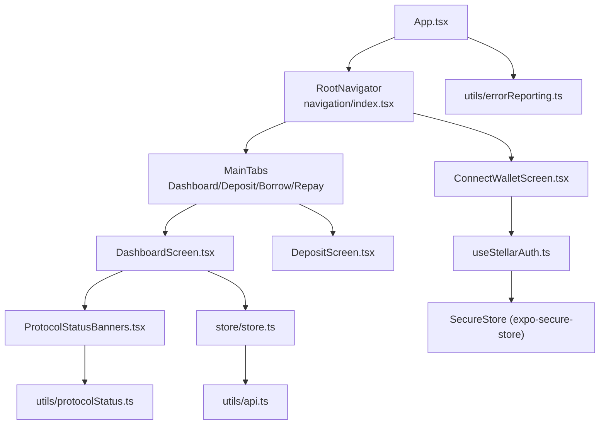
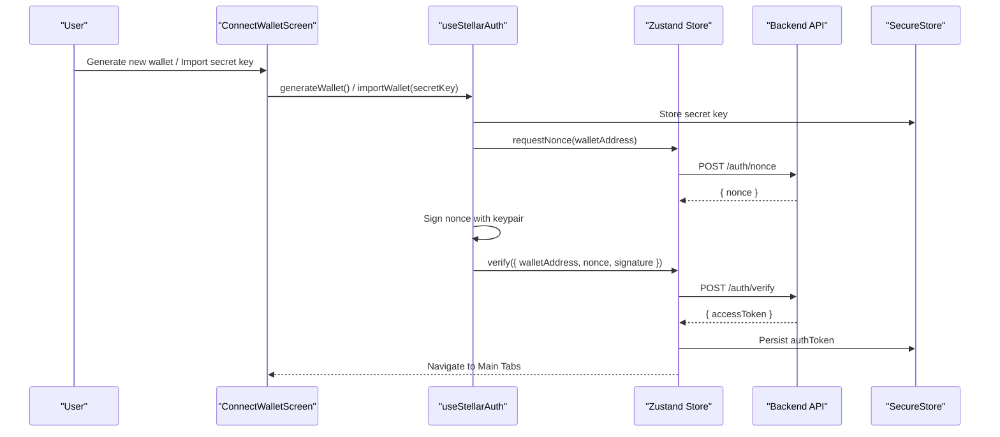
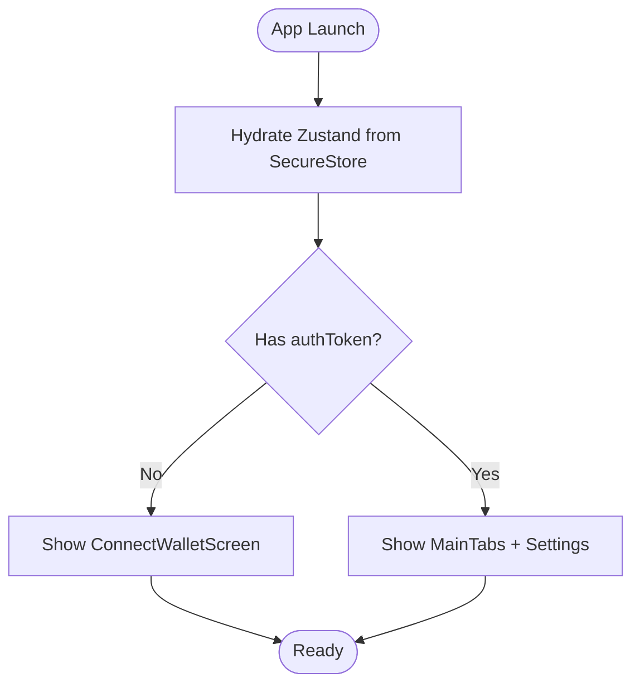
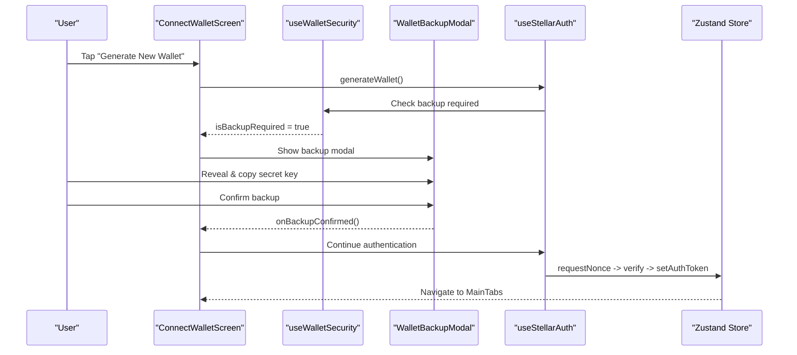
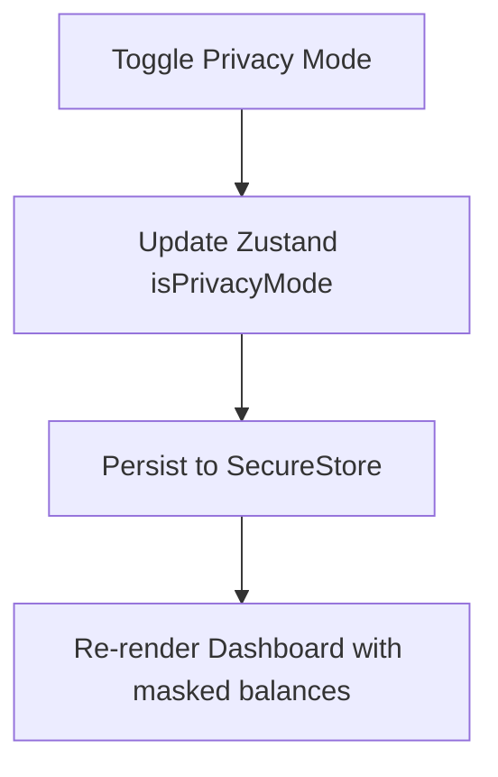
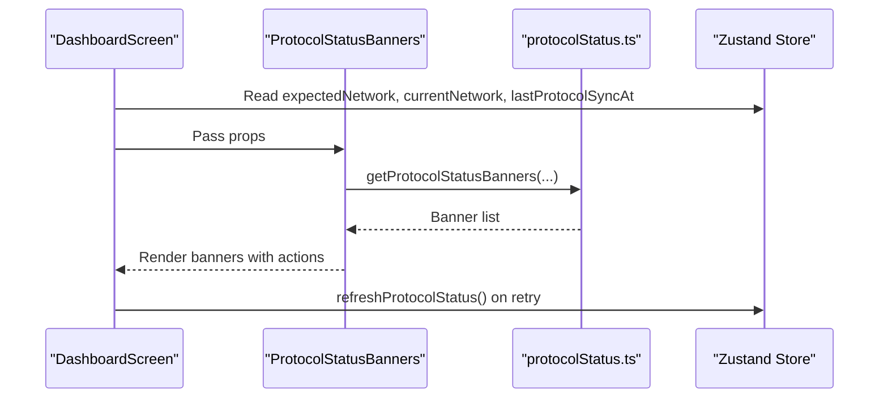
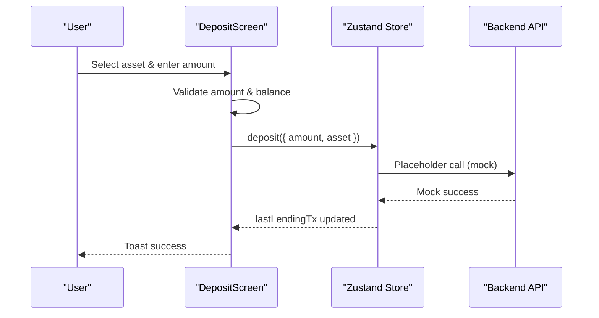
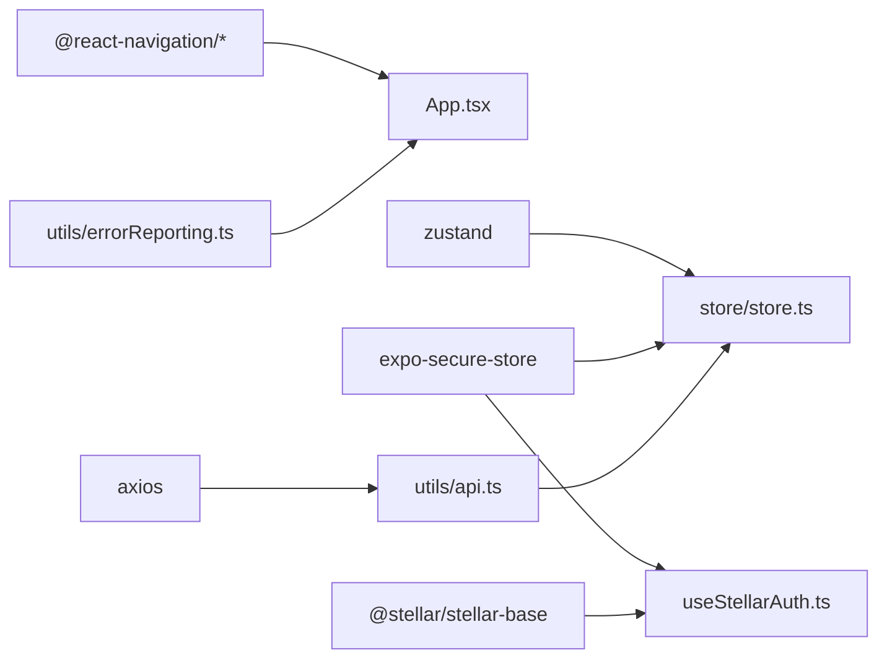

# Mobile Application (React Native/Expo)

<cite>
**Referenced Files in This Document**
- [App.tsx](file://veilend-mobile/App.tsx)
- [navigation/index.tsx](file://veilend-mobile/src/navigation/index.tsx)
- [store/store.ts](file://veilend-mobile/src/store/store.ts)
- [hooks/useStellarAuth.ts](file://veilend-mobile/src/hooks/useStellarAuth.ts)
- [screens/ConnectWalletScreen.tsx](file://veilend-mobile/src/screens/ConnectWalletScreen.tsx)
- [screens/DashboardScreen.tsx](file://veilend-mobile/src/screens/DashboardScreen.tsx)
- [screens/DepositScreen.tsx](file://veilend-mobile/src/screens/DepositScreen.tsx)
- [components/ProtocolStatusBanners.tsx](file://veilend-mobile/src/components/ProtocolStatusBanners.tsx)
- [utils/api.ts](file://veilend-mobile/src/utils/api.ts)
- [utils/protocolStatus.ts](file://veilend-mobile/src/utils/protocolStatus.ts)
- [hooks/useWalletSecurity.ts](file://veilend-mobile/src/hooks/useWalletSecurity.ts)
- [components/WalletBackupModal.tsx](file://veilend-mobile/src/components/WalletBackupModal.tsx)
- [utils/errorReporting.ts](file://veilend-mobile/src/utils/errorReporting.ts)
- [package.json](file://veilend-mobile/package.json)
- [app.json](file://veilend-mobile/app.json)
</cite>

## Table of Contents
1. Introduction
2. Project Structure
3. Core Components
4. Architecture Overview
5. Detailed Component Analysis
6. Dependency Analysis
7. Performance Considerations
8. Troubleshooting Guide
9. Conclusion

## Introduction
This document explains the VeilLend mobile application built with React Native and Expo. It focuses on cross-platform navigation, Zustand-based state management, wallet integration patterns, screen organization, and core features such as privacy mode, protocol status monitoring, and instant action flows for deposit, borrow, and repay operations. The guide is written for both users and developers, using codebase terminology like privacy mode, wallet connection, protocol sync, and transaction signing.

## Project Structure
The mobile app follows a feature-oriented layout:
- App entry wraps navigation, error boundary, global crash instrumentation, and loading overlays.
- Navigation defines a stack with a splash during session restore, a Connect Wallet flow when unauthenticated, and main tabs for Dashboard, Deposit, Borrow, Repay, plus Settings.
- State lives in a single Zustand store that persists auth tokens, addresses, privacy mode, profile data, currency, and notifications via SecureStore.
- Screens implement user flows; hooks encapsulate wallet security and authentication; utilities handle API calls, protocol status banners, and error reporting.

**Diagram sources**
- [App.tsx:1-57](file://veilend-mobile/App.tsx#L1-L57)
- [navigation/index.tsx:1-97](file://veilend-mobile/src/navigation/index.tsx#L1-L97)
- [screens/ConnectWalletScreen.tsx:1-377](file://veilend-mobile/src/screens/ConnectWalletScreen.tsx#L1-L377)
- [screens/DashboardScreen.tsx:1-654](file://veilend-mobile/src/screens/DashboardScreen.tsx#L1-L654)
- [screens/DepositScreen.tsx:1-365](file://veilend-mobile/src/screens/DepositScreen.tsx#L1-L365)
- [store/store.ts:1-397](file://veilend-mobile/src/store/store.ts#L1-L397)
- [hooks/useStellarAuth.ts:1-72](file://veilend-mobile/src/hooks/useStellarAuth.ts#L1-L72)
- [components/ProtocolStatusBanners.tsx:1-123](file://veilend-mobile/src/components/ProtocolStatusBanners.tsx#L1-L123)
- [utils/api.ts:1-57](file://veilend-mobile/src/utils/api.ts#L1-L57)
- [utils/protocolStatus.ts:1-73](file://veilend-mobile/src/utils/protocolStatus.ts#L1-L73)
- [utils/errorReporting.ts:1-279](file://veilend-mobile/src/utils/errorReporting.ts#L1-L279)

**Section sources**
- [App.tsx:1-57](file://veilend-mobile/App.tsx#L1-L57)
- [navigation/index.tsx:1-97](file://veilend-mobile/src/navigation/index.tsx#L1-L97)
- [package.json:1-57](file://veilend-mobile/package.json#L1-L57)
- [app.json:1-41](file://veilend-mobile/app.json#L1-L41)

## Core Components
- Root navigator: Shows a splash while restoring session from SecureStore, then routes to Connect Wallet or Main tabs based on authentication state.
- Zustand store: Centralized state for auth, UI preferences (privacy mode, currency), lending actions, portfolio data, and protocol sync status. Persists keys via SecureStore and hydrates on launch.
- Wallet integration: Generates or imports Stellar wallets, signs nonce challenges, and stores secret keys securely.
- Protocol status: Displays warnings for disconnected wallet, network mismatch, or stale sync, with retry actions.
- Error reporting: Global crash instrumentation and structured error logging with PII scrubbing.

Key responsibilities by file:
- App.tsx: Bootstraps navigation, error boundary, toast, and loading overlay.
- navigation/index.tsx: Defines stack/tab structure and conditional routing.
- store/store.ts: Manages all app state, persistence, and async workflows.
- useStellarAuth.ts: Handles keypair generation/import, nonce request/signature, and token exchange.
- DashboardScreen.tsx: Aggregates portfolio data, privacy toggle, and service shortcuts.
- DepositScreen.tsx: Implements deposit flow with validation and mock transaction handling.
- ProtocolStatusBanners.tsx: Renders actionable status banners based on computed rules.
- api.ts: Axios client with bearer token injection and error reporting interceptor.
- protocolStatus.ts: Pure function to compute banner messages and severity.
- useWalletSecurity.ts: Secure secret key reveal, backup confirmation, clipboard safety.
- WalletBackupModal.tsx: Guided backup flow with masking and confirmation.
- errorReporting.ts: Crash instrumentation, ring buffer storage, and PII scrubbing.

**Section sources**
- [App.tsx:1-57](file://veilend-mobile/App.tsx#L1-L57)
- [navigation/index.tsx:1-97](file://veilend-mobile/src/navigation/index.tsx#L1-L97)
- [store/store.ts:1-397](file://veilend-mobile/src/store/store.ts#L1-L397)
- [hooks/useStellarAuth.ts:1-72](file://veilend-mobile/src/hooks/useStellarAuth.ts#L1-L72)
- [screens/DashboardScreen.tsx:1-654](file://veilend-mobile/src/screens/DashboardScreen.tsx#L1-L654)
- [screens/DepositScreen.tsx:1-365](file://veilend-mobile/src/screens/DepositScreen.tsx#L1-L365)
- [components/ProtocolStatusBanners.tsx:1-123](file://veilend-mobile/src/components/ProtocolStatusBanners.tsx#L1-L123)
- [utils/api.ts:1-57](file://veilend-mobile/src/utils/api.ts#L1-L57)
- [utils/protocolStatus.ts:1-73](file://veilend-mobile/src/utils/protocolStatus.ts#L1-L73)
- [hooks/useWalletSecurity.ts:1-166](file://veilend-mobile/src/hooks/useWalletSecurity.ts#L1-L166)
- [components/WalletBackupModal.tsx:1-497](file://veilend-mobile/src/components/WalletBackupModal.tsx#L1-L497)
- [utils/errorReporting.ts:1-279](file://veilend-mobile/src/utils/errorReporting.ts#L1-L279)

## Architecture Overview
The app uses a layered architecture:
- Presentation layer: Screens and components render UI and handle user interactions.
- Navigation layer: React Navigation manages stacks and tabs, gating access based on auth state.
- State layer: Zustand store centralizes domain state and side effects, persisting sensitive settings via SecureStore.
- Integration layer: Axios client communicates with backend APIs; hooks abstract wallet operations; utilities provide protocol status logic and error reporting.

**Diagram sources**
- [screens/ConnectWalletScreen.tsx:1-377](file://veilend-mobile/src/screens/ConnectWalletScreen.tsx#L1-L377)
- [hooks/useStellarAuth.ts:1-72](file://veilend-mobile/src/hooks/useStellarAuth.ts#L1-L72)
- [store/store.ts:1-397](file://veilend-mobile/src/store/store.ts#L1-L397)
- [utils/api.ts:1-57](file://veilend-mobile/src/utils/api.ts#L1-L57)

## Detailed Component Analysis

### Navigation and Session Restoration
- Splash screen displays while the store hydrates from SecureStore to avoid flashing the Connect Wallet screen when a session exists.
- After hydration, if no auth token exists, the app routes to Connect Wallet; otherwise, it shows Main tabs and Settings.

**Diagram sources**
- [navigation/index.tsx:1-97](file://veilend-mobile/src/navigation/index.tsx#L1-L97)
- [store/store.ts:369-397](file://veilend-mobile/src/store/store.ts#L369-L397)

**Section sources**
- [navigation/index.tsx:1-97](file://veilend-mobile/src/navigation/index.tsx#L1-L97)
- [store/store.ts:101-149](file://veilend-mobile/src/store/store.ts#L101-L149)
- [store/store.ts:369-397](file://veilend-mobile/src/store/store.ts#L369-L397)

### Wallet Integration Patterns
- Self-custody approach: Secret keys are stored locally via SecureStore and never leave the device.
- Authentication flow: Request nonce from backend, sign with local keypair, verify signature to obtain an access token.
- Backup enforcement: On wallet generation, a guided modal prompts users to back up their secret key and confirm before proceeding.

**Diagram sources**
- [screens/ConnectWalletScreen.tsx:1-377](file://veilend-mobile/src/screens/ConnectWalletScreen.tsx#L1-L377)
- [hooks/useWalletSecurity.ts:1-166](file://veilend-mobile/src/hooks/useWalletSecurity.ts#L1-L166)
- [components/WalletBackupModal.tsx:1-497](file://veilend-mobile/src/components/WalletBackupModal.tsx#L1-L497)
- [hooks/useStellarAuth.ts:1-72](file://veilend-mobile/src/hooks/useStellarAuth.ts#L1-L72)
- [store/store.ts:233-252](file://veilend-mobile/src/store/store.ts#L233-L252)

**Section sources**
- [hooks/useStellarAuth.ts:1-72](file://veilend-mobile/src/hooks/useStellarAuth.ts#L1-L72)
- [hooks/useWalletSecurity.ts:1-166](file://veilend-mobile/src/hooks/useWalletSecurity.ts#L1-L166)
- [components/WalletBackupModal.tsx:1-497](file://veilend-mobile/src/components/WalletBackupModal.tsx#L1-L497)
- [store/store.ts:233-252](file://veilend-mobile/src/store/store.ts#L233-L252)

### Privacy Mode (X-Ray Privacy Dashboard)
- Toggle privacy mode globally via Zustand; persisted across sessions.
- Dashboard balance cards mask values when privacy mode is enabled, showing placeholders instead of actual numbers.
- Users can quickly toggle visibility from the dashboard header.

**Diagram sources**
- [store/store.ts:173-185](file://veilend-mobile/src/store/store.ts#L173-L185)
- [screens/DashboardScreen.tsx:140-152](file://veilend-mobile/src/screens/DashboardScreen.tsx#L140-L152)

**Section sources**
- [store/store.ts:173-185](file://veilend-mobile/src/store/store.ts#L173-L185)
- [screens/DashboardScreen.tsx:140-152](file://veilend-mobile/src/screens/DashboardScreen.tsx#L140-L152)

### Protocol Status Monitoring
- The dashboard displays banners for wallet disconnection, network mismatch, and sync lag.
- Users can reconnect or retry syncing; banners disable actions during refresh where appropriate.

**Diagram sources**
- [screens/DashboardScreen.tsx:201-209](file://veilend-mobile/src/screens/DashboardScreen.tsx#L201-L209)
- [components/ProtocolStatusBanners.tsx:1-123](file://veilend-mobile/src/components/ProtocolStatusBanners.tsx#L1-L123)
- [utils/protocolStatus.ts:1-73](file://veilend-mobile/src/utils/protocolStatus.ts#L1-L73)
- [store/store.ts:213-230](file://veilend-mobile/src/store/store.ts#L213-L230)

**Section sources**
- [components/ProtocolStatusBanners.tsx:1-123](file://veilend-mobile/src/components/ProtocolStatusBanners.tsx#L1-L123)
- [utils/protocolStatus.ts:1-73](file://veilend-mobile/src/utils/protocolStatus.ts#L1-L73)
- [store/store.ts:213-230](file://veilend-mobile/src/store/store.ts#L213-L230)

### Instant Action Buttons: Deposit Flow
- Deposit screen validates input amount and asset selection.
- Submits deposit through Zustand store; currently returns mock transactions until backend integration completes.
- Provides feedback via toast and updates last transaction state.

**Diagram sources**
- [screens/DepositScreen.tsx:69-81](file://veilend-mobile/src/screens/DepositScreen.tsx#L69-L81)
- [store/store.ts:257-269](file://veilend-mobile/src/store/store.ts#L257-L269)

**Section sources**
- [screens/DepositScreen.tsx:1-365](file://veilend-mobile/src/screens/DepositScreen.tsx#L1-L365)
- [store/store.ts:257-269](file://veilend-mobile/src/store/store.ts#L257-L269)

### Borrow and Repay Flows
- Borrow and Repay screens are registered in the tab navigator and follow similar patterns to Deposit: validate inputs, call store methods, show feedback.
- Store methods currently return mock transactions; integrate with backend when ready.

**Section sources**
- [navigation/index.tsx:18-45](file://veilend-mobile/src/navigation/index.tsx#L18-L45)
- [store/store.ts:283-308](file://veilend-mobile/src/store/store.ts#L283-L308)

## Dependency Analysis
Key dependencies include:
- React Navigation for navigation and tabs.
- Zustand for state management and persistence.
- Expo SecureStore for secure local storage.
- Axios for HTTP requests with interceptors.
- Stellar Base for keypair generation and signing.
- Error reporting module for crash instrumentation and structured logs.

**Diagram sources**
- [package.json:13-45](file://veilend-mobile/package.json#L13-L45)
- [App.tsx:1-57](file://veilend-mobile/App.tsx#L1-L57)
- [store/store.ts:1-397](file://veilend-mobile/src/store/store.ts#L1-L397)
- [hooks/useStellarAuth.ts:1-72](file://veilend-mobile/src/hooks/useStellarAuth.ts#L1-L72)
- [utils/api.ts:1-57](file://veilend-mobile/src/utils/api.ts#L1-L57)
- [utils/errorReporting.ts:1-279](file://veilend-mobile/src/utils/errorReporting.ts#L1-L279)

**Section sources**
- [package.json:13-45](file://veilend-mobile/package.json#L13-L45)
- [store/store.ts:1-397](file://veilend-mobile/src/store/store.ts#L1-L397)
- [utils/api.ts:1-57](file://veilend-mobile/src/utils/api.ts#L1-L57)
- [hooks/useStellarAuth.ts:1-72](file://veilend-mobile/src/hooks/useStellarAuth.ts#L1-L72)
- [utils/errorReporting.ts:1-279](file://veilend-mobile/src/utils/errorReporting.ts#L1-L279)

## Performance Considerations
- Minimize re-renders by selecting only needed store slices in components.
- Use pagination and virtualization for large lists (e.g., transactions).
- Debounce or throttle frequent actions like protocol status refresh.
- Keep animations lightweight; prefer native-driven animations where possible.
- Avoid heavy computations on the main thread; offload to worklets if needed.

[No sources needed since this section provides general guidance]

## Troubleshooting Guide
Common issues and resolutions:
- Network errors: Axios response interceptor reports structured errors with severity and metadata; check console logs and stored reports.
- Unauthorized errors: Treat as critical; prompt user to reconnect wallet and re-authenticate.
- Stale protocol data: Use retry sync action; banners indicate staleness thresholds.
- SecureStore failures: Store operations catch and ignore errors gracefully; app continues with in-memory state.

Practical steps:
- Inspect stored error reports via utility functions to diagnose crashes.
- Verify network connectivity and backend availability.
- Ensure correct network configuration in API base URL for development vs production.

**Section sources**
- [utils/api.ts:24-54](file://veilend-mobile/src/utils/api.ts#L24-L54)
- [utils/errorReporting.ts:123-142](file://veilend-mobile/src/utils/errorReporting.ts#L123-L142)
- [utils/errorReporting.ts:182-211](file://veilend-mobile/src/utils/errorReporting.ts#L182-L211)
- [utils/errorReporting.ts:248-267](file://veilend-mobile/src/utils/errorReporting.ts#L248-L267)

## Conclusion
The VeilLend mobile app delivers a secure, self-custodial lending experience on mobile with clear navigation, robust state management, and strong privacy controls. Wallet integration leverages secure local storage and cryptographic signing, while protocol status monitoring keeps users informed. The modular architecture supports future enhancements, including full backend integration for lending operations and expanded analytics.

[No sources needed since this section summarizes without analyzing specific files]