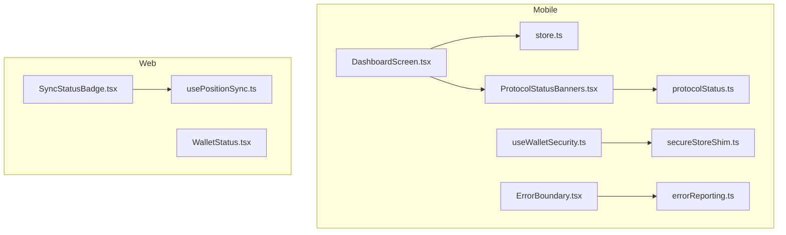
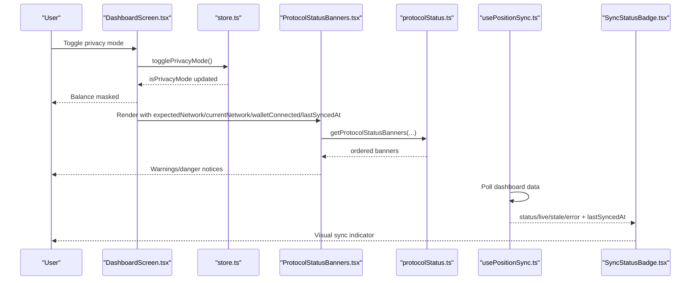
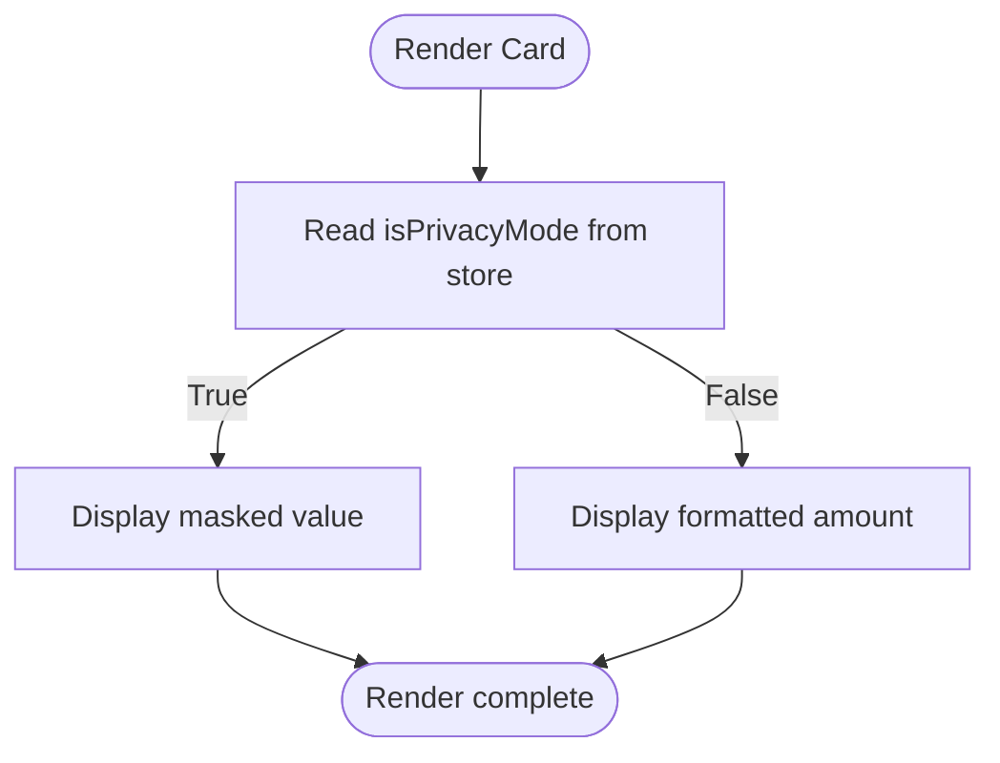
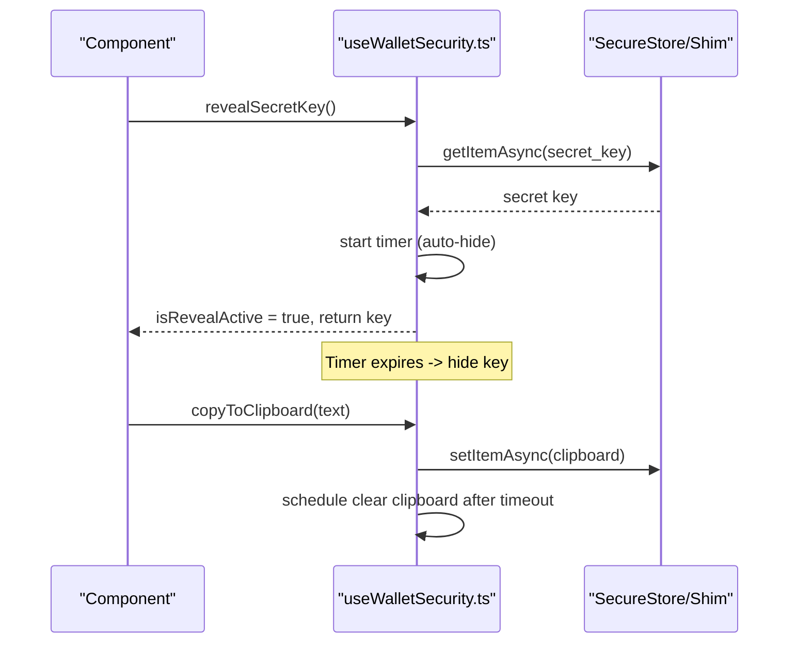
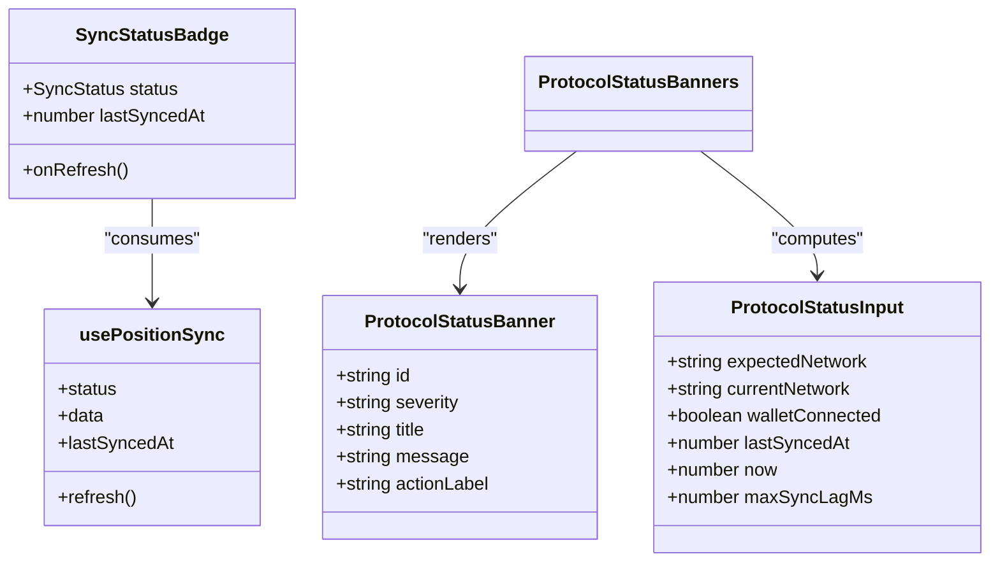
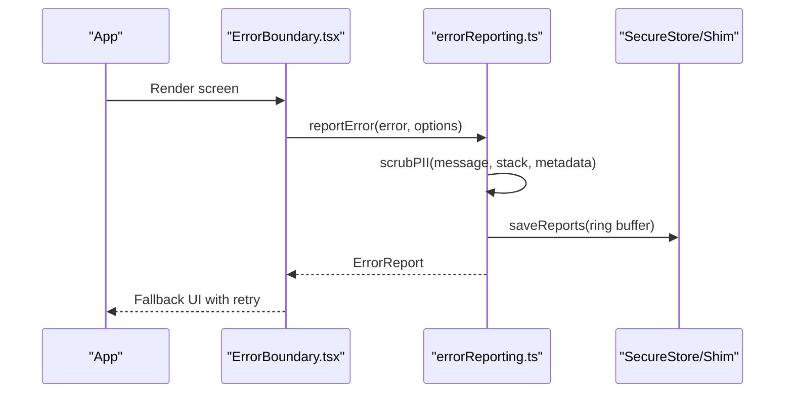
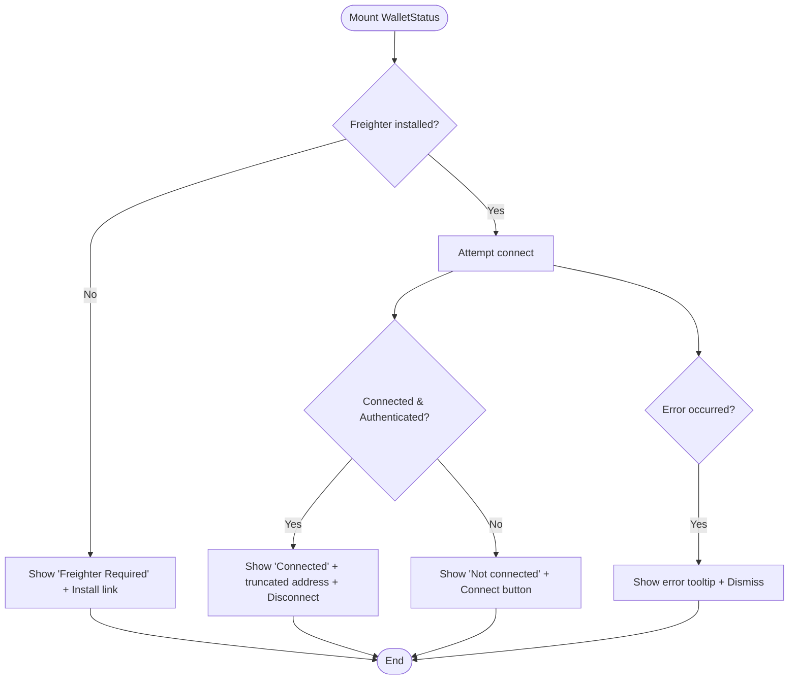
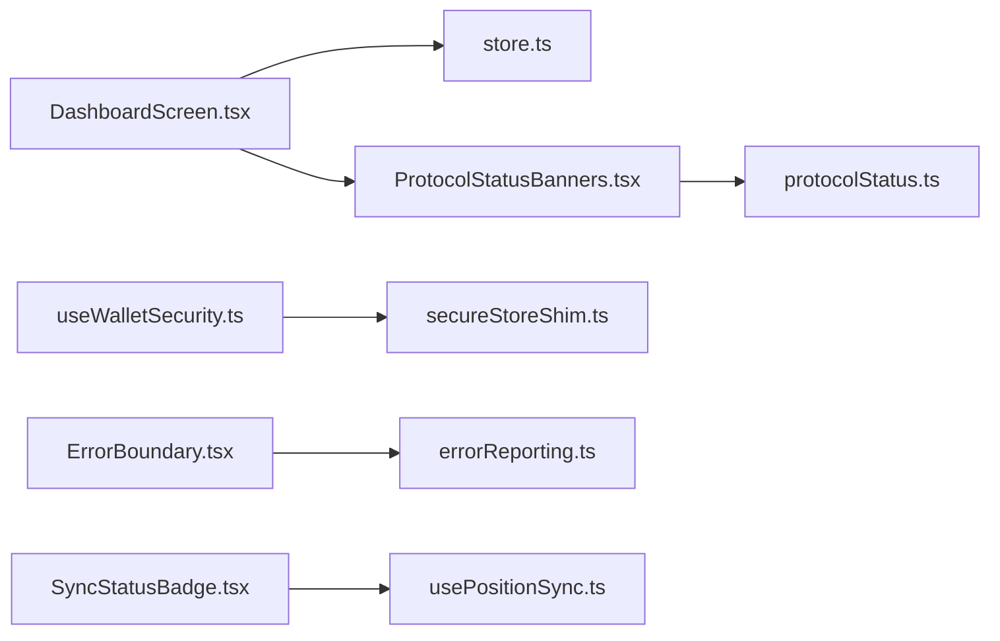

# Privacy Features & Security

<cite>
**Referenced Files in This Document**
- [useWalletSecurity.ts](file://veilend-mobile/src/hooks/useWalletSecurity.ts)
- [secureStoreShim.ts](file://veilend-mobile/src/utils/secureStoreShim.ts)
- [store.ts](file://veilend-mobile/src/store/store.ts)
- [DashboardScreen.tsx](file://veilend-mobile/src/screens/DashboardScreen.tsx)
- [ProtocolStatusBanners.tsx](file://veilend-mobile/src/components/ProtocolStatusBanners.tsx)
- [protocolStatus.ts](file://veilend-mobile/src/utils/protocolStatus.ts)
- [SyncStatusBadge.tsx](file://veilend-web/src/components/SyncStatusBadge.tsx)
- [usePositionSync.ts](file://veilend-web/src/lib/hooks/usePositionSync.ts)
- [errorReporting.ts](file://veilend-mobile/src/utils/errorReporting.ts)
- [ErrorBoundary.tsx](file://veilend-mobile/src/components/ErrorBoundary.tsx)
- [WalletStatus.tsx](file://veilend-web/src/components/WalletStatus.tsx)
</cite>

## Table of Contents
1. Introduction
2. Project Structure
3. Core Components
4. Architecture Overview
5. Detailed Component Analysis
6. Dependency Analysis
7. Performance Considerations
8. Troubleshooting Guide
9. Conclusion
10. Appendices

## Introduction
This document explains the privacy and security features implemented across the Veilend mobile and web applications. It focuses on:
- X-Ray privacy mode for hiding sensitive balances and positions
- Secure management of wallet secrets and local storage
- Protocol status monitoring via banners and real-time sync indicators
- Error reporting and crash instrumentation that preserve user privacy
- Practical examples for enabling privacy mode, masking balances, and surfacing security alerts
- Compliance considerations and data protection measures

## Project Structure
The privacy and security features span multiple layers:
- Mobile app (React Native): secure key handling, privacy toggles, protocol status banners, error reporting
- Web app (Next.js): live sync status badge, wallet connectivity UI
- Shared utilities: protocol status logic, secure storage shim, error scrubbing

**Diagram sources**
- [DashboardScreen.tsx:18-44](file://veilend-mobile/src/screens/DashboardScreen.tsx#L18-L44)
- [useWalletSecurity.ts:25-166](file://veilend-mobile/src/hooks/useWalletSecurity.ts#L25-L166)
- [ProtocolStatusBanners.tsx:16-72](file://veilend-mobile/src/components/ProtocolStatusBanners.tsx#L16-L72)
- [protocolStatus.ts:29-72](file://veilend-mobile/src/utils/protocolStatus.ts#L29-L72)
- [errorReporting.ts:147-211](file://veilend-mobile/src/utils/errorReporting.ts#L147-L211)
- [ErrorBoundary.tsx:25-84](file://veilend-mobile/src/components/ErrorBoundary.tsx#L25-L84)
- [store.ts:173-230](file://veilend-mobile/src/store/store.ts#L173-L230)
- [secureStoreShim.ts:22-53](file://veilend-mobile/src/utils/secureStoreShim.ts#L22-L53)
- [SyncStatusBadge.tsx:18-54](file://veilend-web/src/components/SyncStatusBadge.tsx#L18-L54)
- [usePositionSync.ts:34-196](file://veilend-web/src/lib/hooks/usePositionSync.ts#L34-L196)

**Section sources**
- [DashboardScreen.tsx:18-44](file://veilend-mobile/src/screens/DashboardScreen.tsx#L18-L44)
- [store.ts:173-230](file://veilend-mobile/src/store/store.ts#L173-L230)
- [useWalletSecurity.ts:25-166](file://veilend-mobile/src/hooks/useWalletSecurity.ts#L25-L166)
- [ProtocolStatusBanners.tsx:16-72](file://veilend-mobile/src/components/ProtocolStatusBanners.tsx#L16-L72)
- [protocolStatus.ts:29-72](file://veilend-mobile/src/utils/protocolStatus.ts#L29-L72)
- [SyncStatusBadge.tsx:18-54](file://veilend-web/src/components/SyncStatusBadge.tsx#L18-L54)
- [usePositionSync.ts:34-196](file://veilend-web/src/lib/hooks/usePositionSync.ts#L34-L196)
- [errorReporting.ts:147-211](file://veilend-mobile/src/utils/errorReporting.ts#L147-L211)
- [ErrorBoundary.tsx:25-84](file://veilend-mobile/src/components/ErrorBoundary.tsx#L25-L84)
- [secureStoreShim.ts:22-53](file://veilend-mobile/src/utils/secureStoreShim.ts#L22-L53)

## Core Components
- X-Ray privacy mode toggle and balance masking in the mobile dashboard
- Secure secret key reveal with auto-expiring visibility and clipboard cleanup
- Protocol status banners for wallet disconnects, network mismatch, and stale sync
- Live sync status indicator in the web app with staleness detection
- Centralized error reporting with PII scrubbing and ring-buffer persistence
- Wallet connectivity status component for the web app

**Section sources**
- [DashboardScreen.tsx:140-170](file://veilend-mobile/src/screens/DashboardScreen.tsx#L140-L170)
- [useWalletSecurity.ts:64-152](file://veilend-mobile/src/hooks/useWalletSecurity.ts#L64-L152)
- [ProtocolStatusBanners.tsx:25-72](file://veilend-mobile/src/components/ProtocolStatusBanners.tsx#L25-L72)
- [protocolStatus.ts:29-72](file://veilend-mobile/src/utils/protocolStatus.ts#L29-L72)
- [SyncStatusBadge.tsx:18-54](file://veilend-web/src/components/SyncStatusBadge.tsx#L18-L54)
- [usePositionSync.ts:34-196](file://veilend-web/src/lib/hooks/usePositionSync.ts#L34-L196)
- [errorReporting.ts:147-211](file://veilend-mobile/src/utils/errorReporting.ts#L147-L211)
- [ErrorBoundary.tsx:25-84](file://veilend-mobile/src/components/ErrorBoundary.tsx#L25-L84)
- [WalletStatus.tsx:17-155](file://veilend-web/src/components/WalletStatus.tsx#L17-L155)

## Architecture Overview
Privacy and security are enforced through a layered approach:
- UI layer renders privacy controls and status indicators
- State layer persists privacy preferences and auth tokens securely
- Utilities provide secure storage, protocol status computation, and error scrubbing
- Web components reflect live sync state and wallet connectivity

**Diagram sources**
- [DashboardScreen.tsx:18-44](file://veilend-mobile/src/screens/DashboardScreen.tsx#L18-L44)
- [store.ts:173-230](file://veilend-mobile/src/store/store.ts#L173-L230)
- [ProtocolStatusBanners.tsx:25-72](file://veilend-mobile/src/components/ProtocolStatusBanners.tsx#L25-L72)
- [protocolStatus.ts:29-72](file://veilend-mobile/src/utils/protocolStatus.ts#L29-L72)
- [usePositionSync.ts:34-196](file://veilend-web/src/lib/hooks/usePositionSync.ts#L34-L196)
- [SyncStatusBadge.tsx:18-54](file://veilend-web/src/components/SyncStatusBadge.tsx#L18-L54)

## Detailed Component Analysis

### X-Ray Privacy Mode and Balance Masking
- The mobile dashboard reads privacy mode from the store and conditionally masks balance values with placeholders when enabled.
- The privacy toggle updates the store and persists the preference to secure storage; logout clears all persisted keys including privacy mode.
- The dashboard also exposes a visual privacy shield label indicating ZK shielding context.

**Diagram sources**
- [DashboardScreen.tsx:140-170](file://veilend-mobile/src/screens/DashboardScreen.tsx#L140-L170)
- [store.ts:173-185](file://veilend-mobile/src/store/store.ts#L173-L185)

**Section sources**
- [DashboardScreen.tsx:140-170](file://veilend-mobile/src/screens/DashboardScreen.tsx#L140-L170)
- [store.ts:173-185](file://veilend-mobile/src/store/store.ts#L173-L185)

### useWalletSecurity Hook: Secret Key Management and Clipboard Safety
- Loads and stores secret keys and backup confirmation flags using secure storage (expo-secure-store or shim).
- Provides temporary reveal of secret key with an auto-expiring timer and optional clipboard clearing after a short duration.
- Exposes methods to confirm backup, check if backup is required, and manage reveal timers safely.

**Diagram sources**
- [useWalletSecurity.ts:64-152](file://veilend-mobile/src/hooks/useWalletSecurity.ts#L64-L152)
- [secureStoreShim.ts:22-53](file://veilend-mobile/src/utils/secureStoreShim.ts#L22-L53)

**Section sources**
- [useWalletSecurity.ts:25-166](file://veilend-mobile/src/hooks/useWalletSecurity.ts#L25-L166)
- [secureStoreShim.ts:22-53](file://veilend-mobile/src/utils/secureStoreShim.ts#L22-L53)

### Protocol Status Monitoring: Banners and Real-Time Sync Indicators
- Mobile banners surface critical issues: wallet disconnected, wrong Stellar network, and stale protocol sync. They compute severity and action labels based on current state.
- Web app displays a compact sync status badge reflecting idle/loading/live/stale/empty/error states, with relative timestamps and manual refresh.

**Diagram sources**
- [protocolStatus.ts:1-72](file://veilend-mobile/src/utils/protocolStatus.ts#L1-L72)
- [ProtocolStatusBanners.tsx:16-72](file://veilend-mobile/src/components/ProtocolStatusBanners.tsx#L16-L72)
- [SyncStatusBadge.tsx:18-54](file://veilend-web/src/components/SyncStatusBadge.tsx#L18-L54)
- [usePositionSync.ts:34-196](file://veilend-web/src/lib/hooks/usePositionSync.ts#L34-L196)

**Section sources**
- [ProtocolStatusBanners.tsx:25-72](file://veilend-mobile/src/components/ProtocolStatusBanners.tsx#L25-L72)
- [protocolStatus.ts:29-72](file://veilend-mobile/src/utils/protocolStatus.ts#L29-L72)
- [SyncStatusBadge.tsx:18-54](file://veilend-web/src/components/SyncStatusBadge.tsx#L18-L54)
- [usePositionSync.ts:34-196](file://veilend-web/src/lib/hooks/usePositionSync.ts#L34-L196)

### Error Reporting and Crash Instrumentation
- Centralized error reporting creates structured reports with automatic PII scrubbing (wallet addresses, secret keys, tokens).
- Reports are stored in a ring buffer in secure storage to survive restarts and can be reviewed later.
- Global handlers capture unhandled errors and promise rejections; React ErrorBoundary wraps screens to catch rendering failures and report them.

**Diagram sources**
- [ErrorBoundary.tsx:25-84](file://veilend-mobile/src/components/ErrorBoundary.tsx#L25-L84)
- [errorReporting.ts:147-211](file://veilend-mobile/src/utils/errorReporting.ts#L147-L211)
- [secureStoreShim.ts:22-53](file://veilend-mobile/src/utils/secureStoreShim.ts#L22-L53)

**Section sources**
- [errorReporting.ts:147-211](file://veilend-mobile/src/utils/errorReporting.ts#L147-L211)
- [ErrorBoundary.tsx:25-84](file://veilend-mobile/src/components/ErrorBoundary.tsx#L25-L84)

### Wallet Connectivity and Security Alerts (Web)
- WalletStatus shows connection state, installation requirements, and provides connect/disconnect actions.
- Errors are surfaced with dismissable tooltips; truncated address display reduces exposure.

**Diagram sources**
- [WalletStatus.tsx:17-155](file://veilend-web/src/components/WalletStatus.tsx#L17-L155)

**Section sources**
- [WalletStatus.tsx:17-155](file://veilend-web/src/components/WalletStatus.tsx#L17-L155)

## Dependency Analysis
- DashboardScreen depends on store for privacy mode and portfolio data, and on ProtocolStatusBanners for health warnings.
- ProtocolStatusBanners depends on protocolStatus utility for banner computation.
- useWalletSecurity depends on secure storage abstraction (real or shim).
- ErrorBoundary depends on centralized error reporting.
- Web SyncStatusBadge depends on usePositionSync for live sync state.

**Diagram sources**
- [DashboardScreen.tsx:18-44](file://veilend-mobile/src/screens/DashboardScreen.tsx#L18-L44)
- [store.ts:173-230](file://veilend-mobile/src/store/store.ts#L173-L230)
- [ProtocolStatusBanners.tsx:25-72](file://veilend-mobile/src/components/ProtocolStatusBanners.tsx#L25-L72)
- [protocolStatus.ts:29-72](file://veilend-mobile/src/utils/protocolStatus.ts#L29-L72)
- [useWalletSecurity.ts:64-152](file://veilend-mobile/src/hooks/useWalletSecurity.ts#L64-L152)
- [secureStoreShim.ts:22-53](file://veilend-mobile/src/utils/secureStoreShim.ts#L22-L53)
- [ErrorBoundary.tsx:25-84](file://veilend-mobile/src/components/ErrorBoundary.tsx#L25-L84)
- [errorReporting.ts:147-211](file://veilend-mobile/src/utils/errorReporting.ts#L147-L211)
- [SyncStatusBadge.tsx:18-54](file://veilend-web/src/components/SyncStatusBadge.tsx#L18-L54)
- [usePositionSync.ts:34-196](file://veilend-web/src/lib/hooks/usePositionSync.ts#L34-L196)

**Section sources**
- [DashboardScreen.tsx:18-44](file://veilend-mobile/src/screens/DashboardScreen.tsx#L18-L44)
- [store.ts:173-230](file://veilend-mobile/src/store/store.ts#L173-L230)
- [ProtocolStatusBanners.tsx:25-72](file://veilend-mobile/src/components/ProtocolStatusBanners.tsx#L25-L72)
- [protocolStatus.ts:29-72](file://veilend-mobile/src/utils/protocolStatus.ts#L29-L72)
- [useWalletSecurity.ts:64-152](file://veilend-mobile/src/hooks/useWalletSecurity.ts#L64-L152)
- [secureStoreShim.ts:22-53](file://veilend-mobile/src/utils/secureStoreShim.ts#L22-L53)
- [ErrorBoundary.tsx:25-84](file://veilend-mobile/src/components/ErrorBoundary.tsx#L25-L84)
- [errorReporting.ts:147-211](file://veilend-mobile/src/utils/errorReporting.ts#L147-L211)
- [SyncStatusBadge.tsx:18-54](file://veilend-web/src/components/SyncStatusBadge.tsx#L18-L54)
- [usePositionSync.ts:34-196](file://veilend-web/src/lib/hooks/usePositionSync.ts#L34-L196)

## Performance Considerations
- Privacy mode toggle is a lightweight state change; ensure it does not trigger unnecessary re-renders by memoizing derived values where appropriate.
- Secret key reveal uses a short-lived timer to minimize exposure window; avoid long-running timers in hot paths.
- Protocol status banners are computed purely; keep inputs minimal to reduce recomputation.
- Sync polling interval should balance freshness with battery/network usage; adjust stale thresholds per environment.
- Error reporting writes to secure storage in a ring buffer; cap size to prevent storage bloat.

[No sources needed since this section provides general guidance]

## Troubleshooting Guide
- If balances remain visible despite privacy mode being enabled, verify that the store’s privacy flag is correctly loaded at startup and that the dashboard reads it before rendering amounts.
- If secret key remains visible longer than expected, check that the reveal timer is cleared on unmount and that no other code extends the visibility.
- If banners do not appear for stale sync, ensure lastSyncedAt is updated on successful status refresh and that the threshold is configured appropriately.
- If sync badge shows “Offline” persistently, confirm that the address is valid and that polling is enabled; check for network errors and consider refreshing manually.
- If error reports are missing, verify that global crash instrumentation is initialized and that SecureStore operations succeed; inspect stored reports count.

**Section sources**
- [store.ts:369-396](file://veilend-mobile/src/store/store.ts#L369-L396)
- [useWalletSecurity.ts:55-105](file://veilend-mobile/src/hooks/useWalletSecurity.ts#L55-L105)
- [protocolStatus.ts:29-72](file://veilend-mobile/src/utils/protocolStatus.ts#L29-L72)
- [usePositionSync.ts:34-196](file://veilend-web/src/lib/hooks/usePositionSync.ts#L34-L196)
- [errorReporting.ts:182-238](file://veilend-mobile/src/utils/errorReporting.ts#L182-L238)

## Conclusion
Veilend implements robust privacy and security controls:
- X-Ray privacy mode hides sensitive financial data at render time and persists user preference securely
- Secret key access is transient and protected with timers and clipboard hygiene
- Protocol status banners and live sync badges keep users informed about connectivity and data freshness
- Error reporting preserves user privacy while enabling effective debugging
Adhering to these patterns ensures compliance with data protection principles and maintains user trust.

[No sources needed since this section summarizes without analyzing specific files]

## Appendices

### Practical Examples

- Activate privacy mode and mask balances:
  - Trigger toggle from the dashboard header; verify that balance cards show masked values and the eye icon reflects hidden state.
  - Confirm that the preference persists across app restarts and clears on logout.

- Hide secret key safely:
  - Use the reveal function to temporarily expose the key; ensure it auto-hides after the configured duration.
  - When copying to clipboard, rely on the built-in cleanup to clear clipboard content after a short period.

- Surface security alerts:
  - Ensure protocol status banners appear when the wallet is disconnected, the network is mismatched, or sync is stale.
  - In the web app, use the sync status badge to indicate live/stale/offline states and allow manual refresh.

- Implement error reporting:
  - Wrap screens with the error boundary to capture rendering errors and present a friendly fallback.
  - Use the centralized reporter to log structured errors with PII scrubbing; review stored reports during debugging.

**Section sources**
- [DashboardScreen.tsx:140-170](file://veilend-mobile/src/screens/DashboardScreen.tsx#L140-L170)
- [useWalletSecurity.ts:64-152](file://veilend-mobile/src/hooks/useWalletSecurity.ts#L64-L152)
- [ProtocolStatusBanners.tsx:25-72](file://veilend-mobile/src/components/ProtocolStatusBanners.tsx#L25-L72)
- [SyncStatusBadge.tsx:18-54](file://veilend-web/src/components/SyncStatusBadge.tsx#L18-L54)
- [ErrorBoundary.tsx:25-84](file://veilend-mobile/src/components/ErrorBoundary.tsx#L25-L84)
- [errorReporting.ts:147-211](file://veilend-mobile/src/utils/errorReporting.ts#L147-L211)