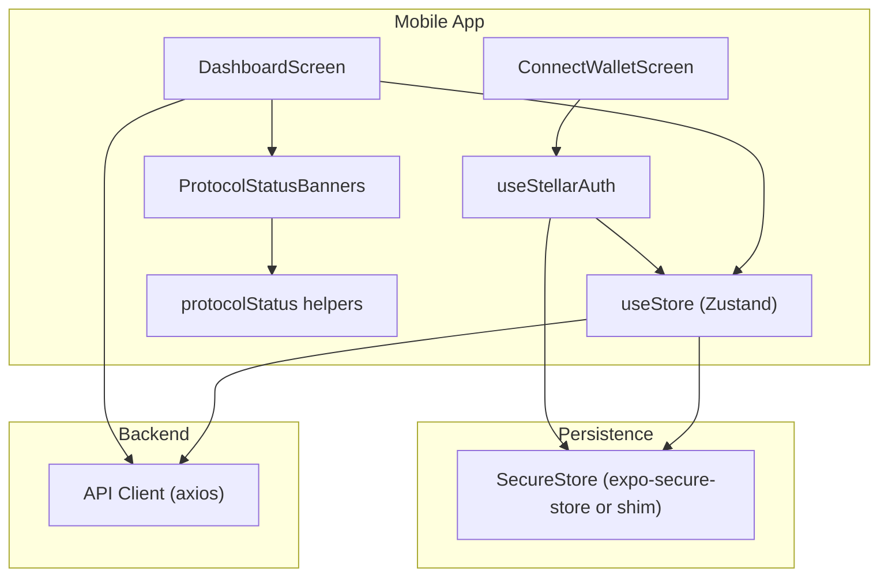
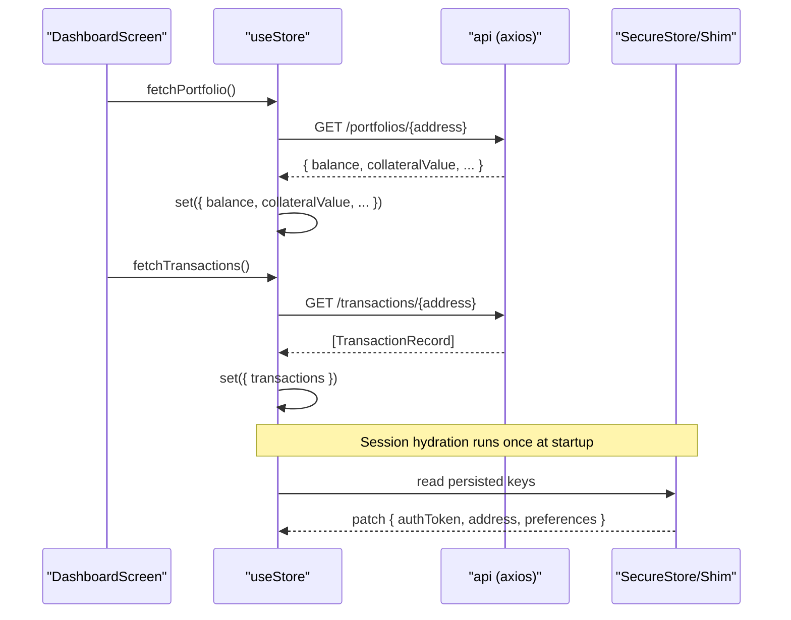
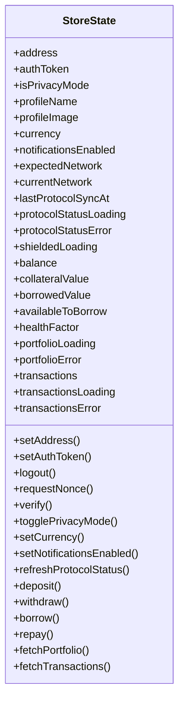
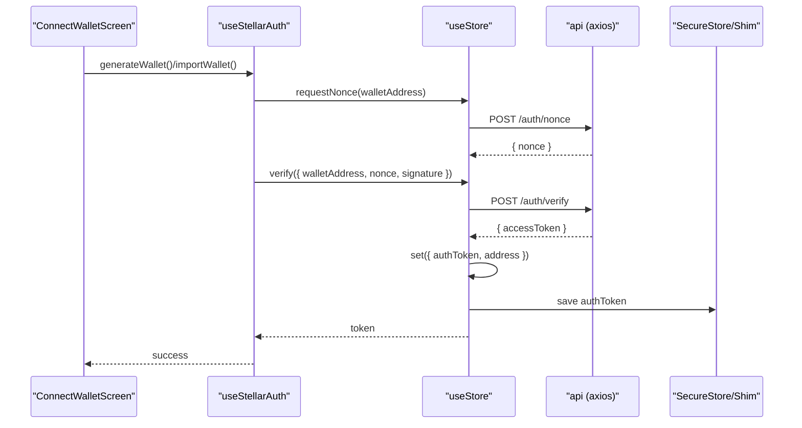
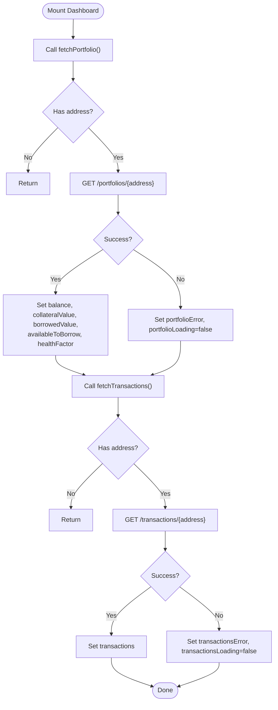
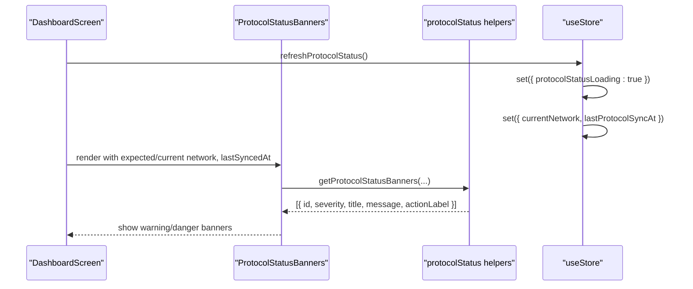
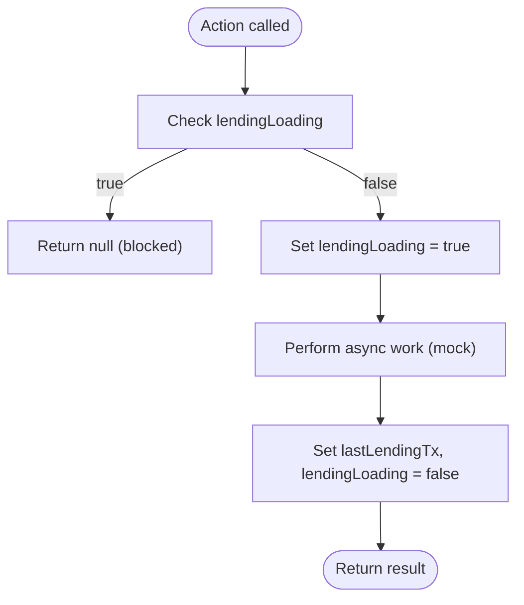
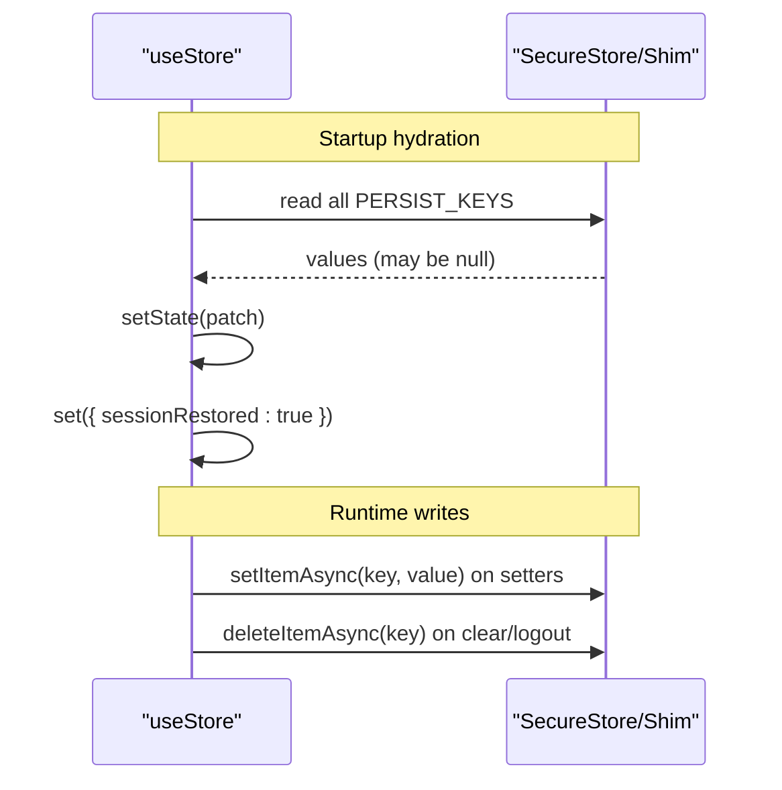
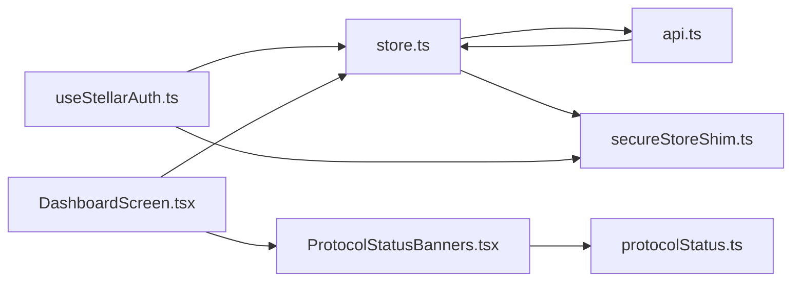

# State Management & Data Flow

<cite>
**Referenced Files in This Document**
- [store.ts](file://veilend-mobile/src/store/store.ts)
- [store.test.ts](file://veilend-mobile/src/store/store.test.ts)
- [mockData.ts](file://veilend-mobile/src/data/mockData.ts)
- [api.ts](file://veilend-mobile/src/utils/api.ts)
- [secureStoreShim.ts](file://veilend-mobile/src/utils/secureStoreShim.ts)
- [DashboardScreen.tsx](file://veilend-mobile/src/screens/DashboardScreen.tsx)
- [useStellarAuth.ts](file://veilend-mobile/src/hooks/useStellarAuth.ts)
- [ProtocolStatusBanners.tsx](file://veilend-mobile/src/components/ProtocolStatusBanners.tsx)
- [protocolStatus.ts](file://veilend-mobile/src/utils/protocolStatus.ts)
</cite>

## Table of Contents
1. Introduction
2. Project Structure
3. Core Components
4. Architecture Overview
5. Detailed Component Analysis
6. Dependency Analysis
7. Performance Considerations
8. Troubleshooting Guide
9. Conclusion

## Introduction
This document explains the mobile app’s state management and data flow centered on a Zustand store. It covers authentication state, lending protocol actions, portfolio and transaction state, UI preferences, and loading/error states. It also documents persistence via SecureStore (with a dev/test shim), session hydration at startup, mock data usage for development and testing, selectors-like patterns through store composition, synchronization with backend services, and strategies for testing, debugging, and future migration.

## Project Structure
The mobile app organizes state around a single global store that composes multiple domains:
- Authentication: address, token, loading, nonce request, verify, logout
- UI and settings: privacy mode, profile fields, currency, notifications, network status
- Lending operations: deposit, withdraw, borrow, repay (currently mocked)
- Portfolio and transactions: balances, health factor, transaction list, fetchers

**Diagram sources**
- [store.ts:99-396](file://veilend-mobile/src/store/store.ts#L99-L396)
- [useStellarAuth.ts:16-71](file://veilend-mobile/src/hooks/useStellarAuth.ts#L16-L71)
- [DashboardScreen.tsx:18-44](file://veilend-mobile/src/screens/DashboardScreen.tsx#L18-L44)
- [ProtocolStatusBanners.tsx:16-70](file://veilend-mobile/src/components/ProtocolStatusBanners.tsx#L16-L70)
- [protocolStatus.ts:25-72](file://veilend-mobile/src/utils/protocolStatus.ts#L25-L72)
- [api.ts:12-22](file://veilend-mobile/src/utils/api.ts#L12-L22)

**Section sources**
- [store.ts:15-97](file://veilend-mobile/src/store/store.ts#L15-L97)
- [DashboardScreen.tsx:18-44](file://veilend-mobile/src/screens/DashboardScreen.tsx#L18-L44)

## Core Components
- Global Zustand store: central source of truth for auth, UI, lending, and portfolio state; exposes actions to mutate state and perform side effects.
- API client: axios instance that injects bearer tokens from the store into requests and reports errors consistently.
- Persistence layer: SecureStore integration with a fallback shim for development/testing; used to persist sensitive and preference data.
- Hooks and screens: useStellarAuth orchestrates wallet generation/import and calls store auth actions; DashboardScreen consumes store state and triggers data fetching.

Key responsibilities:
- Auth: request nonce, verify signature, set token/address, logout, restore session
- UI/preferences: privacy mode, profile info, currency, notifications, network sync status
- Lending: placeholder actions with double-submit protection and mock results
- Portfolio: fetch balances and transactions, manage loading and error states

**Section sources**
- [store.ts:99-396](file://veilend-mobile/src/store/store.ts#L99-L396)
- [api.ts:12-22](file://veilend-mobile/src/utils/api.ts#L12-L22)
- [secureStoreShim.ts:22-53](file://veilend-mobile/src/utils/secureStoreShim.ts#L22-L53)
- [useStellarAuth.ts:16-71](file://veilend-mobile/src/hooks/useStellarAuth.ts#L16-L71)
- [DashboardScreen.tsx:100-110](file://veilend-mobile/src/screens/DashboardScreen.tsx#L100-L110)

## Architecture Overview
The store encapsulates all domain state and actions. On app start, it hydrates persisted values from SecureStore. Screens subscribe to slices of state and call actions to update state and trigger network requests. The API client automatically attaches the current token from the store.

**Diagram sources**
- [store.ts:321-362](file://veilend-mobile/src/store/store.ts#L321-L362)
- [store.ts:369-396](file://veilend-mobile/src/store/store.ts#L369-L396)
- [api.ts:16-22](file://veilend-mobile/src/utils/api.ts#L16-L22)

## Detailed Component Analysis

### Zustand Store: Structure and Actions
- AuthState: address, authToken, authLoading, sessionRestored, setters, requestNonce, verify, logout
- UiState: isPrivacyMode, profileName, profileImage, currency, notificationsEnabled, network fields, refreshProtocolStatus
- LendingState: lastLendingTx, lendingLoading, deposit/withdraw/borrow/repay (mocked)
- PortfolioState: balance, collateralValue, borrowedValue, availableToBorrow, healthFactor, transactions, fetchers

Patterns:
- Each setter updates in-memory state and persists relevant values to SecureStore
- Async actions set loading flags, call API, then update state; errors are captured and re-thrown
- Session hydration restores persisted values on startup using an IIFE

**Diagram sources**
- [store.ts:31-97](file://veilend-mobile/src/store/store.ts#L31-L97)
- [store.ts:99-396](file://veilend-mobile/src/store/store.ts#L99-L396)

**Section sources**
- [store.ts:31-97](file://veilend-mobile/src/store/store.ts#L31-L97)
- [store.ts:99-396](file://veilend-mobile/src/store/store.ts#L99-L396)

### Authentication Flow
- useStellarAuth generates or imports a Stellar keypair, signs a nonce, and calls store.verify to obtain a token
- Store.verify posts to /auth/verify, sets token and address, and persists the token
- API client attaches Authorization header using the current token from the store

**Diagram sources**
- [useStellarAuth.ts:22-31](file://veilend-mobile/src/hooks/useStellarAuth.ts#L22-L31)
- [store.ts:233-252](file://veilend-mobile/src/store/store.ts#L233-L252)
- [api.ts:16-22](file://veilend-mobile/src/utils/api.ts#L16-L22)

**Section sources**
- [useStellarAuth.ts:16-71](file://veilend-mobile/src/hooks/useStellarAuth.ts#L16-L71)
- [store.ts:233-252](file://veilend-mobile/src/store/store.ts#L233-L252)

### Portfolio and Transactions Synchronization
- DashboardScreen calls fetchPortfolio and fetchTransactions on mount
- Store actions call API endpoints and update corresponding state fields
- Errors are stored and surfaced to the UI with retry capability

**Diagram sources**
- [DashboardScreen.tsx:100-110](file://veilend-mobile/src/screens/DashboardScreen.tsx#L100-L110)
- [store.ts:321-362](file://veilend-mobile/src/store/store.ts#L321-L362)

**Section sources**
- [DashboardScreen.tsx:100-110](file://veilend-mobile/src/screens/DashboardScreen.tsx#L100-L110)
- [store.ts:321-362](file://veilend-mobile/src/store/store.ts#L321-L362)

### Protocol Status and Network Awareness
- Store tracks expectedNetwork, currentNetwork, lastProtocolSyncAt, and refreshProtocolStatus
- Dashboard uses ProtocolStatusBanners to display warnings based on connection and sync staleness
- getProtocolStatusBanners computes banners deterministically from store values

**Diagram sources**
- [store.ts:207-230](file://veilend-mobile/src/store/store.ts#L207-L230)
- [ProtocolStatusBanners.tsx:16-70](file://veilend-mobile/src/components/ProtocolStatusBanners.tsx#L16-L70)
- [protocolStatus.ts:25-72](file://veilend-mobile/src/utils/protocolStatus.ts#L25-L72)

**Section sources**
- [store.ts:207-230](file://veilend-mobile/src/store/store.ts#L207-L230)
- [ProtocolStatusBanners.tsx:16-70](file://veilend-mobile/src/components/ProtocolStatusBanners.tsx#L16-L70)
- [protocolStatus.ts:25-72](file://veilend-mobile/src/utils/protocolStatus.ts#L25-L72)

### Lending Actions and Double-Submit Protection
- deposit/withdraw/borrow/repay guard against concurrent calls using lendingLoading flag
- While in flight, subsequent rapid calls return null to prevent duplicate submissions
- Mock transactions are created and stored in lastLendingTx for UI feedback

**Diagram sources**
- [store.ts:254-308](file://veilend-mobile/src/store/store.ts#L254-L308)

**Section sources**
- [store.ts:254-308](file://veilend-mobile/src/store/store.ts#L254-L308)

### Persistence and Session Hydration
- Persisted keys include auth token, address, privacy mode, profile fields, currency, notifications, and secret key
- On every setter, values are written to SecureStore; logout clears all keys
- At startup, an IIFE reads persisted values and patches store state; sessionRestored ensures UI can proceed even if hydration fails

**Diagram sources**
- [store.ts:17-29](file://veilend-mobile/src/store/store.ts#L17-L29)
- [store.ts:106-149](file://veilend-mobile/src/store/store.ts#L106-L149)
- [store.ts:155-206](file://veilend-mobile/src/store/store.ts#L155-L206)
- [store.ts:369-396](file://veilend-mobile/src/store/store.ts#L369-L396)
- [secureStoreShim.ts:22-53](file://veilend-mobile/src/utils/secureStoreShim.ts#L22-L53)

**Section sources**
- [store.ts:17-29](file://veilend-mobile/src/store/store.ts#L17-L29)
- [store.ts:106-149](file://veilend-mobile/src/store/store.ts#L106-L149)
- [store.ts:155-206](file://veilend-mobile/src/store/store.ts#L155-L206)
- [store.ts:369-396](file://veilend-mobile/src/store/store.ts#L369-L396)
- [secureStoreShim.ts:22-53](file://veilend-mobile/src/utils/secureStoreShim.ts#L22-L53)

### Mock Data Usage
- mockData.ts provides sample user, assets, transactions, and positions for UI prototyping
- DashboardScreen references MOCK_USER for default username when no address is present
- Tests rely on store actions and SecureStore shim; mock data supports visual development without backend

Usage examples:
- Use MOCK_ASSETS to populate asset lists during development
- Use MOCK_TRANSACTIONS to preview transaction history layout
- Use MOCK_POSITIONS to simulate collateral/borrowed positions

**Section sources**
- [mockData.ts:1-92](file://veilend-mobile/src/data/mockData.ts#L1-L92)
- [DashboardScreen.tsx:76-78](file://veilend-mobile/src/screens/DashboardScreen.tsx#L76-L78)

## Dependency Analysis
- Store depends on api for network calls and SecureStore for persistence
- useStellarAuth depends on store auth actions and SecureStore for secret key storage
- DashboardScreen depends on store for state and actions, and on ProtocolStatusBanners for status visualization
- API client depends on store to read the current token for authorization headers

**Diagram sources**
- [store.ts:99-396](file://veilend-mobile/src/store/store.ts#L99-L396)
- [api.ts:1-22](file://veilend-mobile/src/utils/api.ts#L1-L22)
- [useStellarAuth.ts:16-71](file://veilend-mobile/src/hooks/useStellarAuth.ts#L16-L71)
- [DashboardScreen.tsx:18-44](file://veilend-mobile/src/screens/DashboardScreen.tsx#L18-L44)
- [ProtocolStatusBanners.tsx:16-70](file://veilend-mobile/src/components/ProtocolStatusBanners.tsx#L16-L70)
- [protocolStatus.ts:25-72](file://veilend-mobile/src/utils/protocolStatus.ts#L25-L72)

**Section sources**
- [store.ts:99-396](file://veilend-mobile/src/store/store.ts#L99-L396)
- [api.ts:1-22](file://veilend-mobile/src/utils/api.ts#L1-L22)
- [useStellarAuth.ts:16-71](file://veilend-mobile/src/hooks/useStellarAuth.ts#L16-L71)
- [DashboardScreen.tsx:18-44](file://veilend-mobile/src/screens/DashboardScreen.tsx#L18-L44)
- [ProtocolStatusBanners.tsx:16-70](file://veilend-mobile/src/components/ProtocolStatusBanners.tsx#L16-L70)
- [protocolStatus.ts:25-72](file://veilend-mobile/src/utils/protocolStatus.ts#L25-L72)

## Performance Considerations
- Single store minimizes prop drilling and reduces redundant re-renders by subscribing only to needed fields
- Loading flags prevent repeated network calls and UI thrashing
- Double-submit guards avoid duplicate mutations and unnecessary network requests
- Error handling avoids full crashes and allows retry flows
- Session hydration runs once at startup to avoid blocking UI indefinitely

[No sources needed since this section provides general guidance]

## Troubleshooting Guide
Common issues and remedies:
- Token not attached to requests: ensure store.authToken is set; API interceptor reads from store
- Stale protocol status: call refreshProtocolStatus; check lastProtocolSyncAt and banner logic
- Duplicate lending actions: confirm lendingLoading guard prevents concurrent calls
- Persistence failures: SecureStore errors are ignored; verify keys exist and logout clears them
- Session hang: sessionRestored ensures UI proceeds even if hydration fails

Debugging tips:
- Inspect store state via tests and console logs
- Use SecureStore shim utilities to inspect keys during development
- Validate banner computation with deterministic helper functions

**Section sources**
- [api.ts:16-22](file://veilend-mobile/src/utils/api.ts#L16-L22)
- [store.ts:207-230](file://veilend-mobile/src/store/store.ts#L207-L230)
- [store.ts:254-308](file://veilend-mobile/src/store/store.ts#L254-L308)
- [store.ts:369-396](file://veilend-mobile/src/store/store.ts#L369-L396)
- [protocolStatus.ts:25-72](file://veilend-mobile/src/utils/protocolStatus.ts#L25-L72)

## Conclusion
The Zustand store centralizes application state and behavior, providing a clean separation between UI and business logic. It integrates secure persistence, robust session hydration, and consistent API interactions. With comprehensive tests, deterministic status helpers, and clear loading/error states, the system supports reliable development, testing, and production operation. Future enhancements can extend lending actions to real contracts while preserving the same patterns for state updates, persistence, and synchronization.