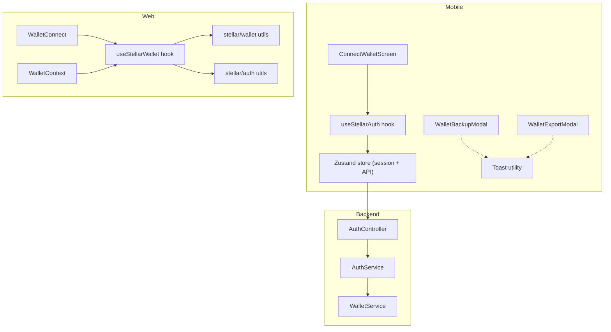
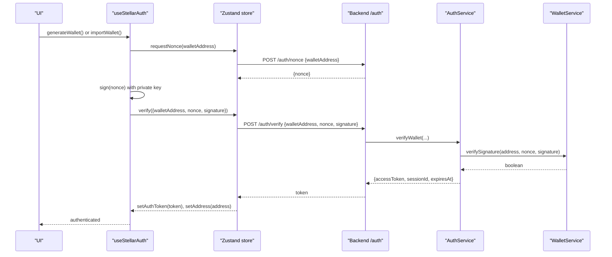
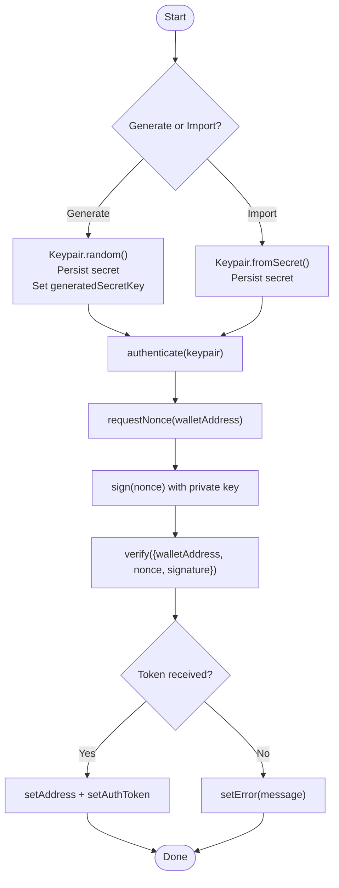
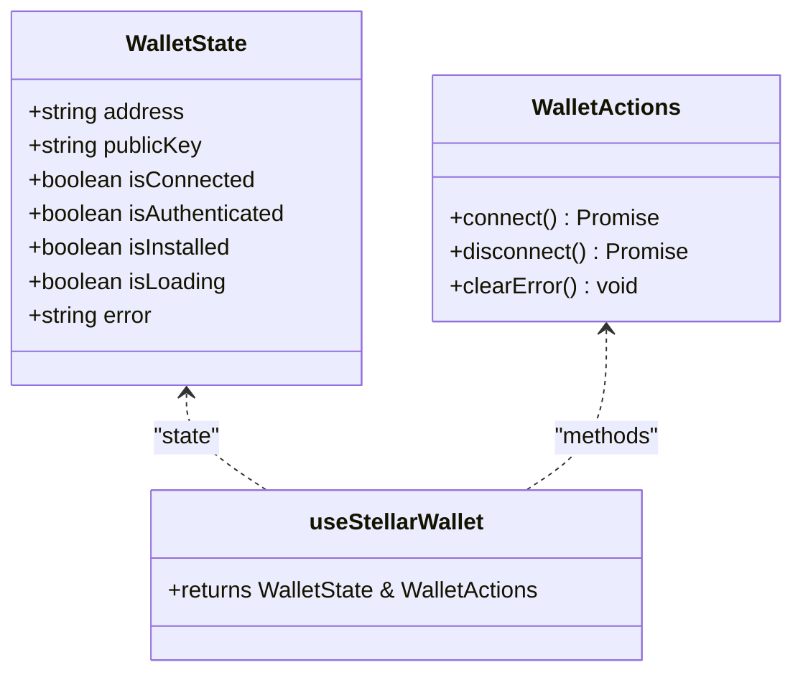
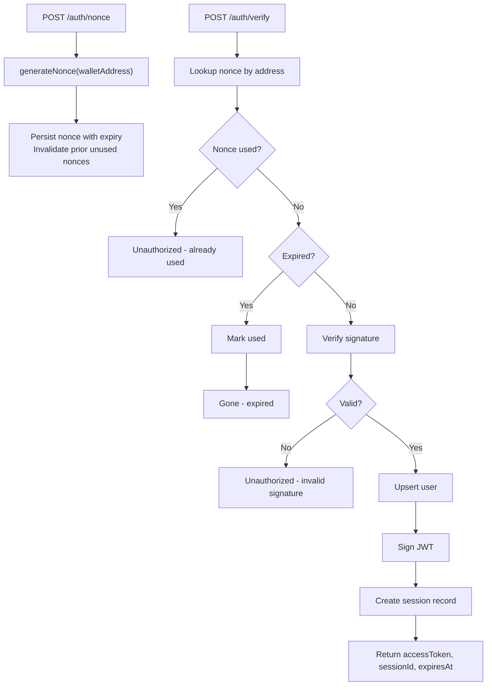
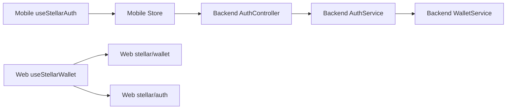

# Wallet Integration & Authentication

<cite>
**Referenced Files in This Document**
- [useStellarAuth.ts](file://veilend-mobile/src/hooks/useStellarAuth.ts)
- [store.ts](file://veilend-mobile/src/store/store.ts)
- [toast.ts](file://veilend-mobile/src/utils/toast.ts)
- [WalletBackupModal.tsx](file://veilend-mobile/src/components/WalletBackupModal.tsx)
- [WalletExportModal.tsx](file://veilend-mobile/src/components/WalletExportModal.tsx)
- [ConnectWalletScreen.tsx](file://veilend-mobile/src/screens/ConnectWalletScreen.tsx)
- [auth.service.ts](file://veilend-backend/src/auth/auth.service.ts)
- [auth.controller.ts](file://veilend-backend/src/auth/auth.controller.ts)
- [wallet.service.ts](file://veilend-backend/src/wallet/wallet.service.ts)
- [useStellarWallet.ts](file://veilend-web/src/hooks/useStellarWallet.ts)
- [WalletContext.tsx](file://veilend-web/src/context/WalletContext.tsx)
- [WalletConnect.tsx](file://veilend-web/src/components/WalletConnect.tsx)
- [wallet.ts](file://veilend-web/src/lib/stellar/wallet.ts)
- [auth.ts](file://veilend-web/src/lib/stellar/auth.ts)
- [errorReporting.ts](file://veilend-mobile/src/utils/errorReporting.ts)
</cite>

## Table of Contents
1. Introduction
2. Project Structure
3. Core Components
4. Architecture Overview
5. Detailed Component Analysis
6. Dependency Analysis
7. Performance Considerations
8. Troubleshooting Guide
9. Conclusion

## Introduction
This document explains the wallet integration and authentication across the mobile and web clients, with a focus on Stellar connectivity, cryptographic authentication, secure transaction signing, session management, backup/export flows, toast notifications, error handling, and connection status management. It provides practical examples for connecting wallets, creating and signing transactions, and recovering from errors, while highlighting security considerations such as private key protection and secure storage practices.

## Project Structure
The project implements wallet integration in two client layers:
- Mobile (React Native): In-app wallet generation/import, nonce-based sign-in to the backend, secure secret storage, backup/export UI, and toast feedback.
- Web (Next.js): Freighter browser extension integration, local auth session management, and UI components for connection and status.

**Diagram sources**
- [useStellarAuth.ts:16-71](file://veilend-mobile/src/hooks/useStellarAuth.ts#L16-L71)
- [store.ts:232-252](file://veilend-mobile/src/store/store.ts#L232-L252)
- [auth.controller.ts:20-36](file://veilend-backend/src/auth/auth.controller.ts#L20-L36)
- [auth.service.ts:36-148](file://veilend-backend/src/auth/auth.service.ts#L36-L148)
- [wallet.service.ts:5-15](file://veilend-backend/src/wallet/wallet.service.ts#L5-L15)
- [useStellarWallet.ts:23-122](file://veilend-web/src/hooks/useStellarWallet.ts#L23-L122)
- [WalletConnect.tsx:28-82](file://veilend-web/src/components/WalletConnect.tsx#L28-L82)
- [wallet.ts:69-98](file://veilend-web/src/lib/stellar/wallet.ts#L69-L98)
- [auth.ts:73-98](file://veilend-web/src/lib/stellar/auth.ts#L73-L98)

**Section sources**
- [useStellarAuth.ts:16-71](file://veilend-mobile/src/hooks/useStellarAuth.ts#L16-L71)
- [store.ts:17-41](file://veilend-mobile/src/store/store.ts#L17-L41)
- [auth.controller.ts:20-36](file://veilend-backend/src/auth/auth.controller.ts#L20-L36)
- [auth.service.ts:36-148](file://veilend-backend/src/auth/auth.service.ts#L36-L148)
- [useStellarWallet.ts:23-122](file://veilend-web/src/hooks/useStellarWallet.ts#L23-L122)
- [WalletConnect.tsx:28-82](file://veilend-web/src/components/WalletConnect.tsx#L28-L82)

## Core Components
- Mobile authentication flow: The useStellarAuth hook generates or imports a Stellar keypair, persists the secret securely, requests a server nonce, signs it locally, and verifies via the backend to obtain an access token and establish a session.
- Backend authentication: The controller exposes endpoints to request a nonce and verify a signed nonce; the service enforces one-time-use nonces, expiry checks, signature verification, and issues JWT sessions stored in the database.
- Web wallet integration: The useStellarWallet hook connects to the Freighter extension, creates a local auth session, and manages connection/disconnection state.
- Backup and export: Modal components guide users through revealing, copying, confirming, and exporting secret keys safely, with clear warnings and success feedback via toast notifications.
- Toast notifications: A cross-platform utility shows concise user feedback for success, info, and error states.

**Section sources**
- [useStellarAuth.ts:22-63](file://veilend-mobile/src/hooks/useStellarAuth.ts#L22-L63)
- [auth.controller.ts:20-36](file://veilend-backend/src/auth/auth.controller.ts#L20-L36)
- [auth.service.ts:36-148](file://veilend-backend/src/auth/auth.service.ts#L36-L148)
- [useStellarWallet.ts:54-110](file://veilend-web/src/hooks/useStellarWallet.ts#L54-L110)
- [WalletBackupModal.tsx:49-80](file://veilend-mobile/src/components/WalletBackupModal.tsx#L49-L80)
- [WalletExportModal.tsx:37-104](file://veilend-mobile/src/components/WalletExportModal.tsx#L37-L104)
- [toast.ts:5-19](file://veilend-mobile/src/utils/toast.ts#L5-L19)

## Architecture Overview
The authentication architecture uses challenge-response signing:
- Client obtains a fresh nonce from the server.
- Client signs the nonce with the private key held by the wallet or securely stored secret.
- Server verifies the signature using the public key derived from the address and issues a JWT session.

**Diagram sources**
- [useStellarAuth.ts:22-31](file://veilend-mobile/src/hooks/useStellarAuth.ts#L22-L31)
- [store.ts:232-252](file://veilend-mobile/src/store/store.ts#L232-L252)
- [auth.controller.ts:20-36](file://veilend-backend/src/auth/auth.controller.ts#L20-L36)
- [auth.service.ts:70-148](file://veilend-backend/src/auth/auth.service.ts#L70-L148)
- [wallet.service.ts:5-15](file://veilend-backend/src/wallet/wallet.service.ts#L5-L15)

## Detailed Component Analysis

### Mobile: useStellarAuth Hook
Responsibilities:
- Generate or import a Stellar keypair and persist the secret securely.
- Perform nonce-based authentication against the backend.
- Manage loading and error states and expose generated secret for backup flows.

Key behaviors:
- Secret persistence uses a secure store abstraction that prefers platform-native secure storage with a fallback shim.
- Authentication calls requestNonce and verify through the Zustand store, which handles API communication and session persistence.

**Diagram sources**
- [useStellarAuth.ts:33-63](file://veilend-mobile/src/hooks/useStellarAuth.ts#L33-L63)
- [store.ts:232-252](file://veilend-mobile/src/store/store.ts#L232-L252)

**Section sources**
- [useStellarAuth.ts:16-71](file://veilend-mobile/src/hooks/useStellarAuth.ts#L16-L71)
- [store.ts:232-252](file://veilend-mobile/src/store/store.ts#L232-L252)

### Mobile: Wallet Backup and Export
- WalletBackupModal guides users to reveal, copy, and confirm their secret key, ensuring they understand risks before proceeding. It uses toast notifications for feedback and supports multi-step confirmation.
- WalletExportModal warns about risks, offers clipboard copy or file export, and confirms successful export with toast messages.

Security notes:
- Secrets are only shown when explicitly requested.
- Copy-to-clipboard is transient; file exports include timestamps and explicit warnings.

**Section sources**
- [WalletBackupModal.tsx:49-80](file://veilend-mobile/src/components/WalletBackupModal.tsx#L49-L80)
- [WalletExportModal.tsx:37-104](file://veilend-mobile/src/components/WalletExportModal.tsx#L37-L104)
- [toast.ts:5-19](file://veilend-mobile/src/utils/toast.ts#L5-L19)

### Mobile: ConnectWalletScreen Flow
- Presents options to generate a new wallet or import an existing secret key.
- After generation, prompts for backup confirmation if required.
- Displays errors and loading states during operations.

**Section sources**
- [ConnectWalletScreen.tsx:55-66](file://veilend-mobile/src/screens/ConnectWalletScreen.tsx#L55-L66)
- [ConnectWalletScreen.tsx:125-203](file://veilend-mobile/src/screens/ConnectWalletScreen.tsx#L125-L203)

### Web: useStellarWallet Hook and Context
- Initializes wallet state by checking Freighter installation and existing auth session.
- connectFreighter retrieves the address and sets up a local auth session.
- disconnect clears local state and removes persisted session data.

**Diagram sources**
- [useStellarWallet.ts:7-21](file://veilend-web/src/hooks/useStellarWallet.ts#L7-L21)
- [useStellarWallet.ts:23-122](file://veilend-web/src/hooks/useStellarWallet.ts#L23-L122)

**Section sources**
- [useStellarWallet.ts:23-122](file://veilend-web/src/hooks/useStellarWallet.ts#L23-L122)
- [WalletContext.tsx:10-22](file://veilend-web/src/context/WalletContext.tsx#L10-L22)

### Web: WalletConnect Component
- Provides multiple display variants (default, compact, full).
- Opens a dialog to connect Freighter, shows install prompts, and handles errors with actionable messages.
- Delegates connection logic to the context’s connect method.

**Section sources**
- [WalletConnect.tsx:28-82](file://veilend-web/src/components/WalletConnect.tsx#L28-L82)
- [WalletConnect.tsx:239-373](file://veilend-web/src/components/WalletConnect.tsx#L239-L373)

### Web: Stellar Utilities (wallet.ts and auth.ts)
- wallet.ts: Detects Freighter installation, connects to get address, signs dummy transactions for message signing, and disconnects by clearing local storage.
- auth.ts: Manages local auth sessions with expiration checks, address retrieval, and validation helpers.

**Section sources**
- [wallet.ts:61-98](file://veilend-web/src/lib/stellar/wallet.ts#L61-L98)
- [wallet.ts:129-191](file://veilend-web/src/lib/stellar/wallet.ts#L129-L191)
- [auth.ts:31-98](file://veilend-web/src/lib/stellar/auth.ts#L31-L98)

### Backend: Authentication Service and Controller
- Controller exposes /auth/nonce and /auth/verify endpoints.
- Service enforces nonce lifecycle (generation, invalidation of prior nonces, expiry checks), signature verification, JWT issuance, and session creation.
- Validates sessions and supports logout by revoking sessions.

**Diagram sources**
- [auth.controller.ts:20-36](file://veilend-backend/src/auth/auth.controller.ts#L20-L36)
- [auth.service.ts:36-148](file://veilend-backend/src/auth/auth.service.ts#L36-L148)

**Section sources**
- [auth.controller.ts:20-36](file://veilend-backend/src/auth/auth.controller.ts#L20-L36)
- [auth.service.ts:36-148](file://veilend-backend/src/auth/auth.service.ts#L36-L148)
- [wallet.service.ts:5-15](file://veilend-backend/src/wallet/wallet.service.ts#L5-L15)

## Dependency Analysis
- Mobile client depends on:
  - Secure storage abstraction for secrets and tokens.
  - Zustand store for API calls and session state.
  - Toast utility for user feedback.
  - Modal components for backup/export workflows.
- Web client depends on:
  - Freighter extension APIs for connection and signing.
  - Local storage for auth sessions.
  - React context for sharing wallet state across components.
- Backend depends on:
  - Database for nonces, sessions, and user records.
  - JWT service for issuing tokens.
  - Stellar SDK for signature verification.

**Diagram sources**
- [store.ts:232-252](file://veilend-mobile/src/store/store.ts#L232-L252)
- [auth.controller.ts:20-36](file://veilend-backend/src/auth/auth.controller.ts#L20-L36)
- [auth.service.ts:36-148](file://veilend-backend/src/auth/auth.service.ts#L36-L148)
- [useStellarWallet.ts:54-110](file://veilend-web/src/hooks/useStellarWallet.ts#L54-L110)
- [wallet.ts:69-98](file://veilend-web/src/lib/stellar/wallet.ts#L69-L98)
- [auth.ts:73-98](file://veilend-web/src/lib/stellar/auth.ts#L73-L98)

**Section sources**
- [store.ts:232-252](file://veilend-mobile/src/store/store.ts#L232-L252)
- [auth.controller.ts:20-36](file://veilend-backend/src/auth/auth.controller.ts#L20-L36)
- [useStellarWallet.ts:54-110](file://veilend-web/src/hooks/useStellarWallet.ts#L54-L110)

## Performance Considerations
- Nonce TTL limits replay attacks and reduces server load; ensure clients refresh nonces promptly.
- Avoid redundant network calls by caching addresses and connection status in memory until reconnection.
- Use lightweight toast notifications instead of heavy modals for quick feedback.
- Persist minimal sensitive data; prefer secure storage for secrets and short-lived tokens.

[No sources needed since this section provides general guidance]

## Troubleshooting Guide
Common issues and recovery patterns:
- Freighter not installed or locked:
  - Web UI displays install prompts and retry actions; ensure the extension is unlocked before connecting.
- Invalid or expired nonce:
  - Request a fresh nonce and retry signing; server marks expired nonces as used to prevent reuse.
- Signature verification failure:
  - Confirm the correct private key was used and the nonce matches the one returned by the server.
- Session expired or revoked:
  - Re-authenticate by requesting a new nonce and verifying; logout clears server-side sessions.

Error reporting:
- Mobile includes structured error reporting with PII scrubbing and persistent ring buffer for debugging.

**Section sources**
- [WalletConnect.tsx:293-355](file://veilend-web/src/components/WalletConnect.tsx#L293-L355)
- [auth.service.ts:70-148](file://veilend-backend/src/auth/auth.service.ts#L70-L148)
- [errorReporting.ts:147-211](file://veilend-mobile/src/utils/errorReporting.ts#L147-L211)

## Conclusion
The system implements robust Stellar wallet integration across mobile and web platforms with secure authentication, session management, and user-friendly backup/export flows. The backend enforces strict nonce policies and signature verification, while clients provide clear feedback and error handling. Adhering to the recommended security practices ensures safe handling of private keys and tokens throughout the application lifecycle.

[No sources needed since this section summarizes without analyzing specific files]