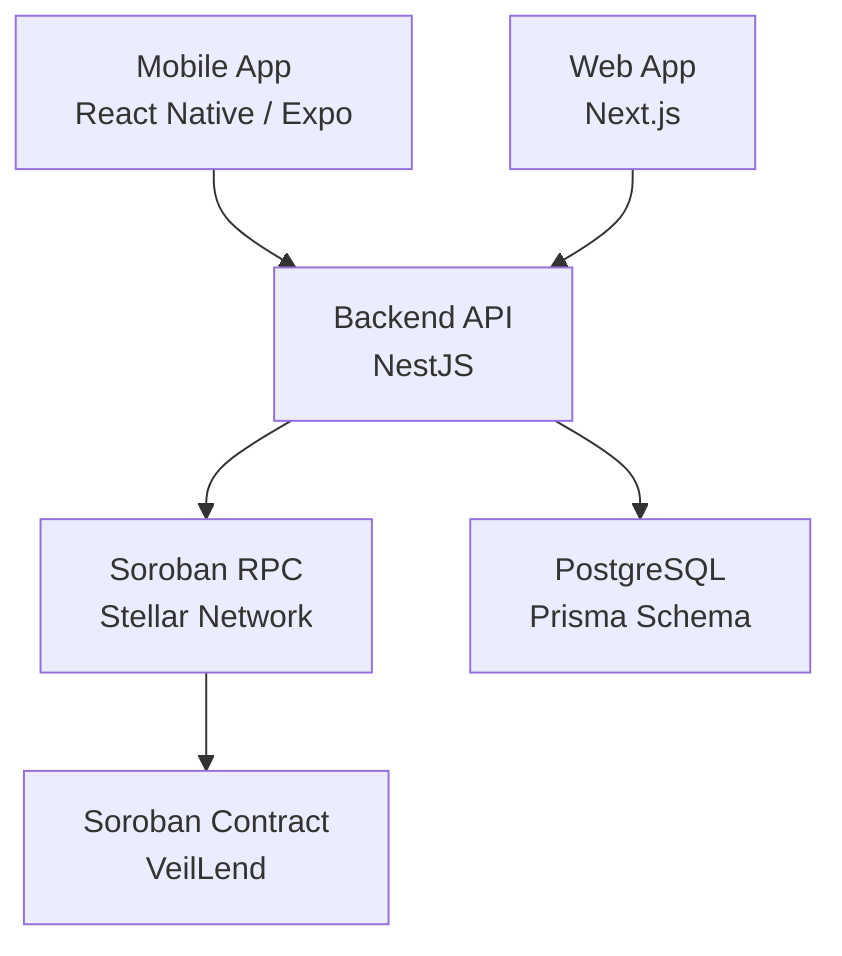
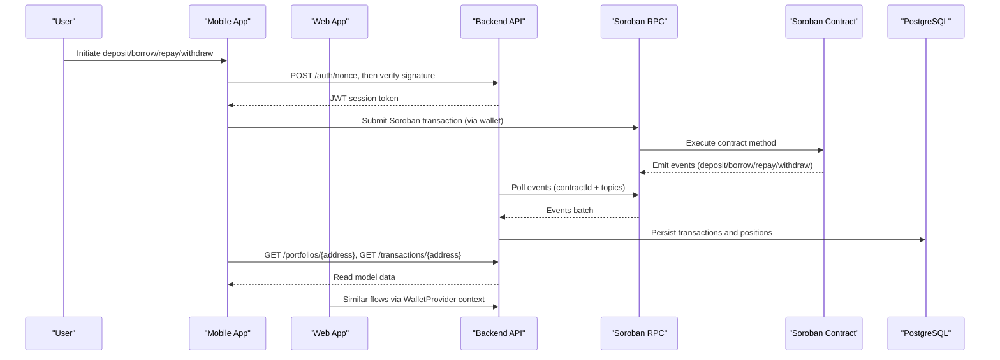
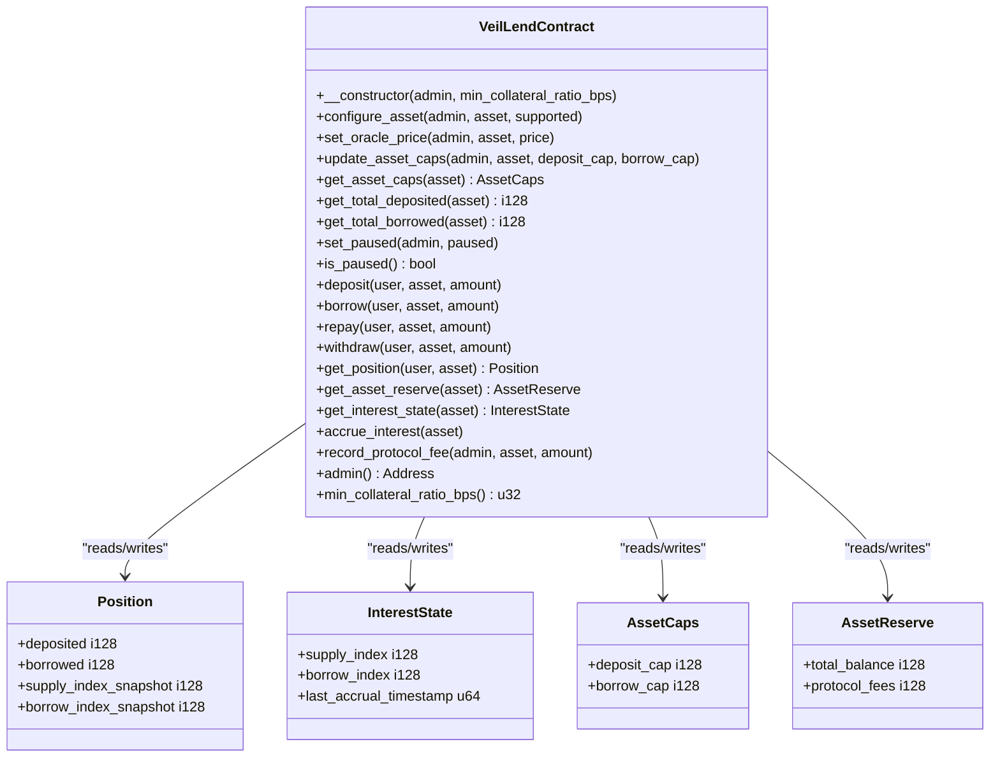
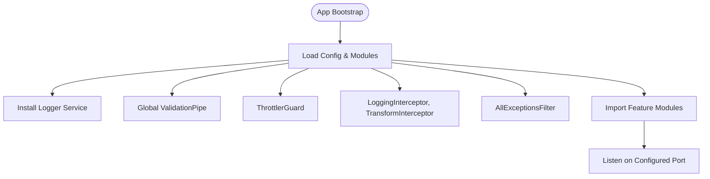
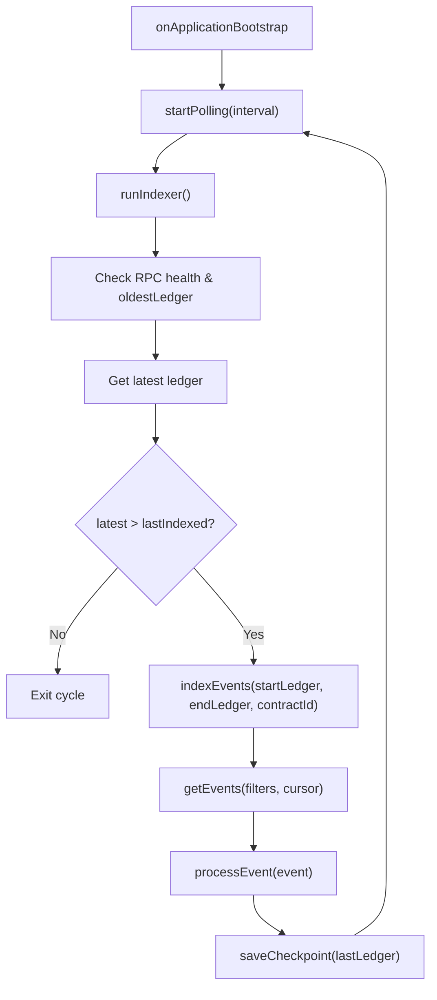
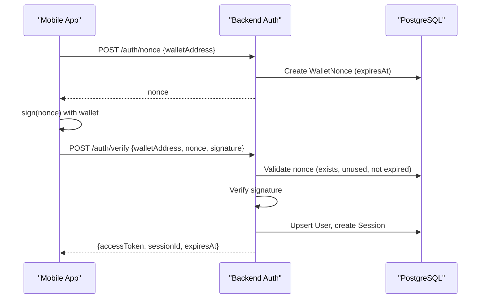
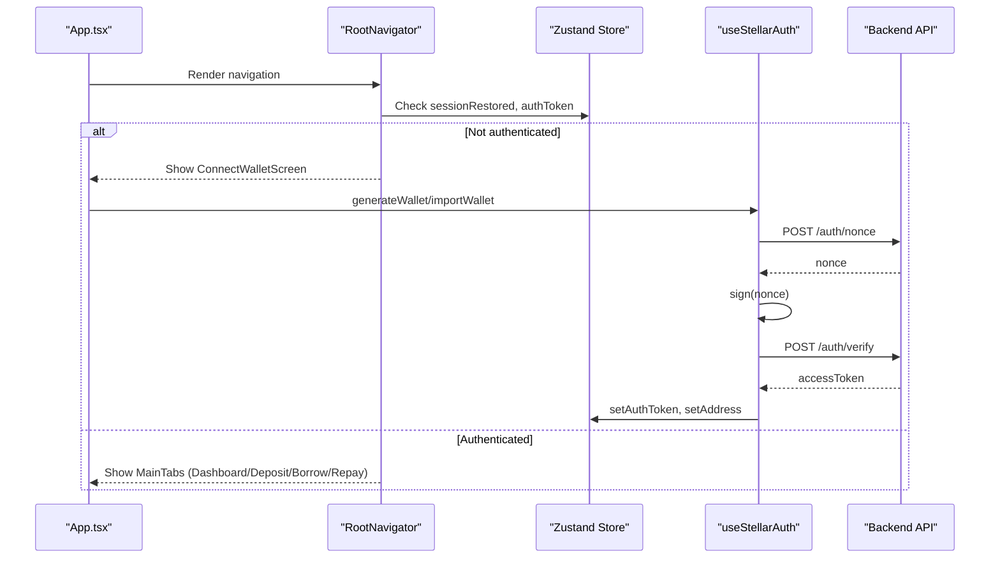
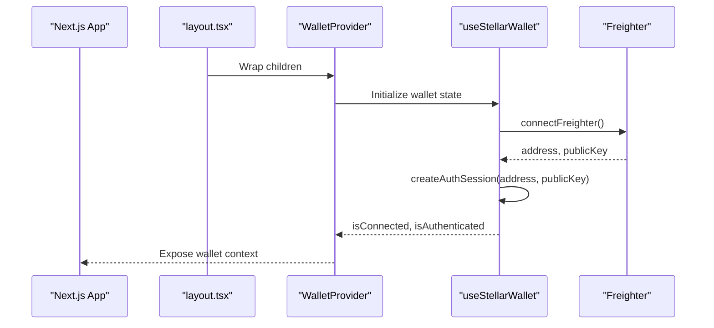
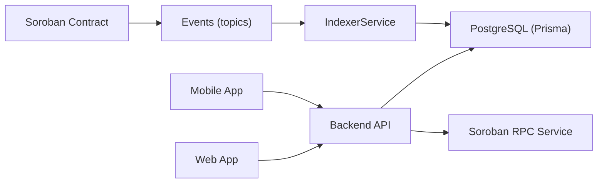

# Architecture Overview

<cite>
**Referenced Files in This Document**
- [README.md](file://README.md)
- [lib.rs](file://veilend-soroban/src/lib.rs)
- [main.ts](file://veilend-backend/src/main.ts)
- [app.module.ts](file://veilend-backend/src/app.module.ts)
- [indexer.service.ts](file://veilend-backend/src/indexer/indexer.service.ts)
- [soroban-rpc.service.ts](file://veilend-backend/src/stellar/soroban-rpc.service.ts)
- [schema.prisma](file://veilend-backend/prisma/schema.prisma)
- [auth.service.ts](file://veilend-backend/src/auth/auth.service.ts)
- [App.tsx](file://veilend-mobile/App.tsx)
- [navigation/index.tsx](file://veilend-mobile/src/navigation/index.tsx)
- [useStellarAuth.ts](file://veilend-mobile/src/hooks/useStellarAuth.ts)
- [store.ts](file://veilend-mobile/src/store/store.ts)
- [layout.tsx](file://veilend-web/src/app/layout.tsx)
- [WalletContext.tsx](file://veilend-web/src/context/WalletContext.tsx)
- [useStellarWallet.ts](file://veilend-web/src/hooks/useStellarWallet.ts)
</cite>

## Table of Contents
1. Introduction
2. Project Structure
3. Core Components
4. Architecture Overview
5. Detailed Component Analysis
6. Dependency Analysis
7. Performance Considerations
8. Troubleshooting Guide
9. Conclusion

## Introduction
VeilLend is a privacy-first decentralized lending protocol on Stellar/Soroban with mobile and web frontends and a backend that indexes on-chain events into a read model for fast UI queries. The system emphasizes self-custody, sub-second settlements, near-zero fees, and multi-chain support. Privacy is designed around X-Ray ZK proofs, with the current contract foundation exposing deposit/borrow/repay/withdraw state transitions and event emission for off-chain indexing.

## Project Structure
The repository organizes active code across four main workspaces:
- Smart contracts: Rust/Soroban (veilend-soroban)
- Mobile app: React Native/Expo (veilend-mobile)
- Web app: Next.js (veilend-web)
- Backend API: NestJS (veilend-backend), with an archived legacy version under legacy/veilend-backend

**Diagram sources**
- [lib.rs:226-719](file://veilend-soroban/src/lib.rs#L226-L719)
- [app.module.ts:28-60](file://veilend-backend/src/app.module.ts#L28-L60)
- [schema.prisma:1-197](file://veilend-backend/prisma/schema.prisma#L1-L197)

**Section sources**
- [README.md:17-39](file://README.md#L17-L39)

## Core Components
- Soroban smart contract: Implements VeilLendContract with admin controls, asset configuration, oracle prices, caps, circuit breaker, interest accrual, and events for deposit/borrow/repay/withdraw.
- Backend API: NestJS application bootstrapped with validation, logging, throttling, and modules for auth, indexer, stellar integration, assets, transactions, portfolios, and protocol config.
- Indexer: Polls Soroban events by contract ID and topics, persists transactions and positions, and maintains checkpoints to resume indexing safely.
- Mobile app: Root app with navigation, session restoration from secure storage, wallet-based authentication via nonce/signature, and portfolio/transaction fetching through backend APIs.
- Web app: Next.js root layout providing a WalletProvider context wrapping the app, enabling wallet connection and authentication flows.

**Section sources**
- [lib.rs:226-719](file://veilend-soroban/src/lib.rs#L226-L719)
- [main.ts:7-21](file://veilend-backend/src/main.ts#L7-L21)
- [app.module.ts:28-84](file://veilend-backend/src/app.module.ts#L28-L84)
- [indexer.service.ts:17-314](file://veilend-backend/src/indexer/indexer.service.ts#L17-L314)
- [App.tsx:14-38](file://veilend-mobile/App.tsx#L14-L38)
- [navigation/index.tsx:56-87](file://veilend-mobile/src/navigation/index.tsx#L56-L87)
- [layout.tsx:25-39](file://veilend-web/src/app/layout.tsx#L25-L39)

## Architecture Overview
High-level data flow:
- User actions in mobile/web trigger wallet signatures and call backend endpoints.
- Backend validates sessions, interacts with Stellar via Soroban RPC, and emits or reads contract calls.
- On-chain contract updates emit events; the indexer polls these events and writes to PostgreSQL read models.
- Frontends consume backend APIs to display balances, positions, and transaction history.

**Diagram sources**
- [useStellarAuth.ts:22-31](file://veilend-mobile/src/hooks/useStellarAuth.ts#L22-L31)
- [store.ts:233-252](file://veilend-mobile/src/store/store.ts#L233-L252)
- [indexer.service.ts:48-171](file://veilend-backend/src/indexer/indexer.service.ts#L48-L171)
- [lib.rs:147-224](file://veilend-soroban/src/lib.rs#L147-L224)
- [schema.prisma:123-154](file://veilend-backend/prisma/schema.prisma#L123-L154)

## Detailed Component Analysis

### Soroban Smart Contract (VeilLendContract)
Responsibilities:
- Admin-only configuration: asset support, oracle price, caps, pause/unpause.
- User operations: deposit, borrow, repay, withdraw with collateral checks and interest accrual.
- Event emission: typed events for asset configuration, deposits, borrows, repayments, withdrawals, caps updates, circuit breaker, and reserve updates.
- Interest accrual: time-based indexes per asset; positions realize accrued interest on interaction.

Key data structures:
- Position: deposited, borrowed, supply/borrow index snapshots.
- InterestState: supply_index, borrow_index, last_accrual_timestamp.
- AssetCaps: deposit_cap, borrow_cap (-1 unlimited).
- AssetReserve: total_balance, protocol_fees.

Error handling:
- Typed errors via VeilLendError covering initialization, authorization, amounts, collateral, caps, and pause states.

**Diagram sources**
- [lib.rs:226-719](file://veilend-soroban/src/lib.rs#L226-L719)

**Section sources**
- [lib.rs:107-145](file://veilend-soroban/src/lib.rs#L107-L145)
- [lib.rs:147-224](file://veilend-soroban/src/lib.rs#L147-L224)
- [lib.rs:242-331](file://veilend-soroban/src/lib.rs#L242-L331)
- [lib.rs:356-420](file://veilend-soroban/src/lib.rs#L356-L420)
- [lib.rs:450-479](file://veilend-soroban/src/lib.rs#L450-L479)
- [lib.rs:483-639](file://veilend-soroban/src/lib.rs#L483-L639)
- [lib.rs:641-719](file://veilend-soroban/src/lib.rs#L641-L719)

### Backend API (NestJS)
Bootstrap and cross-cutting concerns:
- ValidationPipe globally whitelists and transforms DTOs.
- LoggingInterceptor and AllExceptionsFilter centralize logging and error handling.
- ThrottlerGuard protects endpoints against abuse.
- ClsModule provides correlation IDs across request lifecycle.

Modules:
- AuthModule: nonce generation, signature verification, JWT session creation/validation.
- IndexerModule: background polling loop over Soroban events, checkpointing, and position updates.
- StellarModule: Soroban RPC client health checks and safe accessors.
- Assets, Transactions, Portfolios, Protocol, Admin: domain-specific controllers/services.

**Diagram sources**
- [main.ts:7-21](file://veilend-backend/src/main.ts#L7-L21)
- [app.module.ts:28-84](file://veilend-backend/src/app.module.ts#L28-L84)

**Section sources**
- [main.ts:7-21](file://veilend-backend/src/main.ts#L7-L21)
- [app.module.ts:28-84](file://veilend-backend/src/app.module.ts#L28-L84)

### Indexer Service
Behavior:
- Starts a polling loop at configured interval.
- Fetches events filtered by contract ID and topic prefix "veillend".
- Processes events to persist transactions and update user positions.
- Maintains a global checkpoint to resume indexing after restarts or RPC retention changes.

**Diagram sources**
- [indexer.service.ts:17-314](file://veilend-backend/src/indexer/indexer.service.ts#L17-L314)

**Section sources**
- [indexer.service.ts:48-171](file://veilend-backend/src/indexer/indexer.service.ts#L48-L171)
- [indexer.service.ts:173-294](file://veilend-backend/src/indexer/indexer.service.ts#L173-L294)

### Authentication Flow (Wallet-Based)
Flow:
- Mobile requests a nonce from backend.
- Client signs the nonce with wallet private key.
- Backend verifies signature, marks nonce used, creates/upserts user, issues JWT, and stores session.

**Diagram sources**
- [useStellarAuth.ts:22-31](file://veilend-mobile/src/hooks/useStellarAuth.ts#L22-L31)
- [auth.service.ts:36-149](file://veilend-backend/src/auth/auth.service.ts#L36-L149)
- [schema.prisma:12-42](file://veilend-backend/prisma/schema.prisma#L12-L42)

**Section sources**
- [auth.service.ts:36-149](file://veilend-backend/src/auth/auth.service.ts#L36-L149)
- [auth.service.ts:156-201](file://veilend-backend/src/auth/auth.service.ts#L156-L201)
- [schema.prisma:12-42](file://veilend-backend/prisma/schema.prisma#L12-L42)

### Mobile Application
Features:
- Root app wraps navigation, error boundary, loading overlay, and toast notifications.
- Navigation guards based on session restoration and auth token to show ConnectWallet or Main tabs.
- useStellarAuth hook handles wallet generation/import, nonce signing, and backend verification.
- Zustand store manages auth, UI preferences, portfolio, and transactions, with persistence via SecureStore.

**Diagram sources**
- [App.tsx:14-38](file://veilend-mobile/App.tsx#L14-L38)
- [navigation/index.tsx:56-87](file://veilend-mobile/src/navigation/index.tsx#L56-L87)
- [useStellarAuth.ts:22-31](file://veilend-mobile/src/hooks/useStellarAuth.ts#L22-L31)
- [store.ts:233-252](file://veilend-mobile/src/store/store.ts#L233-L252)

**Section sources**
- [App.tsx:14-38](file://veilend-mobile/App.tsx#L14-L38)
- [navigation/index.tsx:56-87](file://veilend-mobile/src/navigation/index.tsx#L56-L87)
- [useStellarAuth.ts:22-31](file://veilend-mobile/src/hooks/useStellarAuth.ts#L22-L31)
- [store.ts:99-397](file://veilend-mobile/src/store/store.ts#L99-L397)

### Web Application
Features:
- Root layout provides WalletProvider context for wallet state and actions.
- useStellarWallet hook manages Freighter wallet connection, authentication session, and disconnect.

**Diagram sources**
- [layout.tsx:25-39](file://veilend-web/src/app/layout.tsx#L25-L39)
- [WalletContext.tsx:10-22](file://veilend-web/src/context/WalletContext.tsx#L10-L22)
- [useStellarWallet.ts:23-88](file://veilend-web/src/hooks/useStellarWallet.ts#L23-L88)

**Section sources**
- [layout.tsx:25-39](file://veilend-web/src/app/layout.tsx#L25-L39)
- [WalletContext.tsx:10-22](file://veilend-web/src/context/WalletContext.tsx#L10-L22)
- [useStellarWallet.ts:23-122](file://veilend-web/src/hooks/useStellarWallet.ts#L23-L122)

## Dependency Analysis
Component coupling and cohesion:
- Soroban contract exposes stable interfaces and events consumed by the indexer.
- Indexer depends on Soroban RPC service and Prisma schema for persistence.
- Mobile and web apps depend on backend APIs for authentication and read models.
- Backend modules are loosely coupled via NestJS dependency injection and module boundaries.

**Diagram sources**
- [lib.rs:147-224](file://veilend-soroban/src/lib.rs#L147-L224)
- [indexer.service.ts:48-171](file://veilend-backend/src/indexer/indexer.service.ts#L48-L171)
- [schema.prisma:123-154](file://veilend-backend/prisma/schema.prisma#L123-L154)
- [soroban-rpc.service.ts:17-46](file://veilend-backend/src/stellar/soroban-rpc.service.ts#L17-L46)

**Section sources**
- [app.module.ts:28-84](file://veilend-backend/src/app.module.ts#L28-L84)
- [indexer.service.ts:17-314](file://veilend-backend/src/indexer/indexer.service.ts#L17-L314)

## Performance Considerations
- Indexer pagination and cursors prevent large event fetches and ensure resumability.
- RPC health checks guard against stale ledgers and network issues.
- Global validation and throttling reduce payload overhead and protect endpoints.
- Interest accrual is computed lazily per operation to minimize unnecessary writes.
- Read models in PostgreSQL enable fast portfolio and transaction queries for UIs.

[No sources needed since this section provides general guidance]

## Troubleshooting Guide
Common issues and mitigations:
- RPC connectivity: Use SorobanRpcService health checks and last error details to diagnose connection problems.
- Indexer stalls: Check checkpoint persistence and RPC retention window; force replay if necessary.
- Authentication failures: Ensure nonces are fresh, signatures valid, and sessions not expired; revoke sessions on logout.
- Contract errors: Map VeilLendError codes to client-side messages for clear feedback.

**Section sources**
- [soroban-rpc.service.ts:48-124](file://veilend-backend/src/stellar/soroban-rpc.service.ts#L48-L124)
- [indexer.service.ts:74-105](file://veilend-backend/src/indexer/indexer.service.ts#L74-L105)
- [auth.service.ts:70-149](file://veilend-backend/src/auth/auth.service.ts#L70-L149)
- [lib.rs:107-145](file://veilend-soroban/src/lib.rs#L107-L145)

## Conclusion
VeilLend’s architecture combines a robust Soroban contract with a resilient backend indexer and modern frontends to deliver a privacy-first, self-custodial lending experience. The design emphasizes clear separation of concerns, event-driven synchronization, and strong security via wallet-based authentication. Future enhancements include deeper X-Ray ZK proof integration and expanded multi-chain capabilities while maintaining performance and reliability.

[No sources needed since this section summarizes without analyzing specific files]