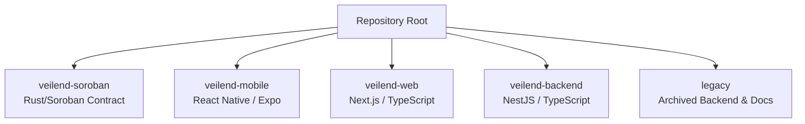
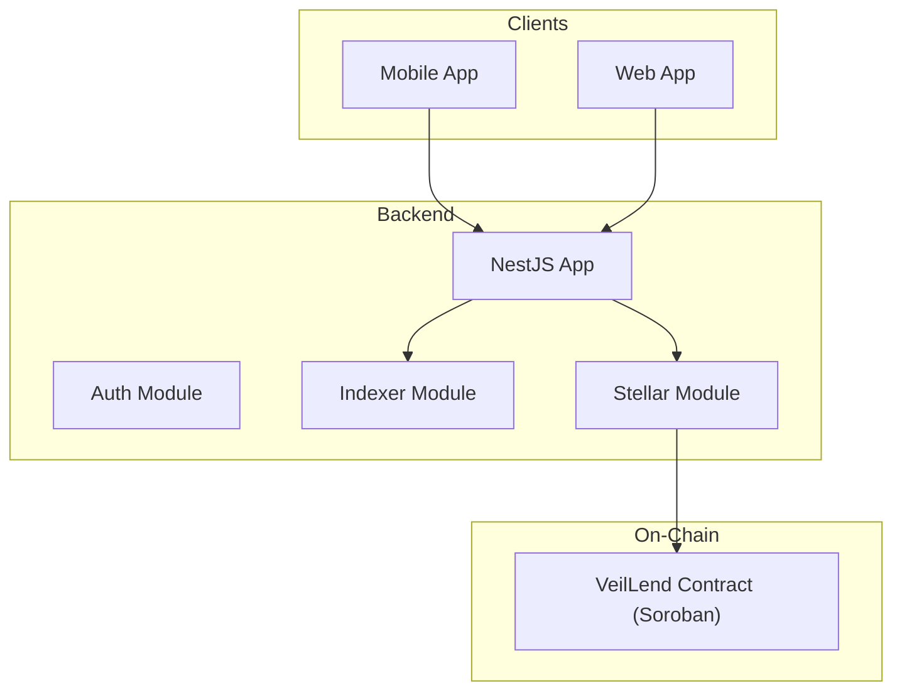
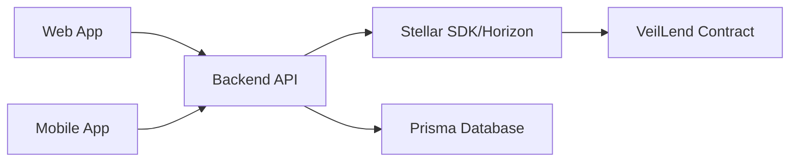

# Contributing Guidelines

<cite>
**Referenced Files in This Document**
- [README.md](file://README.md)
- [CONTRIBUTING_SOROBAN.md](file://legacy/docs/CONTRIBUTING_SOROBAN.md)
- [pull_request_template.md](file://.github/pull_request_template.md)
- [soroban-ci.yml](file://.github/workflows/soroban-ci.yml)
- [web-ci.yml](file://.github/workflows/web-ci.yml)
- [mobile-ci.yml](file://.github/workflows/mobile-ci.yml)
- [veilend-backend.yml](file://.github/workflows/veilend-backend.yml)
- [Cargo.toml](file://veilend-soroban/Cargo.toml)
- [lib.rs](file://veilend-soroban/src/lib.rs)
- [package.json (backend)](file://veilend-backend/package.json)
- [app.module.ts](file://veilend-backend/src/app.module.ts)
- [package.json (web)](file://veilend-web/package.json)
- [layout.tsx](file://veilend-web/src/app/layout.tsx)
- [package.json (mobile)](file://veilend-mobile/package.json)
- [App.tsx](file://veilend-mobile/App.tsx)
</cite>

## Table of Contents
1. Introduction
2. Project Structure
3. Core Components
4. Architecture Overview
5. Detailed Component Analysis
6. Dependency Analysis
7. Performance Considerations
8. Troubleshooting Guide
9. Conclusion
10. Appendices

## Introduction
This document provides comprehensive contributing guidelines for the VeilLend protocol. It covers development workflow, branch and commit conventions, pull request processes, code quality standards for Rust smart contracts and TypeScript applications, testing requirements across components, review expectations, CI/CD pipeline gates, deployment procedures, documentation practices, backward compatibility, security considerations, and examples of good contribution practices and common pitfalls.

VeilLend is a privacy-first decentralized lending protocol on Stellar/Soroban with a mobile app (React Native/Expo), a web app (Next.js), and a backend API (NestJS). The repository includes active workspaces for Soroban contracts, mobile, web, and backend, plus archived legacy materials.

## Project Structure
The repository is organized into distinct workspaces:
- veilend-soroban: Active Soroban Rust contract workspace
- veilend-mobile: React Native/Expo mobile app
- veilend-web: Next.js 16 web application
- veilend-backend: NestJS backend (current rebuild; previous version archived under legacy)
- legacy: Archived backend and research docs

**Section sources**
- [README.md:17-39](file://README.md#L17-L39)

## Core Components
- Smart Contracts (Soroban/Rust): Implements lending state, asset configuration, positions, oracle-backed collateral valuation, interest accrual, caps, circuit breaker, and events.
- Mobile App: Wallet-driven onboarding, deposit/borrow/repay flows, privacy mode, protocol status banners, and error reporting.
- Web App: Privacy-first interface using Next.js App Router, Tailwind CSS, and full TypeScript support.
- Backend API: NestJS-based services for authentication, indexing, protocol queries, assets, transactions, admin operations, and Stellar integration.

Key entry points:
- Soroban contract entrypoint and types are defined in the contract library.
- Backend module wires controllers, guards, interceptors, and modules.
- Web root layout sets up fonts and wallet context provider.
- Mobile app bootstraps navigation, error boundary, and global crash instrumentation.

**Section sources**
- [lib.rs:226-719](file://veilend-soroban/src/lib.rs#L226-L719)
- [app.module.ts:28-83](file://veilend-backend/src/app.module.ts#L28-L83)
- [layout.tsx:25-38](file://veilend-web/src/app/layout.tsx#L25-L38)
- [App.tsx:14-37](file://veilend-mobile/App.tsx#L14-L37)

## Architecture Overview
High-level component interactions:
- Clients (Mobile/Web) interact with the Backend API for user sessions, portfolio data, and transaction orchestration.
- The Backend integrates with Stellar/Horizon and the Soroban RPC to read/write contract state and index events.
- The Soroban contract enforces business rules, manages positions, reserves, oracle prices, caps, and emits events for indexing.

**Diagram sources**
- [app.module.ts:28-83](file://veilend-backend/src/app.module.ts#L28-L83)
- [lib.rs:226-719](file://veilend-soroban/src/lib.rs#L226-L719)

## Detailed Component Analysis

### Development Workflow and Branching
- Fork the repository and create feature branches from main.
- Use descriptive branch names such as feature/add-oracle-price or fix/circuit-breaker-pause.
- Keep changes scoped to a single concern per PR.
- Reference related issues in commits and PR descriptions.

Recommended flow:
1. Create branch: git checkout -b feature/descriptive-name
2. Implement changes and tests
3. Run local checks (lint, format, type-check, tests)
4. Commit with clear messages (e.g., feat: add borrow cap enforcement)
5. Push and open a PR against main

**Section sources**
- [README.md:203-214](file://README.md#L203-L214)

### Commit Conventions
- Use conventional commit prefixes: feat, fix, chore, docs, refactor, test, perf.
- Keep commits atomic and self-contained.
- Include scope where helpful (e.g., feat(soroban): add deposit cap validation).
- Reference issues via keywords (e.g., Closes #123).

**Section sources**
- [README.md:203-214](file://README.md#L203-L214)

### Pull Request Process
- Use the provided PR template to summarize scope, validation steps, and security considerations.
- Ensure all relevant checks pass in CI before requesting review.
- Link related issues and include screenshots or logs when applicable.
- Address reviewer feedback promptly and keep PRs small and focused.

Validation checklist items include adding/updating tests, running relevant local commands, and updating documentation where behavior changed. Security checklist includes preserving access controls, not logging secrets, and avoiding private details in errors.

**Section sources**
- [pull_request_template.md:1-33](file://.github/pull_request_template.md#L1-L33)

### Code Quality Standards

#### Rust (Soroban Smart Contracts)
- Formatting: cargo fmt --all -- --check
- Linting: cargo clippy --locked --all-targets -- -D warnings
- Tests: cargo test --locked --target x86_64-unknown-linux-gnu
- Build WASM: cargo build --locked --target wasm32-unknown-unknown --release
- Contract artifact: stellar contract build

Contract specifics:
- Errors are typed via VeilLendError with unique u32 codes for client matching.
- Storage schema versions and IDs are tracked to ensure migration safety.
- Admin-only functions enforce authorization and require auth signatures.
- Interest accrual is time-based and idempotent; callers must accrue before mutating balances.

**Section sources**
- [soroban-ci.yml:32-70](file://.github/workflows/soroban-ci.yml#L32-L70)
- [Cargo.toml:1-15](file://veilend-soroban/Cargo.toml#L1-L15)
- [lib.rs:10-17](file://veilend-soroban/src/lib.rs#L10-L17)
- [lib.rs:107-145](file://veilend-soroban/src/lib.rs#L107-L145)
- [lib.rs:782-800](file://veilend-soroban/src/lib.rs#L782-L800)

#### TypeScript (Backend and Web)
- Backend:
  - Lint: npm run lint
  - Build: npm run build
  - Test: npm run test
  - Type check: configured via tsconfig and CI
- Web:
  - Lint: npm run lint
  - Type check: npm run type-check
  - Build: npm run build
  - Test: npm run test (Vitest)

Mobile:
- Type check: npx tsc --noEmit
- Validate Expo config: expo config --type public
- Doctor: npm run doctor

**Section sources**
- [veilend-backend.yml:1-44](file://.github/workflows/veilend-backend.yml#L1-L44)
- [web-ci.yml:25-53](file://.github/workflows/web-ci.yml#L25-L53)
- [mobile-ci.yml:25-57](file://.github/workflows/mobile-ci.yml#L25-L57)
- [package.json (backend):8-23](file://veilend-backend/package.json#L8-L23)
- [package.json (web):5-12](file://veilend-web/package.json#L5-L12)
- [package.json (mobile):5-12](file://veilend-mobile/package.json#L5-L12)

### Testing Requirements
- Soroban:
  - Unit and integration tests via cargo test
  - Snapshot tests under test_snapshots for deterministic outputs
  - Build and deploy locally with stellar CLI for end-to-end verification
- Backend:
  - Jest unit tests and e2e tests
  - Coverage collection configured in package.json
- Web:
  - Vitest unit tests
- Mobile:
  - tsx-based tests for utilities/hooks

Guidelines:
- Add or update tests for any behavioral changes.
- Prefer deterministic tests; avoid flaky network calls by mocking external services.
- For contract changes, include snapshot updates if storage or event shapes change.

**Section sources**
- [package.json (backend):78-91](file://veilend-backend/package.json#L78-L91)
- [package.json (web):28-41](file://veilend-web/package.json#L28-L41)
- [package.json (mobile):47-55](file://veilend-mobile/package.json#L47-L55)
- [lib.rs:147-224](file://veilend-soroban/src/lib.rs#L147-L224)

### Review Process
- Automated checks must pass:
  - Soroban: formatting, clippy, tests, WASM build, contract artifact
  - Web: type-check, lint, build
  - Mobile: type-check, Expo config validation, doctor
  - Backend: lint, build, test
- Manual review focuses on:
  - Correctness and safety of contract logic
  - Backward compatibility of storage schema and interfaces
  - Security implications (auth, caps, oracle usage, pause behavior)
  - Test coverage and clarity
  - Documentation updates

**Section sources**
- [soroban-ci.yml:25-70](file://.github/workflows/soroban-ci.yml#L25-L70)
- [web-ci.yml:25-53](file://.github/workflows/web-ci.yml#L25-L53)
- [mobile-ci.yml:25-57](file://.github/workflows/mobile-ci.yml#L25-L57)
- [veilend-backend.yml:11-43](file://.github/workflows/veilend-backend.yml#L11-L43)

### Deployment Procedures
- Contracts:
  - Build release WASM and generate contract artifacts using stellar CLI
  - Deploy to testnet/mainnet using appropriate networks and keys
  - Verify on Stellar explorer post-deployment
- Web:
  - Build artifacts via Next.js; deploy through Vercel (project configuration present)
- Mobile:
  - Use Expo CLI for OTA updates or store builds
- Backend:
  - Build and run via NestJS; containerized deployment supported (Dockerfile present)

Note: Ensure environment variables and secrets are managed securely and not committed.

**Section sources**
- [README.md:196-201](file://README.md#L196-L201)
- [soroban-ci.yml:61-70](file://.github/workflows/soroban-ci.yml#L61-L70)
- [web-ci.yml:46-53](file://.github/workflows/web-ci.yml#L46-L53)
- [mobile-ci.yml:50-57](file://.github/workflows/mobile-ci.yml#L50-L57)

### Writing Tests
- Soroban:
  - Use soroban-sdk testutils for mock environments
  - Cover edge cases: zero/negative amounts, unauthorized access, paused state, caps, oracle price missing
  - Update snapshots when event or storage output changes
- Backend:
  - Unit tests for services and DTOs; e2e tests for endpoints
  - Mock Stellar SDK and Horizon responses
- Web/Mobile:
  - Unit tests for hooks, utils, and UI components
  - Mock wallet interactions and network calls

**Section sources**
- [CONTRIBUTING_SOROBAN.md:437-549](file://legacy/docs/CONTRIBUTING_SOROBAN.md#L437-L549)
- [package.json (backend):78-91](file://veilend-backend/package.json#L78-L91)
- [package.json (web):28-41](file://veilend-web/package.json#L28-L41)
- [package.json (mobile):47-55](file://veilend-mobile/package.json#L47-L55)

### Documentation Practices
- Update README sections when architecture or workflows change.
- Document new contract interfaces, errors, and events for integrators.
- Provide migration notes for storage schema changes.
- Keep contributor guides aligned with current toolchains and scripts.

**Section sources**
- [README.md:17-39](file://README.md#L17-L39)
- [README.md:62-85](file://README.md#L62-L85)
- [lib.rs:10-17](file://veilend-soroban/src/lib.rs#L10-L17)

### Backward Compatibility
- Increment CONTRACT_VERSION only when interface changes require consumer adaptation.
- Increment STORAGE_SCHEMA_VERSION only when serialized DataKey or value layout changes.
- Use STORAGE_SCHEMA_ID to identify storage layout for migrations.
- Validate that clients can handle optional fields and defaults gracefully.

**Section sources**
- [lib.rs:10-17](file://veilend-soroban/src/lib.rs#L10-L17)

### Security Considerations
- Smart Contract:
  - Enforce admin authorization on privileged functions
  - Validate amounts (zero vs negative) and use distinct error variants
  - Require oracle prices before borrowing/withdrawing
  - Respect pause state; allow repay/withdraw even when paused
  - Cap enforcement prevents overexposure per asset
- Backend:
  - Preserve access controls; do not log secrets or sensitive payloads
  - Avoid leaking implementation details in error responses
- Client Apps:
  - Handle network mismatches and stale sync states
  - Mask sensitive data in privacy mode
  - Report errors without exposing internal stack traces

**Section sources**
- [lib.rs:242-331](file://veilend-soroban/src/lib.rs#L242-L331)
- [lib.rs:450-479](file://veilend-soroban/src/lib.rs#L450-L479)
- [lib.rs:521-639](file://veilend-soroban/src/lib.rs#L521-L639)
- [pull_request_template.md:23-28](file://.github/pull_request_template.md#L23-L28)

### Examples of Good Contribution Practices
- Small, focused PRs with clear titles and descriptions
- Comprehensive tests covering happy paths and edge cases
- Updated documentation reflecting behavioral changes
- Adherence to formatting and linting rules
- Clear commit messages referencing issues

### Common Pitfalls to Avoid
- Skipping tests or relying solely on manual verification
- Ignoring CI failures or bypassing checks
- Modifying storage schema without updating versions and migration notes
- Logging secrets or sensitive user data
- Introducing non-deterministic behavior in tests
- Deploying untested contract changes to production networks

## Dependency Analysis
Component coupling and cohesion:
- Backend depends on Stellar SDK and Prisma for persistence; it orchestrates indexer and protocol modules.
- Web and Mobile depend on Stellar SDKs and APIs exposed by the backend or directly on-chain.
- Soroban contract exposes typed errors and events consumed by clients and indexers.

**Diagram sources**
- [app.module.ts:28-83](file://veilend-backend/src/app.module.ts#L28-L83)
- [lib.rs:226-719](file://veilend-soroban/src/lib.rs#L226-L719)

**Section sources**
- [app.module.ts:28-83](file://veilend-backend/src/app.module.ts#L28-L83)
- [lib.rs:226-719](file://veilend-soroban/src/lib.rs#L226-L719)

## Performance Considerations
- Soroban:
  - Minimize storage writes; batch updates where possible
  - Accrue interest once per operation to avoid redundant computations
  - Use caps to limit exposure and reduce risk of large state mutations
- Backend:
  - Leverage caching and rate limiting (ThrottlerModule)
  - Optimize database queries via Prisma relations and indexes
- Web/Mobile:
  - Debounce expensive operations; cache query results
  - Avoid unnecessary re-renders and heavy computations on the main thread

[No sources needed since this section provides general guidance]

## Troubleshooting Guide
Common issues and resolutions:
- Soroban setup:
  - Install Rust target wasm32-unknown-unknown
  - Configure local Stellar network via Docker
  - Verify CLI tools and network connectivity
- Backend:
  - Ensure environment variables for database and Stellar endpoints
  - Run migrations and seed data as needed
- Web/Mobile:
  - Check Node version and dependency locks
  - Validate Expo config and run doctor for mobile

Use CI logs to diagnose failures and reproduce locally with the same toolchain versions.

**Section sources**
- [CONTRIBUTING_SOROBAN.md:775-800](file://legacy/docs/CONTRIBUTING_SOROBAN.md#L775-L800)
- [veilend-backend.yml:11-43](file://.github/workflows/veilend-backend.yml#L11-L43)
- [web-ci.yml:25-53](file://.github/workflows/web-ci.yml#L25-L53)
- [mobile-ci.yml:25-57](file://.github/workflows/mobile-ci.yml#L25-L57)

## Conclusion
Contributions to VeilLend should prioritize correctness, security, and maintainability. Follow the established workflows, adhere to coding standards, write comprehensive tests, and update documentation. CI/CD ensures consistency across components, while careful attention to backward compatibility and security safeguards protocol integrity. Start with well-scoped features or fixes, engage reviewers early, and iterate based on feedback.

[No sources needed since this section summarizes without analyzing specific files]

## Appendices

### Appendix A: Local Development Commands
- Soroban:
  - Format: cargo fmt
  - Lint: cargo clippy -- -D warnings
  - Test: cargo test
  - Build WASM: cargo build --target wasm32-unknown-unknown --release
  - Contract artifact: stellar contract build
- Backend:
  - Lint: npm run lint
  - Build: npm run build
  - Test: npm run test
- Web:
  - Lint: npm run lint
  - Type check: npm run type-check
  - Build: npm run build
- Mobile:
  - Type check: npx tsc --noEmit
  - Validate config: expo config --type public
  - Doctor: npm run doctor

**Section sources**
- [CONTRIBUTING_SOROBAN.md:629-652](file://legacy/docs/CONTRIBUTING_SOROBAN.md#L629-L652)
- [package.json (backend):8-23](file://veilend-backend/package.json#L8-L23)
- [package.json (web):5-12](file://veilend-web/package.json#L5-L12)
- [package.json (mobile):5-12](file://veilend-mobile/package.json#L5-L12)

### Appendix B: Contract Error Reference
- VeilLendError variants provide explicit error codes for clients to match and handle failures consistently.
- Zero vs negative amounts produce distinct errors to aid debugging and UX.
- Oracle price missing is a hard error to prevent unsafe operations.

**Section sources**
- [lib.rs:107-145](file://veilend-soroban/src/lib.rs#L107-L145)

### Appendix C: Event Schema
- Events emitted for asset configuration, deposits, borrows, repayments, withdrawals, caps updates, circuit breaker toggles, and reserve updates.
- Consumers can index these events to build off-chain views and analytics.

**Section sources**
- [lib.rs:147-224](file://veilend-soroban/src/lib.rs#L147-L224)