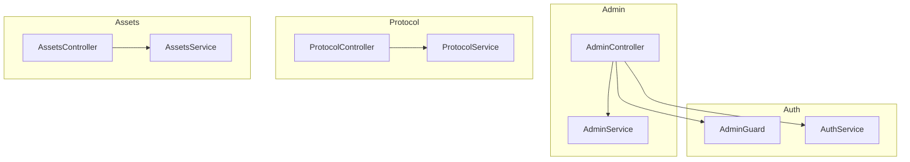
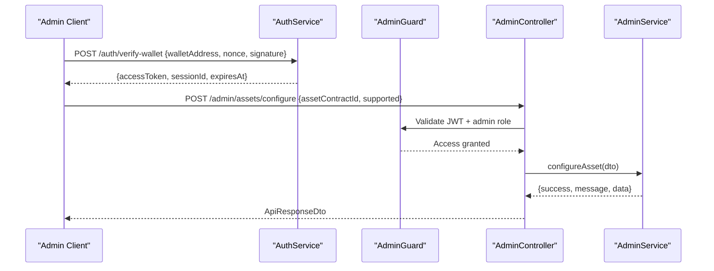
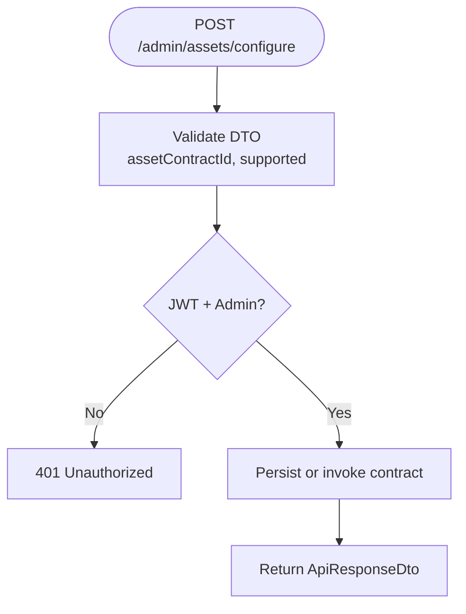
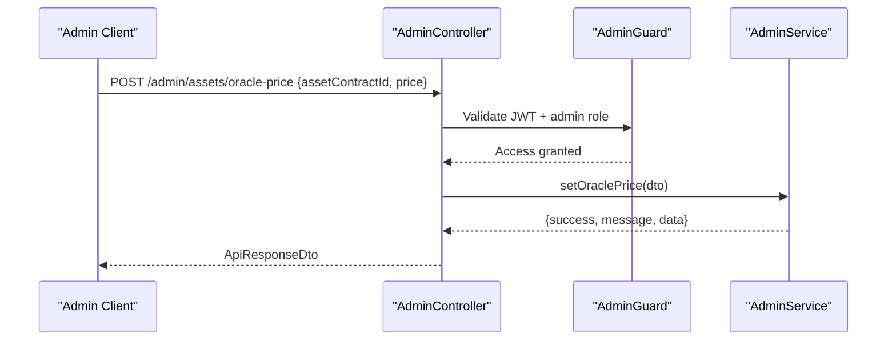
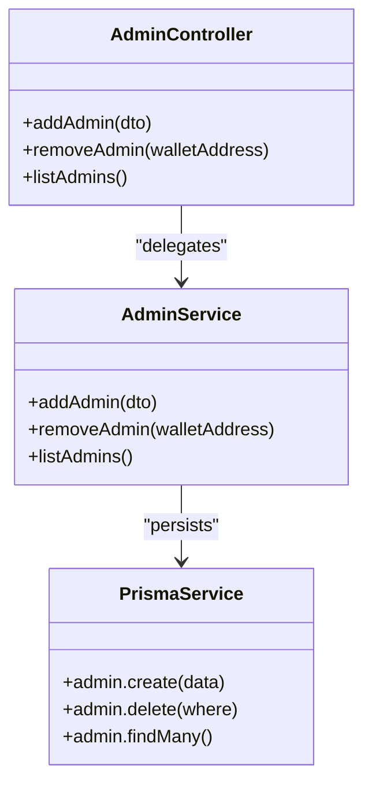
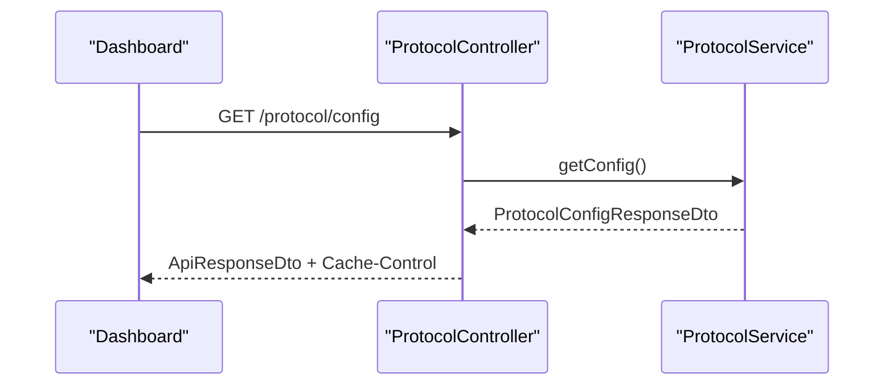
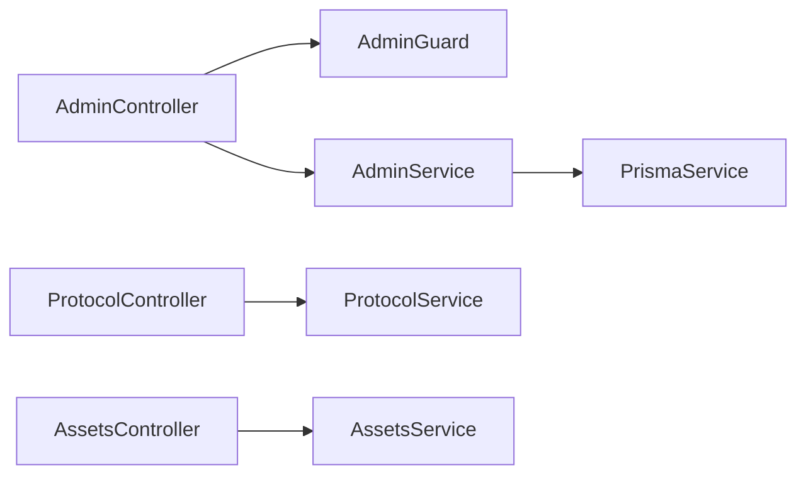

# Administrative Features

<cite>
**Referenced Files in This Document**
- [admin.controller.ts](file://veilend-backend/src/admin/admin.controller.ts)
- [admin.service.ts](file://veilend-backend/src/admin/admin.service.ts)
- [configure-asset.dto.ts](file://veilend-backend/src/admin/dto/configure-asset.dto.ts)
- [set-oracle-price.dto.ts](file://veilend-backend/src/admin/dto/set-oracle-price.dto.ts)
- [add-admin.dto.ts](file://veilend-backend/src/admin/dto/add-admin.dto.ts)
- [set-min-collateral-ratio.dto.ts](file://veilend-backend/src/admin/dto/set-min-collateral-ratio.dto.ts)
- [admin.guard.ts](file://veilend-backend/src/auth/admin.guard.ts)
- [auth.service.ts](file://veilend-backend/src/auth/auth.service.ts)
- [protocol.controller.ts](file://veilend-backend/src/protocol/protocol.controller.ts)
- [protocol.service.ts](file://veilend-backend/src/protocol/protocol.service.ts)
- [assets.controller.ts](file://veilend-backend/src/assets/assets.controller.ts)
- [assets.service.ts](file://veilend-backend/src/assets/assets.service.ts)
</cite>

## Table of Contents
1. Introduction
2. Project Structure
3. Core Components
4. Architecture Overview
5. Detailed Component Analysis
6. Dependency Analysis
7. Performance Considerations
8. Troubleshooting Guide
9. Conclusion

## Introduction
This document explains VeilLend’s administrative capabilities and protocol governance features exposed by the backend API. It covers asset configuration management, oracle price administration, admin role management, and protocol monitoring endpoints. It also documents request validation, response formats, authorization checks, and how administrative actions relate to smart contract state changes. Security measures such as session-based authentication, admin guards, nonce replay protection, and audit logging considerations are included.

## Project Structure
VeilLend’s backend is a NestJS application organized into feature modules:
- Admin module exposes protected endpoints for asset configuration, oracle price updates, collateral ratio settings, and admin role management.
- Auth module provides wallet-based authentication with nonces, JWT sessions, and an admin guard that enforces role-based access.
- Protocol module exposes public configuration endpoints used by clients to discover network and risk parameters.
- Assets module provides read-only views of registered assets, including supported flags and metadata.

**Diagram sources**
- [admin.controller.ts:20-54](file://veilend-backend/src/admin/admin.controller.ts#L20-L54)
- [admin.service.ts:9-56](file://veilend-backend/src/admin/admin.service.ts#L9-L56)
- [admin.guard.ts:24-45](file://veilend-backend/src/auth/admin.guard.ts#L24-L45)
- [auth.service.ts:19-203](file://veilend-backend/src/auth/auth.service.ts#L19-L203)
- [protocol.controller.ts:9-31](file://veilend-backend/src/protocol/protocol.controller.ts#L9-L31)
- [protocol.service.ts:32-127](file://veilend-backend/src/protocol/protocol.service.ts#L32-L127)
- [assets.controller.ts:16-57](file://veilend-backend/src/assets/assets.controller.ts#L16-L57)
- [assets.service.ts:15-91](file://veilend-backend/src/assets/assets.service.ts#L15-L91)

**Section sources**
- [admin.controller.ts:20-54](file://veilend-backend/src/admin/admin.controller.ts#L20-L54)
- [admin.service.ts:9-56](file://veilend-backend/src/admin/admin.service.ts#L9-L56)
- [admin.guard.ts:24-45](file://veilend-backend/src/auth/admin.guard.ts#L24-L45)
- [auth.service.ts:19-203](file://veilend-backend/src/auth/auth.service.ts#L19-L203)
- [protocol.controller.ts:9-31](file://veilend-backend/src/protocol/protocol.controller.ts#L9-L31)
- [protocol.service.ts:32-127](file://veilend-backend/src/protocol/protocol.service.ts#L32-L127)
- [assets.controller.ts:16-57](file://veilend-backend/src/assets/assets.controller.ts#L16-L57)
- [assets.service.ts:15-91](file://veilend-backend/src/assets/assets.service.ts#L15-L91)

## Core Components
- Admin controller: Protected endpoints for adding/removing admins, listing admins, configuring assets, setting oracle prices, and updating minimum collateral ratio. All endpoints require JWT authentication and admin role verification.
- Admin service: Persists admin records and currently contains placeholder implementations for contract interactions (asset configuration, oracle price, collateral ratio). These should be wired to Soroban calls in production.
- DTOs: Strict input validation using class-validator decorators ensures safe payloads for admin operations.
- Auth system: Wallet-based login with nonce challenge, signature verification, JWT issuance, session storage, and admin guard enforcement.
- Protocol and assets modules: Public read endpoints for configuration and asset metadata, supporting caching and filtering.

**Section sources**
- [admin.controller.ts:20-54](file://veilend-backend/src/admin/admin.controller.ts#L20-L54)
- [admin.service.ts:9-56](file://veilend-backend/src/admin/admin.service.ts#L9-L56)
- [configure-asset.dto.ts:1-10](file://veilend-backend/src/admin/dto/configure-asset.dto.ts#L1-L10)
- [set-oracle-price.dto.ts:1-11](file://veilend-backend/src/admin/dto/set-oracle-price.dto.ts#L1-L11)
- [add-admin.dto.ts:1-7](file://veilend-backend/src/admin/dto/add-admin.dto.ts#L1-L7)
- [set-min-collateral-ratio.dto.ts:1-8](file://veilend-backend/src/admin/dto/set-min-collateral-ratio.dto.ts#L1-L8)
- [admin.guard.ts:24-45](file://veilend-backend/src/auth/admin.guard.ts#L24-L45)
- [auth.service.ts:19-203](file://veilend-backend/src/auth/auth.service.ts#L19-L203)
- [protocol.controller.ts:9-31](file://veilend-backend/src/protocol/protocol.controller.ts#L9-L31)
- [protocol.service.ts:32-127](file://veilend-backend/src/protocol/protocol.service.ts#L32-L127)
- [assets.controller.ts:16-57](file://veilend-backend/src/assets/assets.controller.ts#L16-L57)
- [assets.service.ts:15-91](file://veilend-backend/src/assets/assets.service.ts#L15-L91)

## Architecture Overview
Administrative requests flow through authentication and authorization layers before reaching admin services. Public endpoints expose protocol configuration and asset metadata for dashboards and clients.

**Diagram sources**
- [auth.service.ts:60-149](file://veilend-backend/src/auth/auth.service.ts#L60-L149)
- [admin.guard.ts:24-45](file://veilend-backend/src/auth/admin.guard.ts#L24-L45)
- [admin.controller.ts:20-54](file://veilend-backend/src/admin/admin.controller.ts#L20-L54)
- [admin.service.ts:30-46](file://veilend-backend/src/admin/admin.service.ts#L30-L46)

## Detailed Component Analysis

### Asset Configuration Management
- Endpoint: POST /admin/assets/configure
- Request body fields:
  - assetContractId: string
  - supported: boolean
- Validation:
  - assetContractId must be a string
  - supported must be a boolean
- Authorization: Requires valid JWT and admin role via AdminGuard
- Behavior:
  - Service returns a success payload; in production this should call the Soroban contract to update asset support flags and related parameters (e.g., decimals, caps)
- Response format:
  - Standard ApiResponseDto wrapping { success, message, data }

**Diagram sources**
- [admin.controller.ts:41-44](file://veilend-backend/src/admin/admin.controller.ts#L41-L44)
- [configure-asset.dto.ts:1-10](file://veilend-backend/src/admin/dto/configure-asset.dto.ts#L1-L10)
- [admin.guard.ts:24-45](file://veilend-backend/src/auth/admin.guard.ts#L24-L45)
- [admin.service.ts:30-37](file://veilend-backend/src/admin/admin.service.ts#L30-L37)

**Section sources**
- [admin.controller.ts:41-44](file://veilend-backend/src/admin/admin.controller.ts#L41-L44)
- [configure-asset.dto.ts:1-10](file://veilend-backend/src/admin/dto/configure-asset.dto.ts#L1-L10)
- [admin.service.ts:30-37](file://veilend-backend/src/admin/admin.service.ts#L30-L37)

### Oracle Price Administration
- Endpoint: POST /admin/assets/oracle-price
- Request body fields:
  - assetContractId: string
  - price: integer >= 1
- Validation:
  - assetContractId must be a string
  - price must be an integer and at least 1
- Authorization: Requires valid JWT and admin role via AdminGuard
- Behavior:
  - Service returns a success payload; in production this should call the Soroban contract to set/update oracle price for the specified asset
- Response format:
  - Standard ApiResponseDto wrapping { success, message, data }

**Diagram sources**
- [admin.controller.ts:46-49](file://veilend-backend/src/admin/admin.controller.ts#L46-L49)
- [set-oracle-price.dto.ts:1-11](file://veilend-backend/src/admin/dto/set-oracle-price.dto.ts#L1-L11)
- [admin.guard.ts:24-45](file://veilend-backend/src/auth/admin.guard.ts#L24-L45)
- [admin.service.ts:39-46](file://veilend-backend/src/admin/admin.service.ts#L39-L46)

**Section sources**
- [admin.controller.ts:46-49](file://veilend-backend/src/admin/admin.controller.ts#L46-L49)
- [set-oracle-price.dto.ts:1-11](file://veilend-backend/src/admin/dto/set-oracle-price.dto.ts#L1-L11)
- [admin.service.ts:39-46](file://veilend-backend/src/admin/admin.service.ts#L39-L46)

### Minimum Collateral Ratio Update
- Endpoint: POST /admin/protocol/min-collateral-ratio
- Request body fields:
  - minCollateralRatioBps: integer >= 10000
- Validation:
  - minCollateralRatioBps must be an integer and at least 10000
- Authorization: Requires valid JWT and admin role via AdminGuard
- Behavior:
  - Service returns a success payload; in production this should call the Soroban contract to update protocol-wide collateral ratio parameter
- Response format:
  - Standard ApiResponseDto wrapping { success, message, data }

**Section sources**
- [admin.controller.ts:51-54](file://veilend-backend/src/admin/admin.controller.ts#L51-L54)
- [set-min-collateral-ratio.dto.ts:1-8](file://veilend-backend/src/admin/dto/set-min-collateral-ratio.dto.ts#L1-L8)
- [admin.service.ts:48-55](file://veilend-backend/src/admin/admin.service.ts#L48-L55)

### Admin Role Management
- Add admin:
  - Endpoint: POST /admin/admins
  - Body: walletAddress (string)
  - Action: Creates an admin record in the database
- Remove admin:
  - Endpoint: DELETE /admin/admins/:walletAddress
  - Action: Deletes an admin record by wallet address
- List admins:
  - Endpoint: GET /admin/admins
  - Action: Returns all admin records
- Authorization: All endpoints require JWT and admin role via AdminGuard

**Diagram sources**
- [admin.controller.ts:26-39](file://veilend-backend/src/admin/admin.controller.ts#L26-L39)
- [admin.service.ts:12-28](file://veilend-backend/src/admin/admin.service.ts#L12-L28)

**Section sources**
- [admin.controller.ts:26-39](file://veilend-backend/src/admin/admin.controller.ts#L26-L39)
- [admin.service.ts:12-28](file://veilend-backend/src/admin/admin.service.ts#L12-L28)

### Protocol Monitoring Capabilities
- Protocol configuration:
  - Endpoint: GET /protocol/config
  - Purpose: Returns network settings, risk parameters, per-asset risk configuration, and counts of supported assets
  - Caching: Responses include Cache-Control headers; service uses in-memory cache with TTL
- Asset listing:
  - Endpoint: GET /assets?supported=true
  - Purpose: Lists all assets or filters to supported ones
  - Caching: Responses include Cache-Control headers; service uses in-memory cache with TTL

**Diagram sources**
- [protocol.controller.ts:13-30](file://veilend-backend/src/protocol/protocol.controller.ts#L13-L30)
- [protocol.service.ts:52-79](file://veilend-backend/src/protocol/protocol.service.ts#L52-L79)

**Section sources**
- [protocol.controller.ts:13-30](file://veilend-backend/src/protocol/protocol.controller.ts#L13-L30)
- [protocol.service.ts:52-79](file://veilend-backend/src/protocol/protocol.service.ts#L52-L79)
- [assets.controller.ts:20-39](file://veilend-backend/src/assets/assets.controller.ts#L20-L39)
- [assets.service.ts:30-61](file://veilend-backend/src/assets/assets.service.ts#L30-L61)

### Relationship Between Administrative Actions and Smart Contract State Changes
- Current implementation:
  - Admin service methods return success payloads without invoking contracts
- Recommended integration:
  - After successful DTO validation and authorization, call Soroban functions to:
    - Configure asset support and parameters (e.g., decimals, caps)
    - Set oracle prices for assets
    - Update protocol-wide parameters like minimum collateral ratio
  - On success, invalidate caches in protocol and assets services to ensure consistency
  - Log all admin actions with correlation IDs for auditability

[No sources needed since this section provides general guidance]

## Dependency Analysis
The admin module depends on auth guards and services for authorization, and on persistence via Prisma. The protocol and assets modules provide read-only data for dashboards and clients.

**Diagram sources**
- [admin.controller.ts:20-54](file://veilend-backend/src/admin/admin.controller.ts#L20-L54)
- [admin.guard.ts:24-45](file://veilend-backend/src/auth/admin.guard.ts#L24-L45)
- [admin.service.ts:9-56](file://veilend-backend/src/admin/admin.service.ts#L9-L56)
- [protocol.controller.ts:9-31](file://veilend-backend/src/protocol/protocol.controller.ts#L9-L31)
- [protocol.service.ts:32-127](file://veilend-backend/src/protocol/protocol.service.ts#L32-L127)
- [assets.controller.ts:16-57](file://veilend-backend/src/assets/assets.controller.ts#L16-L57)
- [assets.service.ts:15-91](file://veilend-backend/src/assets/assets.service.ts#L15-L91)

**Section sources**
- [admin.controller.ts:20-54](file://veilend-backend/src/admin/admin.controller.ts#L20-L54)
- [admin.guard.ts:24-45](file://veilend-backend/src/auth/admin.guard.ts#L24-L45)
- [admin.service.ts:9-56](file://veilend-backend/src/admin/admin.service.ts#L9-L56)
- [protocol.controller.ts:9-31](file://veilend-backend/src/protocol/protocol.controller.ts#L9-L31)
- [protocol.service.ts:32-127](file://veilend-backend/src/protocol/protocol.service.ts#L32-L127)
- [assets.controller.ts:16-57](file://veilend-backend/src/assets/assets.controller.ts#L16-L57)
- [assets.service.ts:15-91](file://veilend-backend/src/assets/assets.service.ts#L15-L91)

## Performance Considerations
- Caching:
  - Protocol config endpoint includes Cache-Control headers and uses in-memory cache with TTL
  - Assets endpoints include Cache-Control headers and use in-memory cache with TTL
- Validation:
  - DTOs enforce strict types and constraints to reduce error handling overhead
- Recommendations:
  - Introduce Redis for shared cache if multiple instances are deployed
  - Invalidate caches after admin actions that change protocol or asset state
  - Use pagination for large datasets if needed

[No sources needed since this section provides general guidance]

## Troubleshooting Guide
Common issues and resolutions:
- Unauthorized errors:
  - Ensure a valid JWT is provided and the user has admin privileges
  - Verify the admin guard checks the wallet address against stored admins
- Session expired:
  - Re-authenticate by requesting a new nonce and verifying the wallet signature
- Replay attacks:
  - Nonce is one-time use; if reuse is attempted, the server rejects the request
- Validation failures:
  - Check DTO constraints (e.g., price must be integer >= 1; minCollateralRatioBps >= 10000)

**Section sources**
- [admin.guard.ts:24-45](file://veilend-backend/src/auth/admin.guard.ts#L24-L45)
- [auth.service.ts:60-149](file://veilend-backend/src/auth/auth.service.ts#L60-L149)
- [set-oracle-price.dto.ts:1-11](file://veilend-backend/src/admin/dto/set-oracle-price.dto.ts#L1-L11)
- [set-min-collateral-ratio.dto.ts:1-8](file://veilend-backend/src/admin/dto/set-min-collateral-ratio.dto.ts#L1-L8)

## Conclusion
VeilLend’s backend provides a secure, validated admin surface for managing assets, oracle prices, collateral ratios, and admin roles. Authentication is wallet-based with nonce replay protection and JWT sessions, while admin operations are guarded by role checks. Public endpoints expose protocol configuration and asset metadata for dashboards. To fully realize governance, integrate admin services with Soroban contract calls and implement comprehensive audit logging and multi-signature requirements where appropriate.

[No sources needed since this section summarizes without analyzing specific files]