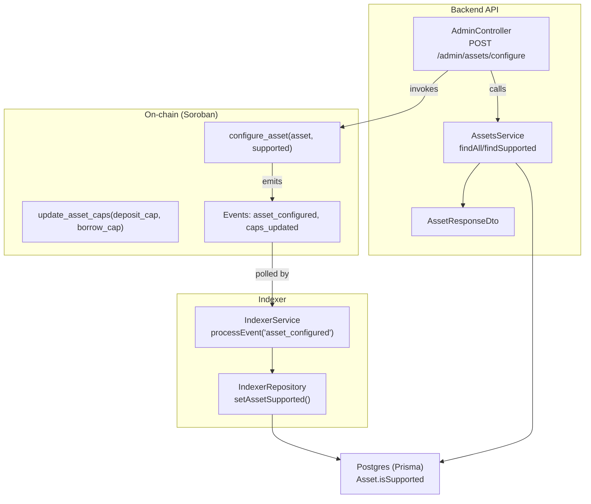
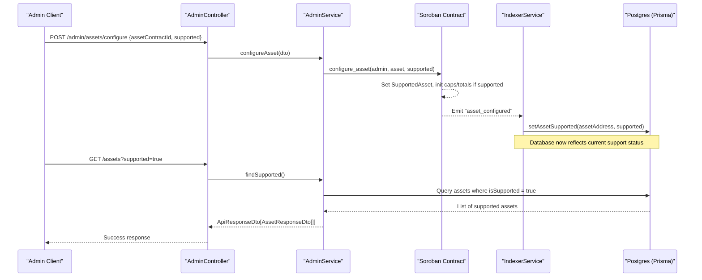
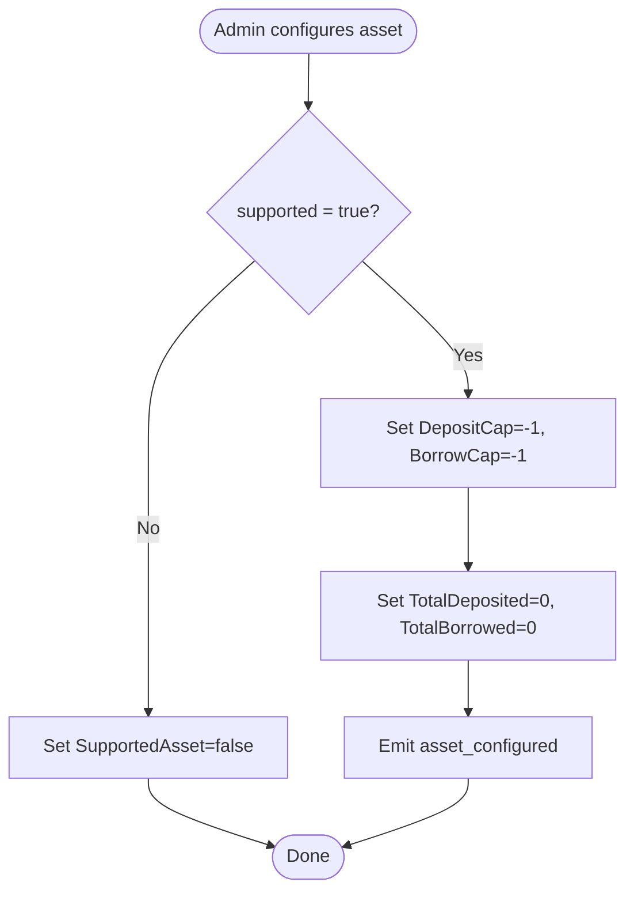
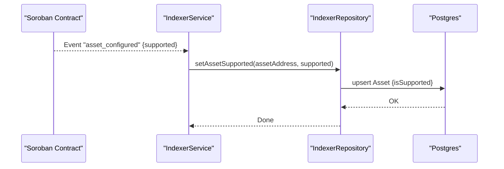
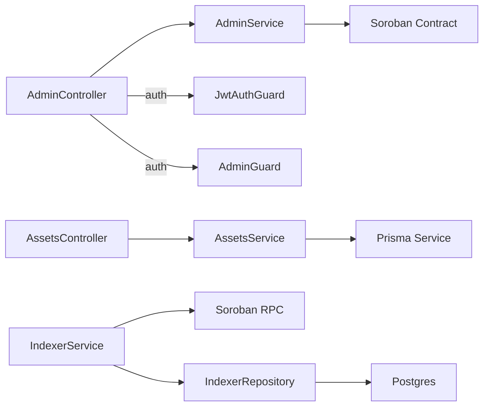

# Asset Management

<cite>
**Referenced Files in This Document**
- [configure-asset.dto.ts](file://veilend-backend/src/admin/dto/configure-asset.dto.ts)
- [admin.controller.ts](file://veilend-backend/src/admin/admin.controller.ts)
- [admin.service.ts](file://veilend-backend/src/admin/admin.service.ts)
- [assets.controller.ts](file://veilend-backend/src/assets/assets.controller.ts)
- [assets.service.ts](file://veilend-backend/src/assets/assets.service.ts)
- [asset-response.dto.ts](file://veilend-backend/src/assets/dto/asset-response.dto.ts)
- [schema.prisma](file://veilend-backend/prisma/schema.prisma)
- [lib.rs](file://veilend-soroban/src/lib.rs)
- [indexer.service.ts](file://veilend-backend/src/indexer/indexer.service.ts)
- [indexer.repository.ts](file://veilend-backend/src/indexer/indexer.repository.ts)
</cite>

## Table of Contents
1. Introduction
2. Project Structure
3. Core Components
4. Architecture Overview
5. Detailed Component Analysis
6. Dependency Analysis
7. Performance Considerations
8. Troubleshooting Guide
9. Conclusion

## Introduction
This document explains VeilLend’s asset management system with a focus on adding new tokens, configuring support status, and setting deposit/borrow caps. It covers the backend API for administrators, the on-chain Soroban contract state changes, and how the indexer keeps the database in sync with protocol events. It also documents the ConfigureAssetDto structure, validation rules, example request/response formats for Stellar assets, and error handling for invalid or duplicate configurations.

## Project Structure
VeilLend’s asset management spans three layers:
- Backend API (NestJS): Admin endpoints to configure assets and read asset metadata; assets service with caching.
- On-chain state (Soroban): Contract stores supported assets, per-asset caps, totals, and emits configuration events.
- Indexer: Polls Soroban events and updates the Postgres read models used by the API.

**Diagram sources**
- [admin.controller.ts:41-44](file://veilend-backend/src/admin/admin.controller.ts#L41-L44)
- [lib.rs:260-306](file://veilend-soroban/src/lib.rs#L260-L306)
- [lib.rs:356-395](file://veilend-soroban/src/lib.rs#L356-L395)
- [indexer.service.ts:204-207](file://veilend-backend/src/indexer/indexer.service.ts#L204-L207)
- [indexer.repository.ts:258-274](file://veilend-backend/src/indexer/indexer.repository.ts#L258-L274)
- [assets.service.ts:30-61](file://veilend-backend/src/assets/assets.service.ts#L30-L61)
- [asset-response.dto.ts:7-34](file://veilend-backend/src/assets/dto/asset-response.dto.ts#L7-L34)

**Section sources**
- [admin.controller.ts:20-55](file://veilend-backend/src/admin/admin.controller.ts#L20-L55)
- [assets.controller.ts:16-57](file://veilend-backend/src/assets/assets.controller.ts#L16-L57)
- [assets.service.ts:15-90](file://veilend-backend/src/assets/assets.service.ts#L15-L90)
- [schema.prisma:47-65](file://veilend-backend/prisma/schema.prisma#L47-L65)
- [lib.rs:260-420](file://veilend-soroban/src/lib.rs#L260-L420)
- [indexer.service.ts:107-254](file://veilend-backend/src/indexer/indexer.service.ts#L107-L254)
- [indexer.repository.ts:247-274](file://veilend-backend/src/indexer/indexer.repository.ts#L247-L274)

## Core Components
- ConfigureAssetDto: Validates admin input for asset configuration.
- AdminController/AdminService: Expose protected endpoint to toggle asset support and placeholder integration to on-chain calls.
- AssetsController/AssetsService: Read-only APIs to list supported or all assets with caching.
- Prisma Asset model: Stores code, symbol, decimals, issuer, contractId, isNative, isSupported.
- Soroban contract: Stores SupportedAsset flag, DepositCap/BorrowCap, TotalDeposited/TotalBorrowed; emits configuration and cap update events.
- Indexer: Consumes asset_configured events and persists isSupported to Postgres.

Key responsibilities:
- Administrators enable/disable assets via POST /admin/assets/configure.
- Administrators set per-asset deposit/borrow caps via on-chain update_asset_caps (admin-only).
- The indexer keeps the database in sync with on-chain configuration.
- Clients query supported assets via GET /assets?supported=true.

**Section sources**
- [configure-asset.dto.ts:1-9](file://veilend-backend/src/admin/dto/configure-asset.dto.ts#L1-L9)
- [admin.controller.ts:41-44](file://veilend-backend/src/admin/admin.controller.ts#L41-L44)
- [admin.service.ts:30-37](file://veilend-backend/src/admin/admin.service.ts#L30-L37)
- [assets.controller.ts:20-57](file://veilend-backend/src/assets/assets.controller.ts#L20-L57)
- [assets.service.ts:30-90](file://veilend-backend/src/assets/assets.service.ts#L30-L90)
- [schema.prisma:47-65](file://veilend-backend/prisma/schema.prisma#L47-L65)
- [lib.rs:260-420](file://veilend-soroban/src/lib.rs#L260-L420)
- [indexer.service.ts:204-207](file://veilend-backend/src/indexer/indexer.service.ts#L204-L207)
- [indexer.repository.ts:258-274](file://veilend-backend/src/indexer/indexer.repository.ts#L258-L274)

## Architecture Overview
The asset configuration flow involves an admin call that toggles support on-chain, emitting an event that the indexer consumes to update the database. Subsequent reads from the assets API reflect the updated support status.

**Diagram sources**
- [admin.controller.ts:41-44](file://veilend-backend/src/admin/admin.controller.ts#L41-L44)
- [admin.service.ts:30-37](file://veilend-backend/src/admin/admin.service.ts#L30-L37)
- [lib.rs:260-306](file://veilend-soroban/src/lib.rs#L260-L306)
- [indexer.service.ts:204-207](file://veilend-backend/src/indexer/indexer.service.ts#L204-L207)
- [indexer.repository.ts:258-274](file://veilend-backend/src/indexer/indexer.repository.ts#L258-L274)
- [assets.controller.ts:20-39](file://veilend-backend/src/assets/assets.controller.ts#L20-L39)
- [assets.service.ts:55-61](file://veilend-backend/src/assets/assets.service.ts#L55-L61)

## Detailed Component Analysis

### ConfigureAssetDto and Validation Rules
- Fields:
  - assetContractId: string (required)
  - supported: boolean (required)
- Validation:
  - assetContractId must be a string.
  - supported must be a boolean.
- Behavior:
  - When supported is true, the contract initializes deposit and borrow caps to unlimited (-1) and resets totals to zero for the asset.
  - When supported is false, the asset becomes unavailable for deposits/borrows until re-enabled.

Example request body (JSON):
{
  "assetContractId": "CAAAAAAAAAAAAAAAAAAAAAAAAAAAAAAAAAAAAAAAAAAAAAAAAAAAFCT4",
  "supported": true
}

Example success response (from controller/service layer):
{
  "success": true,
  "message": "Asset configuration updated",
  "data": {
    "assetContractId": "CAAAAAAAAAAAAAAAAAAAAAAAAAAAAAAAAAAAAAAAAAAAAAAAAAAAFCT4",
    "supported": true
  }
}

Notes on Stellar asset codes and amounts:
- Asset codes are represented as strings in the API and on-chain addresses. For Stellar Classic tokens, use the token code (e.g., "USDC") and issuer when relevant; for Soroban tokens, use the contract address as assetContractId.
- Amounts in the protocol are stored in native precision (integers). When interacting with UIs or external systems, convert using the asset’s decimals field from AssetResponseDto.

**Section sources**
- [configure-asset.dto.ts:1-9](file://veilend-backend/src/admin/dto/configure-asset.dto.ts#L1-L9)
- [admin.controller.ts:41-44](file://veilend-backend/src/admin/admin.controller.ts#L41-L44)
- [admin.service.ts:30-37](file://veilend-backend/src/admin/admin.service.ts#L30-L37)
- [lib.rs:260-306](file://veilend-soroban/src/lib.rs#L260-L306)
- [asset-response.dto.ts:7-34](file://veilend-backend/src/assets/dto/asset-response.dto.ts#L7-L34)

### Enabling/Disabling Assets and Setting Caps
- Enable/disable:
  - Call POST /admin/assets/configure with supported=true/false.
  - On-chain, this sets SupportedAsset(asset) and emits asset_configured.
- Set deposit/borrow caps:
  - Use the on-chain update_asset_caps(admin, asset, deposit_cap, borrow_cap).
  - Caps can be positive integers or -1 for unlimited.
  - Requires admin authorization and the asset must be supported.
- Reading caps:
  - Use get_asset_caps(asset) to retrieve current deposit_cap and borrow_cap.

Example cap update (on-chain parameters):
- deposit_cap: 1000000000 (for 1000 USDC with 7 decimals)
- borrow_cap: 500000000 (for 500 USDC with 7 decimals)
- Unlimited: -1

**Section sources**
- [lib.rs:356-420](file://veilend-soroban/src/lib.rs#L356-L420)
- [lib.rs:260-306](file://veilend-soroban/src/lib.rs#L260-L306)

### Asset Metadata and Public API
- GET /assets returns all assets; filter with ?supported=true to return only configured assets.
- Each asset includes code, symbol, name, decimals, issuer, contractId, logoUrl, isNative, isSupported.
- Results are cached in-memory for 60 seconds to reduce database load.

Example responses:
- All assets:
{
  "success": true,
  "data": [
    {
      "code": "XLM",
      "symbol": "XLM",
      "name": "Stellar Lumens",
      "decimals": 7,
      "issuer": null,
      "contractId": null,
      "logoUrl": "https://assets.stellar.network/xlm.png",
      "isNative": true,
      "isSupported": true
    }
  ],
  "meta": {
    "count": 1,
    "cached": true,
    "cacheMaxAge": 60
  }
}
- Single asset by code or contractId:
GET /assets/{id}
Returns the matching AssetResponseDto or 404 if not found.

**Section sources**
- [assets.controller.ts:20-57](file://veilend-backend/src/assets/assets.controller.ts#L20-L57)
- [assets.service.ts:30-90](file://veilend-backend/src/assets/assets.service.ts#L30-L90)
- [asset-response.dto.ts:7-34](file://veilend-backend/src/assets/dto/asset-response.dto.ts#L7-L34)

### Relationship Between Configuration and Smart Contract State
- configure_asset:
  - Sets SupportedAsset(asset) to true/false.
  - If enabling, initializes DepositCap and BorrowCap to -1 (unlimited), and TotalDeposited/TotalBorrowed to 0.
  - Emits asset_configured event with admin, asset, and supported flags.
- update_asset_caps:
  - Validates caps (must be -1 or positive).
  - Requires asset to be supported.
  - Persists DepositCap and BorrowCap and emits caps_updated.

**Diagram sources**
- [lib.rs:260-306](file://veilend-soroban/src/lib.rs#L260-L306)

**Section sources**
- [lib.rs:260-306](file://veilend-soroban/src/lib.rs#L260-L306)
- [lib.rs:356-395](file://veilend-soroban/src/lib.rs#L356-L395)

### Indexer Syncing of Asset Support
- The indexer polls Soroban events with topic prefix "veillend".
- On receiving asset_configured, it calls setAssetSupported(assetAddress, supported) which upserts the asset row and sets isSupported accordingly.
- This ensures the API’s supported filter reflects on-chain state.

**Diagram sources**
- [indexer.service.ts:204-207](file://veilend-backend/src/indexer/indexer.service.ts#L204-L207)
- [indexer.repository.ts:258-274](file://veilend-backend/src/indexer/indexer.repository.ts#L258-L274)

**Section sources**
- [indexer.service.ts:107-254](file://veilend-backend/src/indexer/indexer.service.ts#L107-L254)
- [indexer.repository.ts:247-274](file://veilend-backend/src/indexer/indexer.repository.ts#L247-L274)

## Dependency Analysis
- AdminController depends on AdminService and guards (JWT + Admin).
- AdminService currently returns a placeholder success; production should invoke Soroban contract methods.
- AssetsService depends on Prisma and caches results.
- IndexerService depends on Soroban RPC and repository to persist state.
- On-chain contract enforces admin authorization and validates caps.

**Diagram sources**
- [admin.controller.ts:20-55](file://veilend-backend/src/admin/admin.controller.ts#L20-L55)
- [admin.service.ts:30-37](file://veilend-backend/src/admin/admin.service.ts#L30-L37)
- [assets.controller.ts:16-57](file://veilend-backend/src/assets/assets.controller.ts#L16-L57)
- [assets.service.ts:15-90](file://veilend-backend/src/assets/assets.service.ts#L15-L90)
- [indexer.service.ts:107-254](file://veilend-backend/src/indexer/indexer.service.ts#L107-L254)
- [indexer.repository.ts:247-274](file://veilend-backend/src/indexer/indexer.repository.ts#L247-L274)

**Section sources**
- [admin.controller.ts:20-55](file://veilend-backend/src/admin/admin.controller.ts#L20-L55)
- [assets.controller.ts:16-57](file://veilend-backend/src/assets/assets.controller.ts#L16-L57)
- [assets.service.ts:15-90](file://veilend-backend/src/assets/assets.service.ts#L15-L90)
- [indexer.service.ts:107-254](file://veilend-backend/src/indexer/indexer.service.ts#L107-L254)

## Performance Considerations
- Assets API uses an in-memory cache with a 60-second TTL to reduce database queries for frequently accessed asset lists.
- Indexer batches event fetching and persists checkpoints to avoid reprocessing.
- On-chain operations validate caps before mutations to prevent unnecessary writes.

[No sources needed since this section provides general guidance]

## Troubleshooting Guide
Common errors and handling:
- Invalid asset configuration:
  - Ensure assetContractId is a valid Soroban contract address string and supported is a boolean.
  - The backend validates these fields; invalid payloads will be rejected by the validation pipe.
- Duplicate asset additions:
  - Re-enabling an already supported asset is idempotent on-chain; the indexer handles duplicate events safely.
- Unauthorized operations:
  - Only the stored admin can call configure_asset and update_asset_caps; unauthorized callers receive an Unauthorized error.
- Invalid caps:
  - Caps must be -1 (unlimited) or positive; negative non-unlimited values cause InvalidCap.
- Unsupported asset operations:
  - Deposits/borrows require the asset to be supported; otherwise, UnsupportedAsset is returned.
- Missing oracle price:
  - Some operations may require oracle prices; missing prices result in OraclePriceMissing.

Error mapping (on-chain):
- Unauthorized: caller is not admin
- UnsupportedAsset: asset not enabled
- InvalidAmount/ZeroAmount: amount must be positive
- InsufficientCollateral: collateral ratio below minimum
- InsufficientDeposit/RepayTooLarge: balance constraints
- InvalidCollateralRatio: min collateral ratio below threshold
- NotInitialized: contract not initialized
- OraclePriceMissing: no oracle price set
- ContractPaused: circuit breaker active
- DepositCapExceeded/BorrowCapExceeded: caps exceeded
- InvalidCap: cap value invalid
- CircuitBreakerTriggered: temporary pause
- InsufficientReserve: reserve balance too low

**Section sources**
- [lib.rs:107-145](file://veilend-soroban/src/lib.rs#L107-L145)
- [lib.rs:356-395](file://veilend-soroban/src/lib.rs#L356-L395)
- [admin.controller.ts:20-55](file://veilend-backend/src/admin/admin.controller.ts#L20-L55)

## Conclusion
VeilLend’s asset management integrates a secure admin API, a robust Soroban contract, and an indexer that synchronizes on-chain state to the database. Administrators can add new tokens by enabling them via the admin endpoint and then setting appropriate deposit/borrow caps. The public assets API exposes clean metadata for clients, while the indexer ensures consistency between on-chain and off-chain states. Proper validation and comprehensive error handling protect against misconfiguration and misuse.