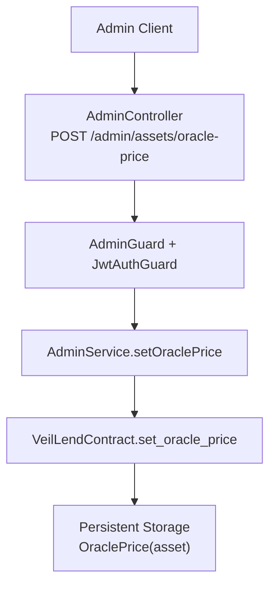
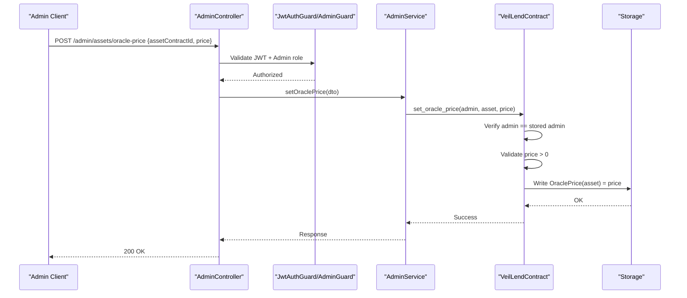
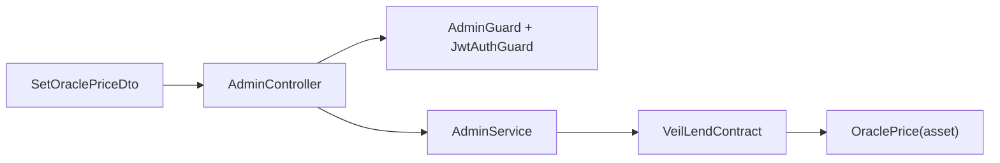

# Oracle Price Management

<cite>
**Referenced Files in This Document**
- [set-oracle-price.dto.ts](file://veilend-backend/src/admin/dto/set-oracle-price.dto.ts)
- [admin.controller.ts](file://veilend-backend/src/admin/admin.controller.ts)
- [admin.service.ts](file://veilend-backend/src/admin/admin.service.ts)
- [admin.guard.ts](file://veilend-backend/src/auth/admin.guard.ts)
- [lib.rs](file://veilend-soroban/src/lib.rs)
- [app-logger.service.ts](file://veilend-backend/src/common/logging/app-logger.service.ts)
</cite>

## Table of Contents
1. [Introduction](#introduction)
2. [Project Structure](#project-structure)
3. [Core Components](#core-components)
4. [Architecture Overview](#architecture-overview)
5. [Detailed Component Analysis](#detailed-component-analysis)
6. [Dependency Analysis](#dependency-analysis)
7. [Performance Considerations](#performance-considerations)
8. [Troubleshooting Guide](#troubleshooting-guide)
9. [Conclusion](#conclusion)

## Introduction
This document explains VeilLend’s oracle price administration system: how administrators set and update asset valuations, the validation rules enforced on price inputs, how oracle prices influence borrowing power, and the security measures around authorization and audit logging. It also covers error scenarios such as invalid price formats or unauthorized access attempts.

## Project Structure
VeilLend exposes an admin API to set oracle prices for supported assets. The request is validated by a DTO, authorized via JWT and an admin guard, then routed to a service that interacts with the on-chain contract (currently a placeholder in the backend). The Soroban contract enforces strict validation and stores the price per asset. Borrowing operations read the stored oracle price to compute collateralization.

**Diagram sources**
- [admin.controller.ts:20-49](file://veilend-backend/src/admin/admin.controller.ts#L20-L49)
- [admin.guard.ts:24-45](file://veilend-backend/src/auth/admin.guard.ts#L24-L45)
- [admin.service.ts:39-46](file://veilend-backend/src/admin/admin.service.ts#L39-L46)
- [lib.rs:308-331](file://veilend-soroban/src/lib.rs#L308-L331)

**Section sources**
- [admin.controller.ts:20-49](file://veilend-backend/src/admin/admin.controller.ts#L20-L49)
- [admin.guard.ts:24-45](file://veilend-backend/src/auth/admin.guard.ts#L24-L45)
- [admin.service.ts:39-46](file://veilend-backend/src/admin/admin.service.ts#L39-L46)
- [lib.rs:308-331](file://veilend-soroban/src/lib.rs#L308-L331)

## Core Components
- SetOraclePriceDto: Validates incoming price updates at the API boundary.
- AdminController: Exposes the admin endpoint for setting oracle prices.
- AdminGuard/JwtAuthGuard: Enforce authentication and admin-only access.
- AdminService: Orchestrates the operation (placeholder for on-chain call).
- VeilLendContract: On-chain logic that validates and persists oracle prices and uses them for collateral checks.

Key responsibilities:
- Input validation: string asset identifier, integer price greater than zero.
- Authorization: only configured admins can update prices.
- Persistence: store price per asset address.
- Usage: borrow/withdraw paths require oracle price to be set; otherwise they fail.

**Section sources**
- [set-oracle-price.dto.ts:1-10](file://veilend-backend/src/admin/dto/set-oracle-price.dto.ts#L1-L10)
- [admin.controller.ts:20-49](file://veilend-backend/src/admin/admin.controller.ts#L20-L49)
- [admin.guard.ts:24-45](file://veilend-backend/src/auth/admin.guard.ts#L24-L45)
- [admin.service.ts:39-46](file://veilend-backend/src/admin/admin.service.ts#L39-L46)
- [lib.rs:308-331](file://veilend-soroban/src/lib.rs#L308-L331)

## Architecture Overview
The admin flow ensures secure, validated price updates and integrates with protocol safety checks during borrowing.

**Diagram sources**
- [admin.controller.ts:41-49](file://veilend-backend/src/admin/admin.controller.ts#L41-L49)
- [admin.guard.ts:24-45](file://veilend-backend/src/auth/admin.guard.ts#L24-L45)
- [admin.service.ts:39-46](file://veilend-backend/src/admin/admin.service.ts#L39-L46)
- [lib.rs:308-331](file://veilend-soroban/src/lib.rs#L308-L331)

## Detailed Component Analysis

### SetOraclePriceDto Validation Rules
- assetContractId: Required string identifying the asset.
- price: Required integer strictly greater than zero.
- Decimal precision: The DTO enforces integer pricing. For sub-unit precision (e.g., cents), clients should multiply by the appropriate factor before sending integers.

Validation errors will be rejected by the NestJS validation pipeline before reaching the service layer.

**Section sources**
- [set-oracle-price.dto.ts:1-10](file://veilend-backend/src/admin/dto/set-oracle-price.dto.ts#L1-L10)

### Admin API Endpoint
- Route: POST /admin/assets/oracle-price
- Body: SetOraclePriceDto
- Guards: JwtAuthGuard and AdminGuard enforce authentication and admin-only access.
- Behavior: Delegates to AdminService.setOraclePrice.

Example request payload structure:
- assetContractId: "stellar_asset_address_or_contract_id"
- price: 12345 (integer representing value in base units)

**Section sources**
- [admin.controller.ts:20-49](file://veilend-backend/src/admin/admin.controller.ts#L20-L49)
- [admin.guard.ts:24-45](file://veilend-backend/src/auth/admin.guard.ts#L24-L45)

### On-Chain Price Update Logic
- Only the stored admin can call set_oracle_price.
- Price must be positive; non-positive values are rejected.
- Price is persisted per asset under OraclePrice(asset).
- A get_oracle_price function returns the current price if set.

Security notes:
- Admin identity is checked against stored admin.
- Authentication signature is required via require_auth.

**Section sources**
- [lib.rs:308-331](file://veilend-soroban/src/lib.rs#L308-L331)

### Relationship Between Oracle Prices and Borrowing Power
- When a user borrows or withdraws, the contract asserts positions remain sufficiently collateralized.
- Collateralization uses the stored oracle price for the relevant asset.
- If no oracle price is set for an asset involved in a borrowing-related operation, the operation fails with an explicit error indicating missing oracle price.

Collateral check highlights:
- Reads min collateral ratio (in basis points).
- Computes collateral and borrowed values using the oracle price.
- Fails if collateral ratio falls below the minimum.

**Section sources**
- [lib.rs:913-934](file://veilend-soroban/src/lib.rs#L913-L934)

### Example Price Update Requests
- Asset identifier: Use the exact asset contract ID/address used throughout the protocol.
- Price format: Integer in base units. For example, if an asset has 2 decimals, represent $1.23 as 123.
- Request body:
  - assetContractId: "<asset address>"
  - price: <positive integer>

These examples illustrate proper identifiers and integer-based pricing.

[No sources needed since this section provides usage examples without analyzing specific files]

### Security Measures and Audit Logging
Authorization:
- API-level: JwtAuthGuard authenticates the caller; AdminGuard verifies the caller is an admin in the database.
- Contract-level: set_oracle_price requires the caller to match the stored admin and calls require_auth.

Audit logging:
- The backend includes a structured logger that emits JSON records with timestamp, level, context, correlationId, and redacted message content.
- Integrate logging around admin actions (e.g., in controller/service) to record who updated which asset price and when.

Note: The current AdminService.setOraclePrice is a placeholder; integrate actual contract interaction and logging there.

**Section sources**
- [admin.guard.ts:24-45](file://veilend-backend/src/auth/admin.guard.ts#L24-L45)
- [lib.rs:308-331](file://veilend-soroban/src/lib.rs#L308-L331)
- [app-logger.service.ts:1-48](file://veilend-backend/src/common/logging/app-logger.service.ts#L1-L48)

### Error Scenarios
- Invalid price format: Non-integer or non-positive price is rejected by DTO or contract validation.
- Unauthorized access: Missing JWT, expired token, or non-admin wallet results in unauthorized responses at the API; contract rejects non-admin callers.
- Missing oracle price: Borrowing/withdraw operations fail if oracle price is not set for the asset.
- Unsupported asset: Operations on unsupported assets fail.

Error codes and conditions are enforced both in the backend validation layer and on-chain.

**Section sources**
- [set-oracle-price.dto.ts:1-10](file://veilend-backend/src/admin/dto/set-oracle-price.dto.ts#L1-L10)
- [admin.guard.ts:24-45](file://veilend-backend/src/auth/admin.guard.ts#L24-L45)
- [lib.rs:308-331](file://veilend-soroban/src/lib.rs#L308-L331)
- [lib.rs:913-934](file://veilend-soroban/src/lib.rs#L913-L934)

## Dependency Analysis

**Diagram sources**
- [set-oracle-price.dto.ts:1-10](file://veilend-backend/src/admin/dto/set-oracle-price.dto.ts#L1-L10)
- [admin.controller.ts:20-49](file://veilend-backend/src/admin/admin.controller.ts#L20-L49)
- [admin.guard.ts:24-45](file://veilend-backend/src/auth/admin.guard.ts#L24-L45)
- [admin.service.ts:39-46](file://veilend-backend/src/admin/admin.service.ts#L39-L46)
- [lib.rs:308-331](file://veilend-soroban/src/lib.rs#L308-L331)

**Section sources**
- [admin.controller.ts:20-49](file://veilend-backend/src/admin/admin.controller.ts#L20-L49)
- [admin.service.ts:39-46](file://veilend-backend/src/admin/admin.service.ts#L39-L46)
- [lib.rs:308-331](file://veilend-soroban/src/lib.rs#L308-L331)

## Performance Considerations
- DTO validation occurs early and prevents unnecessary processing for malformed requests.
- On-chain price writes are minimal storage updates per asset; ensure batch updates are avoided unless necessary.
- Borrowing paths read oracle prices frequently; keep prices up-to-date to avoid repeated failures.

[No sources needed since this section provides general guidance]

## Troubleshooting Guide
Common issues and resolutions:
- 400 Bad Request on price update: Check that price is an integer and assetContractId is a valid string.
- 401/403 Unauthorized: Ensure JWT is valid and the wallet address is registered as an admin.
- Contract error “Unauthorized”: The caller does not match the stored admin on-chain.
- Contract error “InvalidAmount”: Price must be positive.
- Borrow/Withdraw fails due to missing price: Set oracle price for the asset before performing borrowing operations.

Operational tips:
- Log all admin price updates with correlation IDs for traceability.
- Monitor events from the contract for successful price updates and collateralization checks.

**Section sources**
- [admin.guard.ts:24-45](file://veilend-backend/src/auth/admin.guard.ts#L24-L45)
- [lib.rs:308-331](file://veilend-soroban/src/lib.rs#L308-L331)
- [lib.rs:913-934](file://veilend-soroban/src/lib.rs#L913-L934)
- [app-logger.service.ts:1-48](file://veilend-backend/src/common/logging/app-logger.service.ts#L1-L48)

## Conclusion
VeilLend’s oracle price administration provides a secure, validated pathway for administrators to set asset valuations. The DTO enforces integer pricing above zero, while guards ensure only authorized admins can update prices. On-chain, prices are stored per asset and are critical for borrowing power calculations; missing prices block risky operations. Integrating robust logging around these flows enhances auditability and operational visibility.