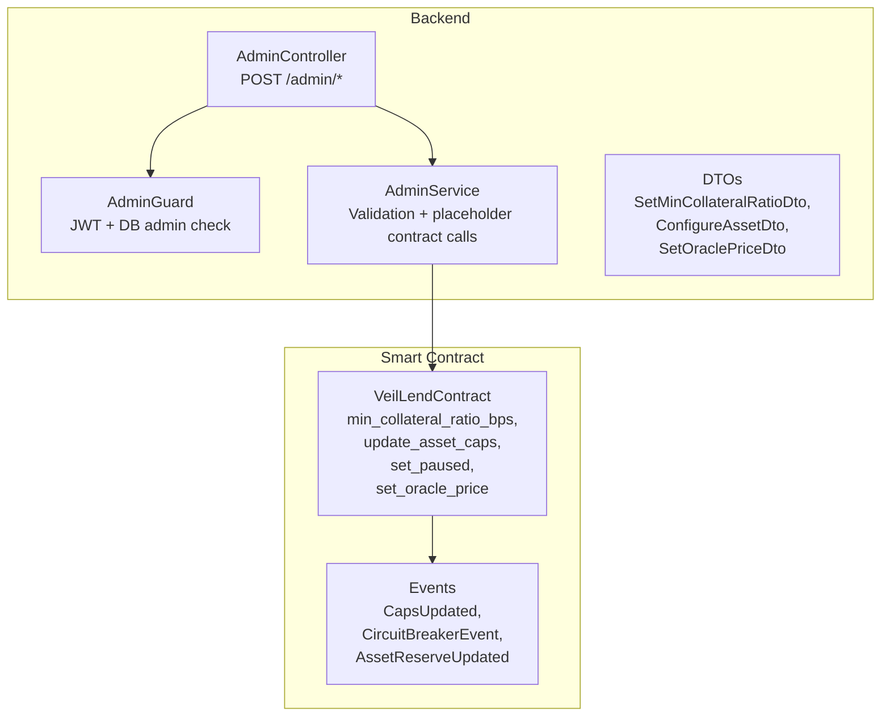
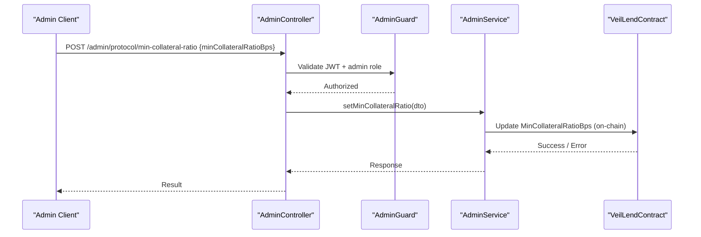
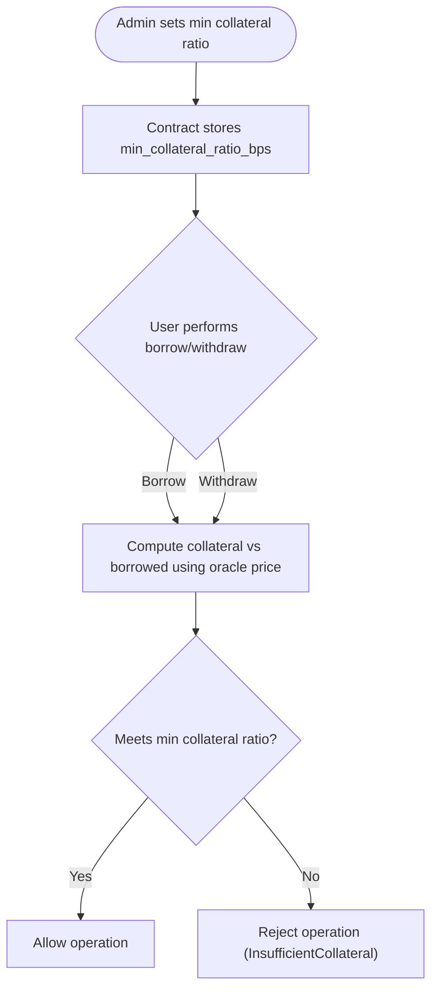
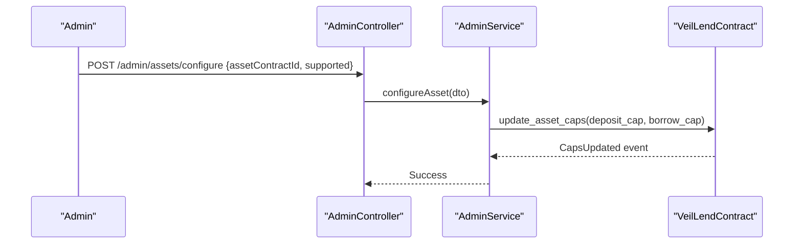
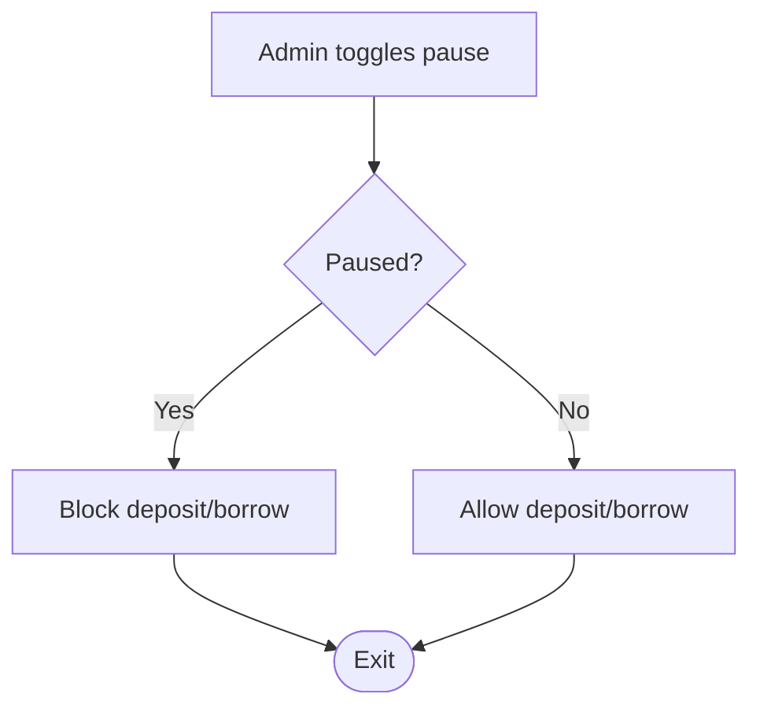
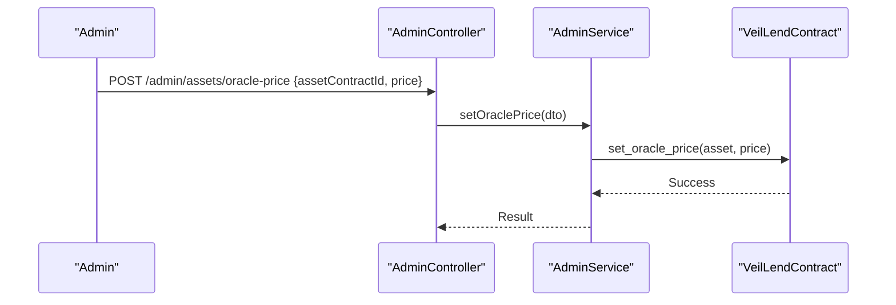
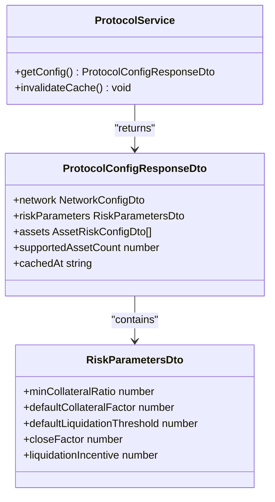
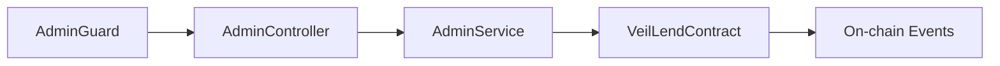

# Protocol Governance

<cite>
**Referenced Files in This Document**
- [lib.rs](file://veilend-soroban/src/lib.rs)
- [admin.controller.ts](file://veilend-backend/src/admin/admin.controller.ts)
- [admin.service.ts](file://veilend-backend/src/admin/admin.service.ts)
- [set-min-collateral-ratio.dto.ts](file://veilend-backend/src/admin/dto/set-min-collateral-ratio.dto.ts)
- [configure-asset.dto.ts](file://veilend-backend/src/admin/dto/configure-asset.dto.ts)
- [set-oracle-price.dto.ts](file://veilend-backend/src/admin/dto/set-oracle-price.dto.ts)
- [admin.guard.ts](file://veilend-backend/src/auth/admin.guard.ts)
- [protocol.service.ts](file://veilend-backend/src/protocol/protocol.service.ts)
- [protocol-config-response.dto.ts](file://veilend-backend/src/protocol/dto/protocol-config-response.dto.ts)
</cite>

## Table of Contents
1. Introduction
2. Project Structure
3. Core Components
4. Architecture Overview
5. Detailed Component Analysis
6. Dependency Analysis
7. Performance Considerations
8. Troubleshooting Guide
9. Conclusion

## Introduction
This document explains VeilLend’s protocol governance features with a focus on risk parameter management, particularly how administrators configure the minimum collateral ratio to control borrowing limits and maintain protocol health. It covers how changes to collateral ratios affect existing positions and new borrowing operations, documents additional governance parameters such as asset caps and circuit breaker controls, and outlines example governance API calls that demonstrate validation and expected behavior. It also clarifies the relationship between governance decisions and smart contract state updates, and describes emergency governance procedures and rollback mechanisms for critical parameter changes.

## Project Structure
VeilLend’s governance spans two layers:
- Backend (NestJS): Admin endpoints enforce authentication and input validation before invoking on-chain actions or updating read models.
- Smart Contract (Soroban): Enforces core risk rules (collateral ratios, caps, pause/circuit breaker), stores governance parameters, and emits events for observability.

**Diagram sources**
- [admin.controller.ts:20-54](file://veilend-backend/src/admin/admin.controller.ts#L20-L54)
- [admin.guard.ts:24-45](file://veilend-backend/src/auth/admin.guard.ts#L24-L45)
- [admin.service.ts:30-55](file://veilend-backend/src/admin/admin.service.ts#L30-L55)
- [lib.rs:242-468](file://veilend-soroban/src/lib.rs#L242-L468)

**Section sources**
- [admin.controller.ts:20-54](file://veilend-backend/src/admin/admin.controller.ts#L20-L54)
- [admin.guard.ts:24-45](file://veilend-backend/src/auth/admin.guard.ts#L24-L45)
- [admin.service.ts:30-55](file://veilend-backend/src/admin/admin.service.ts#L30-L55)
- [lib.rs:242-468](file://veilend-soroban/src/lib.rs#L242-L468)

## Core Components
- Minimum Collateral Ratio: Stored in contract instance storage and enforced during borrow/withdraw to ensure positions remain adequately collateralized. The backend exposes an admin endpoint to update this parameter via SetMinCollateralRatioDto.
- Asset Caps: Per-asset deposit and borrow caps can be set by admins to limit exposure per asset.
- Circuit Breaker: A global pause flag blocks deposits and borrows while allowing repay/withdraw to protect users during emergencies.
- Oracle Price: Required for collateral valuation; must be set per asset before borrowing.
- Protocol Configuration Readout: The backend exposes a configuration endpoint aggregating network settings, risk parameters, and per-asset configs for clients.

Key behaviors:
- Collateral ratio is enforced at operation time using oracle prices and current position balances.
- Caps are checked against totals after interest accrual to prevent overexposure.
- Pause state gates risky operations but preserves user exit paths.

**Section sources**
- [lib.rs:713-718](file://veilend-soroban/src/lib.rs#L713-L718)
- [lib.rs:890-934](file://veilend-soroban/src/lib.rs#L890-L934)
- [lib.rs:356-395](file://veilend-soroban/src/lib.rs#L356-L395)
- [lib.rs:450-479](file://veilend-soroban/src/lib.rs#L450-L479)
- [protocol.service.ts:24-30](file://veilend-backend/src/protocol/protocol.service.ts#L24-L30)
- [protocol-config-response.dto.ts:46-61](file://veilend-backend/src/protocol/dto/protocol-config-response.dto.ts#L46-L61)

## Architecture Overview
Governance flows from authenticated admin requests through the backend into the Soroban contract, which persists state and emits events. Clients observe configuration via the backend’s protocol config endpoint and interact with the contract for user operations.

**Diagram sources**
- [admin.controller.ts:51-54](file://veilend-backend/src/admin/admin.controller.ts#L51-L54)
- [admin.guard.ts:28-45](file://veilend-backend/src/auth/admin.guard.ts#L28-L45)
- [admin.service.ts:48-55](file://veilend-backend/src/admin/admin.service.ts#L48-L55)
- [lib.rs:242-258](file://veilend-soroban/src/lib.rs#L242-L258)

## Detailed Component Analysis

### Minimum Collateral Ratio Management
- Storage and enforcement:
  - The contract stores min_collateral_ratio_bps in instance storage and uses it to validate positions when borrowing or withdrawing.
  - Borrowing requires sufficient collateral value relative to borrowed value based on the stored ratio and oracle price.
- Backend integration:
  - Admin endpoint accepts SetMinCollateralRatioDto with a validated integer field representing basis points.
  - Validation enforces a minimum threshold to prevent unsafe configurations.
- Impact on positions:
  - Existing positions are re-evaluated on subsequent interactions (borrow/withdraw) using the updated ratio. If a change would cause undercollateralization, further actions may be blocked until the position is rectified (e.g., by repaying or adding collateral).
  - New borrowing operations immediately use the latest ratio for checks.

**Diagram sources**
- [lib.rs:713-718](file://veilend-soroban/src/lib.rs#L713-L718)
- [lib.rs:913-934](file://veilend-soroban/src/lib.rs#L913-L934)
- [set-min-collateral-ratio.dto.ts:3-7](file://veilend-backend/src/admin/dto/set-min-collateral-ratio.dto.ts#L3-L7)

**Section sources**
- [lib.rs:242-258](file://veilend-soroban/src/lib.rs#L242-L258)
- [lib.rs:913-934](file://veilend-soroban/src/lib.rs#L913-L934)
- [set-min-collateral-ratio.dto.ts:3-7](file://veilend-backend/src/admin/dto/set-min-collateral-ratio.dto.ts#L3-L7)
- [admin.controller.ts:51-54](file://veilend-backend/src/admin/admin.controller.ts#L51-L54)
- [admin.service.ts:48-55](file://veilend-backend/src/admin/admin.service.ts#L48-L55)

### Asset Caps Governance
- Purpose: Limit total deposits and borrows per asset to manage concentration risk.
- Admin action: update_asset_caps sets deposit_cap and borrow_cap per asset; -1 indicates unlimited.
- Enforcement: Caps are checked after interest accrual to reflect accurate totals.

**Diagram sources**
- [lib.rs:356-395](file://veilend-soroban/src/lib.rs#L356-L395)
- [configure-asset.dto.ts:3-9](file://veilend-backend/src/admin/dto/configure-asset.dto.ts#L3-L9)
- [admin.controller.ts:41-44](file://veilend-backend/src/admin/admin.controller.ts#L41-L44)
- [admin.service.ts:30-37](file://veilend-backend/src/admin/admin.service.ts#L30-L37)

**Section sources**
- [lib.rs:356-395](file://veilend-soroban/src/lib.rs#L356-L395)
- [lib.rs:867-910](file://veilend-soroban/src/lib.rs#L867-L910)
- [configure-asset.dto.ts:3-9](file://veilend-backend/src/admin/dto/configure-asset.dto.ts#L3-L9)
- [admin.controller.ts:41-44](file://veilend-backend/src/admin/admin.controller.ts#L41-L44)
- [admin.service.ts:30-37](file://veilend-backend/src/admin/admin.service.ts#L30-L37)

### Circuit Breaker (Pause/Unpause)
- Purpose: Emergency control to block deposits and borrows while preserving repay/withdraw functionality.
- Admin action: set_paused toggles the Paused flag; emits CircuitBreakerEvent.
- Effect: Any deposit/borrow attempt fails if paused; repay/withdraw continue.

**Diagram sources**
- [lib.rs:450-479](file://veilend-soroban/src/lib.rs#L450-L479)
- [lib.rs:856-865](file://veilend-soroban/src/lib.rs#L856-L865)

**Section sources**
- [lib.rs:450-479](file://veilend-soroban/src/lib.rs#L450-L479)
- [lib.rs:856-865](file://veilend-soroban/src/lib.rs#L856-L865)

### Oracle Price Management
- Requirement: Oracle price must be set per asset for collateral calculations; missing price causes errors on borrow/withdraw.
- Admin action: set_oracle_price updates the price for a supported asset.

**Diagram sources**
- [lib.rs:308-344](file://veilend-soroban/src/lib.rs#L308-L344)
- [set-oracle-price.dto.ts:3-10](file://veilend-backend/src/admin/dto/set-oracle-price.dto.ts#L3-L10)
- [admin.controller.ts:46-49](file://veilend-backend/src/admin/admin.controller.ts#L46-L49)
- [admin.service.ts:39-46](file://veilend-backend/src/admin/admin.service.ts#L39-L46)

**Section sources**
- [lib.rs:308-344](file://veilend-soroban/src/lib.rs#L308-L344)
- [lib.rs:920-925](file://veilend-soroban/src/lib.rs#L920-L925)
- [set-oracle-price.dto.ts:3-10](file://veilend-backend/src/admin/dto/set-oracle-price.dto.ts#L3-L10)
- [admin.controller.ts:46-49](file://veilend-backend/src/admin/admin.controller.ts#L46-L49)
- [admin.service.ts:39-46](file://veilend-backend/src/admin/admin.service.ts#L39-L46)

### Protocol Configuration Exposure
- The backend exposes a configuration endpoint returning network details, risk parameters, and per-asset configs.
- Risk parameters include defaults for collateral factors, liquidation thresholds, close factor, and liquidation incentive. These values inform client-side UI and risk dashboards.

**Diagram sources**
- [protocol.service.ts:52-79](file://veilend-backend/src/protocol/protocol.service.ts#L52-L79)
- [protocol-config-response.dto.ts:66-82](file://veilend-backend/src/protocol/dto/protocol-config-response.dto.ts#L66-L82)
- [protocol-config-response.dto.ts:46-61](file://veilend-backend/src/protocol/dto/protocol-config-response.dto.ts#L46-L61)

**Section sources**
- [protocol.service.ts:24-30](file://veilend-backend/src/protocol/protocol.service.ts#L24-L30)
- [protocol.service.ts:52-79](file://veilend-backend/src/protocol/protocol.service.ts#L52-L79)
- [protocol-config-response.dto.ts:46-61](file://veilend-backend/src/protocol/dto/protocol-config-response.dto.ts#L46-L61)
- [protocol-config-response.dto.ts:66-82](file://veilend-backend/src/protocol/dto/protocol-config-response.dto.ts#L66-L82)

## Dependency Analysis
- Authentication and authorization:
  - AdminGuard ensures only authenticated admins can call governance endpoints.
- Input validation:
  - DTOs enforce constraints (e.g., minimum collateral ratio basis points, positive oracle price).
- On-chain enforcement:
  - VeilLendContract validates inputs, enforces caps, collateral ratios, and pause state.
- Observability:
  - Events emitted for caps updates, circuit breaker toggles, and reserve updates enable off-chain monitoring.

**Diagram sources**
- [admin.guard.ts:24-45](file://veilend-backend/src/auth/admin.guard.ts#L24-L45)
- [admin.controller.ts:20-54](file://veilend-backend/src/admin/admin.controller.ts#L20-L54)
- [admin.service.ts:30-55](file://veilend-backend/src/admin/admin.service.ts#L30-L55)
- [lib.rs:197-224](file://veilend-soroban/src/lib.rs#L197-L224)

**Section sources**
- [admin.guard.ts:24-45](file://veilend-backend/src/auth/admin.guard.ts#L24-L45)
- [admin.controller.ts:20-54](file://veilend-backend/src/admin/admin.controller.ts#L20-L54)
- [admin.service.ts:30-55](file://veilend-backend/src/admin/admin.service.ts#L30-L55)
- [lib.rs:197-224](file://veilend-soroban/src/lib.rs#L197-L224)

## Performance Considerations
- Interest accrual is performed before cap and balance checks to ensure accurate totals and avoid drift.
- Read-only views simulate accrued interest without persisting state, improving responsiveness for clients.
- Caching of protocol configuration reduces load on backend reads; cache invalidation should be triggered after governance updates.

[No sources needed since this section provides general guidance]

## Troubleshooting Guide
Common governance-related errors and their meanings:
- Unauthorized: Caller is not the admin; verify admin role and authentication.
- InvalidCollateralRatio: Attempted to set collateral ratio below safe minimum; adjust to meet constraints.
- InsufficientCollateral: Position does not meet required collateral ratio after operation; repay or add collateral.
- OraclePriceMissing: No oracle price set for asset; set oracle price before borrowing.
- ContractPaused: Global pause active; wait for unpause or perform allowed operations (repay/withdraw).
- DepositCapExceeded/BorrowCapExceeded: Caps reached; reduce activity or request admin to adjust caps.
- InvalidCap: Cap value must be positive or -1 (unlimited); correct and retry.

Operational tips:
- Always set oracle prices before enabling borrowing for an asset.
- Use circuit breaker to quickly halt risky operations during anomalies.
- Monitor emitted events for governance actions and reserve updates.

**Section sources**
- [lib.rs:107-145](file://veilend-soroban/src/lib.rs#L107-L145)
- [lib.rs:308-344](file://veilend-soroban/src/lib.rs#L308-L344)
- [lib.rs:856-910](file://veilend-soroban/src/lib.rs#L856-L910)

## Conclusion
VeilLend’s governance model combines strict backend validation and authorization with robust on-chain enforcement of risk parameters. Administrators can safely adjust minimum collateral ratios, asset caps, oracle prices, and emergency pause states. Changes take effect immediately for new operations and are enforced on subsequent interactions for existing positions. Event-driven observability and clear error signaling support reliable monitoring and troubleshooting. For critical parameter changes, the circuit breaker provides immediate protection, while careful sequencing of oracle price updates and cap adjustments ensures protocol stability.