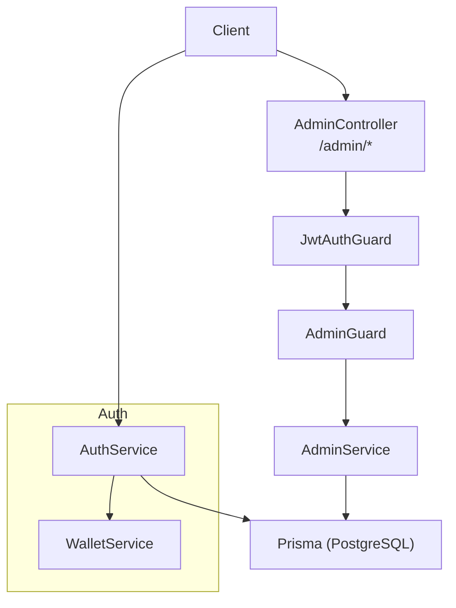
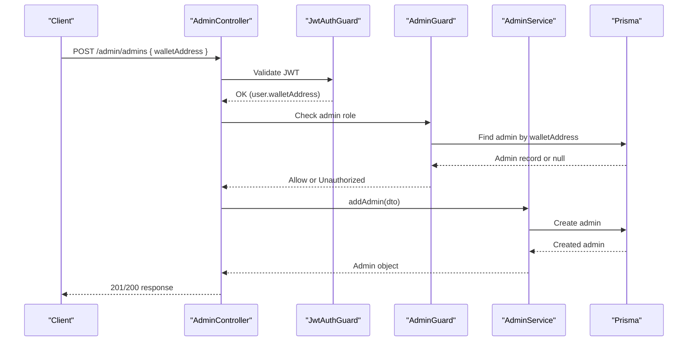
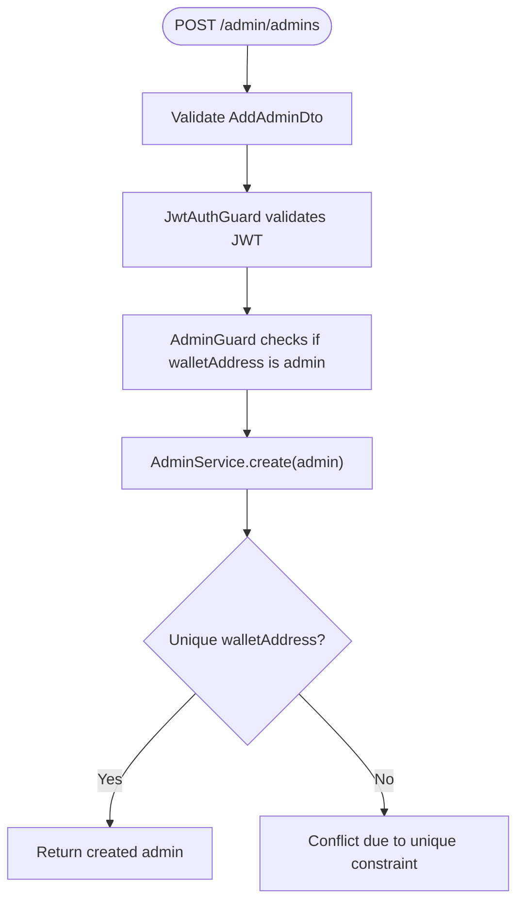
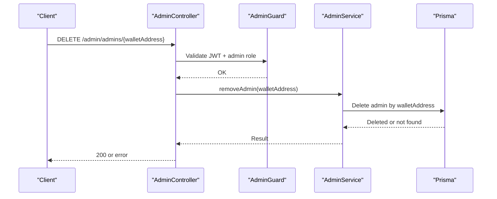
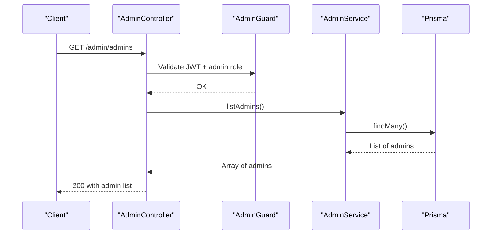
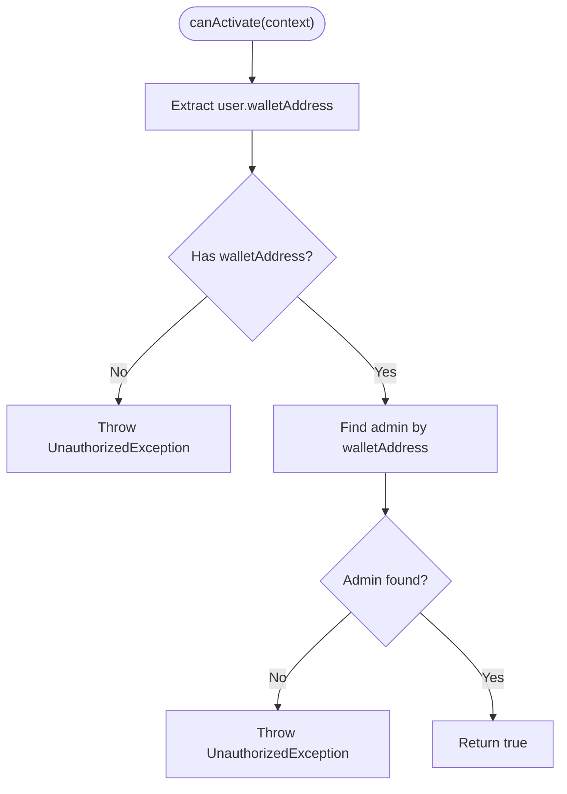
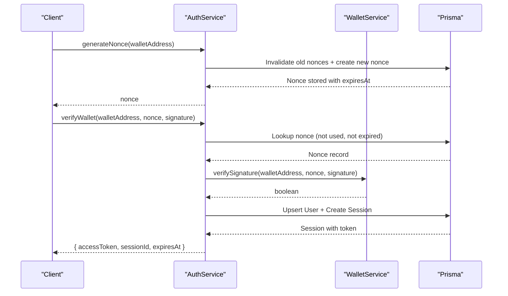
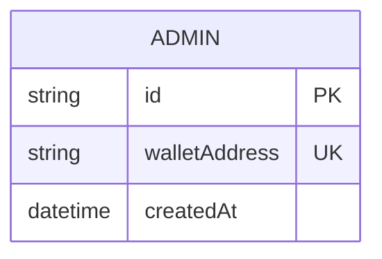
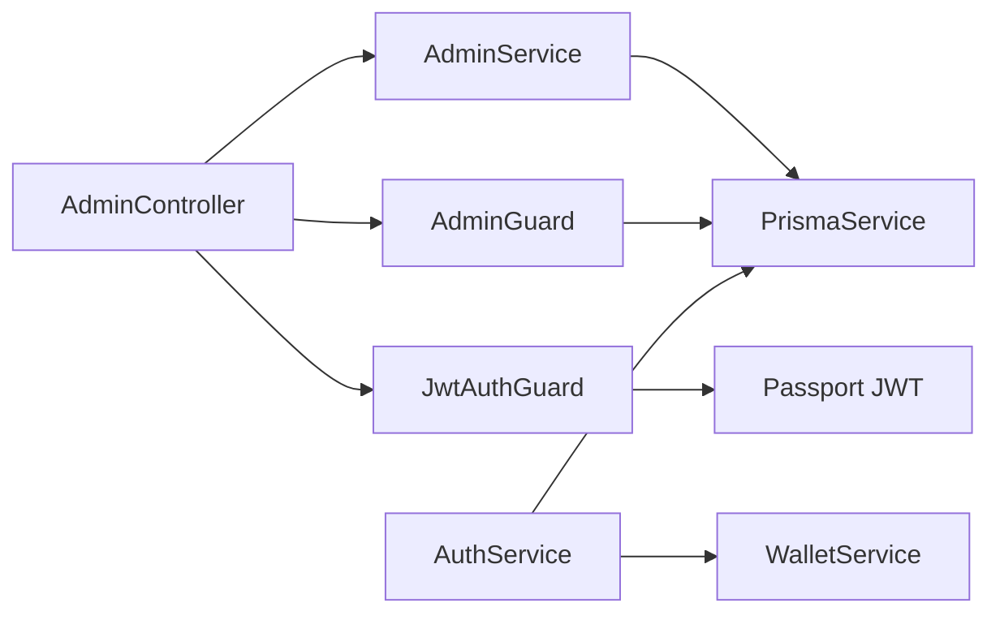

# Role Management

<cite>
**Referenced Files in This Document**
- [admin.controller.ts](file://veilend-backend/src/admin/admin.controller.ts)
- [admin.service.ts](file://veilend-backend/src/admin/admin.service.ts)
- [add-admin.dto.ts](file://veilend-backend/src/admin/dto/add-admin.dto.ts)
- [configure-asset.dto.ts](file://veilend-backend/src/admin/dto/configure-asset.dto.ts)
- [set-oracle-price.dto.ts](file://veilend-backend/src/admin/dto/set-oracle-price.dto.ts)
- [set-min-collateral-ratio.dto.ts](file://veilend-backend/src/admin/dto/set-min-collateral-ratio.dto.ts)
- [admin.guard.ts](file://veilend-backend/src/auth/admin.guard.ts)
- [jwt-auth.guard.ts](file://veilend-backend/src/auth/jwt-auth.guard.ts)
- [auth.service.ts](file://veilend-backend/src/auth/auth.service.ts)
- [wallet.service.ts](file://veilend-backend/src/wallet/wallet.service.ts)
- [schema.prisma](file://veilend-backend/prisma/schema.prisma)
- [main.ts](file://veilend-backend/src/main.ts)
</cite>

## Table of Contents
1. Introduction
2. Project Structure
3. Core Components
4. Architecture Overview
5. Detailed Component Analysis
6. Dependency Analysis
7. Performance Considerations
8. Troubleshooting Guide
9. Conclusion

## Introduction
This document explains VeilLend’s administrative role management system. It covers how administrators are added, removed, and listed; how role-based access control is enforced via AdminGuard; the authentication flow that binds a wallet to a session; and the data model for admins. It also addresses edge cases such as duplicate admin roles and removing the last administrator, and provides guidance on security measures including signature verification and audit considerations.

## Project Structure
The administrative role management functionality is implemented in the backend module under src/admin with supporting authentication and authorization in src/auth and src/wallet, and persistence via Prisma schema.

**Diagram sources**
- [admin.controller.ts:20-39](file://veilend-backend/src/admin/admin.controller.ts#L20-L39)
- [jwt-auth.guard.ts:1-6](file://veilend-backend/src/auth/jwt-auth.guard.ts#L1-L6)
- [admin.guard.ts:24-45](file://veilend-backend/src/auth/admin.guard.ts#L24-L45)
- [admin.service.ts:12-28](file://veilend-backend/src/admin/admin.service.ts#L12-L28)
- [auth.service.ts:36-148](file://veilend-backend/src/auth/auth.service.ts#L36-L148)
- [wallet.service.ts:5-15](file://veilend-backend/src/wallet/wallet.service.ts#L5-L15)
- [schema.prisma:179-185](file://veilend-backend/prisma/schema.prisma#L179-L185)

**Section sources**
- [admin.controller.ts:20-39](file://veilend-backend/src/admin/admin.controller.ts#L20-L39)
- [admin.service.ts:12-28](file://veilend-backend/src/admin/admin.service.ts#L12-L28)
- [auth.service.ts:36-148](file://veilend-backend/src/auth/auth.service.ts#L36-L148)
- [wallet.service.ts:5-15](file://veilend-backend/src/wallet/wallet.service.ts#L5-L15)
- [schema.prisma:179-185](file://veilend-backend/prisma/schema.prisma#L179-L185)

## Core Components
- AdminController exposes endpoints to add, remove, and list administrators, plus other admin operations. All admin routes require JWT authentication and admin role checks.
- AdminService performs CRUD operations against the Admin table via Prisma.
- AdminGuard enforces that the authenticated user’s wallet address exists in the Admin table before allowing access.
- JwtAuthGuard validates the JWT issued by AuthService after successful wallet signature verification.
- AuthService issues sessions using a nonce-and-signature flow and persists sessions and nonces.
- WalletService verifies Stellar signatures used during authentication.
- Prisma schema defines the Admin model with a unique walletAddress constraint.

**Section sources**
- [admin.controller.ts:20-54](file://veilend-backend/src/admin/admin.controller.ts#L20-L54)
- [admin.service.ts:12-28](file://veilend-backend/src/admin/admin.service.ts#L12-L28)
- [admin.guard.ts:24-45](file://veilend-backend/src/auth/admin.guard.ts#L24-L45)
- [jwt-auth.guard.ts:1-6](file://veilend-backend/src/auth/jwt-auth.guard.ts#L1-L6)
- [auth.service.ts:36-148](file://veilend-backend/src/auth/auth.service.ts#L36-L148)
- [wallet.service.ts:5-15](file://veilend-backend/src/wallet/wallet.service.ts#L5-L15)
- [schema.prisma:179-185](file://veilend-backend/prisma/schema.prisma#L179-L185)

## Architecture Overview
Administrative endpoints are protected by two layers:
- Authentication: JwtAuthGuard ensures a valid JWT from AuthService.
- Authorization: AdminGuard ensures the request’s wallet address is registered as an admin.

**Diagram sources**
- [admin.controller.ts:26-29](file://veilend-backend/src/admin/admin.controller.ts#L26-L29)
- [jwt-auth.guard.ts:1-6](file://veilend-backend/src/auth/jwt-auth.guard.ts#L1-L6)
- [admin.guard.ts:28-45](file://veilend-backend/src/auth/admin.guard.ts#L28-L45)
- [admin.service.ts:12-18](file://veilend-backend/src/admin/admin.service.ts#L12-L18)
- [schema.prisma:179-185](file://veilend-backend/prisma/schema.prisma#L179-L185)

## Detailed Component Analysis

### Adding Administrators (AddAdminDto)
- Endpoint: POST /admin/admins
- Request body: AddAdminDto containing walletAddress (validated as string).
- Flow:
  - JwtAuthGuard validates the JWT and attaches user.walletAddress.
  - AdminGuard verifies the walletAddress is present in the Admin table.
  - AdminService creates a new Admin record with the provided walletAddress.
- Validation:
  - Global ValidationPipe whitelists DTO fields and forbids extra properties.
  - AddAdminDto enforces walletAddress is a string.
- Notes:
  - There is no explicit wallet format validation beyond string type.
  - Duplicate walletAddress will fail due to the unique constraint on Admin.walletAddress.

**Diagram sources**
- [admin.controller.ts:26-29](file://veilend-backend/src/admin/admin.controller.ts#L26-L29)
- [add-admin.dto.ts:3-6](file://veilend-backend/src/admin/dto/add-admin.dto.ts#L3-L6)
- [admin.guard.ts:28-45](file://veilend-backend/src/auth/admin.guard.ts#L28-L45)
- [admin.service.ts:12-18](file://veilend-backend/src/admin/admin.service.ts#L12-L18)
- [schema.prisma:179-185](file://veilend-backend/prisma/schema.prisma#L179-L185)

**Section sources**
- [admin.controller.ts:26-29](file://veilend-backend/src/admin/admin.controller.ts#L26-L29)
- [add-admin.dto.ts:3-6](file://veilend-backend/src/admin/dto/add-admin.dto.ts#L3-L6)
- [admin.service.ts:12-18](file://veilend-backend/src/admin/admin.service.ts#L12-L18)
- [schema.prisma:179-185](file://veilend-backend/prisma/schema.prisma#L179-L185)

### Removing Administrators
- Endpoint: DELETE /admin/admins/:walletAddress
- Flow:
  - Requires JWT and admin role.
  - AdminService deletes the Admin record matching walletAddress.
- Edge case:
  - If no admin exists with that walletAddress, Prisma will raise a not-found error.
  - The code does not enforce a minimum number of admins; deleting the last admin is allowed at this layer.

**Diagram sources**
- [admin.controller.ts:31-34](file://veilend-backend/src/admin/admin.controller.ts#L31-L34)
- [admin.service.ts:20-24](file://veilend-backend/src/admin/admin.service.ts#L20-L24)

**Section sources**
- [admin.controller.ts:31-34](file://veilend-backend/src/admin/admin.controller.ts#L31-L34)
- [admin.service.ts:20-24](file://veilend-backend/src/admin/admin.service.ts#L20-L24)

### Listing Administrators
- Endpoint: GET /admin/admins
- Flow:
  - Requires JWT and admin role.
  - AdminService returns all Admin records.
- Use case:
  - Enumerates current administrators by their wallet addresses.

**Diagram sources**
- [admin.controller.ts:36-39](file://veilend-backend/src/admin/admin.controller.ts#L36-L39)
- [admin.service.ts:26-28](file://veilend-backend/src/admin/admin.service.ts#L26-L28)

**Section sources**
- [admin.controller.ts:36-39](file://veilend-backend/src/admin/admin.controller.ts#L36-L39)
- [admin.service.ts:26-28](file://veilend-backend/src/admin/admin.service.ts#L26-L28)

### AdminGuard Implementation (Role-Based Access Control)
- Purpose: Ensures only wallets registered in the Admin table can access protected endpoints.
- Behavior:
  - Reads user.walletAddress from the request (populated by JwtAuthGuard).
  - Looks up the admin by walletAddress.
  - Throws UnauthorizedException if missing or not found.

**Diagram sources**
- [admin.guard.ts:24-45](file://veilend-backend/src/auth/admin.guard.ts#L24-L45)

**Section sources**
- [admin.guard.ts:24-45](file://veilend-backend/src/auth/admin.guard.ts#L24-L45)

### Authentication Flow and Session Management
- Nonce generation: Generates a cryptographic nonce, stores it with expiry, and invalidates prior unused nonces.
- Signature verification: Verifies the client’s Stellar signature over the nonce using WalletService.
- Session issuance: Creates or updates a User, signs a JWT, and persists a Session with expiration.
- Session validation: Validates active sessions by token and refreshes lastSeenAt.

**Diagram sources**
- [auth.service.ts:36-148](file://veilend-backend/src/auth/auth.service.ts#L36-L148)
- [wallet.service.ts:5-15](file://veilend-backend/src/wallet/wallet.service.ts#L5-L15)
- [schema.prisma:12-42](file://veilend-backend/prisma/schema.prisma#L12-L42)

**Section sources**
- [auth.service.ts:36-148](file://veilend-backend/src/auth/auth.service.ts#L36-L148)
- [wallet.service.ts:5-15](file://veilend-backend/src/wallet/wallet.service.ts#L5-L15)
- [schema.prisma:12-42](file://veilend-backend/prisma/schema.prisma#L12-L42)

### Data Model for Admins
- Admin table:
  - id: primary key
  - walletAddress: unique identifier for an admin
  - createdAt: timestamp
- Unique constraint on walletAddress prevents duplicate admin entries.

**Diagram sources**
- [schema.prisma:179-185](file://veilend-backend/prisma/schema.prisma#L179-L185)

**Section sources**
- [schema.prisma:179-185](file://veilend-backend/prisma/schema.prisma#L179-L185)

### Security Measures
- Multi-signature requirements: Not implemented in the current admin role management endpoints. Only single-wallet signatures are used for authentication; there is no multi-sig enforcement for adding/removing admins.
- Audit trails: No dedicated audit log table or event emission for role changes is present in the analyzed code. Changes to the Admin table are performed directly without explicit logging hooks.
- Input validation: Global ValidationPipe whitelists DTO fields and forbids unknown fields. DTOs validate types and constraints where applicable.
- Signature verification: WalletService verifies Stellar signatures for authentication.

**Section sources**
- [main.ts:12-16](file://veilend-backend/src/main.ts#L12-L16)
- [wallet.service.ts:5-15](file://veilend-backend/src/wallet/wallet.service.ts#L5-L15)

### Example API Calls and Patterns
- Add an administrator:
  - Method: POST
  - Path: /admin/admins
  - Headers: Authorization: Bearer <JWT>
  - Body: { "walletAddress": "<stellar-address>" }
  - Expected behavior: Creates a new admin if walletAddress is not already an admin; fails on duplicate due to unique constraint.
- Remove an administrator:
  - Method: DELETE
  - Path: /admin/admins/<walletAddress>
  - Headers: Authorization: Bearer <JWT>
  - Expected behavior: Deletes the admin entry for the specified walletAddress; may return not found if absent.
- List administrators:
  - Method: GET
  - Path: /admin/admins
  - Headers: Authorization: Bearer <JWT>
  - Expected behavior: Returns all registered admin wallet addresses.

Note: Ensure you obtain a valid JWT by authenticating first via the auth flow described above.

[No sources needed since this section provides usage patterns without analyzing specific files]

## Dependency Analysis
- Controller depends on AdminService and guards.
- AdminService depends on PrismaService and interacts with the Admin table.
- AdminGuard depends on PrismaService to check admin membership.
- JwtAuthGuard depends on Passport/JWT strategy configured elsewhere.
- AuthService depends on WalletService for signature verification and PrismaService for nonces, users, and sessions.

**Diagram sources**
- [admin.controller.ts:20-54](file://veilend-backend/src/admin/admin.controller.ts#L20-L54)
- [admin.service.ts:1-10](file://veilend-backend/src/admin/admin.service.ts#L1-L10)
- [admin.guard.ts:24-45](file://veilend-backend/src/auth/admin.guard.ts#L24-L45)
- [jwt-auth.guard.ts:1-6](file://veilend-backend/src/auth/jwt-auth.guard.ts#L1-L6)
- [auth.service.ts:19-27](file://veilend-backend/src/auth/auth.service.ts#L19-L27)
- [wallet.service.ts:5-15](file://veilend-backend/src/wallet/wallet.service.ts#L5-L15)

**Section sources**
- [admin.controller.ts:20-54](file://veilend-backend/src/admin/admin.controller.ts#L20-L54)
- [admin.service.ts:1-10](file://veilend-backend/src/admin/admin.service.ts#L1-L10)
- [admin.guard.ts:24-45](file://veilend-backend/src/auth/admin.guard.ts#L24-L45)
- [jwt-auth.guard.ts:1-6](file://veilend-backend/src/auth/jwt-auth.guard.ts#L1-L6)
- [auth.service.ts:19-27](file://veilend-backend/src/auth/auth.service.ts#L19-L27)
- [wallet.service.ts:5-15](file://veilend-backend/src/wallet/wallet.service.ts#L5-L15)

## Performance Considerations
- Admin lookups are O(1) per request due to indexed walletAddress queries.
- Session validation includes a database touch on lastSeenAt; consider caching strategies if high throughput is required.
- Avoid excessive admin listing calls; paginate if the admin set grows large.

[No sources needed since this section provides general guidance]

## Troubleshooting Guide
Common errors and causes:
- UnauthorizedException: No user authenticated
  - Cause: Missing or invalid JWT; ensure proper Authorization header.
  - Source: AdminGuard when user.walletAddress is missing.
- UnauthorizedException: User is not an admin
  - Cause: Authenticated wallet not present in Admin table.
  - Source: AdminGuard when admin lookup fails.
- Conflict on adding admin
  - Cause: Duplicate walletAddress violates unique constraint.
  - Source: Prisma unique constraint on Admin.walletAddress.
- Not found on removing admin
  - Cause: Deleting a walletAddress that is not an admin.
  - Source: Prisma delete operation with no matching record.

**Section sources**
- [admin.guard.ts:28-45](file://veilend-backend/src/auth/admin.guard.ts#L28-L45)
- [schema.prisma:179-185](file://veilend-backend/prisma/schema.prisma#L179-L185)

## Conclusion
VeilLend’s admin role management uses a straightforward model: authenticate via wallet signature, enforce admin-only access through AdminGuard, and persist admin identities in a simple Admin table. While effective, the current implementation lacks multi-signature controls and explicit audit trails for role changes. For production hardening, consider adding:
- Multi-signature approval workflows for sensitive admin actions.
- An audit log table to record who changed admin roles and when.
- Explicit validation for Stellar address formats in AddAdminDto.
- Business rules to prevent removing the last administrator.

[No sources needed since this section summarizes without analyzing specific files]