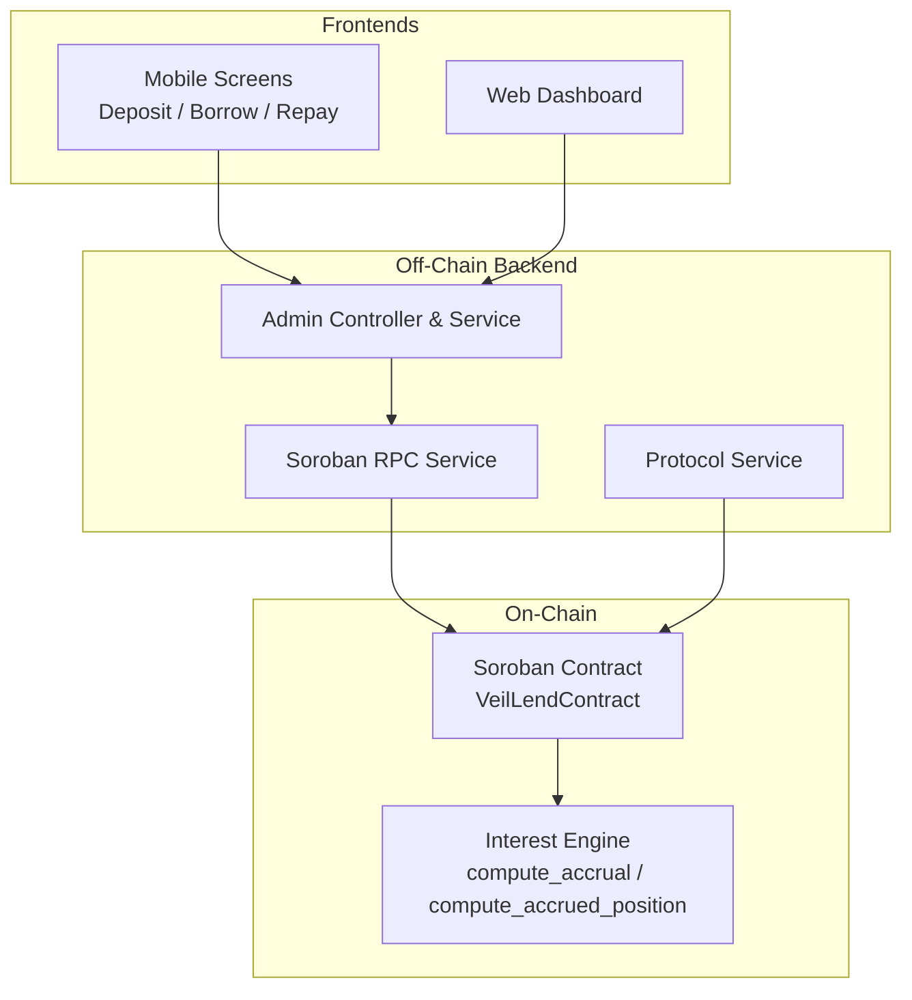
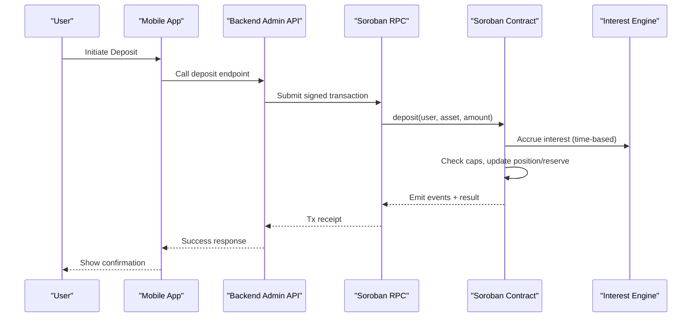
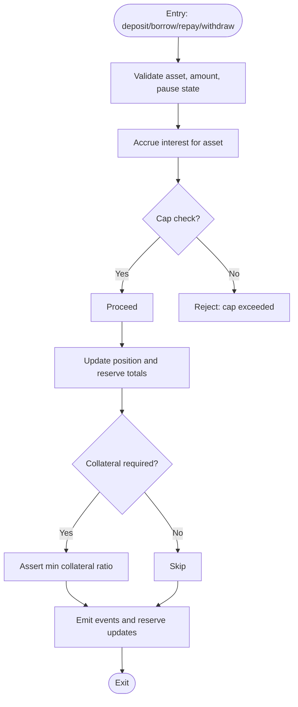
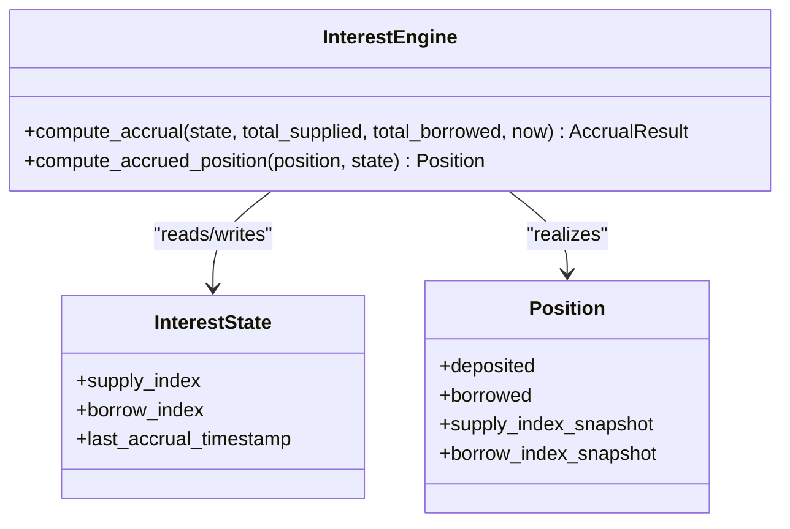
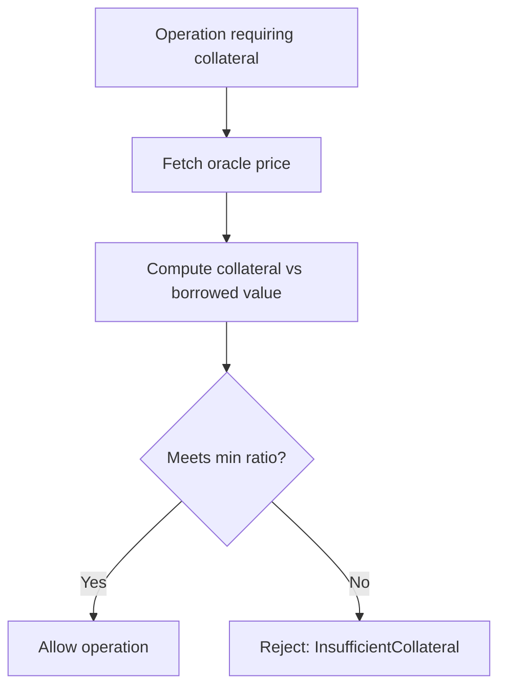
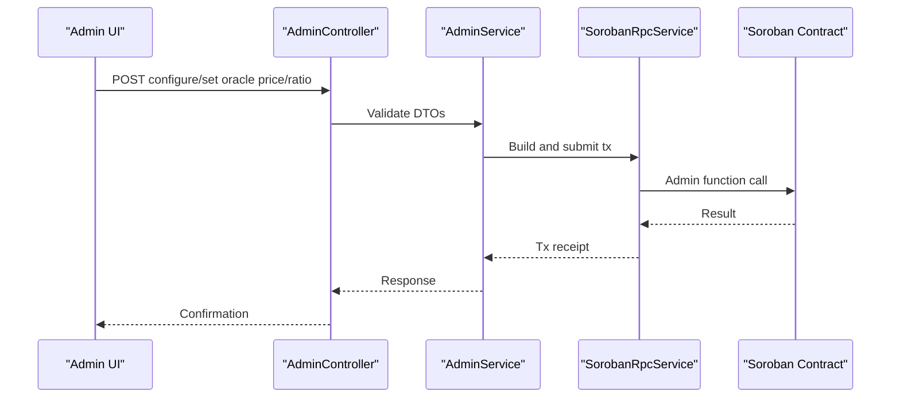
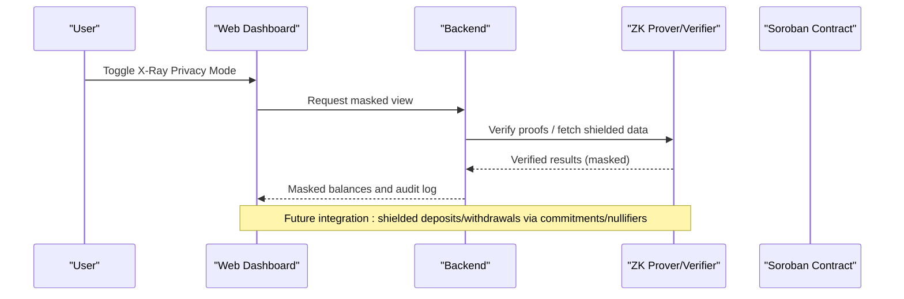
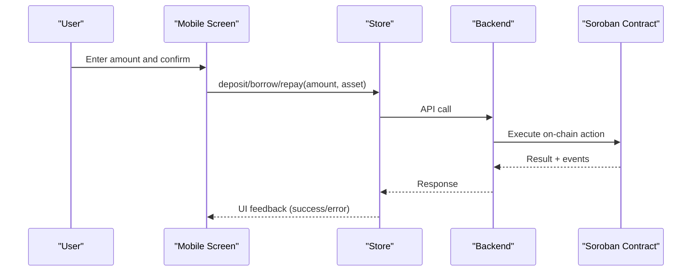
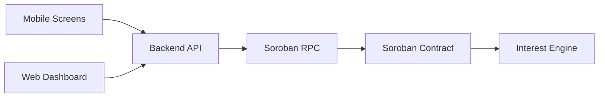

# Core Features

<cite>
**Referenced Files in This Document**
- [lib.rs](file://veilend-soroban/src/lib.rs)
- [interest.rs](file://veilend-soroban/src/interest.rs)
- [admin.controller.ts](file://veilend-backend/src/admin/admin.controller.ts)
- [admin.service.ts](file://veilend-backend/src/admin/admin.service.ts)
- [protocol.service.ts](file://veilend-backend/src/protocol/protocol.service.ts)
- [soroban-rpc.service.ts](file://veilend-backend/src/stellar/soroban-rpc.service.ts)
- [DepositScreen.tsx](file://veilend-mobile/src/screens/DepositScreen.tsx)
- [BorrowScreen.tsx](file://veilend-mobile/src/screens/BorrowScreen.tsx)
- [RepayScreen.tsx](file://veilend-mobile/src/screens/RepayScreen.tsx)
- [dashboard page.tsx](file://veilend-web/src/app/(dashboard)/page.tsx)
- [README.md](file://README.md)
</cite>

## Table of Contents
1. [Introduction](#introduction)
2. [Project Structure](#project-structure)
3. [Core Components](#core-components)
4. [Architecture Overview](#architecture-overview)
5. [Detailed Component Analysis](#detailed-component-analysis)
6. [Dependency Analysis](#dependency-analysis)
7. [Performance Considerations](#performance-considerations)
8. [Troubleshooting Guide](#troubleshooting-guide)
9. [Conclusion](#conclusion)

## Introduction
This document explains the core features of the VeilLend protocol, focusing on:
- Lending and borrowing workflows (deposits, borrows, repayments, withdrawals)
- Collateral management and interest accrual
- Risk controls (collateral ratio enforcement, circuit breaker, asset caps)
- Administrative capabilities (asset configuration, oracle price management, monitoring)
- Privacy features (X-Ray privacy mode, balance masking, shielded transactions via zero-knowledge proofs)
- The relationship between on-chain Soroban logic and off-chain backend services and user interfaces (mobile and web)

## Project Structure
VeilLend is composed of:
- On-chain Soroban smart contract implementing lending, risk controls, and interest math
- Backend API (NestJS) for admin operations, protocol configuration, and indexing
- Mobile app screens for deposit, borrow, and repay flows
- Web dashboard with privacy-focused UI elements and status indicators

**Diagram sources**
- [lib.rs:229-719](file://veilend-soroban/src/lib.rs#L229-L719)
- [interest.rs:51-120](file://veilend-soroban/src/interest.rs#L51-L120)
- [admin.controller.ts:20-55](file://veilend-backend/src/admin/admin.controller.ts#L20-L55)
- [protocol.service.ts:52-79](file://veilend-backend/src/protocol/protocol.service.ts#L52-L79)
- [soroban-rpc.service.ts:17-80](file://veilend-backend/src/stellar/soroban-rpc.service.ts#L17-L80)
- [DepositScreen.tsx:69-81](file://veilend-mobile/src/screens/DepositScreen.tsx#L69-L81)
- [BorrowScreen.tsx:70-82](file://veilend-mobile/src/screens/BorrowScreen.tsx#L70-L82)
- [RepayScreen.tsx:68-80](file://veilend-mobile/src/screens/RepayScreen.tsx#L68-L80)
- [dashboard page.tsx:133-298](file://veilend-web/src/app/(dashboard)/page.tsx#L133-L298)

**Section sources**
- [lib.rs:229-719](file://veilend-soroban/src/lib.rs#L229-L719)
- [interest.rs:51-120](file://veilend-soroban/src/interest.rs#L51-L120)
- [admin.controller.ts:20-55](file://veilend-backend/src/admin/admin.controller.ts#L20-L55)
- [protocol.service.ts:52-79](file://veilend-backend/src/protocol/protocol.service.ts#L52-L79)
- [soroban-rpc.service.ts:17-80](file://veilend-backend/src/stellar/soroban-rpc.service.ts#L17-L80)
- [DepositScreen.tsx:69-81](file://veilend-mobile/src/screens/DepositScreen.tsx#L69-L81)
- [BorrowScreen.tsx:70-82](file://veilend-mobile/src/screens/BorrowScreen.tsx#L70-L82)
- [RepayScreen.tsx:68-80](file://veilend-mobile/src/screens/RepayScreen.tsx#L68-L80)
- [dashboard page.tsx:133-298](file://veilend-web/src/app/(dashboard)/page.tsx#L133-L298)

## Core Components
- Soroban contract exposes deposit, borrow, repay, withdraw, interest accrual, asset configuration, oracle pricing, caps, and circuit breaker controls.
- Interest engine computes time-based supply/borrow indices and per-position realized balances.
- Backend provides admin endpoints to configure assets, set oracle prices, and adjust collateral ratios; protocol service exposes network and risk parameters; RPC service connects to Soroban.
- Mobile screens implement user-facing deposit, borrow, and repay flows with validation and feedback.
- Web dashboard visualizes shielded balances, debt/collateral metrics, and cryptographic activity logs.

**Section sources**
- [lib.rs:229-719](file://veilend-soroban/src/lib.rs#L229-L719)
- [interest.rs:51-120](file://veilend-soroban/src/interest.rs#L51-L120)
- [admin.controller.ts:20-55](file://veilend-backend/src/admin/admin.controller.ts#L20-L55)
- [protocol.service.ts:52-79](file://veilend-backend/src/protocol/protocol.service.ts#L52-L79)
- [soroban-rpc.service.ts:17-80](file://veilend-backend/src/stellar/soroban-rpc.service.ts#L17-L80)
- [DepositScreen.tsx:69-81](file://veilend-mobile/src/screens/DepositScreen.tsx#L69-L81)
- [BorrowScreen.tsx:70-82](file://veilend-mobile/src/screens/BorrowScreen.tsx#L70-L82)
- [RepayScreen.tsx:68-80](file://veilend-mobile/src/screens/RepayScreen.tsx#L68-L80)
- [dashboard page.tsx:133-298](file://veilend-web/src/app/(dashboard)/page.tsx#L133-L298)

## Architecture Overview
The system enforces safety and transparency through on-chain rules while providing off-chain tooling for administration and user experience.

**Diagram sources**
- [lib.rs:483-519](file://veilend-soroban/src/lib.rs#L483-L519)
- [interest.rs:51-87](file://veilend-soroban/src/interest.rs#L51-L87)
- [DepositScreen.tsx:69-81](file://veilend-mobile/src/screens/DepositScreen.tsx#L69-L81)
- [soroban-rpc.service.ts:17-80](file://veilend-backend/src/stellar/soroban-rpc.service.ts#L17-L80)

## Detailed Component Analysis

### Lending and Borrowing Workflows
- Deposit: Validates supported asset, positive amount, not paused, accrues interest, checks deposit cap, updates position and reserve totals, emits events.
- Borrow: Similar preconditions, accrues interest, checks borrow cap, ensures sufficient reserve, updates position/reserve, asserts collateralization, emits events.
- Repay: Allowed even when paused, accrues interest, validates amount against outstanding debt, updates position/reserve and totals, emits events.
- Withdraw: Allowed even when paused, accrues interest, validates against deposited balance and reserve, updates position/reserve and totals, asserts collateralization, emits events.

**Diagram sources**
- [lib.rs:483-639](file://veilend-soroban/src/lib.rs#L483-L639)
- [lib.rs:867-934](file://veilend-soroban/src/lib.rs#L867-L934)

**Section sources**
- [lib.rs:483-639](file://veilend-soroban/src/lib.rs#L483-L639)
- [lib.rs:867-934](file://veilend-soroban/src/lib.rs#L867-L934)

### Interest Accrual Mechanisms
- Time-based accrual advances supply and borrow indices based on utilization and elapsed time.
- Per-position realization applies index deltas to user balances and re-anchors snapshots.
- Index math uses fixed-point scaling to avoid floating point issues.

**Diagram sources**
- [interest.rs:51-120](file://veilend-soroban/src/interest.rs#L51-L120)
- [lib.rs:655-677](file://veilend-soroban/src/lib.rs#L655-L677)

**Section sources**
- [interest.rs:51-120](file://veilend-soroban/src/interest.rs#L51-L120)
- [lib.rs:655-677](file://veilend-soroban/src/lib.rs#L655-L677)

### Collateral Management and Risk Controls
- Minimum collateral ratio enforced at borrow and withdraw steps using oracle price.
- Circuit breaker allows pausing new deposits/borrows while allowing repay/withdraw.
- Asset caps limit total deposits and borrows per asset; unlimited when set to a sentinel value.

**Diagram sources**
- [lib.rs:913-934](file://veilend-soroban/src/lib.rs#L913-L934)

**Section sources**
- [lib.rs:913-934](file://veilend-soroban/src/lib.rs#L913-L934)

### Administrative Capabilities
- Configure assets (enable/disable), set oracle prices, update minimum collateral ratio, manage admins.
- Protocol service exposes network and risk parameters used by frontends.
- RPC service manages connection health to Soroban.

**Diagram sources**
- [admin.controller.ts:20-55](file://veilend-backend/src/admin/admin.controller.ts#L20-L55)
- [admin.service.ts:30-55](file://veilend-backend/src/admin/admin.service.ts#L30-L55)
- [soroban-rpc.service.ts:17-80](file://veilend-backend/src/stellar/soroban-rpc.service.ts#L17-L80)
- [lib.rs:260-331](file://veilend-soroban/src/lib.rs#L260-L331)

**Section sources**
- [admin.controller.ts:20-55](file://veilend-backend/src/admin/admin.controller.ts#L20-L55)
- [admin.service.ts:30-55](file://veilend-backend/src/admin/admin.service.ts#L30-L55)
- [protocol.service.ts:52-79](file://veilend-backend/src/protocol/protocol.service.ts#L52-L79)
- [soroban-rpc.service.ts:17-80](file://veilend-backend/src/stellar/soroban-rpc.service.ts#L17-L80)
- [lib.rs:260-331](file://veilend-soroban/src/lib.rs#L260-L331)

### Privacy Features: X-Ray Mode, Balance Masking, Shielded Transactions
- X-Ray privacy mode is designed to mask balances and positions; the mobile README documents the toggle and intent.
- The web dashboard includes sections for “Shielded Liquidity Balances” and a “Cryptographic Ledger Audit Log,” indicating integration points for zero-knowledge proof verification and private transfers.
- Legacy backend contains DTOs for shielded pool interactions (commitments, nullifiers, merkle proofs), indicating where ZK-backed deposit/withdraw flows would be wired into the backend.

**Diagram sources**
- [README.md:88-109](file://README.md#L88-L109)
- [dashboard page.tsx:133-298](file://veilend-web/src/app/(dashboard)/page.tsx#L133-L298)

**Section sources**
- [README.md:88-109](file://README.md#L88-L109)
- [dashboard page.tsx:133-298](file://veilend-web/src/app/(dashboard)/page.tsx#L133-L298)

### User Interaction Examples (Mobile and Web)
- Mobile Deposit: Users select an asset, input amount, validate locally, and submit via store method; success or mock offline flow is shown.
- Mobile Borrow: Users choose asset, enforce available-to-borrow limits, and submit borrow request.
- Mobile Repay: Users list active loans, input repayment amounts, and submit repay requests.
- Web Dashboard: Displays shielded balances, debt/collateral metrics, and cryptographic activity logs.

**Diagram sources**
- [DepositScreen.tsx:69-81](file://veilend-mobile/src/screens/DepositScreen.tsx#L69-L81)
- [BorrowScreen.tsx:70-82](file://veilend-mobile/src/screens/BorrowScreen.tsx#L70-L82)
- [RepayScreen.tsx:68-80](file://veilend-mobile/src/screens/RepayScreen.tsx#L68-L80)

**Section sources**
- [DepositScreen.tsx:69-81](file://veilend-mobile/src/screens/DepositScreen.tsx#L69-L81)
- [BorrowScreen.tsx:70-82](file://veilend-mobile/src/screens/BorrowScreen.tsx#L70-L82)
- [RepayScreen.tsx:68-80](file://veilend-mobile/src/screens/RepayScreen.tsx#L68-L80)
- [dashboard page.tsx:133-298](file://veilend-web/src/app/(dashboard)/page.tsx#L133-L298)

## Dependency Analysis
Key dependencies and relationships:
- Frontends depend on backend APIs for actions and configuration.
- Backend depends on Soroban RPC for on-chain interactions and Prisma for persistence.
- Soroban contract depends on interest engine for accrual math and stores state for positions, reserves, caps, and oracle prices.

**Diagram sources**
- [DepositScreen.tsx:69-81](file://veilend-mobile/src/screens/DepositScreen.tsx#L69-L81)
- [BorrowScreen.tsx:70-82](file://veilend-mobile/src/screens/BorrowScreen.tsx#L70-L82)
- [RepayScreen.tsx:68-80](file://veilend-mobile/src/screens/RepayScreen.tsx#L68-L80)
- [admin.controller.ts:20-55](file://veilend-backend/src/admin/admin.controller.ts#L20-L55)
- [soroban-rpc.service.ts:17-80](file://veilend-backend/src/stellar/soroban-rpc.service.ts#L17-L80)
- [lib.rs:229-719](file://veilend-soroban/src/lib.rs#L229-L719)
- [interest.rs:51-120](file://veilend-soroban/src/interest.rs#L51-L120)

**Section sources**
- [lib.rs:229-719](file://veilend-soroban/src/lib.rs#L229-L719)
- [interest.rs:51-120](file://veilend-soroban/src/interest.rs#L51-L120)
- [admin.controller.ts:20-55](file://veilend-backend/src/admin/admin.controller.ts#L20-L55)
- [soroban-rpc.service.ts:17-80](file://veilend-backend/src/stellar/soroban-rpc.service.ts#L17-L80)

## Performance Considerations
- Interest accrual is idempotent and only advances when ledger timestamp increases; read-only views simulate accrual without writes.
- Caps and collateral checks are performed before state mutations to minimize failed transactions.
- Backend caches protocol configuration to reduce repeated reads.

[No sources needed since this section provides general guidance]

## Troubleshooting Guide
Common errors and their meanings:
- UnsupportedAsset: Asset not enabled in contract.
- InvalidAmount/ZeroAmount: Amount must be positive and non-zero.
- InsufficientCollateral: Post-operation collateral ratio below minimum.
- InsufficientDeposit/RepayTooLarge: Attempted to withdraw more than deposited or repay more than owed.
- OraclePriceMissing: No oracle price set for asset.
- ContractPaused: Circuit breaker active; only repay/withdraw allowed.
- DepositCapExceeded/BorrowCapExceeded: Caps reached for asset.
- InvalidCap: Caps must be -1 (unlimited) or positive.
- InsufficientReserve: Not enough reserve balance for borrow/withdraw.

Operational checks:
- Ensure oracle prices are set for all supported assets.
- Monitor circuit breaker state; allow repay/withdraw during pauses.
- Validate asset caps and adjust as liquidity changes.

**Section sources**
- [lib.rs:107-145](file://veilend-soroban/src/lib.rs#L107-L145)
- [lib.rs:835-934](file://veilend-soroban/src/lib.rs#L835-L934)

## Conclusion
VeilLend’s core features combine robust on-chain logic with practical off-chain tooling:
- Clear deposit/borrow/repay/withdraw flows with interest accrual and collateral enforcement
- Risk controls via collateral ratios, circuit breaker, and asset caps
- Administrative endpoints for asset configuration, oracle pricing, and protocol monitoring
- Privacy-oriented UI and future-ready integration points for shielded transactions and zero-knowledge proofs
- Well-defined separation between frontend experiences, backend services, and Soroban contracts

[No sources needed since this section summarizes without analyzing specific files]