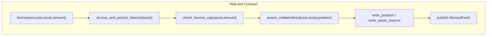
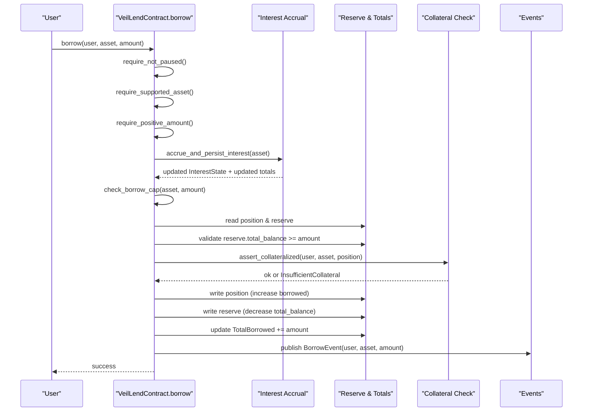
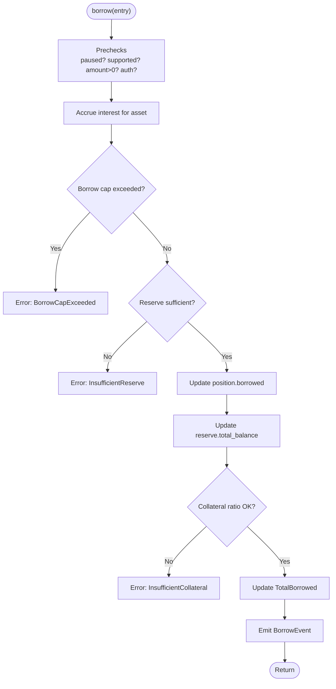
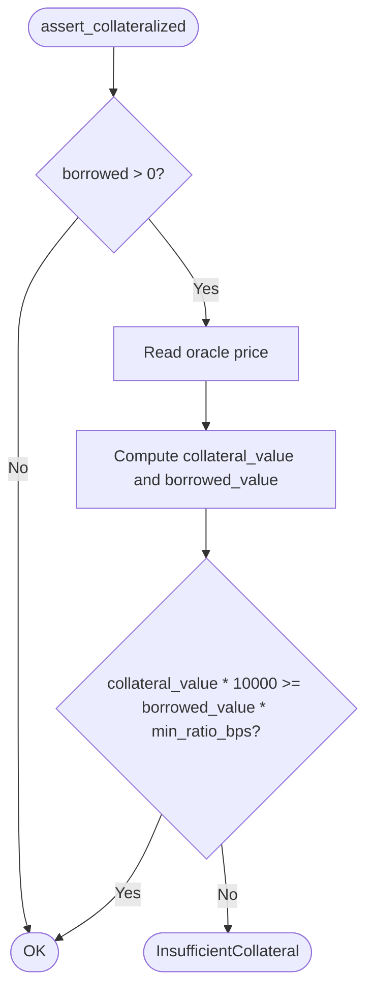
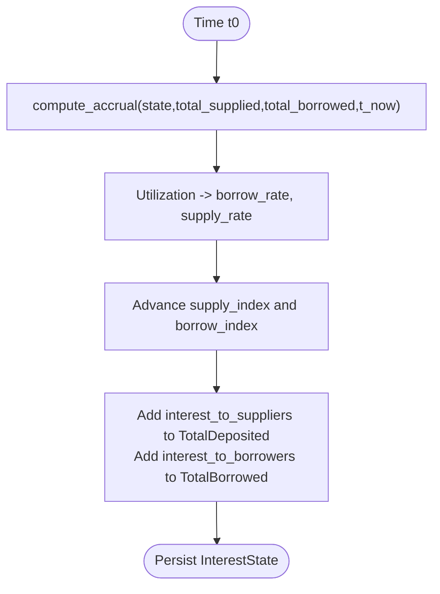
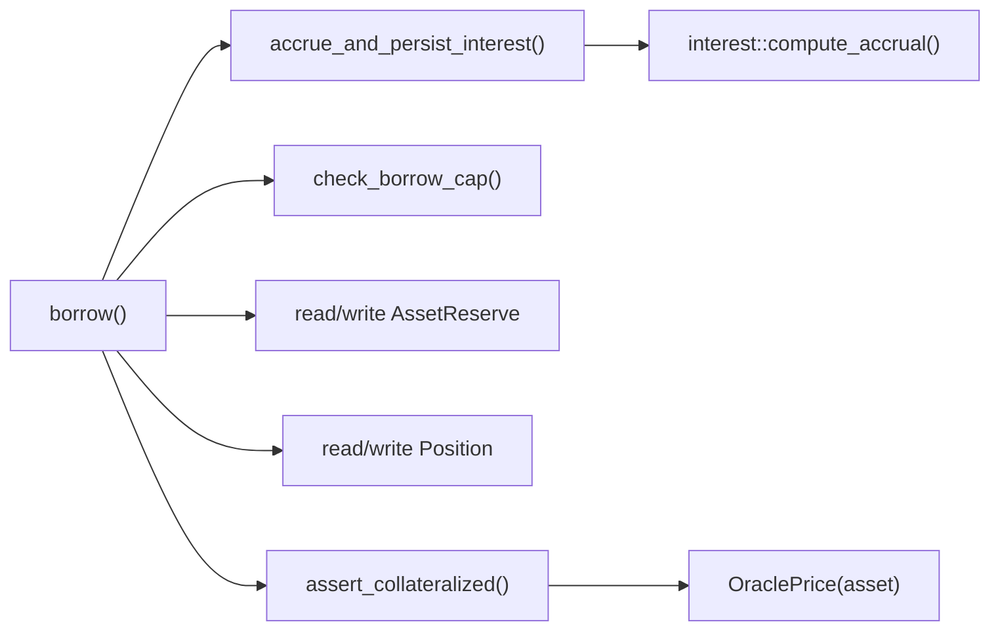

# Borrowing Process

<cite>
**Referenced Files in This Document**
- [lib.rs](file://veilend-soroban/src/lib.rs)
- [interest.rs](file://veilend-soroban/src/interest.rs)
- [integration.rs](file://veilend-soroban/tests/integration.rs)
</cite>

## Table of Contents
1. [Introduction](#introduction)
2. [Project Structure](#project-structure)
3. [Core Components](#core-components)
4. [Architecture Overview](#architecture-overview)
5. [Detailed Component Analysis](#detailed-component-analysis)
6. [Dependency Analysis](#dependency-analysis)
7. [Performance Considerations](#performance-considerations)
8. [Troubleshooting Guide](#troubleshooting-guide)
9. [Conclusion](#conclusion)

## Introduction
This document explains the VeilLend borrowing process on-chain: how users borrow assets against deposited collateral, how oracle prices and minimum collateral ratios are enforced, how interest accrues over time, and how protocol-level caps and reserves constrain borrowing. It also documents the BorrowEvent emission and how borrows affect total protocol borrows.

## Project Structure
The borrowing logic is implemented in the Soroban smart contract under veilend-soroban. The core contract exposes deposit/borrow/repay/withdraw entry points, enforces safety checks (pause, supported asset, positive amounts, caps, reserve availability), accrues time-based interest, and validates collateralization using an admin-set oracle price.

**Diagram sources**
- [lib.rs:521-560](file://veilend-soroban/src/lib.rs#L521-L560)
- [lib.rs:792-815](file://veilend-soroban/src/lib.rs#L792-L815)
- [lib.rs:890-910](file://veilend-soroban/src/lib.rs#L890-L910)
- [lib.rs:913-934](file://veilend-soroban/src/lib.rs#L913-L934)

**Section sources**
- [lib.rs:521-560](file://veilend-soroban/src/lib.rs#L521-L560)
- [lib.rs:792-815](file://veilend-soroban/src/lib.rs#L792-L815)
- [lib.rs:890-910](file://veilend-soroban/src/lib.rs#L890-L910)
- [lib.rs:913-934](file://veilend-soroban/src/lib.rs#L913-L934)

## Core Components
- Borrow entry point: orchestrates preconditions, interest accrual, cap checks, reserve validation, position updates, collateral ratio enforcement, totals update, and event emission.
- Interest accrual: advances per-asset supply/borrow indexes based on elapsed time and utilization; updates aggregate totals for deposited and borrowed amounts.
- Collateralization check: uses the configured oracle price to compute collateral value vs. borrowed value and enforces the minimum collateral ratio in basis points.
- Caps and pause controls: per-asset deposit/borrow caps and a global circuit breaker that can block new deposits/borrows while allowing repay/withdraw.

Key data structures involved:
- Position: tracks user’s deposited and borrowed balances plus snapshots of interest indexes.
- InterestState: tracks per-asset supply_index, borrow_index, and last_accrual_timestamp.
- AssetReserve: tracks total_balance and protocol_fees per asset.

**Section sources**
- [lib.rs:59-93](file://veilend-soroban/src/lib.rs#L59-L93)
- [lib.rs:70-79](file://veilend-soroban/src/lib.rs#L70-L79)
- [lib.rs:521-560](file://veilend-soroban/src/lib.rs#L521-L560)
- [lib.rs:792-815](file://veilend-soroban/src/lib.rs#L792-L815)
- [lib.rs:913-934](file://veilend-soroban/src/lib.rs#L913-L934)

## Architecture Overview
The borrow flow ensures protocol safety at every step:

**Diagram sources**
- [lib.rs:521-560](file://veilend-soroban/src/lib.rs#L521-L560)
- [lib.rs:792-815](file://veilend-soroban/src/lib.rs#L792-L815)
- [lib.rs:890-910](file://veilend-soroban/src/lib.rs#L890-L910)
- [lib.rs:913-934](file://veilend-soroban/src/lib.rs#L913-L934)

## Detailed Component Analysis

### Borrow Function Implementation
The borrow function performs the following steps in order:
1. Precondition checks: not paused, asset supported, amount positive, caller authenticated.
2. Accrue interest for the asset to ensure all totals and indexes reflect current time.
3. Enforce per-asset borrow cap.
4. Realize the user’s accrued position and read the asset reserve.
5. Validate that the reserve has enough liquidity to cover the borrow.
6. Update position (increase borrowed) and reserve (decrease available balance).
7. Enforce collateral ratio using the oracle price and minimum collateral ratio.
8. Persist position and reserve, then update TotalBorrowed.
9. Emit BorrowEvent and an asset reserve update event.

**Diagram sources**
- [lib.rs:521-560](file://veilend-soroban/src/lib.rs#L521-L560)
- [lib.rs:890-910](file://veilend-soroban/src/lib.rs#L890-L910)
- [lib.rs:913-934](file://veilend-soroban/src/lib.rs#L913-L934)

**Section sources**
- [lib.rs:521-560](file://veilend-soroban/src/lib.rs#L521-L560)
- [lib.rs:890-910](file://veilend-soroban/src/lib.rs#L890-L910)
- [lib.rs:913-934](file://veilend-soroban/src/lib.rs#L913-L934)

### Oracle Price Validation and Collateral Ratio Enforcement
- Oracle price must be set by admin for the asset before borrowing; otherwise, the operation fails with a missing price error.
- Collateralization is validated by comparing:
  - Collateral value = deposited amount × oracle price
  - Borrowed value = borrowed amount × oracle price
- The condition enforces: collateral_value × 10,000 ≥ borrowed_value × min_collateral_ratio_bps.
- If violated, the operation fails with insufficient collateral.

**Diagram sources**
- [lib.rs:913-934](file://veilend-soroban/src/lib.rs#L913-L934)

**Section sources**
- [lib.rs:913-934](file://veilend-soroban/src/lib.rs#L913-L934)

### Interest Accrual Mechanics
- Each borrow call first accrues interest for the asset, advancing per-asset supply and borrow indexes based on elapsed time and utilization.
- Accrual updates aggregate TotalDeposited and TotalBorrowed to reflect earned interest for suppliers and accrued interest for borrowers.
- User positions are realized against the accrued state when touched (deposit/borrow/repay/withdraw), ensuring accurate balances without needing to touch every position each time.

**Diagram sources**
- [interest.rs:51-87](file://veilend-soroban/src/interest.rs#L51-L87)
- [lib.rs:792-815](file://veilend-soroban/src/lib.rs#L792-L815)

**Section sources**
- [interest.rs:51-87](file://veilend-soroban/src/interest.rs#L51-L87)
- [lib.rs:792-815](file://veilend-soroban/src/lib.rs#L792-L815)

### Borrowing Limits Based on Collateral Value and Oracle Prices
- Borrowing power is constrained by the minimum collateral ratio and the oracle price of the collateral asset.
- With oracle price P and minimum collateral ratio R (in bps), a user with D deposited units can support up to B borrowed units such that:
  - D × P × 10,000 ≥ B × P × R
  - Simplifies to: B ≤ D × 10,000 / R
- Protocol-level borrow caps may further limit total borrows per asset.

Practical example derived from tests:
- Minimum collateral ratio of 15,000 bps (150%) means borrowed cannot exceed deposited unless collateral value exceeds debt by at least 50%.
- With oracle price set equal for both sides, a deposit of 750,000 supports a borrow of 500,000 exactly at the 150% threshold.

**Section sources**
- [lib.rs:913-934](file://veilend-soroban/src/lib.rs#L913-L934)
- [integration.rs:380-421](file://veilend-soroban/tests/integration.rs#L380-L421)

### BorrowEvent Emission and Protocol Totals
- On successful borrow, the contract emits a BorrowEvent containing user, asset, and amount.
- TotalBorrowed for the asset is increased by the borrowed amount.
- An asset reserve update event is also emitted reflecting the reduced available reserve balance.

**Section sources**
- [lib.rs:554-560](file://veilend-soroban/src/lib.rs#L554-L560)
- [lib.rs:548-552](file://veilend-soroban/src/lib.rs#L548-L552)

## Dependency Analysis
The borrow flow depends on several internal helpers and modules:

**Diagram sources**
- [lib.rs:521-560](file://veilend-soroban/src/lib.rs#L521-L560)
- [lib.rs:792-815](file://veilend-soroban/src/lib.rs#L792-L815)
- [lib.rs:890-910](file://veilend-soroban/src/lib.rs#L890-L910)
- [lib.rs:913-934](file://veilend-soroban/src/lib.rs#L913-L934)
- [interest.rs:51-87](file://veilend-soroban/src/interest.rs#L51-L87)

**Section sources**
- [lib.rs:521-560](file://veilend-soroban/src/lib.rs#L521-L560)
- [lib.rs:792-815](file://veilend-soroban/src/lib.rs#L792-L815)
- [lib.rs:890-910](file://veilend-soroban/src/lib.rs#L890-L910)
- [lib.rs:913-934](file://veilend-soroban/src/lib.rs#L913-L934)
- [interest.rs:51-87](file://veilend-soroban/src/interest.rs#L51-L87)

## Performance Considerations
- Interest accrual is idempotent: calling it multiple times at the same timestamp does not change state.
- Accrual updates only aggregate totals and per-asset indexes; individual positions are realized only when touched, reducing storage writes.
- Cap checks and reserve checks are constant-time lookups and arithmetic operations.

[No sources needed since this section provides general guidance]

## Troubleshooting Guide
Common errors during borrowing and their causes:
- InsufficientCollateral: After accrual and position update, collateral value (deposited × oracle price) is less than required by the minimum collateral ratio relative to borrowed value.
- InsufficientReserve: The asset reserve does not have enough available balance to fund the requested borrow.
- BorrowCapExceeded: The requested borrow would exceed the per-asset borrow cap.
- OraclePriceMissing: Oracle price not set for the asset; admin must configure it before borrowing.
- ContractPaused: Global circuit breaker is active; new borrows are blocked until unpaused.
- UnsupportedAsset: The asset has not been enabled by admin.
- ZeroAmount/InvalidAmount: Amount must be positive and non-zero.

Operational notes:
- Always accrue interest before checking caps or balances to ensure up-to-date totals.
- Admin can adjust per-asset caps via update_asset_caps; unlimited caps use -1.
- Repay and withdraw remain allowed even when paused.

**Section sources**
- [lib.rs:107-145](file://veilend-soroban/src/lib.rs#L107-L145)
- [lib.rs:521-560](file://veilend-soroban/src/lib.rs#L521-L560)
- [lib.rs:835-865](file://veilend-soroban/src/lib.rs#L835-L865)
- [lib.rs:867-910](file://veilend-soroban/src/lib.rs#L867-L910)
- [lib.rs:913-934](file://veilend-soroban/src/lib.rs#L913-L934)

## Conclusion
VeilLend’s borrowing process combines time-based interest accrual, strict collateralization checks using oracle prices, and protocol-level safeguards like caps and circuit breakers. The borrow function ensures that:
- Interest is accrued and reflected in totals before any mutation.
- Per-asset borrow caps and reserve availability are enforced.
- Collateralization is validated against the minimum collateral ratio and oracle price.
- Successful borrows emit events and update protocol-wide totals accurately.

This design keeps the protocol solvent and transparent while enabling efficient, on-chain lending and borrowing.

[No sources needed since this section summarizes without analyzing specific files]