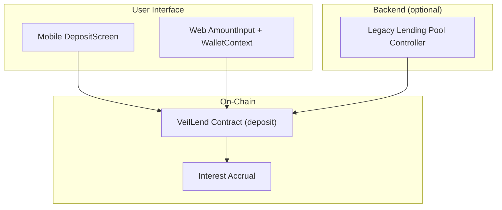
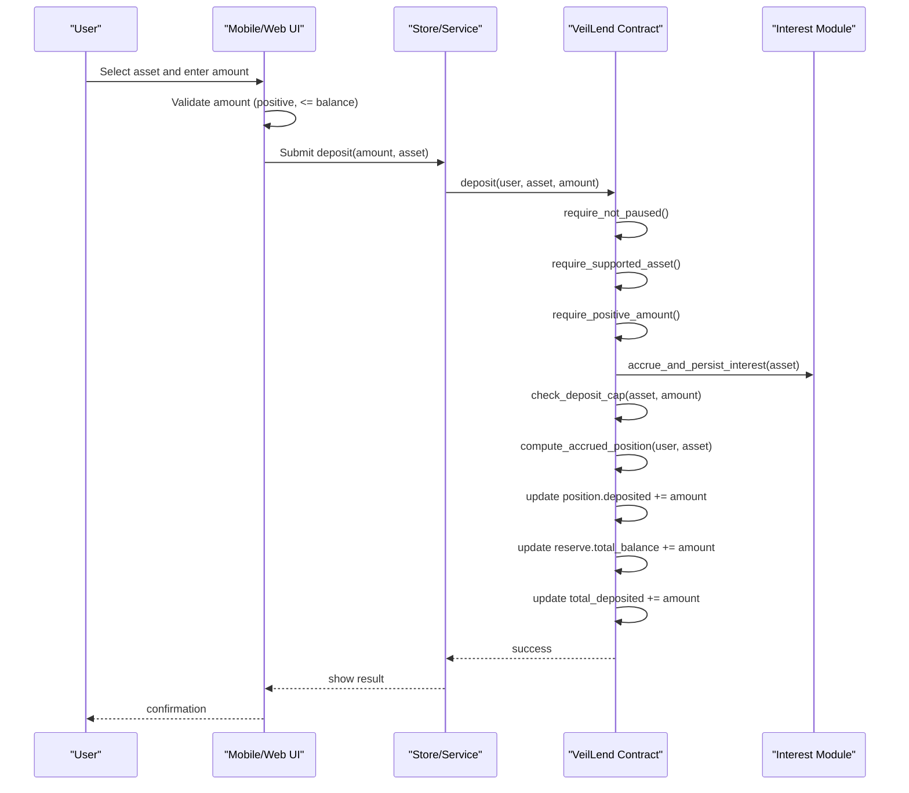
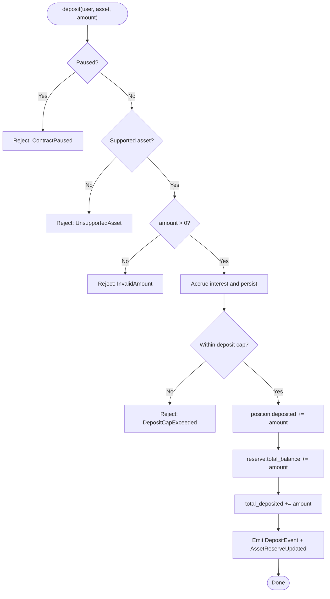
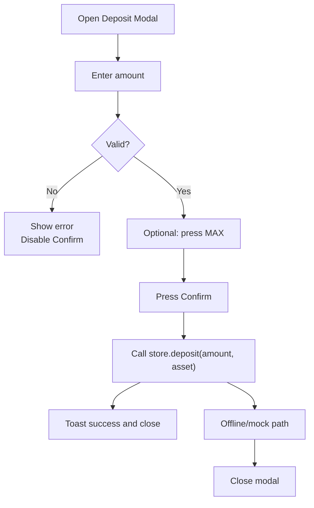
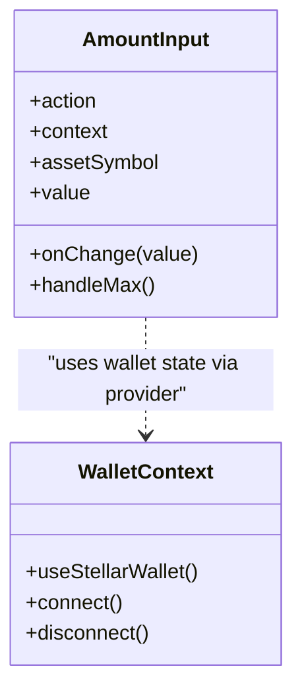
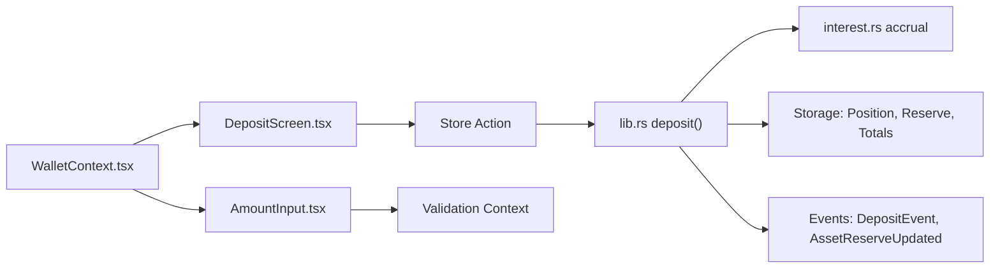

# Deposit Workflow

<cite>
**Referenced Files in This Document**
- [lib.rs](file://veilend-soroban/src/lib.rs)
- [interest.rs](file://veilend-soroban/src/interest.rs)
- [DepositScreen.tsx](file://veilend-mobile/src/screens/DepositScreen.tsx)
- [AmountInput.tsx](file://veilend-web/src/components/AmountInput.tsx)
- [WalletContext.tsx](file://veilend-web/src/context/WalletContext.tsx)
- [lending-pool.controller.ts](file://legacy/veilend-backend/src/lending-pool/lending-pool.controller.ts)
</cite>

## Table of Contents
1. [Introduction](#introduction)
2. [Project Structure](#project-structure)
3. [Core Components](#core-components)
4. [Architecture Overview](#architecture-overview)
5. [Detailed Component Analysis](#detailed-component-analysis)
6. [Dependency Analysis](#dependency-analysis)
7. [Performance Considerations](#performance-considerations)
8. [Troubleshooting Guide](#troubleshooting-guide)
9. [Conclusion](#conclusion)

## Introduction
This document explains the VeilLend deposit workflow end-to-end: how users select an asset, validate amounts, and create or update a collateral position on-chain; how the smart contract enforces protocol constraints (paused state, supported assets, positive amounts, interest accrual, caps); how UI flows work in mobile and web from wallet connection to confirmation; and how deposits emit events and update reserves and totals that affect borrowing power.

## Project Structure
The deposit flow spans three layers:
- Smart contract (Soroban): validates inputs, accrues interest, checks caps, updates positions/reserves, emits events.
- Mobile app (React Native): asset selection, amount input with validation, MAX shortcut, loading guards, and submission.
- Web app (Next.js): reusable AmountInput component with validation context and Max button; wallet context for connection.

**Diagram sources**
- [DepositScreen.tsx:20-83](file://veilend-mobile/src/screens/DepositScreen.tsx#L20-L83)
- [AmountInput.tsx:14-61](file://veilend-web/src/components/AmountInput.tsx#L14-L61)
- [WalletContext.tsx:10-22](file://veilend-web/src/context/WalletContext.tsx#L10-L22)
- [lending-pool.controller.ts:14-17](file://legacy/veilend-backend/src/lending-pool/lending-pool.controller.ts#L14-L17)
- [lib.rs:483-519](file://veilend-soroban/src/lib.rs#L483-L519)

**Section sources**
- [DepositScreen.tsx:20-83](file://veilend-mobile/src/screens/DepositScreen.tsx#L20-L83)
- [AmountInput.tsx:14-61](file://veilend-web/src/components/AmountInput.tsx#L14-L61)
- [WalletContext.tsx:10-22](file://veilend-web/src/context/WalletContext.tsx#L10-L22)
- [lending-pool.controller.ts:14-17](file://legacy/veilend-backend/src/lending-pool/lending-pool.controller.ts#L14-L17)
- [lib.rs:483-519](file://veilend-soroban/src/lib.rs#L483-L519)

## Core Components
- Smart contract deposit entrypoint: performs preconditions, accrues interest, checks deposit cap, updates user position and reserve, increments total deposits, and emits events.
- Interest module: computes accruals based on time and utilization; used by deposit to ensure caps and totals are current.
- Mobile deposit screen: selects asset, validates amount, supports MAX, disables confirm during loading, and calls store action to submit.
- Web amount input: validates amounts against context (balance, limits), shows USD preview, and provides Max button.
- Legacy backend controller: exposes a deposit endpoint that forwards parameters to service logic.

Key responsibilities:
- Validation: supported asset, positive amount, not paused, sufficient balance (UI), deposit cap (on-chain).
- State updates: per-user deposited balance, reserve total_balance, total_deposited.
- Events: DepositEvent and AssetReserveUpdated emitted after successful deposit.

**Section sources**
- [lib.rs:483-519](file://veilend-soroban/src/lib.rs#L483-L519)
- [lib.rs:792-800](file://veilend-soroban/src/lib.rs#L792-L800)
- [interest.rs:165-195](file://veilend-soroban/src/interest.rs#L165-L195)
- [DepositScreen.tsx:43-83](file://veilend-mobile/src/screens/DepositScreen.tsx#L43-L83)
- [AmountInput.tsx:40-61](file://veilend-web/src/components/AmountInput.tsx#L40-L61)
- [lending-pool.controller.ts:14-17](file://legacy/veilend-backend/src/lending-pool/lending-pool.controller.ts#L14-L17)

## Architecture Overview
The deposit sequence ensures correctness by accruing interest before any cap or balance mutation, then updating state atomically and emitting events for off-chain indexing.

**Diagram sources**
- [lib.rs:483-519](file://veilend-soroban/src/lib.rs#L483-L519)
- [lib.rs:792-800](file://veilend-soroban/src/lib.rs#L792-L800)
- [DepositScreen.tsx:69-83](file://veilend-mobile/src/screens/DepositScreen.tsx#L69-L83)

## Detailed Component Analysis

### Smart Contract Deposit Flow
- Preconditions:
  - Not paused
  - Asset supported
  - Positive amount
  - Caller authorization
- Interest accrual:
  - Advances interest indexes and applies accrued interest to aggregate totals so cap checks and balances reflect current state.
- Cap enforcement:
  - Ensures new total_deposited does not exceed configured deposit cap (unlimited when cap is -1).
- State updates:
  - User Position: increases deposited balance.
  - Reserve: increases total_balance.
  - Totals: increments total_deposited for the asset.
- Events:
  - DepositEvent(user, asset, amount)
  - AssetReserveUpdated(asset, total_balance, protocol_fees, kind=Deposit)

**Diagram sources**
- [lib.rs:483-519](file://veilend-soroban/src/lib.rs#L483-L519)
- [lib.rs:869-888](file://veilend-soroban/src/lib.rs#L869-L888)

**Section sources**
- [lib.rs:483-519](file://veilend-soroban/src/lib.rs#L483-L519)
- [lib.rs:869-888](file://veilend-soroban/src/lib.rs#L869-L888)
- [lib.rs:792-800](file://veilend-soroban/src/lib.rs#L792-L800)

### Mobile Deposit Screen
- Asset selection: list of available assets with APY and wallet balance display.
- Amount input:
  - Sanitizes input to numeric with at most one decimal point.
  - Validates non-empty, finite positive number, and not exceeding wallet balance.
  - Shows inline errors and disables Confirm while invalid or loading.
- MAX shortcut: fills the selected asset’s balance.
- Submission:
  - Calls store deposit action with amount and asset symbol.
  - On success, shows toast and closes modal.
  - Handles offline/mock path gracefully.

**Diagram sources**
- [DepositScreen.tsx:11-18](file://veilend-mobile/src/screens/DepositScreen.tsx#L11-L18)
- [DepositScreen.tsx:43-83](file://veilend-mobile/src/screens/DepositScreen.tsx#L43-L83)

**Section sources**
- [DepositScreen.tsx:20-83](file://veilend-mobile/src/screens/DepositScreen.tsx#L20-L83)

### Web Amount Input and Wallet Context
- AmountInput:
  - Uses validation context (available balance, outstanding debt, price) to validate and guide user.
  - Provides Max button to fill available balance (or min of debt/balance for repay).
  - Displays USD preview and inline feedback.
- WalletContext:
  - Wraps Stellar wallet hook to provide connected wallet state/actions across the app.

**Diagram sources**
- [AmountInput.tsx:14-61](file://veilend-web/src/components/AmountInput.tsx#L14-L61)
- [WalletContext.tsx:10-22](file://veilend-web/src/context/WalletContext.tsx#L10-L22)

**Section sources**
- [AmountInput.tsx:14-61](file://veilend-web/src/components/AmountInput.tsx#L14-L61)
- [WalletContext.tsx:10-22](file://veilend-web/src/context/WalletContext.tsx#L10-L22)

### Backend Endpoint (Legacy)
- POST /lending-pool/deposit accepts contract, asset, amount, and optional onBehalfOf, delegating to service logic.

**Section sources**
- [lending-pool.controller.ts:14-17](file://legacy/veilend-backend/src/lending-pool/lending-pool.controller.ts#L14-L17)

## Dependency Analysis
- The deposit function depends on:
  - Paused flag and supported asset registry
  - Interest accrual to keep indexes and totals current
  - Deposit cap configuration
  - Position and reserve storage
  - Event emission for indexing
- UI components depend on:
  - Local validation rules and store actions
  - Wallet context for connection state

**Diagram sources**
- [DepositScreen.tsx:69-83](file://veilend-mobile/src/screens/DepositScreen.tsx#L69-L83)
- [AmountInput.tsx:40-61](file://veilend-web/src/components/AmountInput.tsx#L40-L61)
- [WalletContext.tsx:10-22](file://veilend-web/src/context/WalletContext.tsx#L10-L22)
- [lib.rs:483-519](file://veilend-soroban/src/lib.rs#L483-L519)
- [interest.rs:165-195](file://veilend-soroban/src/interest.rs#L165-L195)

**Section sources**
- [lib.rs:483-519](file://veilend-soroban/src/lib.rs#L483-L519)
- [interest.rs:165-195](file://veilend-soroban/src/interest.rs#L165-L195)

## Performance Considerations
- Interest accrual is called once per mutating operation to avoid redundant computations and ensure consistent cap checks.
- Storage writes are minimal and grouped around position, reserve, and totals updates.
- UI-level validation prevents unnecessary transactions and reduces network load.

[No sources needed since this section provides general guidance]

## Troubleshooting Guide
Common errors and their causes:
- Insufficient funds (UI): amount exceeds wallet balance; resolved by reducing amount or using MAX.
- Unsupported asset: asset not enabled in protocol; choose a supported asset.
- Protocol paused: deposit blocked until admin unpauses; wait or contact admin.
- Deposit cap exceeded: total deposits would exceed configured cap; reduce amount or await cap increase.
- Invalid amount: zero or negative; enter a positive value.
- Contract not initialized: requires initialization before use.

Relevant on-chain error codes include unsupported asset, invalid amount, contract paused, deposit cap exceeded, insufficient reserve, and others.

**Section sources**
- [lib.rs:107-145](file://veilend-soroban/src/lib.rs#L107-L145)
- [lib.rs:483-519](file://veilend-soroban/src/lib.rs#L483-L519)
- [lib.rs:869-888](file://veilend-soroban/src/lib.rs#L869-L888)
- [DepositScreen.tsx:43-83](file://veilend-mobile/src/screens/DepositScreen.tsx#L43-L83)

## Conclusion
VeilLend’s deposit workflow combines robust on-chain validations with responsive UI flows. Deposits accrue interest first, enforce caps, update positions and reserves, increment total deposits, and emit events for indexing. Users can confidently deposit collateral through mobile or web interfaces with built-in validation, MAX shortcuts, and clear error handling.

[No sources needed since this section summarizes without analyzing specific files]