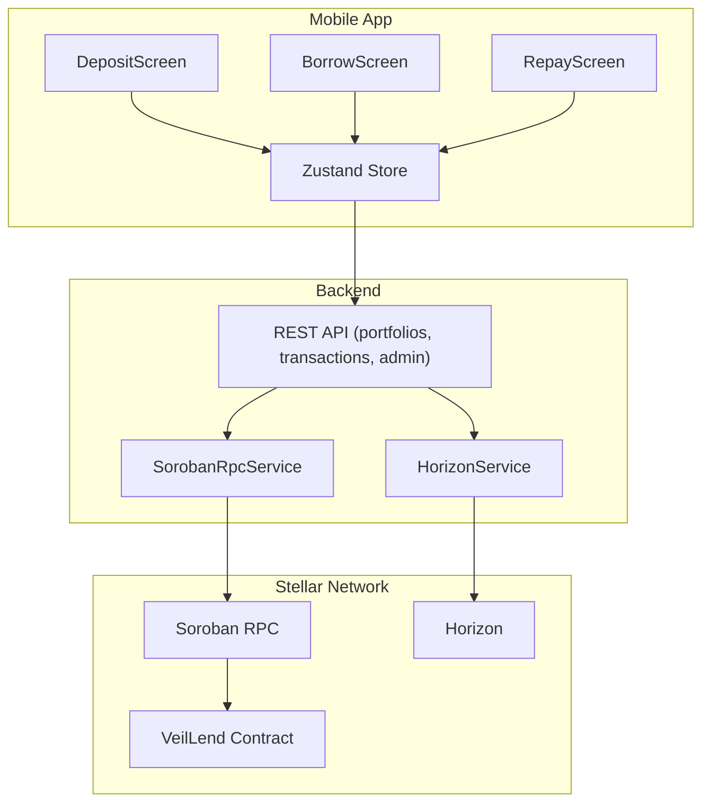
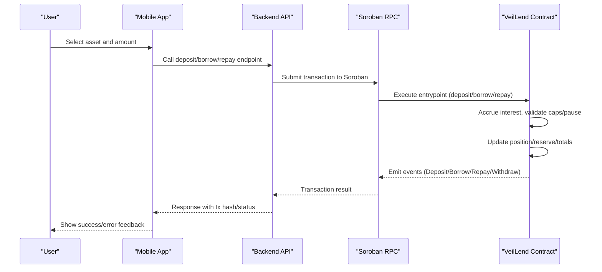
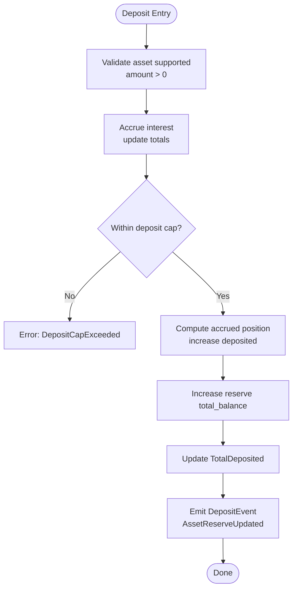
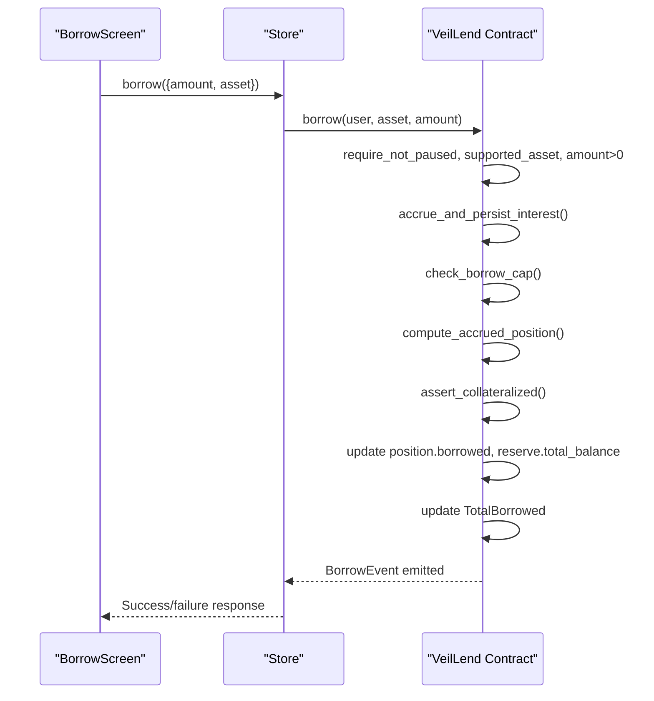
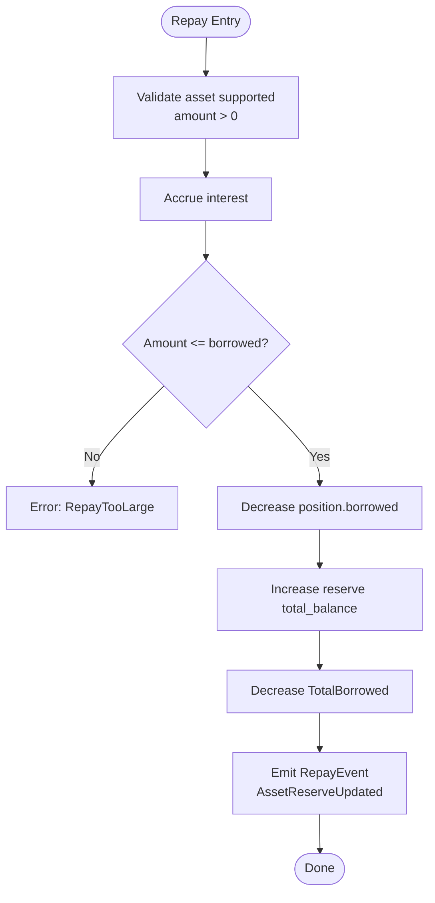
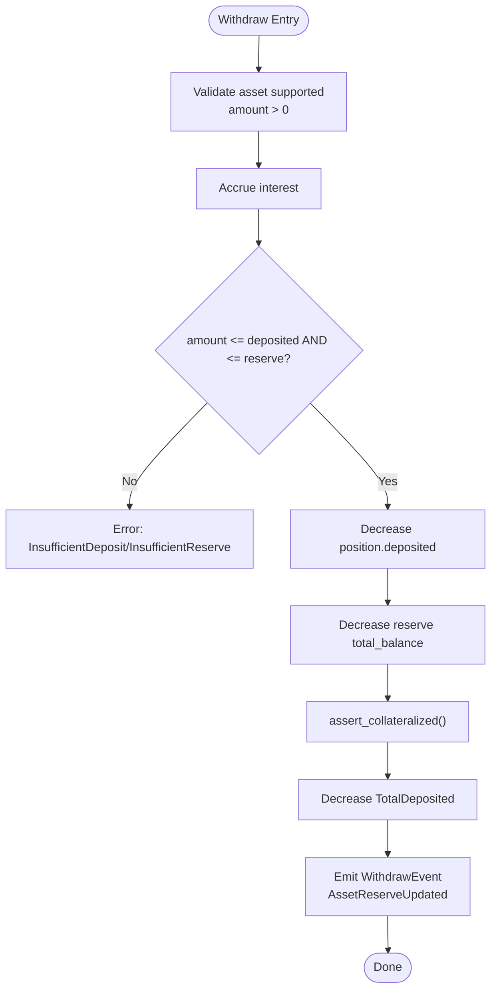
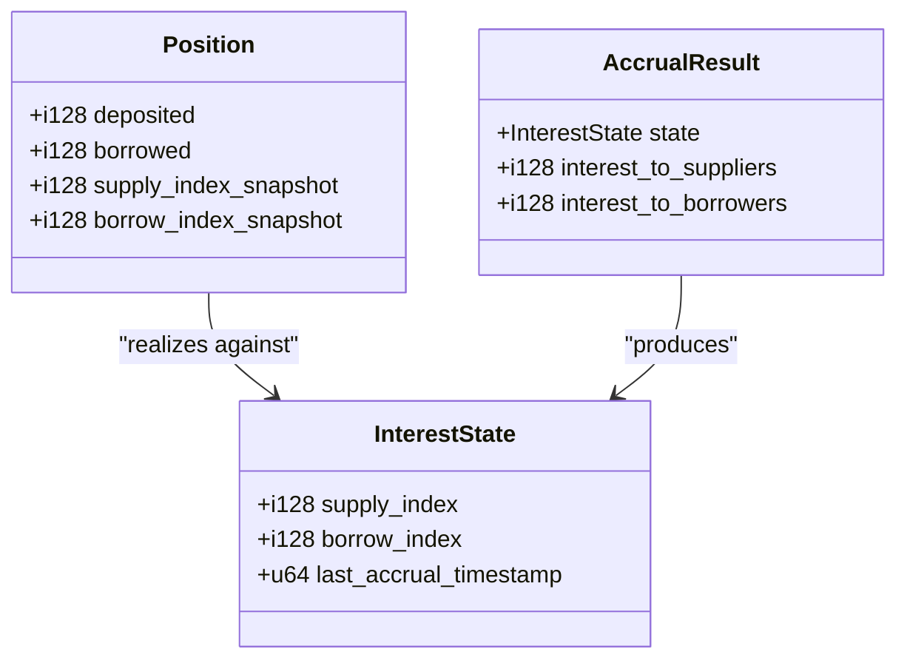
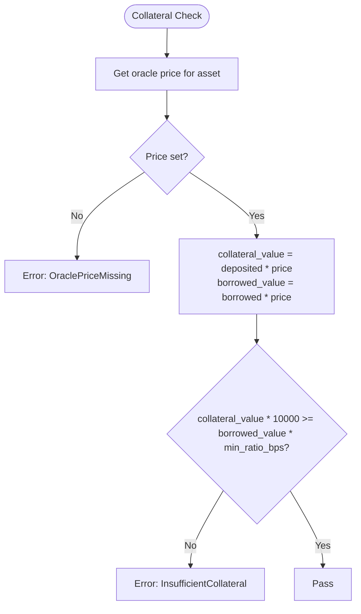
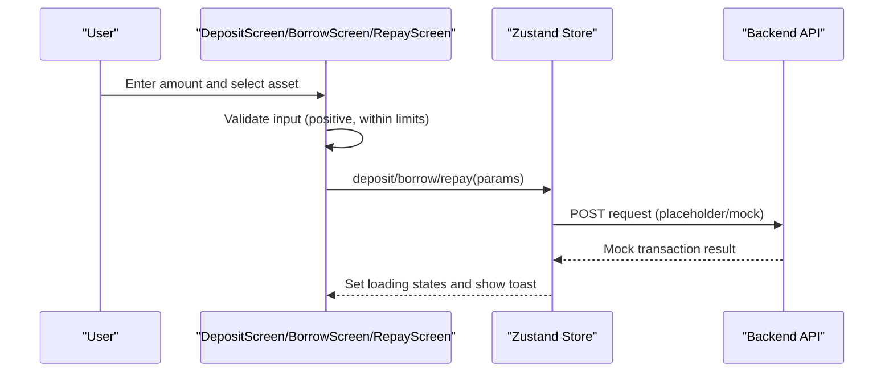
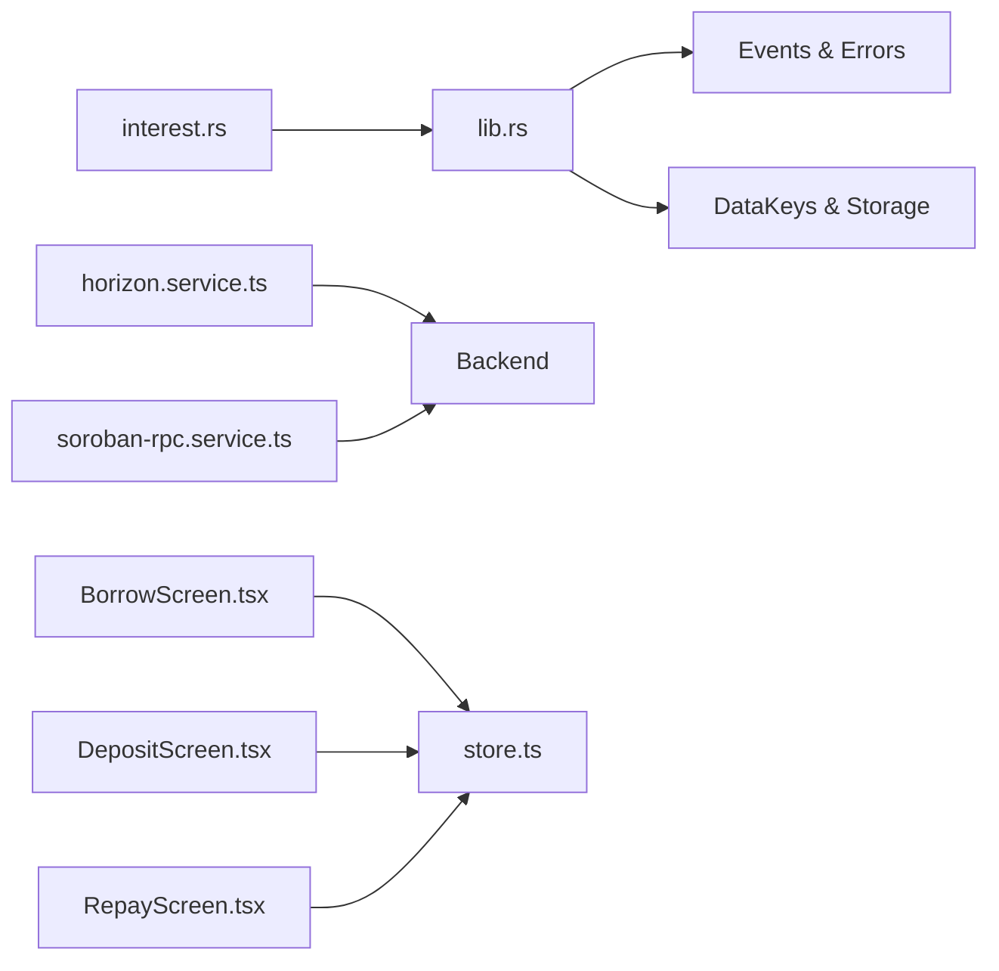

# Lending and Borrowing

<cite>
**Referenced Files in This Document**
- [lib.rs](file://veilend-soroban/src/lib.rs)
- [interest.rs](file://veilend-soroban/src/interest.rs)
- [soroban-rpc.service.ts](file://veilend-backend/src/stellar/soroban-rpc.service.ts)
- [horizon.service.ts](file://veilend-backend/src/stellar/horizon.service.ts)
- [DepositScreen.tsx](file://veilend-mobile/src/screens/DepositScreen.tsx)
- [BorrowScreen.tsx](file://veilend-mobile/src/screens/BorrowScreen.tsx)
- [RepayScreen.tsx](file://veilend-mobile/src/screens/RepayScreen.tsx)
- [store.ts](file://veilend-mobile/src/store/store.ts)
- [set-min-collateral-ratio.dto.ts](file://veilend-backend/src/admin/dto/set-min-collateral-ratio.dto.ts)
</cite>

## Table of Contents
1. Introduction
2. Project Structure
3. Core Components
4. Architecture Overview
5. Detailed Component Analysis
6. Dependency Analysis
7. Performance Considerations
8. Troubleshooting Guide
9. Conclusion

## Introduction
This document explains VeilLend’s core lending and borrowing functionality across the Soroban smart contract, backend services, and mobile/web user interfaces. It covers:
- Deposit workflow: asset selection, collateral calculation, position creation
- Borrowing process: oracle price validation, collateral ratio enforcement, loan issuance
- Repayment mechanisms: partial/full repayments, interest accrual, reserve updates
- Withdrawal process: removing deposited assets after loan closure or reduction
- Error handling for insufficient collateral, debt limits, and protocol constraints
- UI flows on mobile (and notes for web) demonstrating how users interact with these features

## Project Structure
VeilLend is composed of:
- Smart contract (Soroban): implements deposit, borrow, repay, withdraw, interest accrual, caps, pause/circuit breaker, and collateral checks using oracle prices
- Backend (NestJS): provides RPC clients to connect to Stellar/Soroban and Horizon, plus admin endpoints and portfolio/transaction APIs used by frontends
- Mobile app (React Native): screens for deposit, borrow, repay, and state management via a store that calls backend APIs

**Diagram sources**
- [DepositScreen.tsx:1-365](file://veilend-mobile/src/screens/DepositScreen.tsx#L1-L365)
- [BorrowScreen.tsx:1-366](file://veilend-mobile/src/screens/BorrowScreen.tsx#L1-L366)
- [RepayScreen.tsx:1-379](file://veilend-mobile/src/screens/RepayScreen.tsx#L1-L379)
- [store.ts:1-397](file://veilend-mobile/src/store/store.ts#L1-L397)
- [horizon.service.ts:1-115](file://veilend-backend/src/stellar/horizon.service.ts#L1-L115)
- [soroban-rpc.service.ts:1-124](file://veilend-backend/src/stellar/soroban-rpc.service.ts#L1-L124)
- [lib.rs:229-719](file://veilend-soroban/src/lib.rs#L229-L719)

**Section sources**
- [lib.rs:229-719](file://veilend-soroban/src/lib.rs#L229-L719)
- [interest.rs:1-258](file://veilend-soroban/src/interest.rs#L1-L258)
- [soroban-rpc.service.ts:1-124](file://veilend-backend/src/stellar/soroban-rpc.service.ts#L1-L124)
- [horizon.service.ts:1-115](file://veilend-backend/src/stellar/horizon.service.ts#L1-L115)
- [DepositScreen.tsx:1-365](file://veilend-mobile/src/screens/DepositScreen.tsx#L1-L365)
- [BorrowScreen.tsx:1-366](file://veilend-mobile/src/screens/BorrowScreen.tsx#L1-L366)
- [RepayScreen.tsx:1-379](file://veilend-mobile/src/screens/RepayScreen.tsx#L1-L379)
- [store.ts:1-397](file://veilend-mobile/src/store/store.ts#L1-L397)

## Core Components
- VeilLend Contract (Soroban): Implements deposit, borrow, repay, withdraw, interest accrual, per-asset caps, pause/circuit breaker, and collateral checks using oracle prices.
- Interest Engine: Time-based accrual model with supply/borrow indexes and per-position snapshots.
- Backend Services: Horizon and Soroban RPC clients for health checks and network connectivity; REST endpoints for portfolios and transactions.
- Mobile UI: Screens for deposit, borrow, and repay with input validation and mock transaction flows until full integration.

Key data structures:
- Position: tracks deposited, borrowed, and index snapshots per user per asset
- InterestState: tracks supply/borrow indexes and last accrual timestamp
- AssetReserve: tracks total balance and protocol fees per asset
- DataKey: storage keys for admin, supported assets, positions, oracle prices, caps, totals, pause state, and interest state

**Section sources**
- [lib.rs:36-105](file://veilend-soroban/src/lib.rs#L36-L105)
- [lib.rs:61-93](file://veilend-soroban/src/lib.rs#L61-L93)
- [interest.rs:1-22](file://veilend-soroban/src/interest.rs#L1-L22)

## Architecture Overview
The system enforces safety and economic invariants at the contract layer while providing user-friendly flows in the mobile app and backend integrations.

**Diagram sources**
- [lib.rs:483-639](file://veilend-soroban/src/lib.rs#L483-L639)
- [soroban-rpc.service.ts:1-124](file://veilend-backend/src/stellar/soroban-rpc.service.ts#L1-L124)
- [horizon.service.ts:1-115](file://veilend-backend/src/stellar/horizon.service.ts#L1-L115)
- [store.ts:254-308](file://veilend-mobile/src/store/store.ts#L254-L308)

## Detailed Component Analysis

### Deposit Workflow
- Asset selection and validation: The mobile screen validates numeric inputs and ensures positive amounts within wallet balance.
- On-chain processing:
  - Requires supported asset and non-zero amount
  - Accrues interest to update aggregate totals before cap checks
  - Checks deposit cap (per-asset limit)
  - Computes accrued position, updates deposited balance and reserve total balance
  - Updates TotalDeposited and emits DepositEvent and AssetReserveUpdated

**Diagram sources**
- [lib.rs:483-519](file://veilend-soroban/src/lib.rs#L483-L519)

**Section sources**
- [DepositScreen.tsx:20-83](file://veilend-mobile/src/screens/DepositScreen.tsx#L20-L83)
- [lib.rs:483-519](file://veilend-soroban/src/lib.rs#L483-L519)

### Borrowing Process
- Oracle price validation: Borrow requires an oracle price for the asset; missing price triggers an error.
- Collateral ratio enforcement: After accruing interest and checking borrow cap, the contract verifies collateralization using oracle price and minimum collateral ratio (in basis points).
- Loan issuance: If valid, increases borrowed balance, decreases reserve total balance, updates TotalBorrowed, and emits BorrowEvent and AssetReserveUpdated.

**Diagram sources**
- [lib.rs:521-561](file://veilend-soroban/src/lib.rs#L521-L561)
- [lib.rs:913-934](file://veilend-soroban/src/lib.rs#L913-L934)
- [BorrowScreen.tsx:20-84](file://veilend-mobile/src/screens/BorrowScreen.tsx#L20-L84)

**Section sources**
- [lib.rs:521-561](file://veilend-soroban/src/lib.rs#L521-L561)
- [lib.rs:913-934](file://veilend-soroban/src/lib.rs#L913-L934)
- [BorrowScreen.tsx:20-84](file://veilend-mobile/src/screens/BorrowScreen.tsx#L20-L84)

### Repayment Mechanisms
- Partial/full repayments: Users can repay any positive amount up to outstanding borrowed balance.
- Interest calculations: Each repay call accrues interest first so balances reflect time-based growth.
- Reserve updates: Repay increases reserve total balance and reduces TotalBorrowed; emits RepayEvent and AssetReserveUpdated.

**Diagram sources**
- [lib.rs:563-598](file://veilend-soroban/src/lib.rs#L563-L598)

**Section sources**
- [lib.rs:563-598](file://veilend-soroban/src/lib.rs#L563-L598)
- [RepayScreen.tsx:18-82](file://veilend-mobile/src/screens/RepayScreen.tsx#L18-L82)

### Withdrawal Process
- Removing deposited assets: Allowed even when paused; must not exceed deposited balance and available reserve balance.
- Collateralization check: After reducing deposited balance, the contract ensures the position remains collateralized.
- Reserve updates: Decreases reserve total balance and TotalDeposited; emits WithdrawEvent and AssetReserveUpdated.

**Diagram sources**
- [lib.rs:600-639](file://veilend-soroban/src/lib.rs#L600-L639)

**Section sources**
- [lib.rs:600-639](file://veilend-soroban/src/lib.rs#L600-L639)

### Interest Accrual Model
- Time-based accrual uses supply and borrow indexes anchored to timestamps.
- Rates are derived from utilization with base rate and slope parameters.
- Accrual is idempotent and applied to both aggregate totals and individual positions upon touch.

**Diagram sources**
- [interest.rs:1-22](file://veilend-soroban/src/interest.rs#L1-L22)
- [lib.rs:61-79](file://veilend-soroban/src/lib.rs#L61-L79)

**Section sources**
- [interest.rs:24-87](file://veilend-soroban/src/interest.rs#L24-L87)
- [interest.rs:89-120](file://veilend-soroban/src/interest.rs#L89-L120)
- [lib.rs:782-827](file://veilend-soroban/src/lib.rs#L782-L827)

### Oracle Price and Collateral Ratio Enforcement
- Oracle price must be set per asset; missing price causes errors during collateral checks.
- Collateral ratio enforced using minimum collateral ratio in basis points; compares collateral value vs borrowed value.

**Diagram sources**
- [lib.rs:913-934](file://veilend-soroban/src/lib.rs#L913-L934)

**Section sources**
- [lib.rs:913-934](file://veilend-soroban/src/lib.rs#L913-L934)
- [set-min-collateral-ratio.dto.ts:1-7](file://veilend-backend/src/admin/dto/set-min-collateral-ratio.dto.ts#L1-L7)

### Backend Integration Points
- Horizon and Soroban RPC services provide connection health checks and client accessors for interacting with the Stellar network.
- These services are used by backend modules to submit/read transactions and monitor network status.

**Section sources**
- [horizon.service.ts:1-115](file://veilend-backend/src/stellar/horizon.service.ts#L1-L115)
- [soroban-rpc.service.ts:1-124](file://veilend-backend/src/stellar/soroban-rpc.service.ts#L1-L124)

### Mobile UI Flows
- Deposit: Validates amount, shows APY stats, opens modal to confirm deposit, calls store method which currently returns mock transactions.
- Borrow: Validates amount against available borrow limit, shows APR stats, opens modal to confirm borrow, calls store method returning mock transactions.
- Repay: Lists active loans, validates repayment amount against owed amount, opens modal to confirm repay, calls store method returning mock transactions.

**Diagram sources**
- [DepositScreen.tsx:20-83](file://veilend-mobile/src/screens/DepositScreen.tsx#L20-L83)
- [BorrowScreen.tsx:20-84](file://veilend-mobile/src/screens/BorrowScreen.tsx#L20-L84)
- [RepayScreen.tsx:18-82](file://veilend-mobile/src/screens/RepayScreen.tsx#L18-L82)
- [store.ts:254-308](file://veilend-mobile/src/store/store.ts#L254-L308)

**Section sources**
- [DepositScreen.tsx:20-83](file://veilend-mobile/src/screens/DepositScreen.tsx#L20-L83)
- [BorrowScreen.tsx:20-84](file://veilend-mobile/src/screens/BorrowScreen.tsx#L20-L84)
- [RepayScreen.tsx:18-82](file://veilend-mobile/src/screens/RepayScreen.tsx#L18-L82)
- [store.ts:254-308](file://veilend-mobile/src/store/store.ts#L254-L308)

## Dependency Analysis
- Contract dependencies:
  - lib.rs depends on interest.rs for accrual math
  - All mutating entrypoints depend on accrue_and_persist_interest to keep totals current
  - Collateral checks depend on oracle price storage and minimum collateral ratio configuration
- Backend dependencies:
  - HorizonService and SorobanRpcService encapsulate network clients and health checks
- Mobile dependencies:
  - Screens depend on Zustand store methods for actions and state
  - Store methods currently return mock results but are structured to call backend APIs

**Diagram sources**
- [interest.rs:1-258](file://veilend-soroban/src/interest.rs#L1-L258)
- [lib.rs:1-1041](file://veilend-soroban/src/lib.rs#L1-L1041)
- [horizon.service.ts:1-115](file://veilend-backend/src/stellar/horizon.service.ts#L1-L115)
- [soroban-rpc.service.ts:1-124](file://veilend-backend/src/stellar/soroban-rpc.service.ts#L1-L124)
- [BorrowScreen.tsx:1-366](file://veilend-mobile/src/screens/BorrowScreen.tsx#L1-L366)
- [DepositScreen.tsx:1-365](file://veilend-mobile/src/screens/DepositScreen.tsx#L1-L365)
- [RepayScreen.tsx:1-379](file://veilend-mobile/src/screens/RepayScreen.tsx#L1-L379)
- [store.ts:1-397](file://veilend-mobile/src/store/store.ts#L1-L397)

**Section sources**
- [lib.rs:1-1041](file://veilend-soroban/src/lib.rs#L1-L1041)
- [interest.rs:1-258](file://veilend-soroban/src/interest.rs#L1-L258)
- [horizon.service.ts:1-115](file://veilend-backend/src/stellar/horizon.service.ts#L1-L115)
- [soroban-rpc.service.ts:1-124](file://veilend-backend/src/stellar/soroban-rpc.service.ts#L1-L124)
- [store.ts:1-397](file://veilend-mobile/src/store/store.ts#L1-L397)

## Performance Considerations
- Interest accrual is computed per operation; ensure efficient indexing and avoid redundant accruals where possible.
- Caps checks prevent overexposure and reduce risk; configure appropriate deposit/borrow caps per asset.
- Oracle price updates should be timely to avoid stale valuations affecting collateral ratios.
- Mobile UI validation reduces unnecessary on-chain calls and improves user experience.

[No sources needed since this section provides general guidance]

## Troubleshooting Guide
Common errors and their causes:
- InsufficientCollateral: Collateral value below required ratio after borrow or withdraw; verify oracle price and collateral ratio settings
- OraclePriceMissing: Oracle price not set for asset; admin must set price before borrowing/withdrawing
- ContractPaused: Protocol paused; only repay/withdraw allowed; wait for unpause
- DepositCapExceeded/BorrowCapExceeded: Per-asset caps exceeded; adjust caps or reduce amounts
- RepayTooLarge: Repayment exceeds outstanding borrowed balance; reduce amount
- InsufficientDeposit/InsufficientReserve: Withdraw amount exceeds deposited balance or reserve availability; reduce amount

Operational checks:
- Use backend Horizon and Soroban RPC health checks to ensure network connectivity
- Monitor events emitted by the contract for successful operations and reserve updates

**Section sources**
- [lib.rs:107-145](file://veilend-soroban/src/lib.rs#L107-L145)
- [lib.rs:856-911](file://veilend-soroban/src/lib.rs#L856-L911)
- [horizon.service.ts:49-71](file://veilend-backend/src/stellar/horizon.service.ts#L49-L71)
- [soroban-rpc.service.ts:51-79](file://veilend-backend/src/stellar/soroban-rpc.service.ts#L51-L79)

## Conclusion
VeilLend’s lending and borrowing system combines robust on-chain logic with user-friendly interfaces. The contract enforces critical safety checks including oracle price validation, collateral ratio enforcement, and per-asset caps, while the interest engine ensures fair accrual over time. The backend provides reliable network connectivity, and the mobile app offers clear workflows for deposits, borrows, and repayments. Proper configuration of oracle prices, collateral ratios, and caps is essential for safe and efficient protocol operation.

[No sources needed since this section summarizes without analyzing specific files]