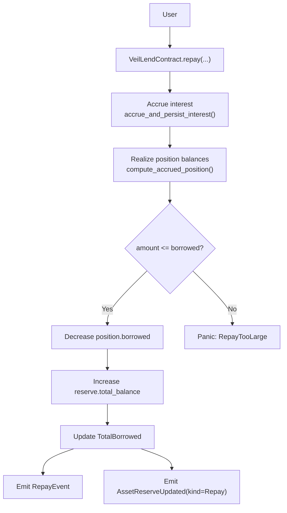
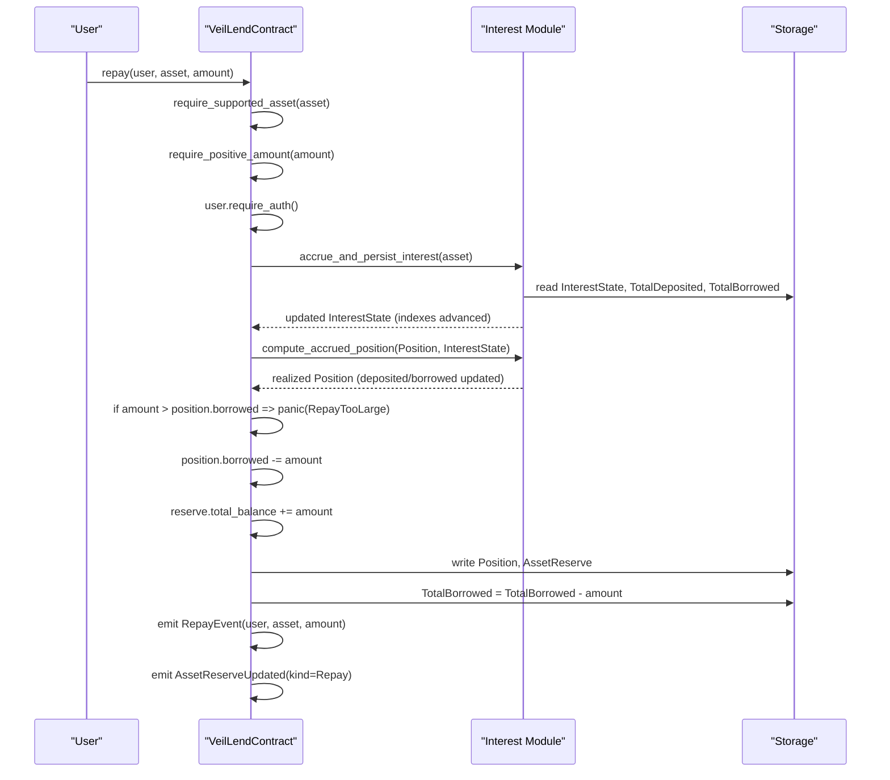
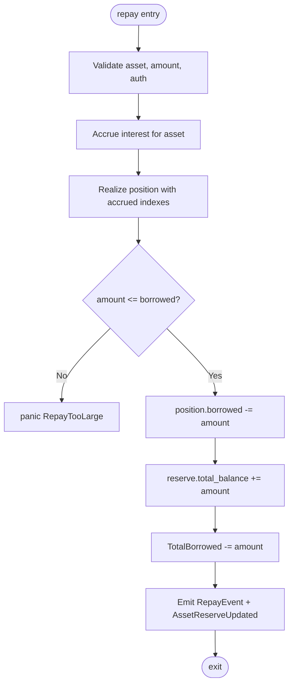
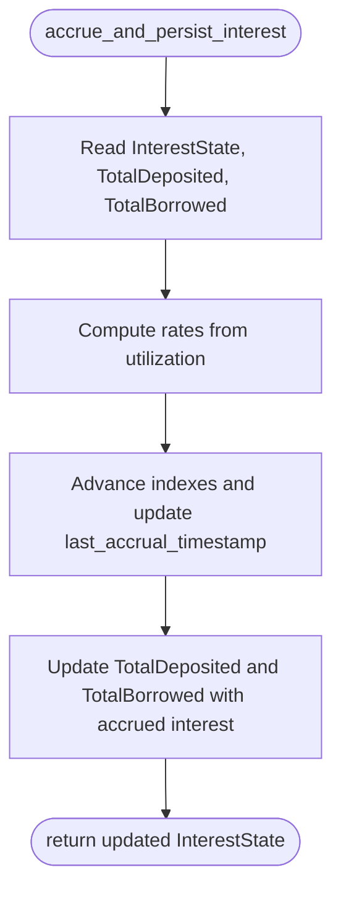
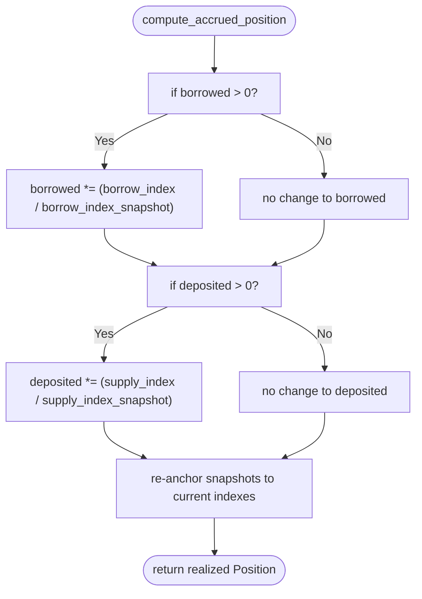
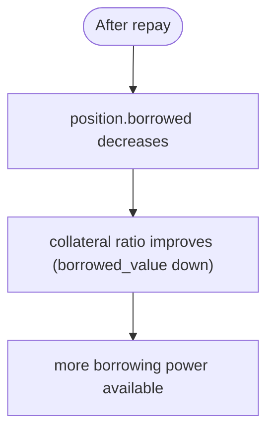
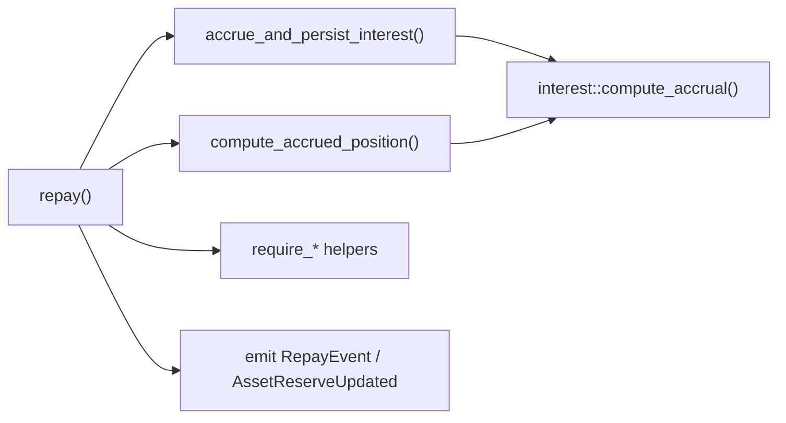

# Repayment Mechanisms

<cite>
**Referenced Files in This Document**
- [lib.rs](file://veilend-soroban/src/lib.rs)
- [interest.rs](file://veilend-soroban/src/interest.rs)
- [integration.rs](file://veilend-soroban/tests/integration.rs)
- [test_repay_and_withdraw_operate_on_accrued_amounts.1.json](file://veilend-soroban/test_snapshots/test_repay_and_withdraw_operate_on_accrued_amounts.1.json)
</cite>

## Table of Contents
1. [Introduction](#introduction)
2. [Project Structure](#project-structure)
3. [Core Components](#core-components)
4. [Architecture Overview](#architecture-overview)
5. [Detailed Component Analysis](#detailed-component-analysis)
6. [Dependency Analysis](#dependency-analysis)
7. [Performance Considerations](#performance-considerations)
8. [Troubleshooting Guide](#troubleshooting-guide)
9. [Conclusion](#conclusion)

## Introduction
This document explains VeilLend’s repayment mechanisms for borrowed assets. It covers how users can perform partial and full repayments, how interest accrual affects outstanding debt, how repayments reduce protocol-wide borrows and free up collateral capacity, and how the smart contract enforces safety checks. It also documents the RepayEvent emission, reserve adjustments, and the relationship between repayments, accrued interest, and collateral ratio improvements.

## Project Structure
VeilLend’s lending logic is implemented as a Soroban smart contract. The core repayment flow lives in the main contract file, while time-based interest accrual is encapsulated in a dedicated module. Integration tests demonstrate end-to-end scenarios including repayments after interest accrual.

**Diagram sources**
- [lib.rs:563-598](file://veilend-soroban/src/lib.rs#L563-L598)
- [lib.rs:792-815](file://veilend-soroban/src/lib.rs#L792-L815)
- [interest.rs:97-120](file://veilend-soroban/src/interest.rs#L97-L120)

**Section sources**
- [lib.rs:563-598](file://veilend-soroban/src/lib.rs#L563-L598)
- [interest.rs:97-120](file://veilend-soroban/src/interest.rs#L97-L120)
- [integration.rs:345-378](file://veilend-soroban/tests/integration.rs#L345-L378)

## Core Components
- Repay function: Validates inputs, accrues interest, realizes the user’s accrued debt, validates that the repayment does not exceed outstanding debt, updates position and reserves, reduces total borrows, and emits events.
- Interest accrual: Advances per-asset supply/borrow indexes based on elapsed time and utilization; updates aggregate totals to reflect accrued interest.
- Position realization: Applies index deltas to a user’s deposited and borrowed balances and re-anchors snapshots for future accruals.
- Collateral checks: Enforced on borrow and withdraw; repayments reduce debt and thus improve collateral ratios without explicit re-checks.

Key data structures involved:
- Position: tracks deposited, borrowed, and snapshot indices for each user/asset.
- InterestState: tracks per-asset supply_index, borrow_index, and last_accrual_timestamp.
- AssetReserve: tracks total_balance and protocol_fees per asset.

**Section sources**
- [lib.rs:61-79](file://veilend-soroban/src/lib.rs#L61-L79)
- [lib.rs:90-105](file://veilend-soroban/src/lib.rs#L90-L105)
- [interest.rs:1-22](file://veilend-soroban/src/interest.rs#L1-L22)

## Architecture Overview
The repayment flow integrates with interest accrual and reserve accounting to ensure accurate debt reduction and liquidity restoration.

**Diagram sources**
- [lib.rs:563-598](file://veilend-soroban/src/lib.rs#L563-L598)
- [lib.rs:792-815](file://veilend-soroban/src/lib.rs#L792-L815)
- [interest.rs:97-120](file://veilend-soroban/src/interest.rs#L97-L120)

## Detailed Component Analysis

### Repay Function Flow
- Input validation:
  - Ensures the asset is supported.
  - Ensures amount is positive.
  - Requires user authentication.
- Interest accrual:
  - Accrues interest for the asset and persists updated indexes and aggregate totals.
- Position realization:
  - Realizes accrued interest into the user’s position using current indexes.
- Amount validation:
  - Rejects overpayments where amount exceeds the user’s accrued borrowed balance.
- State updates:
  - Decreases position.borrowed by amount.
  - Increases reserve.total_balance by amount.
  - Decreases TotalBorrowed by amount.
- Events:
  - Emits RepayEvent with user, asset, and amount.
  - Emits AssetReserveUpdated with kind Repay.

**Diagram sources**
- [lib.rs:563-598](file://veilend-soroban/src/lib.rs#L563-L598)
- [lib.rs:792-815](file://veilend-soroban/src/lib.rs#L792-L815)

**Section sources**
- [lib.rs:563-598](file://veilend-soroban/src/lib.rs#L563-L598)

### Interest Accrual Mechanics
- Time-based accrual advances per-asset supply_index and borrow_index based on elapsed time since last accrual.
- Utilization-driven rates:
  - Borrow rate increases with utilization.
  - Supply rate is derived from borrow rate and utilization.
- Aggregate totals are updated with accrued interest to borrowers and suppliers.
- Idempotency: accrual at the same timestamp is a no-op.

**Diagram sources**
- [interest.rs:24-87](file://veilend-soroban/src/interest.rs#L24-L87)
- [lib.rs:792-815](file://veilend-soroban/src/lib.rs#L792-L815)

**Section sources**
- [interest.rs:24-87](file://veilend-soroban/src/interest.rs#L24-L87)
- [lib.rs:792-815](file://veilend-soroban/src/lib.rs#L792-L815)

### Position Realization
- Realizes accrued interest into a user’s position by applying index deltas to deposited and borrowed balances.
- Re-anchors snapshots to current indexes so subsequent accruals measure delta from now.
- Zero-balance positions do not grow but still re-anchor snapshots.

**Diagram sources**
- [interest.rs:97-120](file://veilend-soroban/src/interest.rs#L97-L120)

**Section sources**
- [interest.rs:97-120](file://veilend-soroban/src/interest.rs#L97-L120)

### Debt Reduction and Collateral Ratio Improvements
- Repayments directly reduce position.borrowed and protocol TotalBorrowed, freeing up collateral capacity.
- While repayments do not trigger an explicit collateral check, reducing debt improves the collateral ratio because the denominator (borrowed value) decreases relative to collateral value.
- Collateral checks are enforced on borrow and withdraw operations to maintain minimum collateral ratios.

**Section sources**
- [lib.rs:563-598](file://veilend-soroban/src/lib.rs#L563-L598)
- [lib.rs:913-934](file://veilend-soroban/src/lib.rs#L913-L934)

### Event Emissions and Protocol Metrics
- RepayEvent: emitted with user, asset, and amount for every successful repayment.
- AssetReserveUpdated(kind=Repay): emitted with updated reserve totals and fees.
- TotalBorrowed decreases by the repaid amount, reflecting reduced protocol exposure.
- Reserve total_balance increases by the repaid amount, restoring available liquidity for withdrawals or further borrows.

**Section sources**
- [lib.rs:177-185](file://veilend-soroban/src/lib.rs#L177-L185)
- [lib.rs:216-224](file://veilend-soroban/src/lib.rs#L216-L224)
- [lib.rs:585-598](file://veilend-soroban/src/lib.rs#L585-L598)

### Examples and Timing Considerations
- Successful full repayment after one year of accrual:
  - Deposit 1,000,000 and borrow 500,000.
  - After one year, accrued debt becomes 560,000.
  - Repaying exactly 560,000 clears the debt; subsequent withdrawal retrieves the full accrued deposit of 1,060,000.
- Overpayment handling:
  - Attempting to repay more than the accrued debt (e.g., 560,001) fails with RepayTooLarge.
- Timing idempotency:
  - Multiple accrual calls at the same timestamp do not double-count interest.

These behaviors are validated by integration tests and captured in test snapshots.

**Section sources**
- [integration.rs:345-378](file://veilend-soroban/tests/integration.rs#L345-L378)
- [test_repay_and_withdraw_operate_on_accrued_amounts.1.json:130-182](file://veilend-soroban/test_snapshots/test_repay_and_withdraw_operate_on_accrued_amounts.1.json#L130-L182)

## Dependency Analysis
The repayment mechanism depends on several components:
- Interest accrual module for computing time-based growth and index updates.
- Storage keys for positions, interest state, and aggregate totals.
- Validation helpers for asset support, positive amounts, and pause state.
- Event system for emitting RepayEvent and AssetReserveUpdated.

**Diagram sources**
- [lib.rs:563-598](file://veilend-soroban/src/lib.rs#L563-L598)
- [lib.rs:792-815](file://veilend-soroban/src/lib.rs#L792-L815)
- [interest.rs:24-87](file://veilend-soroban/src/interest.rs#L24-L87)

**Section sources**
- [lib.rs:563-598](file://veilend-soroban/src/lib.rs#L563-L598)
- [lib.rs:792-815](file://veilend-soroban/src/lib.rs#L792-L815)
- [interest.rs:24-87](file://veilend-soroban/src/interest.rs#L24-L87)

## Performance Considerations
- Accrual is O(1) per call and idempotent at the same timestamp.
- Position realization is O(1) and only touches the calling user’s position.
- Reserve updates and event emissions are constant-time operations.
- Avoid unnecessary repeated accruals within the same ledger timestamp to prevent redundant computation.

[No sources needed since this section provides general guidance]

## Troubleshooting Guide
Common errors during repayment:
- RepayTooLarge: Occurs when attempting to repay more than the user’s accrued borrowed balance. Ensure the requested amount does not exceed the realized borrowed amount after accrual.
- UnsupportedAsset: Occurs if the asset is not configured as supported. Configure the asset before repaying.
- ZeroAmount/InvalidAmount: Occurs if the repayment amount is zero or negative. Provide a positive amount.
- ContractPaused: Repay is allowed even when paused; however, other operations may be blocked. If encountering unexpected failures, verify the operation being attempted.

Debugging steps:
- Call get_position to see the realized borrowed balance after accrual.
- Call get_interest_state to inspect current indexes and last accrual time.
- Review events via the indexer or blockchain explorer to confirm RepayEvent and AssetReserveUpdated emissions.

**Section sources**
- [lib.rs:107-145](file://veilend-soroban/src/lib.rs#L107-L145)
- [lib.rs:563-598](file://veilend-soroban/src/lib.rs#L563-L598)
- [integration.rs:345-378](file://veilend-soroban/tests/integration.rs#L345-L378)

## Conclusion
VeilLend’s repayment mechanism ensures accurate debt reduction through time-based interest accrual and position realization. Users can make partial or full repayments, with strict validation preventing overpayments. Repayments restore liquidity to the reserve, reduce protocol-wide borrows, and improve collateral ratios by lowering outstanding debt. The system emits clear events for transparency and supports robust error handling for edge cases.

[No sources needed since this section summarizes without analyzing specific files]