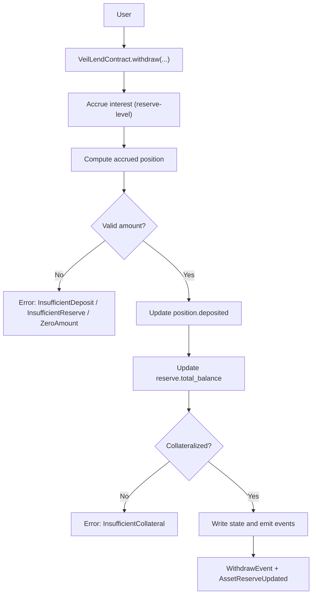
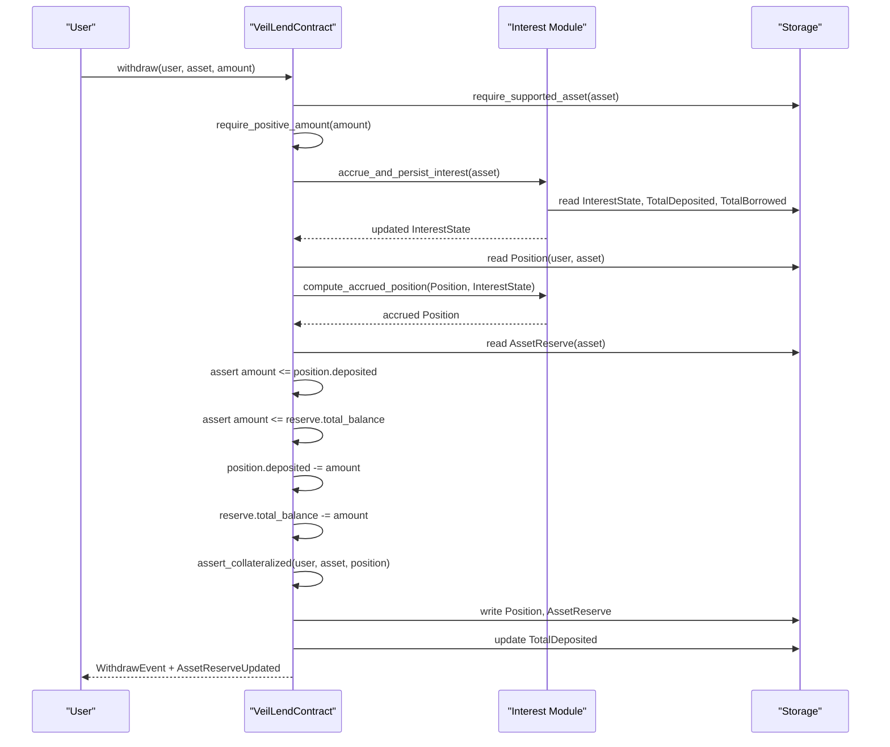
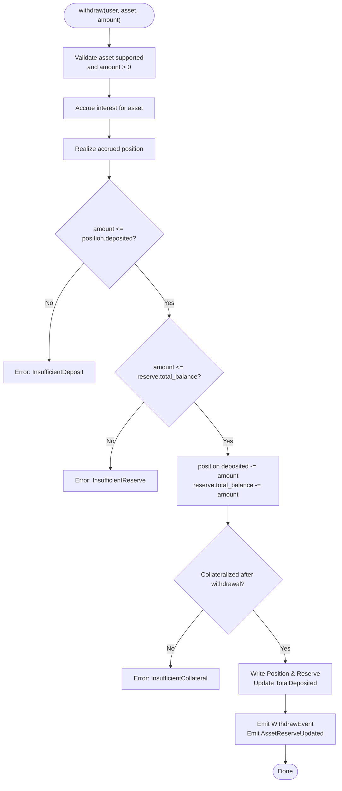
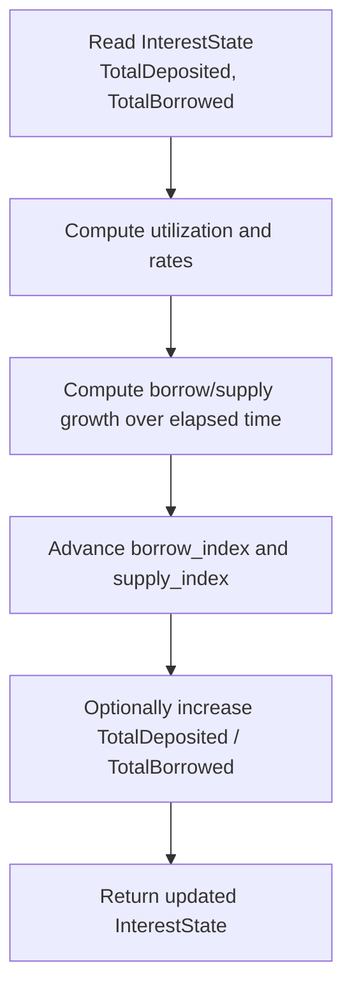
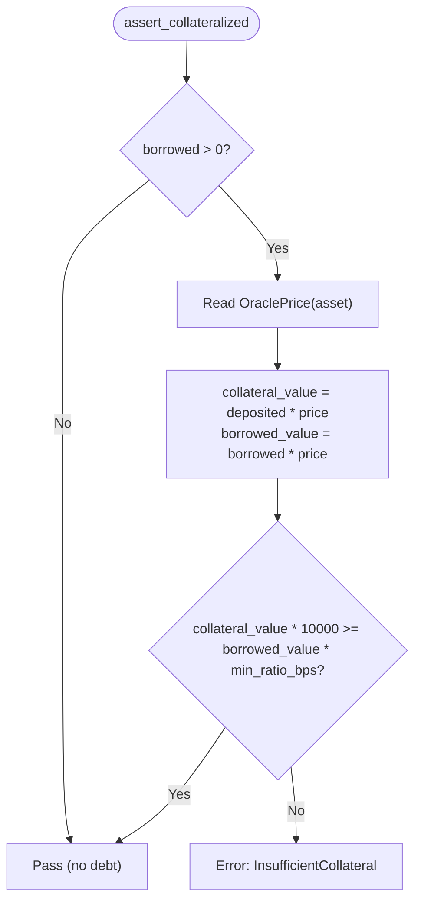
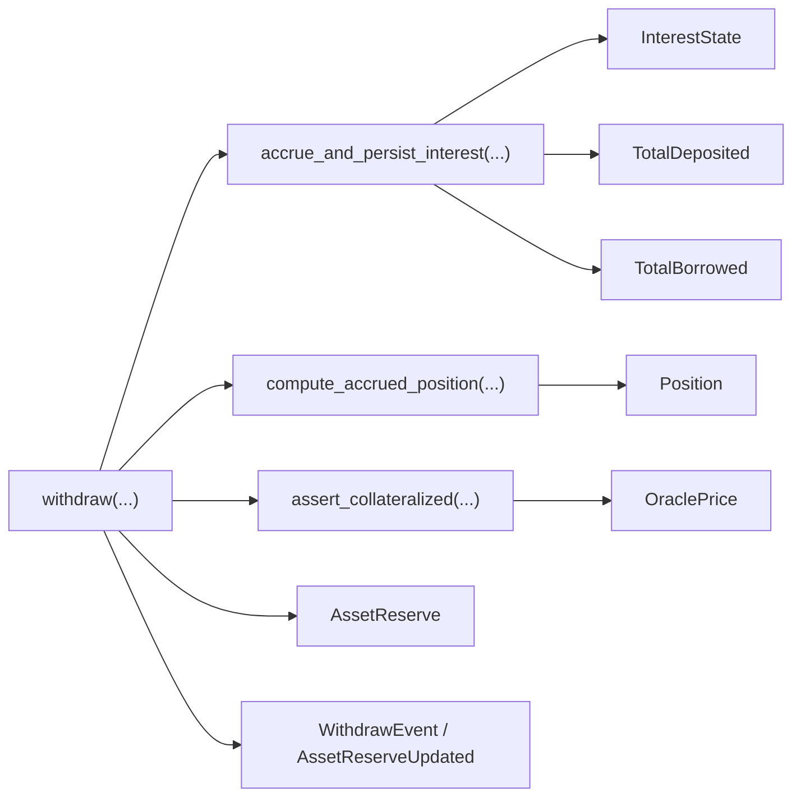

# Withdrawal Process

<cite>
**Referenced Files in This Document**
- [lib.rs](file://veilend-soroban/src/lib.rs)
- [interest.rs](file://veilend-soroban/src/interest.rs)
- [integration.rs](file://veilend-soroban/tests/integration.rs)
- [test_repay_and_withdraw_operate_on_accrued_amounts.1.json](file://veilend-soroban/test_snapshots/test_repay_and_withdraw_operate_on_accrued_amounts.1.json)
</cite>

## Table of Contents
1. [Introduction](#introduction)
2. [Project Structure](#project-structure)
3. [Core Components](#core-components)
4. [Architecture Overview](#architecture-overview)
5. [Detailed Component Analysis](#detailed-component-analysis)
6. [Dependency Analysis](#dependency-analysis)
7. [Performance Considerations](#performance-considerations)
8. [Troubleshooting Guide](#troubleshooting-guide)
9. [Conclusion](#conclusion)
10. [Appendices](#appendices)

## Introduction
This document explains the VeilLend withdrawal process for deposited collateral on the Soroban smart contract. It covers how withdrawals validate balances, enforce collateral ratios, accrue interest, update positions and reserves, emit events, and affect protocol totals and available liquidity. It also documents restrictions when positions are undercollateralized and how withdrawals impact borrowing power and liquidation risk.

## Project Structure
The withdrawal logic is implemented in the VeilLend Soroban contract. The core flow resides in a single contract module with an interest accrual helper module. Tests and snapshots demonstrate end-to-end behavior including time-based accrual and withdrawal after repayment.

**Diagram sources**
- [lib.rs:600-639](file://veilend-soroban/src/lib.rs#L600-L639)
- [lib.rs:782-815](file://veilend-soroban/src/lib.rs#L782-L815)
- [lib.rs:913-934](file://veilend-soroban/src/lib.rs#L913-L934)

**Section sources**
- [lib.rs:1-1041](file://veilend-soroban/src/lib.rs#L1-L1041)
- [interest.rs:1-258](file://veilend-soroban/src/interest.rs#L1-L258)
- [integration.rs:344-378](file://veilend-soroban/tests/integration.rs#L344-L378)

## Core Components
- VeilLendContract: Implements deposit, borrow, repay, withdraw, interest accrual, caps, oracle price checks, and collateralization assertions.
- Interest module: Computes time-based accrual indexes and realizes per-position accrued balances.
- Storage keys: Position, InterestState, AssetReserve, TotalDeposited, TotalBorrowed, OraclePrice, Paused, SupportedAsset, DepositCap, BorrowCap.
- Events: WithdrawEvent and AssetReserveUpdated are emitted to record withdrawals and reserve changes.

Key responsibilities relevant to withdrawals:
- Accrue interest before mutating user or reserve state to ensure all calculations use up-to-date values.
- Validate that the requested withdrawal does not exceed the user’s accrued deposited balance and that sufficient reserve liquidity exists.
- Enforce minimum collateral ratio after the withdrawal; if violated, the transaction reverts.
- Update per-user position and global totals, then emit events.

**Section sources**
- [lib.rs:600-639](file://veilend-soroban/src/lib.rs#L600-L639)
- [lib.rs:782-815](file://veilend-soroban/src/lib.rs#L782-L815)
- [lib.rs:913-934](file://veilend-soroban/src/lib.rs#L913-L934)
- [interest.rs:51-87](file://veilend-soroban/src/interest.rs#L51-L87)
- [interest.rs:97-120](file://veilend-soroban/src/interest.rs#L97-L120)

## Architecture Overview
The withdrawal entrypoint orchestrates interest accrual, balance validation, collateral checks, state updates, and event emission. It interacts with the interest module to compute growth and with storage to read/write positions, reserves, and totals.

**Diagram sources**
- [lib.rs:600-639](file://veilend-soroban/src/lib.rs#L600-L639)
- [lib.rs:782-815](file://veilend-soroban/src/lib.rs#L782-L815)
- [lib.rs:913-934](file://veilend-soroban/src/lib.rs#L913-L934)
- [interest.rs:51-87](file://veilend-soroban/src/interest.rs#L51-L87)
- [interest.rs:97-120](file://veilend-soroban/src/interest.rs#L97-L120)

## Detailed Component Analysis

### Withdraw Function Implementation
The withdraw function performs the following steps:
- Authorization and input validation:
  - Ensures the asset is supported and the amount is positive.
- Interest accrual:
  - Advances reserve-level interest indexes and updates aggregate totals for supplied and borrowed amounts.
- Position realization:
  - Reads the user’s stored position and computes accrued balances using current interest indexes.
- Balance and liquidity checks:
  - Validates that the requested amount does not exceed the user’s accrued deposited balance.
  - Validates that the reserve has enough total_balance to cover the withdrawal.
- State updates:
  - Decrements position.deposited and reserve.total_balance by the withdrawn amount.
  - Updates TotalDeposited for the asset.
- Collateralization check:
  - After the withdrawal, asserts that the position remains collateralized against the minimum collateral ratio using the oracle price. If not, the transaction reverts.
- Event emission:
  - Emits WithdrawEvent with user, asset, and amount.
  - Emits AssetReserveUpdated indicating the kind of change.

**Diagram sources**
- [lib.rs:600-639](file://veilend-soroban/src/lib.rs#L600-L639)
- [lib.rs:782-815](file://veilend-soroban/src/lib.rs#L782-L815)
- [lib.rs:913-934](file://veilend-soroban/src/lib.rs#L913-L934)

**Section sources**
- [lib.rs:600-639](file://veilend-soroban/src/lib.rs#L600-L639)
- [lib.rs:782-815](file://veilend-soroban/src/lib.rs#L782-L815)
- [lib.rs:913-934](file://veilend-soroban/src/lib.rs#L913-L934)

### Interest Accrual Mechanics
- Accrual is time-based and computed from the last accrual timestamp to the current ledger timestamp.
- Utilization determines borrow and supply rates; indexes grow proportionally to elapsed time and rates.
- When accrue_interest is called within withdraw, aggregate TotalDeposited and TotalBorrowed may increase due to accrued interest, even without any user action.
- Per-position realized balances reflect index growth since the position’s snapshot was recorded.

**Diagram sources**
- [interest.rs:51-87](file://veilend-soroban/src/interest.rs#L51-L87)
- [lib.rs:782-815](file://veilend-soroban/src/lib.rs#L782-L815)

**Section sources**
- [interest.rs:51-87](file://veilend-soroban/src/interest.rs#L51-L87)
- [lib.rs:782-815](file://veilend-soroban/src/lib.rs#L782-L815)

### Collateral Ratio Validation
- Collateralization is enforced whenever a position has outstanding debt.
- The contract uses the oracle price for the asset to value both collateral and debt.
- The condition ensures that collateral_value * 10_000 >= borrowed_value * min_collateral_ratio_bps.
- If the condition fails after a withdrawal, the operation reverts to protect solvency.

**Diagram sources**
- [lib.rs:913-934](file://veilend-soroban/src/lib.rs#L913-L934)

**Section sources**
- [lib.rs:913-934](file://veilend-soroban/src/lib.rs#L913-L934)

### Position Updates and Reserve Adjustments
- On successful withdrawal:
  - position.deposited decreases by the withdrawn amount.
  - reserve.total_balance decreases by the same amount.
  - TotalDeposited for the asset decreases by the same amount.
- These updates ensure consistency between user balances, reserve liquidity, and protocol-wide totals.

**Section sources**
- [lib.rs:600-639](file://veilend-soroban/src/lib.rs#L600-L639)

### WithdrawEvent and Protocol Totals
- WithdrawEvent includes user, asset, and amount, enabling off-chain indexing and UI updates.
- AssetReserveUpdated records the new reserve total_balance and protocol_fees along with the update kind (Withdraw).
- TotalDeposited reflects the net effect of deposits, withdrawals, and accrued interest.

**Section sources**
- [lib.rs:187-195](file://veilend-soroban/src/lib.rs#L187-L195)
- [lib.rs:216-224](file://veilend-soroban/src/lib.rs#L216-L224)
- [lib.rs:600-639](file://veilend-soroban/src/lib.rs#L600-L639)

### Impact on Borrowing Power and Liquidation Risk
- Withdrawing reduces position.deposited, which lowers the collateral value used to support borrowing power.
- If the user has outstanding debt, reducing collateral can push the position closer to or below the minimum collateral ratio, increasing liquidation risk.
- Even without debt, withdrawing reduces available liquidity in the reserve, potentially affecting future borrows.

[No sources needed since this section synthesizes effects already explained above]

## Dependency Analysis
The withdrawal flow depends on several modules and storage keys:

**Diagram sources**
- [lib.rs:600-639](file://veilend-soroban/src/lib.rs#L600-L639)
- [lib.rs:782-815](file://veilend-soroban/src/lib.rs#L782-L815)
- [lib.rs:913-934](file://veilend-soroban/src/lib.rs#L913-L934)
- [interest.rs:51-87](file://veilend-soroban/src/interest.rs#L51-L87)
- [interest.rs:97-120](file://veilend-soroban/src/interest.rs#L97-L120)

**Section sources**
- [lib.rs:600-639](file://veilend-soroban/src/lib.rs#L600-L639)
- [lib.rs:782-815](file://veilend-soroban/src/lib.rs#L782-L815)
- [lib.rs:913-934](file://veilend-soroban/src/lib.rs#L913-L934)
- [interest.rs:51-87](file://veilend-soroban/src/interest.rs#L51-L87)
- [interest.rs:97-120](file://veilend-soroban/src/interest.rs#L97-L120)

## Performance Considerations
- Interest accrual is idempotent at the same timestamp; repeated calls do not double-count growth.
- Accrual updates aggregate totals once per call, minimizing redundant writes.
- Position realization only adjusts balances based on index deltas, avoiding full recomputation of historical interest.
- Withdraw operations are O(1) with respect to number of users, depending only on reads/writes for one position and one reserve.

[No sources needed since this section provides general guidance derived from implementation behavior]

## Troubleshooting Guide
Common errors during withdrawal and their causes:
- ZeroAmount: Amount must be greater than zero.
- InvalidAmount: Negative amounts are rejected.
- UnsupportedAsset: The asset must be enabled by the admin.
- InsufficientDeposit: Requested amount exceeds the user’s accrued deposited balance.
- InsufficientReserve: Reserve total_balance is insufficient to fulfill the withdrawal.
- InsufficientCollateral: After withdrawal, the position would fall below the minimum collateral ratio (if there is outstanding debt).
- ContractPaused: While paused, deposit and borrow are blocked; however, withdraw remains allowed to let users remove collateral.

Operational notes:
- Always accrue interest before checking balances or performing withdrawals to ensure accurate numbers.
- Ensure oracle prices are set for assets involved in borrowing or collateralized positions.

**Section sources**
- [lib.rs:847-854](file://veilend-soroban/src/lib.rs#L847-L854)
- [lib.rs:835-845](file://veilend-soroban/src/lib.rs#L835-L845)
- [lib.rs:600-639](file://veilend-soroban/src/lib.rs#L600-L639)
- [lib.rs:913-934](file://veilend-soroban/src/lib.rs#L913-L934)
- [integration.rs:85-127](file://veilend-soroban/tests/integration.rs#L85-L127)

## Conclusion
VeilLend’s withdrawal process safely returns deposited collateral while preserving protocol solvency through interest accrual, strict balance checks, and collateral ratio enforcement. Successful withdrawals reduce user deposits, reserve liquidity, and protocol totals, and they emit standardized events for tracking. Users should be aware that withdrawals reduce collateral backing and can increase liquidation risk if debt is outstanding. Proper configuration of oracle prices and attention to accrued interest are essential for predictable outcomes.

[No sources needed since this section summarizes without analyzing specific files]

## Appendices

### Example Scenarios

- Successful withdrawal after interest accrual and repayment:
  - Deposit, borrow, advance time, repay accrued debt, then withdraw the full accrued deposit.
  - Demonstrates that repay and withdraw operate on accrued amounts and that the final position is empty.

  **Section sources**
  - [integration.rs:344-378](file://veilend-soroban/tests/integration.rs#L344-L378)
  - [test_repay_and_withdraw_operate_on_accrued_amounts.1.json:131-182](file://veilend-soroban/test_snapshots/test_repay_and_withdraw_operate_on_accrued_amounts.1.json#L131-L182)

- Error handling for insufficient deposits:
  - Attempting to withdraw more than the accrued deposited balance results in InsufficientDeposit.

  **Section sources**
  - [lib.rs:600-639](file://veilend-soroban/src/lib.rs#L600-L639)

- Collateral ratio violation:
  - Withdrawing too much collateral while holding debt can trigger InsufficientCollateral if the post-withdrawal ratio falls below the minimum.

  **Section sources**
  - [lib.rs:913-934](file://veilend-soroban/src/lib.rs#L913-L934)

### Relationship Between Withdrawals, Accrued Interest, and Liquidation Risks
- Accrued interest increases both TotalDeposited and TotalBorrowed over time, affecting effective borrowing power and collateral ratios.
- Withdrawing reduces deposited collateral, potentially tightening the collateral ratio and raising liquidation risk for leveraged positions.
- Maintaining adequate collateral relative to outstanding debt is critical to avoid forced liquidation.

[No sources needed since this section synthesizes previously documented mechanics]