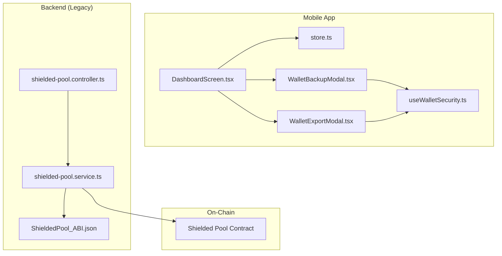
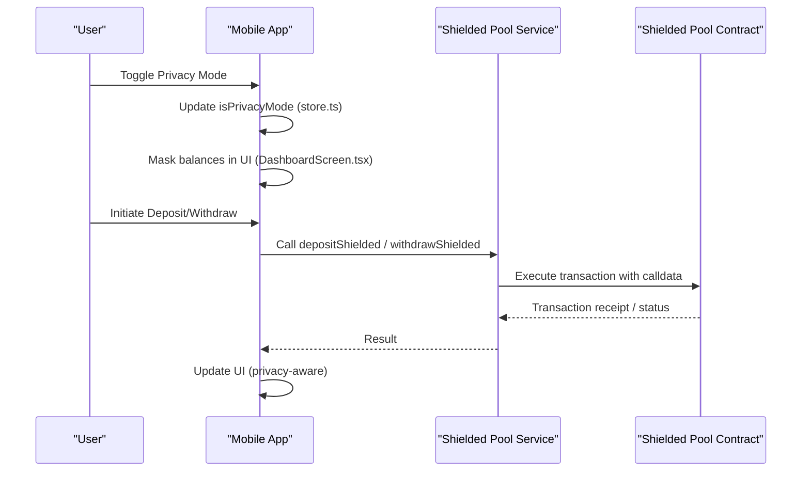
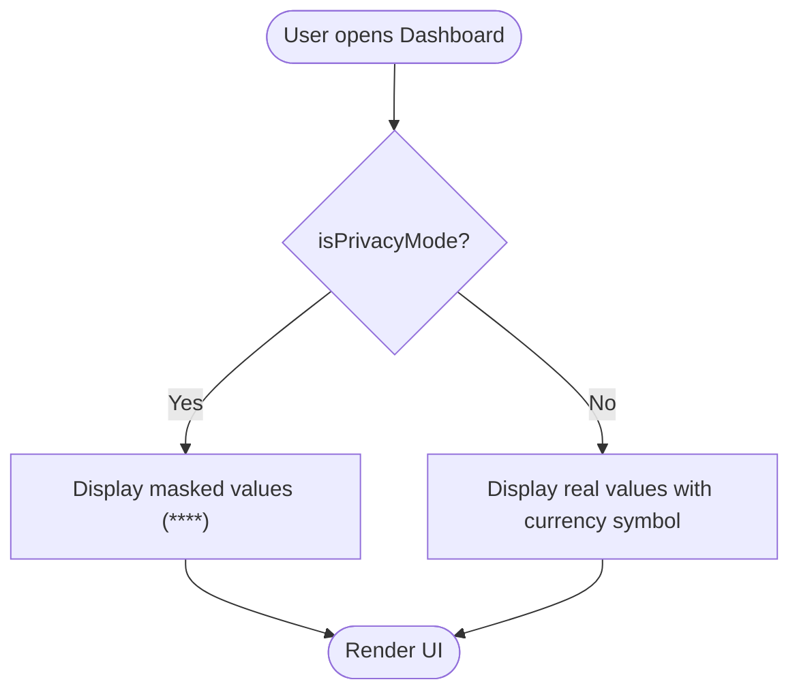
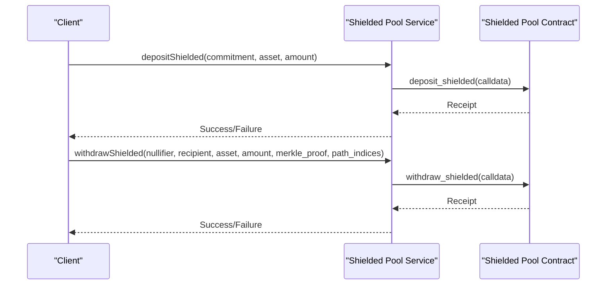
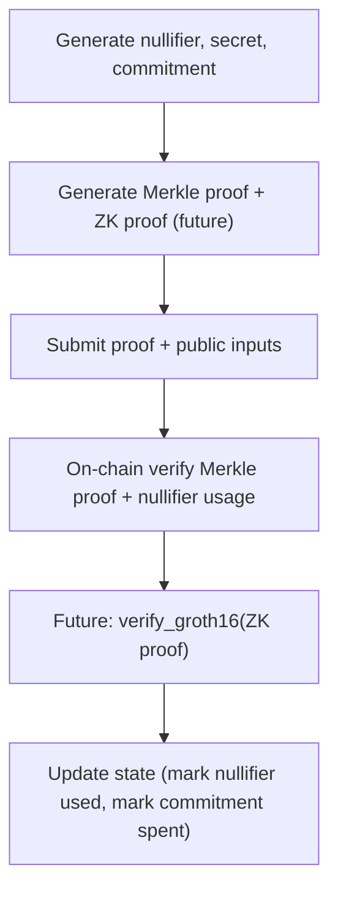
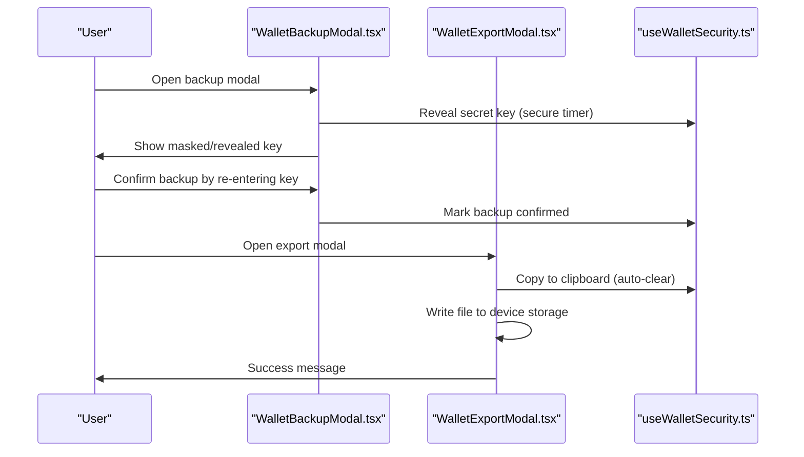
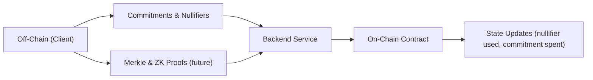
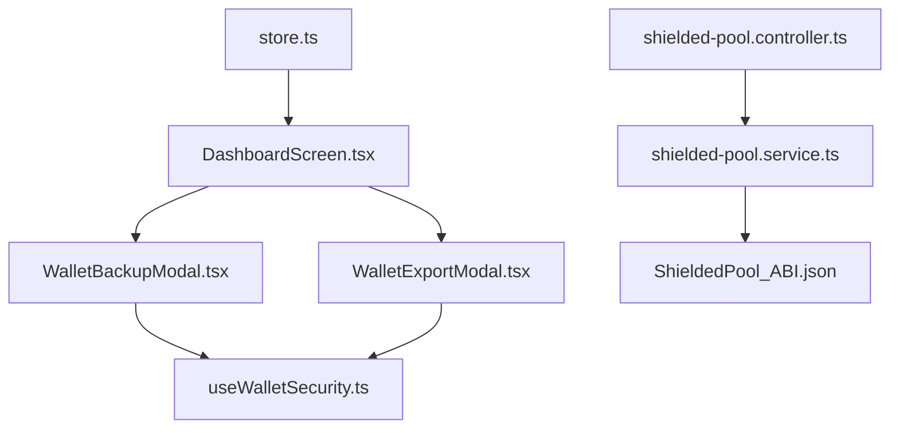

# Privacy Features

<cite>
**Referenced Files in This Document**
- [ShieldedPool ABI](file://legacy/veilend-backend/src/abis/ShieldedPool_ABI.json)
- [Shielded Pool Controller](file://legacy/veilend-backend/src/shielded-pool/shielded-pool.controller.ts)
- [Shielded Pool Service](file://legacy/veilend-backend/src/shielded-pool/shielded-pool.service.ts)
- [Shielded Pool DTOs](file://legacy/veilend-backend/src/shielded-pool/dto/shielded-pool.dto.ts)
- [Privacy Hashing Research (Legacy)](file://legacy/docs/migration/privacy-hashing-research.md)
- [Mobile Dashboard Screen](file://veilend-mobile/src/screens/DashboardScreen.tsx)
- [Mobile Store (Zustand)](file://veilend-mobile/src/store/store.ts)
- [Mobile Wallet Backup Modal](file://veilend-mobile/src/components/WalletBackupModal.tsx)
- [Mobile Wallet Export Modal](file://veilend-mobile/src/components/WalletExportModal.tsx)
- [Mobile UseWalletSecurity Hook](file://veilend-mobile/src/hooks/useWalletSecurity.ts)
- [Mobile Settings Screen](file://veilend-mobile/src/screens/SettingsScreen.tsx)
</cite>

## Table of Contents
1. [Introduction](#introduction)
2. [Project Structure](#project-structure)
3. [Core Components](#core-components)
4. [Architecture Overview](#architecture-overview)
5. [Detailed Component Analysis](#detailed-component-analysis)
6. [Dependency Analysis](#dependency-analysis)
7. [Performance Considerations](#performance-considerations)
8. [Troubleshooting Guide](#troubleshooting-guide)
9. [Conclusion](#conclusion)
10. [Appendices](#appendices)

## Introduction
This document explains VeilLend’s privacy-preserving features centered around X-Ray zero-knowledge proofs and the current shielded pool implementation. It covers:
- How users can hide sensitive balance information while maintaining protocol functionality via a privacy mode toggle.
- The balance masking mechanism that obfuscates portfolio values and transaction amounts on the mobile UI.
- Wallet security features for secure backup and export using encrypted storage.
- How zero-knowledge proofs enable private transactions without compromising protocol integrity, including the planned dual-hash strategy bridging off-chain ZK computations with on-chain verification.
- Implementation details from the mobile application showing privacy controls and UI adaptations.
- The relationship between on-chain privacy mechanisms and off-chain data handling.
- Security considerations for private key management and wallet recovery processes.

## Project Structure
VeilLend’s privacy stack spans multiple layers:
- Legacy backend components define the shielded pool API surface and service methods to interact with Starknet contracts for deposit/withdraw operations and Merkle root/nullifier queries.
- Mobile app implements privacy mode toggling, balance masking, and secure wallet backup/export flows.
- Documentation outlines the future integration of zero-knowledge proofs with on-chain verification.

**Diagram sources**
- [Mobile Dashboard Screen:1-654](file://veilend-mobile/src/screens/DashboardScreen.tsx#L1-L654)
- [Mobile Store (Zustand):1-397](file://veilend-mobile/src/store/store.ts#L1-L397)
- [Mobile Wallet Backup Modal:1-497](file://veilend-mobile/src/components/WalletBackupModal.tsx#L1-L497)
- [Mobile Wallet Export Modal:1-431](file://veilend-mobile/src/components/WalletExportModal.tsx#L1-L431)
- [Mobile UseWalletSecurity Hook:1-166](file://veilend-mobile/src/hooks/useWalletSecurity.ts#L1-L166)
- [Shielded Pool Controller:1-33](file://legacy/veilend-backend/src/shielded-pool/shielded-pool.controller.ts#L1-L33)
- [Shielded Pool Service:1-183](file://legacy/veilend-backend/src/shielded-pool/shielded-pool.service.ts#L1-L183)
- [Shielded Pool ABI](file://legacy/veilend-backend/src/abis/ShieldedPool_ABI.json)

**Section sources**
- [Mobile Dashboard Screen:1-654](file://veilend-mobile/src/screens/DashboardScreen.tsx#L1-L654)
- [Mobile Store (Zustand):1-397](file://veilend-mobile/src/store/store.ts#L1-L397)
- [Shielded Pool Controller:1-33](file://legacy/veilend-backend/src/shielded-pool/shielded-pool.controller.ts#L1-L33)
- [Shielded Pool Service:1-183](file://legacy/veilend-backend/src/shielded-pool/shielded-pool.service.ts#L1-L183)

## Core Components
- Shielded Pool Backend: Provides endpoints to query commitments, nullifiers, and Merkle roots; supports deposit and withdraw operations via Starknet contract calls.
- Mobile Privacy Mode: A user-controlled toggle that masks balances and related values across the dashboard and settings.
- Secure Backup and Export: Guided workflows to reveal, copy, and export secret keys with safety warnings and confirmation steps.
- Zero-Knowledge Proofs Integration Plan: Off-chain generation of commitments and proofs, with on-chain verification binding SHA-256 state to ZK outputs.

**Section sources**
- [Shielded Pool Controller:1-33](file://legacy/veilend-backend/src/shielded-pool/shielded-pool.controller.ts#L1-L33)
- [Shielded Pool Service:1-183](file://legacy/veilend-backend/src/shielded-pool/shielded-pool.service.ts#L1-L183)
- [Mobile Dashboard Screen:1-654](file://veilend-mobile/src/screens/DashboardScreen.tsx#L1-L654)
- [Mobile Wallet Backup Modal:1-497](file://veilend-mobile/src/components/WalletBackupModal.tsx#L1-L497)
- [Mobile Wallet Export Modal:1-431](file://veilend-mobile/src/components/WalletExportModal.tsx#L1-L431)
- [Mobile UseWalletSecurity Hook:1-166](file://veilend-mobile/src/hooks/useWalletSecurity.ts#L1-L166)
- [Privacy Hashing Research (Legacy):433-741](file://legacy/docs/migration/privacy-hashing-research.md#L433-L741)

## Architecture Overview
The privacy architecture combines client-side privacy UI with backend shielded pool services and on-chain contract interactions. Future enhancements introduce zero-knowledge proofs to strengthen privacy guarantees.

**Diagram sources**
- [Mobile Store (Zustand):173-185](file://veilend-mobile/src/store/store.ts#L173-L185)
- [Mobile Dashboard Screen:140-170](file://veilend-mobile/src/screens/DashboardScreen.tsx#L140-L170)
- [Shielded Pool Controller:24-32](file://legacy/veilend-backend/src/shielded-pool/shielded-pool.controller.ts#L24-L32)
- [Shielded Pool Service:62-115](file://legacy/veilend-backend/src/shielded-pool/shielded-pool.service.ts#L62-L115)

## Detailed Component Analysis

### X-Ray Privacy Mode and Balance Masking
- Privacy Mode Toggle: Users can enable privacy mode to hide sensitive values. The store persists this preference securely.
- Balance Masking: When privacy mode is active, dashboard cards display masked values (e.g., asterisks) instead of actual numbers.
- UI Adaptations: Icons indicate visibility state; privacy badges highlight shielded assets.

**Diagram sources**
- [Mobile Dashboard Screen:140-170](file://veilend-mobile/src/screens/DashboardScreen.tsx#L140-L170)
- [Mobile Store (Zustand):173-185](file://veilend-mobile/src/store/store.ts#L173-L185)

**Section sources**
- [Mobile Dashboard Screen:140-170](file://veilend-mobile/src/screens/DashboardScreen.tsx#L140-L170)
- [Mobile Store (Zustand):173-185](file://veilend-mobile/src/store/store.ts#L173-L185)

### Shielded Pool Operations (Deposit/Withdraw)
- Deposit Flow: Client constructs commitment and submits via backend service to Starknet contract.
- Withdraw Flow: Client provides nullifier, recipient, asset, amount, Merkle proof, and path indices; backend compiles calldata and executes transaction.
- Query Support: Backend exposes endpoints to check commitment info, nullifier usage, and Merkle root.

**Diagram sources**
- [Shielded Pool Controller:24-32](file://legacy/veilend-backend/src/shielded-pool/shielded-pool.controller.ts#L24-L32)
- [Shielded Pool Service:62-115](file://legacy/veilend-backend/src/shielded-pool/shielded-pool.service.ts#L62-L115)

**Section sources**
- [Shielded Pool Controller:1-33](file://legacy/veilend-backend/src/shielded-pool/shielded-pool.controller.ts#L1-L33)
- [Shielded Pool Service:1-183](file://legacy/veilend-backend/src/shielded-pool/shielded-pool.service.ts#L1-L183)
- [Shielded Pool DTOs:1-49](file://legacy/veilend-backend/src/shielded-pool/dto/shielded-pool.dto.ts#L1-L49)

### Zero-Knowledge Proofs Integration Plan
- Off-Chain Generation: Clients generate nullifier, secret, and commitment using hashing; prepare Merkle proofs and ZK proofs (future).
- On-Chain Verification: Contracts verify Merkle proofs and nullifier usage; future layer verifies ZK proofs binding off-chain computations to on-chain state.
- Dual-Hash Strategy: Bridges SHA-256-based on-chain state with Poseidon-based ZK computations for enhanced privacy and integrity.

**Diagram sources**
- [Privacy Hashing Research (Legacy):433-741](file://legacy/docs/migration/privacy-hashing-research.md#L433-L741)

**Section sources**
- [Privacy Hashing Research (Legacy):433-741](file://legacy/docs/migration/privacy-hashing-research.md#L433-L741)

### Wallet Security: Backup and Export
- Backup Workflow: Users reveal their secret key, copy it, confirm they saved it, and complete guided steps with warnings.
- Export Workflow: Users choose to copy to clipboard or export to file; clear clipboard after a short duration; provide success feedback.
- Secure Storage: Secret keys are stored using platform secure storage; backup confirmation flag persisted securely.

**Diagram sources**
- [Mobile Wallet Backup Modal:1-497](file://veilend-mobile/src/components/WalletBackupModal.tsx#L1-L497)
- [Mobile Wallet Export Modal:1-431](file://veilend-mobile/src/components/WalletExportModal.tsx#L1-L431)
- [Mobile UseWalletSecurity Hook:1-166](file://veilend-mobile/src/hooks/useWalletSecurity.ts#L1-L166)

**Section sources**
- [Mobile Wallet Backup Modal:1-497](file://veilend-mobile/src/components/WalletBackupModal.tsx#L1-L497)
- [Mobile Wallet Export Modal:1-431](file://veilend-mobile/src/components/WalletExportModal.tsx#L1-L431)
- [Mobile UseWalletSecurity Hook:1-166](file://veilend-mobile/src/hooks/useWalletSecurity.ts#L1-L166)

### Relationship Between On-Chain Privacy and Off-Chain Data Handling
- Off-Chain: Clients compute commitments, nullifiers, and proofs; manage privacy mode and UI masking.
- On-Chain: Contracts enforce double-spend protection via nullifiers, validate Merkle proofs, and update state accordingly.
- Backend Bridge: Services compile calldata and execute transactions, exposing read-only endpoints for commitments and nullifiers.

**Diagram sources**
- [Shielded Pool Service:1-183](file://legacy/veilend-backend/src/shielded-pool/shielded-pool.service.ts#L1-L183)
- [Privacy Hashing Research (Legacy):433-741](file://legacy/docs/migration/privacy-hashing-research.md#L433-L741)

**Section sources**
- [Shielded Pool Service:1-183](file://legacy/veilend-backend/src/shielded-pool/shielded-pool.service.ts#L1-L183)
- [Privacy Hashing Research (Legacy):433-741](file://legacy/docs/migration/privacy-hashing-research.md#L433-L741)

## Dependency Analysis
- Mobile Store depends on SecureStore for persistence of privacy mode, credentials, and preferences.
- Dashboard Screen consumes store state to render privacy-aware UI.
- Shielded Pool Controller delegates to Service for Starknet interactions.
- Service uses ABI to compile calldata and execute transactions against the contract.

**Diagram sources**
- [Mobile Store (Zustand):1-397](file://veilend-mobile/src/store/store.ts#L1-L397)
- [Mobile Dashboard Screen:1-654](file://veilend-mobile/src/screens/DashboardScreen.tsx#L1-L654)
- [Mobile Wallet Backup Modal:1-497](file://veilend-mobile/src/components/WalletBackupModal.tsx#L1-L497)
- [Mobile Wallet Export Modal:1-431](file://veilend-mobile/src/components/WalletExportModal.tsx#L1-L431)
- [Mobile UseWalletSecurity Hook:1-166](file://veilend-mobile/src/hooks/useWalletSecurity.ts#L1-L166)
- [Shielded Pool Controller:1-33](file://legacy/veilend-backend/src/shielded-pool/shielded-pool.controller.ts#L1-L33)
- [Shielded Pool Service:1-183](file://legacy/veilend-backend/src/shielded-pool/shielded-pool.service.ts#L1-L183)
- [Shielded Pool ABI](file://legacy/veilend-backend/src/abis/ShieldedPool_ABI.json)

**Section sources**
- [Mobile Store (Zustand):1-397](file://veilend-mobile/src/store/store.ts#L1-L397)
- [Shielded Pool Controller:1-33](file://legacy/veilend-backend/src/shielded-pool/shielded-pool.controller.ts#L1-L33)
- [Shielded Pool Service:1-183](file://legacy/veilend-backend/src/shielded-pool/shielded-pool.service.ts#L1-L183)

## Performance Considerations
- Privacy Mode Toggling: Lightweight state change with persistent storage; minimal performance impact.
- Balance Masking: Simple conditional rendering; negligible overhead.
- Shielded Transactions: Merkle proof verification and nullifier checks incur on-chain costs; batching and efficient proof sizes can reduce gas usage.
- Clipboard Auto-Clear: Short-lived exposure reduces risk without impacting UX significantly.

[No sources needed since this section provides general guidance]

## Troubleshooting Guide
- Privacy Mode Not Persisting: Ensure SecureStore writes succeed; check logout flow clears all keys as expected.
- Backup Confirmation Disabled: Confirm secret key re-entry matches stored value; verify secure timer behavior.
- Export Failures: Validate device storage access; handle share failures gracefully and inform users.
- Shielded Withdraw Errors: Validate nullifier not used; ensure Merkle proof matches current root; check contract method signatures.

**Section sources**
- [Mobile Store (Zustand):124-149](file://veilend-mobile/src/store/store.ts#L124-L149)
- [Mobile Wallet Backup Modal:64-80](file://veilend-mobile/src/components/WalletBackupModal.tsx#L64-L80)
- [Mobile Wallet Export Modal:52-104](file://veilend-mobile/src/components/WalletExportModal.tsx#L52-L104)
- [Shielded Pool Service:88-115](file://legacy/veilend-backend/src/shielded-pool/shielded-pool.service.ts#L88-L115)

## Conclusion
VeilLend integrates privacy-preserving features through a combination of UI-level privacy modes, secure wallet backup/export, and a shielded pool backend designed for future zero-knowledge proof integration. The current implementation emphasizes user control over sensitive data visibility while laying groundwork for advanced on-chain privacy mechanisms. Proper key management and careful handling of off-chain computations ensure both usability and security.

[No sources needed since this section summarizes without analyzing specific files]

## Appendices
- Mobile Settings: Includes privacy mode toggle and notification preferences; ensures consistent UX across screens.
- Legacy Documentation: Outlines detailed cryptographic design and future ZK integration paths.

**Section sources**
- [Mobile Settings Screen:191-230](file://veilend-mobile/src/screens/SettingsScreen.tsx#L191-L230)
- [Privacy Hashing Research (Legacy):433-741](file://legacy/docs/migration/privacy-hashing-research.md#L433-L741)