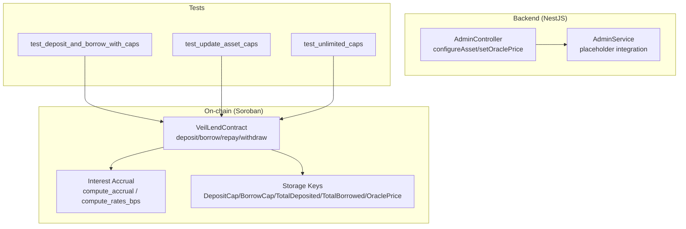
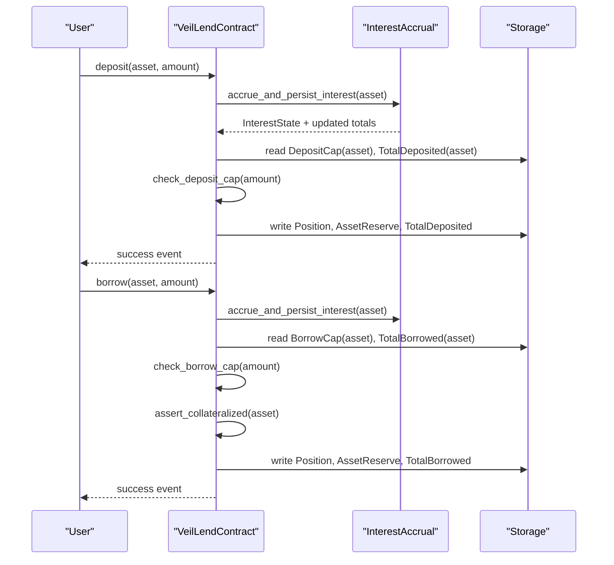
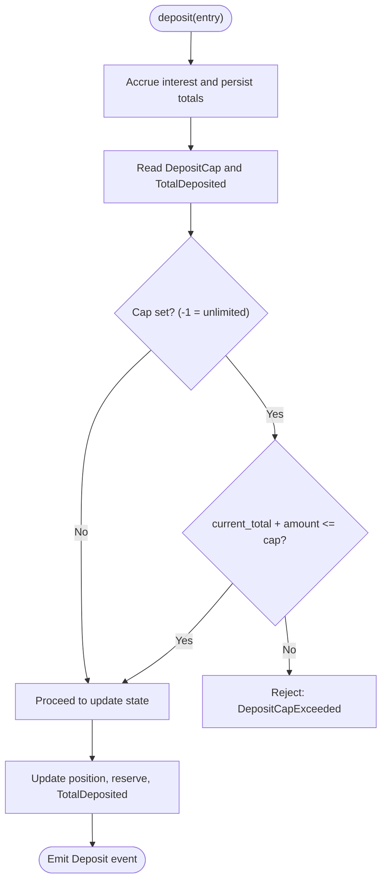
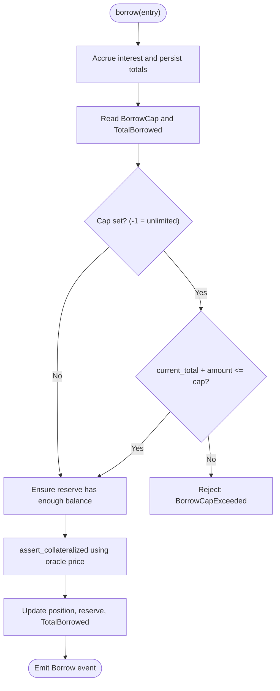
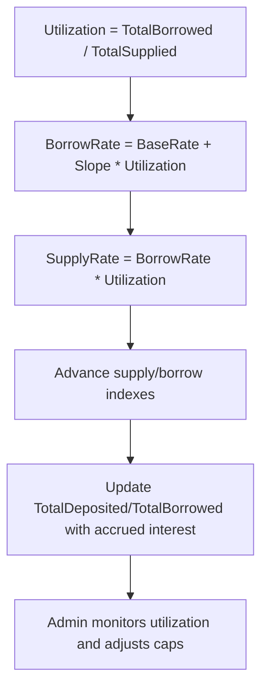
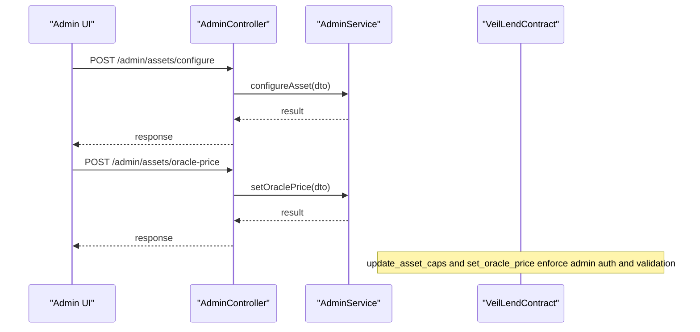
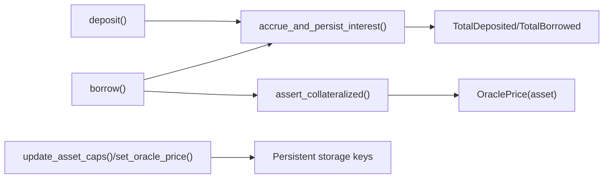

# Asset Cap Management

<cite>
**Referenced Files in This Document**
- [lib.rs](file://veilend-soroban/src/lib.rs)
- [interest.rs](file://veilend-soroban/src/interest.rs)
- [test_deposit_and_borrow_with_caps.1.json](file://veilend-soroban/test_snapshots/test_deposit_and_borrow_with_caps.1.json)
- [test_update_asset_caps.1.json](file://veilend-soroban/test_snapshots/test_update_asset_caps.1.json)
- [test_unlimited_caps.1.json](file://veilend-soroban/test_snapshots/test_unlimited_caps.1.json)
- [admin.controller.ts](file://veilend-backend/src/admin/admin.controller.ts)
- [admin.service.ts](file://veilend-backend/src/admin/admin.service.ts)
</cite>

## Table of Contents
1. [Introduction](#introduction)
2. [Project Structure](#project-structure)
3. [Core Components](#core-components)
4. [Architecture Overview](#architecture-overview)
5. [Detailed Component Analysis](#detailed-component-analysis)
6. [Dependency Analysis](#dependency-analysis)
7. [Performance Considerations](#performance-considerations)
8. [Troubleshooting Guide](#troubleshooting-guide)
9. [Conclusion](#conclusion)
10. [Appendices](#appendices)

## Introduction
This document explains VeilLend’s asset cap management system that enforces per-asset deposit and borrow limits to prevent over-concentration and manage exposure. It covers:
- How total deposit caps prevent excessive inflows into a single asset
- How borrow caps limit outstanding debt per asset
- Utilization-based interest mechanics that inform dynamic cap adjustments
- Smart contract validation, enforcement, and administrative interfaces for setting and monitoring caps
- The relationship between asset caps, oracle prices, and protocol health metrics

## Project Structure
VeilLend implements asset caps on-chain in the Soroban smart contract and exposes administrative endpoints in the NestJS backend. Test snapshots demonstrate cap configuration and enforcement flows.

**Diagram sources**
- [lib.rs:229-719](file://veilend-soroban/src/lib.rs#L229-L719)
- [interest.rs:24-87](file://veilend-soroban/src/interest.rs#L24-L87)
- [admin.controller.ts:20-55](file://veilend-backend/src/admin/admin.controller.ts#L20-L55)
- [admin.service.ts:30-55](file://veilend-backend/src/admin/admin.service.ts#L30-L55)
- [test_deposit_and_borrow_with_caps.1.json:80-107](file://veilend-soroban/test_snapshots/test_deposit_and_borrow_with_caps.1.json#L80-L107)
- [test_update_asset_caps.1.json:80-107](file://veilend-soroban/test_snapshots/test_update_asset_caps.1.json#L80-L107)
- [test_unlimited_caps.1.json:80-107](file://veilend-soroban/test_snapshots/test_unlimited_caps.1.json#L80-L107)

**Section sources**
- [lib.rs:229-719](file://veilend-soroban/src/lib.rs#L229-L719)
- [interest.rs:24-87](file://veilend-soroban/src/interest.rs#L24-L87)
- [admin.controller.ts:20-55](file://veilend-backend/src/admin/admin.controller.ts#L20-L55)
- [admin.service.ts:30-55](file://veilend-backend/src/admin/admin.service.ts#L30-L55)

## Core Components
- Per-asset caps: DepositCap and BorrowCap stored per asset; -1 means unlimited.
- Global totals: TotalDeposited and TotalBorrowed track aggregate usage per asset.
- Interest accrual: Time-based indexes update totals with accrued interest before cap checks.
- Oracle price: Required for collateral checks when borrowing or withdrawing.
- Admin controls: Configure assets, set oracle prices, and update caps.

Key responsibilities:
- Enforce deposit caps before increasing TotalDeposited
- Enforce borrow caps before increasing TotalBorrowed
- Update totals after operations
- Publish events for transparency

**Section sources**
- [lib.rs:38-57](file://veilend-soroban/src/lib.rs#L38-L57)
- [lib.rs:83-93](file://veilend-soroban/src/lib.rs#L83-L93)
- [lib.rs:346-420](file://veilend-soroban/src/lib.rs#L346-L420)
- [lib.rs:483-561](file://veilend-soroban/src/lib.rs#L483-L561)
- [lib.rs:867-911](file://veilend-soroban/src/lib.rs#L867-L911)

## Architecture Overview
The deposit and borrow paths accrue interest first, then validate against current caps using up-to-date totals. Oracle prices are required for collateralized actions. Admins can adjust caps and oracle prices via backend endpoints that call contract functions.

**Diagram sources**
- [lib.rs:483-561](file://veilend-soroban/src/lib.rs#L483-L561)
- [lib.rs:792-815](file://veilend-soroban/src/lib.rs#L792-L815)
- [lib.rs:867-911](file://veilend-soroban/src/lib.rs#L867-L911)
- [lib.rs:913-934](file://veilend-soroban/src/lib.rs#L913-L934)

## Detailed Component Analysis

### Deposit Cap Enforcement
- Before any deposit, interest is accrued so TotalDeposited reflects earned interest.
- The contract reads DepositCap and TotalDeposited for the asset.
- If DepositCap is not -1 and adding the amount would exceed the cap, the operation fails with a specific error.
- On success, position and reserve balances are updated and TotalDeposited increases.

**Diagram sources**
- [lib.rs:483-519](file://veilend-soroban/src/lib.rs#L483-L519)
- [lib.rs:867-888](file://veilend-soroban/src/lib.rs#L867-L888)

**Section sources**
- [lib.rs:483-519](file://veilend-soroban/src/lib.rs#L483-L519)
- [lib.rs:867-888](file://veilend-soroban/src/lib.rs#L867-L888)

### Borrow Cap Enforcement
- Before any borrow, interest is accrued so TotalBorrowed reflects owed interest.
- The contract reads BorrowCap and TotalBorrowed for the asset.
- If BorrowCap is not -1 and adding the amount would exceed the cap, the operation fails.
- The contract also ensures sufficient reserve balance and validates collateral ratio using oracle price.

**Diagram sources**
- [lib.rs:521-561](file://veilend-soroban/src/lib.rs#L521-L561)
- [lib.rs:890-911](file://veilend-soroban/src/lib.rs#L890-L911)
- [lib.rs:913-934](file://veilend-soroban/src/lib.rs#L913-L934)

**Section sources**
- [lib.rs:521-561](file://veilend-soroban/src/lib.rs#L521-L561)
- [lib.rs:890-911](file://veilend-soroban/src/lib.rs#L890-L911)
- [lib.rs:913-934](file://veilend-soroban/src/lib.rs#L913-L934)

### Utilization-Based Throttling and Dynamic Adjustment
- Utilization is computed from TotalBorrowed / TotalSupplied.
- Borrow rate increases linearly with utilization; supply rate is derived to ensure conservation of value.
- These rates drive index growth and affect effective user balances and costs over time.
- While caps themselves are static thresholds, administrators can use utilization trends to dynamically adjust DepositCap and BorrowCap to throttle new activity when usage is high.

**Diagram sources**
- [interest.rs:24-38](file://veilend-soroban/src/interest.rs#L24-L38)
- [interest.rs:51-87](file://veilend-soroban/src/interest.rs#L51-L87)
- [lib.rs:792-815](file://veilend-soroban/src/lib.rs#L792-L815)

**Section sources**
- [interest.rs:24-38](file://veilend-soroban/src/interest.rs#L24-L38)
- [interest.rs:51-87](file://veilend-soroban/src/interest.rs#L51-L87)
- [lib.rs:792-815](file://veilend-soroban/src/lib.rs#L792-L815)

### Administrative Interfaces
- Backend admin endpoints allow configuring assets and setting oracle prices.
- Contract functions enforce authorization and validate inputs for cap updates and oracle price changes.
- Events are emitted for transparency and off-chain indexing.

**Diagram sources**
- [admin.controller.ts:41-53](file://veilend-backend/src/admin/admin.controller.ts#L41-L53)
- [admin.service.ts:30-55](file://veilend-backend/src/admin/admin.service.ts#L30-L55)
- [lib.rs:308-395](file://veilend-soroban/src/lib.rs#L308-L395)

**Section sources**
- [admin.controller.ts:41-53](file://veilend-backend/src/admin/admin.controller.ts#L41-L53)
- [admin.service.ts:30-55](file://veilend-backend/src/admin/admin.service.ts#L30-L55)
- [lib.rs:308-395](file://veilend-soroban/src/lib.rs#L308-L395)

### Examples from Tests
- Configuring an asset initializes default unlimited caps and zero totals.
- Admin sets oracle price and explicit deposit/borrow caps.
- Multiple deposits and borrows succeed until caps are reached; exceeding caps fails.
- Unlimited caps (-1) allow large deposits and borrows without hitting limits.

References:
- Setting caps and performing deposits/borrows within limits
- Updating caps mid-operation
- Demonstrating unlimited caps behavior

**Section sources**
- [test_deposit_and_borrow_with_caps.1.json:80-107](file://veilend-soroban/test_snapshots/test_deposit_and_borrow_with_caps.1.json#L80-L107)
- [test_update_asset_caps.1.json:80-107](file://veilend-soroban/test_snapshots/test_update_asset_caps.1.json#L80-L107)
- [test_unlimited_caps.1.json:80-107](file://veilend-soroban/test_snapshots/test_unlimited_caps.1.json#L80-L107)

## Dependency Analysis
- Deposit/borrow entrypoints depend on interest accrual to keep totals accurate before cap checks.
- Collateral checks depend on oracle prices being set for the asset.
- Admin endpoints depend on authentication and guard layers; contract calls require admin authorization.
- Events provide auditability for cap updates and operational changes.

**Diagram sources**
- [lib.rs:483-561](file://veilend-soroban/src/lib.rs#L483-L561)
- [lib.rs:792-815](file://veilend-soroban/src/lib.rs#L792-L815)
- [lib.rs:913-934](file://veilend-soroban/src/lib.rs#L913-L934)
- [lib.rs:308-395](file://veilend-soroban/src/lib.rs#L308-L395)

**Section sources**
- [lib.rs:483-561](file://veilend-soroban/src/lib.rs#L483-L561)
- [lib.rs:792-815](file://veilend-soroban/src/lib.rs#L792-L815)
- [lib.rs:913-934](file://veilend-soroban/src/lib.rs#L913-L934)
- [lib.rs:308-395](file://veilend-soroban/src/lib.rs#L308-L395)

## Performance Considerations
- Interest accrual runs on every mutating operation to keep totals current; this ensures accurate cap enforcement but adds computation proportional to elapsed time and number of touches.
- Using -1 for unlimited caps avoids repeated boundary checks and simplifies logic.
- Oracle price lookups are O(1) per collateral check; missing prices cause immediate failures, preventing risky operations.
- Event emissions are lightweight and enable efficient off-chain indexing for dashboards and alerts.

[No sources needed since this section provides general guidance]

## Troubleshooting Guide
Common errors and their causes:
- DepositCapExceeded: Attempted deposit would push TotalDeposited above DepositCap.
- BorrowCapExceeded: Attempted borrow would push TotalBorrowed above BorrowCap.
- InsufficientCollateral: Borrow/withdraw would violate minimum collateral ratio given oracle price.
- OraclePriceMissing: Collateral checks require a configured oracle price for the asset.
- ContractPaused: New deposits/borrows blocked while contract is paused; repay/withdraw remain allowed.
- Unauthorized: Admin-only functions called by non-admin addresses.

Remediation steps:
- Adjust DepositCap/BorrowCap via admin interface to align with market conditions.
- Set or update oracle price if missing or stale.
- Pause/unpause contract during emergencies; users can still repay and withdraw.
- Monitor utilization and reserves to proactively adjust caps and avoid frequent rejections.

**Section sources**
- [lib.rs:107-145](file://veilend-soroban/src/lib.rs#L107-L145)
- [lib.rs:450-479](file://veilend-soroban/src/lib.rs#L450-L479)
- [lib.rs:867-911](file://veilend-soroban/src/lib.rs#L867-L911)
- [lib.rs:913-934](file://veilend-soroban/src/lib.rs#L913-L934)

## Conclusion
VeilLend’s asset cap system uses per-asset deposit and borrow limits backed by accurate, interest-adjusted totals to prevent over-concentration and manage risk. Administrators can dynamically tune caps and oracle prices through secure backend endpoints, while on-chain validations enforce policy consistently. Utilization-driven interest mechanics provide signals for proactive cap adjustments, helping maintain protocol health under varying market conditions.

[No sources needed since this section summarizes without analyzing specific files]

## Appendices

### Data Model Summary
- DepositCap(Address): i128 — maximum total deposits per asset (-1 unlimited)
- BorrowCap(Address): i128 — maximum total borrows per asset (-1 unlimited)
- TotalDeposited(Address): i128 — aggregate deposited including accrued interest
- TotalBorrowed(Address): i128 — aggregate borrowed including accrued interest
- OraclePrice(Address): i128 — price used for collateral calculations
- Paused: bool — circuit breaker flag blocking new deposits/borrows

**Section sources**
- [lib.rs:38-57](file://veilend-soroban/src/lib.rs#L38-L57)
- [lib.rs:308-344](file://veilend-soroban/src/lib.rs#L308-L344)
- [lib.rs:450-479](file://veilend-soroban/src/lib.rs#L450-L479)