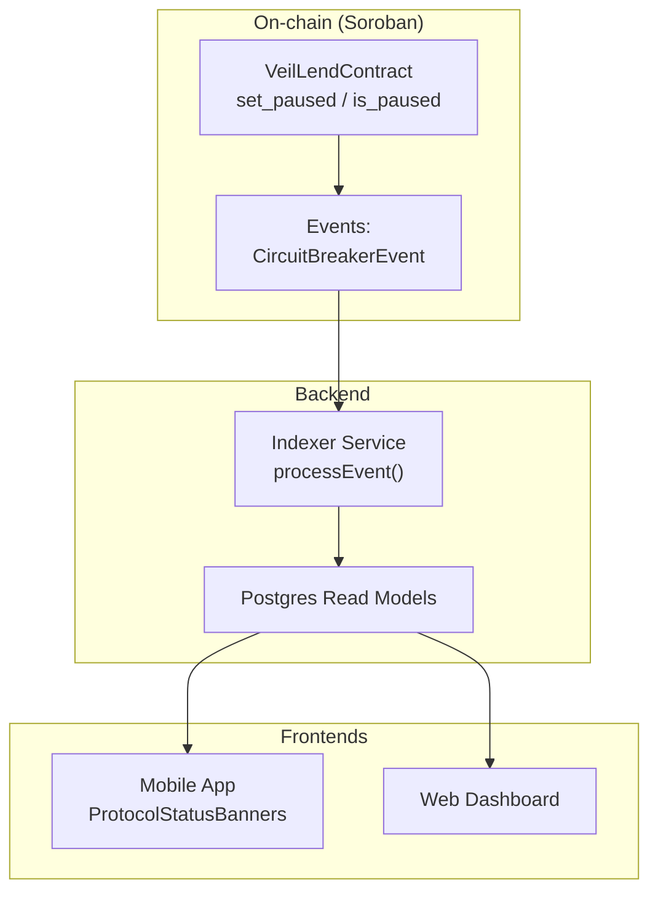
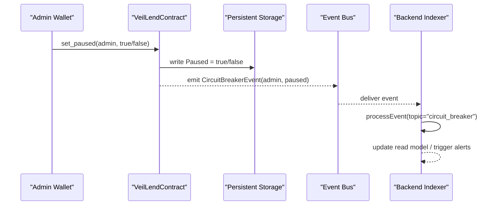
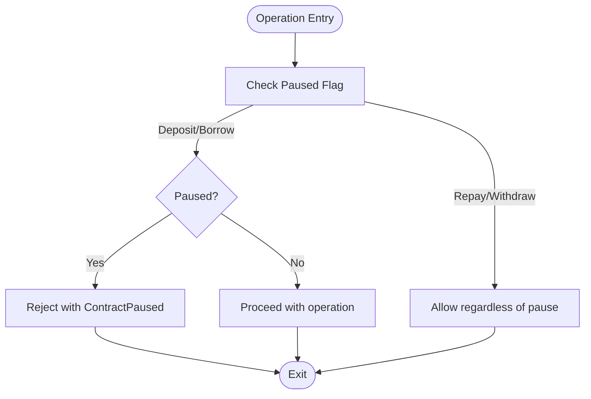
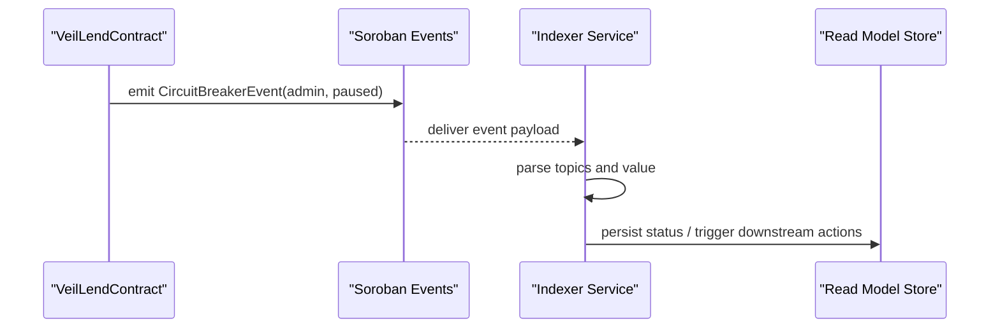
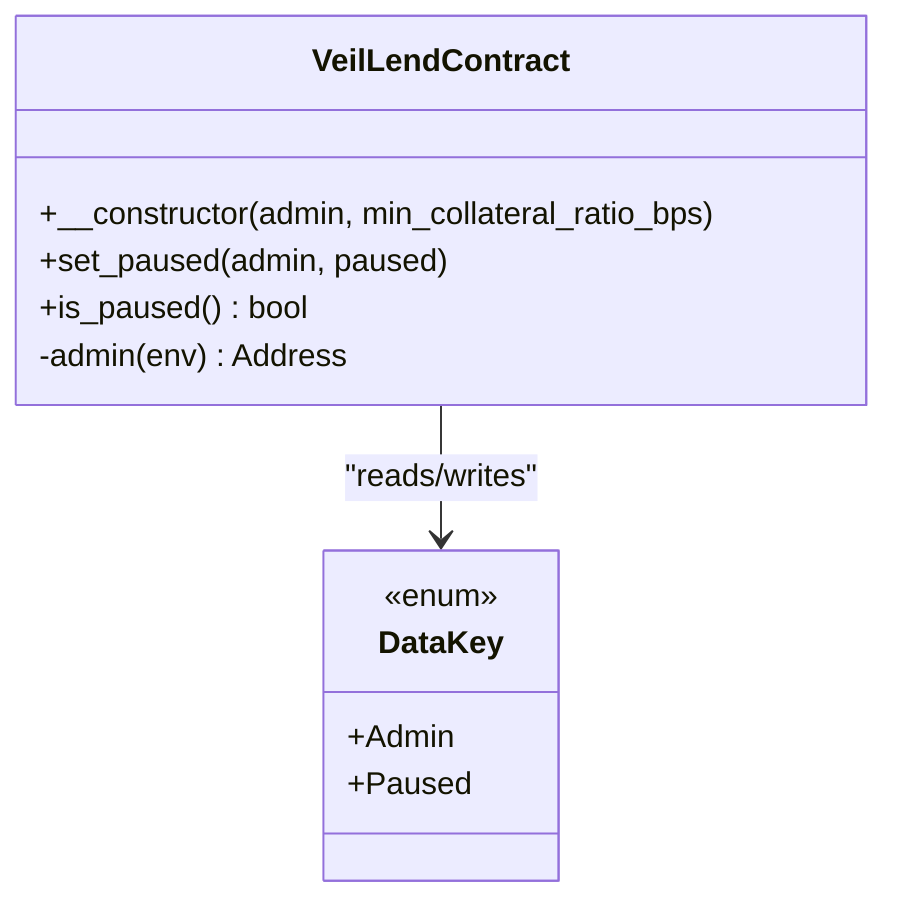
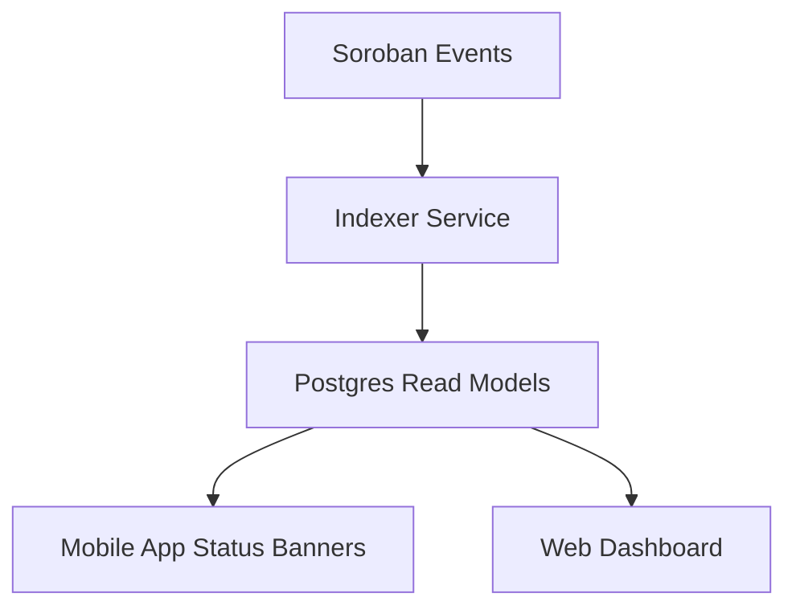
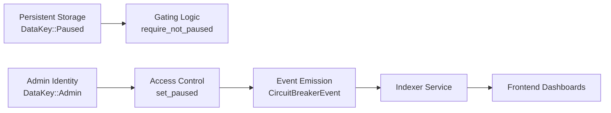

# Circuit Breaker System

<cite>
**Referenced Files in This Document**
- [lib.rs](file://veilend-soroban/src/lib.rs)
- [integration.rs](file://veilend-soroban/tests/integration.rs)
- [test_circuit_breaker_pause.1.json](file://veilend-soroban/test_snapshots/test_circuit_breaker_pause.1.json)
- [test_circuit_breaker_unauthorized.1.json](file://veilend-soroban/test_snapshots/test_circuit_breaker_unauthorized.1.json)
- [test_circuit_breaker_events.1.json](file://veilend-soroban/test_snapshots/test_circuit_breaker_events.1.json)
- [indexer.service.ts](file://veilend-backend/src/indexer/indexer.service.ts)
- [INDEXER.md](file://veilend-backend/INDEXER.md)
- [ProtocolStatusBanners.tsx](file://veilend-mobile/src/components/ProtocolStatusBanners.tsx)
- [protocolStatus.ts](file://veilend-mobile/src/utils/protocolStatus.ts)
</cite>

## Table of Contents
1. [Introduction](#introduction)
2. [Project Structure](#project-structure)
3. [Core Components](#core-components)
4. [Architecture Overview](#architecture-overview)
5. [Detailed Component Analysis](#detailed-component-analysis)
6. [Dependency Analysis](#dependency-analysis)
7. [Performance Considerations](#performance-considerations)
8. [Troubleshooting Guide](#troubleshooting-guide)
9. [Conclusion](#conclusion)
10. [Appendices](#appendices)

## Introduction
This document explains VeilLend’s circuit breaker functionality that provides emergency pause capabilities during protocol emergencies or extreme market conditions. It covers how administrators can activate a global pause to halt critical operations such as deposits and borrows, while still allowing users to repay debt and withdraw collateral. It documents the event emission system for notifying external systems of state changes, access control for authorized administrators, and on-chain state persistence. It also outlines monitoring dashboards and alerting strategies built into the backend indexer and mobile app, and describes recovery procedures for gradually resuming normal operations after a crisis is resolved.

## Project Structure
The circuit breaker spans three layers:
- On-chain Soroban contract: defines pause state, admin-only controls, checks, and events.
- Backend indexer: consumes on-chain events and exposes protocol status to applications.
- Mobile/web frontends: surface alerts and banners based on protocol status.

**Diagram sources**
- [lib.rs:208-214](file://veilend-soroban/src/lib.rs#L208-L214)
- [lib.rs:450-479](file://veilend-soroban/src/lib.rs#L450-L479)
- [indexer.service.ts:173-209](file://veilend-backend/src/indexer/indexer.service.ts#L173-L209)
- [ProtocolStatusBanners.tsx:1-48](file://veilend-mobile/src/components/ProtocolStatusBanners.tsx#L1-L48)

**Section sources**
- [lib.rs:208-214](file://veilend-soroban/src/lib.rs#L208-L214)
- [lib.rs:450-479](file://veilend-soroban/src/lib.rs#L450-L479)
- [indexer.service.ts:173-209](file://veilend-backend/src/indexer/indexer.service.ts#L173-L209)
- [ProtocolStatusBanners.tsx:1-48](file://veilend-mobile/src/components/ProtocolStatusBanners.tsx#L1-L48)

## Core Components
- Circuit breaker state: A persistent boolean flag indicating whether the protocol is paused.
- Admin-only control: Only the stored admin address can toggle pause/unpause with authentication.
- Operation gating: Deposit and borrow are blocked when paused; repay and withdraw remain available.
- Event emission: A dedicated event records who toggled the circuit breaker and the new state.
- Indexer integration: The backend indexer listens for events and updates read models for dashboards.
- Frontend awareness: Mobile and web clients display warnings when the protocol is paused or out-of-sync.

Key implementation references:
- Pause storage key and default initialization at contract construction.
- set_paused and is_paused entry points.
- require_not_paused guard used by deposit and borrow.
- CircuitBreakerEvent emitted on every pause change.

**Section sources**
- [lib.rs:242-258](file://veilend-soroban/src/lib.rs#L242-L258)
- [lib.rs:450-479](file://veilend-soroban/src/lib.rs#L450-L479)
- [lib.rs:483-523](file://veilend-soroban/src/lib.rs#L483-L523)
- [lib.rs:563-639](file://veilend-soroban/src/lib.rs#L563-L639)
- [lib.rs:856-865](file://veilend-soroban/src/lib.rs#L856-L865)
- [lib.rs:208-214](file://veilend-soroban/src/lib.rs#L208-L214)

## Architecture Overview
The circuit breaker enforces an emergency stop mechanism at the protocol level while preserving user exit paths. Administrators call set_paused to toggle the global pause flag. When paused, deposit and borrow operations fail early with a specific error code. Repay and withdraw continue to function so users can reduce risk exposure. Every pause change emits a well-typed event consumed by the backend indexer, which persists status for dashboards and alerting.

**Diagram sources**
- [lib.rs:450-468](file://veilend-soroban/src/lib.rs#L450-L468)
- [lib.rs:208-214](file://veilend-soroban/src/lib.rs#L208-L214)
- [indexer.service.ts:173-209](file://veilend-backend/src/indexer/indexer.service.ts#L173-L209)

## Detailed Component Analysis

### On-chain Circuit Breaker Logic
- State persistence: The Paused flag is stored under a dedicated key and initialized to false at contract creation.
- Access control: set_pausted requires the caller to match the stored admin and calls require_auth.
- Gating logic: deposit and borrow call require_not_paused before any state mutation; repay and withdraw do not gate on pause.
- Error signaling: When paused, deposit/borrow fail with a specific error code to signal ContractPaused.
- Event emission: CircuitBreakerEvent includes the admin address and the new paused state.

**Diagram sources**
- [lib.rs:483-523](file://veilend-soroban/src/lib.rs#L483-L523)
- [lib.rs:563-639](file://veilend-soroban/src/lib.rs#L563-L639)
- [lib.rs:856-865](file://veilend-soroban/src/lib.rs#L856-L865)

**Section sources**
- [lib.rs:242-258](file://veilend-soroban/src/lib.rs#L242-L258)
- [lib.rs:450-479](file://veilend-soroban/src/lib.rs#L450-L479)
- [lib.rs:483-523](file://veilend-soroban/src/lib.rs#L483-L523)
- [lib.rs:563-639](file://veilend-soroban/src/lib.rs#L563-L639)
- [lib.rs:856-865](file://veilend-soroban/src/lib.rs#L856-L865)

### Event Emission System
- Event type: CircuitBreakerEvent carries topics identifying the protocol and event kind, plus the admin and paused state.
- Consumers: The backend indexer processes events with topic matching and updates read models accordingly.
- Test snapshots: Provide concrete traces of event emissions during pause/unpause flows.

**Diagram sources**
- [lib.rs:208-214](file://veilend-soroban/src/lib.rs#L208-L214)
- [indexer.service.ts:173-209](file://veilend-backend/src/indexer/indexer.service.ts#L173-L209)

**Section sources**
- [lib.rs:208-214](file://veilend-soroban/src/lib.rs#L208-L214)
- [indexer.service.ts:173-209](file://veilend-backend/src/indexer/indexer.service.ts#L173-L209)
- [test_circuit_breaker_events.1.json:1-54](file://veilend-soroban/test_snapshots/test_circuit_breaker_events.1.json#L1-L54)

### Access Control and Authorization
- Admin identity: Stored at contract initialization and enforced for administrative functions.
- Authentication: set_paused requires explicit auth from the admin address.
- Unauthorized attempts: Non-admin callers attempting to pause are rejected without changing state.

**Diagram sources**
- [lib.rs:242-258](file://veilend-soroban/src/lib.rs#L242-L258)
- [lib.rs:450-468](file://veilend-soroban/src/lib.rs#L450-L468)
- [lib.rs:706-718](file://veilend-soroban/src/lib.rs#L706-L718)

**Section sources**
- [lib.rs:242-258](file://veilend-soroban/src/lib.rs#L242-L258)
- [lib.rs:450-468](file://veilend-soroban/src/lib.rs#L450-L468)
- [lib.rs:706-718](file://veilend-soroban/src/lib.rs#L706-L718)
- [integration.rs:129-146](file://veilend-soroban/tests/integration.rs#L129-L146)
- [test_circuit_breaker_unauthorized.1.json:49-99](file://veilend-soroban/test_snapshots/test_circuit_breaker_unauthorized.1.json#L49-L99)

### Monitoring Dashboards and Alerting
- Backend indexer: Processes contract events and updates read models; supports resume/replay behaviors for robustness.
- Mobile app: Displays protocol status banners based on wallet connectivity, network mismatch, and sync lag; can be extended to show pause status via indexer data.
- Web dashboard: Provides error handling and retry flows; can integrate pause indicators through API responses.

**Diagram sources**
- [indexer.service.ts:173-209](file://veilend-backend/src/indexer/indexer.service.ts#L173-L209)
- [INDEXER.md:20-33](file://veilend-backend/INDEXER.md#L20-L33)
- [ProtocolStatusBanners.tsx:1-48](file://veilend-mobile/src/components/ProtocolStatusBanners.tsx#L1-L48)
- [protocolStatus.ts:1-49](file://veilend-mobile/src/utils/protocolStatus.ts#L1-L49)

**Section sources**
- [indexer.service.ts:173-209](file://veilend-backend/src/indexer/indexer.service.ts#L173-L209)
- [INDEXER.md:20-33](file://veilend-backend/INDEXER.md#L20-L33)
- [ProtocolStatusBanners.tsx:1-48](file://veilend-mobile/src/components/ProtocolStatusBanners.tsx#L1-L48)
- [protocolStatus.ts:1-49](file://veilend-mobile/src/utils/protocolStatus.ts#L1-L49)

### Recovery Procedures and Gradual Resumption
- Immediate stabilization: Activate pause to block new risky exposures (deposits/borrows).
- User wind-down: Encourage users to repay and withdraw while paused to reduce leverage and liquidity risk.
- Validation: Confirm reserves and positions are healthy using read models exposed by the indexer.
- Controlled restart: Unpause only after risk parameters are restored and market conditions stabilize.
- Gradual ramp-up: Optionally re-enable features incrementally (e.g., allow repayments first, then withdrawals, then new deposits/borrows) by adjusting caps and oracle prices before fully unpausing.

Operational notes grounded in contract behavior:
- While paused, repay and withdraw remain functional, enabling safe de-risking.
- After resolution, calling set_paused(false) restores normal flow for all operations.

**Section sources**
- [lib.rs:483-523](file://veilend-soroban/src/lib.rs#L483-L523)
- [lib.rs:563-639](file://veilend-soroban/src/lib.rs#L563-L639)
- [integration.rs:86-127](file://veilend-soroban/tests/integration.rs#L86-L127)

## Dependency Analysis
The circuit breaker depends on:
- Persistent storage for the Paused flag and admin identity.
- Event bus for emitting CircuitBreakerEvent.
- Backend indexer for consuming events and exposing status to apps.
- Frontend components for displaying status and guiding user actions.

**Diagram sources**
- [lib.rs:242-258](file://veilend-soroban/src/lib.rs#L242-L258)
- [lib.rs:450-468](file://veilend-soroban/src/lib.rs#L450-L468)
- [lib.rs:856-865](file://veilend-soroban/src/lib.rs#L856-L865)
- [indexer.service.ts:173-209](file://veilend-backend/src/indexer/indexer.service.ts#L173-L209)

**Section sources**
- [lib.rs:242-258](file://veilend-soroban/src/lib.rs#L242-L258)
- [lib.rs:450-468](file://veilend-soroban/src/lib.rs#L450-L468)
- [lib.rs:856-865](file://veilend-soroban/src/lib.rs#L856-L865)
- [indexer.service.ts:173-209](file://veilend-backend/src/indexer/indexer.service.ts#L173-L209)

## Performance Considerations
- Minimal on-chain overhead: Pause checks are simple reads and early exits, avoiding expensive computations.
- Event-driven updates: Offloading status propagation to the indexer keeps contracts lean and responsive.
- Idempotent indexing: The indexer handles duplicate events safely, ensuring consistent read models even after restarts or replays.

[No sources needed since this section provides general guidance]

## Troubleshooting Guide
Common issues and resolutions:
- Unexpected deposit/borrow failures: Verify if the contract is paused; check CircuitBreakerEvent history via indexer logs.
- Unauthorized pause attempts: Ensure the caller matches the stored admin and has proper authorization; review unauthorized test cases.
- Stale frontend status: Re-index or replay events if necessary; confirm indexer checkpoint and retention settings.

Diagnostic references:
- Pause behavior and allowed operations under pause.
- Unauthorized pause attempt handling.
- Event snapshot traces for pause/unpause flows.

**Section sources**
- [integration.rs:86-127](file://veilend-soroban/tests/integration.rs#L86-L127)
- [integration.rs:129-146](file://veilend-soroban/tests/integration.rs#L129-L146)
- [test_circuit_breaker_pause.1.json:89-138](file://veilend-soroban/test_snapshots/test_circuit_breaker_pause.1.json#L89-L138)
- [test_circuit_breaker_unauthorized.1.json:49-99](file://veilend-soroban/test_snapshots/test_circuit_breaker_unauthorized.1.json#L49-L99)

## Conclusion
VeilLend’s circuit breaker provides a robust emergency pause mechanism controlled exclusively by the admin, with clear event emissions and resilient indexing. It blocks new risky operations while preserving user exit paths, enabling safe de-risking during crises. Monitoring dashboards and alerting systems built on top of the indexer ensure operators and users are informed. Recovery involves validating protocol health and carefully resuming operations, leveraging the fact that repay and withdraw remain available throughout the pause period.

[No sources needed since this section summarizes without analyzing specific files]

## Appendices

### Key Function References
- set_paused: Toggle pause/unpause with admin auth and event emission.
- is_paused: Query current pause state.
- deposit/borrow: Blocked when paused; otherwise proceed with interest accrual and cap checks.
- repay/withdraw: Allowed even when paused to enable user de-risking.

**Section sources**
- [lib.rs:450-479](file://veilend-soroban/src/lib.rs#L450-L479)
- [lib.rs:483-523](file://veilend-soroban/src/lib.rs#L483-L523)
- [lib.rs:563-639](file://veilend-soroban/src/lib.rs#L563-L639)

### Event Schema Reference
- CircuitBreakerEvent: Topics include protocol identifier and event kind; payload includes admin address and paused boolean.

**Section sources**
- [lib.rs:208-214](file://veilend-soroban/src/lib.rs#L208-L214)
- [test_circuit_breaker_events.1.json:1-54](file://veilend-soroban/test_snapshots/test_circuit_breaker_events.1.json#L1-L54)