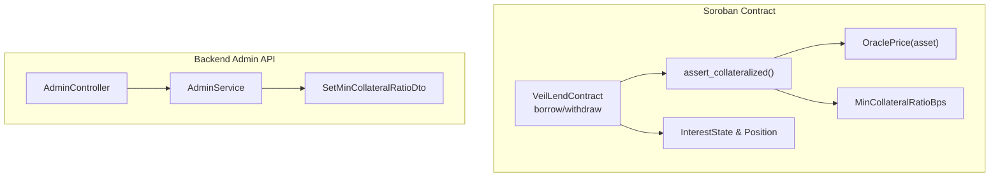
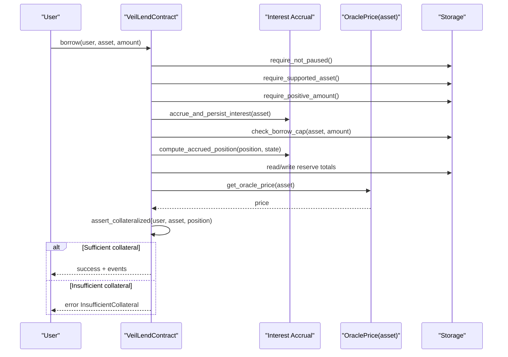
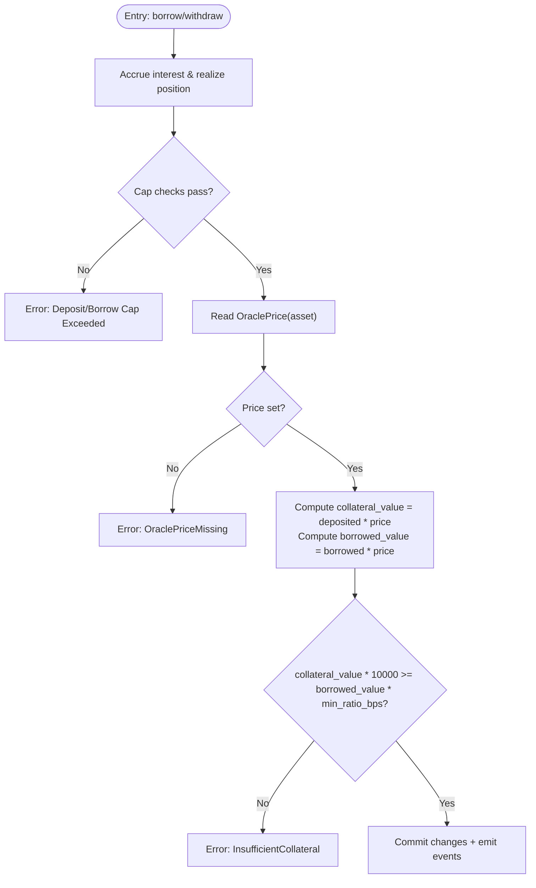
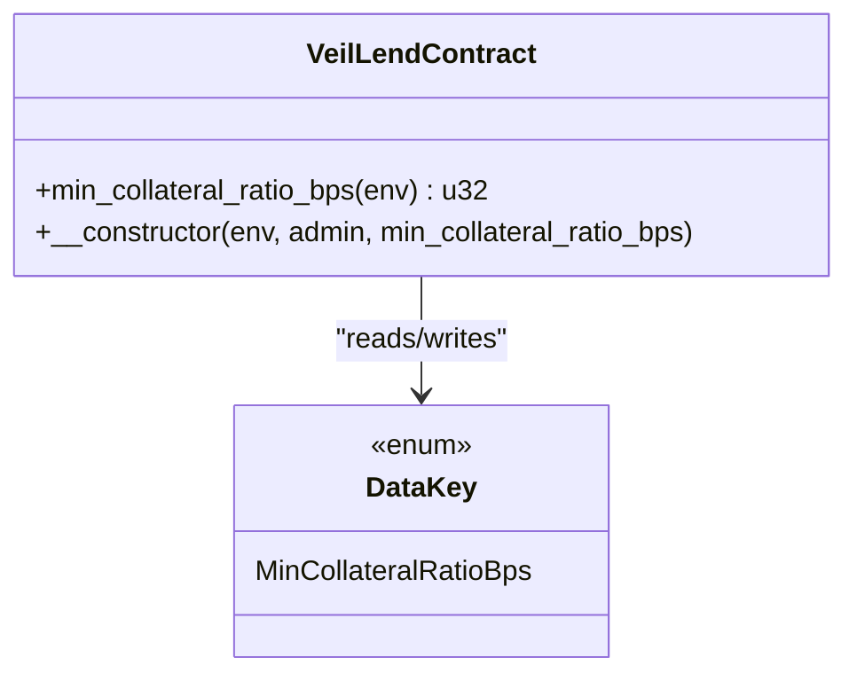
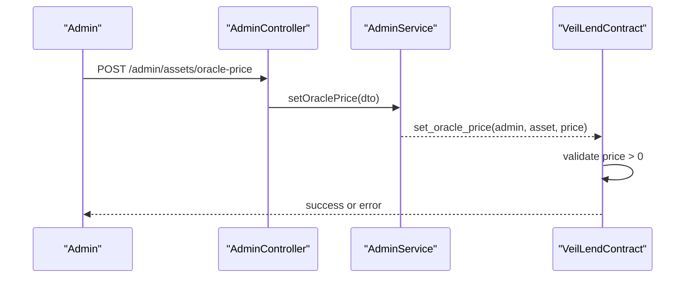
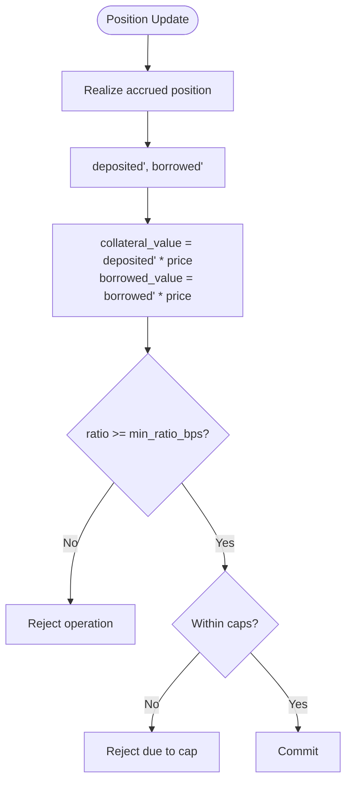
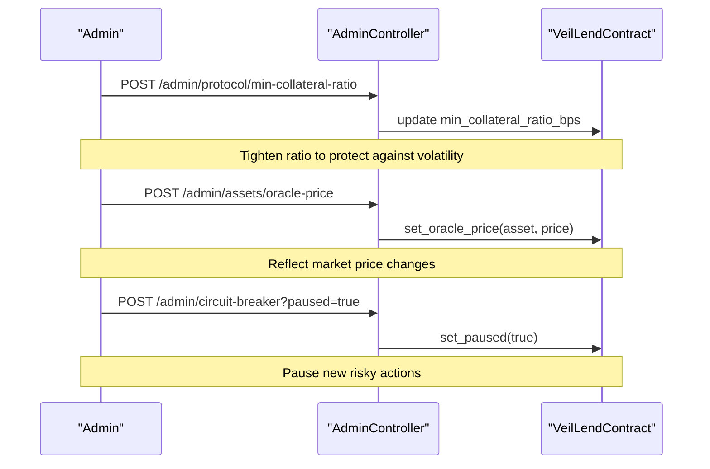
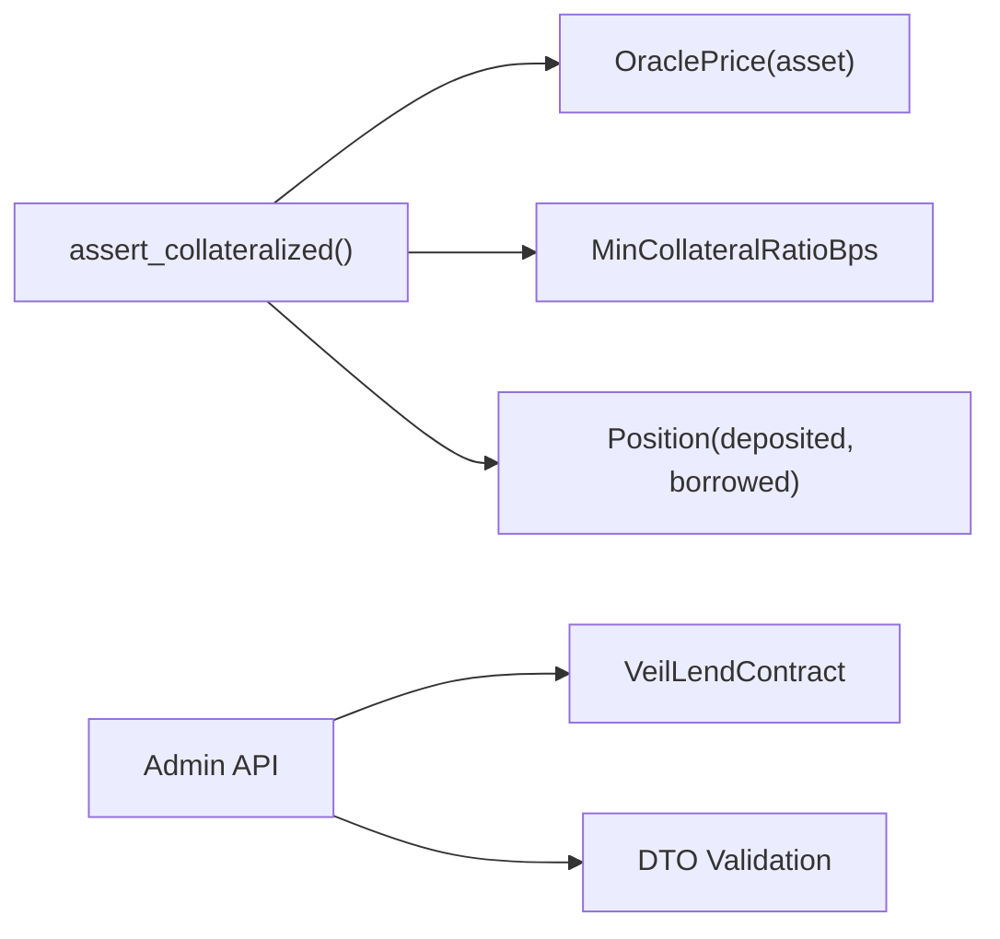

# Collateral Ratio Enforcement

<cite>
**Referenced Files in This Document**
- [lib.rs](file://veilend-soroban/src/lib.rs)
- [interest.rs](file://veilend-soroban/src/interest.rs)
- [admin.controller.ts](file://veilend-backend/src/admin/admin.controller.ts)
- [admin.service.ts](file://veilend-backend/src/admin/admin.service.ts)
- [set-min-collateral-ratio.dto.ts](file://veilend-backend/src/admin/dto/set-min-collateral-ratio.dto.ts)
</cite>

## Table of Contents
1. [Introduction](#introduction)
2. [Project Structure](#project-structure)
3. [Core Components](#core-components)
4. [Architecture Overview](#architecture-overview)
5. [Detailed Component Analysis](#detailed-component-analysis)
6. [Dependency Analysis](#dependency-analysis)
7. [Performance Considerations](#performance-considerations)
8. [Troubleshooting Guide](#troubleshooting-guide)
9. [Conclusion](#conclusion)

## Introduction
This document explains VeilLend’s collateral ratio enforcement system on the Soroban smart contract and the administrative controls that manage it. It covers how borrowing power is validated against deposited collateral using real-time oracle prices, how minimum collateral ratios are configured and enforced, and how positions are protected from becoming undercollateralized. It also documents the relationship between asset valuations, position sizes, and borrowing limits, including emergency controls during market volatility.

## Project Structure
The collateral ratio enforcement spans:
- The Soroban smart contract implementing validation logic, oracle price usage, and interest accrual integration.
- The backend admin API exposing endpoints to configure assets, set oracle prices, and adjust protocol-wide parameters such as the minimum collateral ratio.

**Diagram sources**
- [lib.rs:521-560](file://veilend-soroban/src/lib.rs#L521-L560)
- [lib.rs:600-639](file://veilend-soroban/src/lib.rs#L600-L639)
- [lib.rs:913-934](file://veilend-soroban/src/lib.rs#L913-L934)
- [lib.rs:713-718](file://veilend-soroban/src/lib.rs#L713-L718)
- [admin.controller.ts:46-53](file://veilend-backend/src/admin/admin.controller.ts#L46-L53)
- [admin.service.ts:39-55](file://veilend-backend/src/admin/admin.service.ts#L39-L55)
- [set-min-collateral-ratio.dto.ts:1-8](file://veilend-backend/src/admin/dto/set-min-collateral-ratio.dto.ts#L1-L8)

**Section sources**
- [lib.rs:242-258](file://veilend-soroban/src/lib.rs#L242-L258)
- [lib.rs:308-344](file://veilend-soroban/src/lib.rs#L308-L344)
- [lib.rs:521-560](file://veilend-soroban/src/lib.rs#L521-L560)
- [lib.rs:600-639](file://veilend-soroban/src/lib.rs#L600-L639)
- [lib.rs:713-718](file://veilend-soroban/src/lib.rs#L713-L718)
- [lib.rs:913-934](file://veilend-soroban/src/lib.rs#L913-L934)
- [admin.controller.ts:46-53](file://veilend-backend/src/admin/admin.controller.ts#L46-L53)
- [admin.service.ts:39-55](file://veilend-backend/src/admin/admin.service.ts#L39-L55)
- [set-min-collateral-ratio.dto.ts:1-8](file://veilend-backend/src/admin/dto/set-min-collateral-ratio.dto.ts#L1-L8)

## Core Components
- Collateral ratio enforcement: Enforced in borrow and withdraw flows via a centralized assertion that compares collateral value to borrowed value using oracle prices and the configured minimum collateral ratio (in basis points).
- Oracle price integration: Each asset must have an oracle price set by an authorized admin; missing prices cause explicit failures to prevent unsafe operations.
- Interest accrual: Positions and reserves are updated with accrued interest before checks, ensuring accurate balances for ratio calculations.
- Administrative controls: Admins can configure assets, set oracle prices, and update the global minimum collateral ratio through the backend API.

Key behaviors:
- Borrowing requires sufficient collateral after accrual and cap checks.
- Withdrawing collateral is allowed even when paused but still enforces collateralization post-withdrawal.
- Missing or invalid oracle prices block risky operations.

**Section sources**
- [lib.rs:521-560](file://veilend-soroban/src/lib.rs#L521-L560)
- [lib.rs:600-639](file://veilend-soroban/src/lib.rs#L600-L639)
- [lib.rs:913-934](file://veilend-soroban/src/lib.rs#L913-L934)
- [lib.rs:308-344](file://veilend-soroban/src/lib.rs#L308-L344)
- [lib.rs:713-718](file://veilend-soroban/src/lib.rs#L713-L718)

## Architecture Overview
The enforcement flow integrates oracle pricing, interest accrual, and ratio checks at critical entry points.

**Diagram sources**
- [lib.rs:521-560](file://veilend-soroban/src/lib.rs#L521-L560)
- [lib.rs:782-815](file://veilend-soroban/src/lib.rs#L782-L815)
- [lib.rs:913-934](file://veilend-soroban/src/lib.rs#L913-L934)
- [lib.rs:308-344](file://veilend-soroban/src/lib.rs#L308-L344)

## Detailed Component Analysis

### Collateral Ratio Validation Logic
- Entry points: borrow and withdraw both call a shared assertion to ensure positions remain adequately collateralized after changes.
- Ratio calculation: The contract computes collateral value and borrowed value using the oracle price for the asset and compares them against the minimum collateral ratio stored in basis points. If collateral_value * 10,000 < borrowed_value * min_ratio_bps, the operation fails.
- Oracle dependency: If no oracle price is set for the asset, the operation fails explicitly to avoid undefined valuation.

**Diagram sources**
- [lib.rs:521-560](file://veilend-soroban/src/lib.rs#L521-L560)
- [lib.rs:600-639](file://veilend-soroban/src/lib.rs#L600-L639)
- [lib.rs:913-934](file://veilend-soroban/src/lib.rs#L913-L934)

**Section sources**
- [lib.rs:521-560](file://veilend-soroban/src/lib.rs#L521-L560)
- [lib.rs:600-639](file://veilend-soroban/src/lib.rs#L600-L639)
- [lib.rs:913-934](file://veilend-soroban/src/lib.rs#L913-L934)

### Minimum Collateral Ratio Configuration
- Storage: The minimum collateral ratio is stored in basis points and defaults to a safe level if not set.
- Initialization guard: During contract initialization, the provided minimum collateral ratio must be at least 10,000 bps (100%) to prevent unsafe configurations.
- Admin updates: The backend exposes an endpoint to set the minimum collateral ratio, which should be used to adjust risk exposure across the protocol.

**Diagram sources**
- [lib.rs:242-258](file://veilend-soroban/src/lib.rs#L242-L258)
- [lib.rs:713-718](file://veilend-soroban/src/lib.rs#L713-L718)

**Section sources**
- [lib.rs:242-258](file://veilend-soroban/src/lib.rs#L242-L258)
- [lib.rs:713-718](file://veilend-soroban/src/lib.rs#L713-L718)

### Oracle Price Management
- Admin-only setter: Only the contract admin can set or update oracle prices for supported assets.
- Validation: Prices must be positive; otherwise, the operation fails.
- Read access: Clients can query whether a price is set for an asset; operations requiring valuation will fail if missing.

**Diagram sources**
- [admin.controller.ts:46-49](file://veilend-backend/src/admin/admin.controller.ts#L46-L49)
- [admin.service.ts:39-46](file://veilend-backend/src/admin/admin.service.ts#L39-L46)
- [lib.rs:308-344](file://veilend-soroban/src/lib.rs#L308-L344)

**Section sources**
- [lib.rs:308-344](file://veilend-soroban/src/lib.rs#L308-L344)
- [admin.controller.ts:46-49](file://veilend-backend/src/admin/admin.controller.ts#L46-L49)
- [admin.service.ts:39-46](file://veilend-backend/src/admin/admin.service.ts#L39-L46)

### Relationship Between Asset Valuations, Position Sizes, and Borrowing Limits
- Valuation model: Both collateral and debt are valued using the same oracle price per asset, ensuring consistent comparison for ratio checks.
- Position size impact: Increasing borrowed amounts raises borrowed_value, potentially breaching the minimum ratio; decreasing deposited amounts reduces collateral_value, also risking breach.
- Caps: Per-asset deposit and borrow caps provide additional limits independent of collateral ratios, preventing overexposure to specific assets.

**Diagram sources**
- [lib.rs:521-560](file://veilend-soroban/src/lib.rs#L521-L560)
- [lib.rs:600-639](file://veilend-soroban/src/lib.rs#L600-L639)
- [lib.rs:867-910](file://veilend-soroban/src/lib.rs#L867-L910)
- [lib.rs:913-934](file://veilend-soroban/src/lib.rs#L913-L934)

**Section sources**
- [lib.rs:521-560](file://veilend-soroban/src/lib.rs#L521-L560)
- [lib.rs:600-639](file://veilend-soroban/src/lib.rs#L600-L639)
- [lib.rs:867-910](file://veilend-soroban/src/lib.rs#L867-L910)
- [lib.rs:913-934](file://veilend-soroban/src/lib.rs#L913-L934)

### Emergency Controls During Market Volatility
- Circuit breaker: The contract can be paused by the admin to block new deposits and borrows while allowing repayments and withdrawals to reduce risk.
- Oracle price updates: Admins can quickly update oracle prices to reflect market conditions, influencing borrowing power immediately.
- Minimum ratio adjustments: Admins can raise the minimum collateral ratio to tighten risk thresholds during stress periods.

**Diagram sources**
- [admin.controller.ts:46-53](file://veilend-backend/src/admin/admin.controller.ts#L46-L53)
- [lib.rs:450-479](file://veilend-soroban/src/lib.rs#L450-L479)
- [lib.rs:308-344](file://veilend-soroban/src/lib.rs#L308-L344)
- [lib.rs:242-258](file://veilend-soroban/src/lib.rs#L242-L258)

**Section sources**
- [lib.rs:450-479](file://veilend-soroban/src/lib.rs#L450-L479)
- [lib.rs:308-344](file://veilend-soroban/src/lib.rs#L308-L344)
- [lib.rs:242-258](file://veilend-soroban/src/lib.rs#L242-L258)
- [admin.controller.ts:46-53](file://veilend-backend/src/admin/admin.controller.ts#L46-L53)

## Dependency Analysis
- Collateral assertion depends on:
  - Oracle price availability and correctness per asset.
  - Accurate position balances after interest accrual.
  - Global minimum collateral ratio configuration.
- Backend admin endpoints depend on:
  - Authentication and authorization guards.
  - DTO validation to enforce constraints (e.g., minimum ratio threshold).

**Diagram sources**
- [lib.rs:913-934](file://veilend-soroban/src/lib.rs#L913-L934)
- [lib.rs:308-344](file://veilend-soroban/src/lib.rs#L308-L344)
- [lib.rs:713-718](file://veilend-soroban/src/lib.rs#L713-L718)
- [admin.controller.ts:46-53](file://veilend-backend/src/admin/admin.controller.ts#L46-L53)
- [set-min-collateral-ratio.dto.ts:1-8](file://veilend-backend/src/admin/dto/set-min-collateral-ratio.dto.ts#L1-L8)

**Section sources**
- [lib.rs:913-934](file://veilend-soroban/src/lib.rs#L913-L934)
- [lib.rs:308-344](file://veilend-soroban/src/lib.rs#L308-L344)
- [lib.rs:713-718](file://veilend-soroban/src/lib.rs#L713-L718)
- [admin.controller.ts:46-53](file://veilend-backend/src/admin/admin.controller.ts#L46-L53)
- [set-min-collateral-ratio.dto.ts:1-8](file://veilend-backend/src/admin/dto/set-min-collateral-ratio.dto.ts#L1-L8)

## Performance Considerations
- Interest accrual is performed before checks to ensure accurate balances without unnecessary recomputation.
- Collateral checks use fixed-point arithmetic and basis points to maintain precision and avoid floating-point issues.
- Oracle price lookups are simple storage reads; ensure prices are kept up-to-date to minimize reverts due to missing prices.

[No sources needed since this section provides general guidance]

## Troubleshooting Guide
Common errors and their causes:
- InsufficientCollateral: Triggered when collateral_value * 10,000 < borrowed_value * min_ratio_bps after accrual and proposed changes.
- OraclePriceMissing: Triggered when attempting operations that require valuation but no oracle price is set for the asset.
- InvalidCollateralRatio: Triggered during initialization if the provided minimum collateral ratio is below 10,000 bps.
- ContractPaused: Triggered when trying to deposit or borrow while the circuit breaker is active.

Remediation steps:
- Increase deposited collateral or reduce borrowed amount to restore compliance.
- Set or update the oracle price for the asset via the admin API.
- Adjust the minimum collateral ratio upward during volatile markets to tighten risk.
- Use the circuit breaker to pause risky operations temporarily.

**Section sources**
- [lib.rs:107-145](file://veilend-soroban/src/lib.rs#L107-L145)
- [lib.rs:242-258](file://veilend-soroban/src/lib.rs#L242-L258)
- [lib.rs:450-479](file://veilend-soroban/src/lib.rs#L450-L479)
- [lib.rs:913-934](file://veilend-soroban/src/lib.rs#L913-L934)

## Conclusion
VeilLend enforces collateral ratios at the core of its lending operations by combining real-time oracle prices, accrued position values, and a configurable minimum collateral ratio. The system prevents undercollateralized positions through strict checks in borrow and withdraw flows, while providing administrative controls to adjust ratios, update oracle prices, and pause operations during market stress. Together, these mechanisms ensure robust risk management and adaptability to changing market conditions.

[No sources needed since this section summarizes without analyzing specific files]