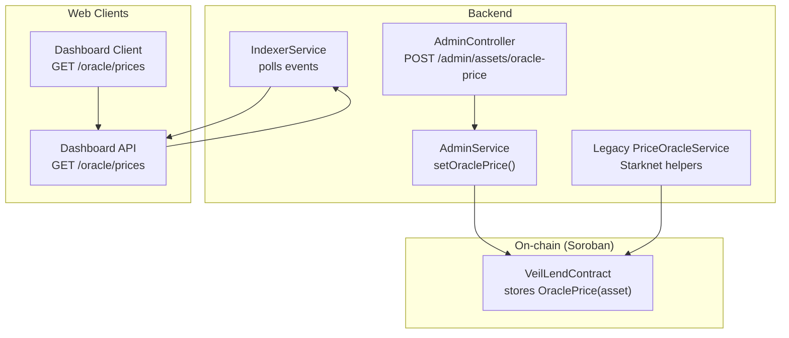
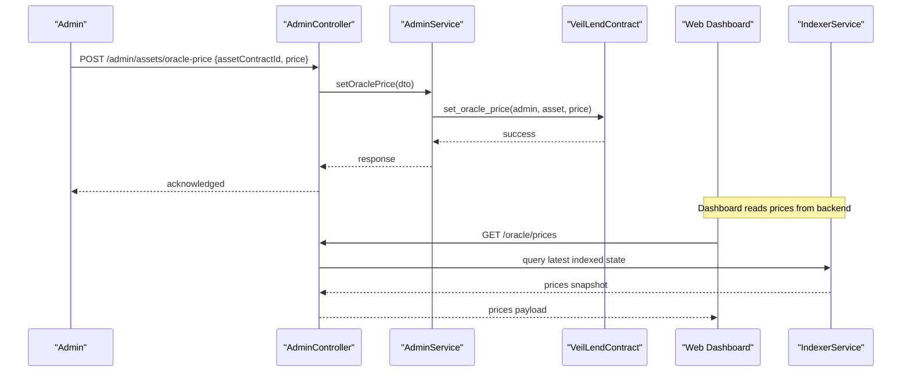
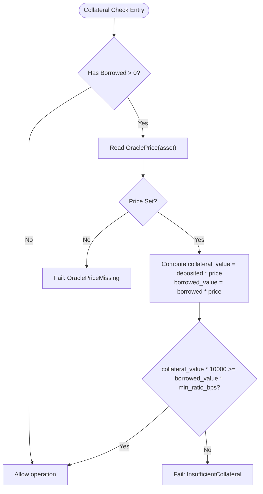
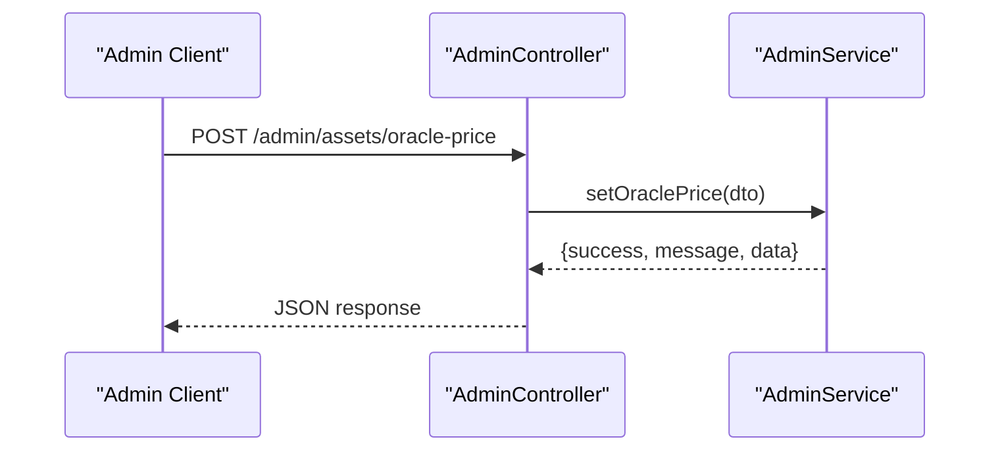
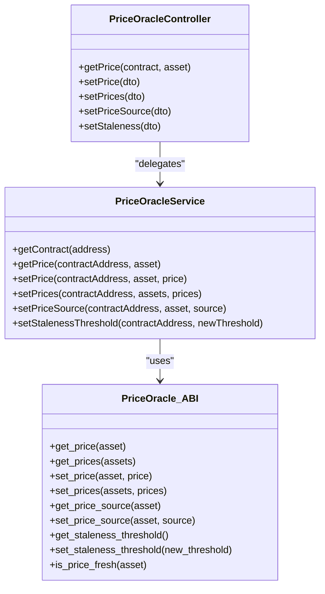
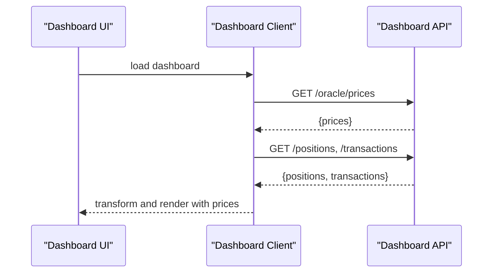
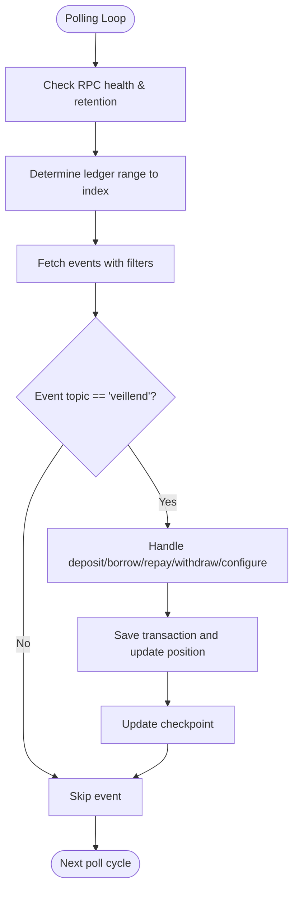
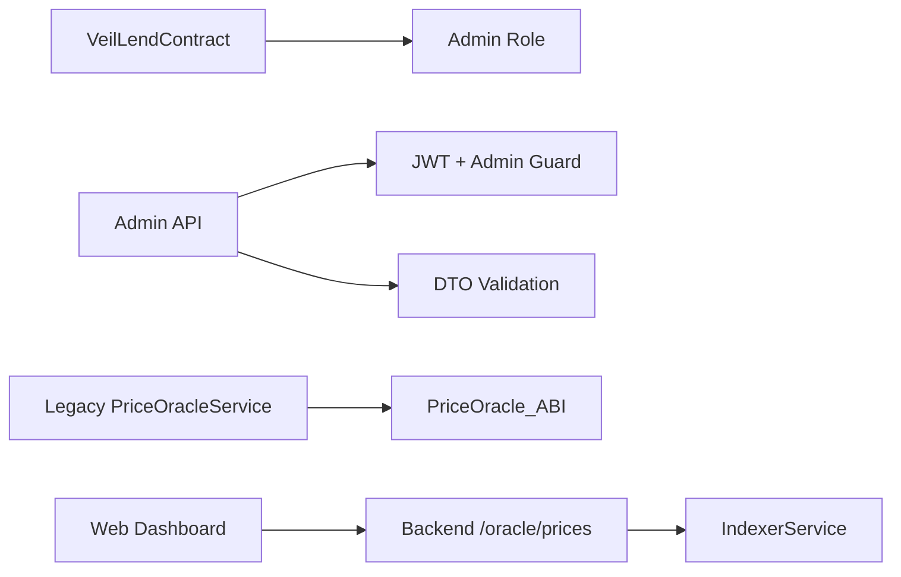

# Oracle Price Integration

<cite>
**Referenced Files in This Document**
- [lib.rs](file://veilend-soroban/src/lib.rs)
- [admin.controller.ts](file://veilend-backend/src/admin/admin.controller.ts)
- [admin.service.ts](file://veilend-backend/src/admin/admin.service.ts)
- [set-oracle-price.dto.ts](file://veilend-backend/src/admin/dto/set-oracle-price.dto.ts)
- [price-oracle.controller.ts](file://legacy/veilend-backend/src/price-oracle/price-oracle.controller.ts)
- [price-oracle.service.ts](file://legacy/veilend-backend/src/price-oracle/price-oracle.service.ts)
- [PriceOracle_ABI.json](file://legacy/veilend-backend/src/abis/PriceOracle_ABI.json)
- [dashboard-client.ts](file://veilend-web/src/lib/api/dashboard-client.ts)
- [dashboard.ts](file://veilend-web/src/lib/api/dashboard.ts)
- [indexer.service.ts](file://veilend-backend/src/indexer/indexer.service.ts)
</cite>

## Table of Contents
1. [Introduction](#introduction)
2. [Project Structure](#project-structure)
3. [Core Components](#core-components)
4. [Architecture Overview](#architecture-overview)
5. [Detailed Component Analysis](#detailed-component-analysis)
6. [Dependency Analysis](#dependency-analysis)
7. [Performance Considerations](#performance-considerations)
8. [Troubleshooting Guide](#troubleshooting-guide)
9. [Conclusion](#conclusion)

## Introduction
This document explains VeilLend’s oracle price integration system that powers accurate asset valuations for collateral ratio checks, borrowing limits, and liquidation risk. It covers how prices are stored on-chain, validated by the protocol, fetched by backend services, and consumed by frontend dashboards. It also documents admin controls to set or update prices during oracle failures, staleness handling, and security considerations to prevent manipulation and stale data usage.

## Project Structure
VeilLend integrates oracle pricing across three layers:
- On-chain Soroban contract stores per-asset oracle prices and enforces collateralization using those prices.
- Backend services expose admin endpoints to set prices and provide indexer-based read models; legacy Starknet-based oracle helpers exist for compatibility.
- Web clients fetch current prices from backend APIs to compute user-facing metrics like borrow limits and liquidation risk.

**Diagram sources**
- [lib.rs:308-344](file://veilend-soroban/src/lib.rs#L308-L344)
- [admin.controller.ts:41-49](file://veilend-backend/src/admin/admin.controller.ts#L41-L49)
- [admin.service.ts:39-46](file://veilend-backend/src/admin/admin.service.ts#L39-L46)
- [price-oracle.service.ts:15-39](file://legacy/veilend-backend/src/price-oracle/price-oracle.service.ts#L15-L39)
- [dashboard-client.ts:35-61](file://veilend-web/src/lib/api/dashboard-client.ts#L35-L61)
- [dashboard.ts:42-64](file://veilend-web/src/lib/api/dashboard.ts#L42-L64)
- [indexer.service.ts:48-171](file://veilend-backend/src/indexer/indexer.service.ts#L48-L171)

**Section sources**
- [lib.rs:308-344](file://veilend-soroban/src/lib.rs#L308-L344)
- [admin.controller.ts:41-49](file://veilend-backend/src/admin/admin.controller.ts#L41-L49)
- [admin.service.ts:39-46](file://veilend-backend/src/admin/admin.service.ts#L39-L46)
- [price-oracle.service.ts:15-39](file://legacy/veilend-backend/src/price-oracle/price-oracle.service.ts#L15-L39)
- [dashboard-client.ts:35-61](file://veilend-web/src/lib/api/dashboard-client.ts#L35-L61)
- [dashboard.ts:42-64](file://veilend-web/src/lib/api/dashboard.ts#L42-L64)
- [indexer.service.ts:48-171](file://veilend-backend/src/indexer/indexer.service.ts#L48-L171)

## Core Components
- On-chain oracle storage and validation:
  - Admin-only function to set per-asset oracle price with positive value validation.
  - Read-only getter to retrieve the stored price.
  - Collateralization check uses the stored price to enforce minimum collateral ratio before allowing borrows or withdrawals.
- Backend admin API:
  - Protected endpoint to set oracle prices via DTO validation.
  - Service placeholder ready to integrate with on-chain calls.
- Legacy Starknet oracle helpers:
  - Controller and service to get/set prices and configure staleness thresholds via Starknet contracts.
- Web dashboard:
  - Fetches prices from backend endpoints to compute UI metrics and warnings near liquidation thresholds.
- Indexer:
  - Polls on-chain events and maintains read models used by dashboards.

**Section sources**
- [lib.rs:308-344](file://veilend-soroban/src/lib.rs#L308-L344)
- [lib.rs:913-934](file://veilend-soroban/src/lib.rs#L913-L934)
- [admin.controller.ts:41-49](file://veilend-backend/src/admin/admin.controller.ts#L41-L49)
- [admin.service.ts:39-46](file://veilend-backend/src/admin/admin.service.ts#L39-L46)
- [price-oracle.controller.ts:9-32](file://legacy/veilend-backend/src/price-oracle/price-oracle.controller.ts#L9-L32)
- [price-oracle.service.ts:15-74](file://legacy/veilend-backend/src/price-oracle/price-oracle.service.ts#L15-L74)
- [dashboard-client.ts:35-61](file://veilend-web/src/lib/api/dashboard-client.ts#L35-L61)
- [dashboard.ts:42-64](file://veilend-web/src/lib/api/dashboard.ts#L42-L64)
- [indexer.service.ts:48-171](file://veilend-backend/src/indexer/indexer.service.ts#L48-L171)

## Architecture Overview
The oracle price flow spans on-chain storage and off-chain consumers:
- Admin sets a price on-chain via the admin API, which triggers an on-chain write guarded by authorization and validation.
- Protocol functions read the stored price when enforcing collateral ratios.
- Backend services expose price data to web clients; legacy Starknet helpers can be used where applicable.
- The indexer polls on-chain events to keep read models fresh for dashboards.

**Diagram sources**
- [admin.controller.ts:41-49](file://veilend-backend/src/admin/admin.controller.ts#L41-L49)
- [admin.service.ts:39-46](file://veilend-backend/src/admin/admin.service.ts#L39-L46)
- [lib.rs:308-344](file://veilend-soroban/src/lib.rs#L308-L344)
- [dashboard-client.ts:35-61](file://veilend-web/src/lib/api/dashboard-client.ts#L35-L61)
- [indexer.service.ts:48-171](file://veilend-backend/src/indexer/indexer.service.ts#L48-L171)

## Detailed Component Analysis

### On-chain Oracle Price Storage and Validation
- Admin-only setter validates positive price and persists per-asset price.
- Getter returns stored price if present.
- Collateralization logic requires a price; missing price fails operations to protect against undercollateralized positions.

**Diagram sources**
- [lib.rs:913-934](file://veilend-soroban/src/lib.rs#L913-L934)

**Section sources**
- [lib.rs:308-344](file://veilend-soroban/src/lib.rs#L308-L344)
- [lib.rs:913-934](file://veilend-soroban/src/lib.rs#L913-L934)

### Backend Admin Price Setting
- Endpoint is protected by JWT and admin guard.
- DTO enforces string asset identifier and integer price greater than zero.
- Service currently returns a placeholder response; integrate with on-chain call to persist price.

**Diagram sources**
- [admin.controller.ts:41-49](file://veilend-backend/src/admin/admin.controller.ts#L41-L49)
- [admin.service.ts:39-46](file://veilend-backend/src/admin/admin.service.ts#L39-L46)
- [set-oracle-price.dto.ts:3-10](file://veilend-backend/src/admin/dto/set-oracle-price.dto.ts#L3-L10)

**Section sources**
- [admin.controller.ts:41-49](file://veilend-backend/src/admin/admin.controller.ts#L41-L49)
- [admin.service.ts:39-46](file://veilend-backend/src/admin/admin.service.ts#L39-L46)
- [set-oracle-price.dto.ts:3-10](file://veilend-backend/src/admin/dto/set-oracle-price.dto.ts#L3-L10)

### Legacy Starknet Price Oracle Helpers
- Controller exposes endpoints to get/set prices, set price source, and adjust staleness threshold.
- Service compiles calldata and executes transactions using Starknet RPC and admin credentials.
- ABI defines functions for reading prices, setting prices, and managing staleness.

**Diagram sources**
- [price-oracle.controller.ts:9-32](file://legacy/veilend-backend/src/price-oracle/price-oracle.controller.ts#L9-L32)
- [price-oracle.service.ts:15-74](file://legacy/veilend-backend/src/price-oracle/price-oracle.service.ts#L15-L74)
- [PriceOracle_ABI.json:36-228](file://legacy/veilend-backend/src/abis/PriceOracle_ABI.json#L36-L228)

**Section sources**
- [price-oracle.controller.ts:9-32](file://legacy/veilend-backend/src/price-oracle/price-oracle.controller.ts#L9-L32)
- [price-oracle.service.ts:15-74](file://legacy/veilend-backend/src/price-oracle/price-oracle.service.ts#L15-L74)
- [PriceOracle_ABI.json:36-228](file://legacy/veilend-backend/src/abis/PriceOracle_ABI.json#L36-L228)

### Web Dashboard Price Consumption
- Dashboard client fetches prices alongside positions and transactions, merging them into UI state.
- Server-side dashboard API also requests prices with short revalidation intervals to keep UI responsive.

**Diagram sources**
- [dashboard-client.ts:35-61](file://veilend-web/src/lib/api/dashboard-client.ts#L35-L61)
- [dashboard.ts:42-64](file://veilend-web/src/lib/api/dashboard.ts#L42-L64)

**Section sources**
- [dashboard-client.ts:35-61](file://veilend-web/src/lib/api/dashboard-client.ts#L35-L61)
- [dashboard.ts:42-64](file://veilend-web/src/lib/api/dashboard.ts#L42-L64)

### Indexer Event Processing and Read Models
- Indexer polls Soroban events for the VeilLend contract and updates read models for positions and transactions.
- While not directly indexing oracle prices, it ensures consistent read state for dashboards that combine positions with prices.

**Diagram sources**
- [indexer.service.ts:48-171](file://veilend-backend/src/indexer/indexer.service.ts#L48-L171)

**Section sources**
- [indexer.service.ts:48-171](file://veilend-backend/src/indexer/indexer.service.ts#L48-L171)

## Dependency Analysis
Key dependencies and interactions:
- On-chain contract depends on admin role and supported asset flags to allow price updates and enforce collateralization.
- Backend admin controller depends on authentication guards and DTO validation to secure price updates.
- Legacy Starknet helpers depend on ABI definitions and RPC configuration to interact with external oracle contracts.
- Web clients depend on backend endpoints for prices and rely on indexer for consistent read models.

**Diagram sources**
- [lib.rs:308-344](file://veilend-soroban/src/lib.rs#L308-L344)
- [admin.controller.ts:20-23](file://veilend-backend/src/admin/admin.controller.ts#L20-L23)
- [price-oracle.service.ts:15-74](file://legacy/veilend-backend/src/price-oracle/price-oracle.service.ts#L15-L74)
- [PriceOracle_ABI.json:36-228](file://legacy/veilend-backend/src/abis/PriceOracle_ABI.json#L36-L228)
- [dashboard-client.ts:35-61](file://veilend-web/src/lib/api/dashboard-client.ts#L35-L61)
- [indexer.service.ts:48-171](file://veilend-backend/src/indexer/indexer.service.ts#L48-L171)

**Section sources**
- [lib.rs:308-344](file://veilend-soroban/src/lib.rs#L308-L344)
- [admin.controller.ts:20-23](file://veilend-backend/src/admin/admin.controller.ts#L20-L23)
- [price-oracle.service.ts:15-74](file://legacy/veilend-backend/src/price-oracle/price-oracle.service.ts#L15-L74)
- [PriceOracle_ABI.json:36-228](file://legacy/veilend-backend/src/abis/PriceOracle_ABI.json#L36-L228)
- [dashboard-client.ts:35-61](file://veilend-web/src/lib/api/dashboard-client.ts#L35-L61)
- [indexer.service.ts:48-171](file://veilend-backend/src/indexer/indexer.service.ts#L48-L171)

## Performance Considerations
- On-chain collateral checks use simple arithmetic with stored prices; ensure prices are set promptly to avoid failed operations due to missing values.
- Backend admin endpoints should implement idempotent writes and rate limiting to reduce redundant on-chain calls.
- Legacy Starknet price updates involve transaction fees; batch updates where possible using multi-asset setters.
- Web clients request prices with short revalidation windows; consider caching strategies at CDN or edge layers to reduce latency.
- Indexer polling interval balances freshness with RPC costs; tune based on network conditions and required UI responsiveness.

[No sources needed since this section provides general guidance]

## Troubleshooting Guide
Common issues and resolutions:
- Missing oracle price:
  - Symptom: Operations fail with insufficient collateral error due to missing price.
  - Resolution: Ensure admin sets a valid positive price for the asset before borrowing or withdrawing.
- Unauthorized admin actions:
  - Symptom: Admin endpoints reject requests without proper JWT and admin privileges.
  - Resolution: Verify authentication and admin role assignment.
- Legacy Starknet errors:
  - Symptom: Price updates fail due to RPC misconfiguration or invalid calldata.
  - Resolution: Validate environment variables for node URL and admin wallet; confirm ABI matches deployed contract.
- Stale price detection:
  - Symptom: UI warns about potential liquidation risk near limits.
  - Resolution: Adjust staleness thresholds and ensure timely price updates; monitor last update timestamps if available.

**Section sources**
- [lib.rs:913-934](file://veilend-soroban/src/lib.rs#L913-L934)
- [admin.controller.ts:20-23](file://veilend-backend/src/admin/admin.controller.ts#L20-L23)
- [price-oracle.service.ts:30-74](file://legacy/veilend-backend/src/price-oracle/price-oracle.service.ts#L30-L74)
- [dashboard.ts:42-64](file://veilend-web/src/lib/api/dashboard.ts#L42-L64)

## Conclusion
VeilLend’s oracle price integration centers on secure, admin-controlled price storage on-chain, enforced through collateralization checks. Backend services provide admin controls and read models for dashboards, while legacy Starknet helpers offer additional flexibility. Proper price management, staleness handling, and robust monitoring are essential to maintain protocol safety and user confidence. Integrating real-time price feeds, caching, and alerting will further strengthen resilience against oracle failures and market volatility.

[No sources needed since this section summarizes without analyzing specific files]