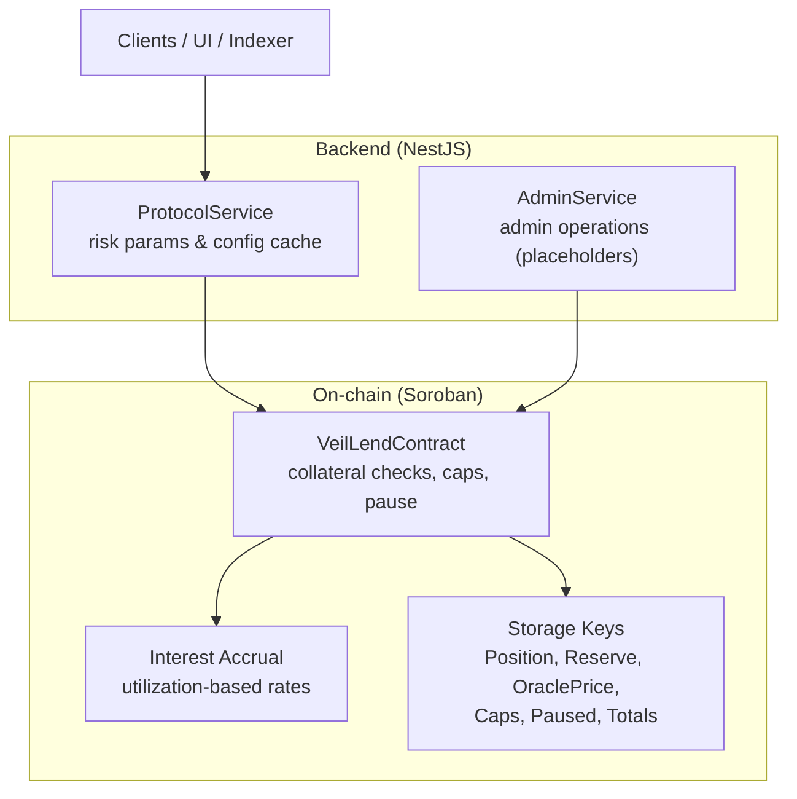
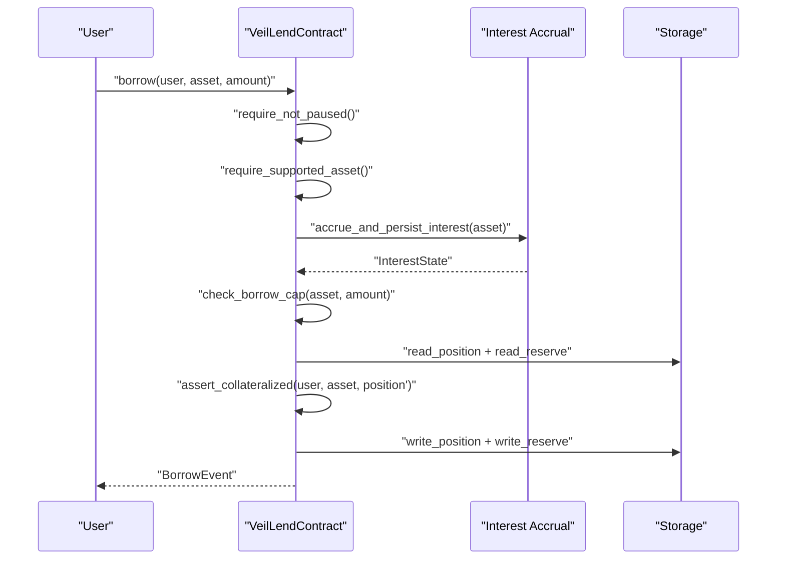
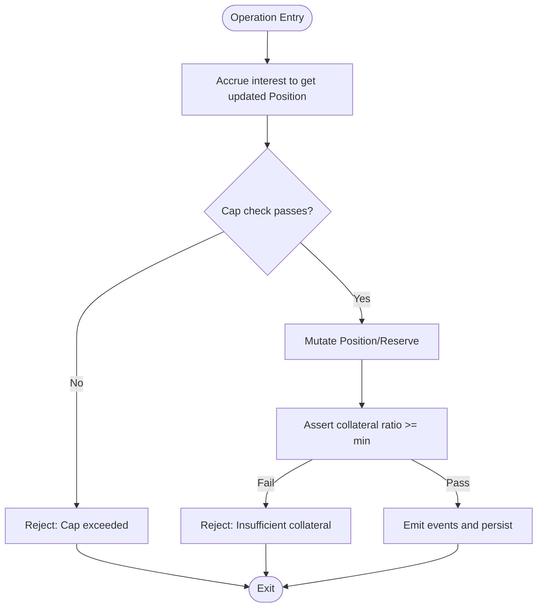
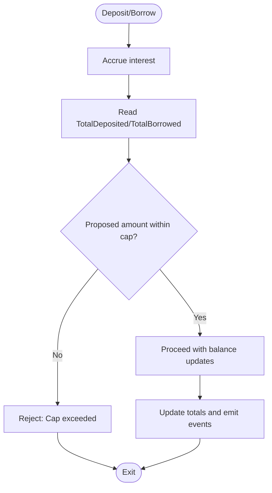
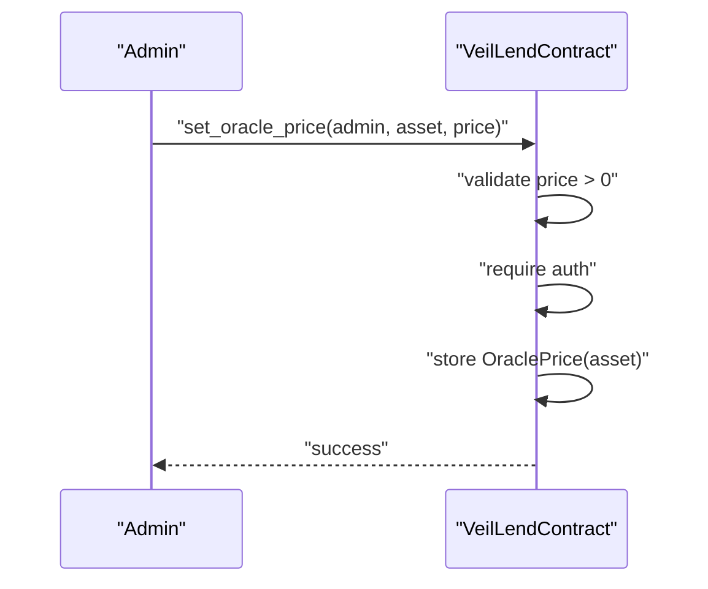
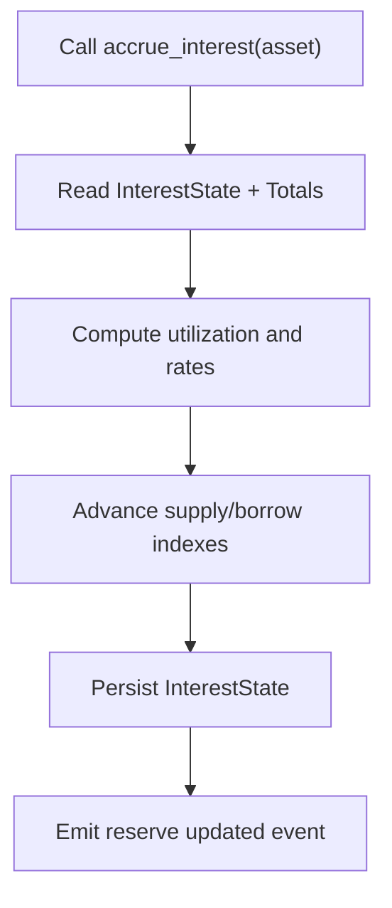
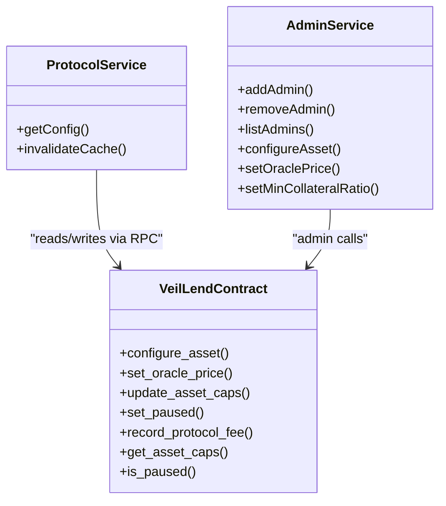
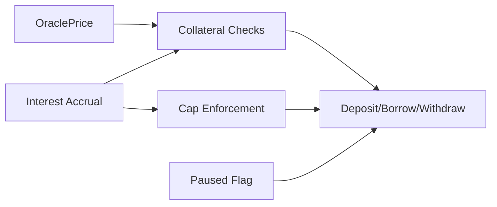

# Risk Management

<cite>
**Referenced Files in This Document**
- [lib.rs](file://veilend-soroban/src/lib.rs)
- [interest.rs](file://veilend-soroban/src/interest.rs)
- [integration.rs](file://veilend-soroban/tests/integration.rs)
- [protocol.service.ts](file://veilend-backend/src/protocol/protocol.service.ts)
- [admin.service.ts](file://veilend-backend/src/admin/admin.service.ts)
</cite>

## Table of Contents
1. Introduction
2. Project Structure
3. Core Components
4. Architecture Overview
5. Detailed Component Analysis
6. Dependency Analysis
7. Performance Considerations
8. Troubleshooting Guide
9. Conclusion

## Introduction
This document explains VeilLend’s risk management system with a focus on collateral ratio enforcement, circuit breaker controls, asset caps and utilization thresholds, oracle price integration, administrative controls, and handling of edge cases such as extreme price movements and liquidity crunches. It synthesizes behavior from the Soroban smart contract and backend services to provide both code-level detail and accessible explanations for non-technical readers.

## Project Structure
VeilLend implements risk controls primarily in the Soroban smart contract (on-chain), with supporting configuration and monitoring exposed via the NestJS backend. The key elements are:
- On-chain risk logic: collateral checks, pause/circuit breaker, per-asset deposit/borrow caps, oracle price storage, interest accrual, and reserve accounting.
- Backend exposure: protocol configuration endpoints that surface risk parameters and asset configurations for clients and dashboards.



**Diagram sources**
- [lib.rs:229-719](file://veilend-soroban/src/lib.rs#L229-L719)
- [interest.rs:24-87](file://veilend-soroban/src/interest.rs#L24-L87)
- [protocol.service.ts:20-79](file://veilend-backend/src/protocol/protocol.service.ts#L20-L79)
- [admin.service.ts:30-55](file://veilend-backend/src/admin/admin.service.ts#L30-L55)

**Section sources**
- [lib.rs:229-719](file://veilend-soroban/src/lib.rs#L229-L719)
- [interest.rs:24-87](file://veilend-soroban/src/interest.rs#L24-L87)
- [protocol.service.ts:20-79](file://veilend-backend/src/protocol/protocol.service.ts#L20-L79)
- [admin.service.ts:30-55](file://veilend-backend/src/admin/admin.service.ts#L30-L55)

## Core Components
- Collateral ratio enforcement: Ensures positions remain above the minimum collateral ratio after borrow or withdraw actions using oracle prices and accrued balances.
- Circuit breaker: Admin-controlled pause mechanism that blocks new deposits and borrows while allowing repay and withdraw to reduce risk.
- Asset caps: Per-asset deposit and borrow limits enforced against totals; unlimited mode supported via sentinel values.
- Oracle price integration: Admin-set oracle prices used for collateral valuation and borrowing power calculations.
- Interest accrual: Time-based accrual updates supply and borrow indexes based on utilization, affecting position sizes and totals.
- Administrative controls: Admin-only functions to configure assets, set oracle prices, update caps, toggle pause, and record fees.

**Section sources**
- [lib.rs:242-479](file://veilend-soroban/src/lib.rs#L242-L479)
- [lib.rs:483-639](file://veilend-soroban/src/lib.rs#L483-L639)
- [interest.rs:24-87](file://veilend-soroban/src/interest.rs#L24-L87)

## Architecture Overview
The risk control flow integrates oracle prices, interest accrual, and cap checks before any state mutation. Borrow and withdraw paths validate collateralization post-mutation. The circuit breaker selectively blocks risky operations while preserving user exit paths.



**Diagram sources**
- [lib.rs:521-561](file://veilend-soroban/src/lib.rs#L521-L561)
- [lib.rs:782-800](file://veilend-soroban/src/lib.rs#L782-L800)

## Detailed Component Analysis

### Collateral Ratio Enforcement
- Minimum collateral ratio is stored as basis points and validated at initialization; it acts as the floor for position health.
- Before finalizing a borrow or withdraw, the contract computes accrued position balances and asserts the resulting position meets the minimum collateral ratio. If not, the operation fails with an error indicating insufficient collateral.
- Oracle prices are required for accurate valuation; missing prices will prevent operations relying on collateral value.



**Diagram sources**
- [lib.rs:521-561](file://veilend-soroban/src/lib.rs#L521-L561)
- [lib.rs:600-639](file://veilend-soroban/src/lib.rs#L600-L639)

**Section sources**
- [lib.rs:242-258](file://veilend-soroban/src/lib.rs#L242-L258)
- [lib.rs:521-561](file://veilend-soroban/src/lib.rs#L521-L561)
- [lib.rs:600-639](file://veilend-soroban/src/lib.rs#L600-L639)

### Circuit Breaker (Pause Mechanism)
- Admin can toggle pause state; when paused, deposit and borrow are blocked, but repay and withdraw remain available so users can deleverage.
- Pause/unpause emits a circuit breaker event for on-chain observability.
- Unauthorized callers cannot change pause state.

```mermaid
sequenceDiagram
participant Admin as "Admin"
participant C as "VeilLendContract"
Admin->>C : "set_paused(admin, true)"
C->>C : "require auth"
C->>C : "set Paused = true"
C-->>Admin : "CircuitBreakerEvent"
Note over C : "deposit/borrow blocked; repay/withdraw allowed"
```

**Diagram sources**
- [lib.rs:450-479](file://veilend-soroban/src/lib.rs#L450-L479)

**Section sources**
- [lib.rs:450-479](file://veilend-soroban/src/lib.rs#L450-L479)
- [integration.rs:86-146](file://veilend-soroban/tests/integration.rs#L86-L146)

### Asset Caps and Utilization Thresholds
- Per-asset deposit and borrow caps limit total usage; -1 indicates unlimited.
- Caps are enforced against cumulative totals updated after each operation.
- Invalid cap values (zero or negative except -1) are rejected.



**Diagram sources**
- [lib.rs:346-420](file://veilend-soroban/src/lib.rs#L346-L420)
- [lib.rs:483-519](file://veilend-soroban/src/lib.rs#L483-L519)
- [lib.rs:521-561](file://veilend-soroban/src/lib.rs#L521-L561)

**Section sources**
- [lib.rs:346-420](file://veilend-soroban/src/lib.rs#L346-L420)
- [integration.rs:41-83](file://veilend-soroban/tests/integration.rs#L41-L83)
- [integration.rs:149-192](file://veilend-soroban/tests/integration.rs#L149-L192)
- [integration.rs:219-246](file://veilend-soroban/tests/integration.rs#L219-L246)

### Oracle Price Integration
- Admin sets oracle prices per asset; prices must be positive.
- Missing oracle prices block operations that rely on collateral valuation.
- Prices are stored persistently and queried by clients and internal checks.



**Diagram sources**
- [lib.rs:308-344](file://veilend-soroban/src/lib.rs#L308-L344)

**Section sources**
- [lib.rs:308-344](file://veilend-soroban/src/lib.rs#L308-L344)

### Interest Accrual and Utilization-Based Rates
- Interest accrual advances supply and borrow indexes based on elapsed time and current utilization.
- Utilization drives borrow and supply rates; this affects position growth and aggregate totals.
- Accrual is idempotent and can be forced without touching individual positions.



**Diagram sources**
- [interest.rs:24-87](file://veilend-soroban/src/interest.rs#L24-L87)
- [lib.rs:662-677](file://veilend-soroban/src/lib.rs#L662-L677)

**Section sources**
- [interest.rs:24-87](file://veilend-soroban/src/interest.rs#L24-L87)
- [integration.rs:283-342](file://veilend-soroban/tests/integration.rs#L283-L342)
- [integration.rs:423-460](file://veilend-soroban/tests/integration.rs#L423-L460)

### Administrative Controls and Monitoring
- Admin-only functions: configure asset support, set oracle prices, update caps, toggle pause, record protocol fees.
- Backend exposes protocol configuration including default risk parameters and per-asset risk configs for clients and dashboards.
- Events emitted for caps updates, circuit breaker toggles, and reserve changes enable off-chain monitoring.



**Diagram sources**
- [lib.rs:260-479](file://veilend-soroban/src/lib.rs#L260-L479)
- [protocol.service.ts:52-79](file://veilend-backend/src/protocol/protocol.service.ts#L52-L79)
- [admin.service.ts:12-55](file://veilend-backend/src/admin/admin.service.ts#L12-L55)

**Section sources**
- [lib.rs:260-479](file://veilend-soroban/src/lib.rs#L260-L479)
- [protocol.service.ts:20-79](file://veilend-backend/src/protocol/protocol.service.ts#L20-L79)
- [admin.service.ts:12-55](file://veilend-backend/src/admin/admin.service.ts#L12-L55)

## Dependency Analysis
- Collateral checks depend on oracle prices and accrued position balances.
- Caps enforcement depends on accumulated totals updated after each operation.
- Interest accrual depends on ledger timestamps and current totals, influencing future collateral ratios and cap checks.
- Circuit breaker gates high-risk operations while preserving user exit paths.



**Diagram sources**
- [lib.rs:483-639](file://veilend-soroban/src/lib.rs#L483-L639)
- [interest.rs:24-87](file://veilend-soroban/src/interest.rs#L24-L87)

**Section sources**
- [lib.rs:483-639](file://veilend-soroban/src/lib.rs#L483-L639)
- [interest.rs:24-87](file://veilend-soroban/src/interest.rs#L24-L87)

## Performance Considerations
- Interest accrual is designed to be idempotent and efficient; repeated calls at the same timestamp do no extra work.
- Accrual is performed once per mutating operation to keep caps and collateral checks accurate without redundant computation.
- Using fixed-point arithmetic avoids floating-point issues and keeps computations deterministic on-chain.

[No sources needed since this section provides general guidance]

## Troubleshooting Guide
Common errors and their causes:
- Insufficient collateral: Occurs when a borrow or withdraw would drop below the minimum collateral ratio. Ensure sufficient deposited collateral relative to borrowed amounts and oracle prices.
- Contract paused: Deposit and borrow fail when paused; repay and withdraw remain available. Unpause via admin when appropriate.
- Cap exceeded: Deposit or borrow attempts exceed configured per-asset caps. Adjust caps or wait for reductions via repay/withdraw.
- Oracle price missing: Operations requiring collateral valuation fail if no oracle price is set for the asset. Set a valid price via admin.
- Invalid cap value: Zero or negative (other than -1) cap values are rejected. Use positive numbers or -1 for unlimited.

Operational tips:
- Monitor circuit breaker events and reserve updates to detect emergencies quickly.
- Use backend protocol configuration endpoints to verify risk parameters and asset statuses.

**Section sources**
- [lib.rs:107-145](file://veilend-soroban/src/lib.rs#L107-L145)
- [lib.rs:450-479](file://veilend-soroban/src/lib.rs#L450-L479)
- [lib.rs:346-420](file://veilend-soroban/src/lib.rs#L346-L420)
- [lib.rs:308-344](file://veilend-soroban/src/lib.rs#L308-L344)

## Conclusion
VeilLend’s risk management combines robust on-chain safeguards—collateral ratio enforcement, circuit breaker controls, per-asset caps, oracle-driven valuations, and precise interest accrual—with backend tools for configuration and monitoring. Together, these mechanisms protect the protocol during normal operations and stress scenarios, while providing clear administrative controls and observability for safe, responsive governance.

[No sources needed since this section summarizes without analyzing specific files]