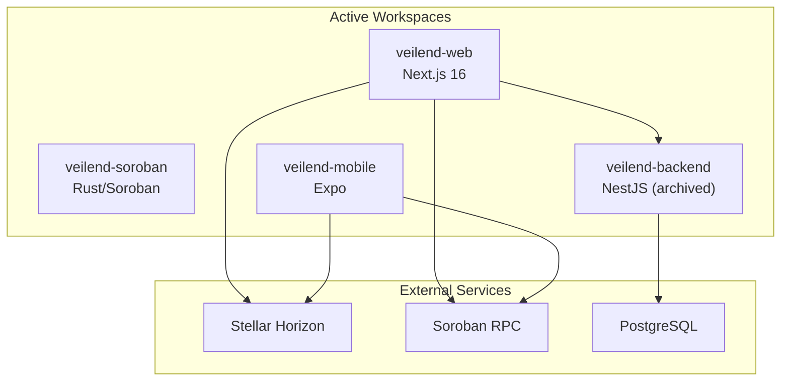
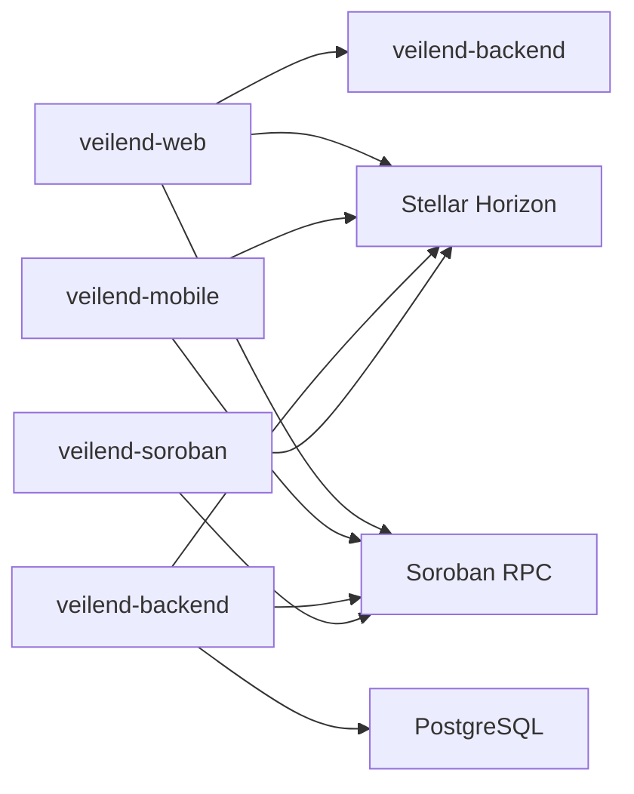

# Getting Started Guide

<cite>
**Referenced Files in This Document**
- [README.md](file://README.md)
- [veilend-soroban/README.md](file://veilend-soroban/README.md)
- [veilend-backend/README.md](file://veilend-backend/README.md)
- [veilend-web/README.md](file://veilend-web/README.md)
- [Cargo.toml](file://Cargo.toml)
- [veilend-soroban/rust-toolchain.toml](file://veilend-soroban/rust-toolchain.toml)
- [veilend-backend/docker-compose.yml](file://veilend-backend/docker-compose.yml)
- [veilend-web/next.config.ts](file://veilend-web/next.config.ts)
- [veilend-web/src/lib/config-validation.ts](file://veilend-web/src/lib/config-validation.ts)
- [veilend-backend/package.json](file://veilend-backend/package.json)
- [veilend-web/package.json](file://veilend-web/package.json)
- [veilend-mobile/package.json](file://veilend-mobile/package.json)
</cite>

## Table of Contents
1. [Introduction](#introduction)
2. [Prerequisites and Knowledge Requirements](#prerequisites-and-knowledge-requirements)
3. [Project Structure](#project-structure)
4. [Environment Setup](#environment-setup)
5. [First Run: Local Development Workflow](#first-run-local-development-workflow)
6. [Smart Contract Development (Soroban/Rust)](#smart-contract-development-sorobansorobanrust)
7. [Backend Service (NestJS + Prisma + Postgres)](#backend-service-nestjs--prisma--postgres)
8. [Web Application (Next.js)](#web-application-nextjs)
9. [Mobile Application (Expo)](#mobile-application-expo)
10. [Connecting to Test Networks](#connecting-to-test-networks)
11. [Dependency Analysis](#dependency-analysis)
12. [Performance Considerations](#performance-considerations)
13. [Troubleshooting Guide](#troubleshooting-guide)
14. [Conclusion](#conclusion)

## Introduction
VeilLend is a privacy-first decentralized lending protocol on Stellar/Soroban. The repository contains the active smart contract workspace, a mobile app built with Expo, a Next.js web application, and an archived backend reference. This guide helps you set up the complete development environment, run each component locally, and connect to Stellar test networks for your first interactions.

## Prerequisites and Knowledge Requirements
- Blockchain fundamentals: accounts, transactions, ledgers, wallets, and network concepts.
- DeFi basics: deposits, borrowing, repayment, collateral ratios, oracles, and liquidity pools.
- Modern web development: Node.js/npm, TypeScript, React/Next.js, and basic REST API usage.
- Mobile development familiarity: React Native concepts and Expo CLI workflow.
- Rust toolchain and Cargo for building Soroban contracts.
- Docker and Docker Compose for local services.

Recommended tools:
- Node.js 22+ for the web app; Node.js 20+ for the backend.
- Rust toolchain pinned to 1.88.0 via rustup.
- Stellar CLI (pinned version).
- Docker and Docker Compose.
- A Stellar wallet (e.g., Freighter) funded on testnet.

**Section sources**
- [README.md:112-119](file://README.md#L112-L119)
- [veilend-soroban/README.md:41-67](file://veilend-soroban/README.md#L41-L67)
- [veilend-web/README.md:5-9](file://veilend-web/README.md#L5-L9)
- [veilend-backend/README.md:73-78](file://veilend-backend/README.md#L73-L78)

## Project Structure
The active codebase is organized into three main workspaces plus archived references:
- veilend-soroban: Rust/Soroban smart contracts for VeilLend.
- veilend-mobile: React Native/Expo mobile app.
- veilend-web: Next.js 16 web application.
- legacy: Archived backend and research docs.

[No sources needed since this diagram shows conceptual structure]

## Environment Setup
Install and configure the following before running any component:

- Rust toolchain and targets:
  - Install pinned Rust channel and add WebAssembly targets as documented in the Soroban workspace.
- Stellar CLI:
  - Install the pinned version required by the project. On Ubuntu, install system dependencies first.
- Node.js and package managers:
  - Use Node.js 22+ for the web app and Node.js 20+ for the backend.
- Docker and Docker Compose:
  - Required for running Postgres and the backend containerized.

Key configuration files:
- Rust toolchain pinning and targets are defined in the Soroban workspace.
- Workspace-level release profile settings are configured at the repository root.

**Section sources**
- [veilend-soroban/README.md:41-67](file://veilend-soroban/README.md#L41-L67)
- [veilend-soroban/rust-toolchain.toml:1-5](file://veilend-soroban/rust-toolchain.toml#L1-L5)
- [Cargo.toml:1-19](file://Cargo.toml#L1-L19)

## First Run: Local Development Workflow
This section provides step-by-step commands to get all components running locally.

1) Start the backend with Postgres using Docker Compose:
- Build and start services.
- Follow logs to confirm readiness.
- Seed demo data if needed.
- Health check endpoint is available at the backend port.

2) Start the web application:
- Install dependencies.
- Optionally copy environment template to customize network and API endpoints.
- Start the dev server and open the local URL.

3) Start the mobile app:
- Install dependencies.
- Start Expo and use the recommended method to run on your device or simulator.

4) Build and test the smart contract:
- Build WASM artifacts.
- Generate bindings/specifications if needed.
- Run tests and linting.

Notes:
- The web app includes startup configuration validation that checks environment variables early.
- The backend exposes scripts for syncing and validating contract specifications.

**Section sources**
- [veilend-backend/docker-compose.yml:1-52](file://veilend-backend/docker-compose.yml#L1-L52)
- [veilend-backend/README.md:98-120](file://veilend-backend/README.md#L98-L120)
- [veilend-web/README.md:12-36](file://veilend-web/README.md#L12-L36)
- [veilend-web/next.config.ts:1-20](file://veilend-web/next.config.ts#L1-L20)
- [veilend-web/src/lib/config-validation.ts:1-174](file://veilend-web/src/lib/config-validation.ts#L1-L174)
- [veilend-mobile/package.json:5-12](file://veilend-mobile/package.json#L5-L12)
- [veilend-soroban/README.md:69-125](file://veilend-soroban/README.md#L69-L125)

## Smart Contract Development (Soroban/Rust)
The Soroban workspace provides the VeilLend contract foundation on Stellar. It supports initialization, asset configuration, position storage, reserve accounting, and core state transitions.

Development workflow:
- Write code in the source file.
- Format and lint with Cargo tools.
- Run tests.
- Build WASM artifacts.
- Generate specifications/bindings for frontend/backend integration.
- Inspect contract interface from the built artifact.

Testing and linting:
- Execute tests to validate logic.
- Run linter with strict warnings enabled.

Build outputs and specs:
- Build produces WASM artifacts used by the Stellar CLI.
- Bindings can be generated into the specs directory for type-safe integrations.

**Section sources**
- [veilend-soroban/README.md:5-19](file://veilend-soroban/README.md#L5-L19)
- [veilend-soroban/README.md:69-125](file://veilend-soroban/README.md#L69-L125)

## Backend Service (NestJS + Prisma + Postgres)
The backend provides off-chain computations, indexing, authentication, portfolios, assets, and transaction orchestration. It uses NestJS modules, Prisma for database access, and PostgreSQL for persistence.

Local setup options:
- Option A: Local without Docker (requires Postgres installed).
- Option B: Docker Compose (recommended), which starts Postgres and the backend together.
- Option C: Build and run the Docker image manually with environment variables.

Scripts and tasks:
- Start in development/watch mode.
- Run unit and e2e tests.
- Sync and validate contract specifications to keep backend aligned with the Soroban contract.

Database and seeding:
- Generate Prisma client.
- Deploy migrations.
- Seed demo data for dashboard/history testing.

Health and endpoints:
- Backend serves on the configured port.
- Health check endpoint is available for quick verification.

**Section sources**
- [veilend-backend/README.md:7-33](file://veilend-backend/README.md#L7-L33)
- [veilend-backend/README.md:35-42](file://veilend-backend/README.md#L35-L42)
- [veilend-backend/README.md:71-120](file://veilend-backend/README.md#L71-L120)
- [veilend-backend/package.json:8-24](file://veilend-backend/package.json#L8-L24)
- [veilend-backend/docker-compose.yml:11-48](file://veilend-backend/docker-compose.yml#L11-L48)

## Web Application (Next.js)
The web application is a privacy-first interface built with Next.js 16, TypeScript, Tailwind CSS, and shadcn/ui components.

Getting started:
- Install dependencies.
- Copy environment template to customize network and API endpoints (optional for local testnet defaults).
- Start the development server and open the local URL.

Startup configuration validation:
- Configuration is validated at build/startup time to surface missing or invalid environment variables early.
- Safe defaults are provided for local development on testnet.

Available scripts:
- Development, build, start, lint, format, type-check, and test.

**Section sources**
- [veilend-web/README.md:10-48](file://veilend-web/README.md#L10-L48)
- [veilend-web/README.md:101-142](file://veilend-web/README.md#L101-L142)
- [veilend-web/next.config.ts:1-20](file://veilend-web/next.config.ts#L1-L20)
- [veilend-web/src/lib/config-validation.ts:1-174](file://veilend-web/src/lib/config-validation.ts#L1-L174)
- [veilend-web/package.json:5-13](file://veilend-web/package.json#L5-L13)

## Mobile Application (Expo)
The mobile app provides a cross-platform experience for deposit, borrow, repay, privacy mode, and wallet-driven onboarding.

Getting started:
- Install dependencies.
- Start Expo and run on your preferred platform (Android/iOS/Web).
- Use Expo Go for quick testing on physical devices.

Scripts:
- Start, platform-specific runs, doctor checks, and tests.

**Section sources**
- [README.md:88-107](file://README.md#L88-L107)
- [veilend-mobile/package.json:5-12](file://veilend-mobile/package.json#L5-L12)

## Connecting to Test Networks
VeilLend components connect to Stellar networks via environment configuration:

- Web app:
  - Configure network, Horizon URL, passphrase, and API URL through environment variables.
  - Defaults target testnet for local development.
- Backend:
  - Docker Compose sets Stellar network and Horizon/Soroban RPC URLs for testnet.
- Contracts:
  - Use Stellar CLI to interact with testnet when deploying or testing.

Wallet funding:
- Fund your wallet on testnet using the Stellar laboratory tool.

**Section sources**
- [veilend-web/README.md:120-139](file://veilend-web/README.md#L120-L139)
- [veilend-backend/docker-compose.yml:35-42](file://veilend-backend/docker-compose.yml#L35-L42)
- [README.md:132-137](file://README.md#L132-L137)

## Dependency Analysis
High-level dependency relationships across components:

[No sources needed since this diagram shows conceptual relationships]

## Performance Considerations
- Use release profiles for contract builds to optimize binary size and performance.
- Prefer containerized services for consistent environments and faster iteration.
- Validate configuration early to avoid runtime failures during development.
- Keep dependencies updated within supported ranges to benefit from performance improvements.

[No sources needed since this section provides general guidance]

## Troubleshooting Guide
Common issues and resolutions:

- Missing or invalid environment variables in the web app:
  - Copy the example environment file and adjust values.
  - Ensure network, Horizon URL, passphrase, and API URL are valid.
  - Startup validation will list all problems at once for quick fixes.

- Dependency installation failures:
  - Clear caches, remove node_modules and lockfiles, then reinstall.
  - Verify Node.js version matches requirements.

- Development server not starting:
  - Check port conflicts and try alternative ports.
  - Ensure dependencies are installed correctly.

- TypeScript or ESLint errors:
  - Run type checking and linting to identify issues.
  - Auto-format where applicable.

- Tailwind styles not applying:
  - Verify configuration files and restart the dev server.

- Backend service connectivity:
  - Confirm Postgres is healthy and reachable.
  - Check environment variables for database and network endpoints.

- Contract build or CLI issues:
  - Ensure correct Rust toolchain and targets are installed.
  - Install required system packages on Linux distributions.

**Section sources**
- [veilend-web/README.md:232-299](file://veilend-web/README.md#L232-L299)
- [veilend-web/src/lib/config-validation.ts:74-145](file://veilend-web/src/lib/config-validation.ts#L74-L145)
- [veilend-backend/README.md:98-120](file://veilend-backend/README.md#L98-L120)
- [veilend-soroban/README.md:41-67](file://veilend-soroban/README.md#L41-L67)

## Conclusion
You now have the steps to set up the full VeilLend development environment, run the smart contracts, backend, web, and mobile apps locally, and connect to Stellar test networks. Use the troubleshooting guide to resolve common issues and refer to each component’s README for deeper workflows. As the protocol evolves, continue generating contract bindings and validating configurations to keep your local stack aligned with the latest changes.