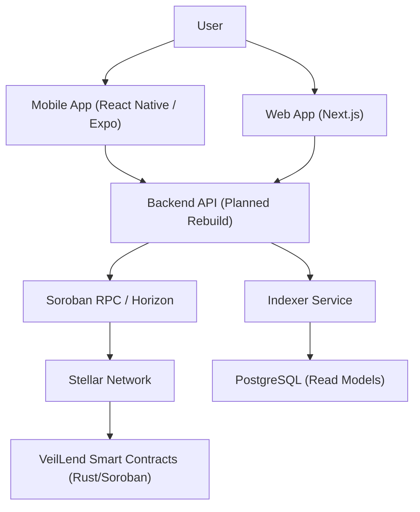
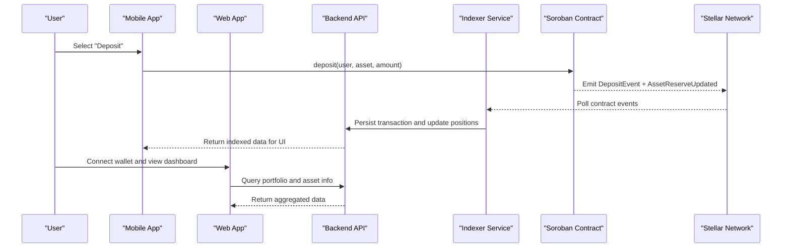
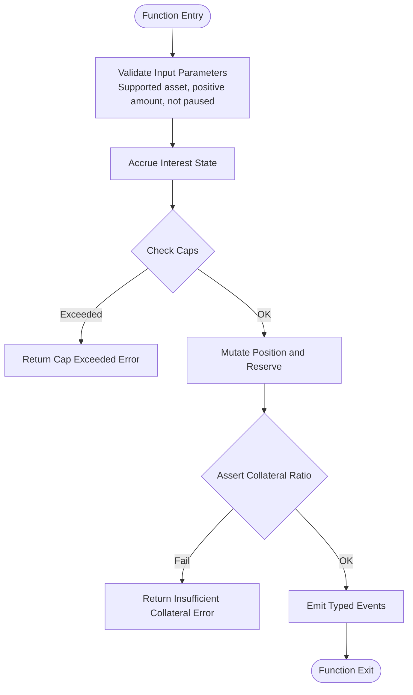
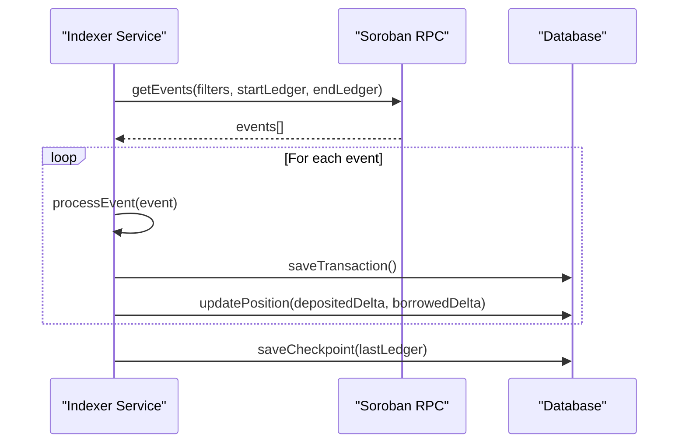
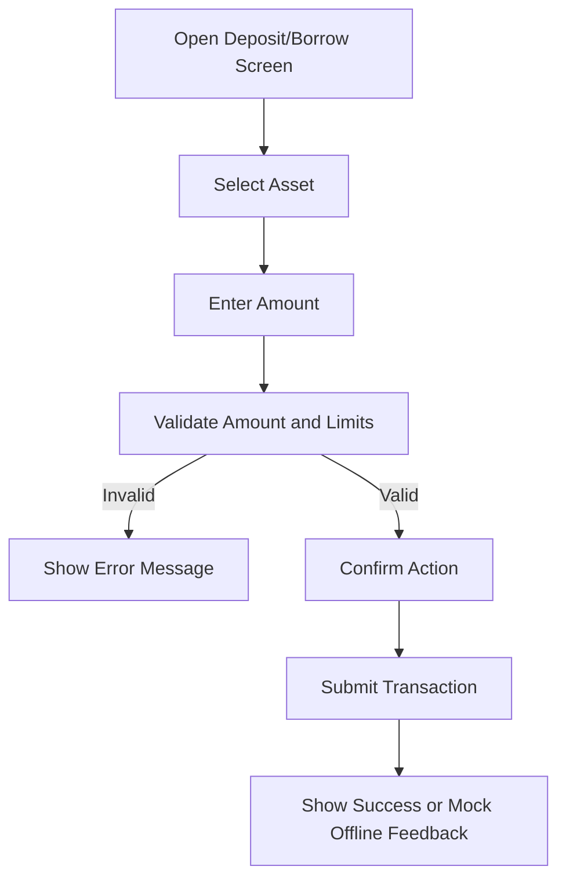
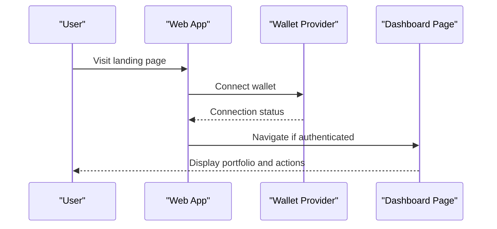
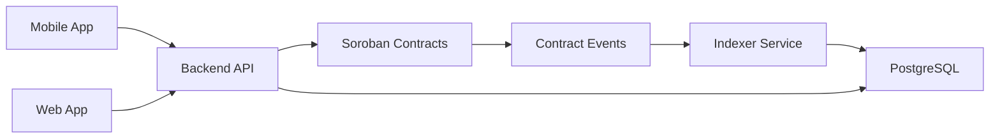

# Project Overview

<cite>
**Referenced Files in This Document**
- [README.md](file://README.md)
- [lib.rs](file://veilend-soroban/src/lib.rs)
- [interest.rs](file://veilend-soroban/src/interest.rs)
- [indexer.service.ts](file://veilend-backend/src/indexer/indexer.service.ts)
- [DepositScreen.tsx](file://veilend-mobile/src/screens/DepositScreen.tsx)
- [BorrowScreen.tsx](file://veilend-mobile/src/screens/BorrowScreen.tsx)
- [page.tsx](file://veilend-web/src/app/page.tsx)
</cite>

## Table of Contents
1. Introduction
2. Project Structure
3. Core Components
4. Architecture Overview
5. Detailed Component Analysis
6. Dependency Analysis
7. Performance Considerations
8. Troubleshooting Guide
9. Conclusion

## Introduction
VeilLend is a privacy-first decentralized lending protocol built on Stellar/Soroban. It enables users to deposit, borrow, and transact with complete financial privacy using X-Ray ZK proofs for shielded transactions. The platform emphasizes sub-second settlements, near-zero fees, and multi-chain support, making it suitable for borderless DeFi operations without intermediaries.

Key goals:
- Self-custody focus: funds route directly to user wallets; no central holding.
- Borderless DeFi: operate across networks with low latency and minimal cost.
- Financial privacy: leverage shielded transactions and zero-knowledge primitives to protect sensitive data such as balances and positions.

For beginners: VeilLend lets you deposit assets into a lending pool, borrow against your collateral while maintaining privacy, and repay loans at any time. You control your keys and never hand custody to a centralized service.

For experienced developers: the protocol exposes Soroban smart contracts that manage positions, reserves, oracle-backed collateral ratios, and interest accruals, with an indexer syncing on-chain events to off-chain services for enhanced UX and analytics.

**Section sources**
- [README.md:1-14](file://README.md#L1-L14)

## Project Structure
The repository is organized into active workspaces and archived references:
- veilend-soroban: Rust/Soroban smart contracts implementing lending state, asset configuration, position tracking, reserve accounting, oracle prices, caps, circuit breaker, and interest accrual.
- veilend-mobile: React Native (Expo) app providing deposit, borrow, repay flows, privacy mode toggle, wallet-based authentication, and status banners.
- veilend-web: Next.js 16 web application offering a privacy-first interface with App Router, Tailwind CSS, and TypeScript.
- legacy: Archived backend and docs from previous architecture for reference.

**Diagram sources**
- [README.md:17-39](file://README.md#L17-L39)
- [indexer.service.ts:17-31](file://veilend-backend/src/indexer/indexer.service.ts#L17-L31)

**Section sources**
- [README.md:17-39](file://README.md#L17-L39)

## Core Components
- Smart Contracts (Rust/Soroban): Initialize contract with admin and minimum collateral ratio; track supported assets; store per-user positions; maintain reserve accounting; expose deposit, borrow, repay, withdraw; emit typed events; integrate oracle-backed pricing; implement time-based interest accrual; enforce caps and circuit breaker; publish reserve updates.
- Mobile App (React Native/Expo): Deposit and borrow screens with validation and mock offline fallback; privacy mode toggle; wallet login; protocol status banners; instant actions for deposit/borrow/repay.
- Web App (Next.js): Landing page and dashboard entry points; wallet connection flow; campaign analytics; environment validation; UI components standardized via shadcn/ui.
- Backend Services (Planned): Indexer listens to Soroban events, parses them, persists transactions and positions, and provides APIs for portfolios, assets, transactions, and admin configuration.

Practical examples:
- Depositing assets: select an asset, enter amount, confirm deposit; contract validates supported asset, positive amount, caps, and reserve availability; emits deposit event and updates reserve totals.
- Borrowing against collateral: after depositing, borrow up to oracle-backed limits; contract enforces collateral ratio and caps; emits borrow event and updates reserve totals.
- Privacy mode: mobile app supports toggling privacy mode to mask balances and positions; future integration will use shielded commitments and proof verification.

**Section sources**
- [lib.rs:242-306](file://veilend-soroban/src/lib.rs#L242-L306)
- [lib.rs:483-519](file://veilend-soroban/src/lib.rs#L483-L519)
- [lib.rs:521-561](file://veilend-soroban/src/lib.rs#L521-L561)
- [lib.rs:563-598](file://veilend-soroban/src/lib.rs#L563-L598)
- [lib.rs:600-639](file://veilend-soroban/src/lib.rs#L600-L639)
- [interest.rs:51-87](file://veilend-soroban/src/interest.rs#L51-L87)
- [DepositScreen.tsx:20-83](file://veilend-mobile/src/screens/DepositScreen.tsx#L20-L83)
- [BorrowScreen.tsx:20-82](file://veilend-mobile/src/screens/BorrowScreen.tsx#L20-L82)
- [page.tsx:65-158](file://veilend-web/src/app/page.tsx#L65-L158)

## Architecture Overview
VeilLend’s architecture combines on-chain logic with off-chain indexing and client applications:
- Clients (mobile/web) initiate actions like deposit, borrow, repay, and withdraw.
- Transactions are submitted to the Stellar network and executed by Soroban smart contracts.
- The indexer service polls Soroban events, processes them, and synchronizes read models into a database for fast queries and portfolio aggregation.
- Admin functions configure assets, set oracle prices, update caps, and toggle circuit breaker to pause or resume certain operations.

**Diagram sources**
- [lib.rs:147-224](file://veilend-soroban/src/lib.rs#L147-L224)
- [indexer.service.ts:48-171](file://veilend-backend/src/indexer/indexer.service.ts#L48-L171)
- [DepositScreen.tsx:69-83](file://veilend-mobile/src/screens/DepositScreen.tsx#L69-L83)
- [page.tsx:90-128](file://veilend-web/src/app/page.tsx#L90-L128)

## Detailed Component Analysis

### Smart Contracts (Rust/Soroban)
The core contract manages lending lifecycle and risk controls:
- Initialization sets admin and minimum collateral ratio; initializes circuit breaker state.
- Asset configuration marks assets as supported and initializes caps and totals.
- Oracle price management ensures borrowing power calculations are accurate.
- Deposit increases user deposited balance and reserve total; enforces caps and reserve availability.
- Borrow increases user borrowed balance and decreases reserve total; enforces collateral ratio and caps.
- Repay reduces borrowed balance and increases reserve total; allowed even when paused.
- Withdraw reduces deposited balance and reserve total; enforces collateral ratio and reserve availability.
- Interest accrual advances supply and borrow indexes based on utilization and time; realized into positions upon interaction.
- Events include deposit, borrow, repay, withdraw, asset configured, caps updated, circuit breaker, and asset reserve updated.

**Diagram sources**
- [lib.rs:483-519](file://veilend-soroban/src/lib.rs#L483-L519)
- [lib.rs:521-561](file://veilend-soroban/src/lib.rs#L521-L561)
- [lib.rs:563-598](file://veilend-soroban/src/lib.rs#L563-L598)
- [lib.rs:600-639](file://veilend-soroban/src/lib.rs#L600-L639)
- [interest.rs:51-87](file://veilend-soroban/src/interest.rs#L51-L87)

**Section sources**
- [lib.rs:242-306](file://veilend-soroban/src/lib.rs#L242-L306)
- [lib.rs:483-639](file://veilend-soroban/src/lib.rs#L483-L639)
- [interest.rs:51-120](file://veilend-soroban/src/interest.rs#L51-L120)

### Indexer Service (Backend)
The indexer continuously polls Soroban events for the VeilLend contract, processes them, and persists transactions and positions:
- Starts polling loop on bootstrap with configurable interval.
- Fetches events filtered by contract ID and topics starting with “veillend”.
- Parses topics and values, saves transactions, and updates positions based on event type.
- Maintains checkpoint to avoid reprocessing and handles RPC retention safety checks.

**Diagram sources**
- [indexer.service.ts:48-171](file://veilend-backend/src/indexer/indexer.service.ts#L48-L171)
- [indexer.service.ts:173-254](file://veilend-backend/src/indexer/indexer.service.ts#L173-L254)

**Section sources**
- [indexer.service.ts:17-31](file://veilend-backend/src/indexer/indexer.service.ts#L17-L31)
- [indexer.service.ts:48-171](file://veilend-backend/src/indexer/indexer.service.ts#L48-L171)
- [indexer.service.ts:173-254](file://veilend-backend/src/indexer/indexer.service.ts#L173-L254)

### Mobile App Screens (Deposit and Borrow)
The mobile app provides intuitive interfaces for common lending actions:
- Deposit screen: selects asset, validates amount, confirms deposit, shows success or mock offline feedback.
- Borrow screen: selects asset, validates amount against available borrow limit, confirms borrow, shows success or mock offline feedback.
- Both screens sanitize inputs, prevent invalid amounts, and handle loading states.

**Diagram sources**
- [DepositScreen.tsx:20-83](file://veilend-mobile/src/screens/DepositScreen.tsx#L20-L83)
- [BorrowScreen.tsx:20-82](file://veilend-mobile/src/screens/BorrowScreen.tsx#L20-L82)

**Section sources**
- [DepositScreen.tsx:20-83](file://veilend-mobile/src/screens/DepositScreen.tsx#L20-L83)
- [BorrowScreen.tsx:20-82](file://veilend-mobile/src/screens/BorrowScreen.tsx#L20-L82)

### Web Application (Next.js)
The web application offers a privacy-first landing page and dashboard entry point:
- Wallet connection flow with status indicators and error handling.
- Campaign metrics display and contributor engagement features.
- Environment validation ensures correct Stellar network configuration.

**Diagram sources**
- [page.tsx:65-158](file://veilend-web/src/app/page.tsx#L65-L158)

**Section sources**
- [page.tsx:65-158](file://veilend-web/src/app/page.tsx#L65-L158)

## Dependency Analysis
Component relationships and coupling:
- Smart contracts depend on Soroban SDK for storage, events, and math primitives; they do not depend on external services.
- Indexer depends on Soroban RPC and Stellar SDK to fetch and parse events; it writes to PostgreSQL for read models.
- Mobile and web apps depend on wallet providers and may call backend APIs for indexed data; they remain decoupled from contract internals.

Potential circular dependencies: none observed between modules; indexer reads from chain and writes to DB; clients query backend APIs.

External integrations:
- Stellar network and Soroban RPC for on-chain interactions.
- PostgreSQL for persistent read models.
- Wallet providers for user authentication and signing.

**Diagram sources**
- [lib.rs:147-224](file://veilend-soroban/src/lib.rs#L147-L224)
- [indexer.service.ts:48-171](file://veilend-backend/src/indexer/indexer.service.ts#L48-L171)

**Section sources**
- [lib.rs:147-224](file://veilend-soroban/src/lib.rs#L147-L224)
- [indexer.service.ts:48-171](file://veilend-backend/src/indexer/indexer.service.ts#L48-L171)

## Performance Considerations
- Sub-second settlements: Stellar’s fast finality enables quick confirmation of lending actions.
- Near-zero fees: Soroban compute consumption model keeps costs minimal for typical operations.
- Interest accrual efficiency: Time-based accrual uses fixed-point math and index snapshots to minimize recomputation and ensure idempotency.
- Indexer scalability: Pagination and checkpointing allow efficient event processing without reprocessing history.

[No sources needed since this section provides general guidance]

## Troubleshooting Guide
Common issues and resolutions:
- Contract errors: Use typed error codes to identify failures such as unsupported asset, insufficient collateral, or contract paused.
- Missing oracle price: Borrow/withdraw requires oracle price; ensure admin has set price for the asset.
- Indexer gaps: If last indexed ledger falls behind RPC retention, indexer adjusts to oldest available ledger and continues.
- Mobile offline behavior: When backend is unavailable, screens show mock feedback; verify connectivity and retry.

**Section sources**
- [lib.rs:107-145](file://veilend-soroban/src/lib.rs#L107-L145)
- [indexer.service.ts:74-87](file://veilend-backend/src/indexer/indexer.service.ts#L74-L87)
- [DepositScreen.tsx:69-83](file://veilend-mobile/src/screens/DepositScreen.tsx#L69-L83)
- [BorrowScreen.tsx:70-82](file://veilend-mobile/src/screens/BorrowScreen.tsx#L70-L82)

## Conclusion
VeilLend delivers a privacy-preserving, self-custodial lending experience on Stellar/Soroban, combining robust smart contracts, efficient indexing, and user-friendly interfaces. Its design supports borderless DeFi operations with shielded transactions, oracle-backed collateral ratios, and time-based interest accrual. As the backend rebuild progresses, the platform will offer enhanced off-chain capabilities while maintaining strong security and privacy guarantees.

[No sources needed since this section summarizes without analyzing specific files]