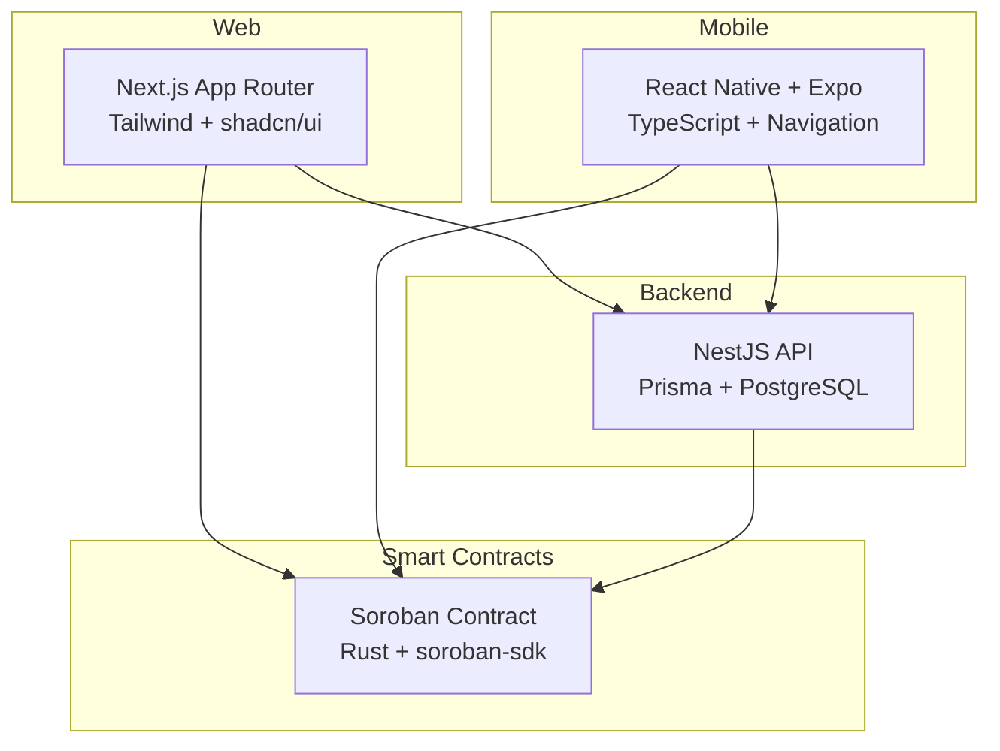
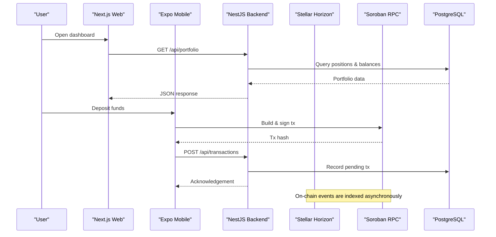
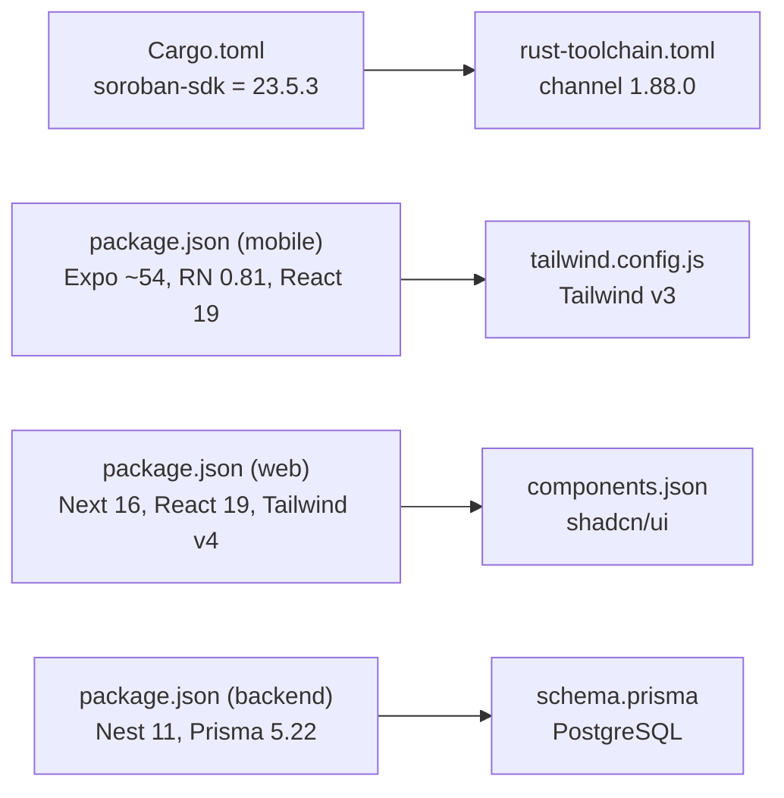

# Technology Stack

<cite>
**Referenced Files in This Document**
- [veilend-soroban/Cargo.toml](file://veilend-soroban/Cargo.toml)
- [veilend-soroban/rust-toolchain.toml](file://veilend-soroban/rust-toolchain.toml)
- [veilend-mobile/package.json](file://veilend-mobile/package.json)
- [veilend-mobile/app.json](file://veilend-mobile/app.json)
- [veilend-mobile/tailwind.config.js](file://veilend-mobile/tailwind.config.js)
- [veilend-web/package.json](file://veilend-web/package.json)
- [veilend-web/next.config.ts](file://veilend-web/next.config.ts)
- [veilend-web/components.json](file://veilend-web/components.json)
- [veilend-backend/package.json](file://veilend-backend/package.json)
- [veilend-backend/nest-cli.json](file://veilend-backend/nest-cli.json)
- [veilend-backend/prisma/schema.prisma](file://veilend-backend/prisma/schema.prisma)
- [veilend-backend/src/stellar/stellar.config.ts](file://veilend-backend/src/stellar/stellar.config.ts)
- [veilend-web/src/lib/config-validation.ts](file://veilend-web/src/lib/config-validation.ts)
</cite>

## Table of Contents
1. Introduction
2. Project Structure
3. Core Components
4. Architecture Overview
5. Detailed Component Analysis
6. Dependency Analysis
7. Performance Considerations
8. Troubleshooting Guide
9. Conclusion
10. Appendices

## Introduction
This document describes the technology stack powering the VeilLend protocol across four layers:
- Soroban smart contracts (Rust)
- Mobile app (React Native + Expo with TypeScript)
- Web application (Next.js App Router with Tailwind CSS and UI components)
- Backend API (NestJS with Prisma ORM and PostgreSQL)

It covers versions, dependencies, build tooling, environment configuration, rationale for choices, compatibility matrices, and migration considerations to help teams maintain and upgrade the system safely.

## Project Structure
VeilLend is organized as a multi-package monorepo with distinct directories per layer:
- veilend-soroban: Rust-based Soroban smart contract crate
- veilend-mobile: React Native mobile app built with Expo and TypeScript
- veilend-web: Next.js web application using the App Router and Tailwind CSS
- veilend-backend: NestJS backend with Prisma and PostgreSQL

**Diagram sources**
- [veilend-soroban/Cargo.toml:1-15](file://veilend-soroban/Cargo.toml#L1-L15)
- [veilend-web/package.json:1-43](file://veilend-web/package.json#L1-L43)
- [veilend-mobile/package.json:1-57](file://veilend-mobile/package.json#L1-L57)
- [veilend-backend/package.json:1-93](file://veilend-backend/package.json#L1-L93)

**Section sources**
- [veilend-soroban/Cargo.toml:1-15](file://veilend-soroban/Cargo.toml#L1-L15)
- [veilend-mobile/package.json:1-57](file://veilend-mobile/package.json#L1-L57)
- [veilend-web/package.json:1-43](file://veilend-web/package.json#L1-L43)
- [veilend-backend/package.json:1-93](file://veilend-backend/package.json#L1-L93)

## Core Components
- Soroban Smart Contracts: Built with Rust and the Soroban SDK; compiled to WASM targets for execution on the Stellar network.
- Mobile App: Cross-platform mobile experience via Expo, with React Native, TypeScript, navigation, state management, and wallet integration.
- Web App: Modern SSR/SSG-capable frontend using Next.js App Router, Tailwind CSS v4, and shadcn/ui components based on Radix primitives.
- Backend: NestJS service layer providing authentication, indexing, asset management, and protocol data, backed by Prisma and PostgreSQL.

**Section sources**
- [veilend-soroban/Cargo.toml:1-15](file://veilend-soroban/Cargo.toml#L1-L15)
- [veilend-mobile/package.json:1-57](file://veilend-mobile/package.json#L1-L57)
- [veilend-web/package.json:1-43](file://veilend-web/package.json#L1-L43)
- [veilend-backend/package.json:1-93](file://veilend-backend/package.json#L1-L93)

## Architecture Overview
The system integrates on-chain logic with off-chain services:
- The web and mobile clients interact with the NestJS backend for user sessions, portfolio views, and transaction history.
- Clients also call the Stellar network directly (Horizon/Soroban RPC) for signing and submitting transactions.
- The backend indexes on-chain events into PostgreSQL via Prisma and exposes them through REST endpoints.

[No sources needed since this diagram shows conceptual workflow, not actual code structure]

## Detailed Component Analysis

### Soroban Smart Contracts (Rust)
- Language and Toolchain: Rust toolchain pinned to channel 1.88.0 with wasm32 targets enabled.
- SDK: soroban-sdk locked to version 23.5.3 for deterministic builds.
- Crate Types: Both cdylib and rlib to support test harnesses and deployment artifacts.

Build and dependency highlights:
- Cargo.toml defines the contract package and pins the SDK version.
- rust-toolchain.toml ensures consistent compiler and formatting tools across environments.

Migration considerations:
- Upgrade soroban-sdk only after verifying ABI compatibility and re-running tests/snapshots.
- Pin new SDK versions explicitly to avoid drift in CI.

**Section sources**
- [veilend-soroban/Cargo.toml:1-15](file://veilend-soroban/Cargo.toml#L1-L15)
- [veilend-soroban/rust-toolchain.toml:1-5](file://veilend-soroban/rust-toolchain.toml#L1-L5)

### Mobile App (React Native + Expo)
- Framework: Expo ~54.0.36 with React Native 0.81.5 and React 19.1.0.
- Navigation: @react-navigation/native, native-stack, bottom-tabs for tabbed navigation flows.
- State and Utilities: Zustand for lightweight global state; axios for HTTP; secure storage via expo-secure-store.
- Styling: NativeWind with Tailwind CSS v3 configured for mobile content paths and theme colors.
- Wallet Integration: @stellar/stellar-base for Stellar operations and signatures.
- Platform Config: app.json enables New Architecture, iOS/Android metadata, and EAS settings.

Build and dependency highlights:
- package.json scripts standardize dev/test workflows.
- tailwind.config.js extends theme colors and sets content scanning paths.
- app.json configures bundle identifiers and platform-specific options.

Migration considerations:
- Keep React Native and Expo aligned; major RN upgrades often require Expo updates.
- When upgrading Tailwind/NativeWind, validate class usage and rebuild previews.
- Ensure stellar-base remains compatible with target Stellar network endpoints.

**Section sources**
- [veilend-mobile/package.json:1-57](file://veilend-mobile/package.json#L1-L57)
- [veilend-mobile/tailwind.config.js:1-18](file://veilend-mobile/tailwind.config.js#L1-L18)
- [veilend-mobile/app.json:1-41](file://veilend-mobile/app.json#L1-L41)

### Web Application (Next.js)
- Framework: Next.js 16.2.9 with React 19.2.4 and App Router.
- Styling and UI: Tailwind CSS v4 with shadcn/ui components (Radix-based), lucide icons, and utility libraries like clsx and class-variance-authority.
- Stellar Integration: @stellar/freighter-api and @stellar/stellar-sdk for wallet connection and on-chain interactions.
- Configuration: next.config.ts runs startup validation for environment variables before Next processes the app.

Build and dependency highlights:
- components.json configures shadcn/ui style, aliases, and icon library.
- next.config.ts enforces environment variable validation at build/start time.

Migration considerations:
- Tailwind v4 introduces changes; verify component styles and postcss pipeline.
- When upgrading Next or React, audit server components and client directives.
- Validate Stellar SDK versions against target network capabilities.

**Section sources**
- [veilend-web/package.json:1-43](file://veilend-web/package.json#L1-L43)
- [veilend-web/components.json:1-26](file://veilend-web/components.json#L1-L26)
- [veilend-web/next.config.ts:1-20](file://veilend-web/next.config.ts#L1-L20)

### Backend (NestJS + Prisma + PostgreSQL)
- Framework: NestJS 11 with Express platform, JWT/passport for authentication, throttler for rate limiting, and CLS for request-scoped context.
- Data Access: Prisma Client 5.22 connected to PostgreSQL; schema includes users, assets, positions, transactions, sessions, checkpoints, and admin roles.
- Stellar Integration: Uses @stellar/stellar-sdk and stellar-sdk alongside Horizon and Soroban RPC endpoints configured via environment variables.
- CLI and Build: nest-cli.json configures source root and compiler options; Docker and scripts support local and production builds.

Build and dependency highlights:
- prisma/schema.prisma defines relational models and indices for performance.
- stellar.config.ts centralizes Horizon/Soroban URLs and network passphrase.
- package.json scripts include testing, seeding, and linting.

Migration considerations:
- Prisma migrations must be applied in order; pin Prisma versions to ensure deterministic schema generation.
- Stellar SDK upgrades may require endpoint or feature checks; validate against target networks.
- Authentication strategy should be reviewed when Passport/JWT versions change.

**Section sources**
- [veilend-backend/package.json:1-93](file://veilend-backend/package.json#L1-L93)
- [veilend-backend/nest-cli.json:1-9](file://veilend-backend/nest-cli.json#L1-L9)
- [veilend-backend/prisma/schema.prisma:1-197](file://veilend-backend/prisma/schema.prisma#L1-L197)
- [veilend-backend/src/stellar/stellar.config.ts:1-23](file://veilend-backend/src/stellar/stellar.config.ts#L1-L23)

## Dependency Analysis
Version compatibility matrix (selected):
- Soroban: Rust toolchain 1.88.0; soroban-sdk 23.5.3
- Mobile: Expo ~54.0.36; React Native 0.81.5; React 19.1.0; Tailwind v3 (NativeWind)
- Web: Next.js 16.2.9; React 19.2.4; Tailwind v4; shadcn/ui (Radix)
- Backend: NestJS 11; Prisma 5.22; PostgreSQL (via Prisma provider); Stellar SDKs 15.x/16.x

Dependency management strategies:
- Lock exact versions for critical runtime dependencies (e.g., soroban-sdk) to ensure reproducibility.
- Use package managers’ lockfiles (npm) and Cargo.lock for deterministic builds.
- Centralize environment configuration in each layer (web env validation, backend config module).

Build tool configurations:
- Soroban: cargo build with wasm targets defined in rust-toolchain.toml.
- Mobile: Expo scripts and EAS config for development, preview, and production builds.
- Web: Next.js scripts for dev/build/start; PostCSS/Tailwind v4 pipeline.
- Backend: Nest CLI build; Prisma generate/migrate; Jest for unit/e2e tests.

**Diagram sources**
- [veilend-soroban/Cargo.toml:1-15](file://veilend-soroban/Cargo.toml#L1-L15)
- [veilend-soroban/rust-toolchain.toml:1-5](file://veilend-soroban/rust-toolchain.toml#L1-L5)
- [veilend-mobile/package.json:1-57](file://veilend-mobile/package.json#L1-L57)
- [veilend-mobile/tailwind.config.js:1-18](file://veilend-mobile/tailwind.config.js#L1-L18)
- [veilend-web/package.json:1-43](file://veilend-web/package.json#L1-L43)
- [veilend-web/components.json:1-26](file://veilend-web/components.json#L1-L26)
- [veilend-backend/package.json:1-93](file://veilend-backend/package.json#L1-L93)
- [veilend-backend/prisma/schema.prisma:1-197](file://veilend-backend/prisma/schema.prisma#L1-L197)

**Section sources**
- [veilend-soroban/Cargo.toml:1-15](file://veilend-soroban/Cargo.toml#L1-L15)
- [veilend-mobile/package.json:1-57](file://veilend-mobile/package.json#L1-L57)
- [veilend-web/package.json:1-43](file://veilend-web/package.json#L1-L43)
- [veilend-backend/package.json:1-93](file://veilend-backend/package.json#L1-L93)

## Performance Considerations
- Database: Leverage Prisma indices (e.g., userId, assetId, lastSyncAt) for efficient queries on positions and transactions.
- Indexing: Use checkpoint models to resume event streaming and reduce redundant processing.
- Frontend: Prefer server-side rendering where appropriate in Next.js to improve initial load; use Tailwind utilities to minimize CSS bloat.
- Mobile: Use NativeWind sparingly and keep animations minimal to preserve smoothness on low-end devices.
- Network: Cache Horizon/Soroban responses where feasible and batch requests to reduce latency.

[No sources needed since this section provides general guidance]

## Troubleshooting Guide
Common issues and resolutions:
- Environment variables:
  - Web: next.config.ts validates required variables at startup; fix missing/invalid values early.
  - Backend: stellar.config.ts defaults to testnet if env vars are absent; ensure correct Horizon/Soroban URLs and passphrase.
- Database connectivity:
  - Prisma requires a valid DATABASE_URL; confirm PostgreSQL is reachable and migrations are applied.
- Stellar endpoints:
  - Verify Horizon and Soroban RPC URLs match the intended network; mismatched passphrases cause signature failures.
- Build errors:
  - Mobile: Ensure Expo and RN versions align; check EAS CLI version constraints.
  - Web: Tailwind v4 may require updated PostCSS plugins; verify component imports from shadcn/ui.
  - Soroban: Rebuild with pinned toolchain and SDK versions to avoid ABI drift.

**Section sources**
- [veilend-web/next.config.ts:1-20](file://veilend-web/next.config.ts#L1-L20)
- [veilend-web/src/lib/config-validation.ts:31-158](file://veilend-web/src/lib/config-validation.ts#L31-L158)
- [veilend-backend/src/stellar/stellar.config.ts:1-23](file://veilend-backend/src/stellar/stellar.config.ts#L1-L23)
- [veilend-backend/prisma/schema.prisma:1-197](file://veilend-backend/prisma/schema.prisma#L1-L197)

## Conclusion
VeilLend’s stack combines robust on-chain logic with modern cross-platform frontends and a scalable backend. By pinning critical versions, centralizing configuration, and leveraging Prisma for data consistency, the system maintains reliability and clarity. Future upgrades should proceed with caution: validate ABI compatibility for Soroban, align Expo/RN releases, adopt Tailwind v4 practices incrementally, and review NestJS/Prisma updates against integration tests and migrations.

[No sources needed since this section summarizes without analyzing specific files]

## Appendices

### Rationale for Technology Choices
- Soroban/Rust: Strong safety guarantees and deterministic builds for financial-grade smart contracts.
- Expo/React Native: Rapid iteration, cross-platform reach, and mature ecosystem for mobile wallets and UX.
- Next.js App Router: Server-side rendering, routing simplicity, and strong ecosystem integration for modern web apps.
- NestJS + Prisma: Modular architecture, type-safe database access, and clear separation of concerns for backend services.

[No sources needed since this section provides general guidance]

### Migration Considerations
- Soroban: Upgrade SDK only after re-running tests and validating ABI; update toolchain carefully to avoid breaking changes.
- Mobile: Align Expo and RN versions; validate NativeWind classes and navigation APIs after major updates.
- Web: Audit Tailwind v4 changes; update PostCSS and shadcn/ui components as needed; verify Next.js server/client boundaries.
- Backend: Apply Prisma migrations in order; test Passport/JWT strategies after upgrades; validate Stellar SDK changes against target networks.

[No sources needed since this section provides general guidance]