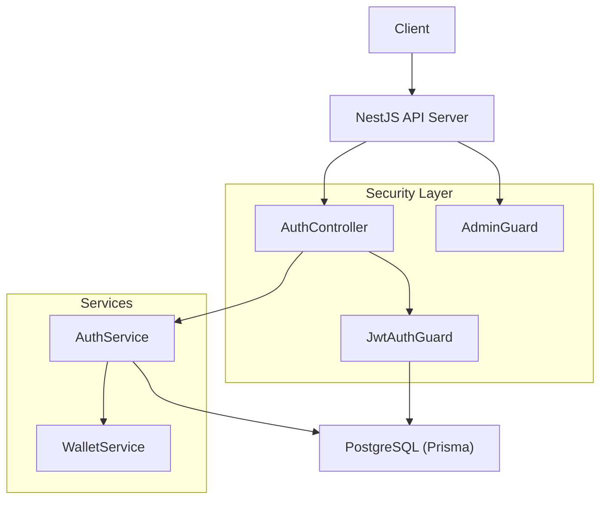
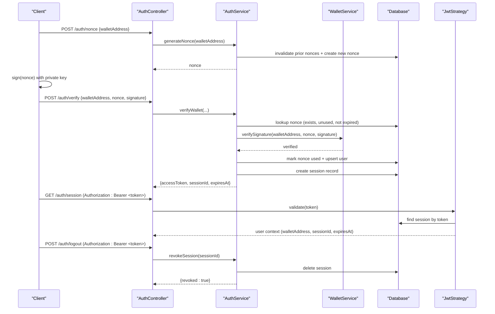
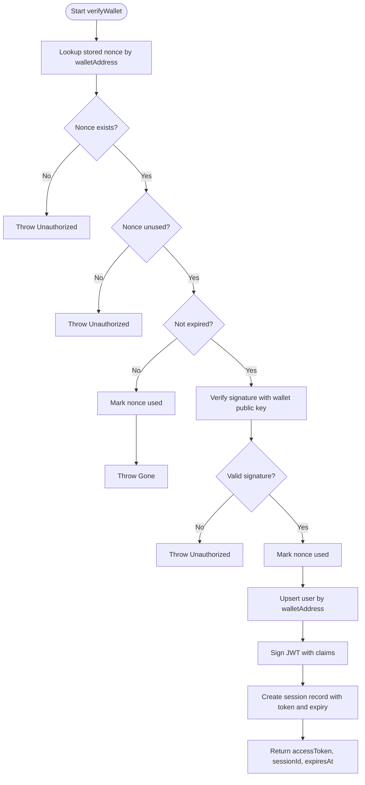
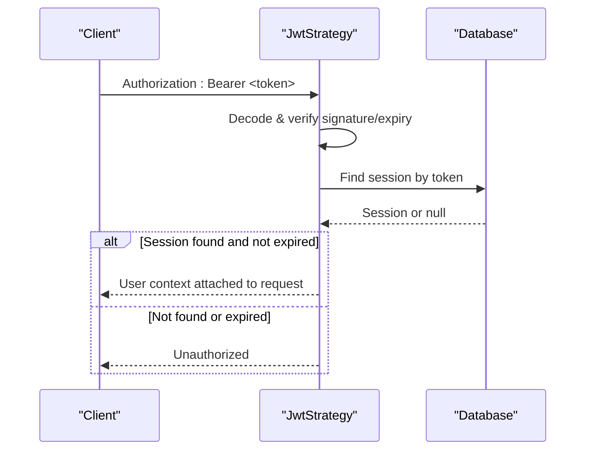
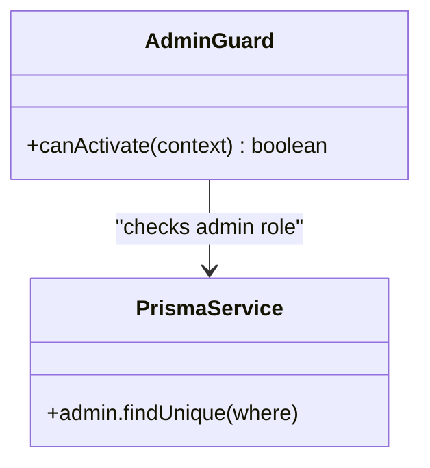
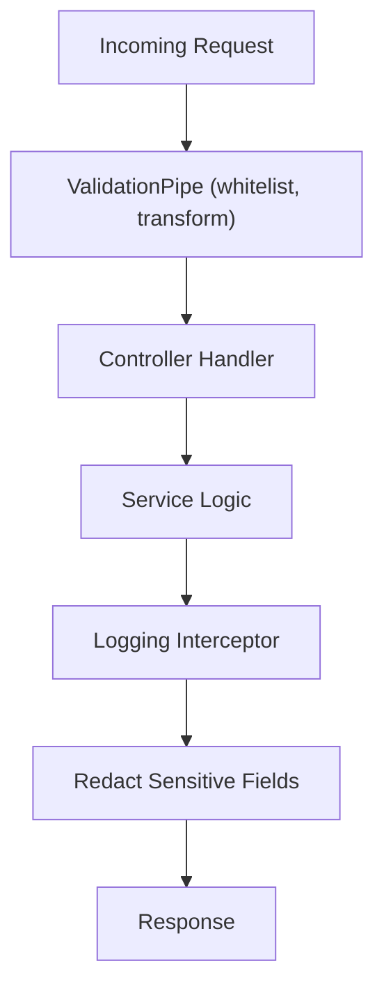
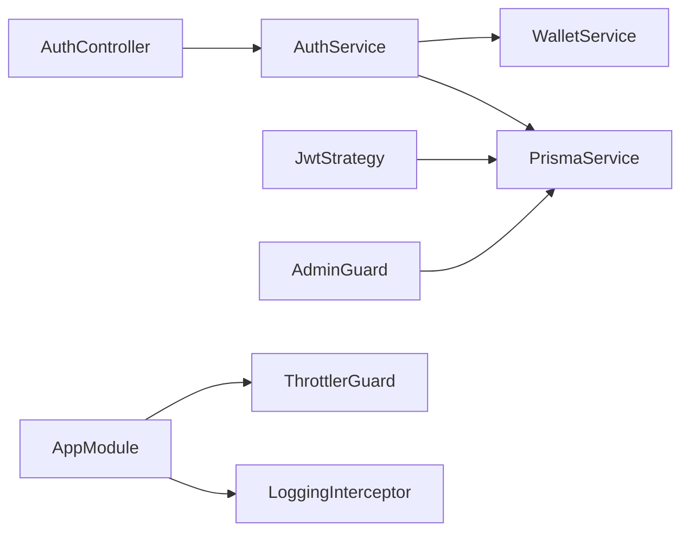

# Application Security

<cite>
**Referenced Files in This Document**
- [main.ts](file://veilend-backend/src/main.ts)
- [app.module.ts](file://veilend-backend/src/app.module.ts)
- [auth.controller.ts](file://veilend-backend/src/auth/auth.controller.ts)
- [auth.service.ts](file://veilend-backend/src/auth/auth.service.ts)
- [jwt.strategy.ts](file://veilend-backend/src/auth/jwt.strategy.ts)
- [admin.guard.ts](file://veilend-backend/src/auth/admin.guard.ts)
- [wallet.service.ts](file://veilend-backend/src/wallet/wallet.service.ts)
- [admin.controller.ts](file://veilend-backend/src/admin/admin.controller.ts)
- [redact.util.ts](file://veilend-backend/src/common/logging/redact.util.ts)
- [validation.ts](file://veilend-backend/src/config/validation.ts)
- [schema.prisma](file://veilend-backend/prisma/schema.prisma)
</cite>

## Table of Contents
1. Introduction
2. Project Structure
3. Core Components
4. Architecture Overview
5. Detailed Component Analysis
6. Dependency Analysis
7. Performance Considerations
8. Troubleshooting Guide
9. Conclusion

## Introduction
This document explains the application security model for the backend, focusing on authentication, authorization, and data protection. It covers:
- Wallet-based authentication using cryptographic signatures and nonce-based challenge-response
- JWT-based session management with token issuance, validation, and revocation
- Admin guard and role-based access control for administrative endpoints
- Input validation and sanitization patterns across API endpoints
- Request throttling and rate limiting strategies
- Secure storage practices for sensitive data and secrets
- Mitigations for common web vulnerabilities (XSS, CSRF, injection)
- Guidance for secure headers, HTTPS enforcement, and secure cookies in production deployments

## Project Structure
The backend is a NestJS application that centralizes security concerns in dedicated modules:
- Authentication module handles wallet login, JWT sessions, and logout
- Admin module protects privileged operations behind an admin guard
- Global configuration applies validation pipes, throttling, correlation IDs, logging, and exception handling
- Data models define users, sessions, nonces, and admins for secure state management

**Diagram sources**
- [app.module.ts:28-83](file://veilend-backend/src/app.module.ts#L28-L83)
- [auth.controller.ts:14-58](file://veilend-backend/src/auth/auth.controller.ts#L14-L58)
- [auth.service.ts:19-203](file://veilend-backend/src/auth/auth.service.ts#L19-L203)
- [jwt.strategy.ts:13-64](file://veilend-backend/src/auth/jwt.strategy.ts#L13-L64)
- [admin.guard.ts:24-46](file://veilend-backend/src/auth/admin.guard.ts#L24-L46)
- [wallet.service.ts:4-16](file://veilend-backend/src/wallet/wallet.service.ts#L4-L16)

**Section sources**
- [app.module.ts:28-83](file://veilend-backend/src/app.module.ts#L28-L83)
- [main.ts:7-21](file://veilend-backend/src/main.ts#L7-L21)

## Core Components
- Wallet-based authentication flow:
  - Nonce generation with expiration and one-time use semantics
  - Signature verification against Stellar public keys
  - Session creation and JWT issuance
- JWT session management:
  - Bearer token extraction and signature/expiry checks
  - Database-backed session validation and revocation
- Admin guard:
  - Role-based check ensuring caller is registered as an admin
- Input validation and sanitization:
  - Global ValidationPipe with whitelist mode
  - Configuration validation utilities
  - Sensitive data redaction in logs
- Throttling and request limits:
  - Global ThrottlerGuard with configurable TTL and limit

**Section sources**
- [auth.controller.ts:20-57](file://veilend-backend/src/auth/auth.controller.ts#L20-L57)
- [auth.service.ts:29-201](file://veilend-backend/src/auth/auth.service.ts#L29-L201)
- [jwt.strategy.ts:13-64](file://veilend-backend/src/auth/jwt.strategy.ts#L13-L64)
- [admin.guard.ts:24-46](file://veilend-backend/src/auth/admin.guard.ts#L24-L46)
- [wallet.service.ts:4-16](file://veilend-backend/src/wallet/wallet.service.ts#L4-L16)
- [main.ts:12-16](file://veilend-backend/src/main.ts#L12-L16)
- [validation.ts:8-32](file://veilend-backend/src/config/validation.ts#L8-L32)
- [redact.util.ts:1-56](file://veilend-backend/src/common/logging/redact.util.ts#L1-L56)
- [app.module.ts:42-50](file://veilend-backend/src/app.module.ts#L42-L50)

## Architecture Overview
The authentication and authorization architecture combines wallet cryptography with server-side session management:

**Diagram sources**
- [auth.controller.ts:20-57](file://veilend-backend/src/auth/auth.controller.ts#L20-L57)
- [auth.service.ts:36-201](file://veilend-backend/src/auth/auth.service.ts#L36-L201)
- [wallet.service.ts:6-15](file://veilend-backend/src/wallet/wallet.service.ts#L6-L15)
- [jwt.strategy.ts:19-63](file://veilend-backend/src/auth/jwt.strategy.ts#L19-L63)
- [schema.prisma:23-42](file://veilend-backend/prisma/schema.prisma#L23-L42)

## Detailed Component Analysis

### Wallet-Based Authentication and Nonce Challenge-Response
- Nonce lifecycle:
  - Generate a random nonce per wallet address
  - Persist with expiry timestamp; invalidate any previous unused nonces to prevent stacking
  - Enforce one-time use and expiration during verification
- Signature verification:
  - Use Stellar Keypair to verify the client’s signature over the nonce
- Session creation:
  - Upsert user by wallet address
  - Issue JWT containing minimal identity claims
  - Store session record with token and expiry for revocation support

**Diagram sources**
- [auth.service.ts:70-149](file://veilend-backend/src/auth/auth.service.ts#L70-L149)
- [wallet.service.ts:6-15](file://veilend-backend/src/wallet/wallet.service.ts#L6-L15)
- [schema.prisma:23-42](file://veilend-backend/prisma/schema.prisma#L23-L42)

**Section sources**
- [auth.controller.ts:20-36](file://veilend-backend/src/auth/auth.controller.ts#L20-L36)
- [auth.service.ts:29-149](file://veilend-backend/src/auth/auth.service.ts#L29-L149)
- [wallet.service.ts:4-16](file://veilend-backend/src/wallet/wallet.service.ts#L4-L16)
- [schema.prisma:23-42](file://veilend-backend/prisma/schema.prisma#L23-L42)

### JWT Session Management
- Token issuance:
  - JWT signed with configured secret; payload includes wallet address and user ID
- Token validation:
  - Extract bearer token from Authorization header
  - Validate signature and expiry via Passport strategy
  - Additional database check ensures session exists and is not revoked or expired
- Session revocation:
  - Delete session record to immediately invalidate the token
  - Idempotent logout operation

**Diagram sources**
- [jwt.strategy.ts:19-63](file://veilend-backend/src/auth/jwt.strategy.ts#L19-L63)
- [auth.service.ts:156-201](file://veilend-backend/src/auth/auth.service.ts#L156-L201)
- [schema.prisma:31-42](file://veilend-backend/prisma/schema.prisma#L31-L42)

**Section sources**
- [jwt.strategy.ts:13-64](file://veilend-backend/src/auth/jwt.strategy.ts#L13-L64)
- [auth.service.ts:151-201](file://veilend-backend/src/auth/auth.service.ts#L151-L201)
- [schema.prisma:31-42](file://veilend-backend/prisma/schema.prisma#L31-L42)

### Admin Guard and Role-Based Access Control
- Protection:
  - All admin endpoints are guarded by both JWT authentication and admin role verification
- Role check:
  - Ensure the authenticated wallet address exists in the Admin table
- Endpoints:
  - Manage admin accounts and configure protocol parameters such as asset settings, oracle prices, and collateral ratios

**Diagram sources**
- [admin.guard.ts:24-46](file://veilend-backend/src/auth/admin.guard.ts#L24-L46)
- [admin.controller.ts:20-55](file://veilend-backend/src/admin/admin.controller.ts#L20-L55)
- [schema.prisma:179-185](file://veilend-backend/prisma/schema.prisma#L179-L185)

**Section sources**
- [admin.guard.ts:24-46](file://veilend-backend/src/auth/admin.guard.ts#L24-L46)
- [admin.controller.ts:20-55](file://veilend-backend/src/admin/admin.controller.ts#L20-L55)
- [schema.prisma:179-185](file://veilend-backend/prisma/schema.prisma#L179-L185)

### Input Validation and Sanitization
- Global validation:
  - ValidationPipe applied globally with whitelist mode to reject unknown fields
  - Transform enabled to coerce types where appropriate
- Configuration validation:
  - Runtime validation of environment-derived config objects
  - Redaction utility to mask sensitive configuration values in logs
- Logging redaction:
  - Sensitive keys (e.g., tokens, signatures, nonces) are masked in structured logs
  - Bearer headers are redacted to avoid leaking secrets

**Diagram sources**
- [main.ts:12-16](file://veilend-backend/src/main.ts#L12-L16)
- [validation.ts:8-32](file://veilend-backend/src/config/validation.ts#L8-L32)
- [redact.util.ts:1-56](file://veilend-backend/src/common/logging/redact.util.ts#L1-L56)

**Section sources**
- [main.ts:12-16](file://veilend-backend/src/main.ts#L12-L16)
- [validation.ts:8-32](file://veilend-backend/src/config/validation.ts#L8-L32)
- [redact.util.ts:1-56](file://veilend-backend/src/common/logging/redact.util.ts#L1-L56)

### CORS, Rate Limiting, and Request Throttling
- Throttling:
  - Global ThrottlerGuard configured with TTL and limit via configuration service
  - Applied at the application level to protect all endpoints
- CORS:
  - No explicit CORS configuration detected in the analyzed files; ensure it is configured at deployment or via environment if needed
- Recommendations:
  - Restrict allowed origins to known frontends
  - Combine with HTTPS-only policies and secure cookie flags when applicable

**Section sources**
- [app.module.ts:42-50](file://veilend-backend/src/app.module.ts#L42-L50)

### Secure Storage Practices
- Secrets and configuration:
  - JWT secret loaded from configuration service; ensure it is provided via environment variables and never hardcoded
  - Database URL loaded from environment variable
- Sensitive data handling:
  - Logs redact sensitive keys and Bearer tokens
  - Configuration redaction helper masks secrets in logs
- Database encryption:
  - Use TLS for database connections and enable platform-level encryption at rest where supported
  - Avoid storing plaintext secrets in the database; store only necessary identifiers and references

**Section sources**
- [jwt.strategy.ts:19-24](file://veilend-backend/src/auth/jwt.strategy.ts#L19-L24)
- [schema.prisma:5-8](file://veilend-backend/prisma/schema.prisma#L5-L8)
- [redact.util.ts:1-56](file://veilend-backend/src/common/logging/redact.util.ts#L1-L56)
- [validation.ts:34-50](file://veilend-backend/src/config/validation.ts#L34-L50)

### Common Web Vulnerabilities and Mitigations
- XSS:
  - Use framework templating safely; sanitize outputs on the frontend
  - Set Content-Security-Policy headers at the gateway/proxy layer
- CSRF:
  - For JSON APIs, rely on same-origin policy and do not send credentials with cross-site requests
  - If using cookies for auth, enforce SameSite and secure flags
- Injection:
  - Parameterized queries via Prisma mitigate SQL injection
  - Validate and sanitize all inputs; prefer DTOs and whitelist validation
- Brute force and replay:
  - Nonce one-time use and expiry prevent replay attacks
  - Throttling limits repeated attempts across endpoints
- Token exposure:
  - Redact tokens in logs; require Authorization header for protected routes

[No sources needed since this section provides general guidance]

### Security Headers, HTTPS Enforcement, and Secure Cookies
- Recommended production posture:
  - Enforce HTTPS at the reverse proxy or hosting platform
  - Configure security headers (e.g., HSTS, X-Content-Type-Options, Referrer-Policy) at the edge
  - If using cookies, set Secure, HttpOnly, and SameSite attributes
- Current implementation notes:
  - The analyzed code does not include explicit security header middleware; apply these configurations at the deployment layer

[No sources needed since this section provides general guidance]

## Dependency Analysis
Authentication and authorization depend on:
- WalletService for cryptographic verification
- PrismaService for session and nonce persistence
- JwtStrategy for token validation and session checks
- AdminGuard for role checks on admin endpoints
- Global guards and interceptors for throttling, logging, and transformation

**Diagram sources**
- [auth.controller.ts:14-58](file://veilend-backend/src/auth/auth.controller.ts#L14-L58)
- [auth.service.ts:19-203](file://veilend-backend/src/auth/auth.service.ts#L19-L203)
- [jwt.strategy.ts:13-64](file://veilend-backend/src/auth/jwt.strategy.ts#L13-L64)
- [admin.guard.ts:24-46](file://veilend-backend/src/auth/admin.guard.ts#L24-L46)
- [app.module.ts:62-80](file://veilend-backend/src/app.module.ts#L62-L80)

**Section sources**
- [app.module.ts:28-83](file://veilend-backend/src/app.module.ts#L28-L83)
- [auth.controller.ts:14-58](file://veilend-backend/src/auth/auth.controller.ts#L14-L58)
- [auth.service.ts:19-203](file://veilend-backend/src/auth/auth.service.ts#L19-L203)
- [jwt.strategy.ts:13-64](file://veilend-backend/src/auth/jwt.strategy.ts#L13-L64)
- [admin.guard.ts:24-46](file://veilend-backend/src/auth/admin.guard.ts#L24-L46)

## Performance Considerations
- Nonce operations:
  - Invalidate prior unused nonces atomically to prevent stacking; keep TTL short to reduce storage growth
- Session lookups:
  - Indexed by token and userId for fast validation and revocation
- Throttling:
  - Tune TTL and limit based on expected traffic patterns to balance security and performance
- Logging:
  - Use correlation IDs and redaction to maintain observability without leaking sensitive data

[No sources needed since this section provides general guidance]

## Troubleshooting Guide
- Invalid or unknown nonce:
  - Ensure the client requested a fresh nonce and has not reused an old one
- Replay attempt detected:
  - Nonce already used; request a new challenge
- Nonce expired:
  - Reissue a nonce and retry within the TTL window
- Invalid wallet signature:
  - Verify the client signs the exact nonce string returned by the server
- Session not found or revoked:
  - Check that the token corresponds to an active session; logout invalidates it
- Unauthorized (not admin):
  - Confirm the wallet address is registered in the Admin table before calling admin endpoints

**Section sources**
- [auth.service.ts:77-112](file://veilend-backend/src/auth/auth.service.ts#L77-L112)
- [auth.service.ts:156-201](file://veilend-backend/src/auth/auth.service.ts#L156-L201)
- [jwt.strategy.ts:45-56](file://veilend-backend/src/auth/jwt.strategy.ts#L45-L56)
- [admin.guard.ts:36-42](file://veilend-backend/src/auth/admin.guard.ts#L36-L42)

## Conclusion
The backend implements a robust security model combining wallet-based authentication, JWT sessions, and strict admin role checks. Input validation, throttling, and sensitive data redaction further harden the system. For production, complement these measures with HTTPS enforcement, security headers, and secure cookie policies at the deployment layer. Continuously monitor logs (with redaction), tune throttling, and review nonce and session lifetimes to maintain a strong security posture.