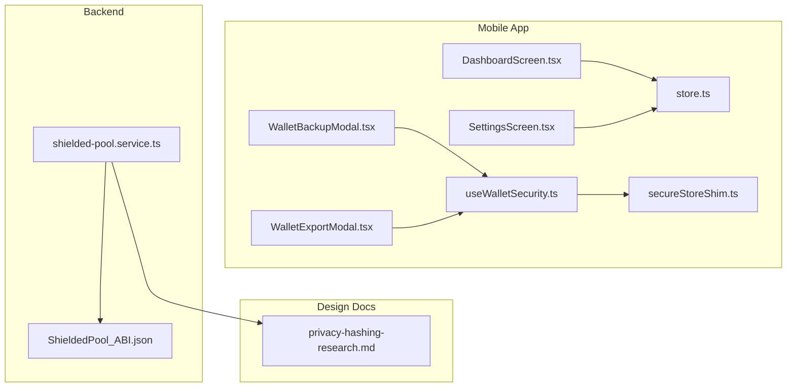
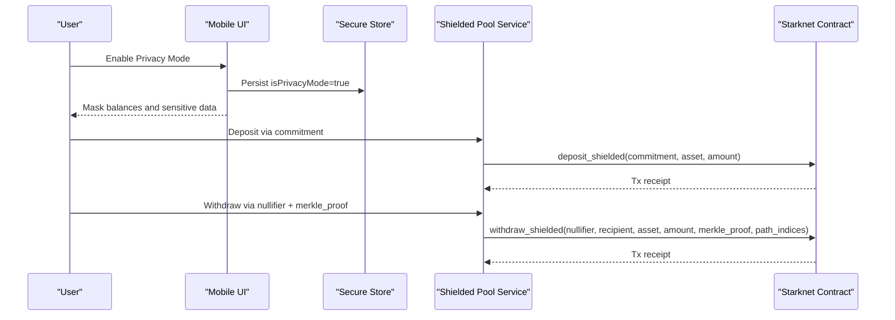
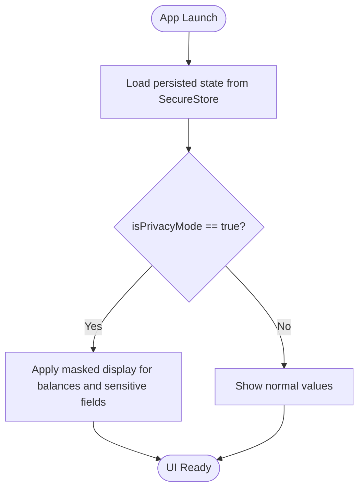
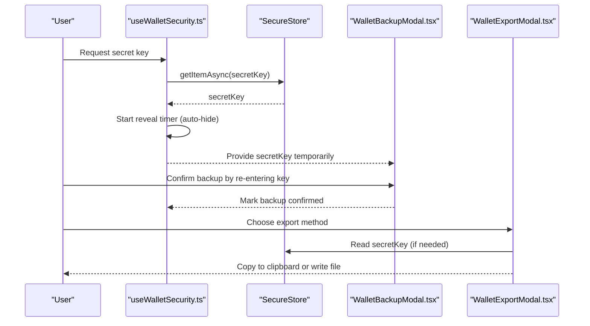
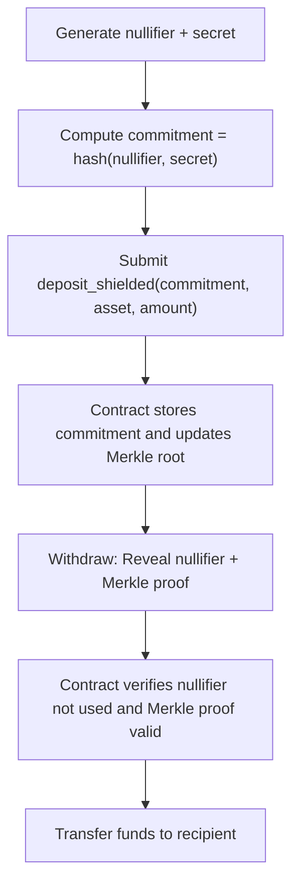
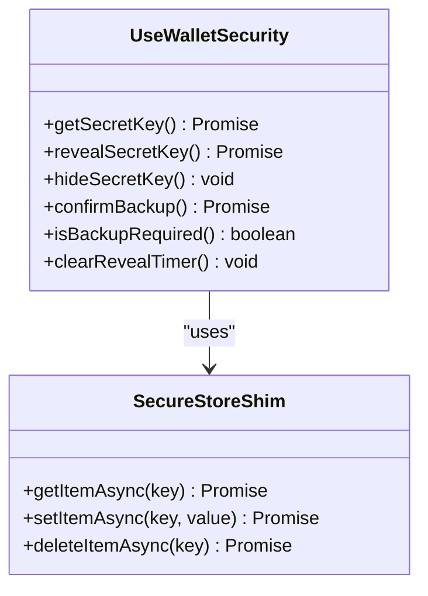
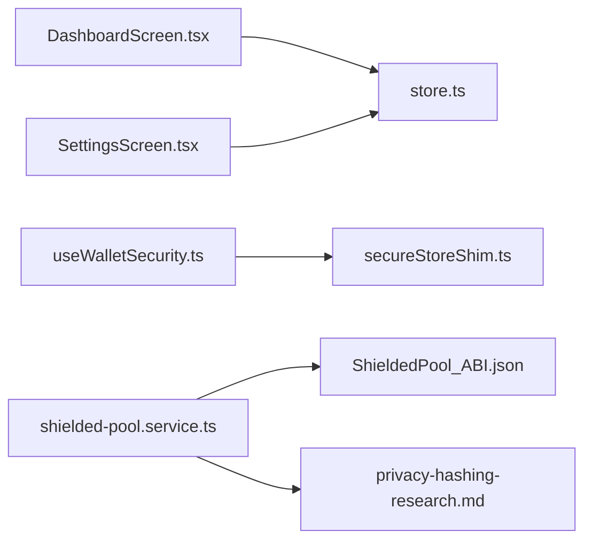
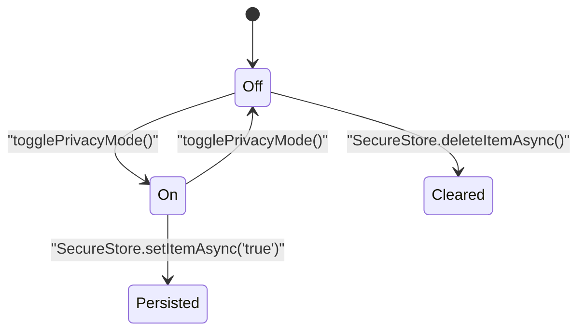
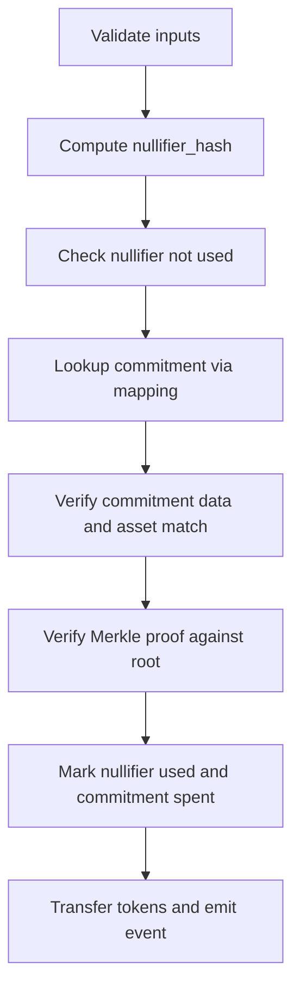

# Privacy Protections

<cite>
**Referenced Files in This Document**
- [shielded-pool.service.ts](file://legacy/veilend-backend/src/shielded-pool/shielded-pool.service.ts)
- [ShieldedPool_ABI.json](file://legacy/veilend-backend/src/abis/ShieldedPool_ABI.json)
- [privacy-hashing-research.md](file://legacy/docs/migration/privacy-hashing-research.md)
- [store.ts](file://veilend-mobile/src/store/store.ts)
- [DashboardScreen.tsx](file://veilend-mobile/src/screens/DashboardScreen.tsx)
- [SettingsScreen.tsx](file://veilend-mobile/src/screens/SettingsScreen.tsx)
- [useWalletSecurity.ts](file://veilend-mobile/src/hooks/useWalletSecurity.ts)
- [WalletBackupModal.tsx](file://veilend-mobile/src/components/WalletBackupModal.tsx)
- [WalletExportModal.tsx](file://veilend-mobile/src/components/WalletExportModal.tsx)
- [secureStoreShim.ts](file://veilend-mobile/src/utils/secureStoreShim.ts)
</cite>

## Table of Contents
1. Introduction
2. Project Structure
3. Core Components
4. Architecture Overview
5. Detailed Component Analysis
6. Dependency Analysis
7. Performance Considerations
8. Troubleshooting Guide
9. Conclusion
10. Appendices

## Introduction
This document explains the privacy protections implemented across the Veillend codebase, focusing on:
- X-Ray privacy mode that masks sensitive balances and transaction details in the UI
- Secure wallet backup and recovery with encrypted storage and controlled export flows
- Zero-knowledge proof concepts and how they enable private transactions while preserving protocol integrity
- Data minimization and selective disclosure patterns
- Privacy-preserving query mechanisms for verifying positions without exposing full portfolio details
- Secure local storage practices for mobile apps (keychain/keystore usage and memory cleanup)
- Threats such as metadata leakage, timing attacks, and side-channel analysis, with mitigation strategies
- User guidance to maintain privacy best practices and understand trade-offs

## Project Structure
Privacy features span multiple layers:
- Mobile UI toggles and masking logic
- Secure storage hooks and modals for backup/export
- Backend shielded pool service and ABI for Starknet interactions
- Legacy design docs describing zero-knowledge flows and Merkle proofs

**Diagram sources**
- [DashboardScreen.tsx:121-171](file://veilend-mobile/src/screens/DashboardScreen.tsx#L121-L171)
- [SettingsScreen.tsx:227-238](file://veilend-mobile/src/screens/SettingsScreen.tsx#L227-L238)
- [useWalletSecurity.ts:1-138](file://veilend-mobile/src/hooks/useWalletSecurity.ts#L1-L138)
- [WalletBackupModal.tsx:1-209](file://veilend-mobile/src/components/WalletBackupModal.tsx#L1-L209)
- [WalletExportModal.tsx:1-231](file://veilend-mobile/src/components/WalletExportModal.tsx#L1-L231)
- [secureStoreShim.ts:1-37](file://veilend-mobile/src/utils/secureStoreShim.ts#L1-L37)
- [store.ts:17-29](file://veilend-mobile/src/store/store.ts#L17-L29)
- [shielded-pool.service.ts:1-183](file://legacy/veilend-backend/src/shielded-pool/shielded-pool.service.ts#L1-L183)
- [ShieldedPool_ABI.json:54-100](file://legacy/veilend-backend/src/abis/ShieldedPool_ABI.json#L54-L100)
- [privacy-hashing-research.md:120-167](file://legacy/docs/migration/privacy-hashing-research.md#L120-L167)

**Section sources**
- [DashboardScreen.tsx:121-171](file://veilend-mobile/src/screens/DashboardScreen.tsx#L121-L171)
- [SettingsScreen.tsx:227-238](file://veilend-mobile/src/screens/SettingsScreen.tsx#L227-L238)
- [store.ts:17-29](file://veilend-mobile/src/store/store.ts#L17-L29)
- [shielded-pool.service.ts:1-183](file://legacy/veilend-backend/src/shielded-pool/shielded-pool.service.ts#L1-L183)
- [ShieldedPool_ABI.json:54-100](file://legacy/veilend-backend/src/abis/ShieldedPool_ABI.json#L54-L100)
- [privacy-hashing-research.md:120-167](file://legacy/docs/migration/privacy-hashing-research.md#L120-L167)

## Core Components
- Privacy Mode Toggle: A user-controlled switch that hides balances and sensitive values across screens. The toggle state is persisted securely and restored on app launch.
- Shielded Pool Service: Backend integration for Starknet shielded operations including depositing and withdrawing via commitments and nullifiers, and querying Merkle roots and nullifier status.
- Wallet Security Hook: Provides secure retrieval and temporary reveal of secret keys, with timers to auto-hide secrets and confirm backups.
- Backup and Export Modals: Guided workflows to safely view, copy, or export wallet credentials with explicit warnings and confirmation steps.
- Secure Storage Shim: Abstraction over platform keychain/keystore-backed storage with a development fallback.

**Section sources**
- [store.ts:173-185](file://veilend-mobile/src/store/store.ts#L173-L185)
- [store.ts:369-396](file://veilend-mobile/src/store/store.ts#L369-L396)
- [shielded-pool.service.ts:11-59](file://legacy/veilend-backend/src/shielded-pool/shielded-pool.service.ts#L11-L59)
- [shielded-pool.service.ts:62-115](file://legacy/veilend-backend/src/shielded-pool/shielded-pool.service.ts#L62-L115)
- [useWalletSecurity.ts:64-138](file://veilend-mobile/src/hooks/useWalletSecurity.ts#L64-L138)
- [WalletBackupModal.tsx:49-87](file://veilend-mobile/src/components/WalletBackupModal.tsx#L49-L87)
- [WalletExportModal.tsx:37-104](file://veilend-mobile/src/components/WalletExportModal.tsx#L37-L104)
- [secureStoreShim.ts:22-35](file://veilend-mobile/src/utils/secureStoreShim.ts#L22-L35)

## Architecture Overview
The privacy architecture combines client-side masking and secure storage with on-chain shielded operations.

**Diagram sources**
- [store.ts:173-185](file://veilend-mobile/src/store/store.ts#L173-L185)
- [shielded-pool.service.ts:62-115](file://legacy/veilend-backend/src/shielded-pool/shielded-pool.service.ts#L62-L115)
- [ShieldedPool_ABI.json:54-100](file://legacy/veilend-backend/src/abis/ShieldedPool_ABI.json#L54-L100)

## Detailed Component Analysis

### X-Ray Privacy Mode and UI Masking
- Privacy toggle persists securely and restores on app launch.
- Dashboard masks balance values when privacy mode is enabled, showing placeholders instead of actual amounts.
- Settings screen exposes the toggle and labels it clearly for users.

**Diagram sources**
- [store.ts:369-396](file://veilend-mobile/src/store/store.ts#L369-L396)
- [DashboardScreen.tsx:140-159](file://veilend-mobile/src/screens/DashboardScreen.tsx#L140-L159)
- [SettingsScreen.tsx:227-238](file://veilend-mobile/src/screens/SettingsScreen.tsx#L227-L238)

**Section sources**
- [store.ts:173-185](file://veilend-mobile/src/store/store.ts#L173-L185)
- [store.ts:369-396](file://veilend-mobile/src/store/store.ts#L369-L396)
- [DashboardScreen.tsx:140-159](file://veilend-mobile/src/screens/DashboardScreen.tsx#L140-L159)
- [SettingsScreen.tsx:227-238](file://veilend-mobile/src/screens/SettingsScreen.tsx#L227-L238)

### Secure Wallet Backup and Recovery
- Secret key retrieval uses a secure store abstraction; on production platforms this maps to keychain/keystore.
- Temporary reveal flow includes an auto-expiring timer to minimize exposure time.
- Backup modal enforces multi-step confirmation and provides copy-to-clipboard with feedback.
- Export modal warns about risks, supports clipboard and file export, and guides safe handling.

**Diagram sources**
- [useWalletSecurity.ts:64-138](file://veilend-mobile/src/hooks/useWalletSecurity.ts#L64-L138)
- [WalletBackupModal.tsx:49-87](file://veilend-mobile/src/components/WalletBackupModal.tsx#L49-L87)
- [WalletExportModal.tsx:37-104](file://veilend-mobile/src/components/WalletExportModal.tsx#L37-L104)
- [secureStoreShim.ts:22-35](file://veilend-mobile/src/utils/secureStoreShim.ts#L22-L35)

**Section sources**
- [useWalletSecurity.ts:1-138](file://veilend-mobile/src/hooks/useWalletSecurity.ts#L1-L138)
- [WalletBackupModal.tsx:1-209](file://veilend-mobile/src/components/WalletBackupModal.tsx#L1-L209)
- [WalletExportModal.tsx:1-231](file://veilend-mobile/src/components/WalletExportModal.tsx#L1-L231)
- [secureStoreShim.ts:1-37](file://veilend-mobile/src/utils/secureStoreShim.ts#L1-L37)

### Zero-Knowledge Proof Concepts and Integration
- Commit-Reveal Flow: Clients generate commitments off-chain and submit them to the shielded pool contract. During withdrawals, clients reveal nullifiers and provide Merkle proofs to validate ownership without exposing full balances.
- Nullifier and Merkle Root: The backend service queries contract methods to check nullifier usage and retrieve the current Merkle root, enabling verification of inclusion.
- ABI Exposure: The Starknet ABI defines functions for depositing, withdrawing, and verifying proofs, which the backend compiles and executes against the network.

**Diagram sources**
- [privacy-hashing-research.md:120-167](file://legacy/docs/migration/privacy-hashing-research.md#L120-L167)
- [shielded-pool.service.ts:62-115](file://legacy/veilend-backend/src/shielded-pool/shielded-pool.service.ts#L62-L115)
- [ShieldedPool_ABI.json:54-100](file://legacy/veilend-backend/src/abis/ShieldedPool_ABI.json#L54-L100)

**Section sources**
- [privacy-hashing-research.md:120-167](file://legacy/docs/migration/privacy-hashing-research.md#L120-L167)
- [shielded-pool.service.ts:11-59](file://legacy/veilend-backend/src/shielded-pool/shielded-pool.service.ts#L11-L59)
- [shielded-pool.service.ts:62-115](file://legacy/veilend-backend/src/shielded-pool/shielded-pool.service.ts#L62-L115)
- [ShieldedPool_ABI.json:54-100](file://legacy/veilend-backend/src/abis/ShieldedPool_ABI.json#L54-L100)

### Data Minimization and Selective Disclosure
- UI-level minimization: Privacy mode hides exact balances and sensitive figures, reducing incidental exposure in screenshots or shoulder-surfing scenarios.
- On-chain selective disclosure: Withdrawals reveal only necessary elements (nullifier and Merkle proof) to prove ownership without disclosing full portfolio composition.
- Backend queries: Methods like checking nullifier usage and retrieving Merkle root allow verification without exposing full ledger state.

**Section sources**
- [DashboardScreen.tsx:140-159](file://veilend-mobile/src/screens/DashboardScreen.tsx#L140-L159)
- [shielded-pool.service.ts:11-59](file://legacy/veilend-backend/src/shielded-pool/shielded-pool.service.ts#L11-L59)
- [privacy-hashing-research.md:120-167](file://legacy/docs/migration/privacy-hashing-research.md#L120-L167)

### Privacy-Preserving Query Mechanisms
- Nullifier checks: Backend calls verify whether a nullifier has been used, enabling double-spend protection without revealing other commitments.
- Merkle root retrieval: Allows clients to verify inclusion of their commitment in the global set without exposing all commitments.
- These queries support position verification while minimizing data exposure.

**Section sources**
- [shielded-pool.service.ts:11-59](file://legacy/veilend-backend/src/shielded-pool/shielded-pool.service.ts#L11-L59)
- [ShieldedPool_ABI.json:54-100](file://legacy/veilend-backend/src/abis/ShieldedPool_ABI.json#L54-L100)

### Secure Local Storage Practices for Mobile
- Keychain/Keystore usage: The mobile app uses a secure store abstraction that integrates with platform keychains where available; a shim provides persistence for development environments.
- Memory cleanup: Secret key reveals are time-limited; timers clear the active reveal state on unmount or after a fixed duration.
- Session hygiene: Logout clears all persisted keys to prevent stale data leaks across sessions.

**Diagram sources**
- [useWalletSecurity.ts:64-138](file://veilend-mobile/src/hooks/useWalletSecurity.ts#L64-L138)
- [secureStoreShim.ts:22-35](file://veilend-mobile/src/utils/secureStoreShim.ts#L22-L35)

**Section sources**
- [useWalletSecurity.ts:1-138](file://veilend-mobile/src/hooks/useWalletSecurity.ts#L1-L138)
- [secureStoreShim.ts:1-37](file://veilend-mobile/src/utils/secureStoreShim.ts#L1-L37)
- [store.ts:124-149](file://veilend-mobile/src/store/store.ts#L124-L149)

### Privacy Threats and Mitigations
- Metadata leakage: Avoid logging sensitive identifiers or payloads; ensure API responses do not include unnecessary personal data.
- Timing attacks: Implement constant-time comparisons for critical checks (e.g., token validation) and avoid early exits based on secret inputs.
- Side-channel analysis: Minimize branching on secret data; use uniform processing paths where possible; limit observable differences in execution time or resource usage.
- UI exposure: Enforce privacy mode defaults for sensitive screens; mask outputs consistently; prevent accidental screenshots by using secure windows where supported.

[No sources needed since this section provides general guidance]

### User Guidance for Privacy Best Practices
- Keep privacy mode enabled when viewing balances in public spaces.
- Back up your secret key immediately and store it offline in a secure location.
- Prefer exporting to a secure file rather than clipboard when possible; delete exported files after safe storage.
- Log out when finished to clear persisted session data.
- Understand trade-offs: privacy mode reduces visibility of your financial details but may limit certain analytics or personalized features.

[No sources needed since this section provides general guidance]

## Dependency Analysis
- Mobile UI depends on store state for privacy mode and displays masked content accordingly.
- Secure storage abstraction decouples platform-specific keychain/keystore behavior from business logic.
- Backend shielded pool service depends on Starknet ABI to compile calldata and execute transactions.
- Design docs inform implementation choices around commitments, nullifiers, and Merkle proofs.

**Diagram sources**
- [DashboardScreen.tsx:121-171](file://veilend-mobile/src/screens/DashboardScreen.tsx#L121-L171)
- [SettingsScreen.tsx:227-238](file://veilend-mobile/src/screens/SettingsScreen.tsx#L227-L238)
- [store.ts:173-185](file://veilend-mobile/src/store/store.ts#L173-L185)
- [useWalletSecurity.ts:64-138](file://veilend-mobile/src/hooks/useWalletSecurity.ts#L64-L138)
- [secureStoreShim.ts:22-35](file://veilend-mobile/src/utils/secureStoreShim.ts#L22-L35)
- [shielded-pool.service.ts:11-115](file://legacy/veilend-backend/src/shielded-pool/shielded-pool.service.ts#L11-L115)
- [ShieldedPool_ABI.json:54-100](file://legacy/veilend-backend/src/abis/ShieldedPool_ABI.json#L54-L100)
- [privacy-hashing-research.md:120-167](file://legacy/docs/migration/privacy-hashing-research.md#L120-L167)

**Section sources**
- [store.ts:173-185](file://veilend-mobile/src/store/store.ts#L173-L185)
- [shielded-pool.service.ts:11-115](file://legacy/veilend-backend/src/shielded-pool/shielded-pool.service.ts#L11-L115)
- [ShieldedPool_ABI.json:54-100](file://legacy/veilend-backend/src/abis/ShieldedPool_ABI.json#L54-L100)
- [privacy-hashing-research.md:120-167](file://legacy/docs/migration/privacy-hashing-research.md#L120-L167)

## Performance Considerations
- UI masking is lightweight and state-driven; ensure re-renders are minimized by leveraging memoization where appropriate.
- Secure store operations should be asynchronous and non-blocking; batch reads/writes during initialization to reduce latency.
- Shielded pool transactions involve cryptographic computations; consider batching and caching Merkle roots when feasible to reduce network calls.
- Avoid excessive logging of sensitive data to prevent performance overhead and security risks.

[No sources needed since this section provides general guidance]

## Troubleshooting Guide
- Privacy mode not persisting: Verify SecureStore keys and hydration logic on app launch; ensure logout clears all keys.
- Secret key not revealed: Check secure store availability and platform keychain permissions; confirm timers are not prematurely clearing state.
- Backup confirmation fails: Ensure the user re-enters the exact secret key; handle edge cases for whitespace and case sensitivity.
- Shielded pool calls fail: Validate ABI compatibility, network configuration, and admin credentials; inspect error logs for RPC failures.

**Section sources**
- [store.ts:124-149](file://veilend-mobile/src/store/store.ts#L124-L149)
- [store.ts:369-396](file://veilend-mobile/src/store/store.ts#L369-L396)
- [useWalletSecurity.ts:64-138](file://veilend-mobile/src/hooks/useWalletSecurity.ts#L64-L138)
- [WalletBackupModal.tsx:64-87](file://veilend-mobile/src/components/WalletBackupModal.tsx#L64-L87)
- [shielded-pool.service.ts:62-115](file://legacy/veilend-backend/src/shielded-pool/shielded-pool.service.ts#L62-L115)

## Conclusion
Veillend implements layered privacy protections:
- Client-side privacy mode masks sensitive data in the UI
- Secure storage and guided backup/export flows protect wallet credentials
- Backend shielded pool services integrate zero-knowledge principles via commitments, nullifiers, and Merkle proofs
- Data minimization and selective disclosure reduce exposure while maintaining protocol integrity
- Robust secure storage practices and memory cleanup mitigate common threats
Adopting these measures helps users maintain privacy while interacting with the protocol safely and effectively.

[No sources needed since this section summarizes without analyzing specific files]

## Appendices

### Appendix A: Privacy Mode State Lifecycle

**Diagram sources**
- [store.ts:173-185](file://veilend-mobile/src/store/store.ts#L173-L185)

### Appendix B: Shielded Withdrawal Verification Steps

**Diagram sources**
- [privacy-hashing-research.md:591-656](file://legacy/docs/migration/privacy-hashing-research.md#L591-L656)