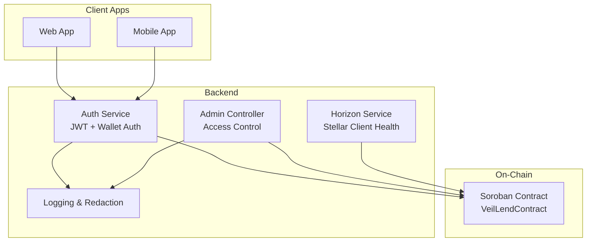
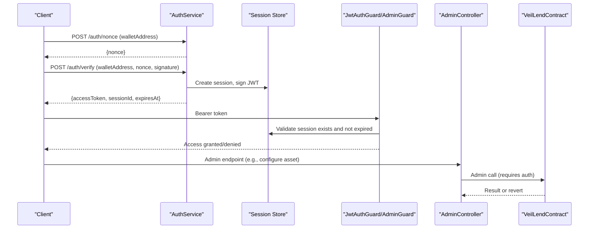
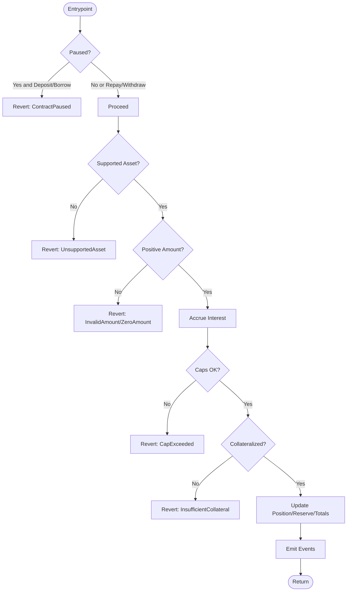
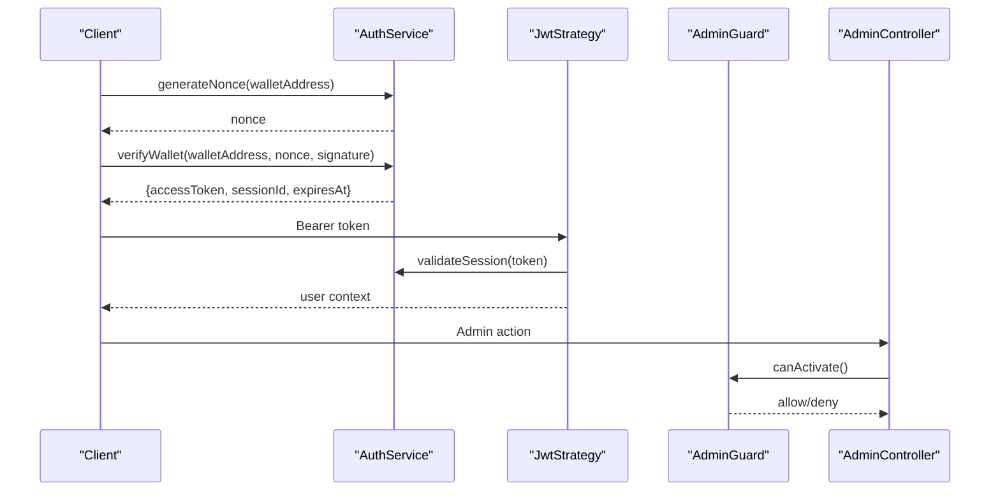
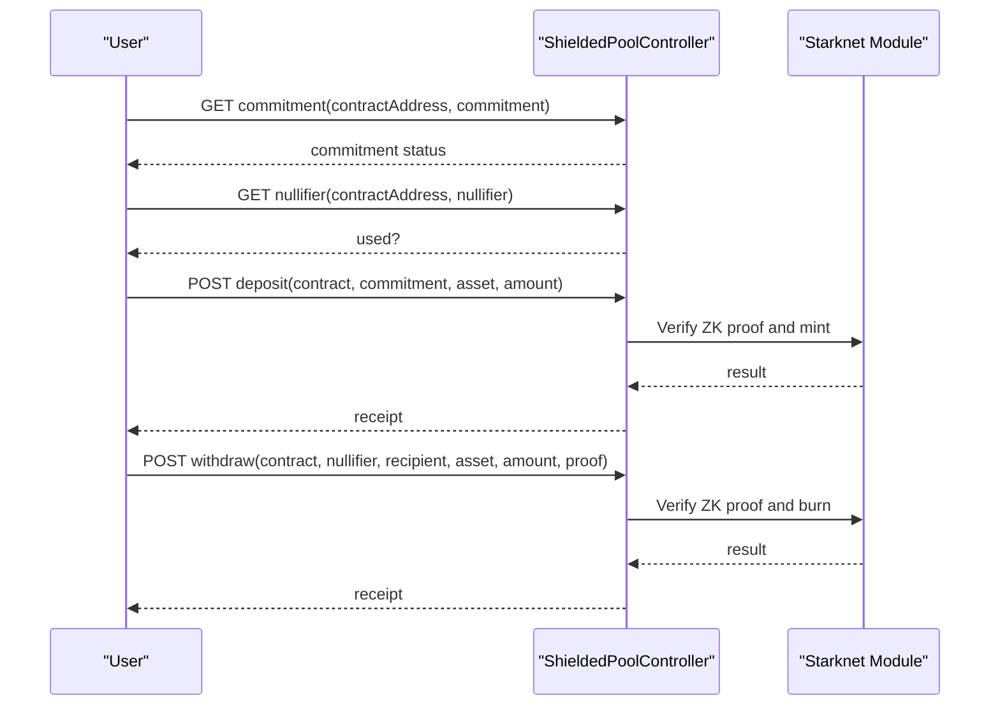
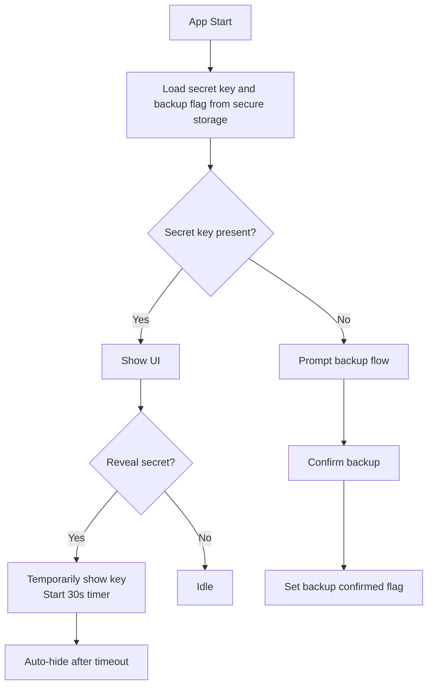
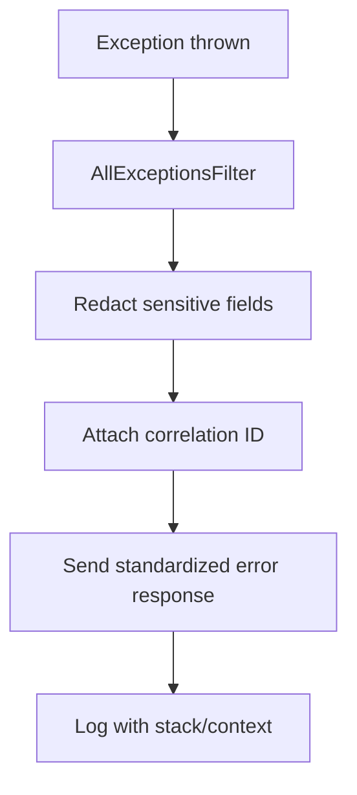
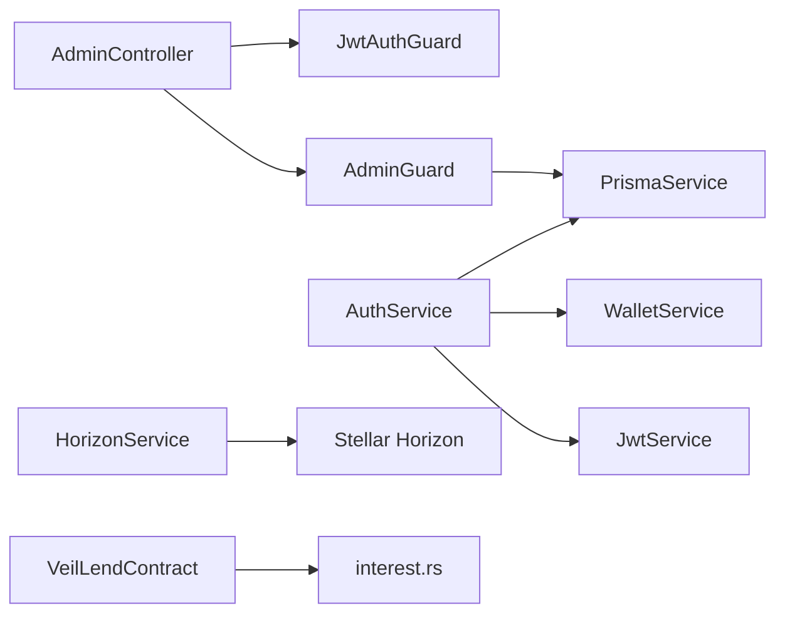

# Security Considerations

<cite>
**Referenced Files in This Document**
- [lib.rs](file://veilend-soroban/src/lib.rs)
- [auth.service.ts](file://veilend-backend/src/auth/auth.service.ts)
- [jwt.strategy.ts](file://veilend-backend/src/auth/jwt.strategy.ts)
- [admin.guard.ts](file://veilend-backend/src/auth/admin.guard.ts)
- [admin.controller.ts](file://veilend-backend/src/admin/admin.controller.ts)
- [horizon.service.ts](file://veilend-backend/src/stellar/horizon.service.ts)
- [redact.util.ts](file://veilend-backend/src/common/logging/redact.util.ts)
- [all-exceptions.filter.ts](file://veilend-backend/src/common/logging/all-exceptions.filter.ts)
- [secureStoreShim.ts](file://veilend-mobile/src/utils/secureStoreShim.ts)
- [useWalletSecurity.ts](file://veilend-mobile/src/hooks/useWalletSecurity.ts)
</cite>

## Table of Contents
1. Introduction
2. Project Structure
3. Core Components
4. Architecture Overview
5. Detailed Component Analysis
6. Dependency Analysis
7. Performance Considerations
8. Troubleshooting Guide
9. Conclusion
10. Appendices

## Introduction
This document provides comprehensive security documentation for the VeilLend protocol, covering smart contract security, application security, and privacy protections. It explains access control mechanisms in smart contracts (admin privileges, role-based permissions, input validation), authentication and authorization systems (JWT-based sessions, wallet-based authentication, admin guards), and privacy measures (privacy mode, zero-knowledge proof integration, secure data handling). It also includes vulnerability assessment procedures, audit processes, incident response protocols, common threats, mitigations, and monitoring approaches for production deployments. Terminology aligns with the codebase: access control, authentication guards, privacy mode, and secure storage.

## Project Structure
VeilLend is a multi-component system:
- Smart contracts on Soroban implement core lending logic and access control.
- A NestJS backend provides API endpoints, JWT session management, and admin controls.
- Mobile and web clients handle wallet interactions and secure storage.
- Observability and logging ensure safe error responses and sensitive data redaction.

**Diagram sources**
- [auth.service.ts:1-203](file://veilend-backend/src/auth/auth.service.ts#L1-L203)
- [admin.controller.ts:1-56](file://veilend-backend/src/admin/admin.controller.ts#L1-L56)
- [horizon.service.ts:1-115](file://veilend-backend/src/stellar/horizon.service.ts#L1-L115)
- [lib.rs:226-719](file://veilend-soroban/src/lib.rs#L226-L719)

**Section sources**
- [auth.service.ts:1-203](file://veilend-backend/src/auth/auth.service.ts#L1-L203)
- [admin.controller.ts:1-56](file://veilend-backend/src/admin/admin.controller.ts#L1-L56)
- [horizon.service.ts:1-115](file://veilend-backend/src/stellar/horizon.service.ts#L1-L115)
- [lib.rs:226-719](file://veilend-soroban/src/lib.rs#L226-L719)

## Core Components
- Smart contract access control: Admin-only functions, asset support flags, circuit breaker pause state, collateral ratio enforcement, caps, and input validation.
- Backend authentication: Wallet nonce challenge-response, JWT issuance, session persistence, and session validation.
- Authorization guards: JWT guard and admin guard to restrict privileged endpoints.
- Privacy mode: Shielded pool interfaces for commitments, nullifiers, merkle roots, deposit/withdraw flows using zero-knowledge proofs.
- Secure storage: Mobile secure store shim and wallet secret key lifecycle with timers and clipboard hygiene.
- Observability: Global exception filter with sensitive data redaction and correlation IDs.

**Section sources**
- [lib.rs:242-468](file://veilend-soroban/src/lib.rs#L242-L468)
- [auth.service.ts:36-149](file://veilend-backend/src/auth/auth.service.ts#L36-L149)
- [jwt.strategy.ts:14-63](file://veilend-backend/src/auth/jwt.strategy.ts#L14-L63)
- [admin.guard.ts:24-45](file://veilend-backend/src/auth/admin.guard.ts#L24-L45)
- [secureStoreShim.ts:1-63](file://veilend-mobile/src/utils/secureStoreShim.ts#L1-L63)
- [useWalletSecurity.ts:1-166](file://veilend-mobile/src/hooks/useWalletSecurity.ts#L1-L166)
- [all-exceptions.filter.ts:13-56](file://veilend-backend/src/common/logging/all-exceptions.filter.ts#L13-L56)

## Architecture Overview
The security architecture enforces least privilege at every layer:
- On-chain: Only the stored admin can configure assets, set oracle prices, update caps, toggle pause, and record fees. All user operations require explicit signatures and validate inputs.
- Off-chain: Wallet-based authentication issues short-lived JWTs tied to server-side sessions; admin routes are protected by both JWT and admin guards.
- Privacy: Shielded pool endpoints expose ZK-friendly primitives (commitments, nullifiers, merkle proofs) for private deposits/withdrawals.
- Resilience: Circuit breaker pause prevents risky operations while allowing repay/withdraw; Horizon client health checks ensure Stellar connectivity.

**Diagram sources**
- [auth.service.ts:36-149](file://veilend-backend/src/auth/auth.service.ts#L36-L149)
- [jwt.strategy.ts:14-63](file://veilend-backend/src/auth/jwt.strategy.ts#L14-L63)
- [admin.controller.ts:20-55](file://veilend-backend/src/admin/admin.controller.ts#L20-L55)
- [lib.rs:260-331](file://veilend-soroban/src/lib.rs#L260-L331)

## Detailed Component Analysis

### Smart Contract Access Control and Input Validation
- Admin-only operations: Configure asset, set oracle price, update caps, toggle pause, record protocol fees. Each requires caller identity matching stored admin and explicit signature verification.
- Input validation: Positive amounts, supported assets, minimum collateral ratio enforced before borrow/withdraw, caps checked prior to mutations, paused state blocks deposits/borrows but allows repay/withdraw.
- Events: Comprehensive event emission for configuration changes, user actions, caps updates, circuit breaker state, and reserve updates for off-chain monitoring.

**Diagram sources**
- [lib.rs:483-639](file://veilend-soroban/src/lib.rs#L483-L639)
- [lib.rs:317-331](file://veilend-soroban/src/lib.rs#L317-L331)
- [lib.rs:356-395](file://veilend-soroban/src/lib.rs#L356-L395)
- [lib.rs:458-468](file://veilend-soroban/src/lib.rs#L458-L468)

**Section sources**
- [lib.rs:242-468](file://veilend-soroban/src/lib.rs#L242-L468)
- [lib.rs:483-639](file://veilend-soroban/src/lib.rs#L483-L639)

### Authentication and Authorization (Backend)
- Wallet-based authentication: Generate cryptographic nonce, persist with TTL, invalidate prior nonces, verify signature, create session and JWT, and validate sessions on each request.
- JWT strategy: Extract bearer token, verify against session store, enforce expiration, attach user context.
- Admin guard: Ensure authenticated user exists and is listed as an admin before allowing administrative actions.

**Diagram sources**
- [auth.service.ts:36-149](file://veilend-backend/src/auth/auth.service.ts#L36-L149)
- [jwt.strategy.ts:14-63](file://veilend-backend/src/auth/jwt.strategy.ts#L14-L63)
- [admin.guard.ts:24-45](file://veilend-backend/src/auth/admin.guard.ts#L24-L45)
- [admin.controller.ts:20-55](file://veilend-backend/src/admin/admin.controller.ts#L20-L55)

**Section sources**
- [auth.service.ts:36-149](file://veilend-backend/src/auth/auth.service.ts#L36-L149)
- [jwt.strategy.ts:14-63](file://veilend-backend/src/auth/jwt.strategy.ts#L14-L63)
- [admin.guard.ts:24-45](file://veilend-backend/src/auth/admin.guard.ts#L24-L45)
- [admin.controller.ts:20-55](file://veilend-backend/src/admin/admin.controller.ts#L20-L55)

### Privacy Mode (Shielded Pool Integration)
- Privacy mode exposes shielded pool endpoints for commitment queries, nullifier checks, merkle root retrieval, and private deposit/withdraw flows that rely on zero-knowledge proofs.
- These endpoints enable users to transact without exposing balances or transaction details on-chain via ZK primitives.

**Diagram sources**
- [shielded-pool.controller.ts:1-33](file://legacy/veilend-backend/src/shielded-pool/shielded-pool.controller.ts#L1-L33)
- [shielded-pool.module.ts:1-12](file://legacy/veilend-backend/src/shielded-pool/shielded-pool.module.ts#L1-L12)

**Section sources**
- [shielded-pool.controller.ts:1-33](file://legacy/veilend-backend/src/shielded-pool/shielded-pool.controller.ts#L1-L33)
- [shielded-pool.module.ts:1-12](file://legacy/veilend-backend/src/shielded-pool/shielded-pool.module.ts#L1-L12)

### Secure Storage and Wallet Key Management (Mobile)
- Secure storage: A secure store shim abstracts platform-specific secure storage, enabling development-time persistence and production-grade secure storage via expo-secure-store.
- Wallet security hook: Manages secret key retrieval, temporary reveal with timer, backup confirmation flag, and clipboard hygiene to minimize exposure risk.

**Diagram sources**
- [secureStoreShim.ts:1-63](file://veilend-mobile/src/utils/secureStoreShim.ts#L1-L63)
- [useWalletSecurity.ts:1-166](file://veilend-mobile/src/hooks/useWalletSecurity.ts#L1-L166)

**Section sources**
- [secureStoreShim.ts:1-63](file://veilend-mobile/src/utils/secureStoreShim.ts#L1-L63)
- [useWalletSecurity.ts:1-166](file://veilend-mobile/src/hooks/useWalletSecurity.ts#L1-L166)

### Observability and Error Handling
- Global exception filter: Normalizes error responses, attaches correlation IDs, and redacts sensitive fields from error payloads to prevent leakage.
- Logging utilities: Centralized redaction rules for tokens, secrets, signatures, nonces, and authorization headers across logs and responses.

**Diagram sources**
- [all-exceptions.filter.ts:13-56](file://veilend-backend/src/common/logging/all-exceptions.filter.ts#L13-L56)
- [redact.util.ts:1-56](file://veilend-backend/src/common/logging/redact.util.ts#L1-L56)

**Section sources**
- [all-exceptions.filter.ts:13-56](file://veilend-backend/src/common/logging/all-exceptions.filter.ts#L13-L56)
- [redact.util.ts:1-56](file://veilend-backend/src/common/logging/redact.util.ts#L1-L56)

## Dependency Analysis
- The admin controller depends on JWT and admin guards to protect privileged endpoints.
- The auth service depends on wallet signing verification, Prisma session storage, and JWT issuance.
- The Horizon service provides a healthy connection check to Stellar network services.
- The smart contract depends on internal interest accrual logic and emits events consumed by off-chain indexers.

**Diagram sources**
- [admin.controller.ts:20-55](file://veilend-backend/src/admin/admin.controller.ts#L20-L55)
- [admin.guard.ts:24-45](file://veilend-backend/src/auth/admin.guard.ts#L24-L45)
- [auth.service.ts:23-27](file://veilend-backend/src/auth/auth.service.ts#L23-L27)
- [horizon.service.ts:17-33](file://veilend-backend/src/stellar/horizon.service.ts#L17-L33)
- [lib.rs:782-800](file://veilend-soroban/src/lib.rs#L782-L800)

**Section sources**
- [admin.controller.ts:20-55](file://veilend-backend/src/admin/admin.controller.ts#L20-L55)
- [auth.service.ts:23-27](file://veilend-backend/src/auth/auth.service.ts#L23-L27)
- [horizon.service.ts:17-33](file://veilend-backend/src/stellar/horizon.service.ts#L17-L33)
- [lib.rs:782-800](file://veilend-soroban/src/lib.rs#L782-L800)

## Performance Considerations
- Minimize redundant accrual calls by batching interest accrual within entrypoints; the contract already accrues once per operation where needed.
- Use read-only simulation methods for balance queries to avoid unnecessary state writes.
- Monitor Horizon client health to avoid blocking requests on external failures; degrade gracefully when unavailable.
- Keep JWT lifetimes short and leverage server-side session revocation to reduce attack surface.

[No sources needed since this section provides general guidance]

## Troubleshooting Guide
- Unauthorized errors:
  - Missing or invalid nonce: Request a fresh nonce and retry within TTL.
  - Expired nonce: Nonce reuse or expiry triggers rejection; request new nonce.
  - Invalid signature: Ensure correct wallet signing over the nonce.
  - Session revoked/expired: Re-authenticate to obtain a new session.
- Admin access denied:
  - Not an admin: Ensure wallet address is registered as admin in the database.
  - Missing JWT: Include valid bearer token in requests.
- Contract errors:
  - Contract paused: Wait for admin to unpause or use allowed operations (repay/withdraw).
  - Unsupported asset: Configure asset as supported by admin first.
  - Insufficient collateral: Increase deposit or reduce borrow amount.
  - Caps exceeded: Admin must adjust caps or wait for utilization to decrease.
- External dependencies:
  - Horizon connectivity: Check health endpoint and network configuration; retries may be necessary.

**Section sources**
- [auth.service.ts:70-149](file://veilend-backend/src/auth/auth.service.ts#L70-L149)
- [jwt.strategy.ts:35-63](file://veilend-backend/src/auth/jwt.strategy.ts#L35-L63)
- [admin.guard.ts:28-45](file://veilend-backend/src/auth/admin.guard.ts#L28-L45)
- [lib.rs:317-331](file://veilend-soroban/src/lib.rs#L317-L331)
- [lib.rs:458-468](file://veilend-soroban/src/lib.rs#L458-L468)
- [horizon.service.ts:49-71](file://veilend-backend/src/stellar/horizon.service.ts#L49-L71)

## Conclusion
VeilLend implements robust security across layers:
- Smart contracts enforce strict access control, input validation, and circuit breakers.
- Backend authentication uses wallet-based challenges with JWT sessions and admin guards for privileged operations.
- Privacy mode supports zero-knowledge transactions through shielded pool endpoints.
- Secure storage and careful handling of secrets mitigate client-side risks.
- Observability ensures safe error responses and sensitive data redaction.
Adhering to these practices and monitoring recommendations will help maintain a secure production environment.

[No sources needed since this section summarizes without analyzing specific files]

## Appendices

### Vulnerability Assessment Procedures
- Static analysis: Run Soroban toolchain checks and linting for Rust code; review contract logic for reentrancy-like patterns and integer overflows.
- Dynamic testing: Execute unit and integration tests for contract entrypoints; simulate edge cases around caps, collateral ratios, and pause states.
- API security: Validate all DTOs with whitelist validation; ensure no sensitive fields leak in responses; test auth guards and admin guards thoroughly.
- Secret management: Rotate JWT secrets regularly; ensure environment variables are injected securely; verify secure storage usage in mobile builds.

**Section sources**
- [admin.controller.ts:20-55](file://veilend-backend/src/admin/admin.controller.ts#L20-L55)
- [auth.service.ts:36-149](file://veilend-backend/src/auth/auth.service.ts#L36-L149)
- [lib.rs:242-468](file://veilend-soroban/src/lib.rs#L242-L468)

### Security Audit Processes
- Code review checklist:
  - Access control: Confirm admin checks and require_auth usage in all privileged functions.
  - Input validation: Verify positive amounts, supported assets, collateral constraints, and cap checks.
  - Events: Ensure critical state changes emit events for off-chain monitoring.
- Third-party audits: Engage auditors to review contract logic, backend auth flows, and ZK integration points.
- Post-deployment monitoring: Track events for anomalies (caps breaches, pause toggles, unexpected fee accruals).

**Section sources**
- [lib.rs:147-224](file://veilend-soroban/src/lib.rs#L147-L224)
- [admin.controller.ts:20-55](file://veilend-backend/src/admin/admin.controller.ts#L20-L55)

### Incident Response Protocols
- Pause contract immediately if suspicious activity detected; allow repay/withdraw to protect users.
- Revoke compromised sessions via session deletion; force re-authentication.
- Investigate Horizon connectivity issues; switch endpoints if necessary.
- Redact sensitive information in logs and responses; preserve correlation IDs for tracing.

**Section sources**
- [lib.rs:458-468](file://veilend-soroban/src/lib.rs#L458-L468)
- [auth.service.ts:187-201](file://veilend-backend/src/auth/auth.service.ts#L187-L201)
- [horizon.service.ts:49-71](file://veilend-backend/src/stellar/horizon.service.ts#L49-L71)
- [all-exceptions.filter.ts:13-56](file://veilend-backend/src/common/logging/all-exceptions.filter.ts#L13-L56)

### Common Threats and Mitigations
- Replay attacks: Nonce one-time-use and expiry protection.
- Privilege escalation: Admin guards and on-chain admin checks.
- Data leakage: Redaction of sensitive fields in logs and error responses.
- Wallet compromise: Short-lived sessions, secure storage, and temporary key reveal with auto-hide timers.
- Oracle manipulation: Admin-only oracle price setting with validation; monitor for unusual price updates.

**Section sources**
- [auth.service.ts:36-149](file://veilend-backend/src/auth/auth.service.ts#L36-L149)
- [admin.guard.ts:24-45](file://veilend-backend/src/auth/admin.guard.ts#L24-L45)
- [redact.util.ts:1-56](file://veilend-backend/src/common/logging/redact.util.ts#L1-L56)
- [useWalletSecurity.ts:74-105](file://veilend-mobile/src/hooks/useWalletSecurity.ts#L74-L105)
- [lib.rs:317-331](file://veilend-soroban/src/lib.rs#L317-L331)

### Monitoring Approaches for Production
- Event-driven monitoring: Subscribe to contract events (asset configured, deposit/borrow/repay/withdraw, caps updated, circuit breaker, reserve updates).
- Health checks: Periodically validate Horizon connectivity and log failures.
- Session metrics: Track active sessions, expirations, and revocations to detect anomalies.
- Error tracking: Capture correlation IDs and redacted error details for rapid triage.

**Section sources**
- [lib.rs:147-224](file://veilend-soroban/src/lib.rs#L147-L224)
- [horizon.service.ts:49-71](file://veilend-backend/src/stellar/horizon.service.ts#L49-L71)
- [auth.service.ts:156-182](file://veilend-backend/src/auth/auth.service.ts#L156-L182)
- [all-exceptions.filter.ts:13-56](file://veilend-backend/src/common/logging/all-exceptions.filter.ts#L13-L56)