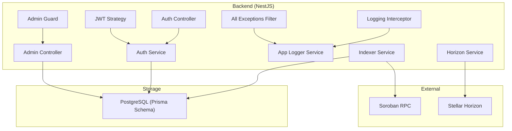
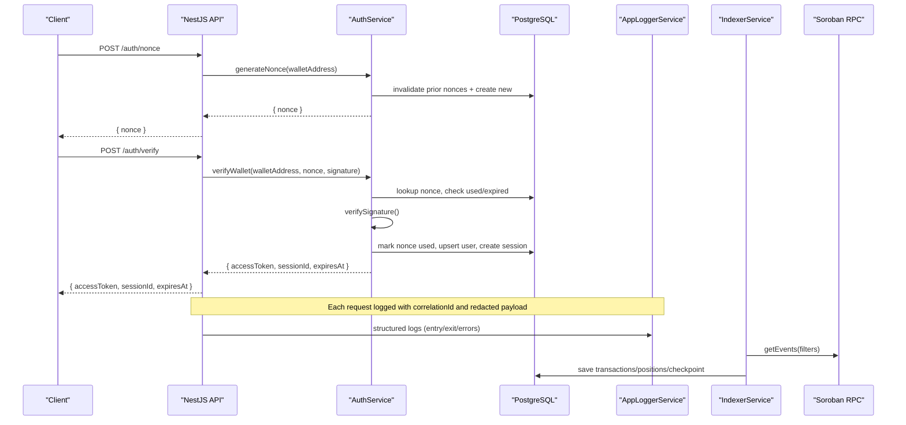
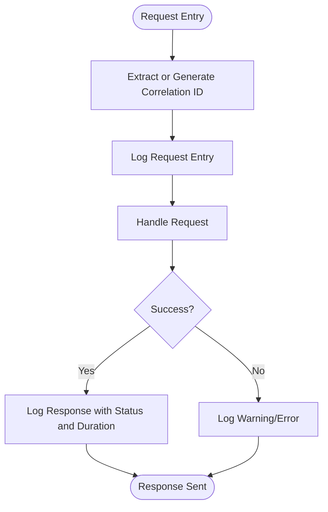
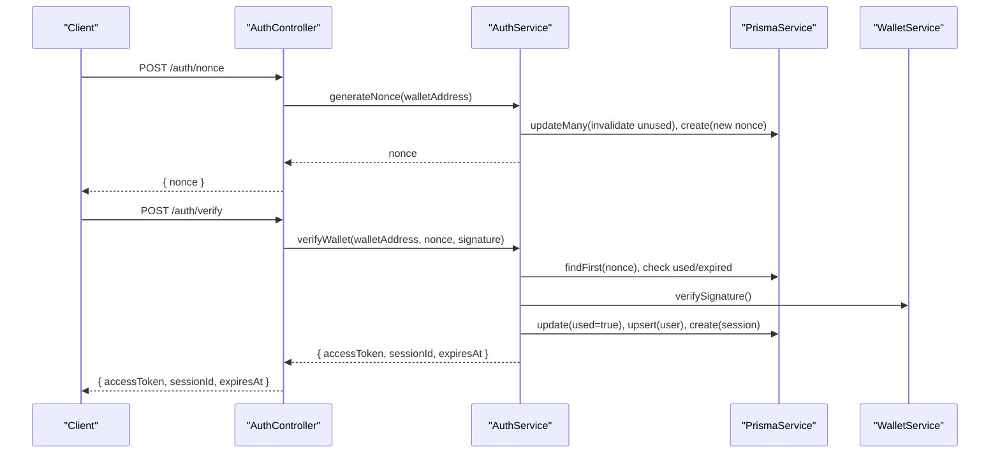
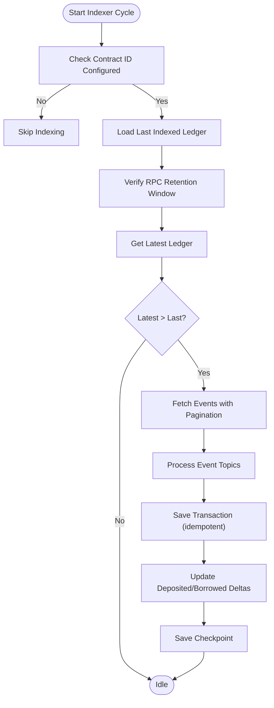
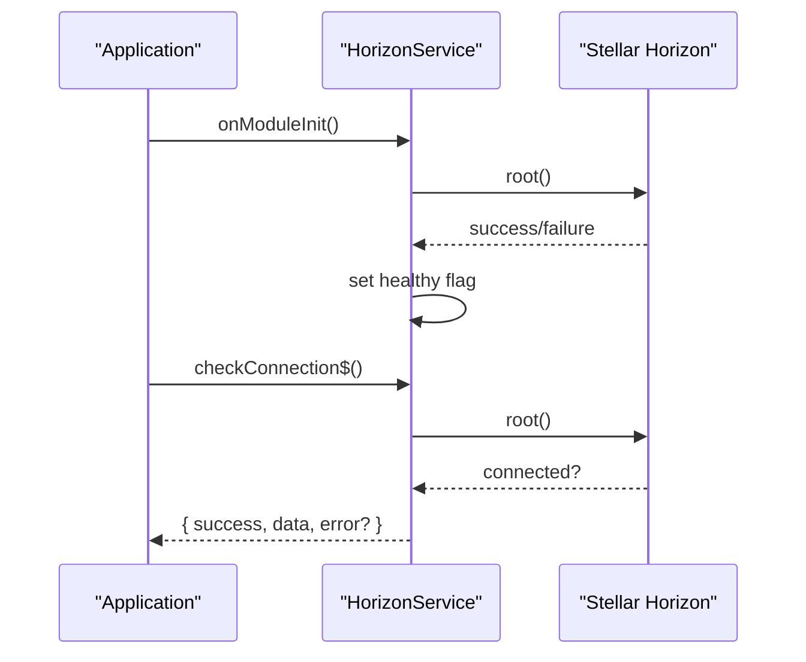
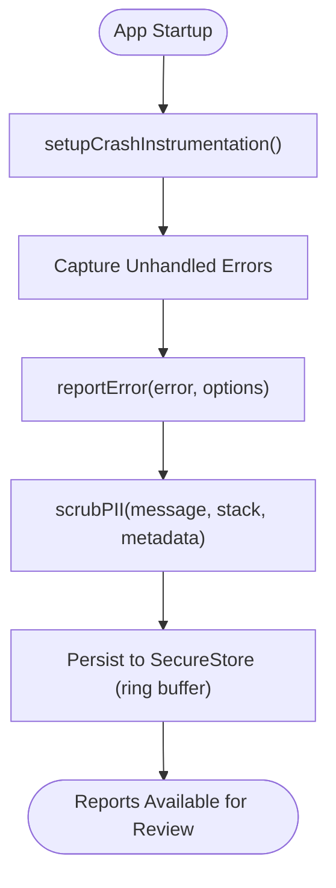
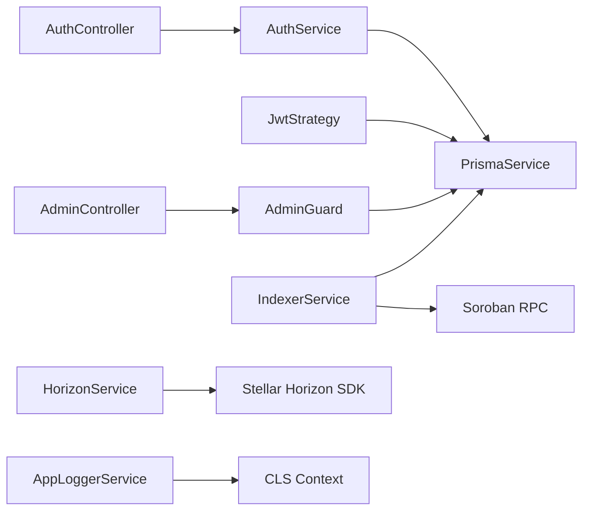

# Security Monitoring and Incident Response

<cite>
**Referenced Files in This Document**
- [app-logger.service.ts](file://veilend-backend/src/common/logging/app-logger.service.ts)
- [correlation-id.util.ts](file://veilend-backend/src/common/logging/correlation-id.util.ts)
- [logging.interceptor.ts](file://veilend-backend/src/common/logging/logging.interceptor.ts)
- [all-exceptions.filter.ts](file://veilend-backend/src/common/logging/all-exceptions.filter.ts)
- [redact.util.ts](file://veilend-backend/src/common/logging/redact.util.ts)
- [auth.controller.ts](file://veilend-backend/src/auth/auth.controller.ts)
- [auth.service.ts](file://veilend-backend/src/auth/auth.service.ts)
- [jwt.strategy.ts](file://veilend-backend/src/auth/jwt.strategy.ts)
- [admin.guard.ts](file://veilend-backend/src/auth/admin.guard.ts)
- [admin.controller.ts](file://veilend-backend/src/admin/admin.controller.ts)
- [indexer.service.ts](file://veilend-backend/src/indexer/indexer.service.ts)
- [horizon.service.ts](file://veilend-backend/src/stellar/horizon.service.ts)
- [schema.prisma](file://veilend-backend/prisma/schema.prisma)
- [errorReporting.ts](file://veilend-mobile/src/utils/errorReporting.ts)
</cite>

## Table of Contents
1. Introduction
2. Project Structure
3. Core Components
4. Architecture Overview
5. Detailed Component Analysis
6. Dependency Analysis
7. Performance Considerations
8. Troubleshooting Guide
9. Conclusion
10. Appendices

## Introduction
This document provides a comprehensive security monitoring and incident response guide for the VeilLend project. It covers threat detection, structured logging with correlation IDs, exception handling and error reporting, monitoring of suspicious activities, alerting strategies, automated response triggers, incident response procedures for smart contract exploits, API abuse, and data breaches, forensic analysis and evidence preservation, compliance and audit logging, and security metrics collection and dashboards for production environments.

## Project Structure
The backend is a NestJS application with:
- Centralized structured logging with correlation IDs and PII redaction
- Authentication via wallet-signed nonces and JWT sessions
- Admin-only endpoints protected by role-based guards
- A background indexer that ingests Soroban events into a read model
- Horizon client health monitoring for Stellar network connectivity
- Mobile app error reporting with PII scrubbing and secure local storage

**Diagram sources**
- [auth.controller.ts:14-58](file://veilend-backend/src/auth/auth.controller.ts#L14-L58)
- [auth.service.ts:19-203](file://veilend-backend/src/auth/auth.service.ts#L19-L203)
- [jwt.strategy.ts:14-65](file://veilend-backend/src/auth/jwt.strategy.ts#L14-L65)
- [admin.guard.ts:24-47](file://veilend-backend/src/auth/admin.guard.ts#L24-L47)
- [admin.controller.ts:20-55](file://veilend-backend/src/admin/admin.controller.ts#L20-L55)
- [logging.interceptor.ts:12-41](file://veilend-backend/src/common/logging/logging.interceptor.ts#L12-L41)
- [app-logger.service.ts:5-49](file://veilend-backend/src/common/logging/app-logger.service.ts#L5-L49)
- [all-exceptions.filter.ts:13-57](file://veilend-backend/src/common/logging/all-exceptions.filter.ts#L13-L57)
- [indexer.service.ts:16-314](file://veilend-backend/src/indexer/indexer.service.ts#L16-L314)
- [horizon.service.ts:8-115](file://veilend-backend/src/stellar/horizon.service.ts#L8-L115)
- [schema.prisma:1-197](file://veilend-backend/prisma/schema.prisma#L1-L197)

**Section sources**
- [auth.controller.ts:14-58](file://veilend-backend/src/auth/auth.controller.ts#L14-L58)
- [auth.service.ts:19-203](file://veilend-backend/src/auth/auth.service.ts#L19-L203)
- [logging.interceptor.ts:12-41](file://veilend-backend/src/common/logging/logging.interceptor.ts#L12-L41)
- [app-logger.service.ts:5-49](file://veilend-backend/src/common/logging/app-logger.service.ts#L5-L49)
- [all-exceptions.filter.ts:13-57](file://veilend-backend/src/common/logging/all-exceptions.filter.ts#L13-L57)
- [indexer.service.ts:16-314](file://veilend-backend/src/indexer/indexer.service.ts#L16-L314)
- [horizon.service.ts:8-115](file://veilend-backend/src/stellar/horizon.service.ts#L8-L115)
- [schema.prisma:1-197](file://veilend-backend/prisma/schema.prisma#L1-L197)

## Core Components
- Structured Logging and Correlation IDs:
  - AppLoggerService writes JSON logs with timestamp, level, context, correlationId, message, and optional trace. Sensitive fields are redacted before serialization.
  - Correlation ID extraction supports incoming headers and generates a UUID when missing.
  - LoggingInterceptor logs request entry/exit and errors with timing.
  - AllExceptionsFilter centralizes error responses and logs unhandled exceptions with correlationId included in response metadata.
  - Redaction utility scrubs sensitive keys and Bearer tokens from log payloads.

- Authentication and Session Management:
  - AuthController exposes nonce generation, verification, session retrieval, and logout.
  - AuthService implements replay protection via one-time nonces, expiry checks, signature verification, and session creation/validation.
  - JwtStrategy validates JWTs and ensures sessions exist and are not revoked or expired.
  - AdminGuard enforces admin-only access on administrative endpoints.

- On-Chain Event Indexing:
  - IndexerService polls Soroban RPC for contract events, persists transactions and positions, updates checkpoints, and handles pagination and health checks.

- Network Health Monitoring:
  - HorizonService initializes and validates connection to Stellar Horizon, tracks health state, and exposes observable connection checks.

- Mobile Error Reporting:
  - errorReporting.ts provides structured error reports with severity classification, PII scrubbing, and secure local ring buffer storage.

**Section sources**
- [app-logger.service.ts:5-49](file://veilend-backend/src/common/logging/app-logger.service.ts#L5-L49)
- [correlation-id.util.ts:1-25](file://veilend-backend/src/common/logging/correlation-id.util.ts#L1-L25)
- [logging.interceptor.ts:12-41](file://veilend-backend/src/common/logging/logging.interceptor.ts#L12-L41)
- [all-exceptions.filter.ts:13-57](file://veilend-backend/src/common/logging/all-exceptions.filter.ts#L13-L57)
- [redact.util.ts:1-56](file://veilend-backend/src/common/logging/redact.util.ts#L1-L56)
- [auth.controller.ts:14-58](file://veilend-backend/src/auth/auth.controller.ts#L14-L58)
- [auth.service.ts:19-203](file://veilend-backend/src/auth/auth.service.ts#L19-L203)
- [jwt.strategy.ts:14-65](file://veilend-backend/src/auth/jwt.strategy.ts#L14-L65)
- [admin.guard.ts:24-47](file://veilend-backend/src/auth/admin.guard.ts#L24-L47)
- [indexer.service.ts:16-314](file://veilend-backend/src/indexer/indexer.service.ts#L16-L314)
- [horizon.service.ts:8-115](file://veilend-backend/src/stellar/horizon.service.ts#L8-L115)
- [errorReporting.ts:1-279](file://veilend-mobile/src/utils/errorReporting.ts#L1-L279)

## Architecture Overview
The system integrates authentication, authorization, structured logging, and on-chain event indexing with robust error handling and monitoring. Requests flow through interceptors and filters that capture correlation IDs and emit structured logs. Authentication uses wallet signatures and JWTs with server-side session validation. Administrative actions are restricted via guards. Background indexing maintains read models from Soroban events, while Horizon connectivity is monitored.

**Diagram sources**
- [auth.controller.ts:20-36](file://veilend-backend/src/auth/auth.controller.ts#L20-L36)
- [auth.service.ts:36-149](file://veilend-backend/src/auth/auth.service.ts#L36-L149)
- [app-logger.service.ts:29-47](file://veilend-backend/src/common/logging/app-logger.service.ts#L29-L47)
- [indexer.service.ts:48-171](file://veilend-backend/src/indexer/indexer.service.ts#L48-L171)
- [schema.prisma:12-42](file://veilend-backend/prisma/schema.prisma#L12-L42)

## Detailed Component Analysis

### Structured Logging and Correlation IDs
- AppLoggerService:
  - Writes JSON logs with correlationId from CLS context; redacts sensitive fields; includes timestamps and levels.
- Correlation ID Utility:
  - Extracts x-correlation-id or x-request-id if valid UUID; otherwise generates a new UUID.
- Logging Interceptor:
  - Logs HTTP method, URL, status code, and duration; logs warnings on errors.
- All Exceptions Filter:
  - Captures unhandled exceptions, logs them with stack traces, returns standardized error responses including correlationId in metadata.
- Redaction Utility:
  - Scrubs sensitive keys (passwords, tokens, signatures, etc.) and Bearer tokens from objects and strings.

**Diagram sources**
- [correlation-id.util.ts:14-24](file://veilend-backend/src/common/logging/correlation-id.util.ts#L14-L24)
- [logging.interceptor.ts:16-39](file://veilend-backend/src/common/logging/logging.interceptor.ts#L16-L39)
- [app-logger.service.ts:29-47](file://veilend-backend/src/common/logging/app-logger.service.ts#L29-L47)

**Section sources**
- [app-logger.service.ts:5-49](file://veilend-backend/src/common/logging/app-logger.service.ts#L5-L49)
- [correlation-id.util.ts:1-25](file://veilend-backend/src/common/logging/correlation-id.util.ts#L1-L25)
- [logging.interceptor.ts:12-41](file://veilend-backend/src/common/logging/logging.interceptor.ts#L12-L41)
- [all-exceptions.filter.ts:13-57](file://veilend-backend/src/common/logging/all-exceptions.filter.ts#L13-L57)
- [redact.util.ts:1-56](file://veilend-backend/src/common/logging/redact.util.ts#L1-L56)

### Authentication and Authorization
- AuthController:
  - Provides endpoints for nonce generation, verification, session retrieval, and logout.
- AuthService:
  - Implements nonce lifecycle management, replay protection, signature verification, session creation/validation, and revocation.
- JwtStrategy:
  - Validates bearer tokens and verifies session existence and expiration.
- AdminGuard:
  - Ensures only admins can perform administrative operations.

**Diagram sources**
- [auth.controller.ts:20-58](file://veilend-backend/src/auth/auth.controller.ts#L20-L58)
- [auth.service.ts:36-149](file://veilend-backend/src/auth/auth.service.ts#L36-L149)
- [jwt.strategy.ts:35-63](file://veilend-backend/src/auth/jwt.strategy.ts#L35-L63)
- [admin.guard.ts:28-45](file://veilend-backend/src/auth/admin.guard.ts#L28-L45)

**Section sources**
- [auth.controller.ts:14-58](file://veilend-backend/src/auth/auth.controller.ts#L14-L58)
- [auth.service.ts:19-203](file://veilend-backend/src/auth/auth.service.ts#L19-L203)
- [jwt.strategy.ts:14-65](file://veilend-backend/src/auth/jwt.strategy.ts#L14-L65)
- [admin.guard.ts:24-47](file://veilend-backend/src/auth/admin.guard.ts#L24-L47)

### On-Chain Event Indexing and Read Models
- IndexerService:
  - Polls Soroban RPC for contract events, processes topics, saves transactions and positions, updates checkpoints, and handles pagination and health checks.
- Data Model:
  - TransactionHistory and Position tables store on-chain activity and derived balances, enabling fast queries and risk metrics.

**Diagram sources**
- [indexer.service.ts:48-171](file://veilend-backend/src/indexer/indexer.service.ts#L48-L171)
- [schema.prisma:109-154](file://veilend-backend/prisma/schema.prisma#L109-L154)

**Section sources**
- [indexer.service.ts:16-314](file://veilend-backend/src/indexer/indexer.service.ts#L16-L314)
- [schema.prisma:109-154](file://veilend-backend/prisma/schema.prisma#L109-L154)

### Network Health Monitoring
- HorizonService:
  - Initializes Horizon client, validates connection asynchronously, tracks health state, and exposes observable checks for integration with monitoring systems.

**Diagram sources**
- [horizon.service.ts:17-71](file://veilend-backend/src/stellar/horizon.service.ts#L17-L71)
- [horizon.service.ts:91-113](file://veilend-backend/src/stellar/horizon.service.ts#L91-L113)

**Section sources**
- [horizon.service.ts:8-115](file://veilend-backend/src/stellar/horizon.service.ts#L8-L115)

### Mobile Error Reporting
- errorReporting.ts:
  - Classifies severity, creates structured reports with PII scrubbing, stores in SecureStore ring buffer, and installs global handlers for crashes and unhandled rejections.

**Diagram sources**
- [errorReporting.ts:248-267](file://veilend-mobile/src/utils/errorReporting.ts#L248-L267)
- [errorReporting.ts:147-211](file://veilend-mobile/src/utils/errorReporting.ts#L147-L211)

**Section sources**
- [errorReporting.ts:1-279](file://veilend-mobile/src/utils/errorReporting.ts#L1-L279)

## Dependency Analysis
Key dependencies and relationships:
- Auth flows depend on PrismaSession and User models for token validation and revocation.
- Admin endpoints depend on AdminGuard and Admin model for authorization.
- Indexer depends on Soroban RPC and writes to TransactionHistory and Position models.
- Logging components depend on CLS for correlation IDs and write structured JSON to stdout.
- HorizonService depends on Stellar Horizon SDK for connectivity checks.

**Diagram sources**
- [auth.controller.ts:14-58](file://veilend-backend/src/auth/auth.controller.ts#L14-L58)
- [auth.service.ts:19-203](file://veilend-backend/src/auth/auth.service.ts#L19-L203)
- [jwt.strategy.ts:14-65](file://veilend-backend/src/auth/jwt.strategy.ts#L14-L65)
- [admin.guard.ts:24-47](file://veilend-backend/src/auth/admin.guard.ts#L24-L47)
- [admin.controller.ts:20-55](file://veilend-backend/src/admin/admin.controller.ts#L20-L55)
- [indexer.service.ts:16-314](file://veilend-backend/src/indexer/indexer.service.ts#L16-L314)
- [horizon.service.ts:8-115](file://veilend-backend/src/stellar/horizon.service.ts#L8-L115)
- [app-logger.service.ts:5-49](file://veilend-backend/src/common/logging/app-logger.service.ts#L5-L49)

**Section sources**
- [auth.controller.ts:14-58](file://veilend-backend/src/auth/auth.controller.ts#L14-L58)
- [auth.service.ts:19-203](file://veilend-backend/src/auth/auth.service.ts#L19-L203)
- [jwt.strategy.ts:14-65](file://veilend-backend/src/auth/jwt.strategy.ts#L14-L65)
- [admin.guard.ts:24-47](file://veilend-backend/src/auth/admin.guard.ts#L24-L47)
- [admin.controller.ts:20-55](file://veilend-backend/src/admin/admin.controller.ts#L20-L55)
- [indexer.service.ts:16-314](file://veilend-backend/src/indexer/indexer.service.ts#L16-L314)
- [horizon.service.ts:8-115](file://veilend-backend/src/stellar/horizon.service.ts#L8-L115)
- [app-logger.service.ts:5-49](file://veilend-backend/src/common/logging/app-logger.service.ts#L5-L49)

## Performance Considerations
- Use correlation IDs to avoid excessive log volume per request; ensure structured logs are consumed by a log aggregator for efficient querying.
- Indexer pagination limits and checkpointing prevent redundant processing and reduce RPC load.
- Nonce invalidation and atomic marking minimize race conditions during high concurrency.
- Horizon health checks run asynchronously to avoid blocking startup; periodic checks should be scheduled to detect outages promptly.
- Mobile error reports are stored in a bounded ring buffer to limit storage growth and maintain performance.

[No sources needed since this section provides general guidance]

## Troubleshooting Guide
Common issues and remediation steps:
- Authentication failures:
  - Unknown or expired nonces result in unauthorized or gone responses; users must request a fresh nonce.
  - Revoked or expired sessions return unauthorized; clients should refresh tokens or re-authenticate.
- Indexer stalls:
  - If last indexed ledger falls behind RPC retention window, the indexer adjusts to the oldest available ledger; monitor logs for warnings and ensure RPC availability.
- Horizon connectivity:
  - Connection failures are logged; use health checks to surface outages and trigger alerts.
- Exception handling:
  - Unhandled exceptions are captured with correlation IDs and stacks; inspect logs to identify root causes and include correlationId in support tickets.

**Section sources**
- [auth.service.ts:70-149](file://veilend-backend/src/auth/auth.service.ts#L70-L149)
- [jwt.strategy.ts:35-63](file://veilend-backend/src/auth/jwt.strategy.ts#L35-L63)
- [indexer.service.ts:74-104](file://veilend-backend/src/indexer/indexer.service.ts#L74-L104)
- [horizon.service.ts:49-71](file://veilend-backend/src/stellar/horizon.service.ts#L49-L71)
- [all-exceptions.filter.ts:20-55](file://veilend-backend/src/common/logging/all-exceptions.filter.ts#L20-L55)

## Conclusion
VeilLend implements robust security monitoring and incident response capabilities through structured logging with correlation IDs, centralized exception handling, strong authentication and authorization controls, on-chain event indexing, and network health monitoring. The mobile app complements backend efforts with secure error reporting and PII scrubbing. These foundations enable effective threat detection, alerting, automated responses, and forensic analysis aligned with compliance requirements.

[No sources needed since this section summarizes without analyzing specific files]

## Appendices

### Alerting Strategies and Automated Response Triggers
- Failed Authentication Attempts:
  - Monitor logs for UnauthorizedException patterns correlated by correlationId; trigger alerts when thresholds exceed baseline.
- Unusual Transaction Patterns:
  - Detect spikes in deposit/borrow/repay/withdraw events via indexer logs and transaction history; alert on anomalous volumes or rapid position changes.
- Potential Attack Vectors:
  - Watch for repeated nonce requests, signature verification failures, and admin endpoint misuse; enforce rate limiting and alert on anomalies.
- Automated Responses:
  - Temporarily throttle or block suspicious IPs/wallet addresses based on alert rules.
  - Pause indexing or restrict admin endpoints upon critical alerts until investigation completes.

[No sources needed since this section provides general guidance]

### Incident Response Procedures
- Smart Contract Exploits:
  - Immediately pause protocol operations via admin endpoints if available; freeze affected assets; notify stakeholders; preserve logs and on-chain evidence.
  - Analyze indexer logs and transaction history to reconstruct exploit timeline using correlationIds and txHashes.
- API Abuse:
  - Identify abusive patterns via logs and correlationIds; implement temporary blocks; review auth flows and guards; rotate secrets if compromised.
- Data Breaches:
  - Isolate affected services; preserve logs and database snapshots; assess exposure scope; notify regulators and users per compliance obligations.

[No sources needed since this section provides general guidance]

### Forensic Analysis and Evidence Preservation
- Preserve structured logs with correlationIds and timestamps for request tracing across services.
- Export transaction history and positions for affected users; retain Soroban event IDs and ledger sequences.
- Maintain chain-of-custody for logs and database exports; hash artifacts for integrity verification.

[No sources needed since this section provides general guidance]

### Compliance and Audit Logging
- Ensure all sensitive fields are redacted in logs to protect PII and secrets.
- Include correlationIds in error responses for traceability and audit trails.
- Maintain immutable logs and database records for regulatory audits; configure retention policies aligned with compliance requirements.

[No sources needed since this section provides general guidance]

### Security Metrics and Dashboards
- Collect metrics:
  - Authentication failure rates, session revocations, nonce usage patterns.
  - Indexer throughput, checkpoint lag, RPC health status.
  - Horizon connectivity uptime and error rates.
- Dashboard setup:
  - Visualize trends for failed authentications, unusual transaction volumes, and indexer performance.
  - Alert thresholds for anomalies; integrate with notification channels for rapid response.

[No sources needed since this section provides general guidance]