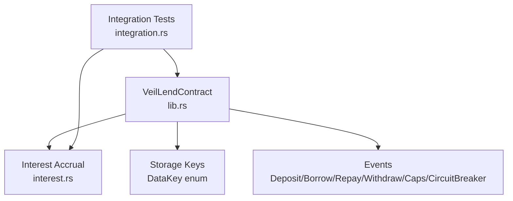
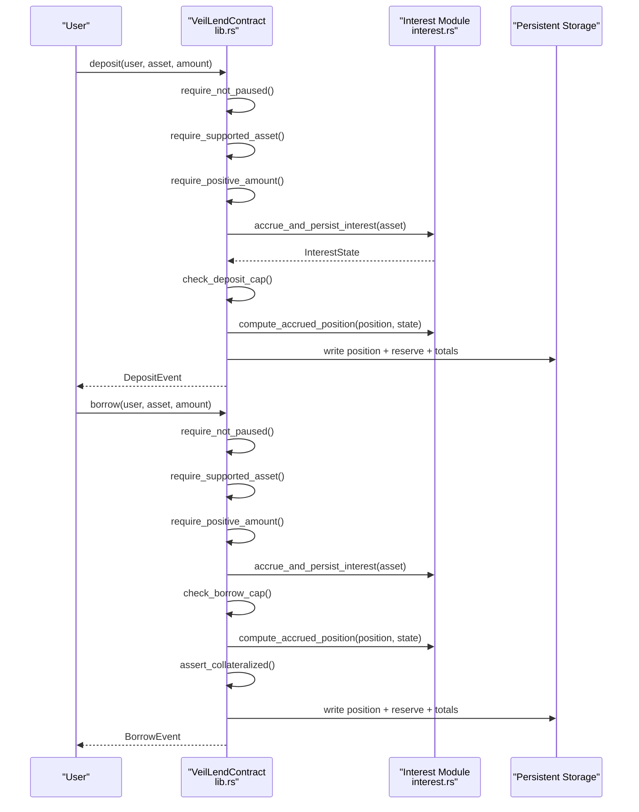
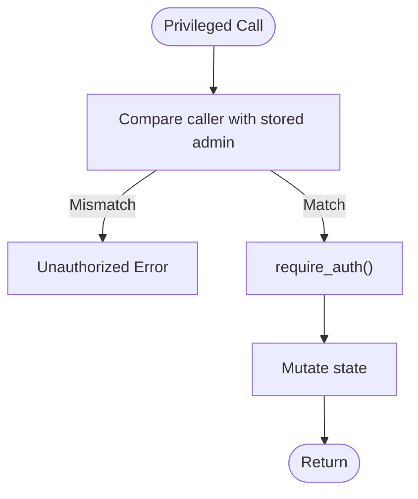
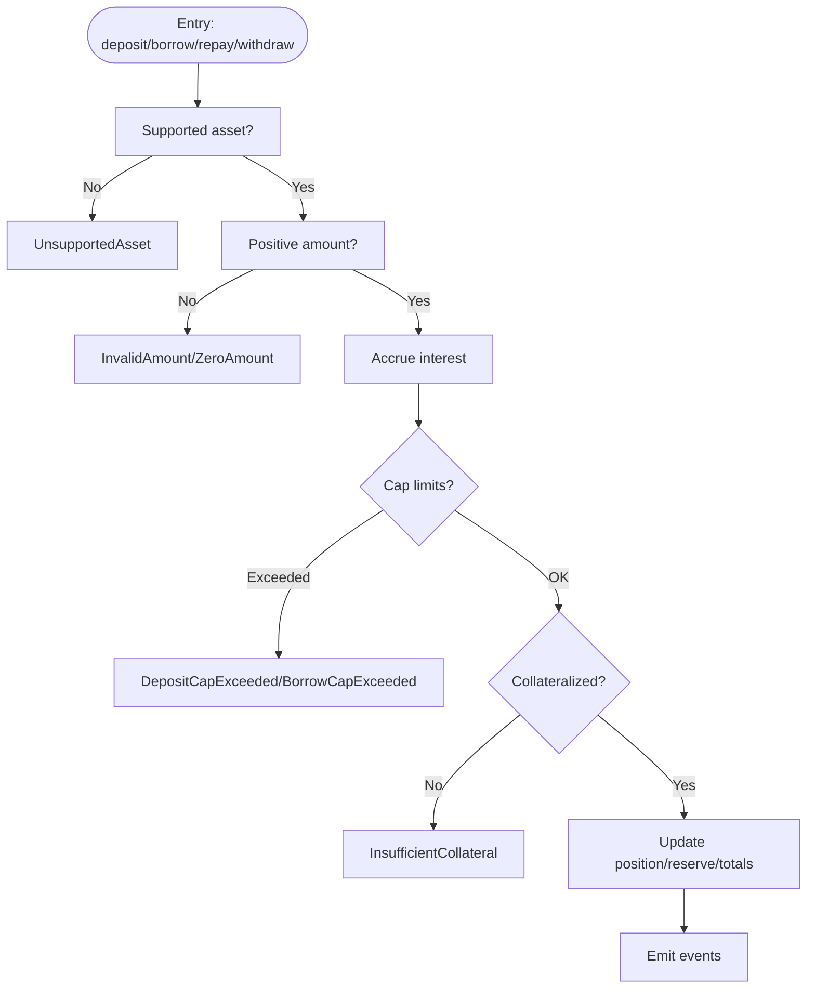
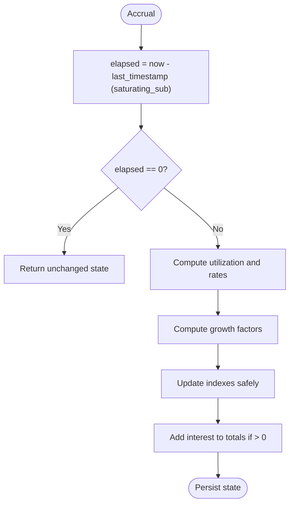
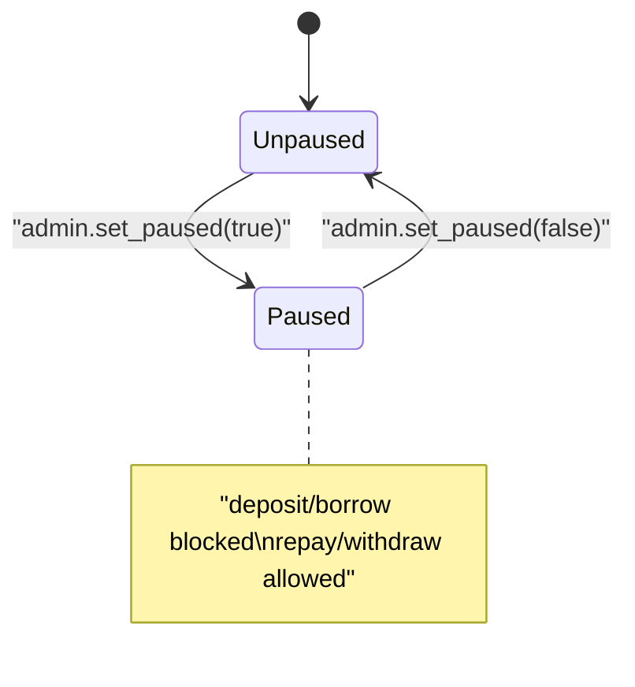
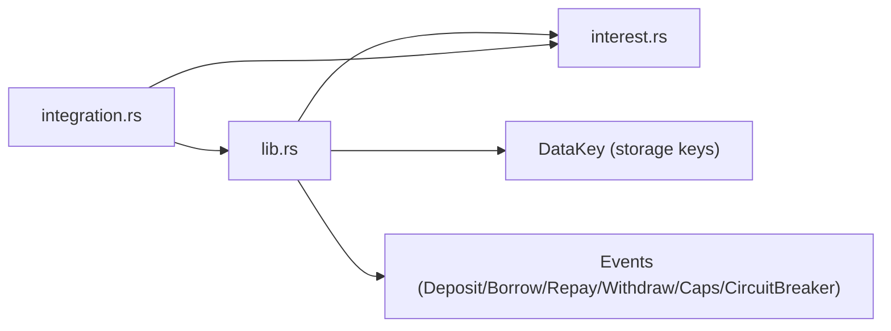

# Smart Contract Security

<cite>
**Referenced Files in This Document**
- [lib.rs](file://veilend-soroban/src/lib.rs)
- [interest.rs](file://veilend-soroban/src/interest.rs)
- [integration.rs](file://veilend-soroban/tests/integration.rs)
</cite>

## Table of Contents
1. Introduction
2. Project Structure
3. Core Components
4. Architecture Overview
5. Detailed Component Analysis
6. Dependency Analysis
7. Performance Considerations
8. Troubleshooting Guide
9. Conclusion
10. Appendices

## Introduction
This document provides a comprehensive smart contract security analysis for the VeilLend protocol implemented as Soroban contracts. It focuses on access control, input validation and sanitization, reentrancy protection, state consistency guarantees, overflow/underflow safeguards via fixed-point arithmetic, emergency pause (circuit breaker), audit procedures, vulnerability assessment methodologies, testing strategies, and operational guidance for secure development, deployment verification, and ongoing monitoring.

## Project Structure
The VeilLend Soroban contract is implemented in Rust with two primary modules:
- lib.rs: Main contract logic including storage schema, admin controls, user-facing operations (deposit, borrow, repay, withdraw), caps, oracle price management, circuit breaker, and interest accrual orchestration.
- interest.rs: Time-based interest accrual math using fixed-point arithmetic and index snapshots to realize per-position accrued balances.

Tests are provided in integration.rs to validate core flows such as initialization, asset configuration, caps enforcement, circuit breaker behavior, interest accrual idempotency, and conservation of value between suppliers and borrowers.

**Diagram sources**
- [lib.rs:226-719](file://veilend-soroban/src/lib.rs#L226-L719)
- [interest.rs:1-120](file://veilend-soroban/src/interest.rs#L1-L120)
- [integration.rs:1-461](file://veilend-soroban/tests/integration.rs#L1-L461)

**Section sources**
- [lib.rs:1-145](file://veilend-soroban/src/lib.rs#L1-L145)
- [interest.rs:1-22](file://veilend-soroban/src/interest.rs#L1-L22)
- [integration.rs:1-40](file://veilend-soroban/tests/integration.rs#L1-L40)

## Core Components
- Access Control: Admin-only functions for initialization, asset configuration, oracle price updates, cap updates, fee recording, and circuit breaker toggling. All privileged calls enforce caller identity and require authentication.
- Input Validation: Positive amount checks, supported asset checks, collateral ratio enforcement, reserve sufficiency checks, and cap validations before any state mutation.
- Reentrancy Protection: No external callouts or token transfers within mutating entrypoints; all state changes occur atomically within a single transaction context.
- State Consistency: Interest accrual is applied prior to balance mutations and cap checks; totals and positions are updated together with events emitted for observability.
- Overflow/Underflow Safeguards: Fixed-point arithmetic with i128 and explicit bounds checks; saturating subtraction for time deltas; validated caps prevent unsafe growth paths.
- Emergency Pause: Circuit breaker blocks new deposits and borrows while allowing repay and withdraw to reduce risk exposure.

**Section sources**
- [lib.rs:242-331](file://veilend-soroban/src/lib.rs#L242-L331)
- [lib.rs:356-420](file://veilend-soroban/src/lib.rs#L356-L420)
- [lib.rs:450-479](file://veilend-soroban/src/lib.rs#L450-L479)
- [lib.rs:483-639](file://veilend-soroban/src/lib.rs#L483-L639)
- [lib.rs:835-934](file://veilend-soroban/src/lib.rs#L835-L934)
- [interest.rs:51-87](file://veilend-soroban/src/interest.rs#L51-L87)

## Architecture Overview
The contract exposes a set of entrypoints that enforce authorization, validate inputs, accrue interest, check caps and collateral, update positions and reserves atomically, and emit events. Interest accrual uses time-based indexes to compute per-position accrued balances without touching each position until it is accessed.

**Diagram sources**
- [lib.rs:483-561](file://veilend-soroban/src/lib.rs#L483-L561)
- [lib.rs:792-827](file://veilend-soroban/src/lib.rs#L792-L827)
- [interest.rs:51-87](file://veilend-soroban/src/interest.rs#L51-L87)

## Detailed Component Analysis

### Access Control and Authorization
- Admin Privileges: Initialization, configure_asset, set_oracle_price, update_asset_caps, record_protocol_fee, and set_paused require the stored admin address and enforce authentication via require_auth. Unauthorized callers trigger an explicit error.
- Role-Based Permissions: Only the admin can modify protocol parameters and toggle the circuit breaker. Users authenticate themselves for deposit, borrow, repay, and withdraw.
- Function Authorization Patterns: Each privileged function compares the provided admin against the stored admin and then requires auth before mutating state.

**Diagram sources**
- [lib.rs:260-331](file://veilend-soroban/src/lib.rs#L260-L331)
- [lib.rs:356-395](file://veilend-soroban/src/lib.rs#L356-L395)
- [lib.rs:686-704](file://veilend-soroban/src/lib.rs#L686-L704)
- [lib.rs:450-468](file://veilend-soroban/src/lib.rs#L450-L468)

**Section sources**
- [lib.rs:242-331](file://veilend-soroban/src/lib.rs#L242-L331)
- [lib.rs:356-395](file://veilend-soroban/src/lib.rs#L356-L395)
- [lib.rs:686-704](file://veilend-soroban/src/lib.rs#L686-L704)
- [lib.rs:450-468](file://veilend-soroban/src/lib.rs#L450-L468)

### Input Validation and Sanitization
- Supported Asset Checks: All user-facing operations validate that the asset is supported before proceeding.
- Positive Amounts: Zero and negative amounts are rejected with distinct errors to aid diagnostics.
- Collateral Ratio Enforcement: Borrow and withdraw operations ensure post-operation collateralization relative to oracle prices and minimum collateral ratio.
- Reserve Sufficiency: Borrow and withdraw verify sufficient reserve balance to prevent overdraw.
- Caps Enforcement: Per-asset deposit and borrow caps are enforced before updating totals.

**Diagram sources**
- [lib.rs:483-639](file://veilend-soroban/src/lib.rs#L483-L639)
- [lib.rs:835-934](file://veilend-soroban/src/lib.rs#L835-L934)

**Section sources**
- [lib.rs:835-934](file://veilend-soroban/src/lib.rs#L835-L934)

### Reentrancy Protection and Atomicity
- No External Calls: The contract does not invoke external contracts or transfer tokens within its entrypoints, eliminating reentrancy attack surfaces.
- Atomic State Updates: Position, reserve, and totals are updated within a single transaction context; failures abort all changes.
- Idempotent Accrual: Interest accrual is idempotent when timestamps do not advance, preventing duplicate accruals.

**Section sources**
- [lib.rs:792-827](file://veilend-soroban/src/lib.rs#L792-L827)
- [integration.rs:424-461](file://veilend-soroban/tests/integration.rs#L424-L461)

### State Consistency Guarantees
- Pre-Accrual Checks: Interest is accrued before cap checks and balance mutations so caps and totals reflect up-to-date values.
- Conservation of Value: Interest paid by borrowers equals interest credited to suppliers in aggregate under the model’s assumptions, verified by tests.
- Snapshot Realization: Per-position balances are realized against current indexes and snapshots are re-anchored on touch.

**Section sources**
- [lib.rs:483-561](file://veilend-soroban/src/lib.rs#L483-L561)
- [interest.rs:89-120](file://veilend-soroban/src/interest.rs#L89-L120)
- [integration.rs:381-421](file://veilend-soroban/tests/integration.rs#L381-L421)

### Overflow/Underflow Protection and Fixed-Point Arithmetic
- Fixed-Point Scale: Interest rates and indexes use a fixed-point scale constant to represent fractional growth safely with i128.
- Safe Math Practices: Saturating subtraction for elapsed time; explicit checks for zero/negative amounts; division by non-zero scales; bounded utilization calculations.
- Cap Guards: Caps prevent unbounded growth paths that could lead to overflow scenarios.

**Diagram sources**
- [interest.rs:51-87](file://veilend-soroban/src/interest.rs#L51-L87)

**Section sources**
- [interest.rs:1-22](file://veilend-soroban/src/interest.rs#L1-L22)
- [interest.rs:51-87](file://veilend-soroban/src/interest.rs#L51-L87)
- [lib.rs:835-934](file://veilend-soroban/src/lib.rs#L835-L934)

### Emergency Pause (Circuit Breaker)
- Activation: Admin toggles pause state; paused state blocks deposit and borrow but allows repay and withdraw to reduce exposure.
- Events: Circuit breaker state changes emit events for monitoring and off-chain alerting.
- Default State: Initialized as not paused.

**Diagram sources**
- [lib.rs:450-479](file://veilend-soroban/src/lib.rs#L450-L479)

**Section sources**
- [lib.rs:450-479](file://veilend-soroban/src/lib.rs#L450-L479)
- [integration.rs:85-146](file://veilend-soroban/tests/integration.rs#L85-L146)

### Common Vulnerabilities and Mitigations
- Integer Overflow/Underflow: Mitigated by i128 fixed-point arithmetic, saturating operations, and explicit bounds checks.
- Access Control Bypasses: Enforced via stored admin comparison and require_auth on all privileged functions.
- Logic Errors: Validated through comprehensive integration tests covering caps, collateral ratios, accrual idempotency, and conservation of value.
- Oracle Manipulation Risk: Oracle price must be set by admin; missing price triggers explicit errors for collateral checks.

**Section sources**
- [lib.rs:242-331](file://veilend-soroban/src/lib.rs#L242-L331)
- [lib.rs:835-934](file://veilend-soroban/src/lib.rs#L835-L934)
- [integration.rs:219-246](file://veilend-soroban/tests/integration.rs#L219-L246)

## Dependency Analysis
The contract module depends on the interest accrual module for rate computation and position realization. Storage keys define the persistent layout used across functions.

**Diagram sources**
- [lib.rs:1-145](file://veilend-soroban/src/lib.rs#L1-L145)
- [interest.rs:1-22](file://veilend-soroban/src/interest.rs#L1-L22)
- [integration.rs:1-40](file://veilend-soroban/tests/integration.rs#L1-L40)

**Section sources**
- [lib.rs:1-145](file://veilend-soroban/src/lib.rs#L1-L145)
- [interest.rs:1-22](file://veilend-soroban/src/interest.rs#L1-L22)
- [integration.rs:1-40](file://veilend-soroban/tests/integration.rs#L1-L40)

## Performance Considerations
- Interest Accrual Efficiency: Accrual computes aggregate growth once per asset and applies to totals; per-position accrual occurs only on position touch, minimizing writes.
- Idempotency: Accrual is safe to call multiple times at the same timestamp without side effects.
- Event Emission: Events provide off-chain observability without impacting on-chain performance significantly.

[No sources needed since this section provides general guidance]

## Troubleshooting Guide
- Unauthorized Operations: Ensure the caller matches the stored admin and authenticates properly for privileged functions.
- Unsupported Assets: Configure assets before use; unsupported assets will reject operations.
- Insufficient Collateral: Verify oracle price is set and collateral ratio thresholds are met before borrowing or withdrawing.
- Caps Exceeded: Adjust per-asset caps or wait for reductions in totals via repay/withdraw.
- Contract Paused: If deposit/borrow fail due to pause, confirm circuit breaker status and coordinate with admin to unpause when safe.

**Section sources**
- [lib.rs:260-331](file://veilend-soroban/src/lib.rs#L260-L331)
- [lib.rs:356-420](file://veilend-soroban/src/lib.rs#L356-L420)
- [lib.rs:450-479](file://veilend-soroban/src/lib.rs#L450-L479)
- [lib.rs:835-934](file://veilend-soroban/src/lib.rs#L835-L934)

## Conclusion
VeilLend’s Soroban contracts implement robust security measures including strict access control, comprehensive input validation, reentrancy-safe design, consistent state updates with pre-accrual checks, and fixed-point arithmetic to mitigate overflow risks. The circuit breaker provides emergency pause functionality while preserving user ability to repay and withdraw. Integration tests validate critical behaviors such as caps enforcement, collateral checks, accrual idempotency, and conservation of value. These practices form a strong foundation for secure development, deployment verification, and ongoing monitoring.

[No sources needed since this section summarizes without analyzing specific files]

## Appendices

### Security Audit Procedures and Testing Strategies
- Unit and Integration Tests: Use integration tests to cover initialization, asset configuration, caps, circuit breaker, interest accrual, and conservation of value.
- Property-Based Assertions: Assert invariants like collateralization, cap limits, and conservation of value across varied scenarios.
- Event Verification: Confirm events are emitted for state changes to support off-chain monitoring and auditing.
- Fuzzing Inputs: Test edge cases for amounts, caps, and timestamps to ensure robustness.

**Section sources**
- [integration.rs:1-461](file://veilend-soroban/tests/integration.rs#L1-L461)

### Deployment Verification and Ongoing Monitoring
- Verify Admin and Parameters: Confirm admin address, min collateral ratio, and initial circuit breaker state post-deployment.
- Monitor Events: Track Deposit, Borrow, Repay, Withdraw, CapsUpdated, and CircuitBreaker events for anomalies.
- Oracle Price Management: Ensure oracle prices are set and updated regularly; missing prices block risky operations.
- Pause Response Plan: Establish procedures for activating/deactivating the circuit breaker based on monitored conditions.

**Section sources**
- [lib.rs:242-331](file://veilend-soroban/src/lib.rs#L242-L331)
- [lib.rs:450-479](file://veilend-soroban/src/lib.rs#L450-L479)