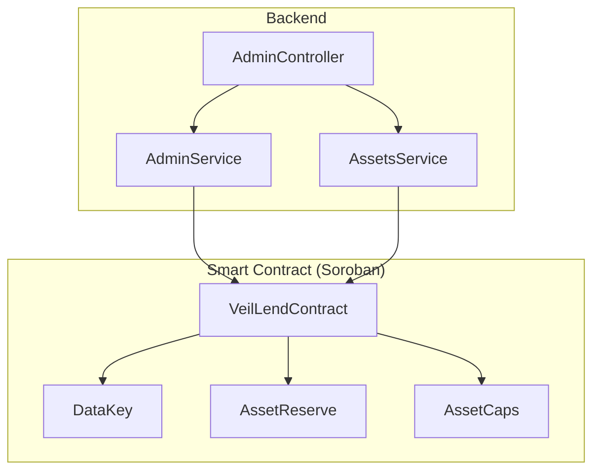
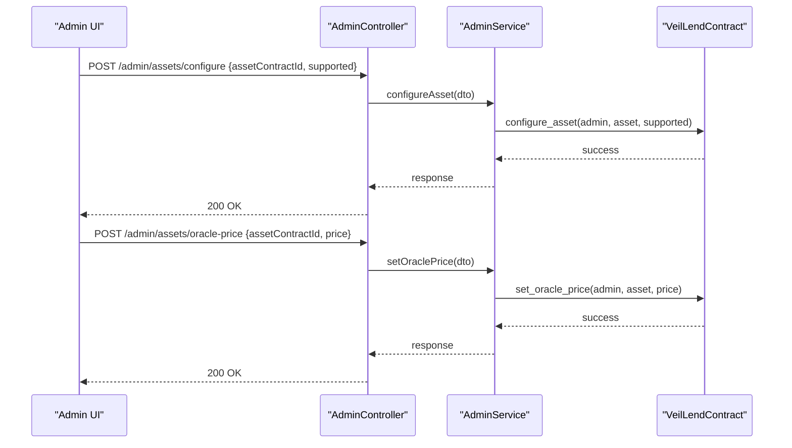
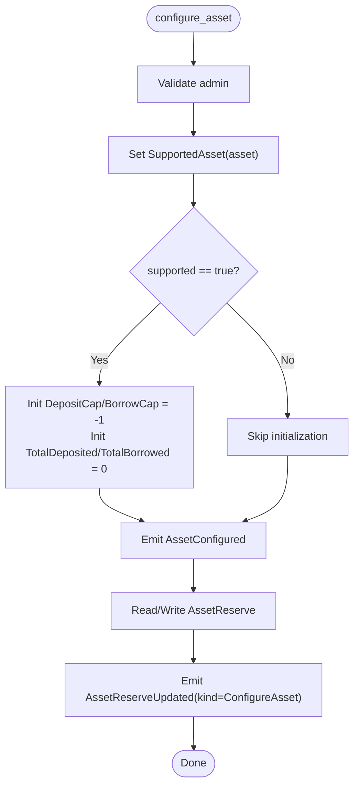
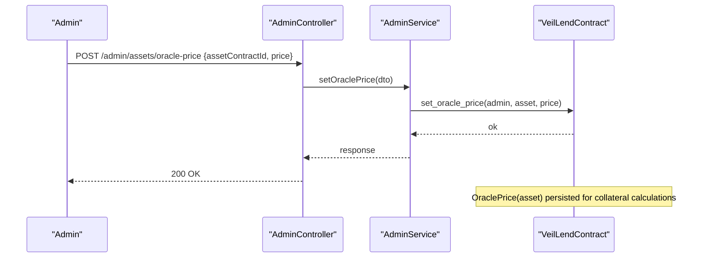
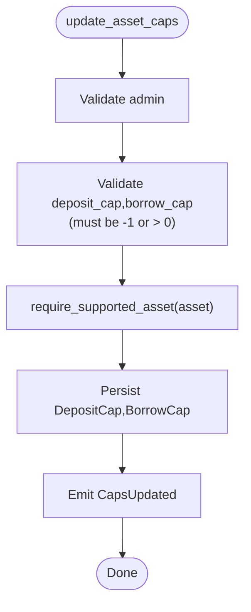
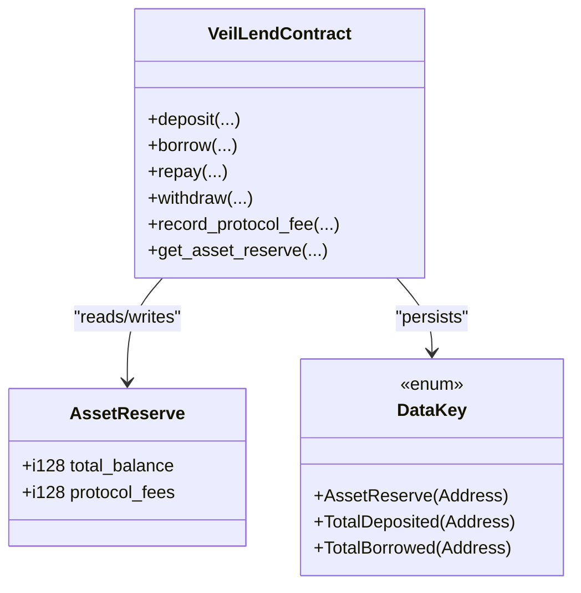
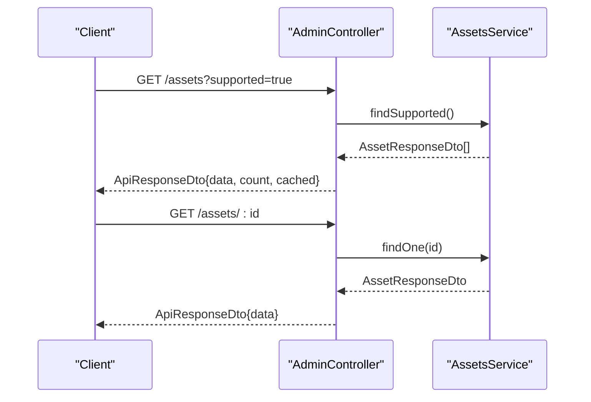
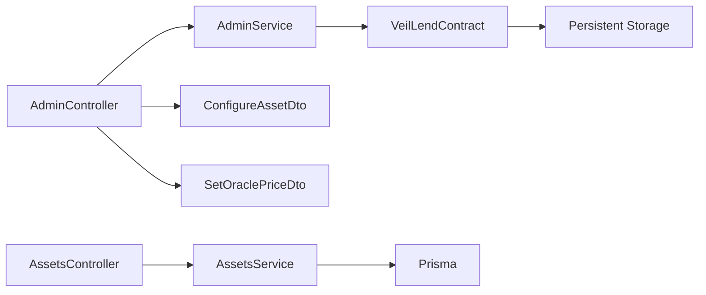

# Asset Management System

<cite>
**Referenced Files in This Document**
- [lib.rs](file://veilend-soroban/src/lib.rs)
- [admin.controller.ts](file://veilend-backend/src/admin/admin.controller.ts)
- [admin.service.ts](file://veilend-backend/src/admin/admin.service.ts)
- [configure-asset.dto.ts](file://veilend-backend/src/admin/dto/configure-asset.dto.ts)
- [set-oracle-price.dto.ts](file://veilend-backend/src/admin/dto/set-oracle-price.dto.ts)
- [assets.controller.ts](file://veilend-backend/src/assets/assets.controller.ts)
- [assets.service.ts](file://veilend-backend/src/assets/assets.service.ts)
- [price-oracle.service.ts](file://legacy/veilend-backend/src/price-oracle/price-oracle.service.ts)
</cite>

## Table of Contents
1. [Introduction](#introduction)
2. [Project Structure](#project-structure)
3. [Core Components](#core-components)
4. [Architecture Overview](#architecture-overview)
5. [Detailed Component Analysis](#detailed-component-analysis)
6. [Dependency Analysis](#dependency-analysis)
7. [Performance Considerations](#performance-considerations)
8. [Troubleshooting Guide](#troubleshooting-guide)
9. [Conclusion](#conclusion)
10. [Appendices](#appendices)

## Introduction
This document explains the asset management system for configuring supported assets, managing oracle prices, and enforcing per-asset caps. It covers both administrative workflows (for onboarding new assets and tuning risk parameters) and technical implementation details (for developers integrating with the protocol). The terminology used throughout aligns with the codebase: supported assets, oracle prices, caps, and reserves.

## Project Structure
The asset management system spans a Soroban smart contract and a NestJS backend:
- Smart contract (Soroban): Implements core logic for asset configuration, oracle price storage, cap enforcement, and reserve tracking.
- Backend (NestJS): Provides admin endpoints to configure assets and set oracle prices, plus read-only endpoints to list supported assets. A legacy price oracle service demonstrates how external oracles can be integrated.

**Diagram sources**
- [admin.controller.ts:20-55](file://veilend-backend/src/admin/admin.controller.ts#L20-L55)
- [admin.service.ts:30-55](file://veilend-backend/src/admin/admin.service.ts#L30-L55)
- [assets.controller.ts:16-58](file://veilend-backend/src/assets/assets.controller.ts#L16-L58)
- [assets.service.ts:15-91](file://veilend-backend/src/assets/assets.service.ts#L15-L91)
- [lib.rs:226-719](file://veilend-soroban/src/lib.rs#L226-L719)

**Section sources**
- [admin.controller.ts:20-55](file://veilend-backend/src/admin/admin.controller.ts#L20-L55)
- [assets.controller.ts:16-58](file://veilend-backend/src/assets/assets.controller.ts#L16-L58)
- [lib.rs:226-719](file://veilend-soroban/src/lib.rs#L226-L719)

## Core Components
- Supported assets: Assets registered as supported by an admin via configure_asset. When enabled, the system initializes per-asset totals and caps.
- Oracle prices: Admin-set prices stored per asset and used in collateral calculations.
- Caps: Per-asset deposit_cap and borrow_cap limits enforced at runtime; -1 means unlimited.
- Reserves: Per-asset AssetReserve tracks total_balance and protocol_fees, updated on deposits, borrows, repayments, withdrawals, fee accruals, and interest accruals.

Key data structures:
- AssetCaps: deposit_cap, borrow_cap
- AssetReserve: total_balance, protocol_fees
- DataKey: keys for SupportedAsset, OraclePrice, DepositCap, BorrowCap, TotalDeposited, TotalBorrowed, AssetReserve, etc.

**Section sources**
- [lib.rs:38-57](file://veilend-soroban/src/lib.rs#L38-L57)
- [lib.rs:81-93](file://veilend-soroban/src/lib.rs#L81-L93)
- [lib.rs:260-306](file://veilend-soroban/src/lib.rs#L260-L306)
- [lib.rs:317-344](file://veilend-soroban/src/lib.rs#L317-L344)
- [lib.rs:356-420](file://veilend-soroban/src/lib.rs#L356-L420)

## Architecture Overview
Administrators interact with the backend to configure assets and set oracle prices. The backend validates inputs and calls the smart contract to persist state. Users perform deposits and borrows subject to caps and collateral checks. Events are emitted for auditability and off-chain indexing.

**Diagram sources**
- [admin.controller.ts:41-49](file://veilend-backend/src/admin/admin.controller.ts#L41-L49)
- [admin.service.ts:30-46](file://veilend-backend/src/admin/admin.service.ts#L30-L46)
- [lib.rs:260-344](file://veilend-soroban/src/lib.rs#L260-L344)

## Detailed Component Analysis

### Asset Configuration Lifecycle
- configure_asset:
  - Authorizes admin, toggles SupportedAsset(asset), initializes caps and totals when enabling a new asset, emits AssetConfigured, and publishes AssetReserveUpdated for ConfigureAsset.
- get_total_deposited/get_total_borrowed:
  - Return cumulative totals per asset, updated on deposit/borrow/repay/withdraw flows.

**Diagram sources**
- [lib.rs:260-306](file://veilend-soroban/src/lib.rs#L260-L306)

**Section sources**
- [lib.rs:260-306](file://veilend-soroban/src/lib.rs#L260-L306)
- [lib.rs:422-448](file://veilend-soroban/src/lib.rs#L422-L448)

### Oracle Price Integration
- set_oracle_price:
  - Admin-only, validates positive price, persists OraclePrice(asset).
- get_oracle_price:
  - Returns Option<i128> for the asset’s oracle price if set.

**Diagram sources**
- [admin.controller.ts:46-49](file://veilend-backend/src/admin/admin.controller.ts#L46-L49)
- [admin.service.ts:39-46](file://veilend-backend/src/admin/admin.service.ts#L39-L46)
- [lib.rs:317-344](file://veilend-soroban/src/lib.rs#L317-L344)

**Section sources**
- [lib.rs:317-344](file://veilend-soroban/src/lib.rs#L317-L344)

### Per-Asset Cap Management
- update_asset_caps:
  - Admin-only, validates caps (-1 or positive), ensures asset is supported, persists DepositCap/BorrowCap, emits CapsUpdated.
- get_asset_caps:
  - Returns AssetCaps(deposit_cap, borrow_cap); defaults to -1 if not set.

**Diagram sources**
- [lib.rs:356-395](file://veilend-soroban/src/lib.rs#L356-L395)

**Section sources**
- [lib.rs:356-420](file://veilend-soroban/src/lib.rs#L356-L420)

### Reserves and Totals
- AssetReserve:
  - total_balance: net balance available for borrowing/withdrawals after accounting for positions and fees.
  - protocol_fees: accumulated fees recorded by admin.
- Totals:
  - TotalDeposited/TotalBorrowed track aggregate usage per asset and are updated on each relevant operation.

**Diagram sources**
- [lib.rs:88-93](file://veilend-soroban/src/lib.rs#L88-L93)
- [lib.rs:38-57](file://veilend-soroban/src/lib.rs#L38-L57)
- [lib.rs:483-639](file://veilend-soroban/src/lib.rs#L483-L639)
- [lib.rs:686-704](file://veilend-soroban/src/lib.rs#L686-L704)

**Section sources**
- [lib.rs:88-93](file://veilend-soroban/src/lib.rs#L88-L93)
- [lib.rs:483-639](file://veilend-soroban/src/lib.rs#L483-L639)
- [lib.rs:686-704](file://veilend-soroban/src/lib.rs#L686-L704)

### Backend API Surface
- Admin endpoints (JWT + Admin guard required):
  - POST /admin/assets/configure
    - Body: ConfigureAssetDto { assetContractId: string, supported: boolean }
    - Behavior: Persists supported status and initializes per-asset state when enabling.
  - POST /admin/assets/oracle-price
    - Body: SetOraclePriceDto { assetContractId: string, price: number }
    - Behavior: Sets oracle price for the asset (positive value).
  - POST /admin/protocol/min-collateral-ratio
    - Body: SetMinCollateralRatioDto
    - Behavior: Updates protocol-wide minimum collateral ratio.
- Read-only asset endpoints:
  - GET /assets?supported=true|false
    - Returns all or supported assets with caching headers.
  - GET /assets/:id
    - Returns a single asset by UUID, code, or contractId.

**Diagram sources**
- [assets.controller.ts:20-58](file://veilend-backend/src/assets/assets.controller.ts#L20-L58)
- [assets.service.ts:26-91](file://veilend-backend/src/assets/assets.service.ts#L26-L91)

**Section sources**
- [admin.controller.ts:20-55](file://veilend-backend/src/admin/admin.controller.ts#L20-L55)
- [assets.controller.ts:16-58](file://veilend-backend/src/assets/assets.controller.ts#L16-L58)
- [assets.service.ts:15-91](file://veilend-backend/src/assets/assets.service.ts#L15-L91)

## Dependency Analysis
- AdminController depends on AdminService and DTOs for validation.
- AdminService currently returns placeholder responses; integration should call VeilLendContract methods.
- AssetsController uses AssetsService which reads from Prisma and caches results.
- Smart contract exposes functions that enforce authorization, validate inputs, and emit events.

**Diagram sources**
- [admin.controller.ts:20-55](file://veilend-backend/src/admin/admin.controller.ts#L20-L55)
- [admin.service.ts:30-55](file://veilend-backend/src/admin/admin.service.ts#L30-L55)
- [assets.controller.ts:16-58](file://veilend-backend/src/assets/assets.controller.ts#L16-L58)
- [assets.service.ts:15-91](file://veilend-backend/src/assets/assets.service.ts#L15-L91)
- [lib.rs:226-719](file://veilend-soroban/src/lib.rs#L226-L719)

**Section sources**
- [admin.controller.ts:20-55](file://veilend-backend/src/admin/admin.controller.ts#L20-L55)
- [assets.controller.ts:16-58](file://veilend-backend/src/assets/assets.controller.ts#L16-L58)
- [lib.rs:226-719](file://veilend-soroban/src/lib.rs#L226-L719)

## Performance Considerations
- Caching: AssetsService caches asset listings in-memory with TTL to reduce database load.
- Event-driven updates: Off-chain indexers can listen to events (AssetConfigured, CapsUpdated, AssetReserveUpdated) to maintain read models without polling.
- Interest accrual: Accrue-and-persist pattern ensures caps and totals reflect time-based changes before mutations.

[No sources needed since this section provides general guidance]

## Troubleshooting Guide
Common errors and their causes:
- Unauthorized: Admin mismatch when calling configure_asset, set_oracle_price, update_asset_caps.
- InvalidAmount: Oracle price must be positive.
- UnsupportedAsset: Operations require the asset to be configured as supported.
- InsufficientCollateral: Borrow/withdraw would breach minimum collateral ratio.
- InsufficientDeposit/RepayTooLarge: Withdraw exceeds deposited balance; repay exceeds outstanding debt.
- ContractPaused: Deposits/borrows blocked while paused; repay/withdraw remain allowed.
- DepositCapExceeded/BorrowCapExceeded: Operation would exceed per-asset caps.
- InvalidCap: Caps must be -1 (unlimited) or positive.
- CircuitBreakerTriggered: Temporary pause triggered by risk controls.
- InsufficientReserve: Borrow/withdraw requires sufficient reserve balance.

Operational tips:
- Always ensure oracle prices are set before enabling borrowing against collateral.
- Use update_asset_caps to constrain exposure during market stress.
- Monitor AssetReserveUpdated events to track reserve health and fee accruals.

**Section sources**
- [lib.rs:107-145](file://veilend-soroban/src/lib.rs#L107-L145)
- [lib.rs:450-479](file://veilend-soroban/src/lib.rs#L450-L479)
- [lib.rs:483-639](file://veilend-soroban/src/lib.rs#L483-L639)

## Conclusion
The asset management system provides robust primitives for onboarding supported assets, setting oracle prices, and enforcing per-asset caps. Administrators use the backend to configure assets and manage risk parameters, while users interact with the smart contract to deposit, borrow, repay, and withdraw under strict validations. Events enable reliable off-chain monitoring and indexing.

[No sources needed since this section summarizes without analyzing specific files]

## Appendices

### API Reference Summary
- Admin endpoints (require JWT + Admin guard):
  - POST /admin/assets/configure
    - Request body: ConfigureAssetDto { assetContractId: string, supported: boolean }
    - Effect: Enables/disables supported asset; initializes caps/totals when enabling.
  - POST /admin/assets/oracle-price
    - Request body: SetOraclePriceDto { assetContractId: string, price: number }
    - Effect: Sets oracle price for the asset (must be positive).
  - POST /admin/protocol/min-collateral-ratio
    - Request body: SetMinCollateralRatioDto
    - Effect: Updates protocol-wide minimum collateral ratio.
- Read-only endpoints:
  - GET /assets?supported=true|false
    - Response: ApiResponseDto<AssetResponseDto[]> with cache headers.
  - GET /assets/:id
    - Response: ApiResponseDto<AssetResponseDto>.

**Section sources**
- [admin.controller.ts:20-55](file://veilend-backend/src/admin/admin.controller.ts#L20-L55)
- [configure-asset.dto.ts:1-10](file://veilend-backend/src/admin/dto/configure-asset.dto.ts#L1-L10)
- [set-oracle-price.dto.ts:1-10](file://veilend-backend/src/admin/dto/set-oracle-price.dto.ts#L1-L10)
- [assets.controller.ts:16-58](file://veilend-backend/src/assets/assets.controller.ts#L16-L58)

### Practical Workflows

- Onboard a new supported asset:
  1. Call POST /admin/assets/configure with supported=true.
  2. Set oracle price via POST /admin/assets/oracle-price.
  3. Optionally set caps via update_asset_caps (not exposed in current backend; implement contract call).
  4. Verify via GET /assets?supported=true.

- Enforce exposure limits:
  - Use update_asset_caps to set deposit_cap and borrow_cap for an asset.
  - Observe CapsUpdated event to confirm changes.

- Update oracle prices:
  - For single asset: POST /admin/assets/oracle-price.
  - For multiple assets: integrate with legacy PriceOracleService to batch updates if needed.

**Section sources**
- [admin.controller.ts:41-53](file://veilend-backend/src/admin/admin.controller.ts#L41-L53)
- [admin.service.ts:30-55](file://veilend-backend/src/admin/admin.service.ts#L30-L55)
- [price-oracle.service.ts:15-74](file://legacy/veilend-backend/src/price-oracle/price-oracle.service.ts#L15-L74)
- [lib.rs:356-420](file://veilend-soroban/src/lib.rs#L356-L420)

### Events
- AssetConfigured: Emitted when an asset’s supported status changes.
- CapsUpdated: Emitted when per-asset caps are updated.
- AssetReserveUpdated: Emitted on reserve changes (ConfigureAsset, Deposit, Borrow, Repay, Withdraw, FeeAccrual, InterestAccrual).

**Section sources**
- [lib.rs:147-155](file://veilend-soroban/src/lib.rs#L147-L155)
- [lib.rs:197-206](file://veilend-soroban/src/lib.rs#L197-L206)
- [lib.rs:216-224](file://veilend-soroban/src/lib.rs#L216-L224)