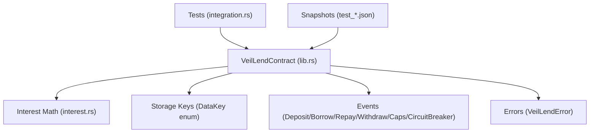
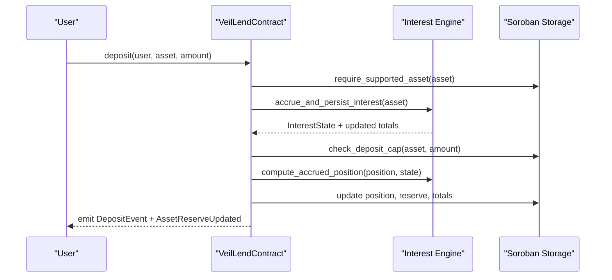
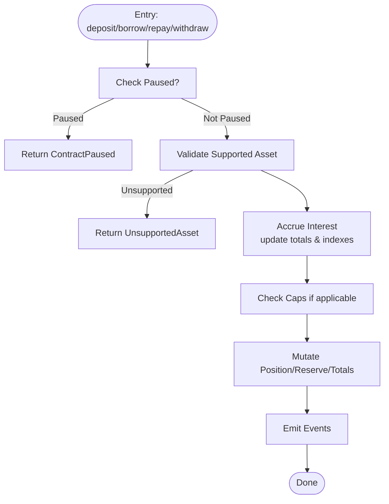
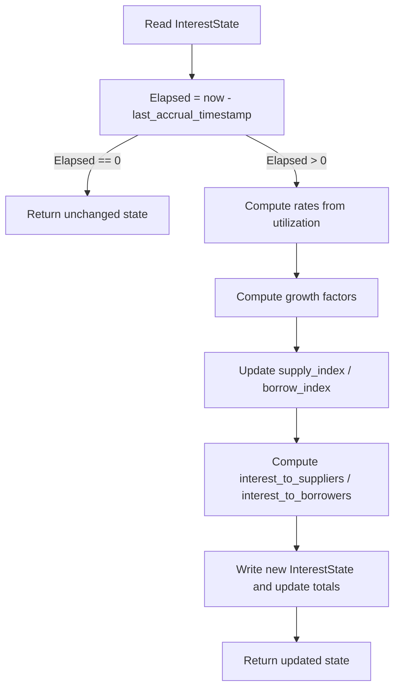
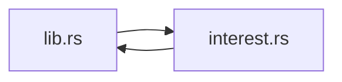
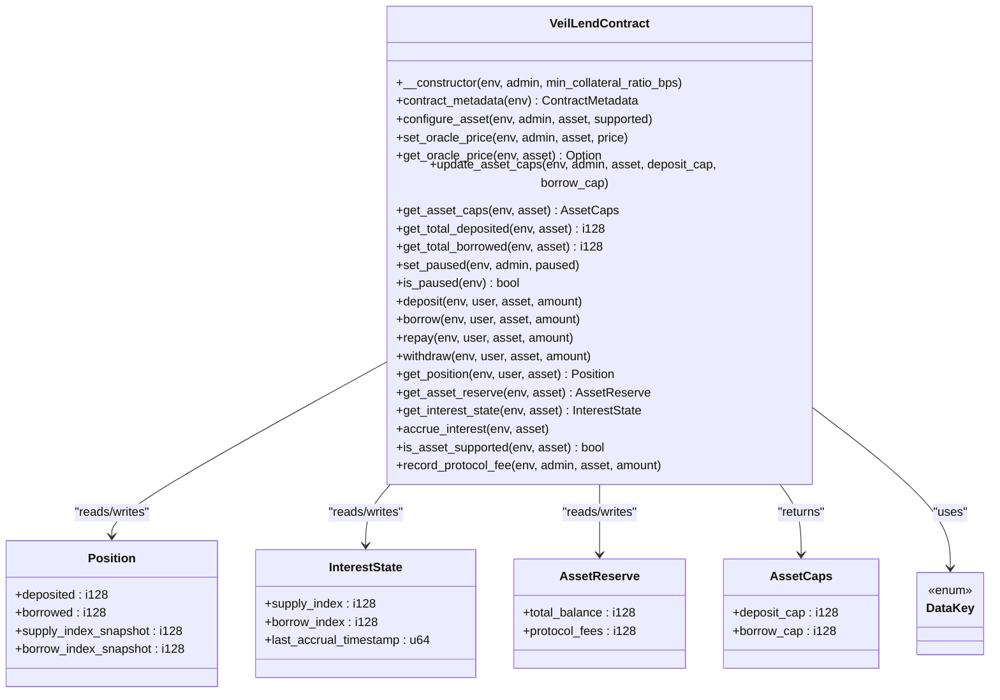

# Contract Architecture

<cite>
**Referenced Files in This Document**
- [lib.rs](file://veilend-soroban/src/lib.rs)
- [interest.rs](file://veilend-soroban/src/interest.rs)
- [Cargo.toml](file://veilend-soroban/Cargo.toml)
- [integration.rs](file://veilend-soroban/tests/integration.rs)
- [test_initialize_contract.1.json](file://veilend-soroban/test_snapshots/test_initialize_contract.1.json)
- [test_deposit_and_borrow_with_caps.1.json](file://veilend-soroban/test_snapshots/test_deposit_and_borrow_with_caps.1.json)
</cite>

## Table of Contents
1. [Introduction](#introduction)
2. [Project Structure](#project-structure)
3. [Core Components](#core-components)
4. [Architecture Overview](#architecture-overview)
5. [Detailed Component Analysis](#detailed-component-analysis)
6. [Dependency Analysis](#dependency-analysis)
7. [Performance Considerations](#performance-considerations)
8. [Troubleshooting Guide](#troubleshooting-guide)
9. [Conclusion](#conclusion)
10. [Appendices](#appendices)

## Introduction
This document explains the VeilLend Soroban/Rust smart contract architecture with a focus on initialization, storage schema, state management, access control, and error handling. It is designed for both newcomers to Soroban and experienced Rust developers. The contract models lending positions, reserves, accrual-based interest, and collateral ratios, exposing an admin-controlled configuration surface and user-facing deposit/borrow/repay/withdraw operations.

## Project Structure
The core implementation lives under veilend-soroban:
- lib.rs defines the VeilLendContract, data model, events, errors, and all entrypoints.
- interest.rs implements time-based accrual math and position realization.
- Cargo.toml declares the Soroban SDK dependency and crate type.
- tests/integration.rs demonstrates deployment, initialization, and end-to-end flows.
- test_snapshots capture ledger state and auth traces for key scenarios.

**Diagram sources**
- [lib.rs:226-719](file://veilend-soroban/src/lib.rs#L226-L719)
- [interest.rs:1-120](file://veilend-soroban/src/interest.rs#L1-L120)

**Section sources**
- [lib.rs:1-145](file://veilend-soroban/src/lib.rs#L1-L145)
- [interest.rs:1-22](file://veilend-soroban/src/interest.rs#L1-L22)
- [Cargo.toml:1-15](file://veilend-soroban/Cargo.toml#L1-L15)

## Core Components
- VeilLendContract: main contract struct implementing all public entrypoints and internal helpers.
- DataKey: stable storage key enum defining instance and persistent keys (admin, min collateral ratio, supported assets, positions, oracle prices, caps, totals, pause flag, interest state).
- Position: per-user per-asset balances with snapshots of supply/borrow indexes at last touch.
- InterestState: per-asset accrual indexes and last accrual timestamp.
- AssetReserve: per-asset total balance and protocol fees.
- Events: typed events for asset configuration, deposits, borrows, repayments, withdrawals, cap updates, circuit breaker toggles, and reserve updates.
- Errors: VeilLendError enumerates all failure modes with unique codes.

**Section sources**
- [lib.rs:28-145](file://veilend-soroban/src/lib.rs#L28-L145)
- [lib.rs:226-719](file://veilend-soroban/src/lib.rs#L226-L719)

## Architecture Overview
VeilLend separates concerns into:
- Admin-only configuration: asset support, oracle prices, caps, pause/unpause, fee recording.
- User operations: deposit, borrow, repay, withdraw, each enforcing caps, pausing, and collateralization.
- Accrual engine: time-based index growth applied to aggregate totals and realized per-position upon interaction or explicit accrue_interest call.
- Storage layer: Soroban instance/persistent storage keyed by DataKey; versioned via constants and metadata.

**Diagram sources**
- [lib.rs:483-519](file://veilend-soroban/src/lib.rs#L483-L519)
- [lib.rs:792-827](file://veilend-soroban/src/lib.rs#L792-L827)
- [interest.rs:51-87](file://veilend-soroban/src/interest.rs#L51-L87)

## Detailed Component Analysis

### Initialization and Admin Setup
- Constructor (__constructor): sets admin, minimum collateral ratio in basis points, and initializes the circuit breaker to not paused. Enforces that the contract is initialized only once and validates the minimum collateral ratio must be at least 100% (10,000 bps).
- Admin getters: admin() returns stored admin address; min_collateral_ratio_bps() returns configured value with a default fallback.

Practical example (from tests):
- Deploy contract with admin and min collateral ratio (e.g., 15,000 bps = 150%).
- Verify admin(), min_collateral_ratio_bps(), and is_paused().

**Section sources**
- [lib.rs:242-258](file://veilend-soroban/src/lib.rs#L242-L258)
- [lib.rs:706-718](file://veilend-soroban/src/lib.rs#L706-L718)
- [integration.rs:7-18](file://veilend-soroban/tests/integration.rs#L7-L18)
- [test_initialize_contract.1.json:13-27](file://veilend-soroban/test_snapshots/test_initialize_contract.1.json#L13-L27)

### Storage Schema Design and Versioning
- Version constants: CONTRACT_VERSION and STORAGE_SCHEMA_VERSION track interface and storage layout changes.
- Schema ID: STORAGE_SCHEMA_ID identifies the current DataKey layout for consumers.
- DataKey enum: centralizes all storage keys across instance and persistent storage, including Admin, MinCollateralRatioBps, SupportedAsset, AssetReserve, Position, OraclePrice, DepositCap, BorrowCap, TotalDeposited, TotalBorrowed, Paused, InterestState.
- Metadata query: contract_metadata() exposes versions and schema id for clients.

Versioning strategy:
- Increment CONTRACT_VERSION when the external interface changes.
- Increment STORAGE_SCHEMA_VERSION when serialized DataKey or stored value layout changes.
- Consumers should read contract_metadata() before assuming storage layout.

**Section sources**
- [lib.rs:10-26](file://veilend-soroban/src/lib.rs#L10-L26)
- [lib.rs:28-57](file://veilend-soroban/src/lib.rs#L28-L57)
- [lib.rs:231-240](file://veilend-soroban/src/lib.rs#L231-L240)

### State Management Patterns
- Instance storage: Admin, MinCollateralRatioBps.
- Persistent storage: SupportedAsset, AssetReserve, Position, OraclePrice, DepositCap, BorrowCap, TotalDeposited, TotalBorrowed, Paused, InterestState.
- Access patterns:
  - Read helpers: read_position, read_asset_reserve, read_interest_state.
  - Write helpers: write_position, write_asset_reserve, write_interest_state.
  - Aggregate updates: get_total_deposited/get_total_borrowed updated after mutations.
- Accrual integration:
  - accrue_and_persist_interest advances indexes and updates aggregate totals based on elapsed time and utilization.
  - simulate_accrued_interest_state computes live view without writing storage for read-only queries.

**Diagram sources**
- [lib.rs:483-519](file://veilend-soroban/src/lib.rs#L483-L519)
- [lib.rs:521-561](file://veilend-soroban/src/lib.rs#L521-L561)
- [lib.rs:563-598](file://veilend-soroban/src/lib.rs#L563-L598)
- [lib.rs:600-639](file://veilend-soroban/src/lib.rs#L600-L639)

**Section sources**
- [lib.rs:721-833](file://veilend-soroban/src/lib.rs#L721-L833)
- [lib.rs:792-827](file://veilend-soroban/src/lib.rs#L792-L827)

### Access Control Mechanisms
- Admin authentication: Admin-only functions validate caller against stored admin and require signature via require_auth.
- Functions requiring admin: configure_asset, set_oracle_price, update_asset_caps, set_paused, record_protocol_fee.
- User authentication: deposit, borrow, repay, withdraw require user authentication.

Examples:
- Admin configures asset support and initializes caps/totals.
- Admin sets oracle price for collateral valuation.
- Admin toggles circuit breaker to pause new deposits/borrows while allowing repay/withdraw.

**Section sources**
- [lib.rs:260-306](file://veilend-soroban/src/lib.rs#L260-L306)
- [lib.rs:317-331](file://veilend-soroban/src/lib.rs#L317-L331)
- [lib.rs:356-395](file://veilend-soroban/src/lib.rs#L356-L395)
- [lib.rs:458-468](file://veilend-soroban/src/lib.rs#L458-L468)
- [lib.rs:686-704](file://veilend-soroban/src/lib.rs#L686-L704)

### Error Handling Strategy
VeilLendError enumerates precise failure modes:
- AlreadyInitialized, Unauthorized, UnsupportedAsset, InvalidAmount, InsufficientCollateral, InsufficientDeposit, RepayTooLarge, InvalidCollateralRatio, NotInitialized, ZeroAmount, OraclePriceMissing, ContractPaused, DepositCapExceeded, BorrowCapExceeded, InvalidCap, CircuitBreakerTriggered, InsufficientReserve.

Validation points:
- Amounts: positive and non-zero checks.
- Collateralization: enforced using oracle price and minimum collateral ratio.
- Caps: deposit/borrow caps enforced prior to mutation.
- Pause: new deposits/borrows blocked when paused; repay/withdraw allowed.

**Section sources**
- [lib.rs:107-145](file://veilend-soroban/src/lib.rs#L107-L145)
- [lib.rs:847-934](file://veilend-soroban/src/lib.rs#L847-L934)

### Interest Accrual Model
- Time-based accrual uses fixed-point indexes (RATE_SCALE) and a piecewise-linear rate model driven by utilization.
- compute_accrual advances supply_index and borrow_index and computes interest_to_suppliers and interest_to_borrowers.
- compute_accrued_position realizes accrued interest into a specific Position and re-anchors snapshots.
- Idempotent: multiple accrual calls at the same timestamp are no-ops.

**Diagram sources**
- [interest.rs:51-87](file://veilend-soroban/src/interest.rs#L51-L87)
- [lib.rs:792-815](file://veilend-soroban/src/lib.rs#L792-L815)

**Section sources**
- [interest.rs:1-120](file://veilend-soroban/src/interest.rs#L1-L120)
- [lib.rs:792-827](file://veilend-soroban/src/lib.rs#L792-L827)

### API Surface
Below is the complete public API exposed by VeilLendContract. Each function includes parameters, return values, and behavior notes.

- __constructor(env, admin, min_collateral_ratio_bps)
  - Initializes contract with admin and minimum collateral ratio (bps). Requires admin auth. Sets Paused=false.
- contract_metadata(env) -> ContractMetadata
  - Returns contract_version, storage_schema_version, storage_schema_id.
- configure_asset(env, admin, asset, supported)
  - Admin-only. Enables/disables asset support. On enable, initializes caps (-1 unlimited), totals (0), and reserve. Emits AssetConfigured and AssetReserveUpdated.
- set_oracle_price(env, admin, asset, price)
  - Admin-only. Stores oracle price for collateral calculations. Validates price > 0.
- get_oracle_price(env, asset) -> Option<i128>
  - Reads oracle price if set.
- update_asset_caps(env, admin, asset, deposit_cap, borrow_cap)
  - Admin-only. Sets per-asset caps (-1 means unlimited). Validates caps. Emits CapsUpdated.
- get_asset_caps(env, asset) -> AssetCaps
  - Returns deposit_cap and borrow_cap for asset.
- get_total_deposited(env, asset) -> i128
  - Returns aggregate deposited amount for asset.
- get_total_borrowed(env, Env, asset) -> i128
  - Returns aggregate borrowed amount for asset.
- set_paused(env, admin, paused)
  - Admin-only. Toggles circuit breaker. Emits CircuitBreakerEvent.
- is_paused(env) -> bool
  - Returns pause status.
- deposit(env, user, asset, amount)
  - User-only. Validates asset, amount, caps, accrues interest, updates position/reserve/totals. Emits DepositEvent and AssetReserveUpdated.
- borrow(env, user, asset, amount)
  - User-only. Validates asset, amount, caps, accrues interest, ensures sufficient reserve, updates position/reserve/totals, asserts collateralized. Emits BorrowEvent and AssetReserveUpdated.
- repay(env, user, asset, amount)
  - User-only. Validates asset, amount, accrues interest, reduces debt, updates reserve/totals. Emits RepayEvent and AssetReserveUpdated.
- withdraw(env, user, asset, amount)
  - User-only. Validates asset, amount, accrues interest, reduces deposit, updates reserve/totals, asserts collateralized. Emits WithdrawEvent and AssetReserveUpdated.
- get_position(env, user, asset) -> Position
  - Returns user’s position with simulated accrued interest (no persistence).
- get_asset_reserve(env, asset) -> AssetReserve
  - Returns reserve for supported asset.
- get_interest_state(env, asset) -> InterestState
  - Returns simulated interest state up to current ledger time (no persistence).
- accrue_interest(env, asset)
  - Anyone can call. Forces reserve-level accrual and persists indexes and totals. Emits AssetReserveUpdated.
- is_asset_supported(env, asset) -> bool
  - Checks if asset is enabled.
- record_protocol_fee(env, admin, asset, amount)
  - Admin-only. Adds to reserve and protocol_fees, keeps interest clock fresh. Emits AssetReserveUpdated.

Notes:
- All mutating user operations enforce pausing rules where applicable and collateralization constraints using oracle price and minimum collateral ratio.
- Cap enforcement prevents exceeding deposit/borrow limits unless set to unlimited (-1).

**Section sources**
- [lib.rs:231-719](file://veilend-soroban/src/lib.rs#L231-L719)
- [lib.rs:835-934](file://veilend-soroban/src/lib.rs#L835-L934)

### Practical Examples
- Deployment and initialization:
  - Register contract with admin and min collateral ratio (e.g., 15,000 bps).
  - Verify admin(), min_collateral_ratio_bps(), is_paused().
- Configure asset and set oracle price:
  - Admin enables asset and sets oracle price for collateral valuation.
- Set caps:
  - Admin sets deposit_cap and borrow_cap per asset; -1 indicates unlimited.
- User flow:
  - Deposit funds, then borrow against collateral ensuring collateral ratio holds.
  - Repay debt and withdraw collateral; repay/withdraw remain possible even when paused.

These flows are demonstrated in integration tests and captured in snapshots.

**Section sources**
- [integration.rs:7-18](file://veilend-soroban/tests/integration.rs#L7-L18)
- [integration.rs:21-39](file://veilend-soroban/tests/integration.rs#L21-L39)
- [integration.rs:42-83](file://veilend-soroban/tests/integration.rs#L42-L83)
- [integration.rs:85-127](file://veilend-soroban/tests/integration.rs#L85-L127)
- [test_initialize_contract.1.json:13-27](file://veilend-soroban/test_snapshots/test_initialize_contract.1.json#L13-L27)
- [test_deposit_and_borrow_with_caps.1.json:13-107](file://veilend-soroban/test_snapshots/test_deposit_and_borrow_with_caps.1.json#L13-L107)

## Dependency Analysis
- External dependency: soroban-sdk provides contract primitives, storage, events, and testing utilities.
- Internal modules:
  - lib.rs depends on interest.rs for accrual math.
  - interest.rs depends on lib.rs types (Position, InterestState).

**Diagram sources**
- [lib.rs:3-4](file://veilend-soroban/src/lib.rs#L3-L4)
- [interest.rs:1](file://veilend-soroban/src/interest.rs#L1)

**Section sources**
- [Cargo.toml:11-12](file://veilend-soroban/Cargo.toml#L11-L12)
- [lib.rs:3-4](file://veilend-soroban/src/lib.rs#L3-L4)
- [interest.rs:1](file://veilend-soroban/src/interest.rs#L1)

## Performance Considerations
- Accrual is O(1) per asset per call; it advances indexes based on elapsed time and utilization.
- Position realization is O(1) per user per asset per operation.
- Caps and totals checks are constant-time lookups.
- Avoid unnecessary accrue_interest calls; they are idempotent but still incur storage writes.
- Use get_position/get_interest_state for read-only views to avoid extra writes.

[No sources needed since this section provides general guidance]

## Troubleshooting Guide
Common issues and their error codes:
- Unauthorized: Caller is not admin for admin-only functions.
- UnsupportedAsset: Asset not enabled via configure_asset.
- InvalidAmount/ZeroAmount: Negative or zero amounts passed to user operations.
- InsufficientCollateral: Post-operation collateral ratio below minimum (oracle price required).
- InsufficientDeposit/RepayTooLarge: Attempting to withdraw more than deposited or repay more than borrowed.
- ContractPaused: New deposits/borrows blocked when paused.
- DepositCapExceeded/BorrowCapExceeded: Exceeding per-asset caps.
- InvalidCap: Caps must be -1 (unlimited) or positive.
- OraclePriceMissing: Collateral checks require oracle price to be set.
- InsufficientReserve: Borrow/withdraw exceeds available reserve balance.

Debugging tips:
- Check is_paused() and oracle price before borrowing/withdrawing.
- Review get_asset_caps() and get_total_deposited()/get_total_borrowed() to understand limits.
- Use get_position() and get_interest_state() to inspect accrued balances and indexes.

**Section sources**
- [lib.rs:107-145](file://veilend-soroban/src/lib.rs#L107-L145)
- [lib.rs:835-934](file://veilend-soroban/src/lib.rs#L835-L934)

## Conclusion
VeilLend implements a robust, time-based lending protocol on Soroban with clear separation between admin configuration, user operations, and accrual mechanics. Its storage schema is versioned and queryable, enabling safe upgrades and client compatibility. Collateralization, caps, and circuit breaker controls provide operational safety, while events and errors offer transparency and debugging clarity.

[No sources needed since this section summarizes without analyzing specific files]

## Appendices

### Class Diagram of Core Types

**Diagram sources**
- [lib.rs:28-93](file://veilend-soroban/src/lib.rs#L28-L93)
- [lib.rs:226-719](file://veilend-soroban/src/lib.rs#L226-L719)