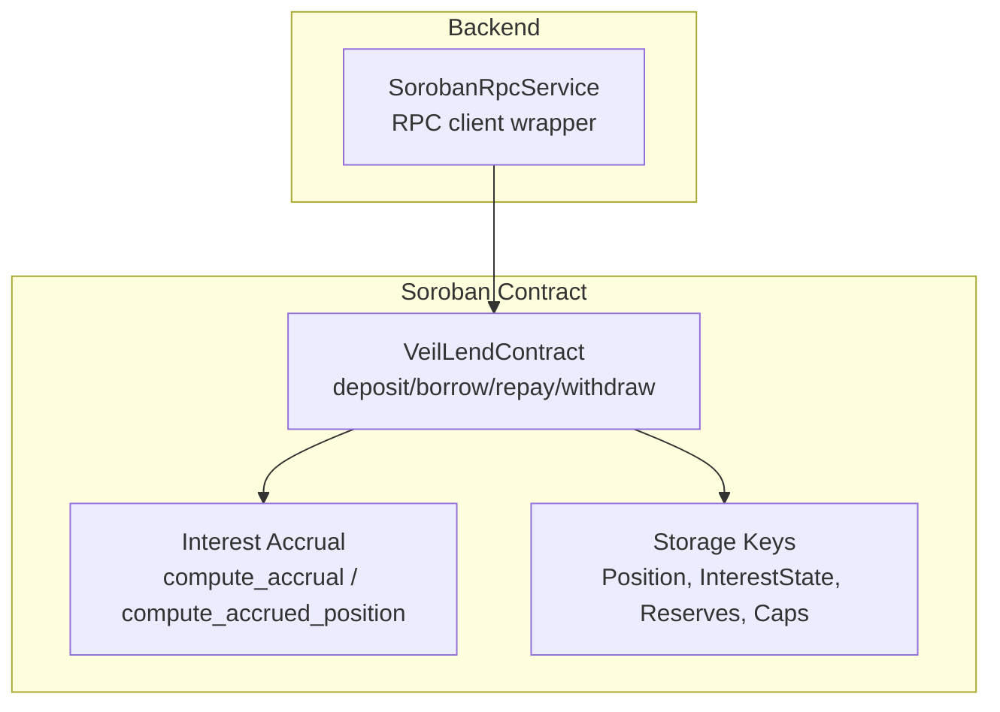
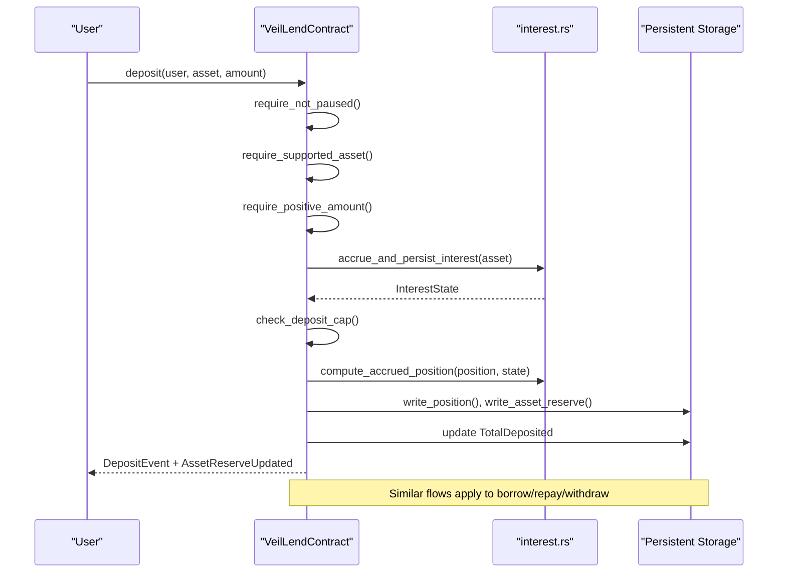
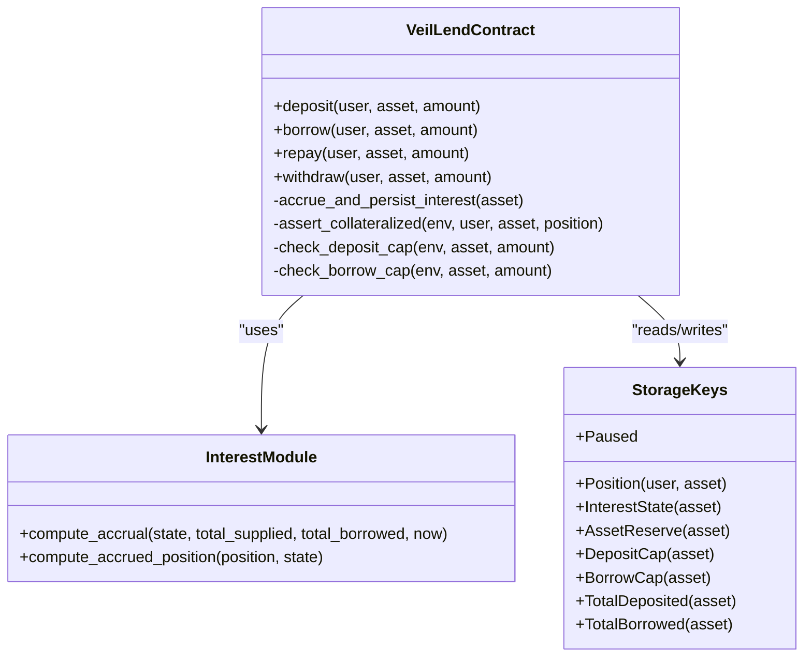

# Core Lending Operations

<cite>
**Referenced Files in This Document**
- [lib.rs](file://veilend-soroban/src/lib.rs)
- [interest.rs](file://veilend-soroban/src/interest.rs)
- [integration.rs](file://veilend-soroban/tests/integration.rs)
- [soroban-rpc.service.ts](file://veilend-backend/src/stellar/soroban-rpc.service.ts)
</cite>

## Table of Contents
1. [Introduction](#introduction)
2. [Project Structure](#project-structure)
3. [Core Components](#core-components)
4. [Architecture Overview](#architecture-overview)
5. [Detailed Component Analysis](#detailed-component-analysis)
6. [Dependency Analysis](#dependency-analysis)
7. [Performance Considerations](#performance-considerations)
8. [Troubleshooting Guide](#troubleshooting-guide)
9. [Conclusion](#conclusion)

## Introduction
This document explains the core lending operations implemented in the Veilend Soroban contract: deposit (supply collateral), borrow (take a loan against collateral), repay (reduce debt), and withdraw (remove deposited funds). It details validation logic, interest accrual mechanics, position updates, reserve modifications, pause state handling, error codes, and event emissions used by off-chain indexers. The goal is to make these concepts accessible to beginners while providing sufficient technical depth for developers building lending applications on top of Veilend.

## Project Structure
The lending protocol is implemented as a Soroban smart contract with two primary modules:
- Contract entry points and storage management in lib.rs
- Time-based interest accrual math and position realization in interest.rs

Off-chain integration uses a backend service that connects to the Soroban RPC network to interact with the contract.

**Diagram sources**
- [lib.rs:483-639](file://veilend-soroban/src/lib.rs#L483-L639)
- [interest.rs:51-120](file://veilend-soroban/src/interest.rs#L51-L120)
- [soroban-rpc.service.ts:17-80](file://veilend-backend/src/stellar/soroban-rpc.service.ts#L17-L80)

**Section sources**
- [lib.rs:1-100](file://veilend-soroban/src/lib.rs#L1-L100)
- [interest.rs:1-25](file://veilend-soroban/src/interest.rs#L1-L25)
- [soroban-rpc.service.ts:1-40](file://veilend-backend/src/stellar/soroban-rpc.service.ts#L1-L40)

## Core Components
- Deposit: Supplies assets into the protocol’s reserve and increases the user’s deposited balance. Validates asset support, positive amount, pause state, deposit caps, and reserves. Emits DepositEvent and AssetReserveUpdated.
- Borrow: Draws from the reserve against collateral. Validates asset support, positive amount, pause state, borrow caps, reserve availability, and collateral ratio. Emits BorrowEvent and AssetReserveUpdated.
- Repay: Reduces outstanding debt and returns liquidity to the reserve. Validates asset support, positive amount, and that repayment does not exceed accrued debt. Emits RepayEvent and AssetReserveUpdated.
- Withdraw: Removes deposited collateral. Validates asset support, positive amount, available deposited balance, reserve availability, and post-withdraw collateral ratio. Emits WithdrawEvent and AssetReserveUpdated.

All operations first accrue interest at the reserve level so totals reflect time-based growth before any cap or balance checks. Position balances are realized using compute_accrued_position to ensure accurate calculations prior to mutation.

**Section sources**
- [lib.rs:483-639](file://veilend-soroban/src/lib.rs#L483-L639)
- [lib.rs:782-827](file://veilend-soroban/src/lib.rs#L782-L827)
- [interest.rs:51-120](file://veilend-soroban/src/interest.rs#L51-L120)

## Architecture Overview
The lending operations follow a consistent flow:
1. Pre-checks: supported asset, positive amount, pause state (for deposit/borrow).
2. Reserve-level interest accrual: advances indexes and updates aggregate totals.
3. Cap checks: enforce per-asset deposit/borrow caps if configured.
4. Realize position: compute_accrued_position adjusts stored balances based on accrued indexes.
5. Mutate state: update position and reserve totals; enforce collateral ratio where applicable.
6. Emit events: operation-specific events plus reserve update events for indexing.

**Diagram sources**
- [lib.rs:483-519](file://veilend-soroban/src/lib.rs#L483-L519)
- [lib.rs:521-561](file://veilend-soroban/src/lib.rs#L521-L561)
- [lib.rs:563-598](file://veilend-soroban/src/lib.rs#L563-L598)
- [lib.rs:600-639](file://veilend-soroban/src/lib.rs#L600-L639)
- [interest.rs:51-120](file://veilend-soroban/src/interest.rs#L51-L120)

## Detailed Component Analysis

### Deposit Operation
Deposit supplies assets to the protocol reserve and increases the user’s deposited balance. Validation includes:
- Pause state: blocked when paused.
- Supported asset: must be enabled by admin.
- Positive amount: zero and negative amounts rejected.
- Deposit cap: enforced against current total deposits unless unlimited (-1).
- Interest accrual: reserve-level accrual ensures caps and totals are up-to-date.
- Position realization: compute_accrued_position updates deposited balance based on supply index growth.
- Reserve update: total_balance increases; AssetReserveUpdated emitted.
- Event emission: DepositEvent emitted for off-chain indexing.

Common issues:
- Insufficient deposit: not applicable here; insufficient reserve applies to borrow/withdraw.
- Exceeded deposit cap: DepositCapExceeded error.
- Paused contract: ContractPaused error.

Example flow references:
- Deposit entry point and validations: [lib.rs:483-519](file://veilend-soroban/src/lib.rs#L483-L519)
- Deposit cap enforcement: [lib.rs:867-888](file://veilend-soroban/src/lib.rs#L867-L888)
- Deposit event emission: [lib.rs:157-165](file://veilend-soroban/src/lib.rs#L157-L165)

**Section sources**
- [lib.rs:483-519](file://veilend-soroban/src/lib.rs#L483-L519)
- [lib.rs:867-888](file://veilend-soroban/src/lib.rs#L867-L888)
- [lib.rs:157-165](file://veilend-soroban/src/lib.rs#L157-L165)

### Borrow Operation
Borrow draws liquidity from the reserve against collateral. Validation includes:
- Pause state: blocked when paused.
- Supported asset: must be enabled by admin.
- Positive amount: zero and negative amounts rejected.
- Borrow cap: enforced against current total borrows unless unlimited (-1).
- Reserve availability: total_balance must cover the requested amount; otherwise InsufficientReserve.
- Collateral ratio: post-borrow position must satisfy minimum collateral ratio using oracle price; otherwise InsufficientCollateral.
- Interest accrual: reserve-level accrual ensures caps and totals are up-to-date.
- Position realization: compute_accrued_position updates borrowed balance based on borrow index growth.
- Reserve update: total_balance decreases; AssetReserveUpdated emitted.
- Event emission: BorrowEvent emitted for off-chain indexing.

Common issues:
- Insufficient reserve: InsufficientReserve error.
- Exceeded borrow cap: BorrowCapExceeded error.
- Insufficient collateral: InsufficientCollateral error.
- Oracle price missing: OraclePriceMissing error.

Example flow references:
- Borrow entry point and validations: [lib.rs:521-561](file://veilend-soroban/src/lib.rs#L521-L561)
- Collateral ratio assertion: [lib.rs:913-934](file://veilend-soroban/src/lib.rs#L913-L934)
- Borrow event emission: [lib.rs:167-175](file://veilend-soroban/src/lib.rs#L167-L175)

**Section sources**
- [lib.rs:521-561](file://veilend-soroban/src/lib.rs#L521-L561)
- [lib.rs:913-934](file://veilend-soroban/src/lib.rs#L913-L934)
- [lib.rs:167-175](file://veilend-soroban/src/lib.rs#L167-L175)

### Repay Operation
Repay reduces outstanding debt and returns liquidity to the reserve. Validation includes:
- Supported asset: must be enabled by admin.
- Positive amount: zero and negative amounts rejected.
- Accrued debt limit: repayment cannot exceed position.borrowed after accrual; otherwise RepayTooLarge.
- Interest accrual: reserve-level accrual ensures totals are up-to-date.
- Position realization: compute_accrued_position updates borrowed balance based on borrow index growth.
- Reserve update: total_balance increases; AssetReserveUpdated emitted.
- Event emission: RepayEvent emitted for off-chain indexing.

Note: Repay is allowed even when the contract is paused, enabling users to reduce debt during emergencies.

Common issues:
- Repaying too much: RepayTooLarge error.

Example flow references:
- Repay entry point and validations: [lib.rs:563-598](file://veilend-soroban/src/lib.rs#L563-L598)
- Repay event emission: [lib.rs:177-185](file://veilend-soroban/src/lib.rs#L177-L185)

**Section sources**
- [lib.rs:563-598](file://veilend-soroban/src/lib.rs#L563-L598)
- [lib.rs:177-185](file://veilend-soroban/src/lib.rs#L177-L185)

### Withdraw Operation
Withdraw removes deposited collateral from the protocol. Validation includes:
- Supported asset: must be enabled by admin.
- Positive amount: zero and negative amounts rejected.
- Available deposited balance: withdrawal cannot exceed position.deposited after accrual; otherwise InsufficientDeposit.
- Reserve availability: total_balance must cover the withdrawal; otherwise InsufficientReserve.
- Collateral ratio: post-withdraw position must satisfy minimum collateral ratio using oracle price; otherwise InsufficientCollateral.
- Interest accrual: reserve-level accrual ensures totals are up-to-date.
- Position realization: compute_accrued_position updates deposited balance based on supply index growth.
- Reserve update: total_balance decreases; AssetReserveUpdated emitted.
- Event emission: WithdrawEvent emitted for off-chain indexing.

Note: Withdraw is allowed even when the contract is paused, enabling users to remove collateral during emergencies.

Common issues:
- Insufficient deposit: InsufficientDeposit error.
- Insufficient reserve: InsufficientReserve error.
- Insufficient collateral: InsufficientCollateral error.

Example flow references:
- Withdraw entry point and validations: [lib.rs:600-639](file://veilend-soroban/src/lib.rs#L600-L639)
- Withdraw event emission: [lib.rs:187-195](file://veilend-soroban/src/lib.rs#L187-L195)

**Section sources**
- [lib.rs:600-639](file://veilend-soroban/src/lib.rs#L600-L639)
- [lib.rs:187-195](file://veilend-soroban/src/lib.rs#L187-L195)

### Interest Accrual and Position Realization
Interest accrual is central to accurate balance calculations:
- Reserve-level accrual advances supply_index and borrow_index based on elapsed time and utilization rates, then updates aggregate TotalDeposited and TotalBorrowed.
- Position realization via compute_accrued_position adjusts individual position balances using the difference between current indexes and the position’s snapshots, then re-anchors snapshots to current indexes.
- This design ensures idempotent accrual and accurate balances across operations without touching every position each time.

Key behaviors:
- Idempotency: accrual at the same timestamp is a no-op.
- Conservation: interest paid by borrowers equals interest earned by suppliers under the model.
- Read-only simulation: get_position and get_interest_state simulate accrual without persisting changes.

Example flow references:
- Accrual function and persistence: [lib.rs:782-827](file://veilend-soroban/src/lib.rs#L782-L827)
- Position realization: [interest.rs:89-120](file://veilend-soroban/src/interest.rs#L89-L120)
- Rate computation and compounding: [interest.rs:24-87](file://veilend-soroban/src/interest.rs#L24-L87)

**Section sources**
- [lib.rs:782-827](file://veilend-soroban/src/lib.rs#L782-L827)
- [interest.rs:24-120](file://veilend-soroban/src/interest.rs#L24-L120)

### Pause State Handling
Pause state controls which operations are allowed:
- Deposit and borrow are blocked when paused to prevent new exposure.
- Repay and withdraw remain available to allow users to reduce debt and remove collateral during emergencies.
- Admin can toggle pause via set_paused; CircuitBreakerEvent emitted for off-chain monitoring.

Example flow references:
- Pause checks in deposit/borrow: [lib.rs:483-525](file://veilend-soroban/src/lib.rs#L483-L525)
- Pause toggle and event: [lib.rs:450-468](file://veilend-soroban/src/lib.rs#L450-L468)
- Integration test demonstrating pause behavior: [integration.rs:85-127](file://veilend-soroban/tests/integration.rs#L85-L127)

**Section sources**
- [lib.rs:450-468](file://veilend-soroban/src/lib.rs#L450-L468)
- [lib.rs:483-525](file://veilend-soroban/src/lib.rs#L483-L525)
- [integration.rs:85-127](file://veilend-soroban/tests/integration.rs#L85-L127)

### Event Emission Pattern
Each operation emits specific events for off-chain indexing:
- DepositEvent: user, asset, amount
- BorrowEvent: user, asset, amount
- RepayEvent: user, asset, amount
- WithdrawEvent: user, asset, amount
Additionally, AssetReserveUpdated is emitted after each operation to record reserve changes and the kind of update (Deposit, Borrow, Repay, Withdraw, FeeAccrual, InterestAccrual).

These events enable reliable indexing of user positions, protocol totals, and reserve states.

Example flow references:
- Event definitions: [lib.rs:157-195](file://veilend-soroban/src/lib.rs#L157-L195)
- Reserve update event: [lib.rs:216-224](file://veilend-soroban/src/lib.rs#L216-L224)
- Emission in operations: [lib.rs:512-518](file://veilend-soroban/src/lib.rs#L512-L518), [lib.rs:554-560](file://veilend-soroban/src/lib.rs#L554-L560), [lib.rs:591-597](file://veilend-soroban/src/lib.rs#L591-L597), [lib.rs:632-638](file://veilend-soroban/src/lib.rs#L632-L638)

**Section sources**
- [lib.rs:157-195](file://veilend-soroban/src/lib.rs#L157-L195)
- [lib.rs:216-224](file://veilend-soroban/src/lib.rs#L216-L224)
- [lib.rs:512-518](file://veilend-soroban/src/lib.rs#L512-L518)
- [lib.rs:554-560](file://veilend-soroban/src/lib.rs#L554-L560)
- [lib.rs:591-597](file://veilend-soroban/src/lib.rs#L591-L597)
- [lib.rs:632-638](file://veilend-soroban/src/lib.rs#L632-L638)

## Dependency Analysis
The lending operations depend on several internal components:
- Interest accrual module for rate calculation and position realization
- Storage keys for positions, interest state, reserves, and caps
- Admin-controlled configuration for assets, oracle prices, and caps
- Pause state for circuit breaker functionality

**Diagram sources**
- [lib.rs:483-639](file://veilend-soroban/src/lib.rs#L483-L639)
- [interest.rs:51-120](file://veilend-soroban/src/interest.rs#L51-L120)
- [lib.rs:38-57](file://veilend-soroban/src/lib.rs#L38-L57)

**Section sources**
- [lib.rs:38-57](file://veilend-soroban/src/lib.rs#L38-L57)
- [lib.rs:483-639](file://veilend-soroban/src/lib.rs#L483-L639)
- [interest.rs:51-120](file://veilend-soroban/src/interest.rs#L51-L120)

## Performance Considerations
- Accrual efficiency: Reserve-level accrual avoids per-position updates, reducing gas costs and storage writes. Only touched positions realize accrued interest.
- Idempotency: Multiple accrual calls at the same timestamp are no-ops, preventing redundant computations.
- Read-only simulation: get_position and get_interest_state simulate accrual without persistent writes, enabling efficient queries.
- Cap checks: Early cap validation prevents unnecessary state mutations when limits would be exceeded.

[No sources needed since this section provides general guidance]

## Troubleshooting Guide
Common errors and their causes:
- InsufficientCollateral: Post-operation collateral ratio below minimum due to insufficient deposited value relative to borrowed value. Ensure adequate deposits or reduce borrowing.
- InsufficientDeposit: Withdraw amount exceeds accrued deposited balance. Check position.deposited after accrual.
- RepayTooLarge: Repayment exceeds accrued borrowed balance. Verify position.borrowed after accrual.
- InsufficientReserve: Borrow or withdraw amount exceeds reserve total_balance. Ensure sufficient liquidity in the protocol.
- DepositCapExceeded/BorrowCapExceeded: Per-asset caps exceeded. Adjust caps or wait for reductions via repay/withdraw.
- ContractPaused: Deposit/borrow blocked when paused. Wait for admin to unpause or use repay/withdraw.
- OraclePriceMissing: Collateral ratio checks require oracle price. Configure oracle price via admin.

Operational tips:
- Always call accrue_interest or rely on automatic accrual in operations to ensure accurate balances.
- Monitor AssetReserveUpdated events to track reserve changes and protocol health.
- Use get_position and get_interest_state for pre-flight checks before submitting transactions.

**Section sources**
- [lib.rs:107-145](file://veilend-soroban/src/lib.rs#L107-L145)
- [lib.rs:913-934](file://veilend-soroban/src/lib.rs#L913-L934)
- [integration.rs:344-378](file://veilend-soroban/tests/integration.rs#L344-L378)

## Conclusion
The Veilend lending protocol implements robust deposit, borrow, repay, and withdraw operations with comprehensive validation, interest accrual, and event emission patterns. By accruing interest at the reserve level and realizing it per position, the system maintains accuracy while optimizing performance. Pause state handling enables emergency controls while preserving user ability to repay and withdraw. Developers building lending applications should leverage these operations, monitor events for indexing, and handle errors appropriately to provide reliable user experiences.

[No sources needed since this section summarizes without analyzing specific files]