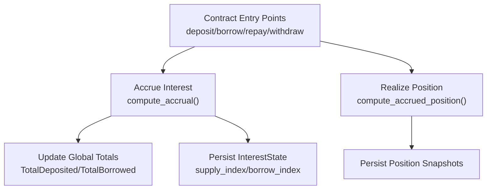
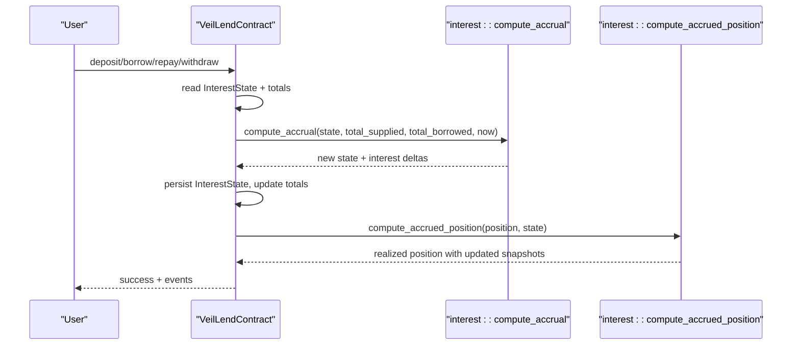
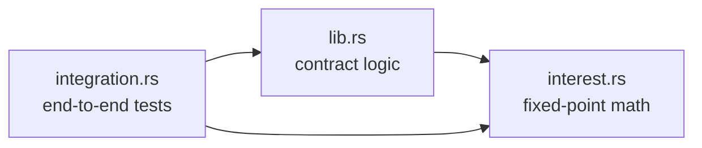

# Fixed-Point Arithmetic System

<cite>
**Referenced Files in This Document**
- [lib.rs](file://veilend-soroban/src/lib.rs)
- [interest.rs](file://veilend-soroban/src/interest.rs)
- [integration.rs](file://veilend-soroban/tests/integration.rs)
</cite>

## Table of Contents
1. [Introduction](#introduction)
2. [Project Structure](#project-structure)
3. [Core Components](#core-components)
4. [Architecture Overview](#architecture-overview)
5. [Detailed Component Analysis](#detailed-component-analysis)
6. [Dependency Analysis](#dependency-analysis)
7. [Performance Considerations](#performance-considerations)
8. [Troubleshooting Guide](#troubleshooting-guide)
9. [Conclusion](#conclusion)

## Introduction
This document explains the fixed-point arithmetic system used for interest calculations in the Veilend lending contract. It focuses on how the RATE_SCALE constant (1e9) enables precise financial computations without floating-point operations in a no_std environment, and how values are scaled and unscaled during accrual and position updates. It also covers precision handling, overflow protection via saturating arithmetic, trade-offs between precision and performance, and common pitfalls such as division ordering and multiplication overflow scenarios.

## Project Structure
The fixed-point logic is implemented within the Soroban smart contract:
- The main contract orchestrates storage, events, and entrypoints that call into the interest module.
- The interest module defines the fixed-point scale, rate model, accrual math, and per-position realization.
- Integration tests validate end-to-end behavior including index growth, idempotent accruals, and conservation of value.

**Diagram sources**
- [lib.rs:483-677](file://veilend-soroban/src/lib.rs#L483-L677)
- [interest.rs:51-87](file://veilend-soroban/src/interest.rs#L51-L87)
- [interest.rs:97-120](file://veilend-soroban/src/interest.rs#L97-L120)

**Section sources**
- [lib.rs:1-120](file://veilend-soroban/src/lib.rs#L1-L120)
- [interest.rs:1-22](file://veilend-soroban/src/interest.rs#L1-L22)

## Core Components
- Fixed-point scale: RATE_SCALE = 1_000_000_000 (1e9). All indexes represent “x” multipliers with 1.0x encoded as RATE_SCALE.
- Time constants: SECONDS_PER_YEAR = 31_536_000.
- Rate model parameters: BASE_RATE_BPS and SLOPE_BPS define a linear APR curve based on utilization.
- Accrual engine: compute_accrual advances supply_index and borrow_index over elapsed time using fixed-point growth factors derived from rates and time.
- Position realization: compute_accrued_position applies accrued growth to user balances and re-anchors snapshots to current indexes.

Key responsibilities:
- lib.rs: Contract state management, calling accrual before mutations, persisting InterestState and Position, emitting events.
- interest.rs: Pure math for rates, growth, and position realization; no side effects.

**Section sources**
- [interest.rs:3-14](file://veilend-soroban/src/interest.rs#L3-L14)
- [interest.rs:51-87](file://veilend-soroban/src/interest.rs#L51-L87)
- [interest.rs:97-120](file://veilend-soroban/src/interest.rs#L97-L120)
- [lib.rs:721-800](file://veilend-soroban/src/lib.rs#L721-L800)

## Architecture Overview
The system uses an index-based approach to avoid per-user compounding overhead. Global indexes grow over time according to utilization-driven rates. User positions store snapshots of these indexes at last touch; realized balances are computed by applying the delta between current and snapshot indexes.

**Diagram sources**
- [lib.rs:483-677](file://veilend-soroban/src/lib.rs#L483-L677)
- [interest.rs:51-87](file://veilend-soroban/src/interest.rs#L51-L87)
- [interest.rs:97-120](file://veilend-soroban/src/interest.rs#L97-L120)

## Detailed Component Analysis

### Fixed-Point Representation and Scaling
- SCALE: RATE_SCALE = 1e9. Indexes are stored as i128 multiples of this scale. 1.0x is represented exactly as RATE_SCALE.
- Growth factor computation: For each accrual step, growth is computed as (rate_bps * RATE_SCALE * elapsed) / (10_000 * SECONDS_PER_YEAR). This yields a dimensionless multiplier in fixed-point form.
- Applying growth: New index = old index + (old index * growth) / RATE_SCALE. Division by RATE_SCALE “unscales” the product back to index units.
- Position realization: Applied growth to a balance is (balance * (current_index - snapshot_index)) / snapshot_index. This keeps relative growth proportional to the original principal.

Why this works:
- Using i128 avoids floating-point entirely, suitable for no_std environments.
- 1e9 provides ~9 decimal digits of fractional resolution around 1.0x, sufficient for APRs and time fractions while keeping intermediate products within i128 range under normal protocol sizes.

Precision notes:
- Intermediate multiplications like rate_bps * RATE_SCALE * elapsed can be large; order of operations ensures division happens early enough to fit in i128.
- Division truncation occurs at each step; careful ordering minimizes loss.

**Section sources**
- [interest.rs:3-7](file://veilend-soroban/src/interest.rs#L3-L7)
- [interest.rs:69-76](file://veilend-soroban/src/interest.rs#L69-L76)
- [interest.rs:97-120](file://veilend-soroban/src/interest.rs#L97-L120)

### Rate Model and Utilization
- Utilization in basis points: utilization_bps = total_borrowed * 10_000 / total_supplied (with zero-supply guard).
- Borrow APR: borrow_rate_bps = BASE_RATE_BPS + (utilization_bps * SLOPE_BPS) / 10_000.
- Supply APR: supply_rate_bps = borrow_rate_bps * utilization_bps / 10_000.
- This design ensures 100% pass-through: interest paid by borrowers equals interest credited to suppliers in aggregate when totals match.

Example scenario (from tests):
- At 50% utilization, borrow_rate_bps = 1200 (12% APR), supply_rate_bps = 600 (6% APR). Over one year, indexes grow proportionally, and totals reflect accrued interest.

**Section sources**
- [interest.rs:24-38](file://veilend-soroban/src/interest.rs#L24-L38)
- [integration.rs:284-309](file://veilend-soroban/tests/integration.rs#L284-L309)

### Accrual Algorithm and Idempotency
- Elapsed time: elapsed = now.saturating_sub(last_accrual_timestamp) as i128. If elapsed == 0, return unchanged state (idempotent).
- Growth factors: borrow_growth and supply_growth computed in fixed-point using RATE_SCALE.
- Index updates: new indices incorporate growth applied to previous indices, enabling compounding across calls.
- Aggregate interest: interest_to_borrowers and interest_to_suppliers are added to global totals upon persistence.

Idempotency guarantees:
- Same timestamp yields no change, verified by integration tests.

**Section sources**
- [interest.rs:51-87](file://veilend-soroban/src/interest.rs#L51-L87)
- [integration.rs:423-460](file://veilend-soroban/tests/integration.rs#L423-L460)

### Position Realization and Snapshot Anchoring
- When a user interacts, their position is “realized” against the latest InterestState:
  - borrowed' = borrowed + borrowed * (borrow_index - borrow_snapshot) / borrow_snapshot
  - deposited' = deposited + deposited * (supply_index - supply_snapshot) / supply_snapshot
- Snapshots are then updated to current indexes so future accrual measures only the delta since this interaction.

Edge cases:
- Zero balances do not accrue interest but still re-anchor snapshots to ensure correct future deltas.

**Section sources**
- [interest.rs:97-120](file://veilend-soroban/src/interest.rs#L97-L120)
- [lib.rs:753-774](file://veilend-soroban/src/lib.rs#L753-L774)

### Overflow Protection and Saturating Arithmetic
- Time subtraction uses saturating_sub to prevent underflow if timestamps regress.
- All arithmetic uses i128; divisions are placed after multiplications to preserve precision, and denominators (RATE_SCALE, 10_000, SECONDS_PER_YEAR) keep magnitudes bounded.
- No explicit wrapping or panics occur in pure math paths; errors surface at higher levels (e.g., cap checks, insufficient reserve).

Trade-offs:
- Saturating behavior avoids panics on edge inputs but may silently clamp; here it is appropriate for time differences.
- Truncation in integer division introduces small rounding errors; however, repeated application remains consistent due to index anchoring.

**Section sources**
- [interest.rs:57-76](file://veilend-soroban/src/interest.rs#L57-L76)
- [lib.rs:792-800](file://veilend-soroban/src/lib.rs#L792-L800)

### Concrete Examples
- One-year accrual at 50% utilization:
  - borrow_index grows by 12% (fixed-point), supply_index by 6%.
  - Total borrowed increases by 12% of original; total deposited by 6%.
  - Verified by integration test assertions on indexes and totals.
- Position doubling:
  - If indexes double since snapshot, realized balances double accordingly.

These examples demonstrate how scaling preserves accuracy across time and interactions.

**Section sources**
- [integration.rs:284-309](file://veilend-soroban/tests/integration.rs#L284-L309)
- [interest.rs:156-187](file://veilend-soroban/src/interest.rs#L156-L187)

## Dependency Analysis
The contract depends on the interest module for all rate and accrual math. The flow is strictly layered:
- lib.rs handles storage and orchestration.
- interest.rs provides pure functions for deterministic math.
- Tests exercise both modules together to ensure correctness.

**Diagram sources**
- [lib.rs:483-800](file://veilend-soroban/src/lib.rs#L483-L800)
- [interest.rs:51-120](file://veilend-soroban/src/interest.rs#L51-L120)
- [integration.rs:284-460](file://veilend-soroban/tests/integration.rs#L284-L460)

**Section sources**
- [lib.rs:1-120](file://veilend-soroban/src/lib.rs#L1-L120)
- [interest.rs:1-22](file://veilend-soroban/src/interest.rs#L1-L22)
- [integration.rs:1-20](file://veilend-soroban/tests/integration.rs#L1-L20)

## Performance Considerations
- O(1) accrual per asset per call; no per-user loops.
- Minimal allocations; pure functions operate on references.
- Fixed-point avoids expensive float operations; i128 arithmetic is efficient on 64-bit targets.
- Index anchoring amortizes per-user cost to touch-time only.

Optimization tips:
- Batch multiple deposits/borrows to reduce repeated accrual calls.
- Ensure callers always accrue once per entrypoint to avoid redundant work.

[No sources needed since this section provides general guidance]

## Troubleshooting Guide
Common issues and mitigations:
- Precision loss from division ordering: Always multiply first, then divide by known constants (RATE_SCALE, 10_000, SECONDS_PER_YEAR). Reorder expressions to keep intermediates within i128 bounds.
- Multiplication overflow: Keep operands bounded; use i128 for intermediates. Validate inputs (e.g., non-zero denominators, reasonable rates).
- Timestamp regression: Use saturating_sub to avoid underflow; idempotency ensures no-op on same timestamp.
- Zero-supply edge case: Utilization is guarded to avoid division by zero; supply growth remains zero until deposits exist.

Verification strategies:
- Use integration tests to assert expected index growth and totals after known time intervals.
- Check idempotency by invoking accrue_interest twice at the same timestamp.

**Section sources**
- [interest.rs:57-76](file://veilend-soroban/src/interest.rs#L57-L76)
- [integration.rs:311-342](file://veilend-soroban/tests/integration.rs#L311-L342)
- [integration.rs:423-460](file://veilend-soroban/tests/integration.rs#L423-L460)

## Conclusion
The Veilend fixed-point system leverages RATE_SCALE = 1e9 to perform precise, deterministic interest accrual without floating-point operations in a no_std environment. By representing indexes as scaled integers and applying growth through carefully ordered multiplications and divisions, the system maintains high precision while avoiding overflow and ensuring idempotency. The index-and-snapshot model efficiently scales to many users, and integration tests confirm correctness across typical and edge-case scenarios. Adhering to the documented ordering and safeguards prevents common pitfalls and ensures robust financial computations.