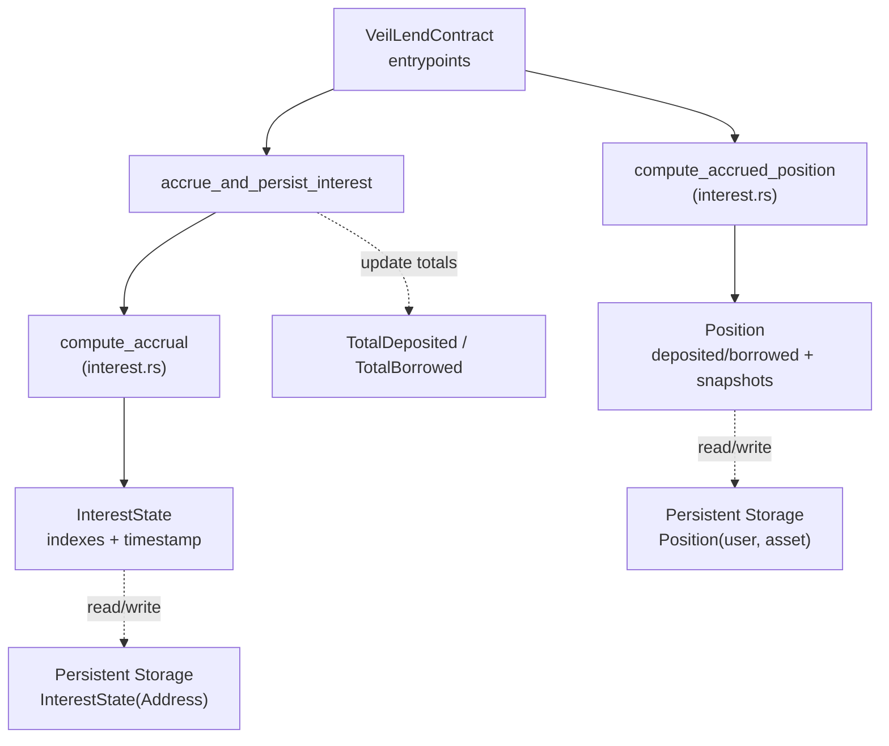
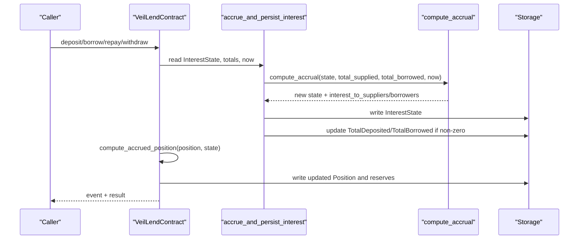
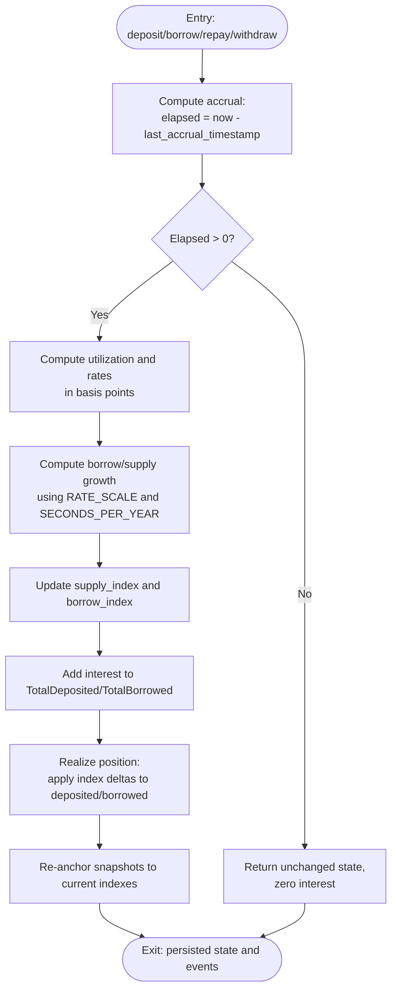
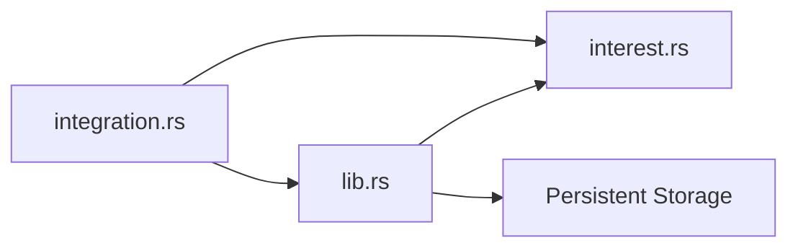

# Interest Calculation Engine

<cite>
**Referenced Files in This Document**
- [interest.rs](file://veilend-soroban/src/interest.rs)
- [lib.rs](file://veilend-soroban/src/lib.rs)
- [integration.rs](file://veilend-soroban/tests/integration.rs)
- [test_accrue_interest_grows_indexes_with_no_position_touch.1.json](file://veilend-soroban/test_snapshots/test_accrue_interest_grows_indexes_with_no_position_touch.1.json)
- [test_deposit_then_borrow_then_time_advances_grows_debt_matching_formula.1.json](file://veilend-soroban/test_snapshots/test_deposit_then_borrow_then_time_advances_grows_debt_matching_formula.1.json)
- [test_conservation_of_value_between_suppliers_and_borrower.1.json](file://veilend-soroban/test_snapshots/test_conservation_of_value_between_suppliers_and_borrower.1.json)
</cite>

## Table of Contents
1. [Introduction](#introduction)
2. [Project Structure](#project-structure)
3. [Core Components](#core-components)
4. [Architecture Overview](#architecture-overview)
5. [Detailed Component Analysis](#detailed-component-analysis)
6. [Dependency Analysis](#dependency-analysis)
7. [Performance Considerations](#performance-considerations)
8. [Troubleshooting Guide](#troubleshooting-guide)
9. [Conclusion](#conclusion)

## Introduction
This document explains the interest calculation engine sub-component that accrues time-based interest for deposits and borrows. It focuses on the fixed-point arithmetic using a rate scale, how supply and borrow indexes evolve over time, and how individual user positions realize accrued interest through snapshots. The goal is to make the mechanics accessible to beginners while providing enough technical depth for experienced developers implementing DeFi protocols.

## Project Structure
The interest engine lives in a dedicated module and integrates with the main contract’s storage and entry points:
- interest.rs implements the core math and helpers for accrual and position realization.
- lib.rs defines data structures (InterestState, Position), persists state, and orchestrates accrual before mutating operations.
- integration tests and snapshot files validate behavior across time advances, idempotency, and conservation of value.

**Diagram sources**
- [lib.rs:483-519](file://veilend-soroban/src/lib.rs#L483-L519)
- [lib.rs:521-561](file://veilend-soroban/src/lib.rs#L521-L561)
- [lib.rs:563-598](file://veilend-soroban/src/lib.rs#L563-L598)
- [lib.rs:600-639](file://veilend-soroban/src/lib.rs#L600-L639)
- [lib.rs:792-827](file://veilend-soroban/src/lib.rs#L792-L827)
- [interest.rs:51-87](file://veilend-soroban/src/interest.rs#L51-L87)
- [interest.rs:97-120](file://veilend-soroban/src/interest.rs#L97-L120)

**Section sources**
- [interest.rs:1-120](file://veilend-soroban/src/interest.rs#L1-L120)
- [lib.rs:59-79](file://veilend-soroban/src/lib.rs#L59-L79)
- [lib.rs:792-827](file://veilend-soroban/src/lib.rs#L792-L827)

## Core Components
- Fixed-point scale: RATE_SCALE represents 1.0x for index values. All growth factors are expressed relative to this scale.
- Time constants: SECONDS_PER_YEAR normalizes APR to per-second growth.
- Rate model: BASE_RATE_BPS provides a floor; SLOPE_BPS adds linearly with utilization. Supply rate equals borrow rate scaled by utilization to ensure 100% pass-through from borrowers to suppliers.
- InterestState: Tracks per-asset supply_index, borrow_index, and last_accrual_timestamp. These indexes grow monotonically with time and utilization.
- Position: Stores deposited and borrowed balances plus snapshots of supply_index and borrow_index at the last realization. Realization computes realized balances by applying index deltas since the snapshot.

Key responsibilities:
- compute_rates_bps: Derives utilization and rates in basis points from total supplied and borrowed.
- compute_accrual: Advances indexes and returns interest to add to aggregate totals. Idempotent when elapsed time is zero.
- compute_accrued_position: Realizes accrued interest into a specific position and re-anchors its snapshots to current indexes.

**Section sources**
- [interest.rs:3-15](file://veilend-soroban/src/interest.rs#L3-L15)
- [interest.rs:24-38](file://veilend-soroban/src/interest.rs#L24-L38)
- [interest.rs:51-87](file://veilend-soroban/src/interest.rs#L51-L87)
- [interest.rs:89-120](file://veilend-soroban/src/interest.rs#L89-L120)
- [lib.rs:59-79](file://veilend-soroban/src/lib.rs#L59-L79)

## Architecture Overview
The accrual flow is triggered before any operation that reads or writes reserve-level balances. This ensures caps and collateral checks use up-to-date totals. Read-only views simulate accrual without persisting changes.

**Diagram sources**
- [lib.rs:483-519](file://veilend-soroban/src/lib.rs#L483-L519)
- [lib.rs:521-561](file://veilend-soroban/src/lib.rs#L521-L561)
- [lib.rs:563-598](file://veilend-soroban/src/lib.rs#L563-L598)
- [lib.rs:600-639](file://veilend-soroban/src/lib.rs#L600-L639)
- [lib.rs:792-827](file://veilend-soroban/src/lib.rs#L792-L827)
- [interest.rs:51-87](file://veilend-soroban/src/interest.rs#L51-L87)

## Detailed Component Analysis

### Fixed-Point Arithmetic and Rate Model
- RATE_SCALE defines the precision base for indexes. Growth factors are computed as fractions of RATE_SCALE.
- Utilization is calculated as total_borrowed * 10_000 / total_supplied. If total_supplied is zero, utilization is zero.
- Borrow rate in bps = BASE_RATE_BPS + (utilization_bps * SLOPE_BPS) / 10_000.
- Supply rate in bps = borrow_rate_bps * utilization_bps / 10_000.
- Per-period growth factors:
  - borrow_growth = (borrow_rate_bps * RATE_SCALE * elapsed) / (10_000 * SECONDS_PER_YEAR)
  - supply_growth = (supply_rate_bps * RATE_SCALE * elapsed) / (10_000 * SECONDS_PER_YEAR)
- Index updates:
  - new_borrow_index = borrow_index + (borrow_index * borrow_growth) / RATE_SCALE
  - new_supply_index = supply_index + (supply_index * supply_growth) / RATE_SCALE
- Aggregate interest:
  - interest_to_borrowers = (total_borrowed * borrow_growth) / RATE_SCALE
  - interest_to_suppliers = (total_supplied * supply_growth) / RATE_SCALE

Idempotency: If elapsed time is zero, accrual returns unchanged state and zero interest.

Concrete example references:
- One-year accrual at 50% utilization grows borrow index to 1.12x and supply index to 1.06x, with corresponding increases in totals. See test assertions and snapshots.

**Section sources**
- [interest.rs:3-15](file://veilend-soroban/src/interest.rs#L3-L15)
- [interest.rs:24-38](file://veilend-soroban/src/interest.rs#L24-L38)
- [interest.rs:51-87](file://veilend-soroban/src/interest.rs#L51-L87)
- [integration.rs:284-309](file://veilend-soroban/tests/integration.rs#L284-L309)
- [test_accrue_interest_grows_indexes_with_no_position_touch.1.json:476-531](file://veilend-soroban/test_snapshots/test_accrue_interest_grows_indexes_with_no_position_touch.1.json#L476-L531)

### InterestState and Position Snapshots
- InterestState fields:
  - supply_index: tracks cumulative growth for suppliers.
  - borrow_index: tracks cumulative growth for borrowers.
  - last_accrual_timestamp: prevents double-counting and enables idempotent accrual.
- Position fields:
  - deposited, borrowed: principal amounts adjusted via realization.
  - supply_index_snapshot, borrow_index_snapshot: anchors used to compute realized growth since last touch.

Realization logic:
- For borrowed > 0: realized borrowed = borrowed + borrowed * (state.borrow_index - position.borrow_index_snapshot) / position.borrow_index_snapshot
- For deposited > 0: realized deposited = deposited + deposited * (state.supply_index - position.supply_index_snapshot) / position.supply_index_snapshot
- After realization, snapshots are updated to current indexes so next delta measures from now.

Zero-balance behavior:
- Zero balances do not grow but still re-anchor snapshots to avoid stale deltas.

Concrete example references:
- Doubling indexes doubles realized balances for non-zero positions.
- Zero balance remains zero after accrual but snapshots advance.

**Section sources**
- [lib.rs:59-79](file://veilend-soroban/src/lib.rs#L59-L79)
- [interest.rs:89-120](file://veilend-soroban/src/interest.rs#L89-L120)
- [interest.rs:215-256](file://veilend-soroban/src/interest.rs#L215-L256)

### Reserve-Level vs Individual Positions
- Reserve-level accrual updates global indexes and aggregates (TotalDeposited, TotalBorrowed).
- Individual positions remain unchanged until touched; their realized balances are computed on-demand using snapshots.
- Every mutating entrypoint calls accrue first, then realizes the caller’s position to ensure accurate checks and updates.

Integration points:
- deposit: accrue, check deposit cap, realize position, update reserve and totals.
- borrow: accrue, check borrow cap, realize position, enforce collateral ratio, update reserve and totals.
- repay: accrue, realize position, reduce borrowed, increase reserve, update totals.
- withdraw: accrue, realize position, reduce deposited, decrease reserve, enforce collateral ratio, update totals.

Read-only views:
- get_position and get_interest_state simulate accrual without writing storage, ensuring consistent reads between transactions.

**Section sources**
- [lib.rs:483-519](file://veilend-soroban/src/lib.rs#L483-L519)
- [lib.rs:521-561](file://veilend-soroban/src/lib.rs#L521-L561)
- [lib.rs:563-598](file://veilend-soroban/src/lib.rs#L563-L598)
- [lib.rs:600-639](file://veilend-soroban/src/lib.rs#L600-L639)
- [lib.rs:641-660](file://veilend-soroban/src/lib.rs#L641-L660)
- [lib.rs:792-827](file://veilend-soroban/src/lib.rs#L792-L827)

### Flowchart: Accrual and Realization

**Diagram sources**
- [interest.rs:51-87](file://veilend-soroban/src/interest.rs#L51-L87)
- [interest.rs:97-120](file://veilend-soroban/src/interest.rs#L97-L120)
- [lib.rs:792-827](file://veilend-soroban/src/lib.rs#L792-L827)

### Concrete Examples from Tests and Snapshots
- One-year accrual at 50% utilization:
  - Borrow index grows to 1.12x; supply index grows to 1.06x.
  - Total borrowed increases by 60,000; total deposited increases by 60,000.
  - Assertions confirm expected values after advancing ledger timestamp by one year.
- Conservation of value:
  - With multiple suppliers and a borrower, total deposited growth equals total borrowed growth under symmetric conditions.
- Idempotency:
  - Two accrual calls at the same timestamp produce identical state and totals.

References:
- Integration test verifying one-year growth and final balances.
- Snapshot showing post-accrual InterestState and totals.
- Snapshot validating conservation across multiple participants.

**Section sources**
- [integration.rs:284-309](file://veilend-soroban/tests/integration.rs#L284-L309)
- [integration.rs:311-342](file://veilend-soroban/tests/integration.rs#L311-L342)
- [integration.rs:380-421](file://veilend-soroban/tests/integration.rs#L380-L421)
- [integration.rs:423-460](file://veilend-soroban/tests/integration.rs#L423-L460)
- [test_accrue_interest_grows_indexes_with_no_position_touch.1.json:476-531](file://veilend-soroban/test_snapshots/test_accrue_interest_grows_indexes_with_no_position_touch.1.json#L476-L531)
- [test_conservation_of_value_between_suppliers_and_borrower.1.json:521-589](file://veilend-soroban/test_snapshots/test_conservation_of_value_between_suppliers_and_borrower.1.json#L521-L589)

## Dependency Analysis
- interest.rs depends on types defined in lib.rs (InterestState, Position).
- lib.rs orchestrates storage reads/writes and invokes interest.rs functions.
- Tests depend on both modules to assert end-to-end behavior.

**Diagram sources**
- [lib.rs:1-10](file://veilend-soroban/src/lib.rs#L1-L10)
- [interest.rs:1-5](file://veilend-soroban/src/interest.rs#L1-L5)
- [integration.rs:1-5](file://veilend-soroban/tests/integration.rs#L1-L5)

**Section sources**
- [lib.rs:1-10](file://veilend-soroban/src/lib.rs#L1-L10)
- [interest.rs:1-5](file://veilend-soroban/src/interest.rs#L1-L5)
- [integration.rs:1-5](file://veilend-soroban/tests/integration.rs#L1-L5)

## Performance Considerations
- Idempotent accrual: Zero elapsed time short-circuits to avoid unnecessary computation and storage writes.
- Fixed-point math: Uses i128 throughout to prevent overflow and maintain precision; divisions are ordered to minimize truncation error.
- Batch updates: Aggregates (TotalDeposited, TotalBorrowed) are updated only when non-zero interest is accrued.
- Snapshot anchoring: Re-anchoring snapshots every realization avoids compounding errors and keeps future calculations simple.
- Read-only simulation: get_position and get_interest_state simulate accrual without persistence, enabling efficient queries.

[No sources needed since this section provides general guidance]

## Troubleshooting Guide
Common issues and mitigations:
- Precision handling:
  - Ensure all growth computations use RATE_SCALE consistently. Mis-scaling can cause drift or rounding errors.
  - Verify division order: multiply before divide to preserve precision.
- Overflow protection:
  - Use saturating arithmetic where appropriate (e.g., elapsed subtraction).
  - Validate inputs (non-negative amounts, positive oracle prices) to avoid undefined behavior.
- Frequent accrual calls:
  - Idempotency ensures repeated calls at the same timestamp are no-ops.
  - Minimize redundant accruals by batching operations within a transaction.
- Collateral checks:
  - Always accrue before checking collateral ratios to reflect true debt levels.
  - Ensure oracle price is set; missing prices will fail explicitly.

Error paths and validations:
- Unauthorized admin actions, unsupported assets, invalid caps, paused contract, insufficient reserve, and collateral violations are enforced with explicit errors.

**Section sources**
- [interest.rs:51-87](file://veilend-soroban/src/interest.rs#L51-L87)
- [lib.rs:835-934](file://veilend-soroban/src/lib.rs#L835-L934)
- [integration.rs:344-378](file://veilend-soroban/tests/integration.rs#L344-L378)

## Conclusion
The interest calculation engine uses a robust, time-based accrual model grounded in fixed-point arithmetic and index snapshots. By updating per-asset indexes and aggregate totals on each interaction and realizing individual positions on demand, it achieves precise, idempotent, and efficient interest accounting. The design ensures fairness (100% pass-through from borrowers to suppliers), safety (overflow-aware math and explicit validations), and performance (short-circuiting and read-only simulation). Tests and snapshots provide concrete verification of behavior across time advances, idempotency, and conservation of value.