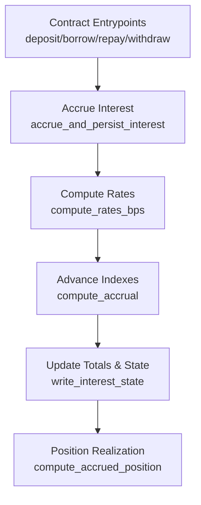
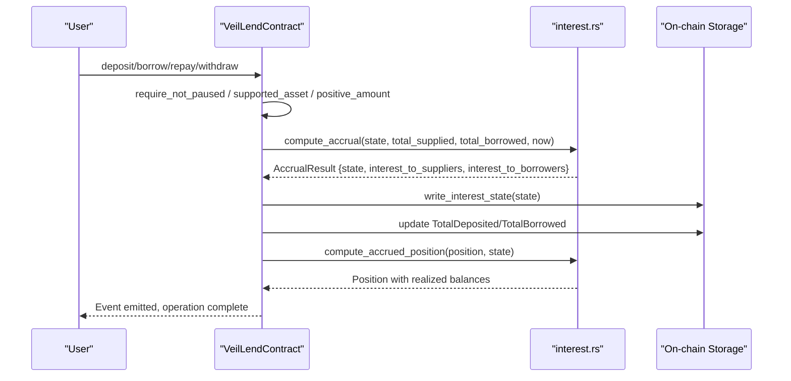
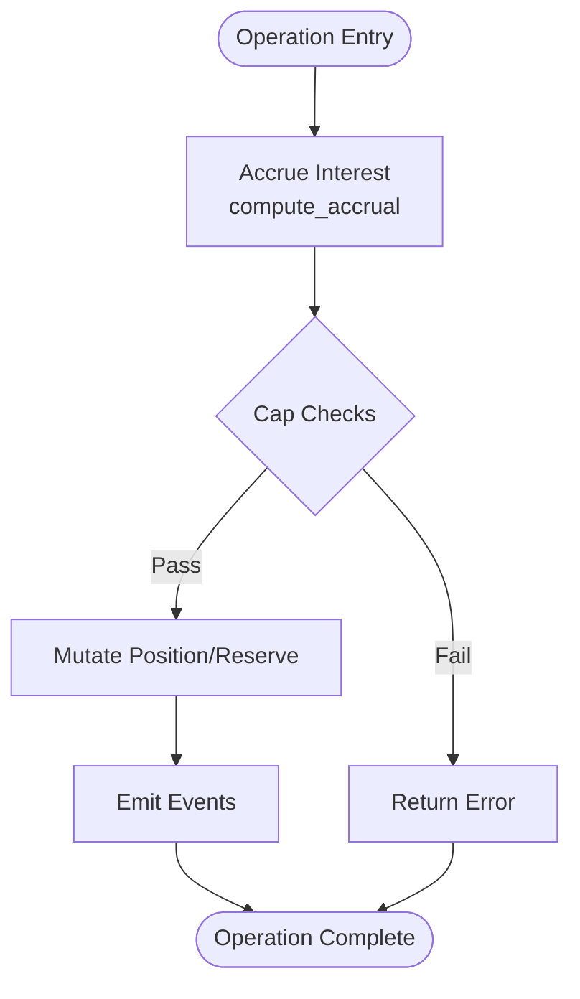
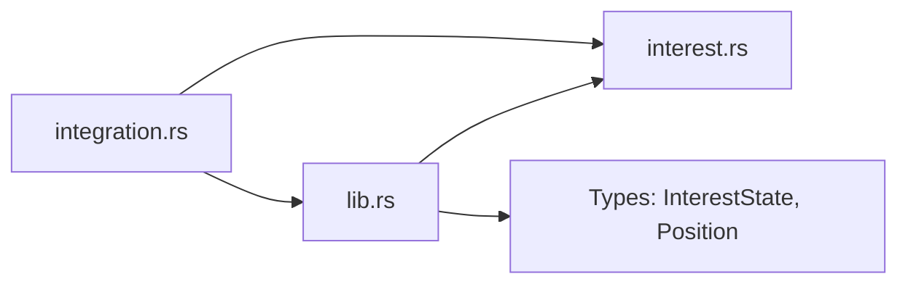

# Interest Rate Modeling

<cite>
**Referenced Files in This Document**
- [interest.rs](file://veilend-soroban/src/interest.rs)
- [lib.rs](file://veilend-soroban/src/lib.rs)
- [integration.rs](file://veilend-soroban/tests/integration.rs)
</cite>

## Table of Contents
1. [Introduction](#introduction)
2. [Project Structure](#project-structure)
3. [Core Components](#core-components)
4. [Architecture Overview](#architecture-overview)
5. [Detailed Component Analysis](#detailed-component-analysis)
6. [Dependency Analysis](#dependency-analysis)
7. [Performance Considerations](#performance-considerations)
8. [Troubleshooting Guide](#troubleshooting-guide)
9. [Conclusion](#conclusion)
10. [Appendices](#appendices)

## Introduction
This document explains the piecewise-linear interest rate model used by the protocol to compute utilization-based borrowing and supply rates. It focuses on the `compute_rates_bps` function, which derives:
- Utilization percentage (in basis points)
- Borrow rate (APR in basis points)
- Supply rate (APR in basis points)

The model enforces a 2% APR floor via BASE_RATE_BPS and adds up to an additional 20% APR as utilization approaches 100% via SLOPE_BPS. The design ensures that total interest paid by borrowers equals total interest earned by suppliers (conservation of value), with no protocol fee skim from the accrual engine.

## Project Structure
The interest rate logic is implemented in the Soroban contract module under veilend-soroban:
- interest.rs: Core rate computation, accrual over time, and position realization
- lib.rs: Contract entrypoints that call into interest accrual before mutating state
- integration.rs: End-to-end tests validating accrual behavior and conservation of value

**Diagram sources**
- [lib.rs:483-519](file://veilend-soroban/src/lib.rs#L483-L519)
- [lib.rs:521-561](file://veilend-soroban/src/lib.rs#L521-L561)
- [lib.rs:563-598](file://veilend-soroban/src/lib.rs#L563-L598)
- [lib.rs:600-639](file://veilend-soroban/src/lib.rs#L600-L639)
- [lib.rs:792-800](file://veilend-soroban/src/lib.rs#L792-L800)
- [interest.rs:29-38](file://veilend-soroban/src/interest.rs#L29-L38)
- [interest.rs:51-87](file://veilend-soroban/src/interest.rs#L51-L87)
- [interest.rs:97-120](file://veilend-soroban/src/interest.rs#L97-L120)

**Section sources**
- [interest.rs:1-221](file://veilend-soroban/src/interest.rs#L1-L221)
- [lib.rs:483-800](file://veilend-soroban/src/lib.rs#L483-L800)
- [integration.rs:283-461](file://veilend-soroban/tests/integration.rs#L283-L461)

## Core Components
- Constants
  - RATE_SCALE: Fixed-point scale for indexes
  - SECONDS_PER_YEAR: Time normalization for APR calculations
  - BASE_RATE_BPS: Minimum APR floor (2%)
  - SLOPE_BPS: Additional APR slope (up to +20%)
- Functions
  - compute_rates_bps: Derives utilization, borrow_rate_bps, and supply_rate_bps
  - compute_accrual: Advances indexes and computes interest accrued over elapsed time
  - compute_accrued_position: Realizes accrued interest into per-position balances

Key behaviors:
- Utilization = total_borrowed / total_supplied (in bps)
- borrow_rate_bps = BASE_RATE_BPS + (utilization_bps * SLOPE_BPS) / 10_000
- supply_rate_bps = borrow_rate_bps * utilization_bps / 10_000
- Accrual applies growth proportional to elapsed seconds and APR, updating indexes and totals
- Conservation of value: total interest credited to suppliers equals total interest debited to borrowers when total_supplied == total_borrowed; otherwise supplier interest never exceeds borrower interest

**Section sources**
- [interest.rs:3-14](file://veilend-soroban/src/interest.rs#L3-L14)
- [interest.rs:24-38](file://veilend-soroban/src/interest.rs#L24-L38)
- [interest.rs:40-87](file://veilend-soroban/src/interest.rs#L40-L87)
- [interest.rs:89-120](file://veilend-soroban/src/interest.rs#L89-L120)

## Architecture Overview
The accrual pipeline integrates with contract operations to ensure time-based interest is always current before balance mutations or cap checks.

**Diagram sources**
- [lib.rs:483-519](file://veilend-soroban/src/lib.rs#L483-L519)
- [lib.rs:521-561](file://veilend-soroban/src/lib.rs#L521-L561)
- [lib.rs:563-598](file://veilend-soroban/src/lib.rs#L563-L598)
- [lib.rs:600-639](file://veilend-soroban/src/lib.rs#L600-L639)
- [lib.rs:792-800](file://veilend-soroban/src/lib.rs#L792-L800)
- [interest.rs:51-87](file://veilend-soroban/src/interest.rs#L51-L87)
- [interest.rs:97-120](file://veilend-soroban/src/interest.rs#L97-L120)

## Detailed Component Analysis

### compute_rates_bps: Utilization-driven rate model
- Inputs: total_supplied, total_borrowed
- Outputs: (utilization_bps, borrow_rate_bps, supply_rate_bps)
- Logic:
  - utilization_bps = 0 if total_supplied == 0 else total_borrowed * 10_000 / total_supplied
  - borrow_rate_bps = BASE_RATE_BPS + (utilization_bps * SLOPE_BPS) / 10_000
  - supply_rate_bps = borrow_rate_bps * utilization_bps / 10_000

Mathematical formulas:
- Let U = utilization_bps / 10_000 (decimal utilization)
- Borrow APR (bps): r_borrow = BASE_RATE_BPS + U * SLOPE_BPS
- Supply APR (bps): r_supply = r_borrow * U

Economic rationale:
- BASE_RATE_BPS provides a minimum yield floor for suppliers even at low utilization
- SLOPE_BPS increases cost to borrowers as utilization rises, incentivizing balanced usage
- supply_rate_bps ties supplier yield directly to borrower costs scaled by utilization, ensuring 100% pass-through of interest income to suppliers

Example calculations (APR in percent):
- 0% utilization:
  - r_borrow = 2% + 0 * 20% = 2%
  - r_supply = 2% * 0 = 0%
- 50% utilization:
  - r_borrow = 2% + 0.5 * 20% = 12%
  - r_supply = 12% * 0.5 = 6%
- 100% utilization:
  - r_borrow = 2% + 1.0 * 20% = 22%
  - r_supply = 22% * 1.0 = 22%

These examples match test expectations and comments in the codebase.

**Section sources**
- [interest.rs:24-38](file://veilend-soroban/src/interest.rs#L24-L38)
- [interest.rs:156-187](file://veilend-soroban/src/interest.rs#L156-L187)
- [integration.rs:283-309](file://veilend-soroban/tests/integration.rs#L283-L309)

### compute_accrual: Time-based index advancement
- Computes elapsed seconds since last accrual
- Uses compute_rates_bps to get current rates based on current totals
- Applies linear growth to indexes:
  - borrow_growth = (borrow_rate_bps * RATE_SCALE * elapsed) / (10_000 * SECONDS_PER_YEAR)
  - supply_growth = (supply_rate_bps * RATE_SCALE * elapsed) / (10_000 * SECONDS_PER_YEAR)
- Updates indexes and returns interest amounts:
  - interest_to_borrowers = total_borrowed * borrow_growth / RATE_SCALE
  - interest_to_suppliers = total_supplied * supply_growth / RATE_SCALE

Idempotency:
- If elapsed == 0, returns unchanged state and zero interest

Compounding behavior:
- Each call recomputes rates from current utilization and re-anchors indexes, producing discrete compounding across calls

**Section sources**
- [interest.rs:40-87](file://veilend-soroban/src/interest.rs#L40-L87)
- [interest.rs:134-154](file://veilend-soroban/src/interest.rs#L134-L154)

### compute_accrued_position: Per-position realization
- For non-zero borrowed/deposited balances, scales them by the change in respective indexes since the position’s snapshot
- Re-anchors snapshots to current indexes so future accruals measure delta from now
- Zero balances remain zero but still update snapshots

**Section sources**
- [interest.rs:89-120](file://veilend-soroban/src/interest.rs#L89-L120)
- [interest.rs:215-256](file://veilend-soroban/src/interest.rs#L215-L256)

### Integration with contract operations
Every mutating operation (deposit, borrow, repay, withdraw) first accrues interest using current ledger timestamp and updated totals, then performs safety checks and updates positions/reserves. This ensures caps and balances reflect accurate, time-aware values.

**Diagram sources**
- [lib.rs:483-519](file://veilend-soroban/src/lib.rs#L483-L519)
- [lib.rs:521-561](file://veilend-soroban/src/lib.rs#L521-L561)
- [lib.rs:563-598](file://veilend-soroban/src/lib.rs#L563-L598)
- [lib.rs:600-639](file://veilend-soroban/src/lib.rs#L600-L639)

**Section sources**
- [lib.rs:483-639](file://veilend-soroban/src/lib.rs#L483-L639)

## Dependency Analysis
- interest.rs depends on:
  - InterestState and Position types defined in lib.rs
- lib.rs orchestrates:
  - Reading/writing InterestState and Position
  - Calling interest::compute_accrual and interest::compute_accrued_position
  - Updating TotalDeposited/TotalBorrowed after accrual and mutations
- Tests validate:
  - Known-input known-output accrual at 50% utilization
  - Conservation of value across multiple users and utilization levels
  - Idempotent accrual at same timestamp

**Diagram sources**
- [lib.rs:59-79](file://veilend-soroban/src/lib.rs#L59-L79)
- [lib.rs:792-800](file://veilend-soroban/src/lib.rs#L792-L800)
- [interest.rs:1-22](file://veilend-soroban/src/interest.rs#L1-L22)
- [integration.rs:283-461](file://veilend-soroban/tests/integration.rs#L283-L461)

**Section sources**
- [lib.rs:59-79](file://veilend-soroban/src/lib.rs#L59-L79)
- [lib.rs:792-800](file://veilend-soroban/src/lib.rs#L792-L800)
- [interest.rs:1-22](file://veilend-soroban/src/interest.rs#L1-L22)
- [integration.rs:283-461](file://veilend-soroban/tests/integration.rs#L283-L461)

## Performance Considerations
- Discrete compounding: Each accrual call recomputes rates from current utilization and advances indexes multiplicatively. This avoids continuous compounding exponentiation in a no_std i128 context while remaining accurate for typical usage patterns.
- Idempotency: Zero elapsed time yields no-op accrual, preventing redundant computations.
- Fixed-point arithmetic: Using RATE_SCALE ensures precision without floating point.
- Gas efficiency: Minimal math per accrual; heavy operations are amortized by infrequent accrual calls relative to user interactions.

[No sources needed since this section provides general guidance]

## Troubleshooting Guide
Common issues and diagnostics:
- Unexpected zero growth:
  - Ensure total_supplied > 0; otherwise utilization is zero and supply_rate is zero
  - Verify last_accrual_timestamp is not equal to current timestamp (idempotent short-circuit)
- Over-repayment errors:
  - Repaying more than accrued debt will fail; check position.borrowed after accrual
- Conservation of value checks:
  - When total_supplied == total_borrowed, interest_to_suppliers should equal interest_to_borrowers
  - Otherwise, interest_to_suppliers <= interest_to_borrowers holds

Relevant validations and tests:
- Elapsed zero is noop
- Zero supply yields zero growth despite base rate
- Known input/output growth over one year at 50% utilization
- Conservation of value between suppliers and borrowers

**Section sources**
- [interest.rs:134-154](file://veilend-soroban/src/interest.rs#L134-L154)
- [interest.rs:156-213](file://veilend-soroban/src/interest.rs#L156-L213)
- [integration.rs:344-421](file://veilend-soroban/tests/integration.rs#L344-L421)

## Conclusion
The piecewise-linear interest rate model uses a simple, transparent formula to align incentives:
- A 2% APR floor protects suppliers at low utilization
- A linear slope up to +20% APR penalizes high utilization, encouraging balanced markets
- Supplier yield tracks borrower costs scaled by utilization, ensuring full pass-through and conservation of value

The implementation is robust, idempotent, and integrated into every contract operation to maintain accurate, time-aware balances and enforce caps against real-time totals. Parameter tuning can adjust BASE_RATE_BPS and SLOPE_BPS to influence market dynamics, liquidity incentives, and risk profiles.

[No sources needed since this section summarizes without analyzing specific files]

## Appendices

### Mathematical Summary
- Utilization (decimal): U = total_borrowed / total_supplied
- Borrow APR (bps): r_borrow = BASE_RATE_BPS + U * SLOPE_BPS
- Supply APR (bps): r_supply = r_borrow * U
- Growth factors over elapsed seconds t:
  - borrow_growth = (r_borrow * RATE_SCALE * t) / (10_000 * SECONDS_PER_YEAR)
  - supply_growth = (r_supply * RATE_SCALE * t) / (10_000 * SECONDS_PER_YEAR)
- Interest accrued:
  - interest_to_borrowers = total_borrowed * borrow_growth / RATE_SCALE
  - interest_to_suppliers = total_supplied * supply_growth / RATE_SCALE

**Section sources**
- [interest.rs:24-38](file://veilend-soroban/src/interest.rs#L24-L38)
- [interest.rs:66-76](file://veilend-soroban/src/interest.rs#L66-L76)

### Example Scenarios
- 0% utilization:
  - Borrow APR: 2%; Supply APR: 0%
- 50% utilization:
  - Borrow APR: 12%; Supply APR: 6%
- 100% utilization:
  - Borrow APR: 22%; Supply APR: 22%

These scenarios are validated by tests and comments in the codebase.

**Section sources**
- [interest.rs:156-187](file://veilend-soroban/src/interest.rs#L156-L187)
- [integration.rs:283-309](file://veilend-soroban/tests/integration.rs#L283-L309)

### Parameter Tuning Guidance
- Increase BASE_RATE_BPS to raise the minimum yield floor for suppliers, improving capital attraction in low-demand environments
- Increase SLOPE_BPS to make rates more sensitive to utilization, discouraging excessive borrowing and promoting healthier utilization targets
- Monitor utilization trends and adjust parameters to balance liquidity depth with cost of borrowing
- Validate changes with tests covering 0%, 50%, and 100% utilization to ensure expected APRs and conservation of value hold

[No sources needed since this section provides general guidance]