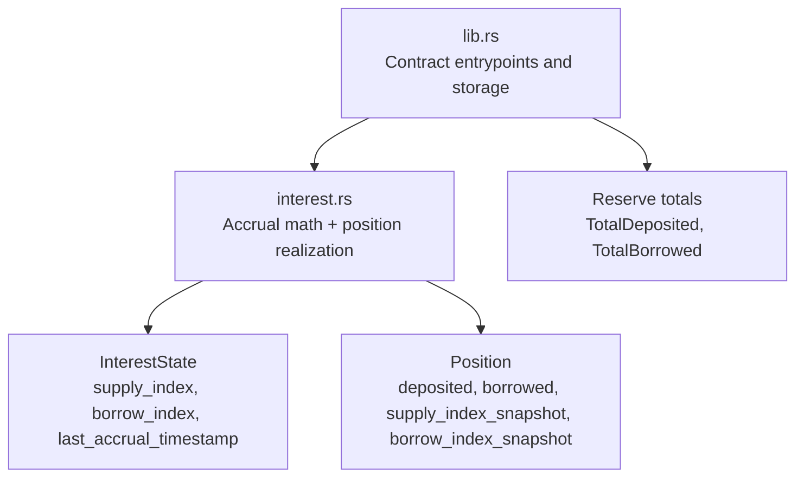
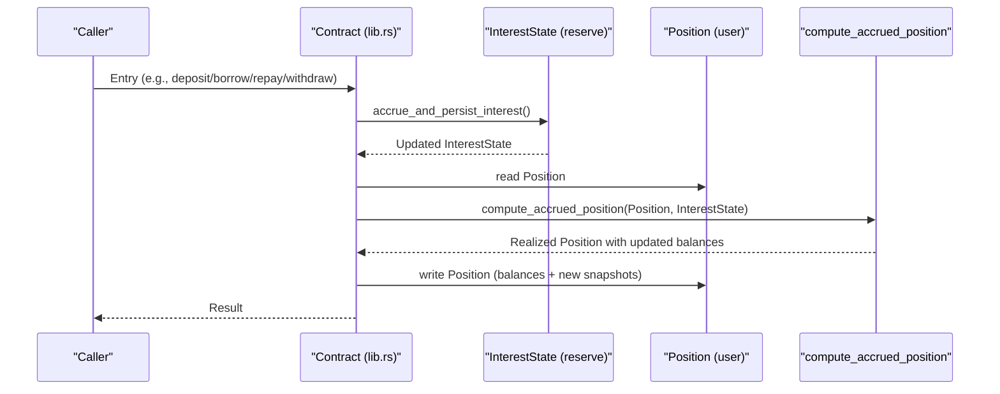
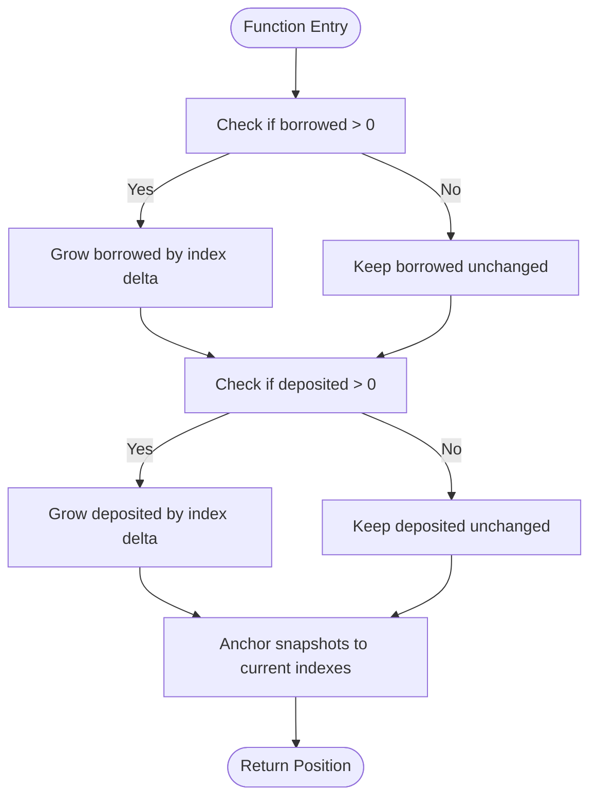
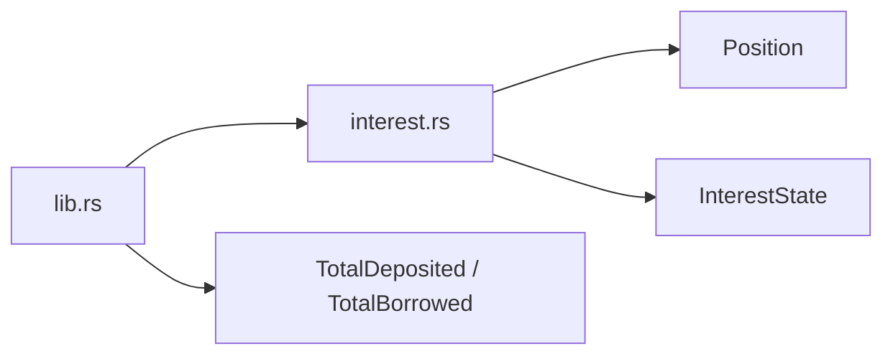

# Position Snapshotting and Realization

<cite>
**Referenced Files in This Document**
- [interest.rs](file://veilend-soroban/src/interest.rs)
- [lib.rs](file://veilend-soroban/src/lib.rs)
</cite>

## Table of Contents
1. [Introduction](#introduction)
2. [Project Structure](#project-structure)
3. [Core Components](#core-components)
4. [Architecture Overview](#architecture-overview)
5. [Detailed Component Analysis](#detailed-component-analysis)
6. [Dependency Analysis](#dependency-analysis)
7. [Performance Considerations](#performance-considerations)
8. [Troubleshooting Guide](#troubleshooting-guide)
9. [Conclusion](#conclusion)

## Introduction
This document explains how individual positions track accrued interest using snapshots and how the `compute_accrued_position` function realizes those accruals into position balances. It focuses on:
- How each `Position` stores snapshots of reserve-level indexes to measure growth since last touch
- The exact formula used to realize new balances from index deltas
- Why zero-balance positions still update their snapshots without growing balances
- How reserve-level accruals relate to per-position realization
- Edge cases such as initial creation, balance modifications, and no-op behavior for zero balances

## Project Structure
The relevant logic is implemented in a Soroban contract split across two files:
- Contract types and orchestration live in the main library file
- Interest math and position realization are encapsulated in a dedicated module

**Diagram sources**
- [lib.rs:59-79](file://veilend-soroban/src/lib.rs#L59-L79)
- [interest.rs:1-22](file://veilend-soroban/src/interest.rs#L1-L22)

**Section sources**
- [lib.rs:59-79](file://veilend-soroban/src/lib.rs#L59-L79)
- [interest.rs:1-22](file://veilend-soroban/src/interest.rs#L1-L22)

## Core Components
- Position: Stores current user balances and the reserve-level indexes at the time of last realization. These snapshots enable computing growth between any two points in time.
- InterestState: Per-asset reserve state that tracks continuously growing supply and borrow indexes over time.
- compute_accrual: Advances reserve indexes based on elapsed time and utilization; updates aggregate totals.
- compute_accrued_position: Realizes accrued interest into a specific position’s balances using its stored snapshots and then re-anchors snapshots to the current reserve indexes.

Key responsibilities:
- Reserve-level accrual happens once per transaction via `accrue_and_persist_interest`, which advances `InterestState` and updates global totals.
- Per-position realization happens when a position is touched (deposit, withdraw, borrow, repay), ensuring balances reflect all accrued interest up to that point.

**Section sources**
- [lib.rs:782-827](file://veilend-soroban/src/lib.rs#L782-L827)
- [interest.rs:51-87](file://veilend-soroban/src/interest.rs#L51-L87)
- [interest.rs:89-120](file://veilend-soroban/src/interest.rs#L89-L120)

## Architecture Overview
The system separates reserve-level accrual from per-position realization:
- Reserve accrual computes new indexes and aggregates interest added to total supplied/borrowed
- Position realization uses those indexes to grow individual balances proportionally to the index delta since the position’s last snapshot

**Diagram sources**
- [lib.rs:782-827](file://veilend-soroban/src/lib.rs#L782-L827)
- [interest.rs:89-120](file://veilend-soroban/src/interest.rs#L89-L120)

## Detailed Component Analysis

### Data Model: Position and InterestState
- Position fields:
  - deposited: current supply-side balance
  - borrowed: current borrow-side balance
  - supply_index_snapshot: reserve supply index at last realization
  - borrow_index_snapshot: reserve borrow index at last realization
- InterestState fields:
  - supply_index: reserve-level supply index that grows over time
  - borrow_index: reserve-level borrow index that grows over time
  - last_accrual_timestamp: last time reserve indexes were advanced

These structures together allow proportional accrual: a position’s balance grows by the same factor as the reserve index since the position was last touched.

**Section sources**
- [lib.rs:59-79](file://veilend-soroban/src/lib.rs#L59-L79)

### Reserve Accrual: compute_accrual
- Computes utilization-based rates and derives growth factors for supply and borrow indexes over elapsed time
- Advances reserve indexes and records interest added to aggregate totals
- Idempotent: if no time has elapsed, returns unchanged state

This step ensures reserve indexes always reflect the latest time and utilization before any position is realized.

**Section sources**
- [interest.rs:51-87](file://veilend-soroban/src/interest.rs#L51-L87)

### Position Realization: compute_accrued_position
Purpose:
- Convert reserve-level index growth into per-position balance growth
- Re-anchor position snapshots to current reserve indexes so future accruals measure from “now”

Formula:
- For non-zero balances:
  - new_balance = stored_balance + stored_balance * (current_index - snapshot_index) / snapshot_index
  - Equivalently: new_balance = stored_balance * current_index / snapshot_index
- For zero balances:
  - No growth computation occurs; balance remains zero
  - Snapshots are still updated to current indexes to avoid stale deltas later

Behavior:
- If position.borrowed > 0, apply borrow index delta to borrowed balance
- If position.deposited > 0, apply supply index delta to deposited balance
- Always set supply_index_snapshot and borrow_index_snapshot to current reserve indexes

Edge cases:
- Zero balance: no arithmetic growth, but snapshots update (no-op for balances)
- Initial position creation: snapshots start at current reserve indexes, so first accrual measures from creation time
- Partial periods: because accrual is time-proportional, multiple touches correctly compound via index ratios

**Section sources**
- [interest.rs:89-120](file://veilend-soroban/src/interest.rs#L89-L120)

### Integration Points: When Realization Happens
- Every entrypoint that mutates or reads reserve-related balances calls reserve accrual first
- After accrual, any touched position is realized against the returned InterestState
- Read-only views simulate accrual to present live balances without writing state

This guarantees that caps and balances are enforced and reported against up-to-date reserves.

**Section sources**
- [lib.rs:782-827](file://veilend-soroban/src/lib.rs#L782-L827)

### Examples: Position State Evolution Across Accrual Cycles
Assume RATE_SCALE represents 1.0x. Indexes start at RATE_SCALE.

Cycle 1: Time advances, reserve accrues
- Reserve indexes increase due to elapsed time and utilization
- Example: supply_index becomes 1.06×, borrow_index becomes 1.12×

Cycle 2: User deposits 1000 units
- Before deposit, realize existing position (if any) against current indexes
- New position created with snapshots equal to current indexes
- Deposited balance recorded as 1000

Cycle 3: Time advances again, reserve accrues further
- Indexes continue to grow (e.g., supply_index 1.12×, borrow_index 1.25×)

Cycle 4: User withdraws part of deposit
- Realize position: deposited grows proportionally to supply index ratio since last snapshot
- Withdraw requested amount from realized balance
- Update snapshots to current indexes

Cycle 5: Borrower takes loan
- Realize borrower’s position: borrowed grows proportionally to borrow index ratio since last snapshot
- Record new borrowed amount with snapshots at current indexes

Cycle 6: Repay reduces debt
- Realize position to include accrued interest
- Repay amount subtracted from realized borrowed balance
- Update snapshots to current indexes

These cycles demonstrate:
- Proportional growth via index ratios
- Correct handling of partial periods
- Preservation of accrual correctness across multiple touches

[No sources needed since this section provides conceptual examples]

### Relationship Between Reserve-Level Indexes and Individual Positions
- Reserve indexes represent the cumulative growth factor for all participants
- Each position’s snapshot captures the index level at last touch
- Realization applies the same growth factor to the position’s balance as applied to the reserve totals
- This ensures conservation of value: interest paid by borrowers equals interest earned by suppliers (subject to utilization model)

**Section sources**
- [interest.rs:51-87](file://veilend-soroban/src/interest.rs#L51-L87)
- [interest.rs:89-120](file://veilend-soroban/src/interest.rs#L89-L120)

### Flowchart: Realization Logic in compute_accrued_position

**Diagram sources**
- [interest.rs:97-120](file://veilend-soroban/src/interest.rs#L97-L120)

## Dependency Analysis
- lib.rs defines Position and InterestState and orchestrates accrual and position touches
- interest.rs implements the accrual math and position realization
- Entry points call reserve accrual first, then realize positions as needed

**Diagram sources**
- [lib.rs:59-79](file://veilend-soroban/src/lib.rs#L59-L79)
- [interest.rs:1-22](file://veilend-soroban/src/interest.rs#L1-L22)

**Section sources**
- [lib.rs:782-827](file://veilend-soroban/src/lib.rs#L782-L827)
- [interest.rs:51-120](file://veilend-soroban/src/interest.rs#L51-L120)

## Performance Considerations
- compute_accrued_position performs constant-time arithmetic per position touch
- Zero-balance branches avoid unnecessary multiplication/division
- Reserve accrual runs once per transaction regardless of number of positions touched
- Using fixed-point arithmetic avoids floating-point overhead and maintains precision

[No sources needed since this section provides general guidance]

## Troubleshooting Guide
Common issues and checks:
- Unexpected balance growth: verify that reserve accrual ran before position realization
- Zero balance not growing: expected behavior; zero balances do not accrue until modified
- Stale snapshots: ensure snapshots are always updated after realization
- Off-by-one errors: confirm index calculations use consistent scaling and integer division semantics

Verification steps:
- Confirm reserve indexes increased as expected for elapsed time and utilization
- Check that position snapshots match reserve indexes after realization
- Validate that realized balances equal stored_balance * current_index / snapshot_index

**Section sources**
- [interest.rs:89-120](file://veilend-soroban/src/interest.rs#L89-L120)
- [lib.rs:782-827](file://veilend-soroban/src/lib.rs#L782-L827)

## Conclusion
The Veilend contract achieves accurate, efficient interest accrual by:
- Maintaining reserve-level indexes that grow over time based on utilization
- Storing per-position snapshots of those indexes to measure growth since last touch
- Realizing balances using a simple proportional formula that scales with index deltas
- Handling zero balances gracefully while keeping snapshots current for future accruals

This design ensures fairness, correctness, and performance across many users and assets.