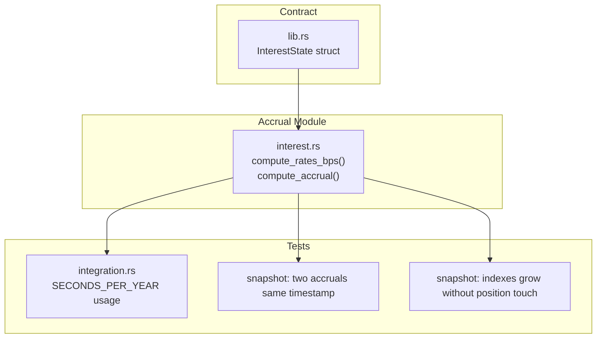
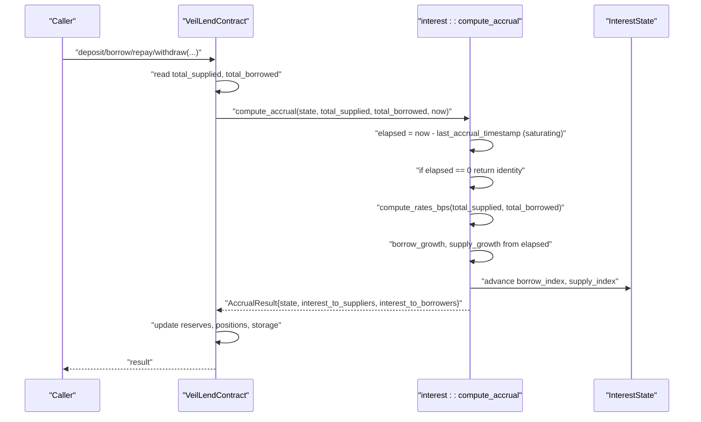
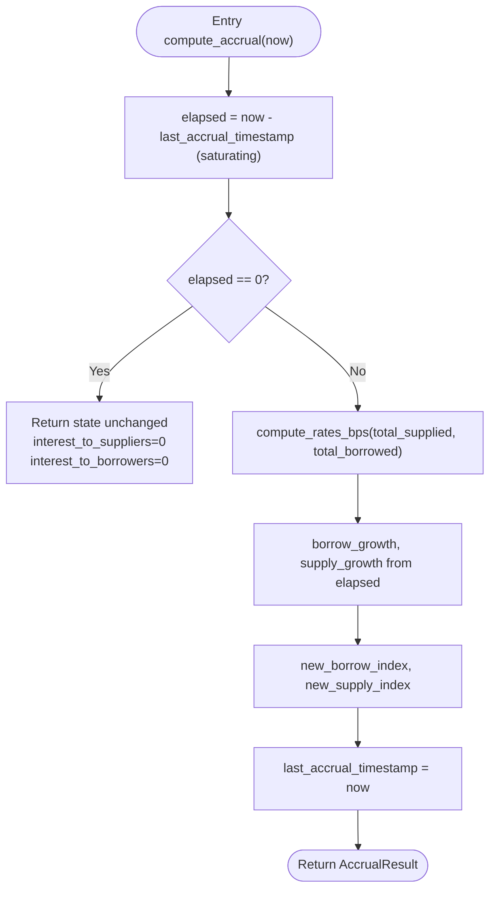
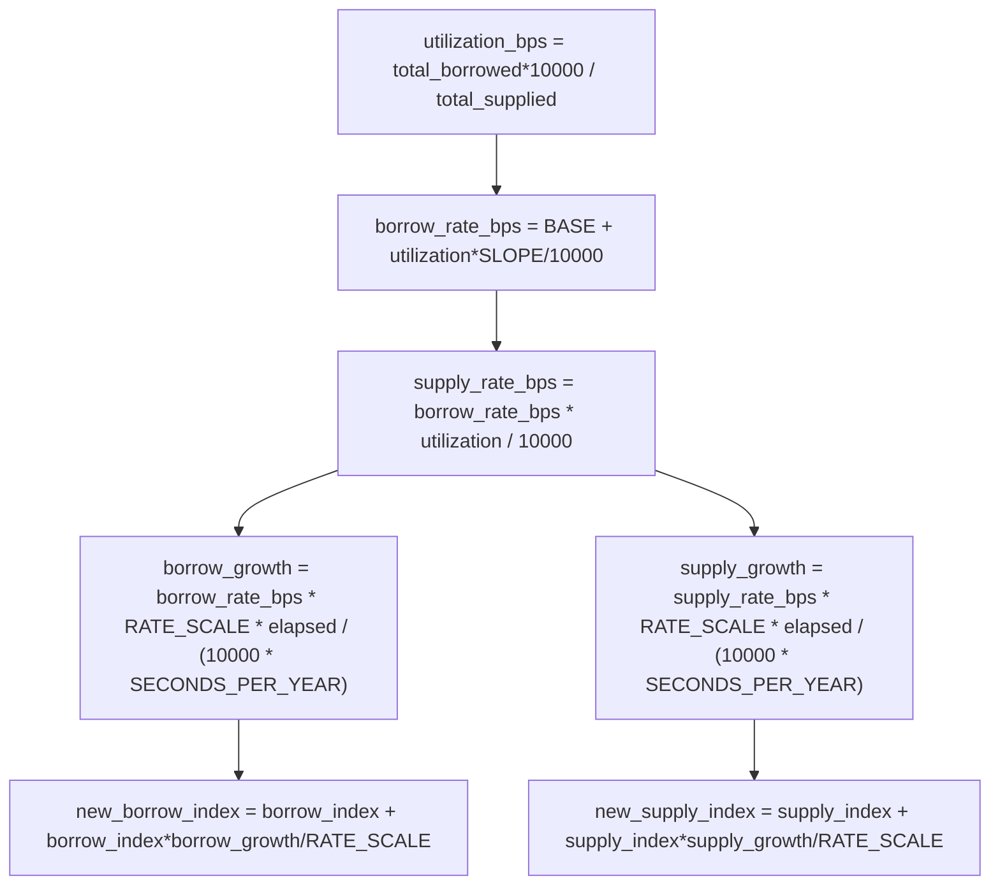
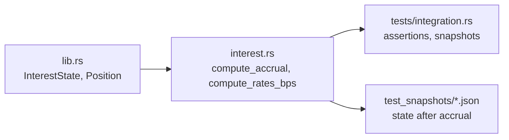
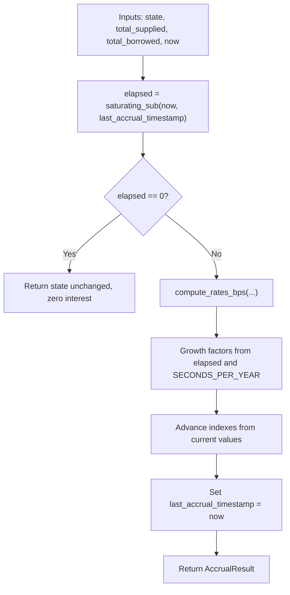

# Time-Based Accrual Mechanism

<cite>
**Referenced Files in This Document**
- [interest.rs](file://veilend-soroban/src/interest.rs)
- [lib.rs](file://veilend-soroban/src/lib.rs)
- [integration.rs](file://veilend-soroban/tests/integration.rs)
- [test_two_accrual_calls_at_same_timestamp_are_idempotent.1.json](file://veilend-soroban/test_snapshots/test_two_accrual_calls_at_same_timestamp_are_idempotent.1.json)
- [test_accrue_interest_grows_indexes_with_no_position_touch.1.json](file://veilend-soroban/test_snapshots/test_accrue_interest_grows_indexes_with_no_position_touch.1.json)
</cite>

## Table of Contents
1. [Introduction](#introduction)
2. [Project Structure](#project-structure)
3. [Core Components](#core-components)
4. [Architecture Overview](#architecture-overview)
5. [Detailed Component Analysis](#detailed-component-analysis)
6. [Dependency Analysis](#dependency-analysis)
7. [Performance Considerations](#performance-considerations)
8. [Troubleshooting Guide](#troubleshooting-guide)
9. [Conclusion](#conclusion)
10. [Appendices](#appendices)

## Introduction
This document explains the time-based accrual mechanism implemented by the compute_accrual function. It covers how elapsed time is computed safely using saturating subtraction, how InterestState indexes advance based on current utilization and time delta, the compounding behavior across calls, and the idempotency guarantee when no time has passed. It also documents the role of SECONDS_PER_YEAR in annualized rate calculations and provides performance guidance for frequent accrual calls.

## Project Structure
The accrual logic lives in a dedicated module with supporting types defined in the contract’s main module. Tests and integration scenarios validate behavior over time and across multiple accrual calls.

**Diagram sources**
- [lib.rs:70-79](file://veilend-soroban/src/lib.rs#L70-L79)
- [interest.rs:24-87](file://veilend-soroban/src/interest.rs#L24-L87)
- [integration.rs:1-10](file://veilend-soroban/tests/integration.rs#L1-L10)
- [test_two_accrual_calls_at_same_timestamp_are_idempotent.1.json:466-535](file://veilend-soroban/test_snapshots/test_two_accrual_calls_at_same_timestamp_are_idempotent.1.json#L466-L535)
- [test_accrue_interest_grows_indexes_with_no_position_touch.1.json:463-532](file://veilend-soroban/test_snapshots/test_accrue_interest_grows_indexes_with_no_position_touch.1.json#L463-L532)

**Section sources**
- [lib.rs:70-79](file://veilend-soroban/src/lib.rs#L70-L79)
- [interest.rs:1-22](file://veilend-soroban/src/interest.rs#L1-L22)

## Core Components
- InterestState: Stores supply_index, borrow_index, and last_accrual_timestamp to anchor accrual growth and track the last time interest was accrued.
- compute_rates_bps: Derives utilization (bps), borrow_rate_bps, and supply_rate_bps from total_supplied and total_borrowed. Supply rate is derived so that borrower-paid interest equals supplier-earned interest (no protocol fee skim).
- compute_accrual: Advances indexes and last_accrual_timestamp based on elapsed time and current rates; returns interest amounts to add to aggregate totals.
- AccrualResult: Carries updated state and computed interest to suppliers/borrowers.

Key constants:
- RATE_SCALE: Fixed-point scale for index math.
- SECONDS_PER_YEAR: Normalizes per-second growth into an annualized basis.
- BASE_RATE_BPS and SLOPE_BPS: Define the piecewise-linear rate curve.

**Section sources**
- [lib.rs:70-79](file://veilend-soroban/src/lib.rs#L70-L79)
- [interest.rs:3-14](file://veilend-soroban/src/interest.rs#L3-L14)
- [interest.rs:16-22](file://veilend-soroban/src/interest.rs#L16-L22)
- [interest.rs:24-38](file://veilend-soroban/src/interest.rs#L24-L38)
- [interest.rs:40-87](file://veilend-soroban/src/interest.rs#L40-L87)

## Architecture Overview
The accrual flow integrates with contract operations that touch deposits or borrows. Each such operation reads current totals, invokes compute_accrual to bring indexes up to date, then applies changes and persists new aggregates and state.

**Diagram sources**
- [interest.rs:40-87](file://veilend-soroban/src/interest.rs#L40-L87)
- [lib.rs:70-79](file://veilend-soroban/src/lib.rs#L70-L79)

## Detailed Component Analysis

### Elapsed Time and Idempotency
- Elapsed computation uses saturating subtraction to avoid underflow if timestamps are out-of-order or equal. If elapsed is zero, the function returns the original state unchanged and zero interest, ensuring idempotency for duplicate or stale calls at the same timestamp.
- The last_accrual_timestamp is only advanced when elapsed > 0, preventing double-counting.

**Diagram sources**
- [interest.rs:51-87](file://veilend-soroban/src/interest.rs#L51-L87)

**Section sources**
- [interest.rs:51-87](file://veilend-soroban/src/interest.rs#L51-L87)

### Rate Model and Index Advancement
- Utilization (bps) is derived from total_borrowed / total_supplied. Borrow rate starts at a base and increases linearly with utilization. Supply rate is borrow_rate * utilization to ensure conservation of value between borrowers and suppliers.
- Growth factors are proportional to elapsed seconds normalized by SECONDS_PER_YEAR and scaled by RATE_SCALE.
- Indexes compound multiplicatively via additive increments relative to their current values, anchored at last_accrual_timestamp.

**Diagram sources**
- [interest.rs:24-38](file://veilend-soroban/src/interest.rs#L24-L38)
- [interest.rs:66-73](file://veilend-soroban/src/interest.rs#L66-L73)

**Section sources**
- [interest.rs:24-38](file://veilend-soroban/src/interest.rs#L24-L38)
- [interest.rs:66-73](file://veilend-soroban/src/interest.rs#L66-L73)

### Compounding Behavior Across Calls
- Each call recomputes rates from the current utilization and advances indexes from their current values. This yields discrete compounding: subsequent accruals build on previously accrued indexes rather than simple interest on principal alone.
- Because indexes are re-anchored to the current time on each successful accrual, long gaps accumulate proportionally to elapsed time, while short intervals compound incrementally.

**Section sources**
- [interest.rs:40-47](file://veilend-soroban/src/interest.rs#L40-L47)
- [interest.rs:72-83](file://veilend-soroban/src/interest.rs#L72-L83)

### Examples Over Different Time Periods
- Zero elapsed time: No change to indexes or totals; idempotent behavior confirmed by tests.
- One year elapsed: Growth factors align with annualized rates derived from BASE_RATE_BPS and SLOPE_BPS at given utilization.
- Multiple accruals at the same timestamp: Only one accrual takes effect; duplicates are ignored.

Evidence in tests and snapshots:
- Zero-time noop and yearly growth assertions validate the formulaic behavior.
- Snapshot files show InterestState.last_accrual_timestamp advancing and indexes growing after accruals, even without touching positions.

**Section sources**
- [interest.rs:134-154](file://veilend-soroban/src/interest.rs#L134-L154)
- [interest.rs:156-187](file://veilend-soroban/src/interest.rs#L156-L187)
- [test_two_accrual_calls_at_same_timestamp_are_idempotent.1.json:466-535](file://veilend-soroban/test_snapshots/test_two_accrual_calls_at_same_timestamp_are_idempotent.1.json#L466-L535)
- [test_accrue_interest_grows_indexes_with_no_position_touch.1.json:463-532](file://veilend-soroban/test_snapshots/test_accrue_interest_grows_indexes_with_no_position_touch.1.json#L463-L532)

### Relationship Between SECONDS_PER_YEAR and Annualized Rates
- SECONDS_PER_YEAR normalizes per-second growth to an annual basis. Growth factors are computed as (rate_bps * elapsed) / (10000 * SECONDS_PER_YEAR), effectively scaling APR to the fraction of a year represented by elapsed seconds.
- Integration tests define SECONDS_PER_YEAR consistently to assert yearly accrual behavior.

**Section sources**
- [interest.rs:7](file://veilend-soroban/src/interest.rs#L7)
- [interest.rs:69-70](file://veilend-soroban/src/interest.rs#L69-L70)
- [integration.rs:5](file://veilend-soroban/tests/integration.rs#L5)

## Dependency Analysis
- interest.rs depends on InterestState and Position types defined in lib.rs.
- Contract methods read/write InterestState and use compute_accrual to update it before applying user-facing operations.
- Tests reference SECONDS_PER_YEAR and validate accrual outcomes through snapshots.

**Diagram sources**
- [lib.rs:70-79](file://veilend-soroban/src/lib.rs#L70-L79)
- [interest.rs:1-22](file://veilend-soroban/src/interest.rs#L1-L22)
- [integration.rs:1-10](file://veilend-soroban/tests/integration.rs#L1-L10)

**Section sources**
- [lib.rs:70-79](file://veilend-soroban/src/lib.rs#L70-L79)
- [interest.rs:1-22](file://veilend-soroban/src/interest.rs#L1-L22)

## Performance Considerations
- Frequent accrual calls with small deltas: Each call performs constant-time arithmetic and may write state. To minimize overhead:
  - Batch operations where possible to reduce repeated accrual invocations.
  - Ensure callers pass accurate ledger timestamps to avoid redundant work.
  - Leverage idempotency: duplicate calls at the same timestamp are cheap no-ops.
- Large time gaps: Growth scales linearly with elapsed seconds; ensure sufficient precision in fixed-point math (already handled by i128 and RATE_SCALE).
- Storage writes: Each successful accrual updates last_accrual_timestamp and indexes; consider coalescing multiple user actions within a single transaction to limit writes.

[No sources needed since this section provides general guidance]

## Troubleshooting Guide
- Duplicate accrual at same timestamp: Verify that last_accrual_timestamp matches now; compute_accrual will return zero interest and leave state unchanged.
- Unexpected zero growth: Check if total_supplied is zero; in that case utilization is zero and supply growth is zero.
- Timestamp anomalies: Saturating subtraction prevents underflow; if now < last_accrual_timestamp, elapsed becomes zero and accrual is skipped.

**Section sources**
- [interest.rs:51-64](file://veilend-soroban/src/interest.rs#L51-L64)
- [interest.rs:145-154](file://veilend-soroban/src/interest.rs#L145-L154)

## Conclusion
The compute_accrual function implements a robust, time-based accrual mechanism that:
- Safely computes elapsed time using saturating subtraction.
- Advances InterestState indexes based on current utilization and time delta.
- Ensures idempotency for duplicate or stale timestamps.
- Achieves discrete compounding by re-anchoring indexes on each successful accrual.
- Uses SECONDS_PER_YEAR to normalize APR to elapsed periods accurately.

This design balances correctness, simplicity, and efficiency in a constrained environment while preserving conservation of value between borrowers and suppliers.

## Appendices

### Data Flow Summary

**Diagram sources**
- [interest.rs:51-87](file://veilend-soroban/src/interest.rs#L51-L87)